#  052：巴斯模型 📊

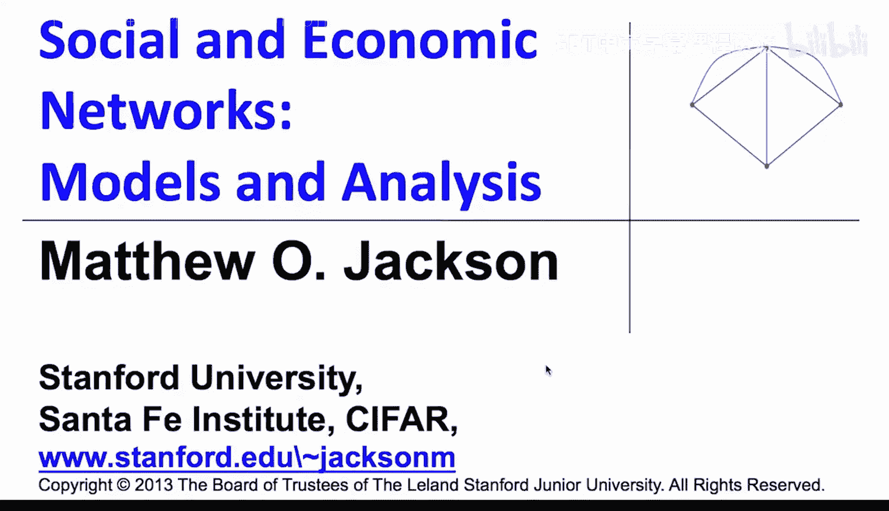

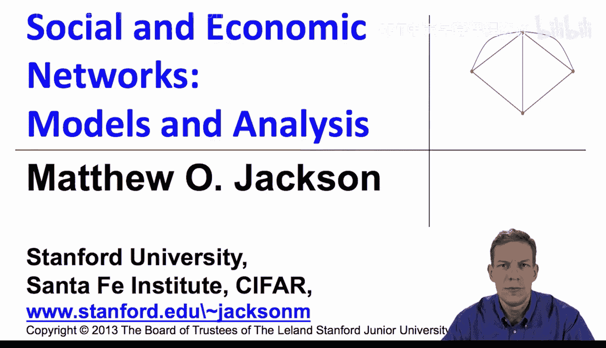

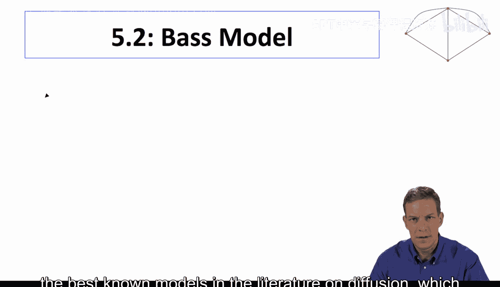

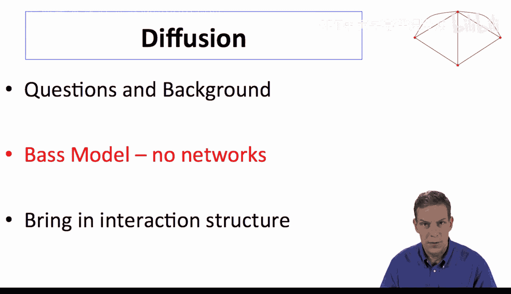

在本节课中，我们将学习扩散理论中一个最著名的模型——巴斯模型。这个模型在市场营销等领域应用广泛，用于理解新产品、思想或行为的传播过程。我们将了解其核心假设、关键参数以及它如何产生经典的S形扩散曲线。

---

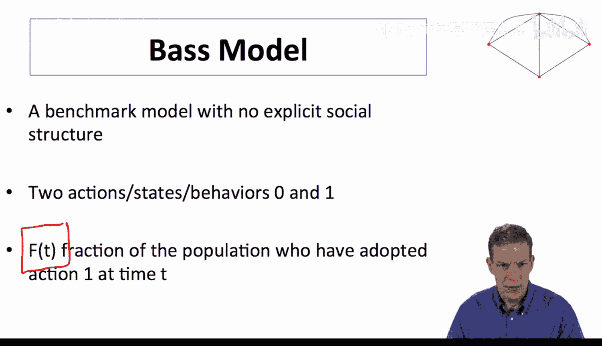

上一节我们介绍了扩散的背景和一些基本问题，本节中我们来看看巴斯模型的具体结构。巴斯模型的一个特点是，它并不显式地包含网络结构，而是将社会互动作为背景因素。

巴斯模型之所以重要，是因为它是一个基准模型。它结构简洁明了，能够产生我们之前看到的S形曲线。模型追踪两种状态：未采纳（状态0）和已采纳（状态1）。随着时间的推移，个体会从状态0单向移动到状态1。我们关注的是在时间T时，已采纳的个体比例F(T)。所有人都从状态0开始，随着时间的推移，一部分人会移动到状态1。

---

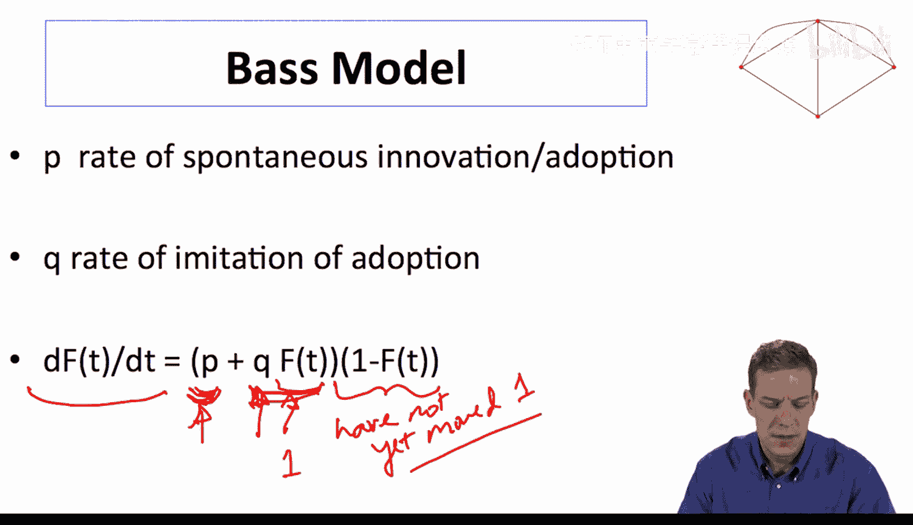

巴斯模型有两个关键参数：
*   **P**：自发创新或采纳率。这部分采纳行为独立于社会中的其他因素。
*   **Q**：模仿率。这部分采纳行为依赖于已采纳个体的影响。

模型的核心是一个简单的微分方程，描述了采纳比例F(T)随时间的变化率：

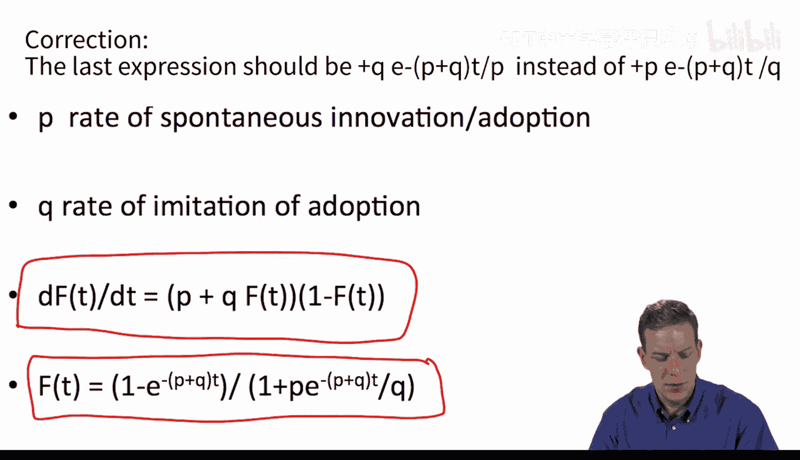

**dF(T)/dt = [P + Q * F(T)] * [1 - F(T)]**

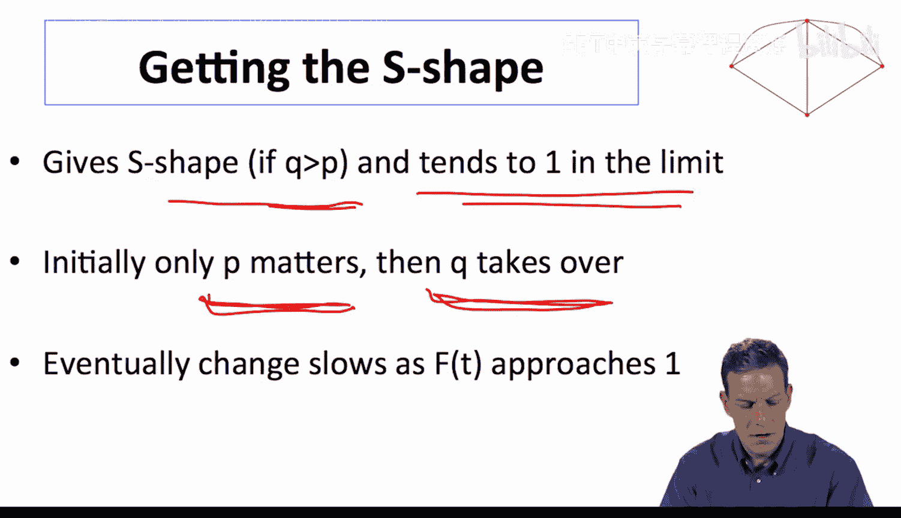

这个方程非常直观。在任何时间点，可能发生改变的人是那些尚未采纳的人，即 `[1 - F(T)]`。他们改变的概率由两部分组成：一部分是自发的概率 `P`，另一部分是模仿已采纳人群的概率 `Q * F(T)`。

---

当我们求解这个微分方程（初始条件为F(0)=0）时，可以得到F(T)的解析表达式。显然，P和Q的值越大，在任何时间点的采纳比例也越高，扩散速度越快。

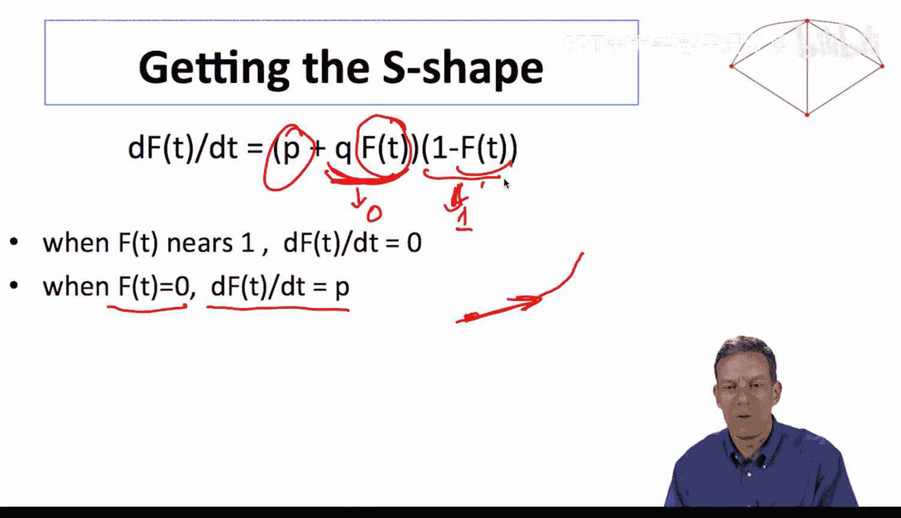

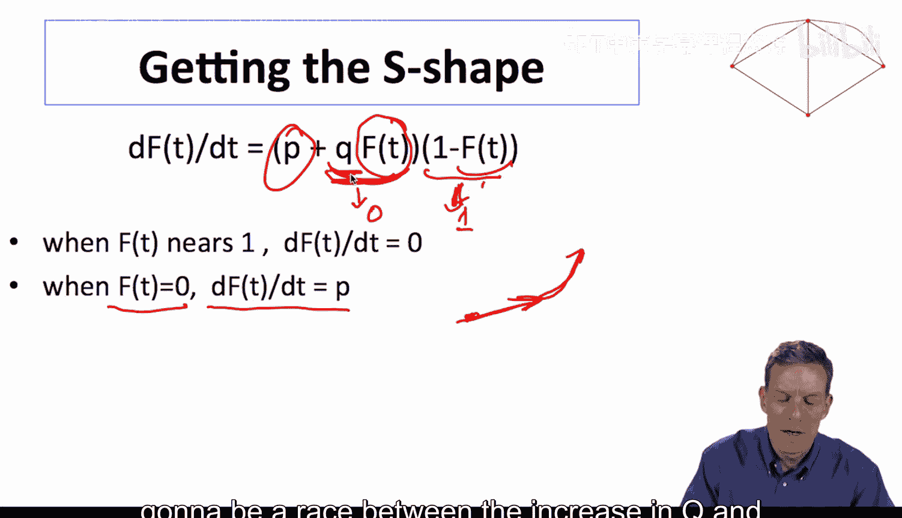

以下是该模型的一些重要特性，也是它被广泛使用的原因：

首先，如果Q > P，模型最终会产生S形曲线，并随着时间推移趋近于1。其动态过程可以这样理解：初期，采纳主要依靠自发参数P；随着采纳者增多，模仿参数Q的作用开始显现并加速扩散；最后，当未采纳者所剩无几时，扩散速度会放缓。

我们可以通过分析初始阶段来理解S形曲线的形成。初始斜率是P。要判断扩散是否加速（即曲线是否凸起），我们需要看在一个很小的采纳比例ε时，变化率是否大于P。计算表明，只有当Q > P时，初始阶段才会加速，从而形成S形曲线。如果P > Q，曲线从一开始就是凹的，不会出现典型的S形加速增长阶段。

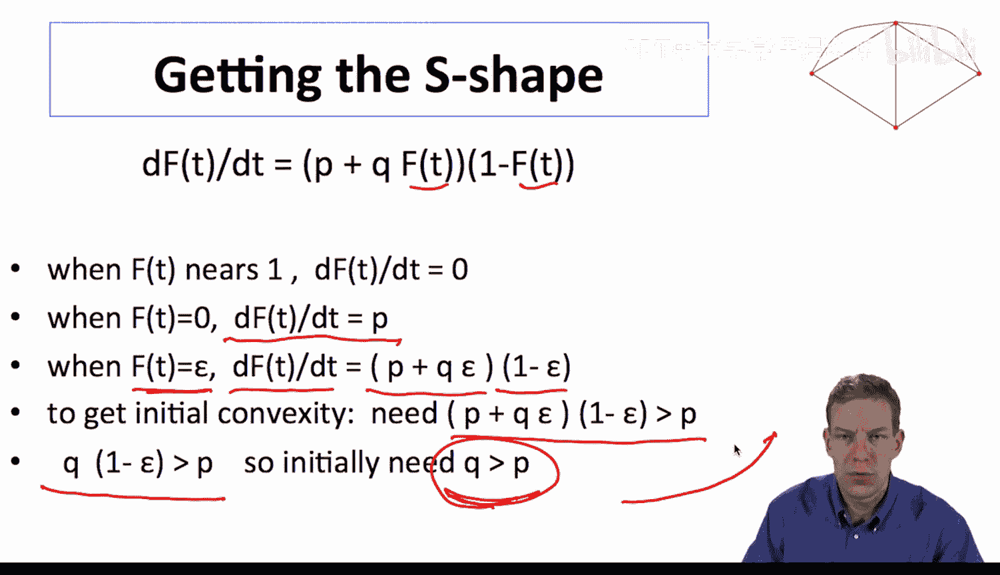

---

巴斯模型被广泛应用的一个重要原因是其简洁性。只需初期（如前几周）的采纳数据，就可以估计出P和Q参数，进而预测整个扩散过程的全貌。例如，通过一部新电影首周和次周的票房，就可以预测其总票房潜力和生命周期。

当然，基础巴斯模型可以进一步丰富，例如考虑并非所有人最终都会采纳（上限不是100%），或人群存在异质性等。这些扩展使其预测更加精准。

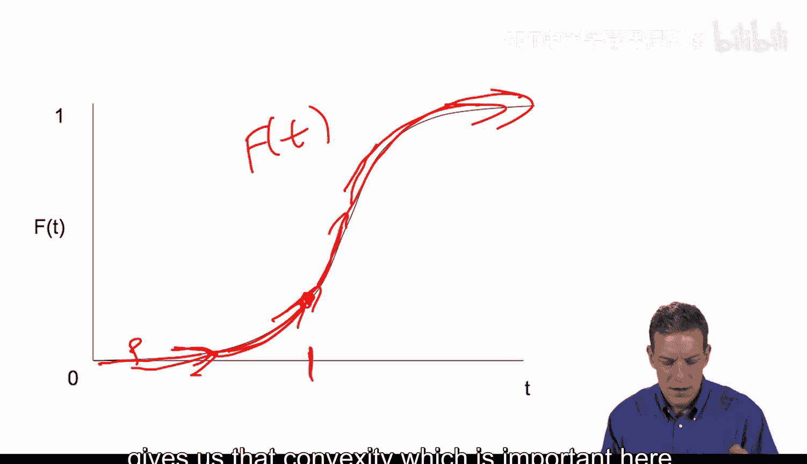

---

本节课中我们一起学习了巴斯模型。它是一个简洁而强大的工具，通过自发采纳和社交模仿两个核心机制，解释了S形扩散曲线的形成。

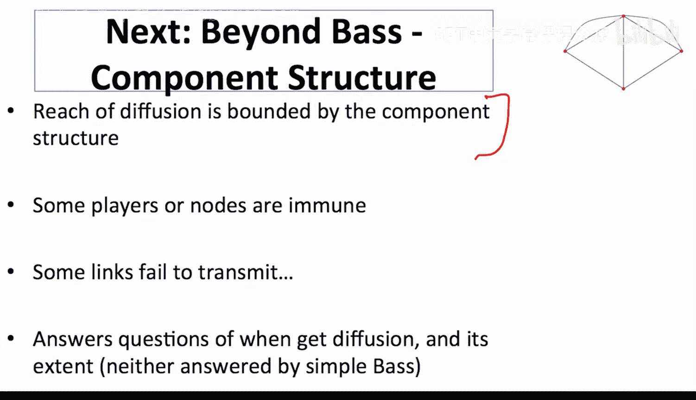

然而，巴斯模型没有考虑网络结构。在现实中，扩散的范围可能受限于网络的连通组件，某些个体可能对传播“免疫”，或连接之间的传播概率不同。为了回答“扩散何时发生”以及“扩散范围有多大”这类更精细的问题，我们需要引入网络结构来丰富扩散模型。这正是我们下一节将要探讨的内容。