#  053：随机网络上的扩散 🧠

在本节课中，我们将学习扩散过程，并探讨网络结构如何影响扩散的传播范围与可能性。我们将从简单的随机网络模型开始，理解其连通分支结构，并计算巨分支的大小，从而分析扩散的动力学。

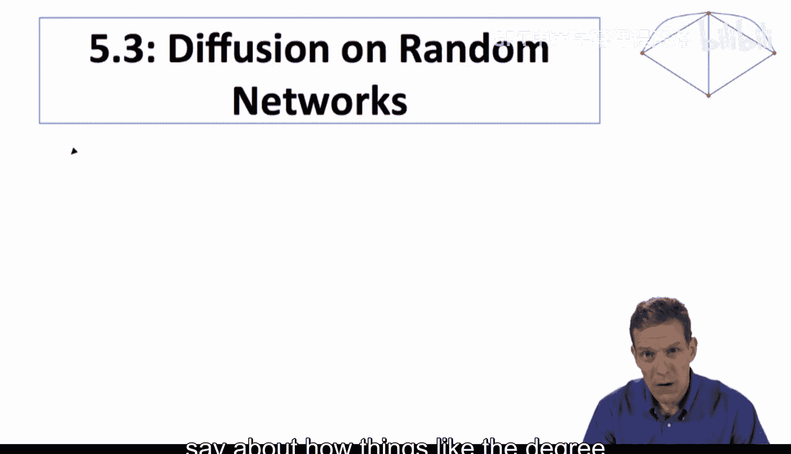

---

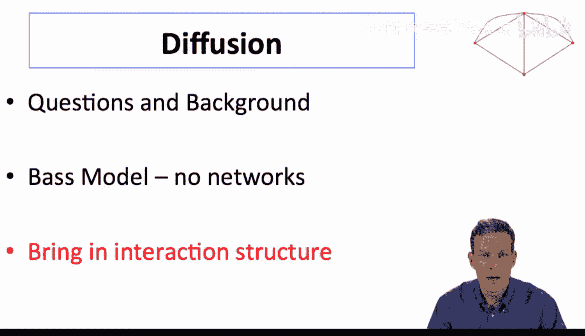

上一节我们介绍了基本的扩散模型，本节中我们来看看如何将网络结构引入扩散分析。核心思想是，扩散发生在由个体（节点）及其互动关系（连边）构成的网络中。定义网络时，关键在于确定哪些个体之间存在传播的可能性。例如，在流感传播中，连接表示“可能感染”；在新技术传播中，连接表示“可能告知”。

我们将做出一个重要简化：假设每条连边上的传播概率是独立且相同的。虽然现实中互动强度可能不同，但此简化有助于我们建立基础模型。我们将探讨的问题包括：感染何时会大规模爆发？扩散范围有多大？最早被感染的是哪些人？网络分析将帮助我们回答这些问题。

理解网络的**连通分支**结构是回答这些问题的核心。扩散的传播范围将由那些“易感节点”和“有效传播连边”构成的子图的分支结构决定。如果初始感染者位于一个巨大的连通分支（巨分支）中，扩散就可能广泛传播；如果位于小分支中，扩散则会非常有限。

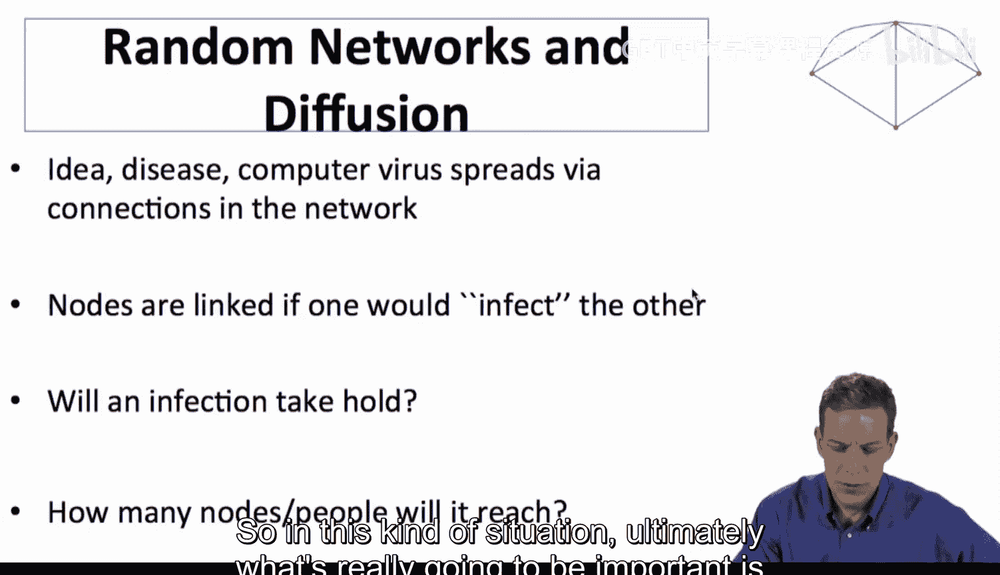

以下是分析扩散时需要考虑的连通分支结构示意图：

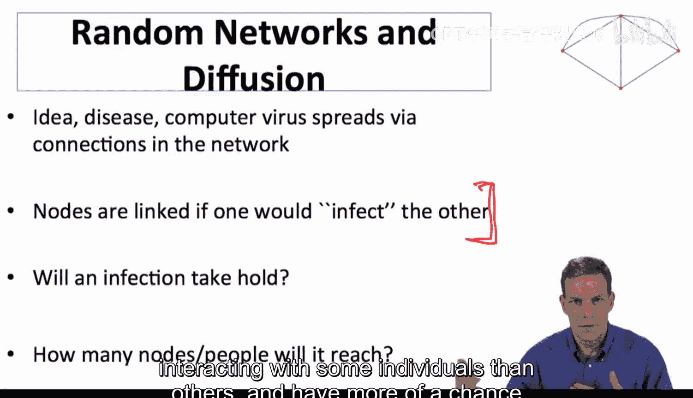

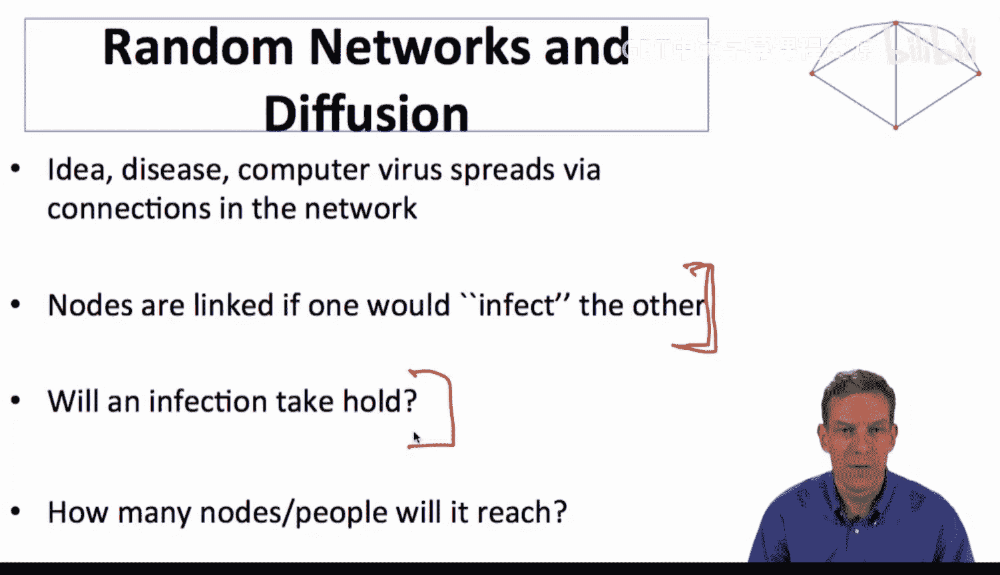

因此，分析分支结构能帮助我们解答两个关键问题：一是扩散爆发的概率（即初始感染者是否落入巨分支），二是扩散的潜在范围（即巨分支的大小）。随机网络模型非常适合进行此类巨分支的计算。

值得注意的是，我们在此分析的网络并非长期稳定的社交网络，而是基于“在特定时间段内可能发生传播的互动”所定义的网络。这个网络可能比通常看到的社交网络更加碎片化。

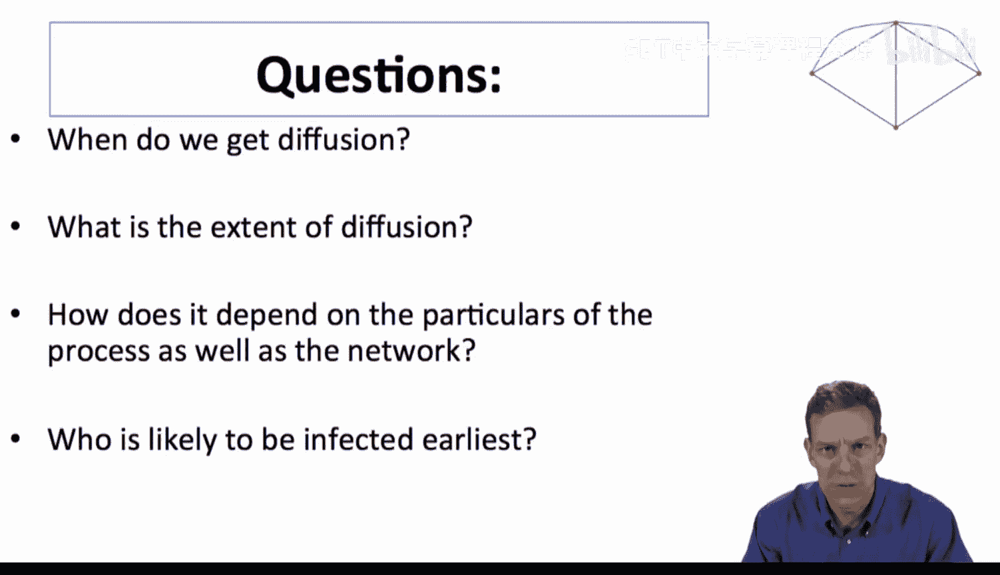

---

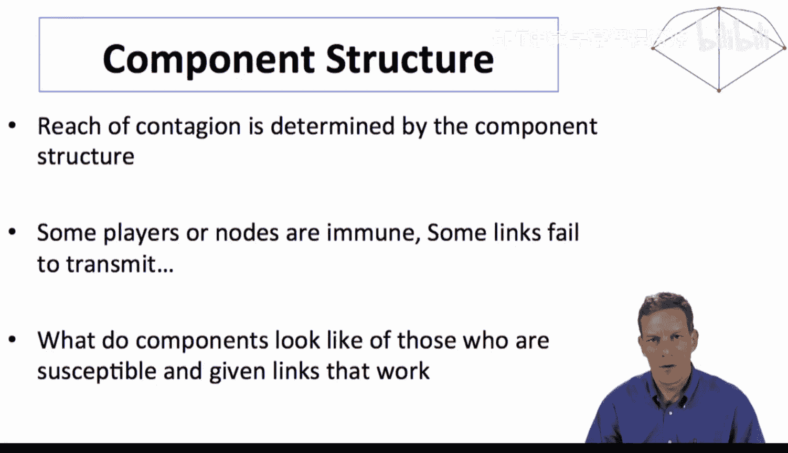

接下来，我们通过一个具体计算示例来深入理解。我们将从经典的**埃尔德什-雷尼（Erdős–Rényi）随机网络**模型开始，其定义为 `G(n, p)`，其中 `n` 是节点数，`p` 是任意两个节点间存在连边的概率。

我们主要回答的问题是：在这样的随机网络中，巨分支有多大？

在 `G(n, p)` 模型中，巨分支的存在与规模取决于连边概率 `p`（或平均度数 `(n-1)p ≈ np`）。有趣的情况发生在 `p` 介于 `1/n` 和 `log n / n` 之间时。此时，网络既不是由大量孤立小分支构成，也不是完全连通的。

以下是不同连边概率下网络结构的示意图，直观展示了从孤立小分支到完全连通网络的转变：

具体来说：
*   当期望度数 `np < 1` 时，网络主要由孤立节点和极小的分支构成，扩散几乎不可能大规模发生。
*   当 `np > 1` 但不过大时，会出现一个显著的巨分支。例如，在节点数 `n=50`，`p=0.02`（期望度数约为1）时，开始出现包含约半数节点的巨分支。
*   当期望度数继续增大（例如 `np ≈ 5`），网络几乎完全连通，此时一旦发生扩散，几乎会波及整个网络。

---

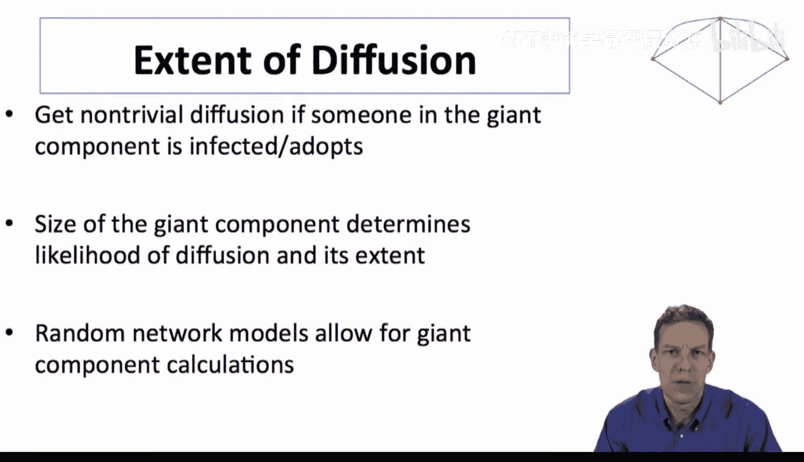

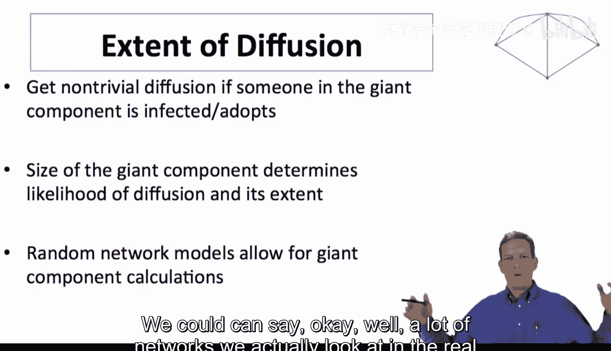

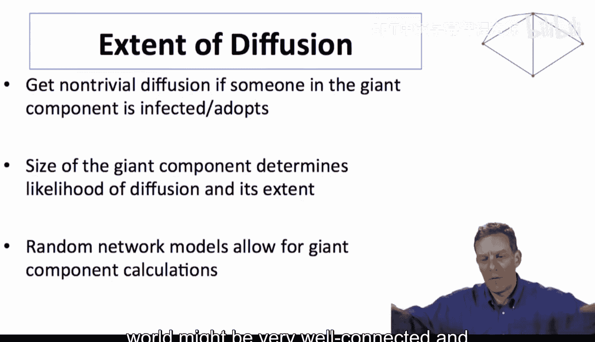

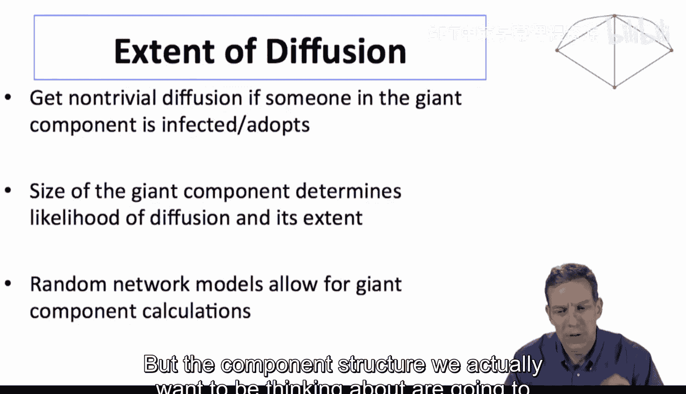

上一部分我们定性地观察了不同参数下的网络结构，现在我们来学习如何定量计算巨分支的期望大小。

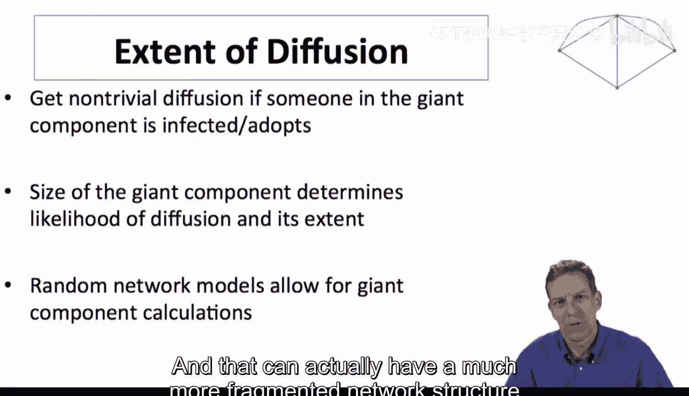

设随机网络的平均度数为 `d = p(n-1) ≈ pn`。我们关心的是，一个随机选择的节点**不属于**巨分支的概率。对于一个节点 `i`，它不属于巨分支，意味着它通过任何邻居都无法连接到巨分支。

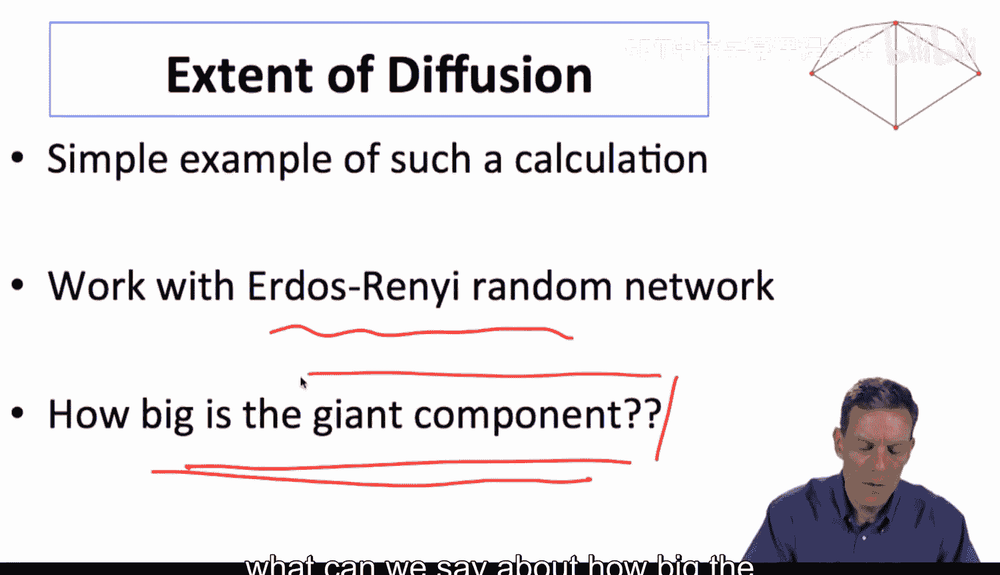

考虑节点 `i` 的一个邻居 `j`。`j` 不属于巨分支的条件是：`j` 本身不通过除 `i` 以外的其他邻居连接到巨分支。由于网络是随机的，我们可以假设这个概率对于所有节点都是相同的，记为 `q`。

因此，节点 `i` 有 `k` 个邻居且所有邻居都不属于巨分支的概率是 `q^k`。由于节点的度数服从二项分布，我们需要对所有可能的度数 `k` 求平均。在 `n` 很大时，近似服从泊松分布，其概率生成函数为 `G(x) = e^{d(x-1)}`。于是，一个随机节点不属于巨分支的概率 `q` 应满足以下自洽方程：

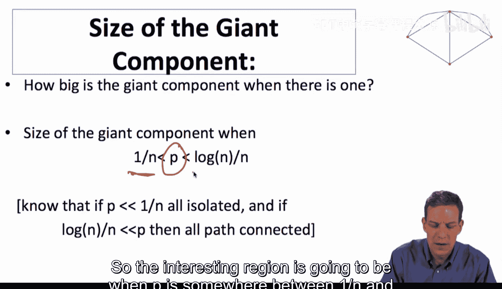

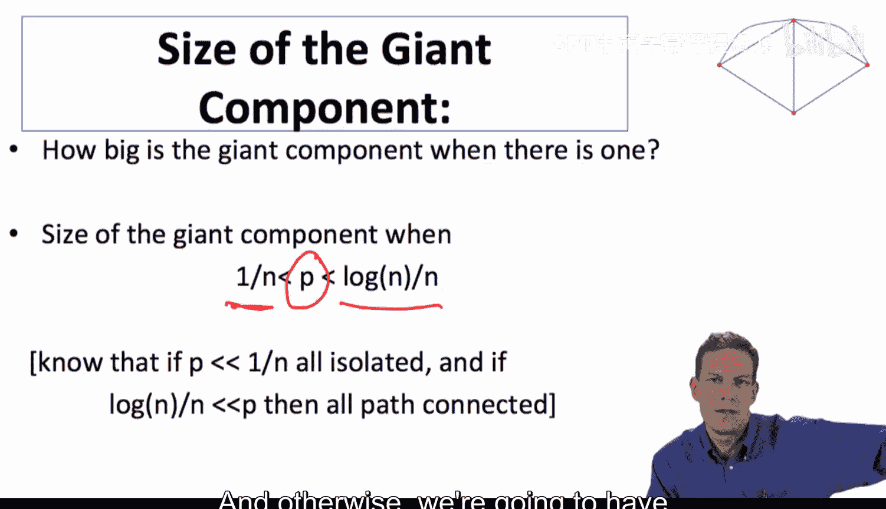

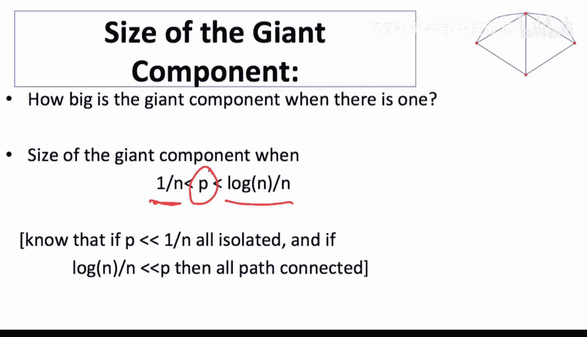

**公式：`q = G(q) = e^{d(q-1)}`**

这个方程的解 `q` 给出了一个节点不在巨分支中的概率。那么，巨分支的相对大小 `S`（即属于巨分支的节点比例）就是：

**公式：`S = 1 - q = 1 - e^{dS}`**

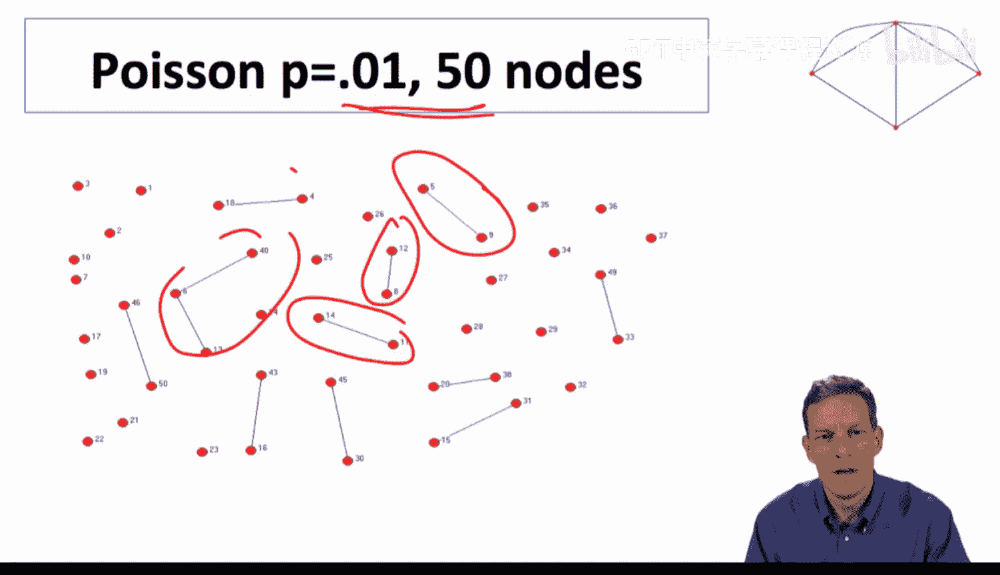

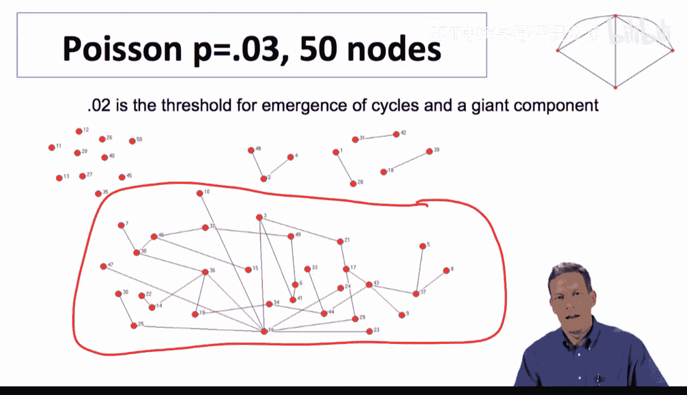

最后一个等式由 `q = e^{d(q-1)}` 和 `S=1-q` 推导得出。这个方程定义了 `S` 与平均度数 `d` 之间的关系。

以下是关于此方程的几点说明：
1.  **平凡解**：`S = 0` 总是方程的解，对应没有巨分支的情况。
2.  **非零解的存在性**：当且仅当平均度数 `d > 1` 时，方程存在一个非零解 `S > 0`。这印证了我们之前的观察：期望度数超过1是出现巨分支的临界条件。
3.  **数值求解**：对于给定的 `d > 1`，我们可以通过迭代法等数值方法求解方程 `S = 1 - e^{-dS}`，得到巨分支的预期大小。

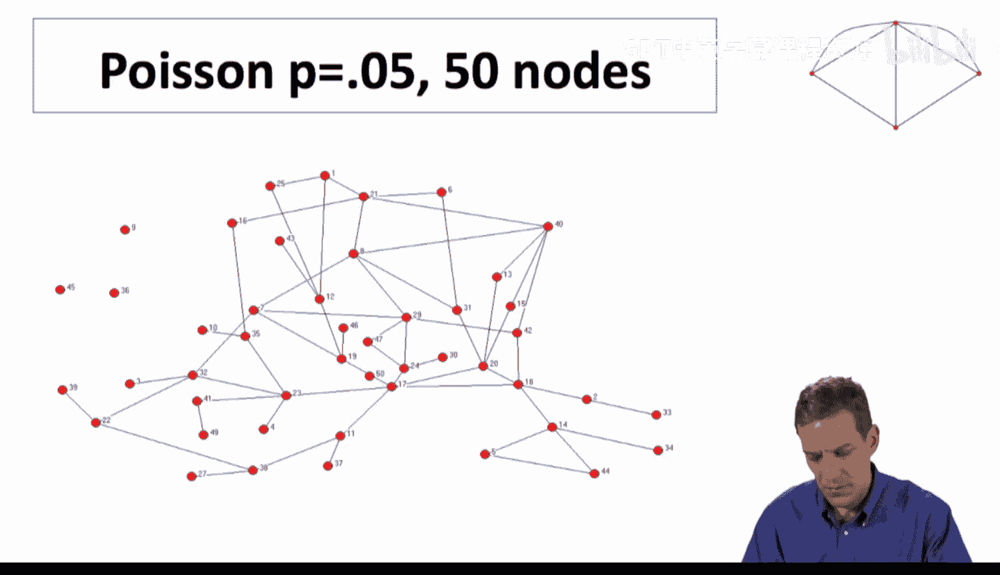

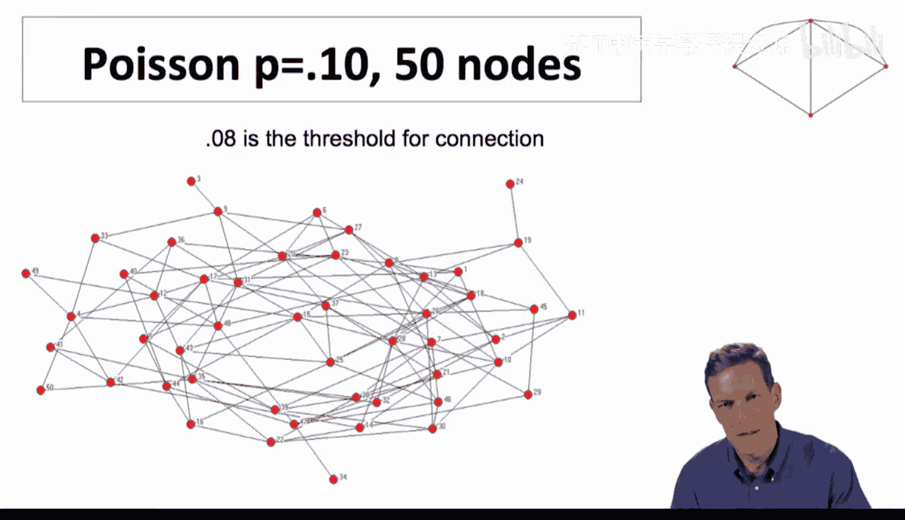

例如，当 `d = 2` 时，求解可得 `S ≈ 0.7968`，即约79.7%的节点属于巨分支。这一定量结果比我们之前的定性图示更为精确。

---

本节课中我们一起学习了如何在随机网络上分析扩散过程。我们首先明确了用于扩散分析的网络应基于“传播可能性”来定义连边。接着，我们指出网络的连通分支结构，尤其是**巨分支**，决定了扩散爆发的概率和范围。然后，我们以埃尔德什-雷尼随机网络为例，定性分析了不同连边密度下的网络结构。最后，我们推导了计算巨分支大小的核心自洽方程 **`S = 1 - e^{-dS}`**，并指出平均度数 `d > 1` 是巨分支存在的临界条件。通过这个框架，我们可以将网络的结构属性与扩散的动态结果联系起来。