#  055：SIS模型 🦠

在本节课中，我们将要学习一种名为SIS模型的扩散模型。这是一种高度简化的模型，虽然不能直接应用于许多现实场景，但它能为我们提供关于扩散过程如何运作的基本直觉。通过引入度分布并对其进行变化，我们可以获得比较静态分析，从而得出许多有用的见解。

## 模型概述

SIS模型源自流行病学中广泛研究和使用的模型。S代表易感（Susceptible），I代表感染（Infected），S再次代表易感。其核心思想是，个体可以康复并再次被感染。例如，计算机清除病毒后，会再次变得易感，当新病毒出现时，它可能再次被感染。因此，节点会随着时间的推移在这两种状态之间来回转换。

在模型的最简单版本中，节点被感染的概率与感染邻居的数量成正比，比例系数为 **v > 0**。同时，我们加入一个自发感染率 **ε**（类似于巴斯模型）。此外，节点在每个时期以某个速率 **δ > 0** 康复。这与巴斯模型类似，但增加了康复环节，从而允许存在稳态分布，而不是所有人都被感染。

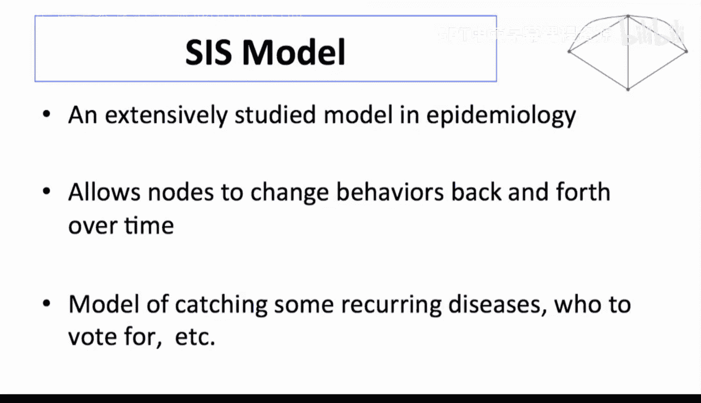

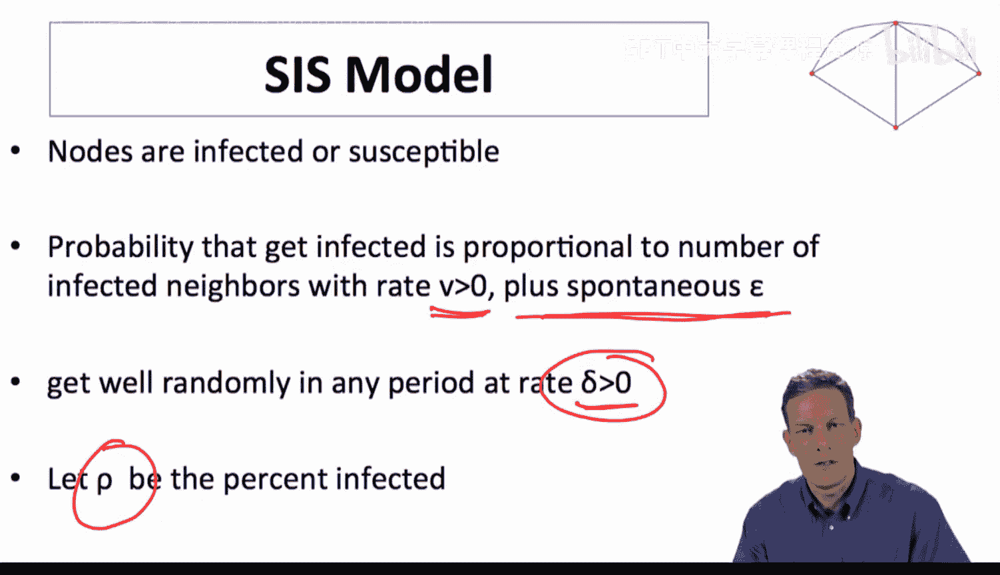

我们设 **ρ** 为在任何时间点被感染的人口比例。我们的目标是预测 **ρ** 如何作为网络和其他模型参数的函数。

## 无网络结构的简单版本

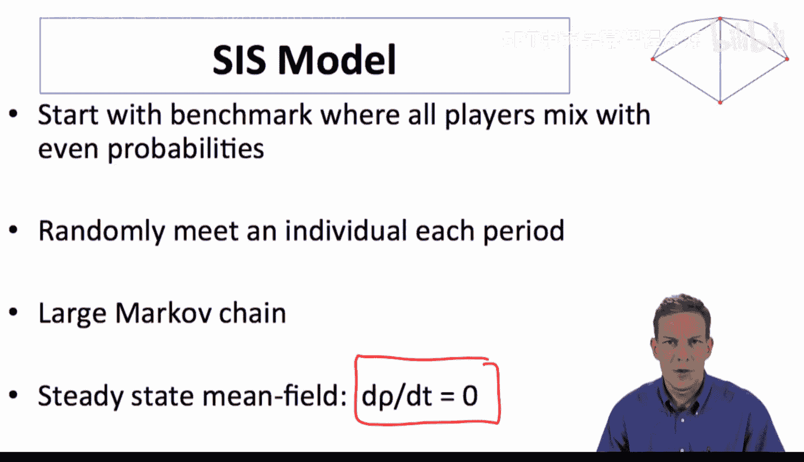

上一节我们介绍了SIS模型的基本概念，本节中我们来看看最简单的版本，即没有显式网络结构，个体以均等概率随机相遇。

在这个完全随机的过程中，感染人口随时间的变化如下：

*   只有尚未感染的易感者才会被感染。
*   新感染率 = (易感人口比例) × (感染率 **v** × 感染比例 **ρ** + 自发感染率 **ε**)。
*   同时，已感染人口以速率 **δ** 康复。

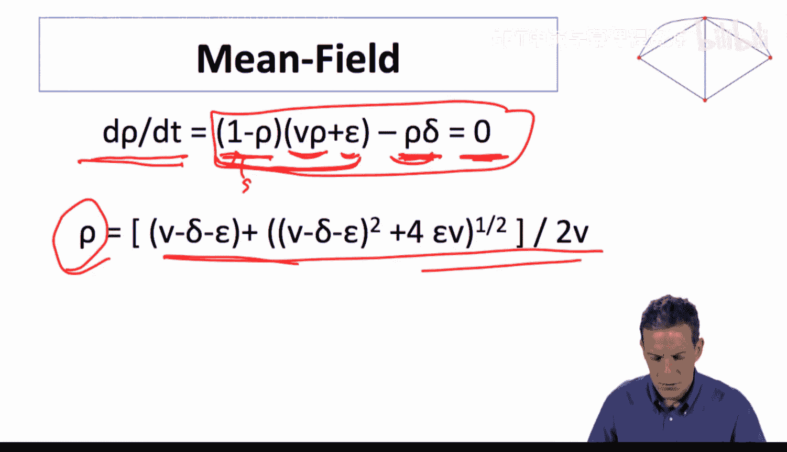

为了达到稳态，新感染率必须与康复率平衡。通过求解平衡方程，我们可以得到 **ρ** 的表达式。

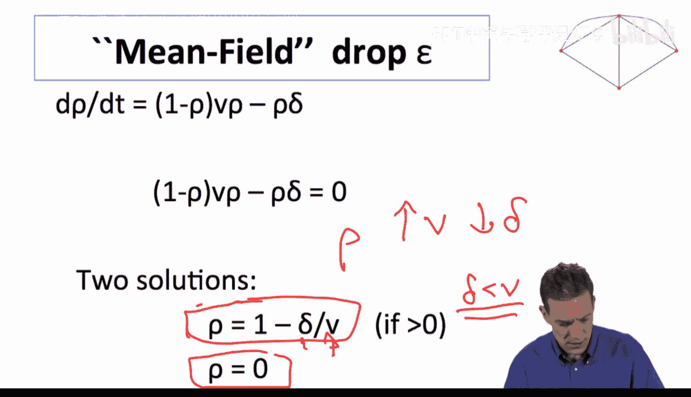

如果令 **ε** 趋近于零，我们会得到两个解：
1.  **ρ = 0**：无人感染。
2.  **ρ = 1 - δ/v**：一个更有趣的解。

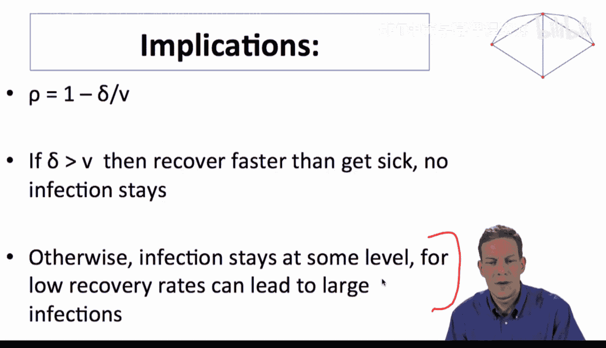

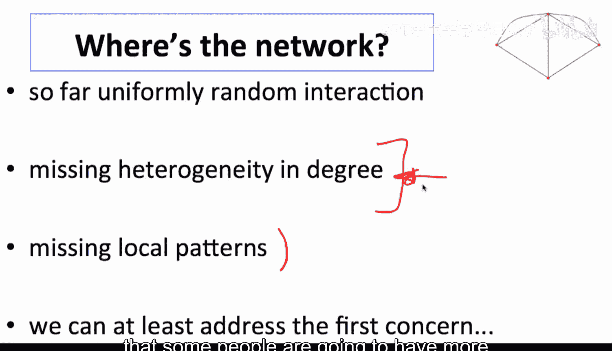

要使第二个解为正，需要 **δ < v**，即康复速率小于感染速率。此时，**ρ** 随 **v** 增大而增大，随 **δ** 增大而减小。这个简单的解类似于巴斯模型，但加入了康复率，从而产生了稳态。

## 引入度分布

到目前为止，我们尚未引入网络结构，忽略了度的异质性和局部模式。引入显式的网络结构而不进行模拟会更加困难。因此，我们将从引入度分布开始，即考虑不同个体在单位时间内拥有不同数量的互动（度）。

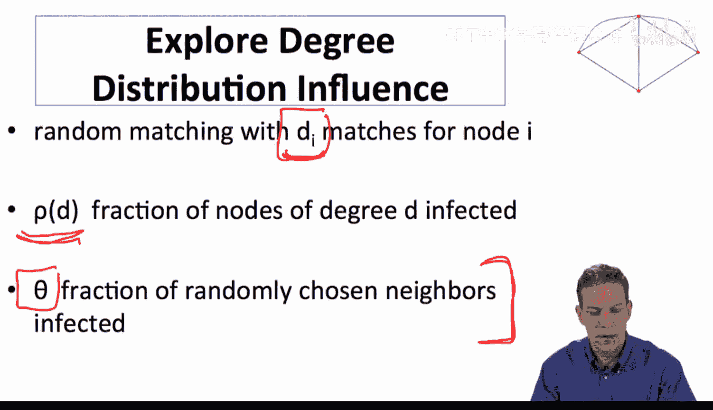

我们现在需要跟踪的不仅是总体感染比例 **ρ**，还有作为度函数的感染比例 **ρ(d)**。例如，拥有三次互动的人可能比拥有两次互动的人有更高的感染率。

此外，我们还需要跟踪另一个关键变量 **θ**，它表示当我随机遇到一个人时，对方被感染的概率。**θ** 与总体感染比例 **ρ** 不同，因为我更可能遇到那些互动频繁（高度数）的人，而这些人本身也更可能被感染。

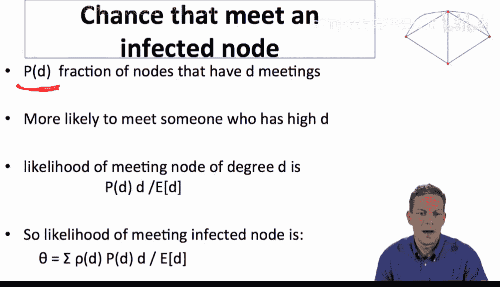

以下是处理这个随机匹配过程的关键步骤：

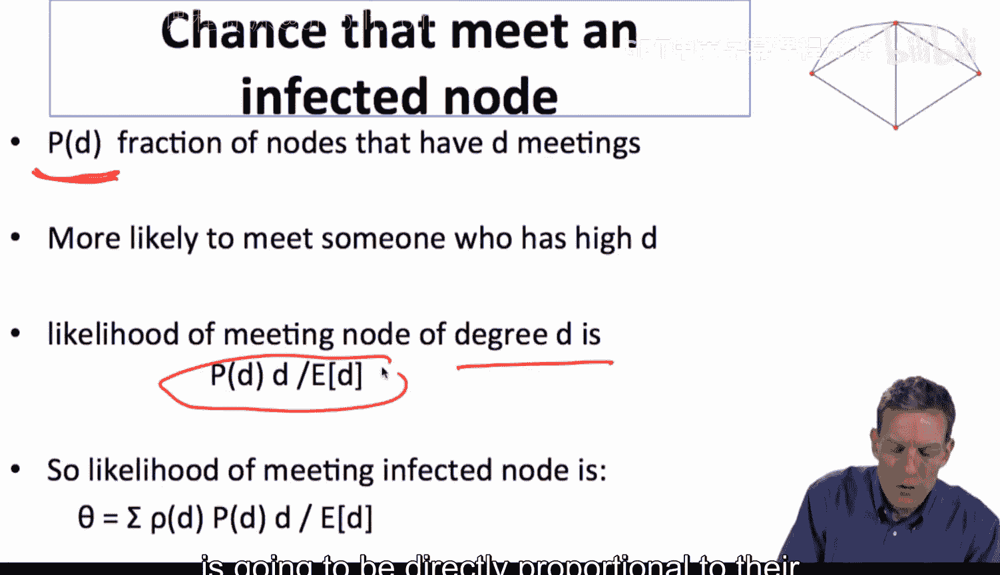

1.  **定义度分布**：设 **P(d)** 为度为 **d** 的节点比例。
2.  **计算遇到特定度节点的概率**：在随机匹配中，遇到一个度为 **d** 的节点的概率与其度 **d** 成正比。度数高的人有更多相遇机会，因此更可能被他人遇到。具体来说，遇到度为 **d** 的节点的概率为 **(d × P(d)) / 平均度**。
3.  **计算遇到感染者的概率 θ**：综合以上两点，**θ** 是遇到各度节点的概率乘以该度节点的感染比例 **ρ(d)** 的总和。

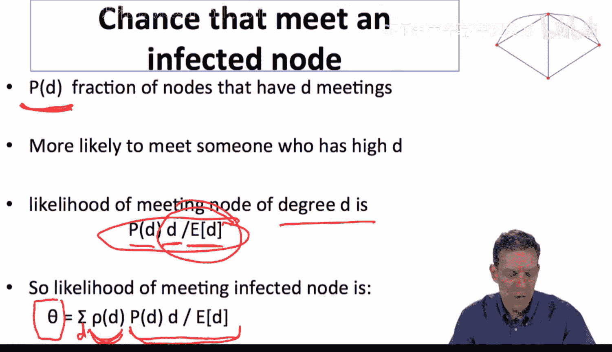

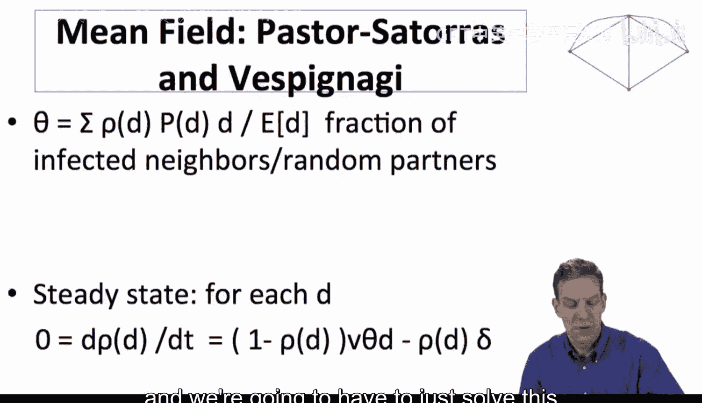

## 稳态方程与求解

在稳态下，每种度 **d** 的感染比例 **ρ(d)** 随时间的变化应为零。对于度为 **d** 的节点：
*   新感染率 = (该度易感者比例 **1 - ρ(d)**) × (遇到感染者的概率 **θ**) × (互动次数 **d**) × (每次接触感染率 **v**)。
*   康复率 = (该度感染者比例 **ρ(d)**) × (康复率 **δ**)。

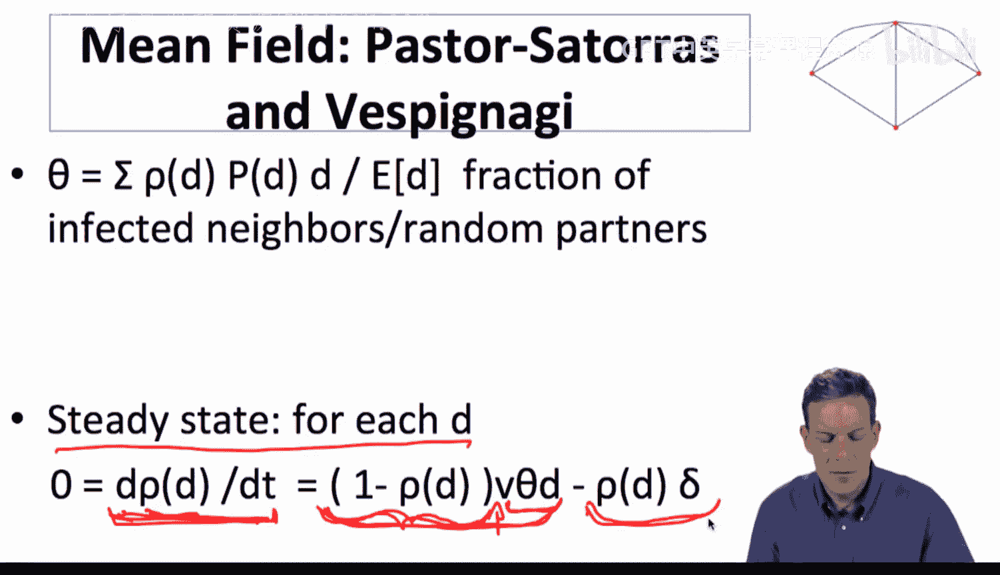

令其为零并求解，可以得到 **ρ(d)** 的表达式：
**ρ(d) = (λ θ d) / (λ θ d + 1)**，其中 **λ = v / δ**，代表感染速率与康复速率的相对比率。

将 **ρ(d)** 的表达式代回 **θ** 的定义式，我们得到一个关于 **θ** 的方程：
**θ = H(θ)**，其中 **H(θ)** 是一个由度分布 **P(d)** 和相对感染率 **λ** 决定的函数。

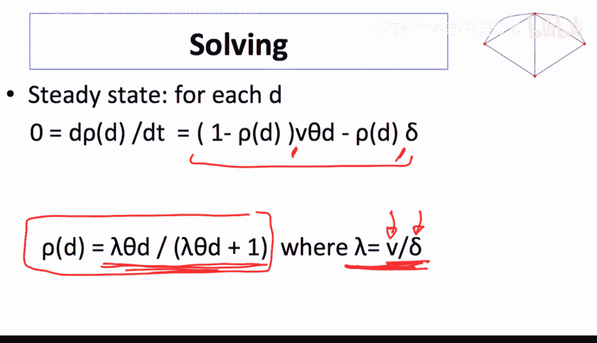

至此，我们将整个模型简化为一个需要求解的方程 **θ = H(θ)**。**H(θ)** 通常是 **θ** 的递增凹函数。这个方程的解决定了系统的稳态。

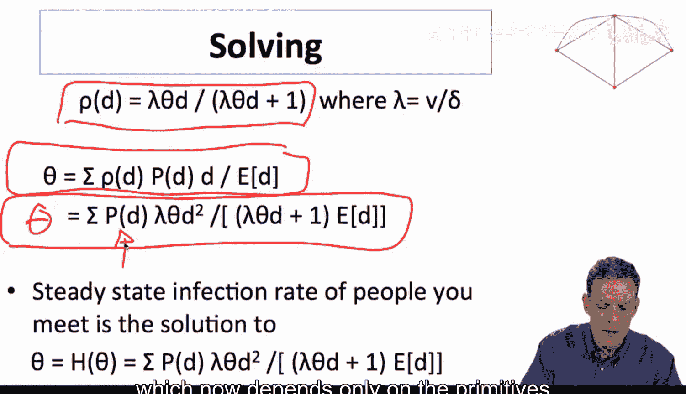

## 解的性质与比较静态分析

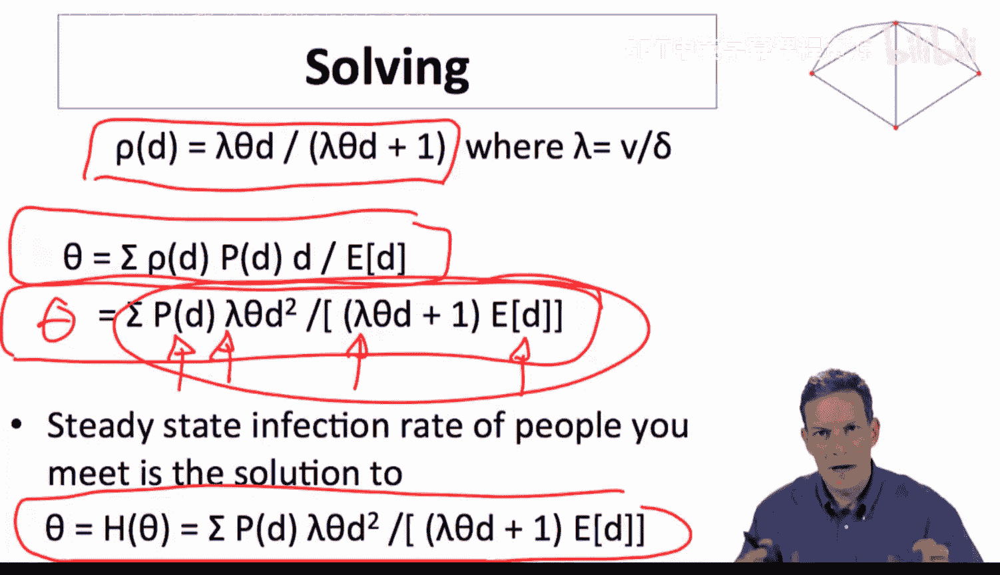

求解方程 **θ = H(θ)** 时，存在两种可能的稳态：
1.  **θ = 0**：无感染稳态。一旦病毒被清除，就不会再出现。
2.  **θ > 0**：正感染稳态。是否存在此解取决于函数 **H(θ)** 的形状。

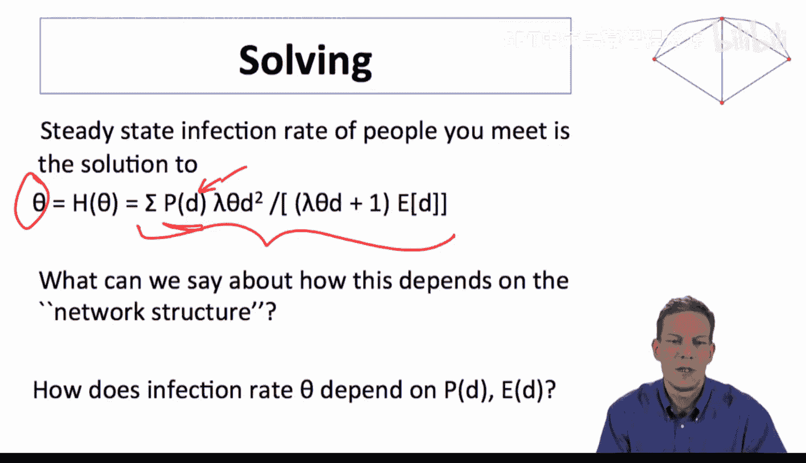

**H(θ)** 的形状由度分布和 **λ** 决定。直观上：
*   更高的度数节点（更多互动）会提高 **H(θ)**。
*   更高的相对感染率 **λ**（即 **v** 相对于 **δ** 更大）也会提高 **H(θ)**。
*   这些因素都会导致更高的稳态感染水平 **θ** 和 **ρ**。

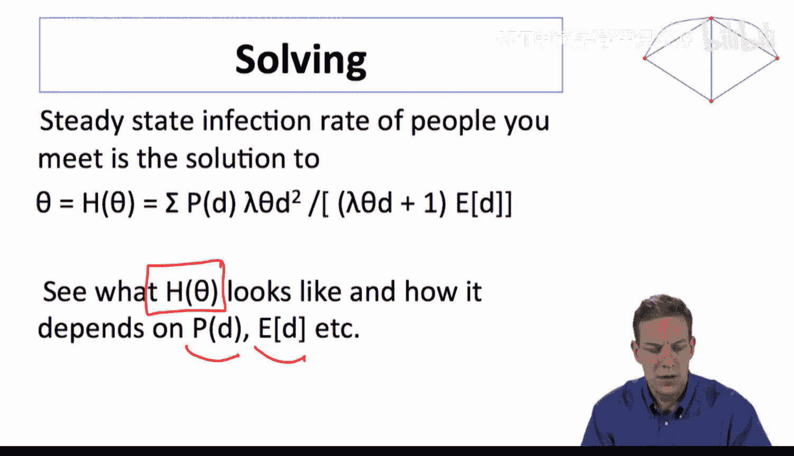

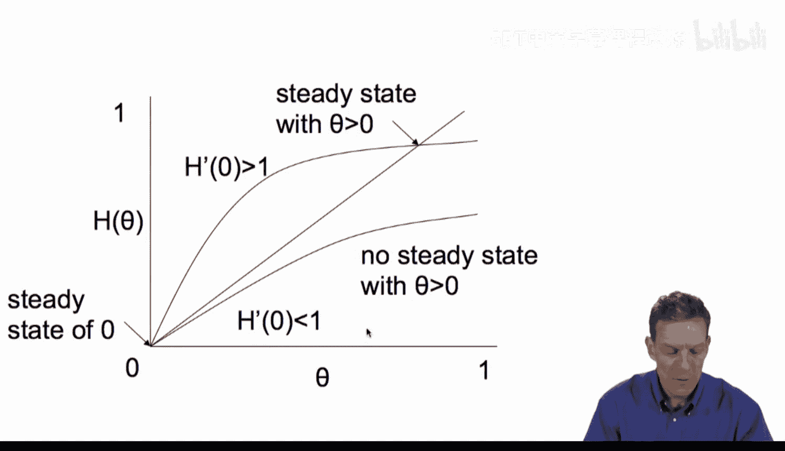

我们可以进行以下比较静态分析：
*   增加高度数节点的概率会如何影响 **θ**？
*   改变平均度会如何影响 **θ**？
*   改变相对感染率 **λ** 会如何影响 **θ**？

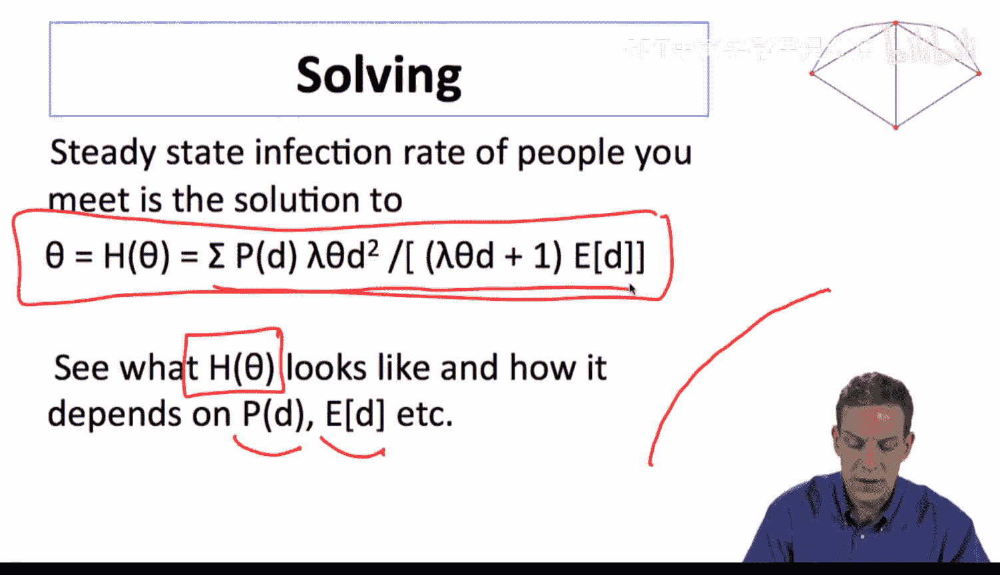

通过分析这些变化，我们可以深入理解网络结构如何影响扩散过程。

## 总结

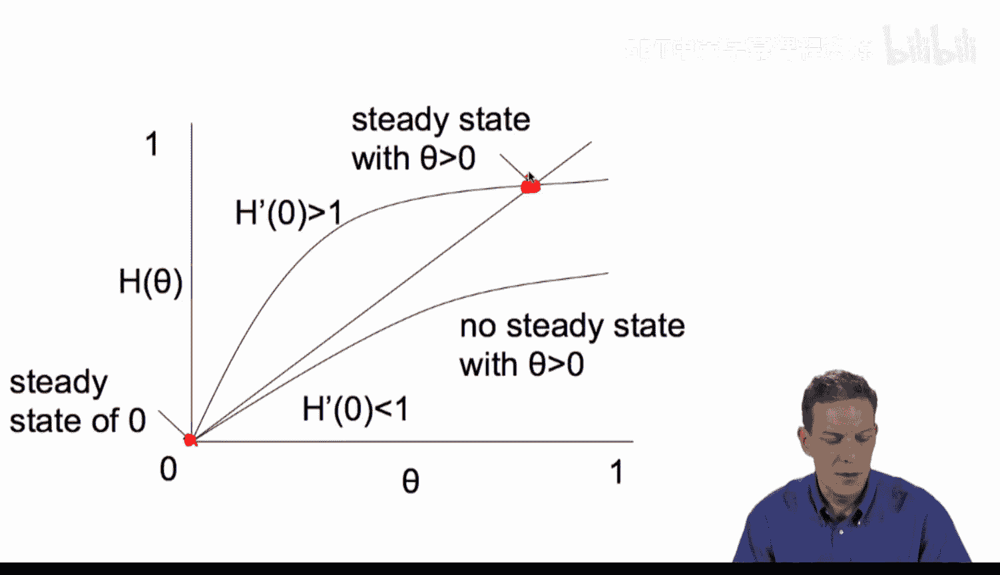

本节课中我们一起学习了SIS扩散模型。我们从最简单的无网络版本开始，推导了稳态感染水平。然后，我们引入了度分布，以考虑个体互动频率的差异，并定义了关键变量 **θ**（遇到感染者的概率）。通过建立并求解稳态方程，我们将模型简化为求解 **θ = H(θ)**。最后，我们讨论了解的性质，并指出更高的节点度数和更高的相对感染率会促进扩散，导致更高的稳态感染水平。下一节，我们将更详细地求解不同设置下的SIS模型，并进一步探讨其比较静态性质。