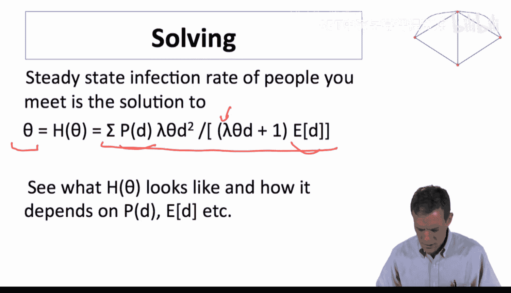
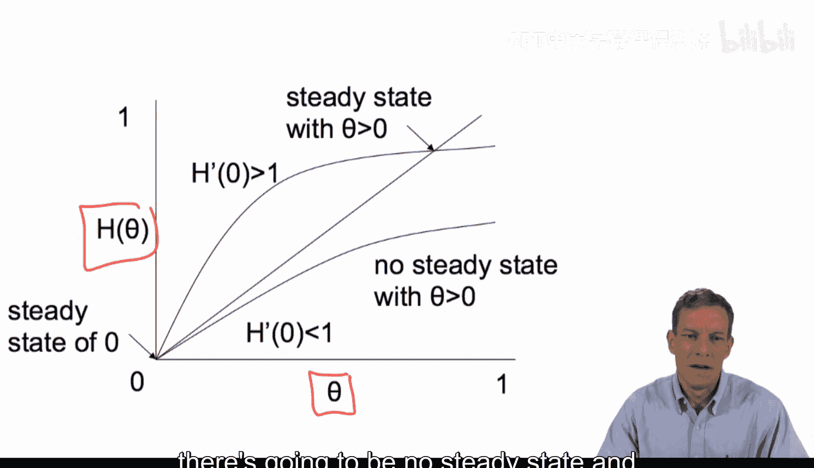
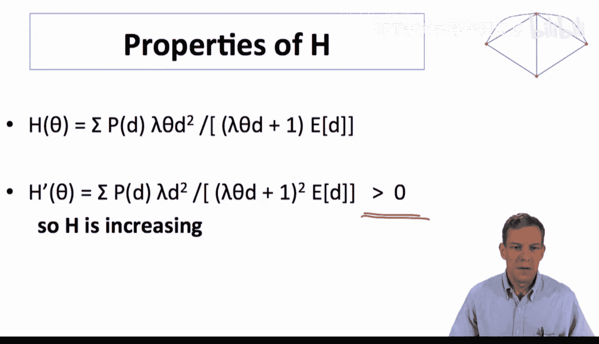
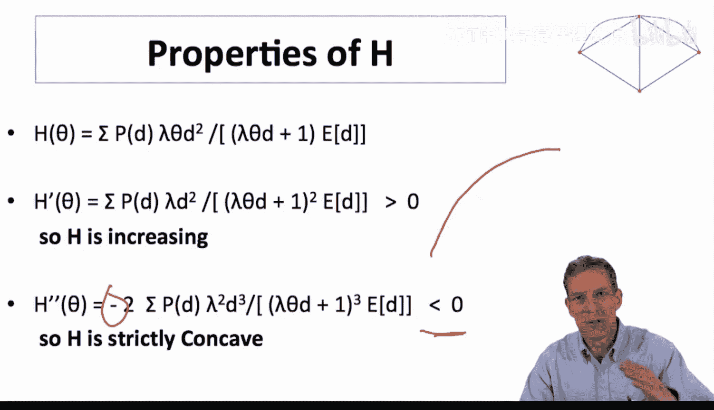
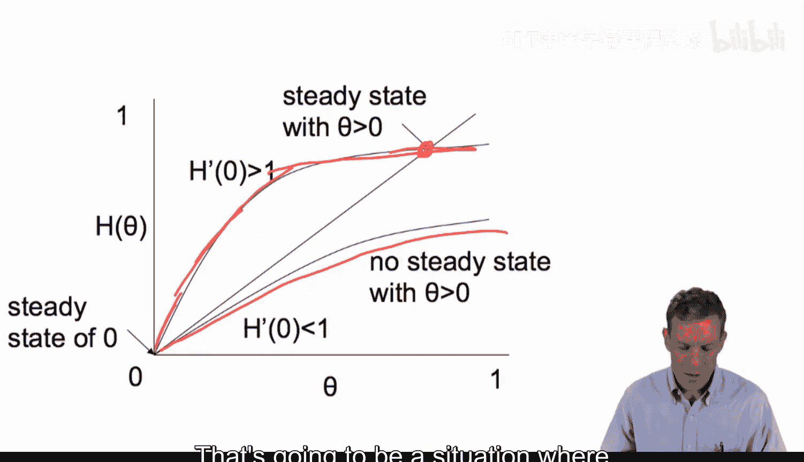
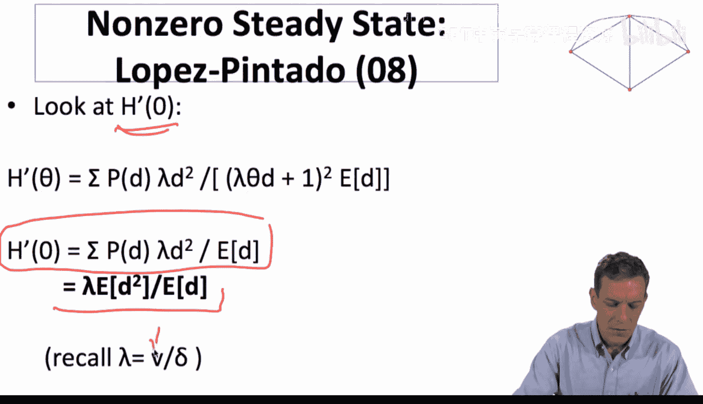
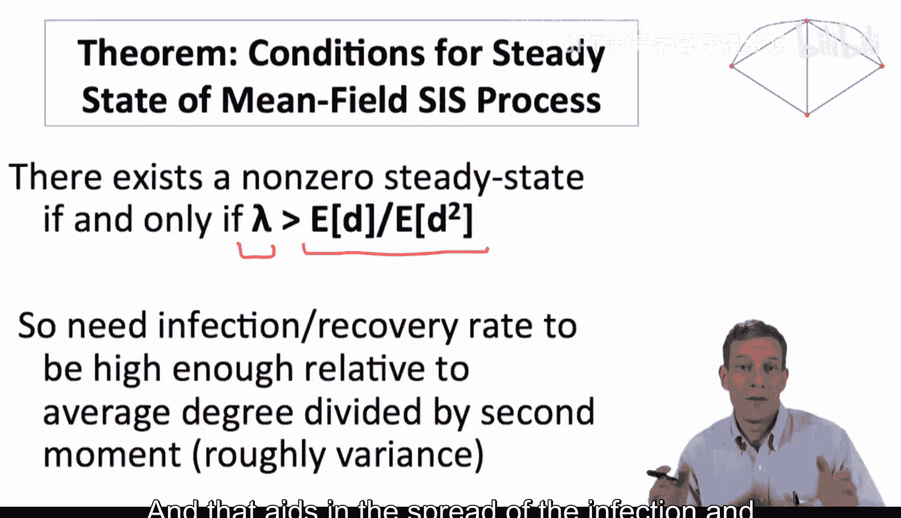
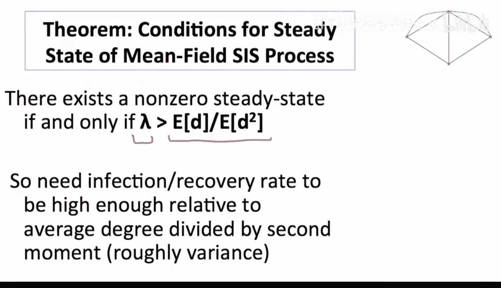
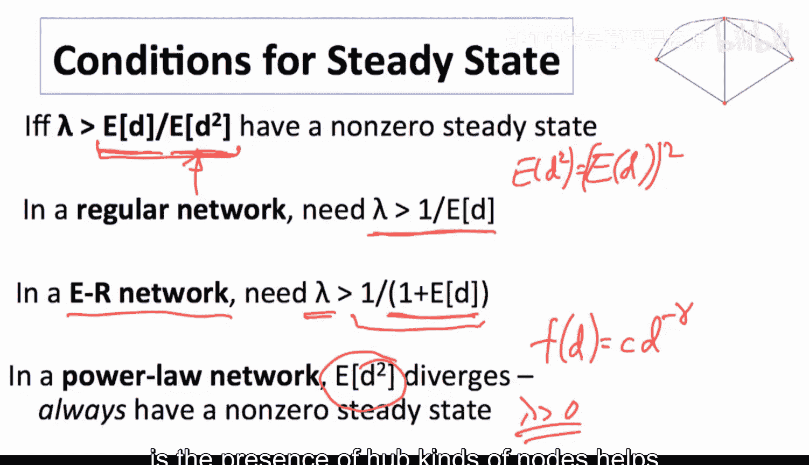
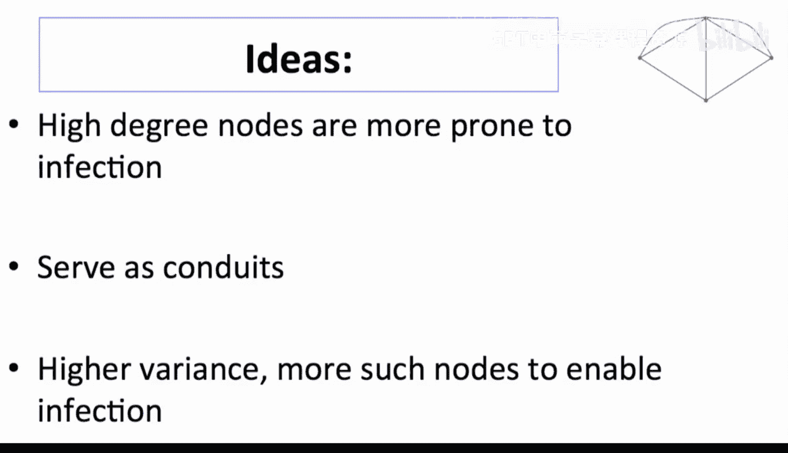

#  056：SIS模型求解 🔍

在本节课中，我们将深入探讨SIS（易感-感染-易感）模型的求解过程。我们将重点关注如何找到模型的稳态解，并分析不同网络结构对疾病传播的影响。

## 稳态方程与函数H

上一节我们介绍了寻找SIS模型稳态的基本思路。稳态方程将随机相遇的感染个体比例与度分布、感染率与恢复率的相对频率参数联系起来。具体而言，我们有一个方程，它关联了随机相遇的感染个体比例与一个涉及度分布及其部分、以及表示感染与恢复相对频率参数的表达式。

我们需要分析函数H的形状，并找出稳态解。再次指出，H是一个函数。如果我们想找到满足θ = H(θ)的θ值，那么基本上，如果H在0点的导数H'(0)小于1，并且它是一个凹函数，那么将不存在正的稳态解；否则，我们将找到一个正的稳态解。

## 分析函数H的形状

本节中，我们来看看函数H的更多细节。我们希望通过求H关于θ的导数来确定其形状。

如果我们对H关于θ求一阶导数，这相当简单。实际上，我们会发现这个表达式大于零，因此我们得到一个递增函数。你可以在此求导并验证得到的就是这个表达式。我们最终确实得到一个正的函数。

然后，如果我们对这个函数求二阶导数，我们会得到一个小于零的表达式。这里我不会显式地求解导数，你可以自行推导。这些只是多项式函数，求导相对直接：一阶导数为正，二阶导数为负。

因此，我们得到一个递增且严格凹的函数。这证实了之前展示的图示是准确的。接下来的问题是，这个函数将在何处与45度线相交？我们面临的情况是：如果H'(0)大于1，那么初始时它将位于45度线上方。同样，对于一个严格凹的函数，我们要么在接近1的地方达到稳态，要么在某个地方相交并得到一个非零的稳态。如果H'(0)小于1，那么基本上不可能维持感染，唯一的θ解将是0。这通常发生在度分布集中在非常低的度数且λ值相当低的情况下，此时感染不多，H'的导数也相当低。

## 临界条件定理

如果我们计算H'(0)，将0代入θ，然后看看这个表达式是什么样子。计算H'(0)的结果是 λ * E[D²] / E[D]。它考察的是度的平方的期望相对于度的期望的比例，并用λ加权。我们回顾一下，λ是感染率与恢复率的相对比值。

因此，我们得到定理：SIS模型的稳态过程存在非零稳态的充要条件是λ足够大。具体来说，它需要大于 E[D] / E[D²]。你需要感染恢复率相对于平均度除以二阶矩足够高。粗略地可以理解为与方差有关。足够大的λ将给我们一个非零的稳态。

这里有趣的是，增加方差（例如进行均值保持的展布）会使这个等式更容易满足。在保持E[D]不变但增加E[D²]的情况下，我们实际上是在扩大度的分布，但这会产生更高度的节点，这些节点将成为传播枢纽和感染渠道，这有助于感染的传播，并允许我们存在非零的稳态。

## 不同网络模型的应用

考虑到这个条件，我们可以将其代入我们所知的各种不同模型中。

*   **规则网络**：在规则网络中，每个人具有相同的度数。因此，度的期望就是那个度数，度的平方的期望就是度的期望的平方。在这种情况下，对于规则网络，E[D²] 就等于 (E[D])²。那么，你只需要λ大于 1 / E[D]。在这种情况下，期望度数越大，满足条件越容易。这很合理，并且λ越大，显然也越容易维持正的稳态。
*   **Erdős–Rényi随机网络**：如果你计算泊松随机网络的E[D]和E[D²]，那么你会得到E[D²] 等于 E[D] * (1 + E[D])。那么在这个模型中，我们最终得到λ需要大于 1 / (1 + 期望度数)。
*   **幂律网络**：例如，我们处理一个密度函数形如 C * d^(-γ) 的分布。那么，如果你进行计算积分并寻找方差，E[D²] 实际上会变成无穷大。如果它变成无穷大，那么整个表达式就变成零。因此，我们最终得到λ大于零。所以你基本上总是有一个非零的稳态。这里发生的情况是，在幂律网络中，至少在极限意义上，如果你有一个非常大的网络，你会有度数非常非常大的节点，它们会相互作用并总是被感染，从而在整个社会中携带感染。在这种设定下，你在分布的尾部赋予了足够的权重，以至于你总能维持感染。当然，如果你处理的幂律分布被截断，有某个最大度数，那么你不会完全得到这个结果，但你会发现，当你允许社会中的最大度数趋于无穷时，该表达式收敛于零。所以在极限情况下，该模型总是存在非零稳态。

基本上，我们发现枢纽类节点的存在极大地有助于维持非零的稳态。这里的理念是，这些高度数节点更容易被感染，它们充当传播渠道。更高的方差允许更多这样的节点，从而促进了感染。我们在定理中直接看到了这一点。这是从SIS模型中得出的一种见解，是一个有用的见解，并在这个特定模型中得到了明确体现。它还允许我们比较度分布，表明如果均值相同但增加E[D²]，则更容易满足这些条件。

## 总结与展望

本节课中我们一起学习了SIS模型的求解过程。我们分析了函数H的形状，推导出存在非零稳态的临界条件 λ > E[D] / E[D²]，并探讨了该条件在不同网络模型（规则网络、ER随机网络、幂律网络）下的具体形式和含义。核心结论是：网络中度分布的方差（通过E[D²]体现）增大，特别是存在高度数枢纽节点时，会显著降低疾病传播的阈值，使得感染更容易在社会中持续存在。

以上分析让我们知道了何时会得到一个非零的稳态。我们还可以进一步探讨那个稳态有多大，以及我们是否能在其中进行比较静态分析。这不仅仅是看零点的导数是否存在稳态那样简单。更一般地，我们可以尝试求解这个模型，并说明社会中的平均感染率是多少。这将是下一步要探讨的内容。