#  057：SIS模型求解与度分布影响分析 🔍


在本节课中，我们将深入探讨SIS模型的求解过程，并分析网络度分布如何影响稳态感染率。我们将推导出显式表达式，并利用随机占优等概念，比较不同网络结构下的感染动态。

---


## 稳态方程的推导与简化

上一节我们介绍了SIS模型的基本方程。本节中，我们来看看如何求解稳态感染率。

模型的关键变量是 **θ**，它表示随机相遇时对方被感染的概率。在稳态下，θ 满足以下方程：


**公式：**
```
1 = λ * E[ D * ρ(D) ]
```
其中，λ 是感染率参数，D 是节点的度，ρ(D) 是度为 D 的节点的感染率。

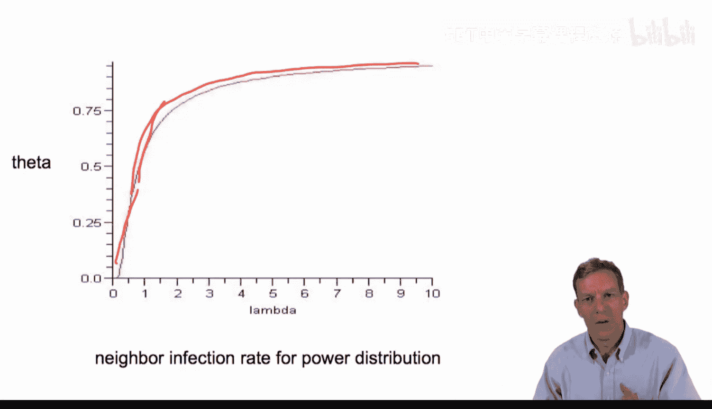

我们可以将 ρ(D) 表达为 θ 的函数：`ρ(D) = (λθD) / (δ + λθD)`。代入并简化后，得到求解 θ 的核心方程：

**公式：**
```
1 = Σ_D [ P(D) * ( (λθD^2) / (δ + λθD) ) ] * (1 / E[D])
```
为了简化分析，我们通常设恢复率 δ = 1。方程变为：

**公式：**
```
1 = Σ_D [ P(D) * ( (λθD^2) / (1 + λθD) ) ] * (1 / E[D])
```
我们的目标是求解此方程中的 θ。

---


## 规则网络下的显式解

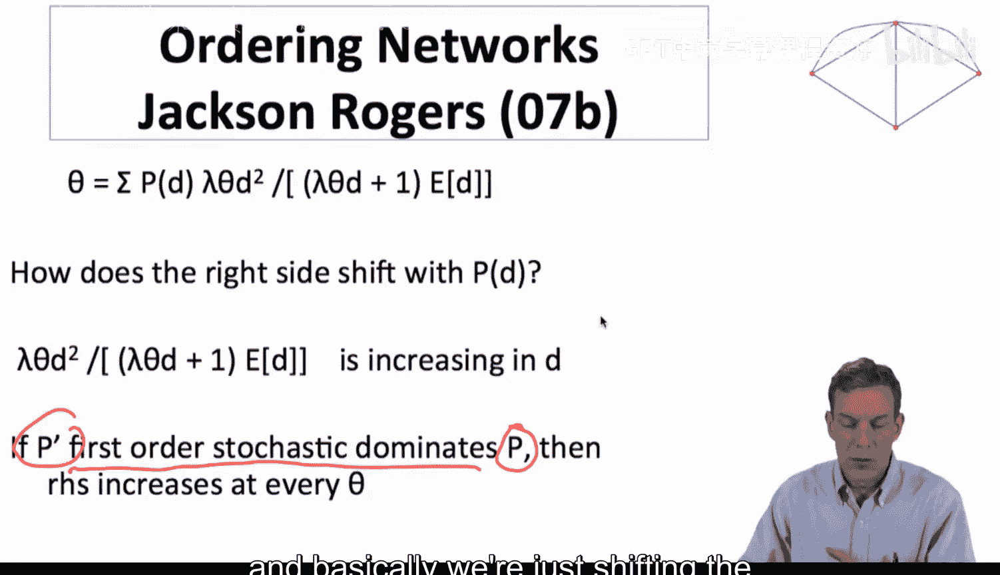

首先，我们分析一种最简单的情况：规则网络，即网络中所有节点都具有相同的度。

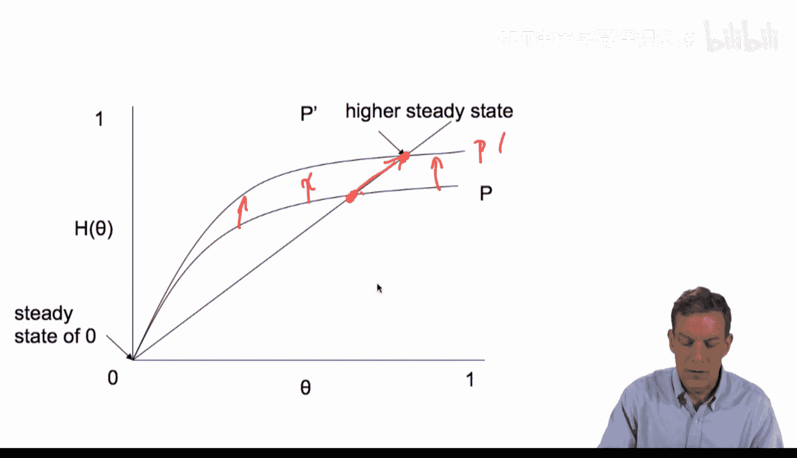

在规则网络中，度分布 P(D) 将所有权重都置于平均度 `E[D]` 上。将其代入上述方程，各项可以大大简化。


**推导过程：**
方程中的求和项退化为单一项。`D` 和 `D^2` 都等于 `E[D]` 和 `E[D]^2`。简化后，方程变为：
```
1 = (λθ * E[D]) / (1 + λθ * E[D])
```
解这个关于 θ 的方程，我们得到稳态感染率的显式表达式：

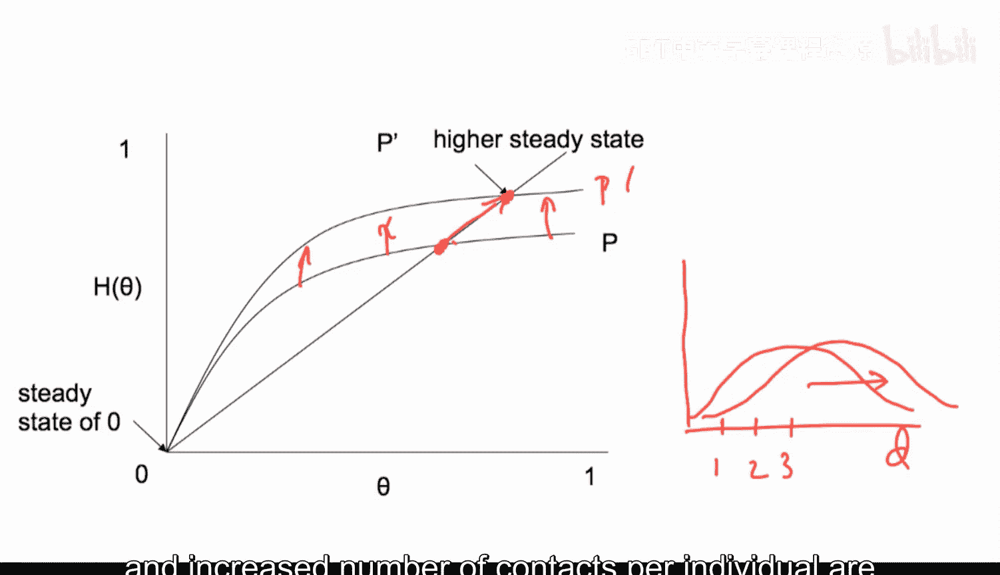

**公式：**
```
θ = 1 - 1/(λ * E[D])
```
从这个解中，我们可以得出两个重要结论：
1.  **阈值条件**：要使 θ > 0（即疾病持续存在），必须满足 `λ * E[D] > 1`。这与我们之前的基本结论一致。
2.  **线性增长**：感染率 θ 随 `λ * E[D]` 线性增长。这回到了最初随机相遇模型的直觉：接触率越高，感染水平越高。

---

## 幂律网络下的解与特性

接下来，我们考察一个更复杂且有趣的度分布：幂律分布。

将幂律度分布 `P(D) ∝ D^{-γ}` 代入稳态方程并进行积分求解，可以得到 θ 的表达式（具体积分过程略）：


**公式：**
```
θ ≈ 1 / (λ * (e^{1/λ} - 1))
```
如果我们绘制 θ 随 λ 变化的函数图，会发现一个显著特征：

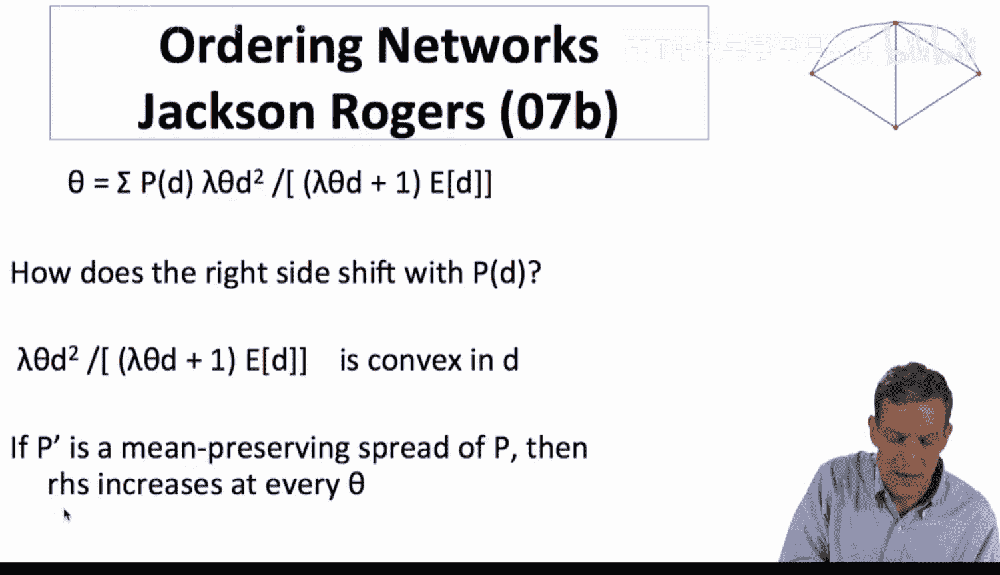

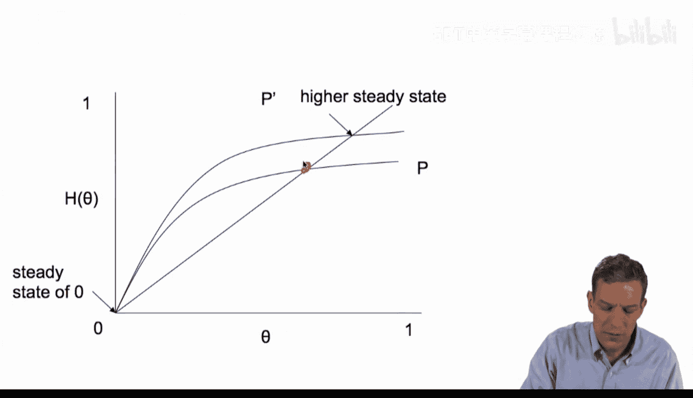

**特性描述：**
当 λ 增大时，θ 会非常迅速地上升，并逐渐渐近于1（但不会超过）。这是因为幂律网络中存在大量高度节点（枢纽）。一旦 λ 超过某个阈值，这些枢纽节点极易被感染，并通过大量连接迅速传播疾病，从而导致整个网络的邻居感染率 θ 急剧升高。

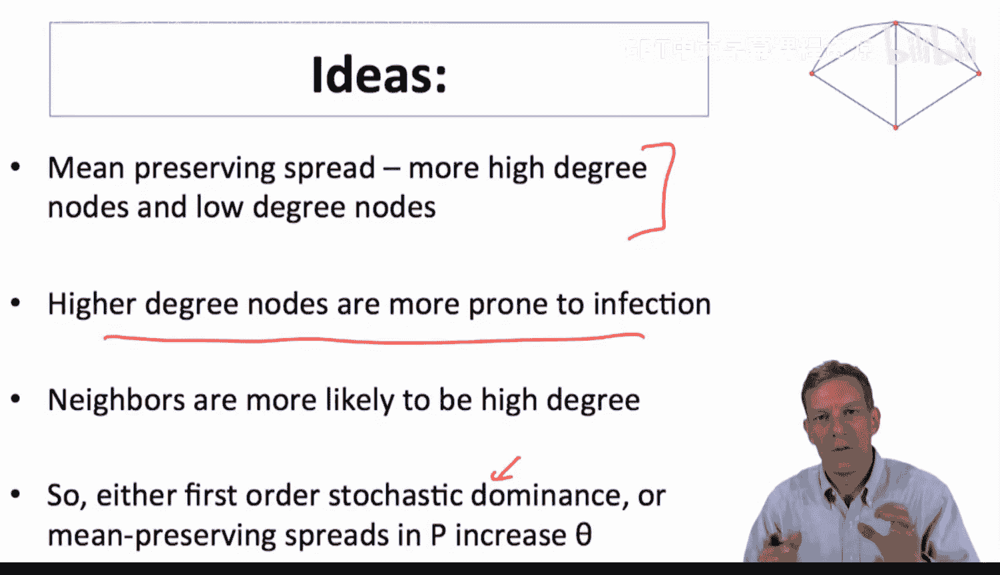

---

## 度分布变化对感染率的影响：随机占优分析

我们如何一般性地比较不同度分布对感染率的影响？可以通过分析稳态方程右侧的函数 `H(θ)` 来实现。

**公式：**
```
H(θ) = Σ_D [ P(D) * ( (λθD^2) / (1 + λθD) ) ] * (1 / E[D])
```
方程 `1 = H(θ)` 的解就是稳态 θ。如果某种度分布变化使得 `H(θ)` 在每个 θ 值上都增加，那么新的稳态 θ‘ 也会增加。

以下是分析 `H(θ)` 的关键观察：
1.  **函数 ρ(D) 的性质**：核心函数 `ρ(D) = (λθD^2)/(1+λθD)` 是度 D 的**递增凸函数**。
2.  **一阶随机占优**：如果一个度分布 P‘ 比 P 更倾向于高度数节点（即一阶随机占优），那么对于每个 θ，计算出的 `H(θ)` 值都会更高，从而导致更高的稳态 θ。直观上，让更多人拥有更多连接，会加速疾病传播。
3.  **二阶随机占优（均值保持展形）**：即使保持平均度不变，如果度分布变得更加分散（即一些节点度数更低，另一些更高），由于 `ρ(D)` 是凸函数，根据詹森不等式，`H(θ)` 的期望值也会增加。这意味着，即使平均连接数不变，引入高度数枢纽节点也会提升整体感染水平。

**结论：**
无论是向更高度数移动（一阶占优），还是在保持均值不变的情况下增加分布分散性（二阶占优），都会提高稳态的邻居感染概率 θ。

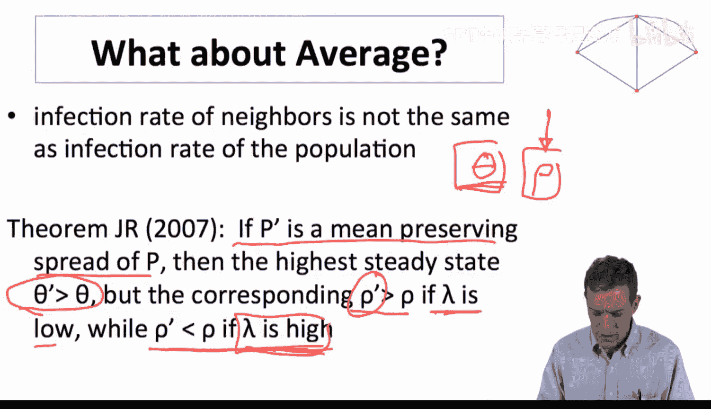

---

## 总体感染率 ρ 与邻居感染率 θ 的差异

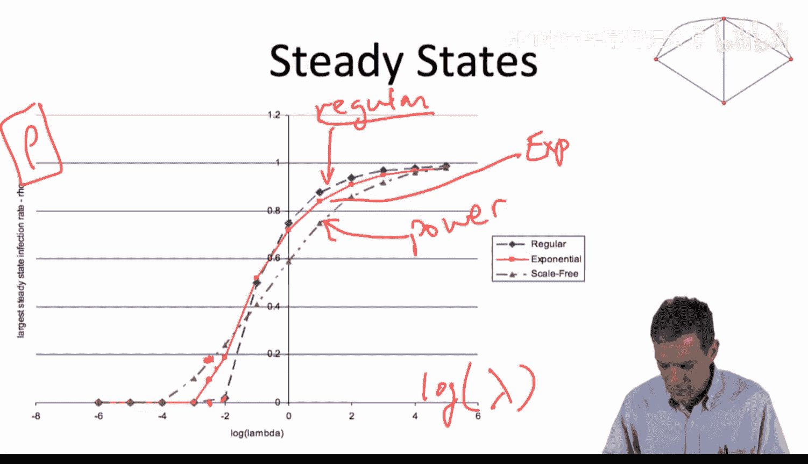

然而，政策制定者可能更关心总体人口感染率 **ρ**，而不仅仅是随机相遇时的感染概率 θ。ρ 是各度数节点感染率 `ρ(D)` 按**节点数比例**加权平均，而 θ 是按**相遇概率**加权平均。

研究发现，ρ 和 θ 对度分布变化的响应可能不同。

**关键转折：**
总体感染率 `ρ = E[ρ(D)]` 可以表达为 θ 的函数：
**公式：**
```
ρ = (λθ * E[D]) / (1 + λθ * E[D]) * (1 - θ) + θ
```
简化分析发现，ρ 与 `θ(1-θ)` 成正比。这是一个先增后减的函数，在 `θ=0.5` 时达到最大。

这意味着：
*   当 `θ < 0.5` 时，增加 θ 也会增加 ρ。
*   当 `θ > 0.5` 时，**增加 θ 反而会导致 ρ 下降**。

因此，在感染率 λ 很高的情形下，幂律网络可能具有很高的 θ（因为枢纽节点极易被感染），但由于大量低度数节点感染率相对较低，按节点数加权的总体感染率 ρ 可能反而低于更均匀的规则网络。这与低 λ 情形下的结论正好相反。

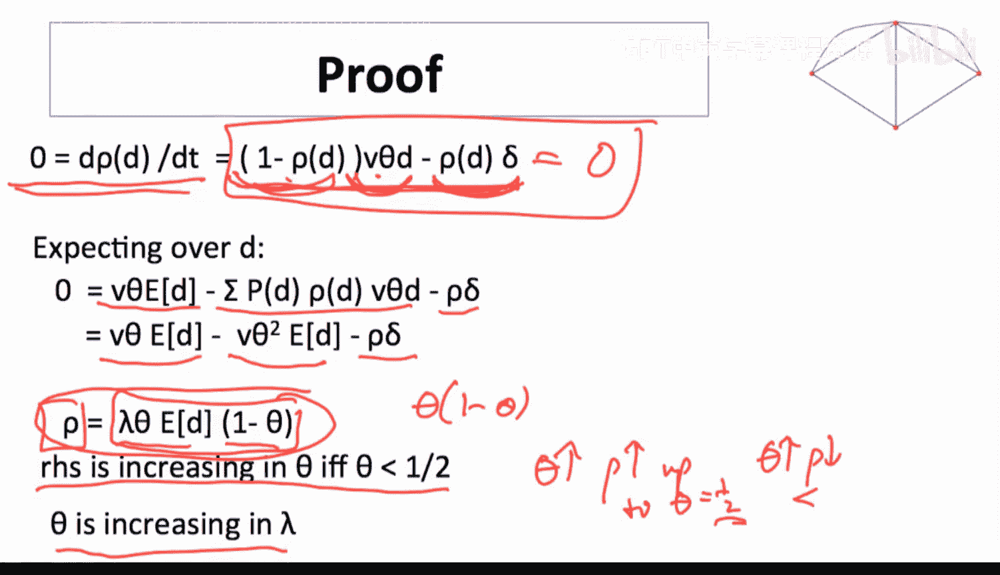

---

## 模型总结与展望

本节课中，我们一起学习了SIS模型的求解技巧，以及如何利用随机占优工具分析网络结构对疾病传播的影响。

**核心收获：**
1.  SIS模型提供了分析重复感染过程的简洁框架。
2.  度分布通过影响邻居感染率 θ 来影响传播动态。向高度数偏移或增加分布分散性都会提升 θ。
3.  **总体感染率 ρ 和邻居感染率 θ 可能对网络结构变化有不同响应**，在高感染率下可能出现逆转，这是制定干预政策时需要考虑的重要 nuance。

**模型局限性：**
1.  SIS 假设康复后仍会再次感染，不适用于能获得永久免疫力的疾病。
2.  模型基于随机相遇假设，而非固定的网络拓扑结构，因此无法捕捉网络聚类、同配性等具体结构的影响。

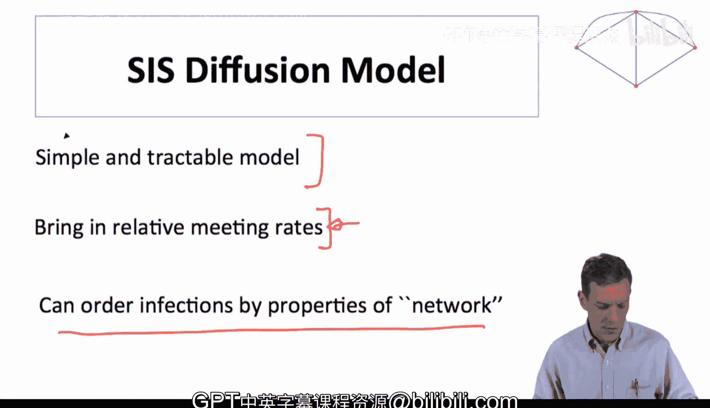

为了将模型应用于实际数据并进行更精确的预测，通常需要结合具体网络结构进行**模拟仿真**。在接下来的课程中，我们将介绍如何对网络上的扩散过程进行模拟，并将其应用于流行病学、市场营销等领域的实际问题分析。