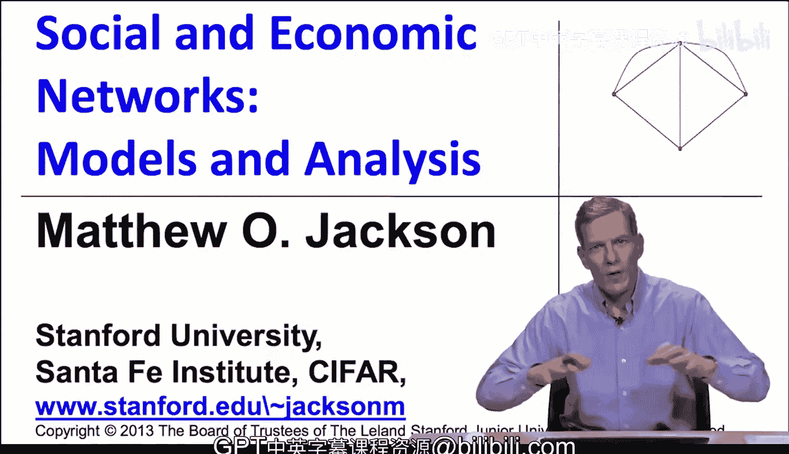
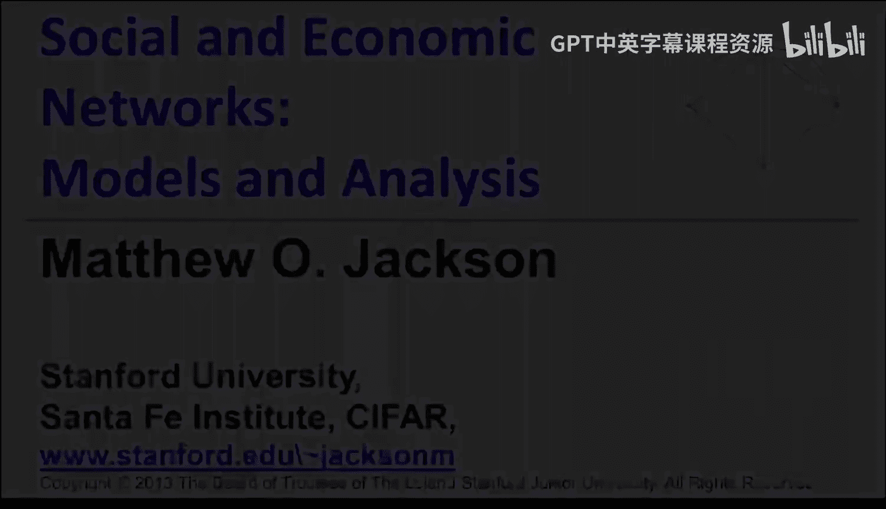

#  058：扩散模型数据拟合（可选-进阶）📊

在本节课中，我们将学习如何将扩散模型应用于真实数据，并进行统计估计。我们将通过一个具体的案例——小额信贷在印度村庄的扩散——来演示如何构建模型、拟合数据，并从中解读社会网络中的信息传播与行为影响。

---

## 概述

我们将分析一个扩散过程，其中个体决定是否采纳一项新技术（此处为小额信贷）。核心问题是：人们不采纳是因为缺乏基本信息，还是因为朋友的行为产生了互补性影响（如同伴压力或协同效益）？此外，我们还将探讨“非参与者”在信息扩散中可能扮演的角色——即使他们自己不采纳，是否仍会传播信息？

为了回答这些问题，我们将建立一个明确的网络扩散模型，并将其与观测数据进行拟合。

---

## 背景与数据

研究背景涉及印度卡纳塔克邦的75个村庄。一家银行进入其中43个村庄提供小额信贷服务。信息主要通过口耳相传的方式扩散：银行会先告知村庄中的一些关键人物（“领导者”），再由他们告知朋友。

我们收集了以下数据：
*   **社会网络**：基于“向谁借钱”、“与谁一同去寺庙”、“向谁寻求建议”等问题构建的家庭间关系网络。我们将任何存在上述关系的家庭视为可以互相通信。
*   **微观金融参与情况**：跟踪记录了家庭是否以及何时获得贷款。
*   **家庭特征**：包括人口统计信息（年龄、性别、种姓、宗教）、财富变量（是否有厕所、房间数等）。

分析的基本单位是家庭，因为每户只能申请一笔贷款。

---

## 基准模型：标准回归分析

在引入复杂的扩散模型之前，我们先使用标准方法进行基准分析。这种方法通常用于估计“同伴效应”。

我们建立一个逻辑回归模型。一个家庭 *i* 参与贷款的概率 `P_i` 与其自身特征 `X_i` 及其朋友中参与的比例 `F_i` 有关。模型形式如下：

`log( P_i / (1 - P_i) ) = α + β * X_i + γ * F_i`

其中，`γ` 是核心参数，它衡量了在控制自身特征后，朋友行为对我的决策的影响程度。

**以下是分析结果：**
*   估计出的 `γ` 值约为 **2.5**，且在统计上高度显著。
*   这意味着，如果朋友参与的比例从0上升到1（其他特征取平均值），我参与的几率比（odds ratio）将增加约12倍。即使朋友参与比例仅增加一个标准差（例如从0.1到0.3），我的参与几率也会增加约65%。

这个结果似乎表明存在非常强的“同伴效应”。然而，我们必须警惕“同质性”（homophily）的干扰：可能因为我和朋友有未观测到的共同特征，导致我们行为相似，而非彼此影响。

上一节我们通过标准回归观察到了强烈的相关性。本节中，我们将引入扩散模型，以更深入地理解这“2.5”背后的机制。

---

## 构建扩散模型

现在，我们正式将扩散过程纳入模型。模型分为两个阶段：
1.  **信息扩散**：信息通过社交网络随机传播。
2.  **参与决策**：个体在获知信息后，决定是否参与。

### 参与决策模型

一旦家庭 *i* 被告知（即成为“知情者”），其决定是否参与的模型与基准模型类似，但条件变为“已知情”：

`log( P_i(informed) / (1 - P_i(informed)) ) = α‘ + β’ * X_i + γ‘ * F_i(informed)`

这里 `F_i(informed)` 是 *i* 的**知情朋友**中，已经参与的比例。参数 `γ‘` 才是剔除了信息获取差异后，纯粹的“行为影响”或“背书效应”。

### 信息扩散模型

我们采用一个简单的随机传播模型：
*   初始知情者（“领导者”）由银行指定，我们知道他们的身份。
*   每个知情者会以一定的概率随机告知其邻居（朋友）。
*   **关键设定**：传播概率取决于告知者自身的参与状态。
    *   如果告知者**参与了**贷款，其传播概率为 **`q^P`**。
    *   如果告知者**未参与**贷款，其传播概率为 **`q^N`**。
*   信息传播会进行多个轮次（与银行在该村庄的季度数成正比）。

通过这个模型，我们可以估计 `q^P`、`q^N` 和 `γ‘` 三个核心参数。

---

## 模型估计与结果

我们采用**模拟矩方法**进行估计。以下是估计步骤：

1.  **参数网格搜索**：对 `q^P`、`q^N`、`γ‘` 的可能值构成一个三维网格。
2.  **模拟**：对于网格中的每一组参数，我们从真实的网络数据和初始知情者出发，按照上述扩散与决策规则进行多次随机模拟。
3.  **匹配矩**：计算每次模拟产生的数据矩（如平均参与率、参与率的方差等）。
4.  **选择最优参数**：寻找能使模拟矩最接近实际观测数据矩的那组参数。

**以下是估计结果：**
*   **信息传播参数**：`q^N = 0.05`， `q^P = 0.55`。参与者的传播概率是未参与者的**11倍**，差异显著。
*   **同伴效应参数**：`γ‘ ≈ -0.05`，**不显著**，且点估计值为负。

**结果解读：**
*   之前基准回归中强烈的“同伴效应”（`γ = 2.5`）在很大程度上是由**信息传播的异质性**驱动的。如果你的朋友参与了，你更有可能从他那里听到消息（因为 `q^P` 很高），从而更有可能获得参与的机会。
*   一旦控制了信息获取渠道（即只考察已知情者的决策），朋友行为本身的影响（`γ‘`）就变得微弱且不显著。这意味着在知情后，个人决策主要受自身特征影响，而非朋友是否参与。

---

## 反事实分析：非参与者的作用

尽管非参与者的传播概率（`q^N = 0.05`）很低，但他们数量众多（约80%的知情者未参与）。他们的作用重要吗？

我们可以进行反事实模拟：保持其他最优参数不变，仅将非参与者的传播概率 `q^N` 设为0（即不允许他们传播信息），然后重新运行模型。

**以下是反事实结果：**
*   **知情率**：从86%下降至59%。
*   **参与率**：从21%下降至14%。

这表明，即使传播效率低，数量庞大的非参与者群体仍然是信息扩散网络中不可或缺的一环，贡献了约三分之一的信息传播效果。

---

## 结论与启示

本节课我们一起学习了如何将网络扩散模型与实证数据相结合。

1.  **方法论价值**：通过明确建模信息扩散过程，并将其与决策阶段分离，我们能更清晰地识别“同伴效应”的来源。在本案例中，表面的强相关性主要源于**信息传播**，而非知情后的**行为影响**。
2.  **政策含义**：对于希望推广小额信贷的机构而言，重点应放在**促进信息传播**上（例如，激励早期采纳者多分享），而非试图克服不存在的“同伴压力”。
3.  **模型扩展性**：拟合好的模型可以作为政策实验室。我们可以进行各种反事实分析，例如：改变网络结构（增加跨种姓联系）、瞄准不同的初始传播者，以预测其对扩散结果的影响。

需要强调的是，本案例的结论（信息传播主导）是特定情境下的发现。我们应掌握的是这种**严谨建模、区分过程、数据拟合**的方法论，并将其应用于其他扩散现象的研究中。