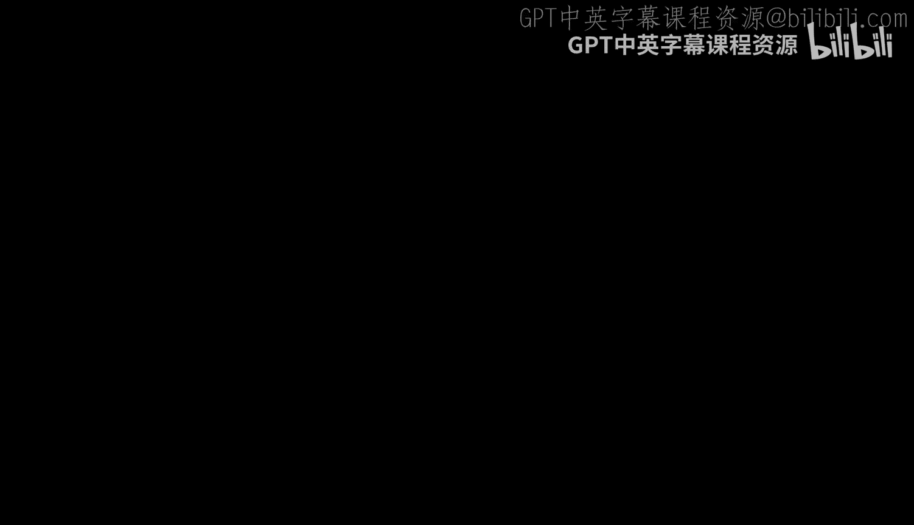
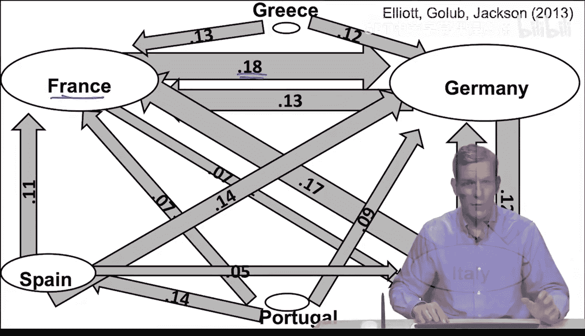

#  059：金融传染应用（进阶）

## 概述

在本节课程中，我们将探讨传染模型的一个具体应用，即金融传染。我们将学习如何利用网络分析来理解，当一个公司或国家陷入困境时，这种困境如何通过网络中的连接（如债务、股权等）传播到其他实体。我们将从一个简单的模型入手，理解组织间的相互持有关系如何形成网络，并最终影响各自的价值。

## 网络中的风险暴露建模

上一节我们介绍了传染模型的基本概念，本节中我们来看看如何用网络来建模金融体系中的风险暴露。我们将从一个简化的股权模型开始，理解一个组织如何通过持有其他组织的股份，间接暴露于后者的风险之下。

一个组织（可以是公司、银行或国家）的价值由两部分构成：其自身的直接投资价值，以及通过持有其他组织股份而获得的间接价值。设组织 `i` 的直接资产价值为 `P_i`。同时，组织 `i` 持有组织 `j` 价值的一部分，记为 `C_ij`（即 `j` 的价值中有 `C_ij` 的比例归属于 `i`）。组织自身不持有自己的股份，剩余部分（`1 - Σ_j C_ji`）由不参与网络互持的私人投资者持有。

那么，组织 `i` 的账面价值 `V_i` 可以表示为：

**V_i = P_i + Σ_j (C_ij * V_j)**

这个公式意味着，一个组织的总价值等于其自身资产，加上从其他组织价值中按持股比例分得的部分。

## 从网络视角计算价值

如果我们把所有组织的价值写成一个向量 **V**，把所有组织的直接投资价值写成一个向量 **P**，并把交叉持股比例写成一个矩阵 **C**（其中 `C_ij` 表示 `i` 持有 `j` 的比例），那么上述方程组可以写成矩阵形式：

**V = P + C * V**

通过求解这个方程，我们可以得到整个系统中所有组织的最终账面价值向量：

**V = (I - C)^(-1) * P**

这里，`I` 是单位矩阵，`(I - C)^(-1)` 是 `(I - C)` 的逆矩阵。这个计算与列昂惕夫的投入产出分析相关，它清晰地展示了网络结构如何放大或传导价值。

然而，我们更关心的是最终私人投资者（即网络之外的股东）获得的价值。这部分价值 `Ṽ_i` 等于私人投资者持有的比例乘以组织的总价值 `V_i`。将上面求得的 **V** 代入，我们得到：

**Ṽ = Ĉ * (I - C)^(-1) * P**

我们定义矩阵 **A = Ĉ * (I - C)^(-1)**。矩阵 **A** 中的元素 `A_ij` 具有明确的经济含义：它表示组织 `j` 的原始投资 `P_j` 中，最终有多少比例流向了组织 `i` 的私人股东。**A** 矩阵完整刻画了整个网络中的终极风险暴露关系。

## 一个简单的双组织例子

为了更直观地理解，让我们看一个只有两个组织的简单例子。

假设世界上只有两个组织：组织1和组织2。它们互相持有对方一半的股份，剩余一半由各自的私人投资者持有。即：
*   组织1持有组织2的50%。
*   组织2持有组织1的50%。
*   私人投资者1持有组织1的50%。
*   私人投资者2持有组织2的50%。

根据我们的公式计算 **A** 矩阵，结果是：
*   组织1的私人投资者最终获得了组织1自身投资价值的三分之二，以及组织2投资价值的三分之一。
*   组织2的私人投资者最终获得了组织2自身投资价值的三分之二，以及组织1投资价值的三分之一。

这个结果可以通过一个无限循环的分配过程来理解：假设组织1产生1美元收益。其中0.5美元直接归其私人投资者，另外0.5美元流向组织2（因为组织2持有其一半股份）。组织2获得的这0.5美元，又有一半（0.25美元）归其私人投资者，另一半（0.25美元）流回组织1。这个过程不断继续，最终求和，组织1的私人投资者总共获得约0.667美元，组织2的私人投资者获得约0.333美元。这与矩阵计算的结果一致。

这个简单的例子展示了，即使持股关系是对称的，由于网络循环持有的放大效应，原始资产的价值会以不对称的方式最终归属于不同的终端投资者。

## 现实世界中的应用：欧洲主权债务

上述模型可以应用于更复杂的现实网络。例如，可以用于分析欧洲各国之间的主权债务持有网络。

通过收集数据，例如德国债务有多少由法国银行持有，法国债务有多少由意大利银行持有等，我们可以构建出国家间的“交叉持有”矩阵 **C**。然后，通过计算 **A** 矩阵，我们就能看出各国税收收入等“原始投资”价值，最终通过债务网络暴露给了哪些其他国家。

基于一些简化计算得到的 **A** 矩阵显示：
*   法国税收收入的约18%最终通过债务链条流向了德国。
*   德国收入的约12%流向了意大利。
*   意大利收入的约11%流向了德国。
*   法国对意大利、葡萄牙、希腊、西班牙等国也有显著的风险暴露。

通过这样的分析，我们可以清晰地看到金融传染的潜在路径：如果意大利经济出现问题，其偿债能力下降，将直接影响持有其债务的德国和法国的银行体系，进而可能波及整个欧洲。

## 总结

本节课中，我们一起学习了如何将网络模型应用于分析金融传染。我们首先建立了一个基于股权交叉持有的简单模型，推导出计算组织最终价值的矩阵公式 **V = (I - C)^(-1) * P**。接着，我们引入了 **A** 矩阵来刻画终端投资者对原始资产的终极风险暴露。通过一个双组织例子，我们直观地理解了网络如何导致价值的重新分配。最后，我们探讨了该模型在分析欧洲主权债务网络中的应用，展示了如何利用网络数据识别系统性风险的传染路径。这个框架为我们理解复杂的金融互联性及其带来的传染风险提供了有力的工具。