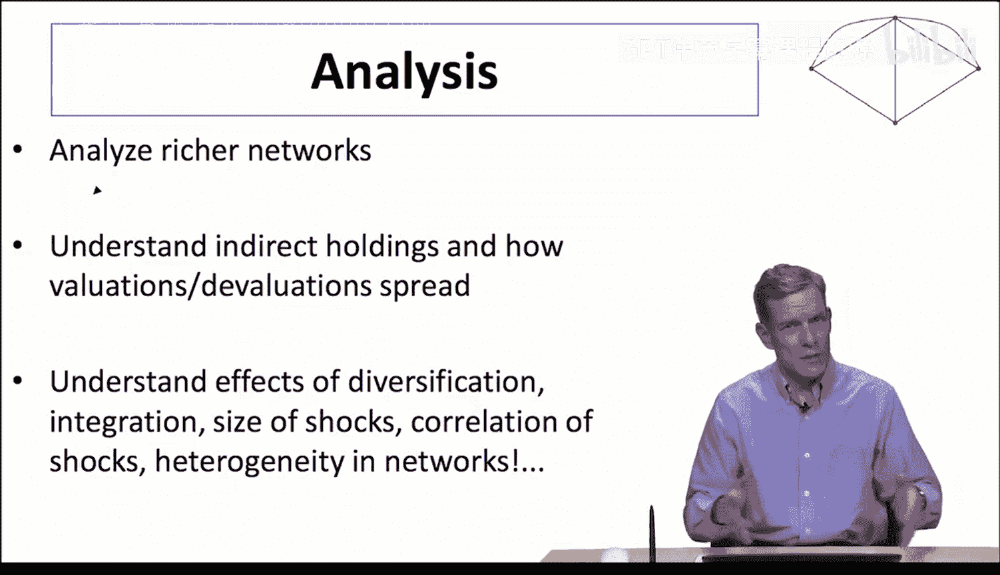

#  060：金融传染模拟应用（可选/进阶）

## 概述

在本节课中，我们将学习如何应用网络模型来模拟金融系统中的传染效应。我们将从一个简单的组织间相互依赖模型出发，探讨当某个组织破产时，其影响如何通过网络传播，并分析不同网络结构（如多样化程度和整合水平）如何影响传染的范围和强度。

---

## 网络模型与金融传染

上一节我们介绍了组织间相互依赖的基本模型。本节中，我们来看看如何利用这个模型进行模拟，以理解金融传染的动态过程。

我们考虑一个有 `n` 个组织的网络。每个组织 `i` 的资产初始价值设为 `1`。组织间的相互持有关系由一个矩阵 `C` 描述，其中 `C_ij` 表示组织 `i` 对组织 `j` 的资产持有比例。

## 构建模拟网络

以下是构建模拟网络的关键步骤：

1.  **网络生成**：我们使用类似 Erdős–Rényi 的随机图模型。组织 `i` 与组织 `j` 之间存在连接（即 `i` 持有 `j` 的资产）的概率为 `p`。期望连接数（即多样化程度）`D` 定义为 `p * (n-1)`。
    *   **公式**：`p = D / (n-1)`
    *   **含义**：`D` 值越高，表示每个组织投资的伙伴组织越多，即**多样化程度**越高。

2.  **资产持有比例**：假设每个组织总资产中，有比例 `C` 的部分被其他组织交叉持有（即整合到经济网络中），剩余部分 `(1-C)` 由私人持有。比例 `C` 被称为**整合水平**。
    *   对于存在连接的组织 `i` 和 `j`，`i` 对 `j` 的具体持有比例 `C_ij` 计算如下：
    *   **公式**：`C_ij = (C / d_j_in) * G_ij`
    *   **解释**：`G_ij` 是一个指示函数（1 表示有连接，0 表示无）。`d_j_in` 是组织 `j` 的入度，即有多少组织持有 `j` 的资产。这意味着 `j` 被交叉持有的资产 (`C`) 在其所有持有者中平均分配。

3.  **计算暴露矩阵 A**：基于矩阵 `C`，我们可以计算出关键的**暴露矩阵 A**，其中 `A_ij` 表示组织 `i` 的资产价值中有多少比例最终依赖于组织 `j` 的资产价值。这包含了所有间接持有的影响。

## 模拟传染过程

有了网络和初始资产价值后，我们可以模拟破产传染：

1.  **触发破产**：我们让某个特定组织 `k` 的资产价值 `P_k` 直接降至 `0`（模拟其破产）。
2.  **价值重估**：由于组织间相互持有，`k` 的破产会导致持有其资产的其他组织资产价值下降。我们根据暴露矩阵 `A` 重新计算所有组织的资产价值。
3.  **破产传播**：我们设定一个破产阈值 `θ`（例如 0.8）。如果某个组织 `i` 重估后的资产价值低于其初始价值的 `θ` 倍（即损失超过 `(1-θ)*100%`），则该组织也被视为破产，其资产价值在后续计算中设为 `0`。
4.  **迭代与级联**：重复步骤 2 和 3。新破产的组织会进一步导致其他组织价值下降，可能引发更多破产。这个过程持续进行，直到没有新的组织破产为止。最终破产的组织比例反映了金融传染的严重程度。

## 模拟结果与分析

通过改变参数 `D`（多样化程度）、`C`（整合水平）和 `θ`（破产阈值）进行多次模拟，我们可以观察到一些非单调的、有趣的现象：

以下是模拟结果揭示的核心规律：

*   **低多样化 (`D` 很小)**：网络连接稀疏。一个组织的破产只能影响极少数直接关联者，因此**传染范围很有限**。
*   **中等多样化 (`D` 适中)**：网络已连接，但每个组织的合作伙伴数量有限。此时，一个合作伙伴的破产会对该组织造成**较大比例的冲击**，容易触发其破产。因此，**传染最容易发生且范围较广**。
*   **高多样化 (`D` 很大)**：网络高度连接，每个组织拥有大量合作伙伴。虽然破产可能传播得更广，但每个合作伙伴的破产对该组织资产价值的**影响比例被稀释了**。因此，传染的**触发和传播反而变得更难**，总破产比例下降。

类似地，改变整合水平 `C` 也会产生非单调的影响：

*   **低整合 (`C` 很小)**：资产主要由私人持有，组织间相互暴露少，传染风险低。
*   **中等整合 (`C` 适中)**：组织间相互暴露达到足以引发连锁反应的临界点，传染风险最高。
*   **高整合 (`C` 很大)**：资产几乎完全在经济网络内循环。此时，单个组织自身资产的失败对其自身价值影响不大（因为其价值主要来自其他组织），因此**更难触发初始破产**，传染风险再次降低。

## 模型的意义与扩展

这个简单的网络模型为我们理解金融系统性风险提供了基础视角：

*   **核心工具**：**暴露矩阵 A** 是追踪直接和间接风险暴露的关键工具，它帮助我们将单个组织置于整个网络背景中评估其风险。
*   **监管启示**：模型表明，并非连接越紧密的系统越脆弱。适度的多样化和整合可能反而最危险。这为金融监管者评估和管理系统性风险提供了思路，例如关注那些处于网络中心、且合作伙伴不多的机构。
*   **模型扩展**：此基础模型可以进一步丰富，用于分析更复杂的场景，例如：
    *   核心-边缘网络结构（如少数大银行与众多小机构）。
    *   冲击的相关性与异质性。
    *   组织规模的差异。

## 总结

本节课中，我们一起学习了如何利用网络模型模拟金融传染。我们构建了一个包含多样化程度 (`D`) 和整合水平 (`C`) 的简单模型，通过模拟破产的级联效应，发现传染风险与网络结构之间存在非单调关系：中等程度的连接和暴露可能导致最大的系统性风险。这个分析框架强调了从网络整体视角（而不仅仅是孤立个体）评估金融风险的重要性，并为后续更复杂的模型分析奠定了基础。