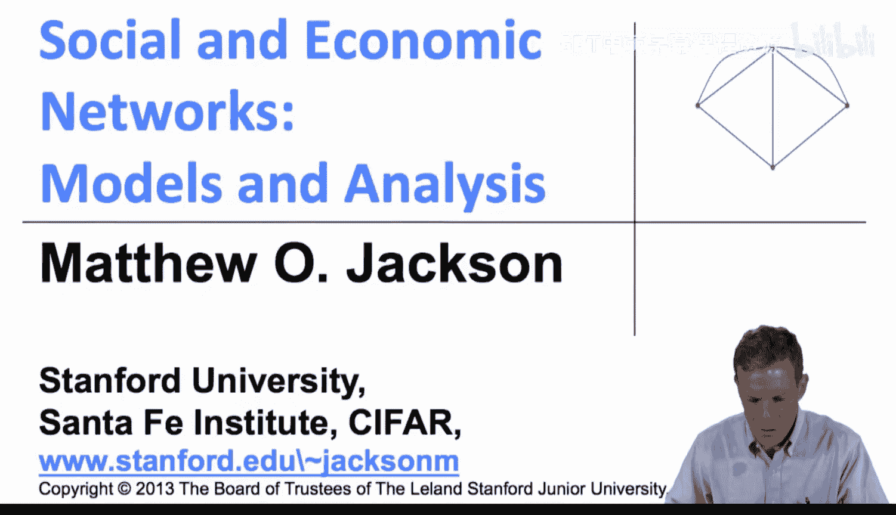
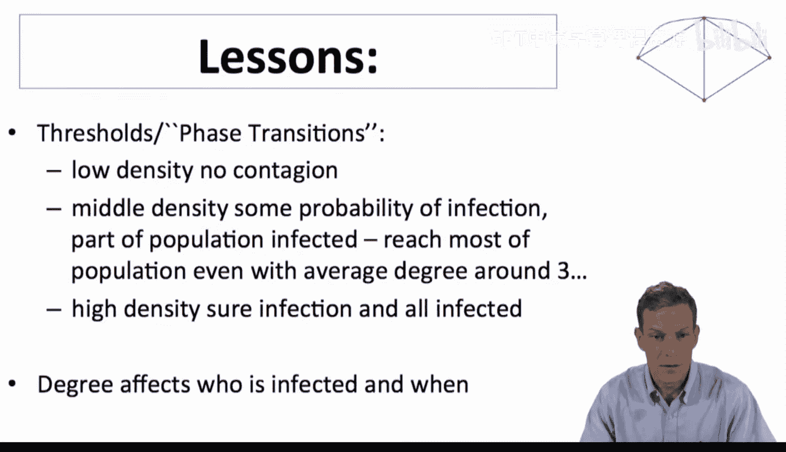
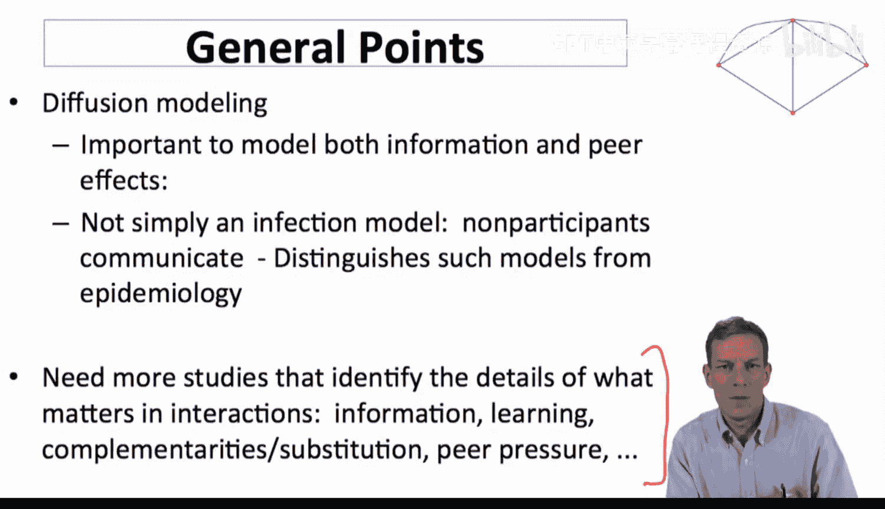
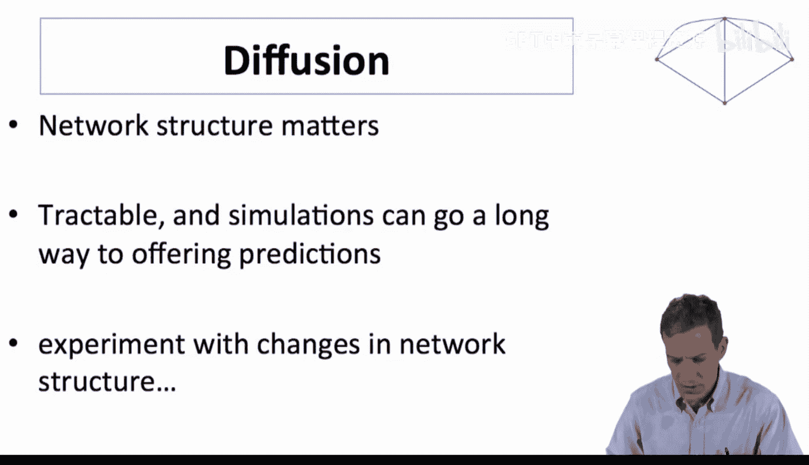
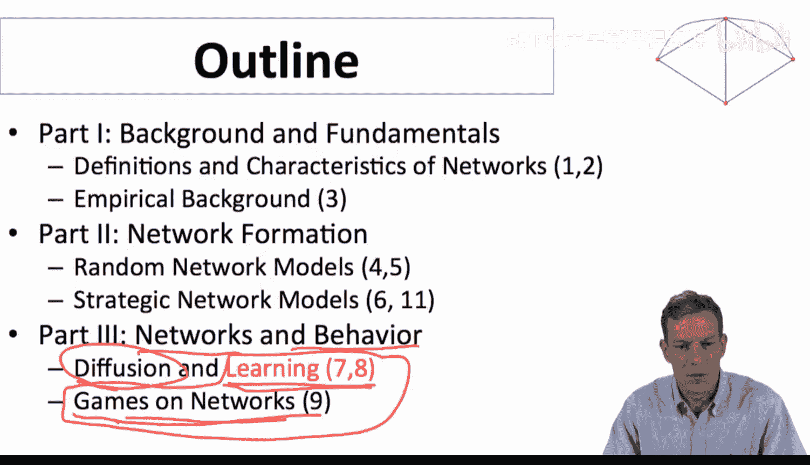
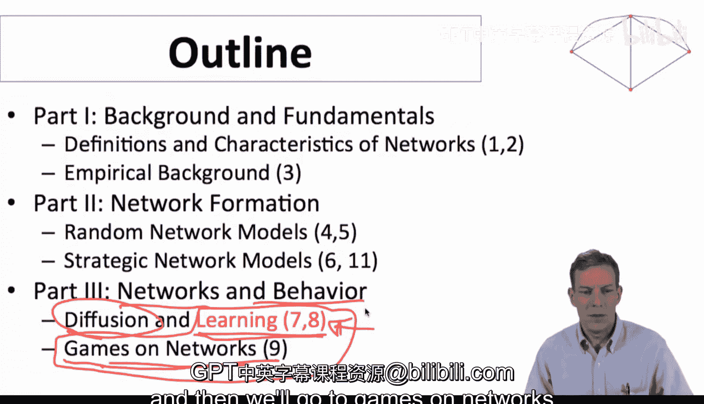
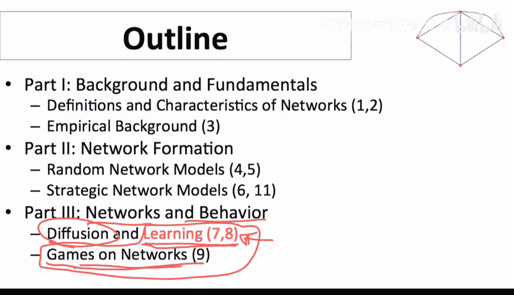

#  061：扩散模型总结 🧠

在本节课中，我们将总结关于扩散模型的核心发现与要点。我们将回顾扩散过程中的关键现象，并探讨如何将模型应用于更广泛的场景。

---

## 核心要点总结

上一节我们探讨了扩散模型的具体机制，本节中我们来总结其核心规律与启示。

以下是关于扩散模型的基本结论：

1.  **相变现象**：扩散的发生与否存在急剧的相变。当网络中的互动密度很低时，基本不会发生扩散。当密度达到一个中间水平时，扩散会迅速且广泛地发生。在我们分析的模型中，例如在埃尔德什-雷尼随机图上，平均度数从 **1** 增加到 **3**，就足以使扩散范围从“几乎没有”转变为“几乎完全扩散”。
2.  **度数与感染**：个体的度数（连接数）与其被感染的可能性相关。在大多数模型中，更高的互动率通常会导致更高的感染率。
3.  **模型的重要性**：扩散建模在许多应用中都非常重要，其范围远不止于流感等传染病模型。它同样适用于信息传播和纯粹效应（如从众心理）的建模。
4.  **超越流行病学**：与经典流行病学模型不同，社会扩散模型需要考虑人们之间的交流与相互影响。例如，个体是否接种疫苗可能取决于其朋友的选择，出行决策可能受目的地疫情的影响。这些因素极大地丰富了模型背景。
5.  **模型与数据的结合**：通过模拟复杂的扩散模型，并将其与真实数据匹配，我们可以从中学习到很多。网络结构至关重要，有时可进行理论分析，而模拟则能有效预测行为。我们可以通过改变网络结构进行实验，观察其对整体行为的影响。

---

## 课程脉络与展望

至此，我们已经完成了课程的大部分内容，探讨了网络如何影响行为。现在，我们正进入课程的收尾阶段，重点是如何丰富和深化我们的模型。

在之前的视频中，我们将扩散过程视为一个相对机械的过程。接下来，我们将更明确地尝试对**学习过程**和**社会效应**进行建模。

随后，我们将进入**网络上的博弈**建模，研究个体之间的策略性互动。这可以看作是对我们刚刚看到的最后一个应用（社会效应模型）的深化，旨在帮助我们理解这些复杂的互动行为。

因此，接下来的内容是**学习模型**，然后我们将探讨**网络上的博弈**，以深入理解互动与行为。

---

## 总结

本节课中，我们一起学习了扩散模型的核心要点：扩散存在**相变**，**网络结构**和个体**度数**影响扩散结果，并且此类模型在信息、行为和社会效应传播中具有广泛应用。我们认识到需要建立更丰富的模型来捕捉现实中的复杂互动，并可以通过**模拟**和**数据匹配**来深化理解。接下来，课程将转向对学习过程和网络博弈的建模。