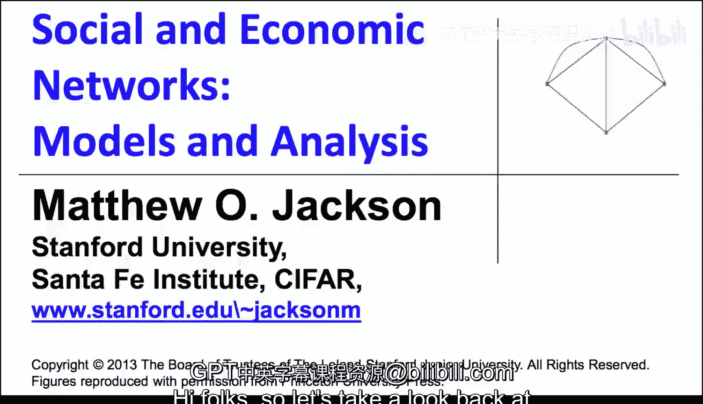
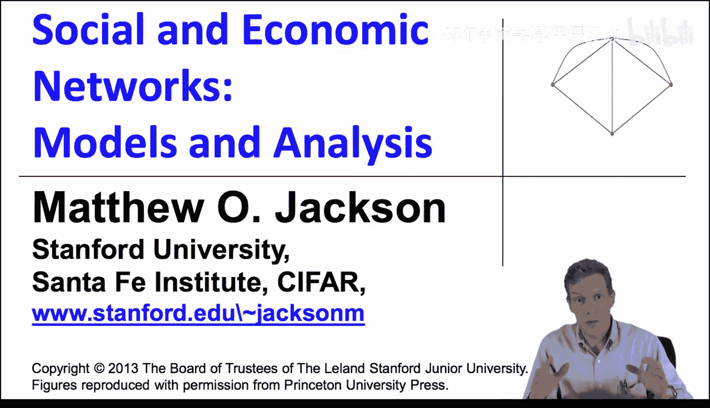
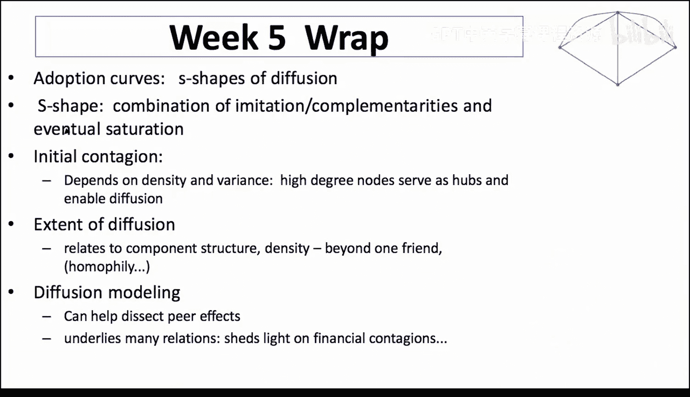

#  062：第五周总结

## 📚 概述
在本节课中，我们将回顾第五周关于“扩散”主题的核心内容。扩散是跨多个学科的重要现象，我们将总结其关键模型、网络结构的影响以及如何通过建模来理解现实中的传播过程。

## 🔍 扩散的跨学科重要性
扩散在众多不同学科中都有研究，例如市场营销、社会心理学、心理学、社会学、经济学和人类学。扩散在许多不同的行为中都很重要。因此，存在不同的程式化事实和许多被使用的模型。流行病学和医学也涉及扩散，这表明扩散是许多领域的基础。

## 📈 S型采用曲线与巴斯模型
一些实证研究显示，采用曲线呈S型。事物开始时缓慢，然后加速，最终趋于饱和。这种优美的曲线有其内在逻辑，我们讨论并简要介绍了巴斯模型。模仿和互补性的结合意味着，做某事的其他人越多，特定个体做这件事的可能性就越大。如果具备这种特征，就会产生初始的上升和加速。最终的饱和则会导致增长逐渐放缓。因此，我们常常会看到这类曲线。巴斯模型在捕捉宏观层面的这些现象上非常有效。

## 🌐 网络在扩散中的作用
我们可以建立更精确的模型，将网络结构纳入其中。网络可以帮助我们理解事物何时会传播。我们何时会看到流行病？会有多少人被影响？等等。

### 初始传染与SIS模型
当我们研究这类模型时，理解例如SIS模型，我们发现高度数节点倾向于充当枢纽并促进扩散。因此，总体上更高的网络密度意味着你往往有更多的连接，也就有更多的扩散或传染机会。高度数节点可以充当枢纽，因此更高的度数方差也可能增加你看到传播的可能性。

### 网络结构的影响
我们看到了不同网络结构之间的差异，例如具有无标度度分布的幂律网络，在许多其他网络可能不会发生传染的情况下，它却能导致传染，这取决于具体的度数阈值。

## 📊 扩散范围与相变
我们还研究了巨型连通分支的大小，这再次回到了我们的相变等概念。事实证明，从无扩散到开始扩散，再到迅速达到饱和，这个过程转变相当快。特别是在研究纽曼-斯特罗加茨型网络时，大部分变化发生在平均度数1到3之间。如果平均每人告诉的朋友数少于1个，扩散就不会真正发生，事物会逐渐消亡，这是一个衰减的系统。如果他们告诉的人数超过1个，你就有了扩张的特性，事物可以开始传播。而当你达到平均每人告诉3个其他人时，就会迅速达到完全饱和。

## 🤝 同质性及其影响
同质性可以开始影响这个过程。我们没有过多讨论这一点，但现在有一些模型正试图纳入更多的网络结构和断裂等，这可以精确地影响扩散的方式。

## 🧮 扩散建模的应用
最后，我们研究了不同情境下的扩散建模。我们可以开始写下我们认为正在发生的明确模型。通过建立这些模型，它们实际上相当容易模拟、应用于数据，并能帮助我们理解，例如同伴效应：有多少现象是由于信息传递，而不是行为的互补性造成的？我们可以开始研究金融传染等现象，并理解网络结构如何导致一个组织向另一个组织传染。每种不同的情境，对于一个节点最终影响另一个节点所需的条件，都有不同的属性。因此，通过改变这些条件，我们可以得到不同的模型，但这些模型在模拟过程和获得预测，然后应用于数据方面，往往相当易于处理。

## 🎯 总结
本节课中，我们一起学习了扩散的核心概念。我们回顾了S型采用曲线、巴斯模型，以及网络结构（如度数分布和密度）如何深刻影响扩散的启动和范围。我们还探讨了通过建立明确模型来理解复杂传播过程（如金融传染）的方法。这些关于网络结构和动态过程相互作用的主题，将为我们接下来学习网络上的学习和博弈奠定基础。