#  063：学习模型概述 🧠

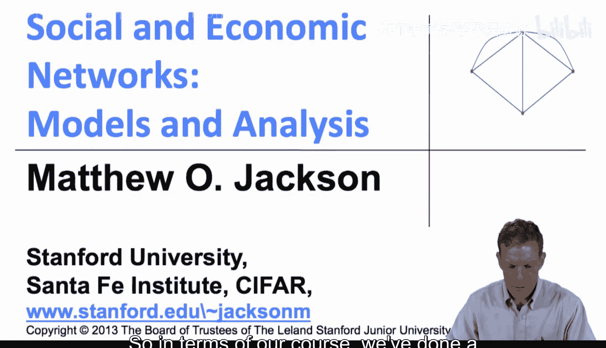

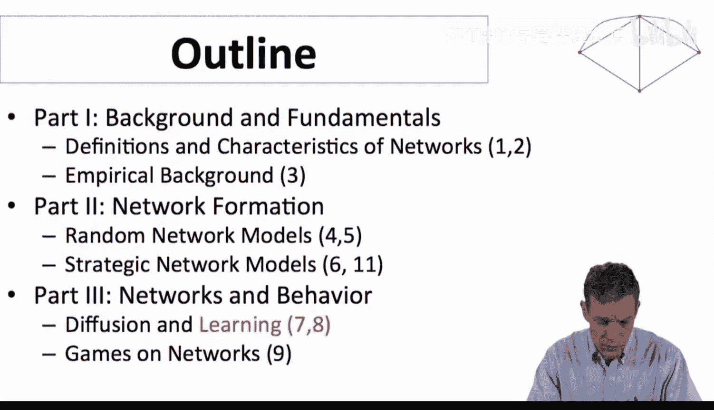

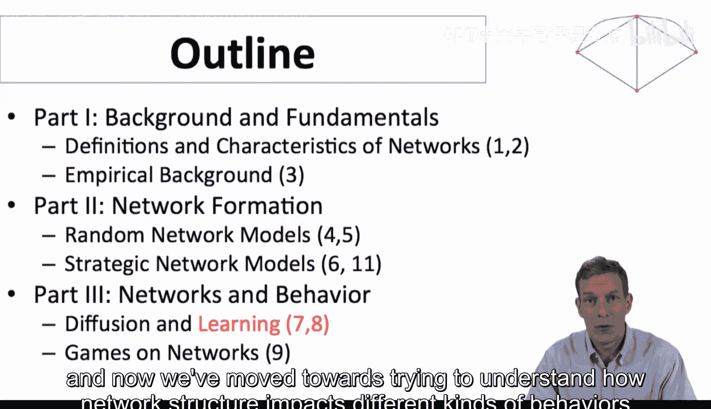

在本节课中，我们将要学习网络中的信息传播与个体学习行为。我们将探讨两种核心的学习模型：贝叶斯学习模型和DeGroot模型。通过学习这些模型，我们可以理解个体如何根据自身经验以及观察邻居的行为来更新自己的信念和决策，并最终分析整个社会网络是否会达成共识。

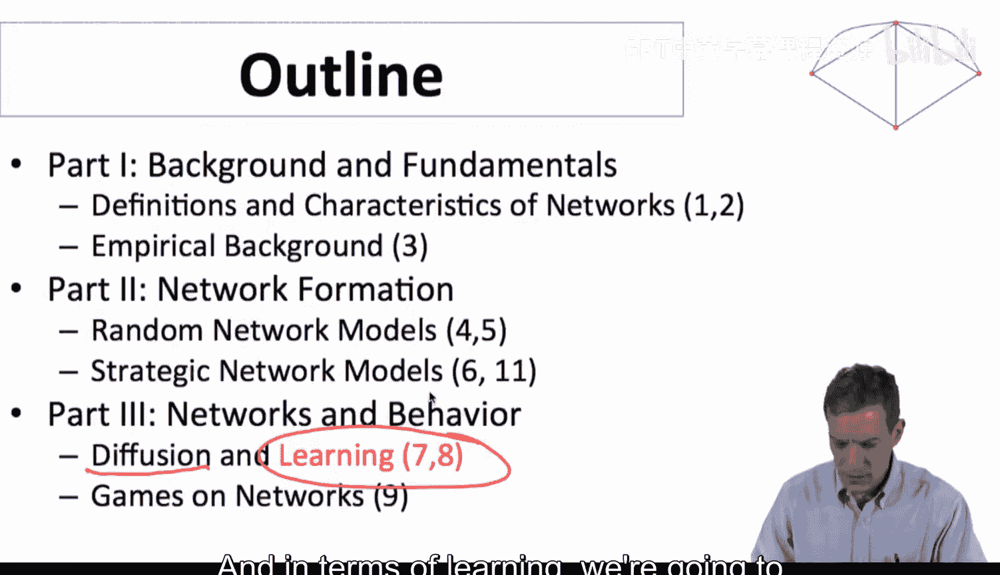

---

## 贝叶斯学习模型：基础设定与挑战

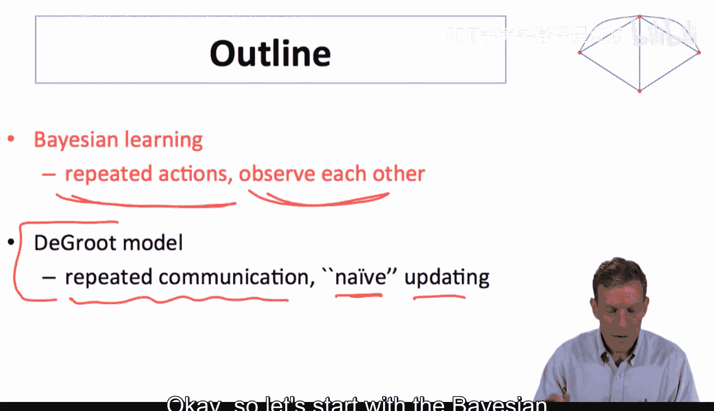

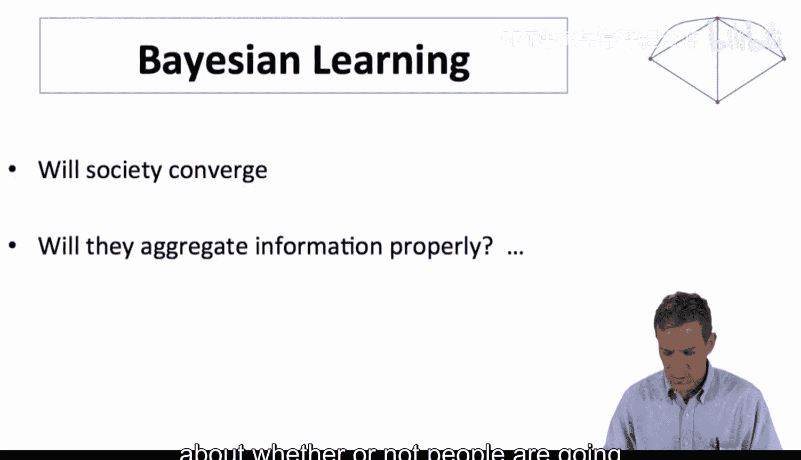

上一节我们介绍了课程的整体框架，本节中我们来看看第一个模型——贝叶斯学习模型。这是一个个体基于观察到的信息，使用贝叶斯法则进行理性更新的模型。

### 模型设定

假设存在一个由 **N** 个玩家组成的连通网络。每个玩家在每个时期 **t** 都需要在两个行动 **A** 和 **B** 之间做出选择。

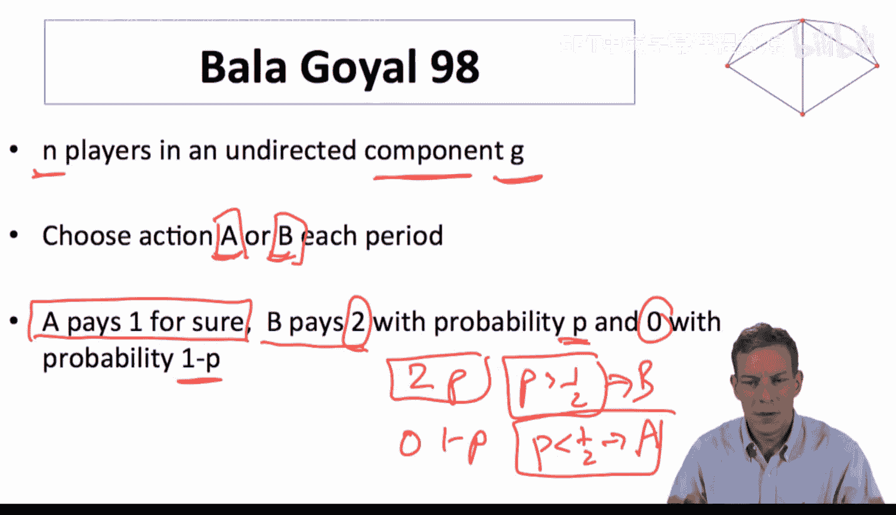

*   **行动 A**：收益确定，为 **1**。
*   **行动 B**：收益不确定。以概率 **P** 获得收益 **2**，以概率 **1-P** 获得收益 **0**。

玩家是风险中性的，因此只关心期望收益。行动 **B** 的期望收益为 **2P**。因此：
*   当 **P > 0.5** 时，行动 **B** 更优。
*   当 **P < 0.5** 时，行动 **A** 更优。

然而，真实的 **P** 值是未知的。玩家需要通过实验（尝试行动 **B**）来学习 **P** 的真实值。每个玩家不仅能看到自己的行动结果，还能观察到其所有邻居的行动和结果。

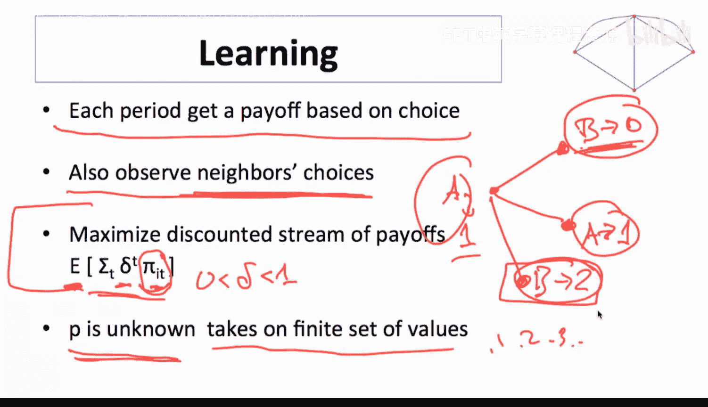

玩家的目标是最大化其贴现后的总期望收益：
`∑_{t=0}^{∞} δ^t * π_i(t)`
其中，`δ` 是贴现因子（`0 < δ < 1`），`π_i(t)` 是玩家 **i** 在时期 **t** 的收益。

### 模型面临的挑战

以下是贝叶斯学习模型在实际分析中遇到的两个主要复杂性：

1.  **复杂的推断问题**：玩家的决策不仅基于直接观察到的收益，还基于对其他玩家决策的推断。例如，如果我看到邻居从行动 **B** 切换回了 **A**，我必须推断这可能是由于他们观察到了其他邻居的坏结果。这要求玩家对整个网络中可能发生的历史进行复杂的概率推断。

2.  **策略性实验与搭便车问题**：即使一个玩家最初认为 **P** 值较低（行动 **A** 更优），他仍有动机去尝试行动 **B** 几次，以获取未来可能的高收益信息（期权价值）。然而，在多人网络中，每个玩家都希望邻居去承担实验的成本（“搭便车”），而自己坐享其成的观察结果。这形成了一个复杂的博弈，其均衡求解非常困难。

为了简化分析，Bala和Goyal（1998）的模型做了两个关键假设：
*   **非策略性行为**：玩家只最大化自身收益，不考虑自己的行动如何影响他人的实验动机。
*   **简化更新规则**：玩家仅根据自己和邻居行动 **B** 所获得的“2”和“0”的结果次数来更新对 **P** 的信念，忽略从他人行动选择中可能推断出的间接信息。

---

## 贝叶斯学习模型的收敛性结论

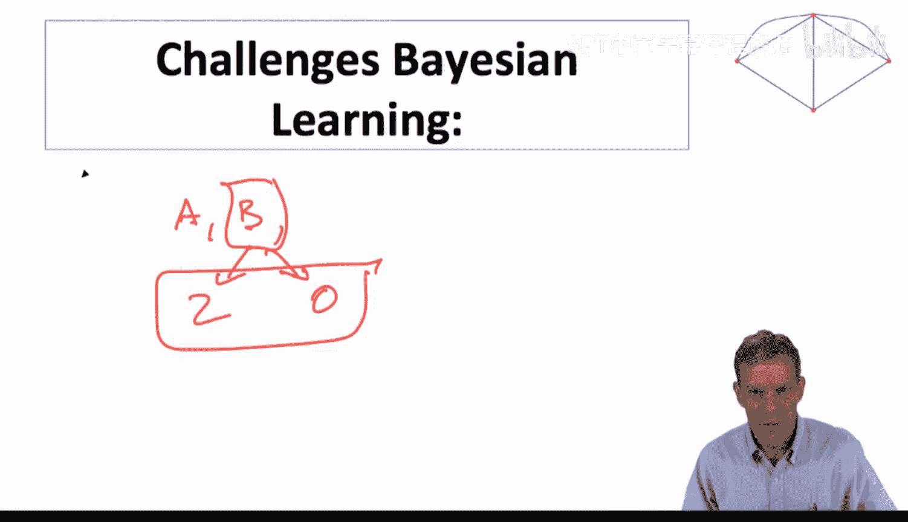

基于上述简化模型，我们可以得到一个关于社会共识的核心命题。

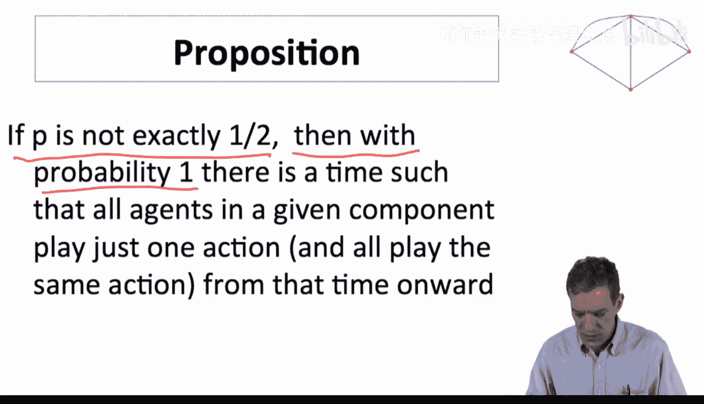

**命题**：假设真实的 **P ≠ 0.5**（即不存在无差异情况），那么以概率1，存在一个（随机的）时间点，在此之后，网络中所有玩家将永远选择**同一个**行动（要么全是 **A**，要么全是 **B**）。

### 证明思路

以下是该命题的直观证明：

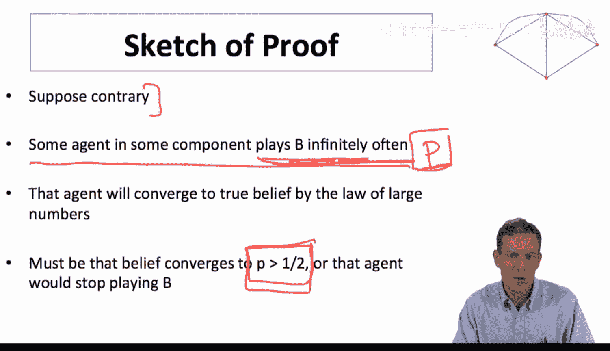

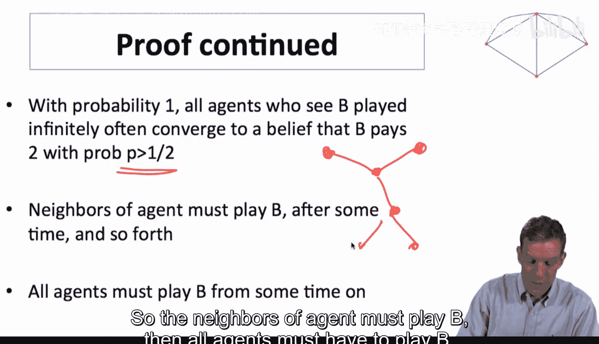

1.  **反证法起点**：假设命题不成立，即社会永远不会收敛到单一行动。这意味着至少有一个玩家会在行动 **A** 和 **B** 之间无限次地切换。
2.  **大数定律的应用**：如果一个玩家无限次地选择行动 **B**，根据大数定律，他通过观察结果对 **P** 的信念估计将无限接近真实值 **P**。
3.  **信念决定行动**：
    *   如果真实 **P > 0.5**，他的信念最终会确信这一点，从而会**永远**选择 **B**，而不会无限次切换。
    *   如果真实 **P < 0.5**，他的信念最终会确信 **B** 不好，从而会**停止**选择 **B**，也不会无限次切换。
    *   因此，只有当真实 **P > 0.5** 时，才可能有玩家无限次选择 **B**。
4.  **信息的网络传播**：如果一个玩家无限次选择 **B** 并学习到 **P > 0.5**，那么他的所有邻居都会观察到大量 **B** 及其好结果，从而也会学习到 **P > 0.5** 并最终永远选择 **B**。这个过程会通过网络逐级传播，最终导致**所有**玩家都永远选择 **B**。
5.  **结论**：因此，只存在两种可能：
    *   有人无限次选择 **B** → 所有人收敛到 **B**。
    *   没有人无限次选择 **B** → 所有人最终都停止选择 **B**，从而收敛到 **A**。

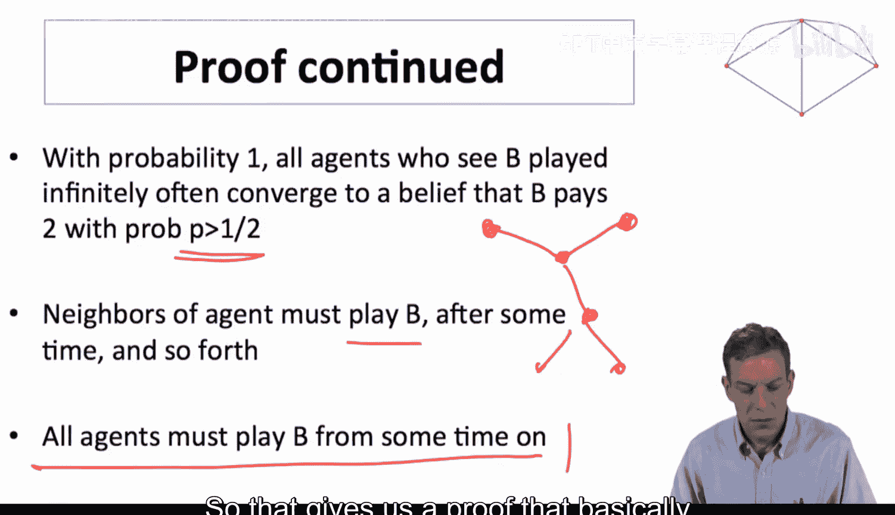

---

## 模型结论、局限性与过渡

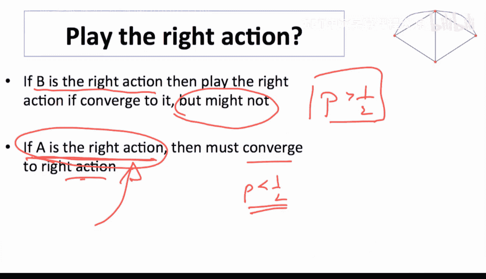

本节课中我们一起学习了贝叶斯学习模型的基本设定、核心结论及其局限性。

### 主要结论

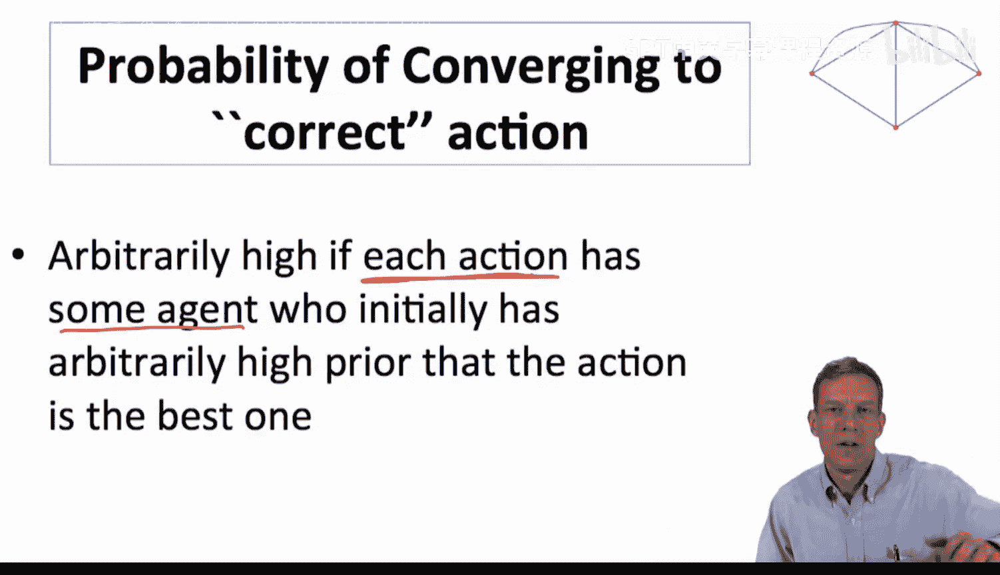

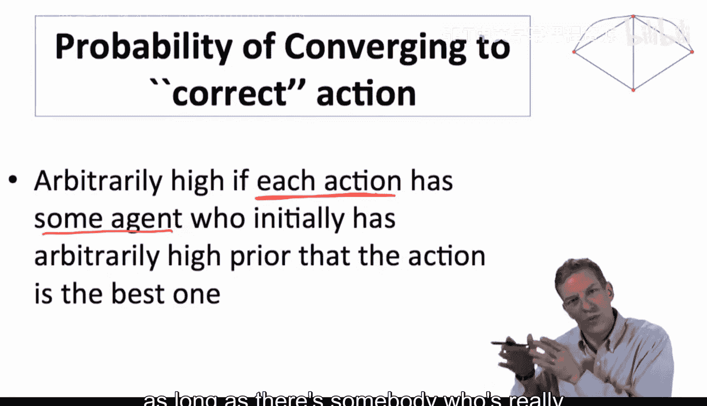

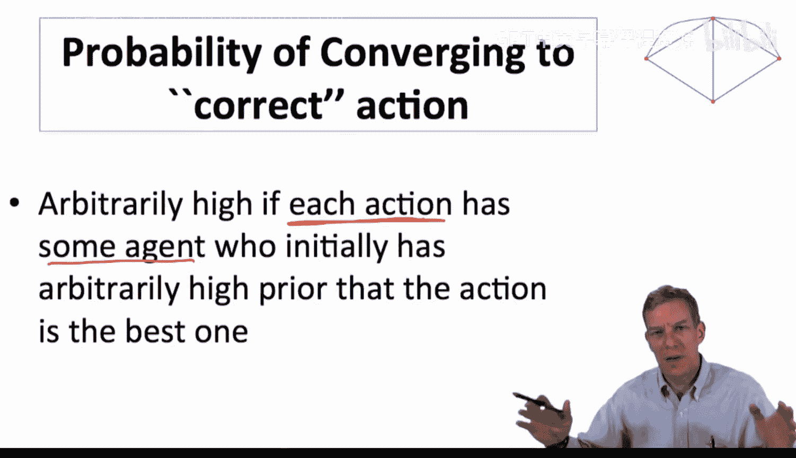

*   **共识达成**：社会最终会锁定在同一个行动上，形成共识。
*   **正确性不确定**：
    *   如果最优行动是 **A**（**P < 0.5**），社会**必然**会学习到这一点并收敛到正确的行动 **A**。
    *   如果最优行动是 **B**（**P > 0.5**），社会**可能**会由于早期实验的坏运气而过早放弃 **B**，从而错误地收敛到 **A**。

### 模型的局限性

1.  **同质化收益**：模型假设所有玩家从同一行动中获得相同的收益。现实中，新技术可能只适合部分人，这种异质性会使学习推断变得复杂。
2.  **重复实验假设**：模型依赖于玩家可以反复尝试并立即获得反馈。对于气候变化等“一次性”或反馈缓慢的重大问题，此模型不适用。
3.  **环境静止性**：模型假设环境（**P** 值）不变。动态变化的环境会增加学习难度。
4.  **网络结构作用有限**：在收敛性证明中，网络仅作为信息传播的通道，其具体结构（如谁连接谁）并未影响“是否收敛”的定性结论，只可能影响收敛速度。

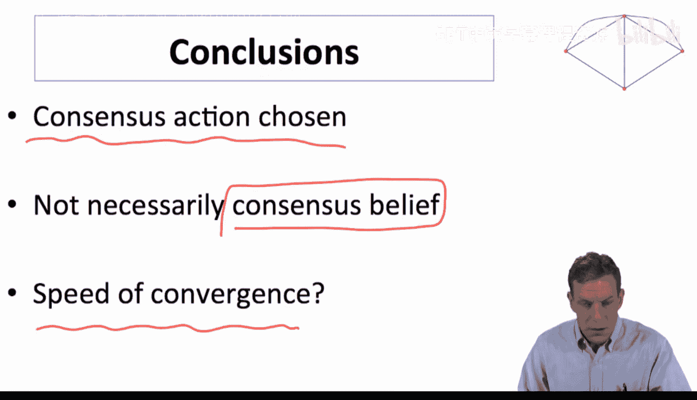

### 过渡到DeGroot模型

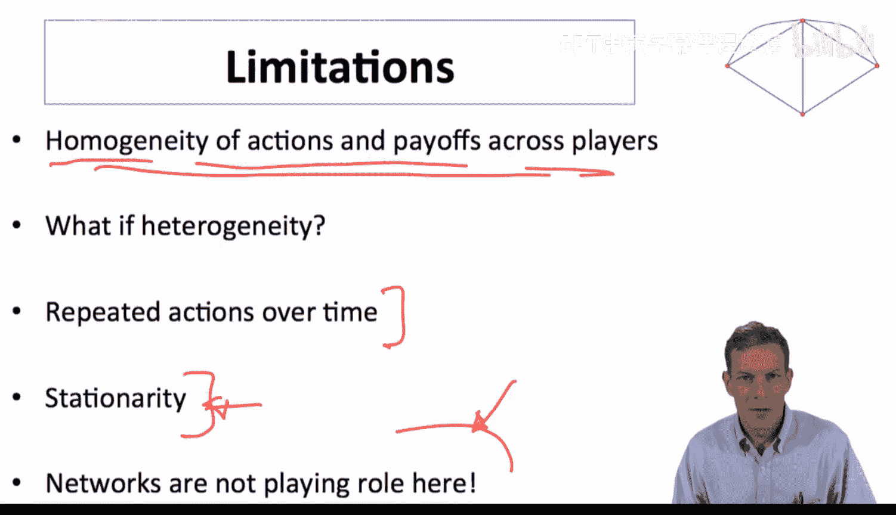

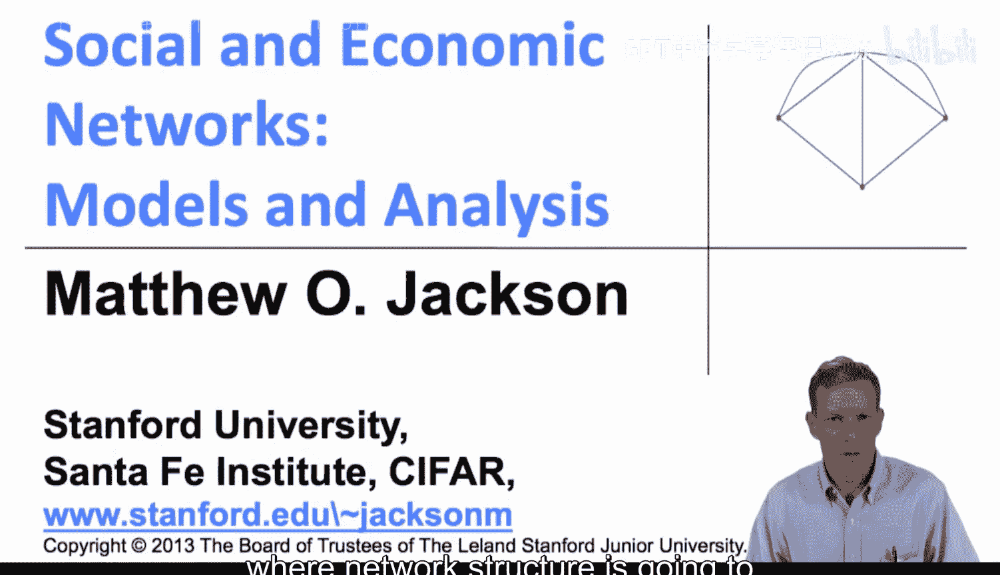

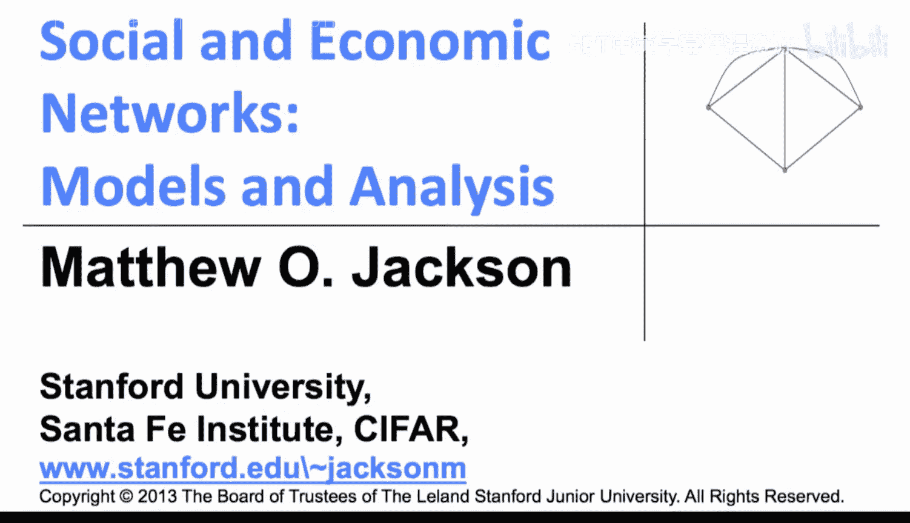

正是由于贝叶斯模型的复杂性和网络结构作用的隐蔽性，我们将转向一个更简单、更能凸显网络拓扑结构的模型——DeGroot模型。在DeGroot模型中，个体以一种“天真”的方式更新信念：简单地对自己和邻居的信念进行加权平均。这将使我们能够更清晰、更量化地分析网络结构如何具体地影响学习过程、共识形成以及信念的演化路径。