#  064：德格鲁特模型 📚

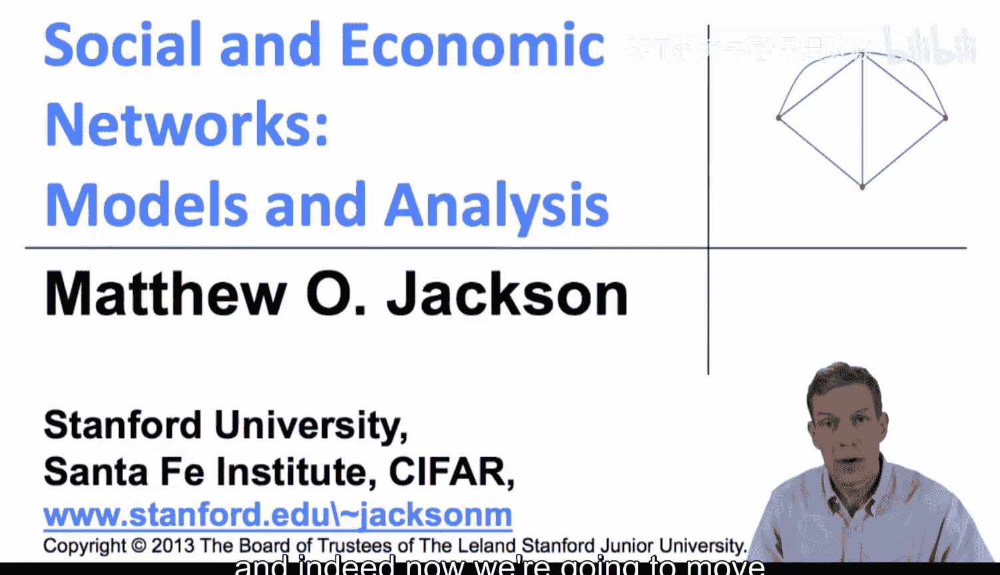

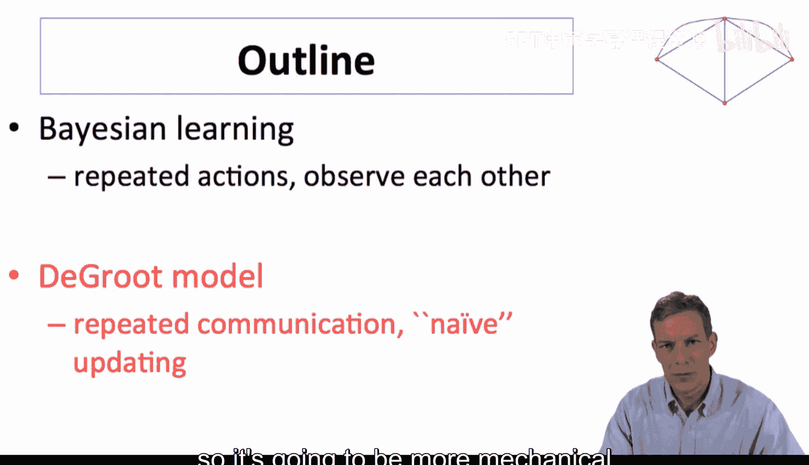

在本节课中，我们将学习德格鲁特模型。这是一个关于重复沟通和朴素信念更新的模型。我们将探讨其基本定义、收敛条件、共识形成，以及网络结构如何影响个体信念的演变和最终的影响力分配。

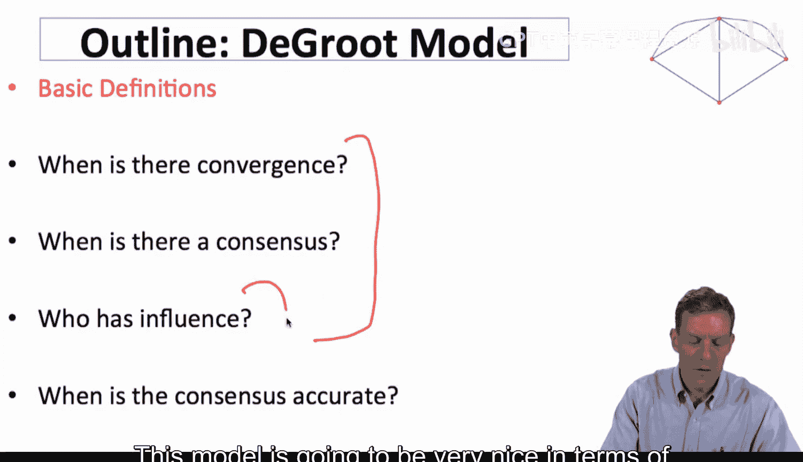

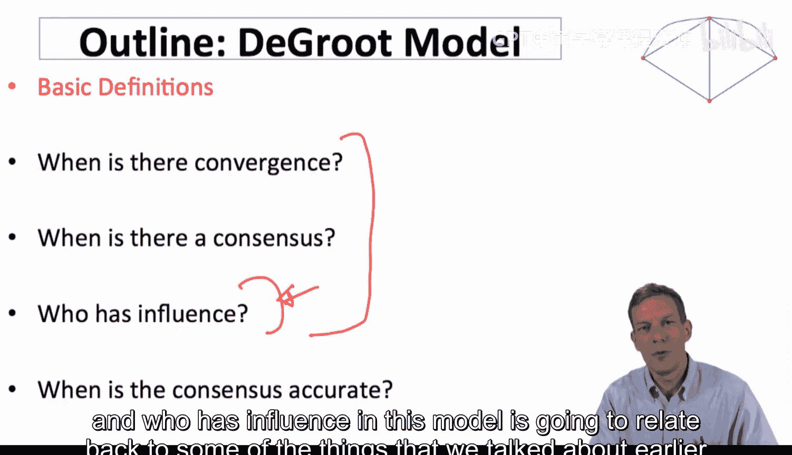

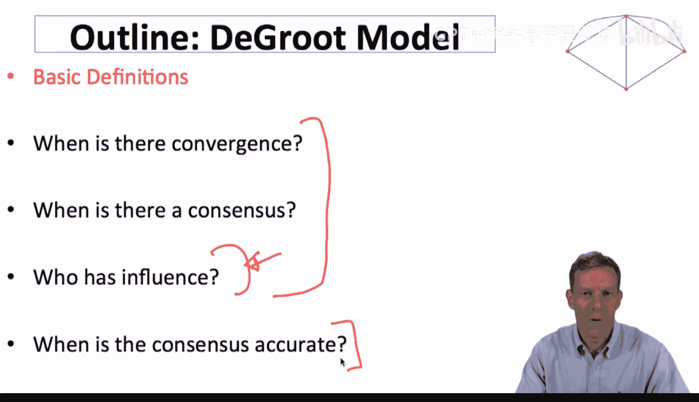

上一节我们简要介绍了贝叶斯学习，本节中我们来看看德格鲁特模型。该模型描述了人们如何通过重复与邻居交流并平均彼此信念来更新自己的观点。它的优势在于模型简单、数学优雅，并能轻松融入网络结构进行分析。其局限性在于更新过程是机械式的，缺乏策略性考量。

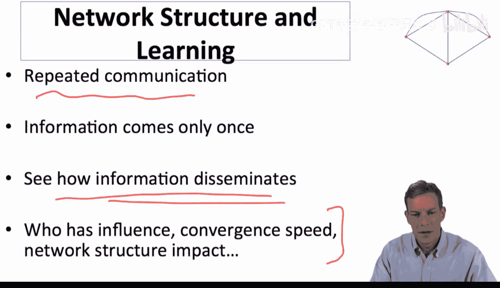

## 模型基本设定 🧩

模型的结构与我们之前所见有所不同。信息仅在初始时刻一次性给出，之后个体通过与邻居的重复沟通来更新信念。我们将看到信息如何传播、谁具有影响力、收敛速度如何，以及网络结构如何影响这一切。

以下是模型的核心设定：
*   **个体与网络**：有 `n` 个个体。我们使用一个加权、有向的随机矩阵 **T**（信任矩阵）来描述网络。
*   **初始信念**：在时间 `t=0`，每个个体 `i` 拥有一个初始信念 `p_i(0)`，通常设定在 `[0,1]` 区间内，代表其对某个事件（如全球变暖）发生概率的估计。
*   **更新规则**：在每一个时间步 `t`，个体 `i` 通过对其邻居（包括自己）上一期的信念进行加权平均来更新自己的信念。更新公式为：
    `p_i(t) = Σ_j [T_ij * p_j(t-1)]`
    其中，`T_ij` 是个体 `i` 赋予个体 `j` 的权重，满足 `T_ij ≥ 0` 且对任意 `i`，`Σ_j T_ij = 1`。

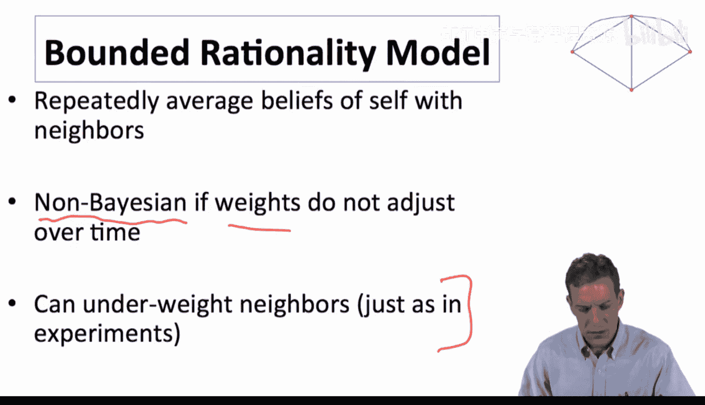

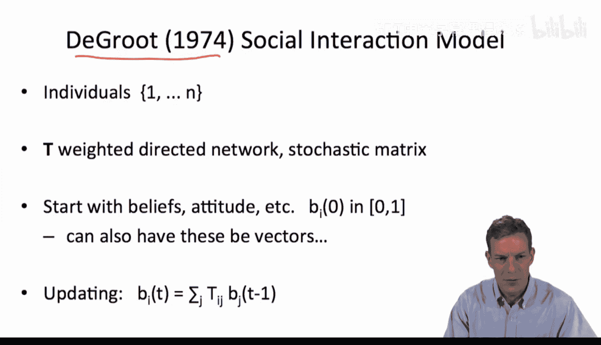

这个模型体现了“有限理性”：个体更新时使用的权重 `T_ij` 是固定不变的，不会像贝叶斯学习者那样根据信息精度动态调整权重。这捕捉了人们可能低估邻居信息或固执己见的行为。

## 模型示例与运作 🔄

让我们通过一个具体例子来理解模型的运作。

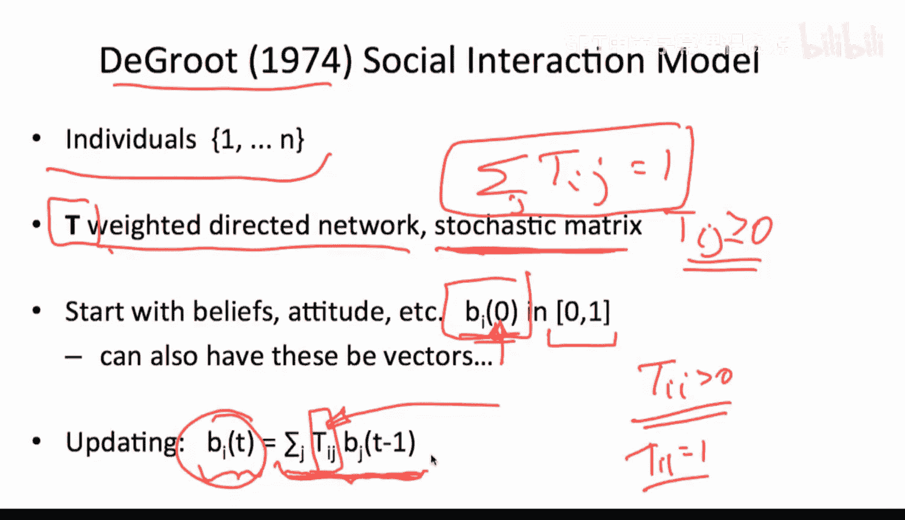

假设有三个个体，其信任矩阵 **T** 和初始信念 `p(0)` 如下：
```
个体1： T = [1/3, 1/3, 1/3]， p1(0) = 0
个体2： T = [1/2, 1/2, 0]，   p2(0) = 1
个体3： T = [1/2, 0,   1/2]， p3(0) = 0
```
根据更新规则 `p_i(t) = Σ_j [T_ij * p_j(t-1)]`，我们可以计算：
*   **t=1时**：
    *   `p1(1) = (1/3)*0 + (1/3)*1 + (1/3)*0 = 1/3`
    *   `p2(1) = (1/2)*0 + (1/2)*1 + 0*0 = 1/2`
    *   `p3(1) = (1/2)*0 + 0*1 + (1/2)*0 = 0`
*   **t=2时**：
    *   `p1(2) = (1/3)*(1/3) + (1/3)*(1/2) + (1/3)*0 = 5/18 ≈ 0.278`
    *   `p2(2) = (1/2)*(1/3) + (1/2)*(1/2) + 0*0 = 5/12 ≈ 0.417`
    *   `p3(2) = (1/2)*(1/3) + 0*(1/2) + (1/2)*0 = 1/6 ≈ 0.167`

持续迭代下去，所有人的信念会收敛到一个共识值。在这个例子中，最终会收敛到 `[2/7, 2/7, 2/7]`。

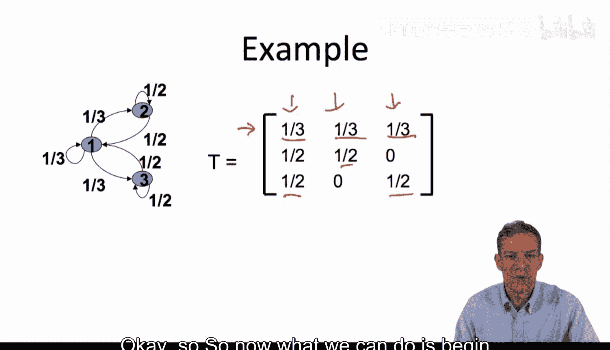

这个例子展示了信念如何通过加权平均过程相互拉近。初始持有不同信念的个体，通过重复沟通，其信念会逐渐趋同。最终共识值的大小反映了初始信念和网络结构（信任权重）的共同影响。

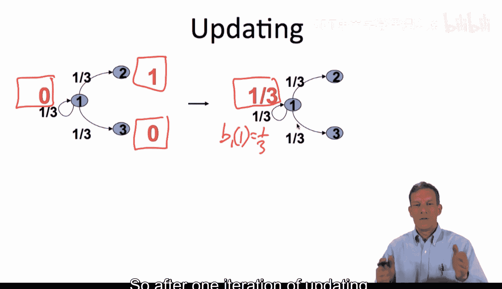

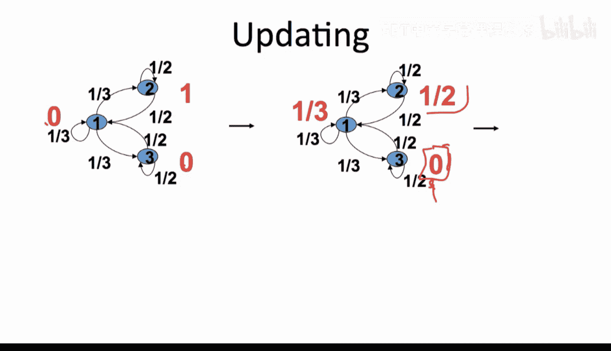

## 模型特性与延伸 💡

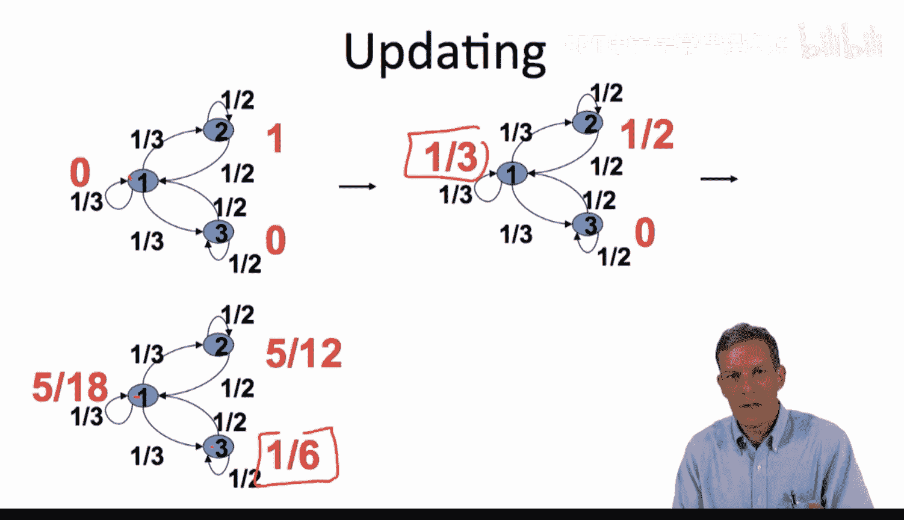

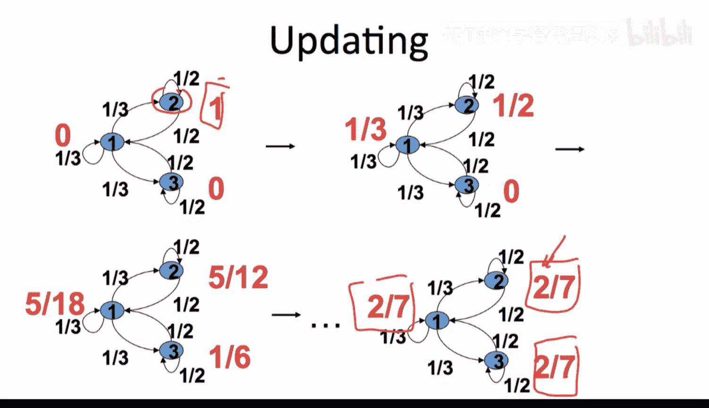

德格鲁特模型是一个线性系统，这使其在数学上易于处理。我们可以精确分析其收敛性、收敛速度以及极限值如何依赖于初始信念和网络结构 **T**。

从信息传播角度看，随着时间推移，个体间接地整合了来自网络中更远距离的信息。`t` 期后，个体整合的信息大致来自 `t` 步可达的邻居。

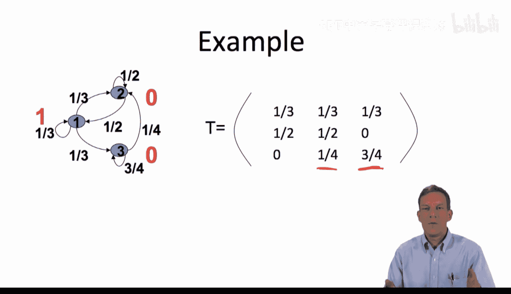

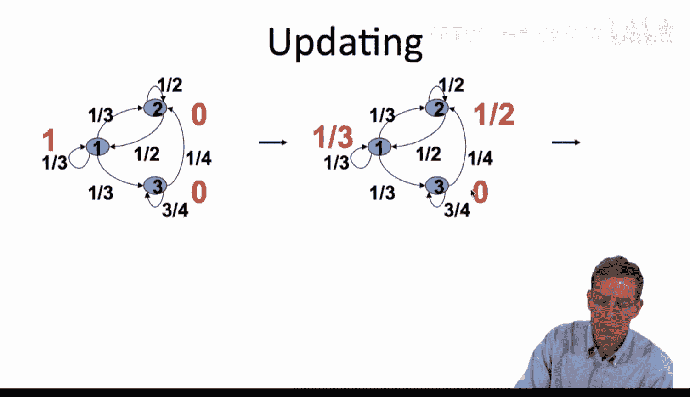

这个模型还有多种解读：
*   **社会影响力**：可以将 `p_i(t)` 视为行为而非信念。个体试图使自己的行为与邻居的行为相匹配，`T_ij` 代表对不同邻居行为的关注程度。
*   **与马尔可夫过程关联**：该模型的更新过程在数学上等价于一个马尔可夫链的状态演化。
*   **与网页排名（PageRank）的关联**：影响力在稳态下的分布，与网页排名算法中页面重要性的计算有相似之处。

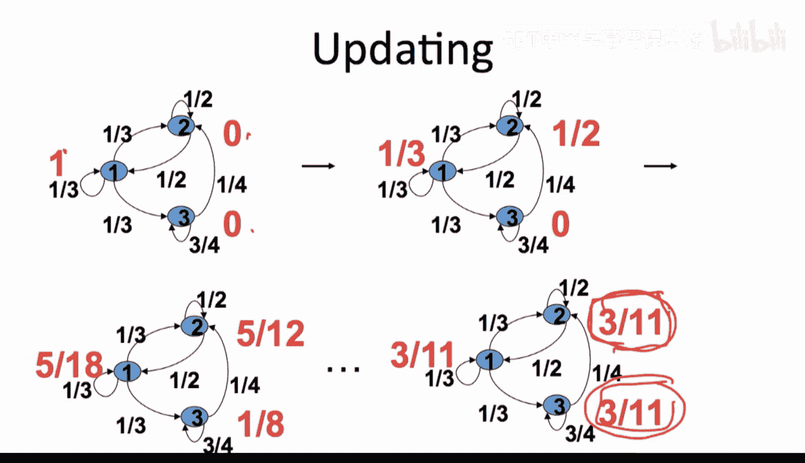

总之，德格鲁特模型是一个简单、易于处理且功能强大的模型，非常适合用于分析社会网络中的意见动态、影响力传播和共识形成。

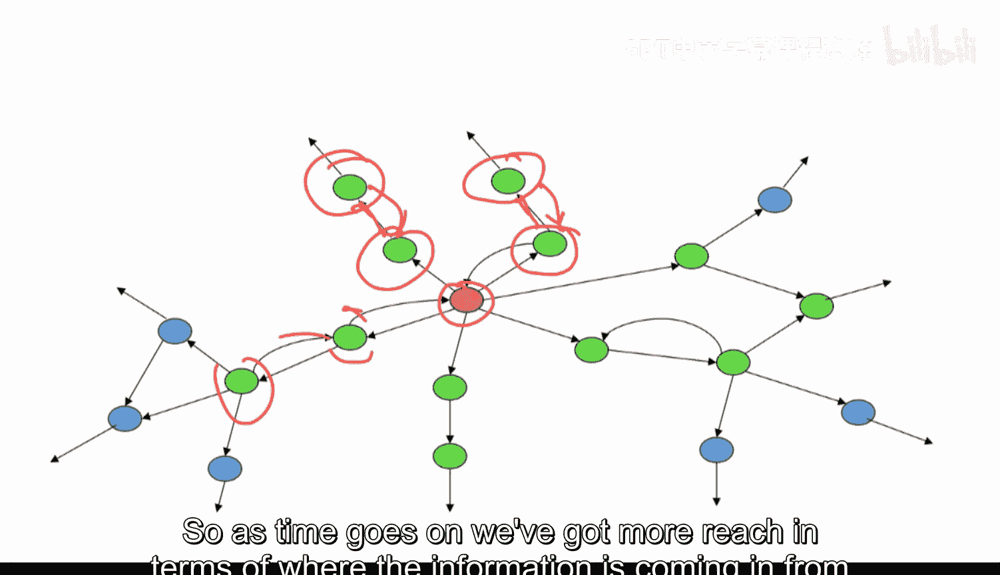

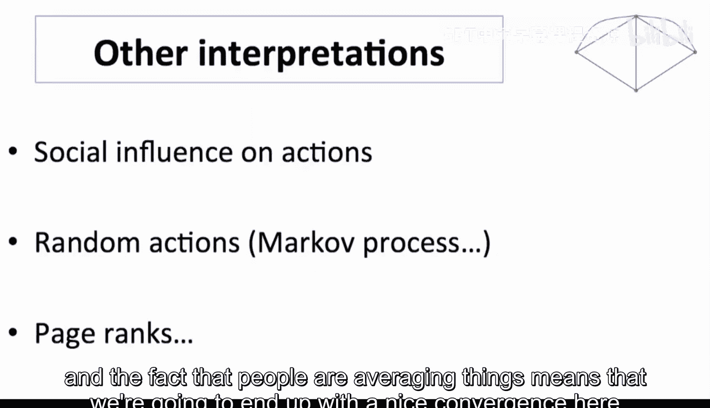

## 总结 📝

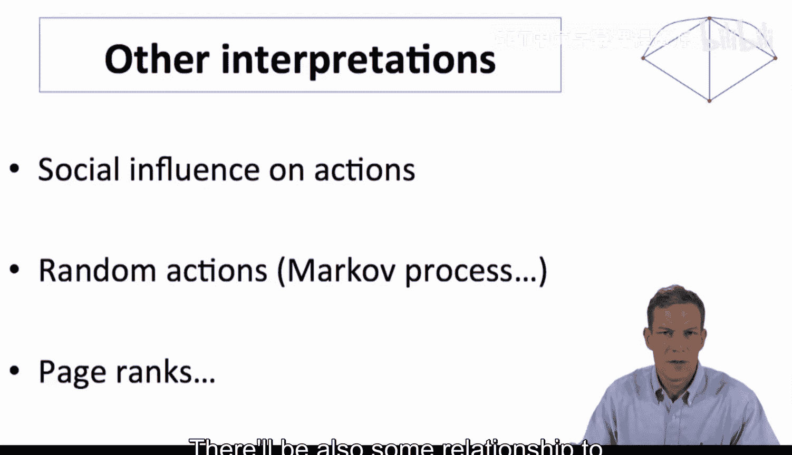

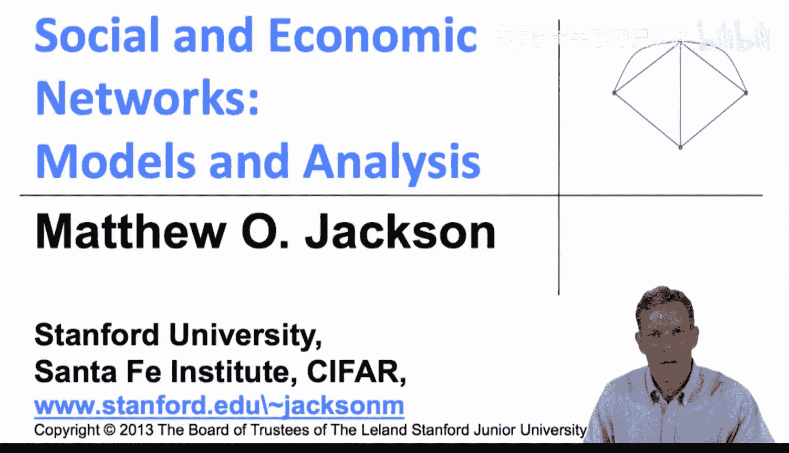

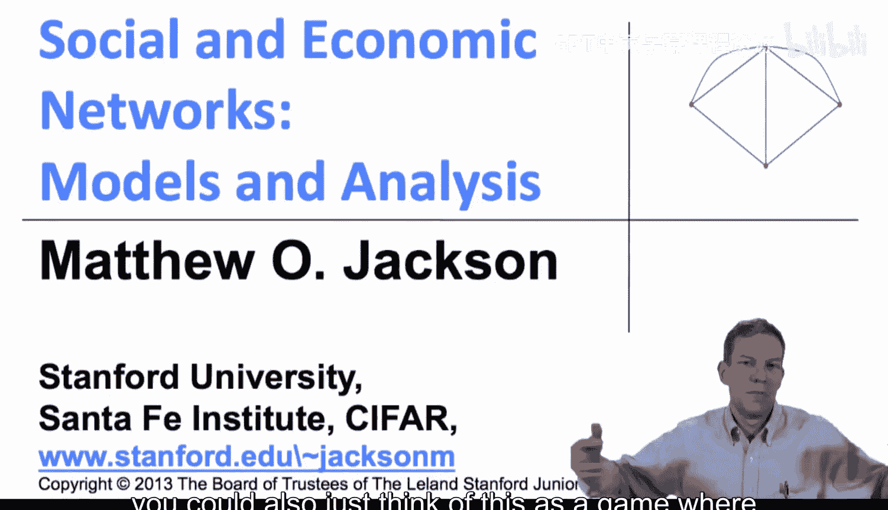

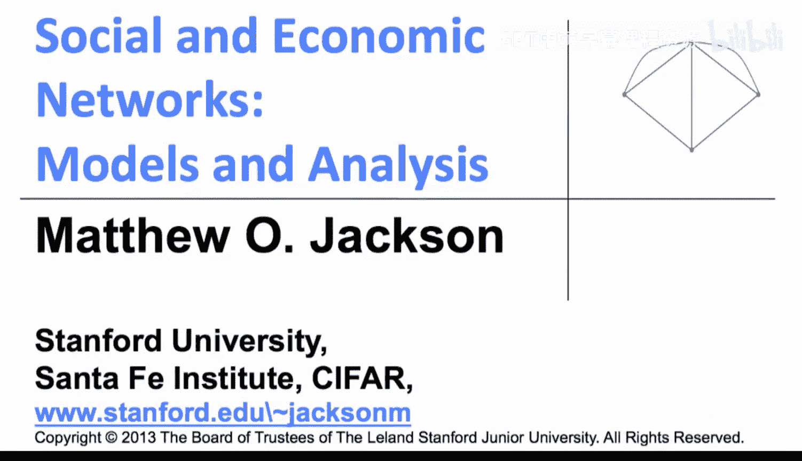

本节课我们一起学习了德格鲁特模型。我们首先介绍了这个基于重复沟通和朴素加权平均的信念更新模型的基本设定。然后，通过具体示例演示了模型如何运作，并观察到信念如何随时间推移而收敛。最后，我们探讨了该模型的数学特性及其在社会影响力分析、马尔可夫过程等多方面的延伸解读。在接下来的课程中，我们将更深入地探讨该模型的收敛条件和稳态分析。