#  065：德格鲁特模型收敛性 📊

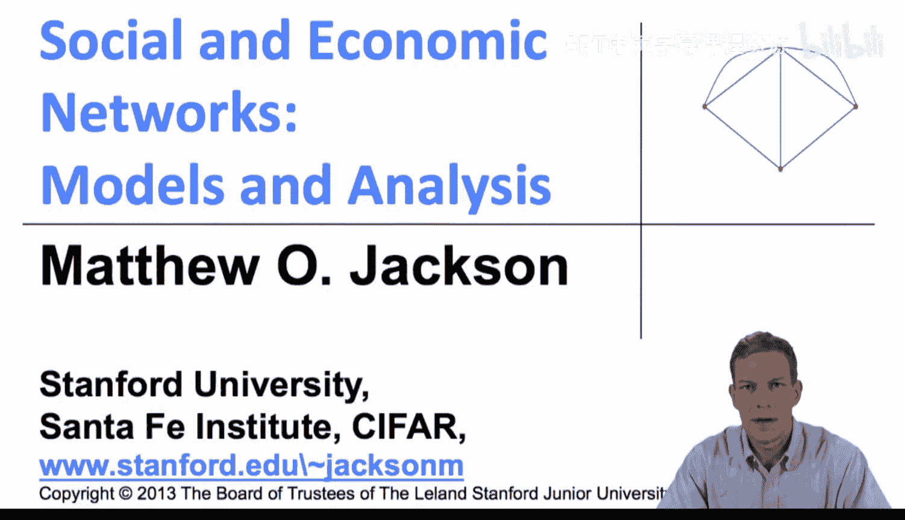

在本节课中，我们将继续探讨学习模型，并深入研究德格鲁特群体模型，重点分析其收敛性质。

## 模型结构回顾

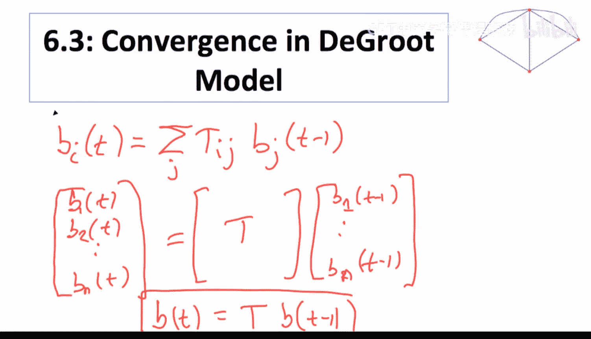

首先，我们回顾一下模型的基本结构。个体 `i` 在时间 `t` 的信念 `B_i(t)` 由以下公式给出：

`B_i(t) = Σ_j T_ij * B_j(t-1)`

其中，`T_ij` 表示个体 `i` 赋予个体 `j` 的信念权重。这个模型的优点在于其简洁性。如果我们考虑整个信念向量 `B(t) = [B_1(t), B_2(t), ..., B_n(t)]`，那么更新过程可以表示为：

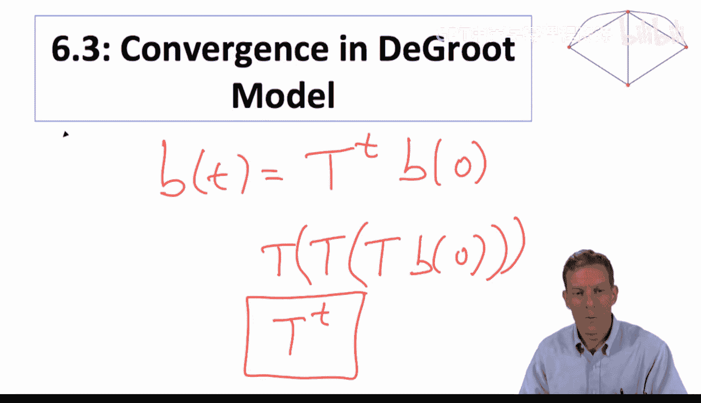

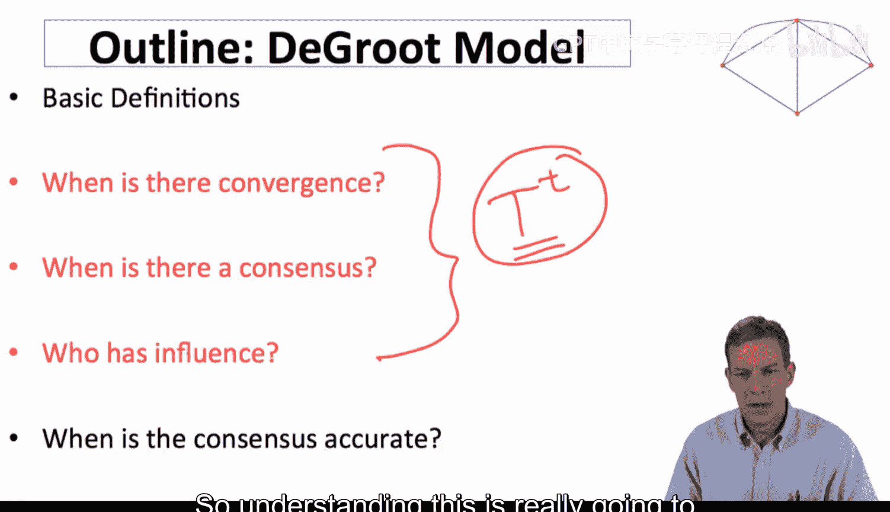

`B(t) = T * B(t-1)`

这意味着，在任意时间 `t`，信念向量可以表示为：

`B(t) = T^t * B(0)`

由于矩阵 `T` 的每一行元素之和为1且非负，这类矩阵在数学上（特别是在马尔可夫链研究中）有非常成熟的理论。这使得分析模型的收敛性变得相对容易。

上一节我们介绍了模型的基本数学形式，本节中我们来看看其收敛的具体条件。

## 收敛性示例

为了理解收敛性，我们先看两个简单的例子。

以下是第一个收敛网络的例子：
*   个体3只听取个体2的意见。
*   个体2只听取个体1的意见。
*   个体1平等地听取个体2和个体3的意见。

假设初始信念为 `B(0) = [1, 0, 0]`。经过一期更新后，信念变为 `[0, 1, 0]`。持续迭代，最终所有个体的信念都会收敛到 `[2/5, 2/5, 2/5]`。这个过程是收敛的。

现在，我们稍微修改一下网络结构，看看会发生什么。

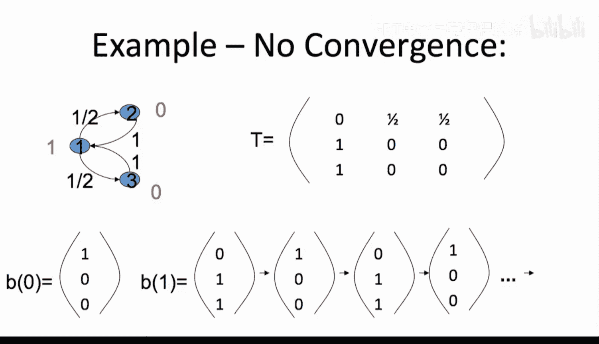

以下是第二个不收敛网络的例子：
*   将个体3的倾听对象从个体2改为个体1。
*   其他条件不变（个体2听个体1，个体1平等听取个体2和个体3）。

从相同的初始信念 `[1, 0, 0]` 开始。第一期后，信念变为 `[0, 1, 1]`。第二期后，信念又变回 `[1, 0, 0]`。如此循环往复，信念在两个状态间不断“闪烁”，永远不会收敛。

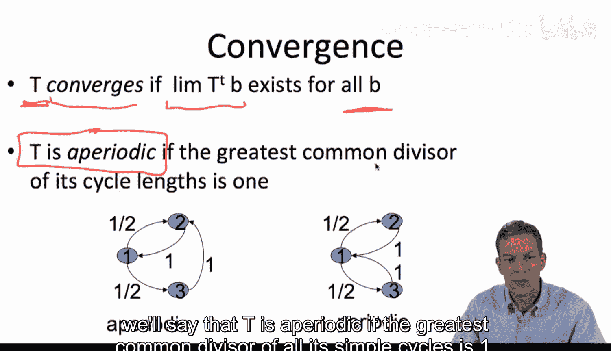

这两个例子的关键区别在于网络中的**环**（cycles）的长度。在第一个收敛的例子中，存在长度为3和2的环，它们的最大公约数是1。在第二个不收敛的例子中，所有环的长度都是偶数（2，4，6...），其最大公约数是2。

## 收敛的正式条件

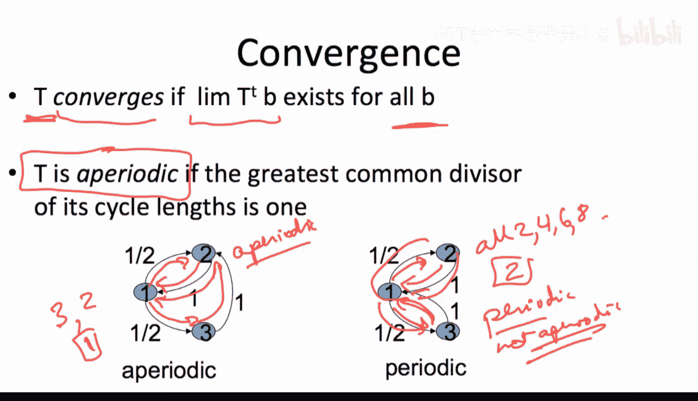

基于上述观察，我们可以给出收敛的正式定义和条件。

**定义**：对于一个给定的权重矩阵 `T`，如果对于**所有**可能的初始信念 `B(0)`，极限 `lim_{t→∞} B(t)` 都存在，则称该社会（或矩阵 `T`）是收敛的。

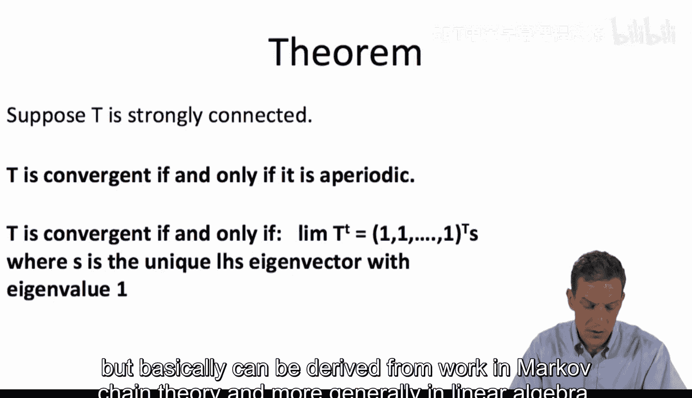

**定义**：如果矩阵 `T` 对应的有向图中，所有简单环长度的最大公约数（Greatest Common Divisor, GCD）为1，则称 `T` 是**非周期**（Aperiodic）的。

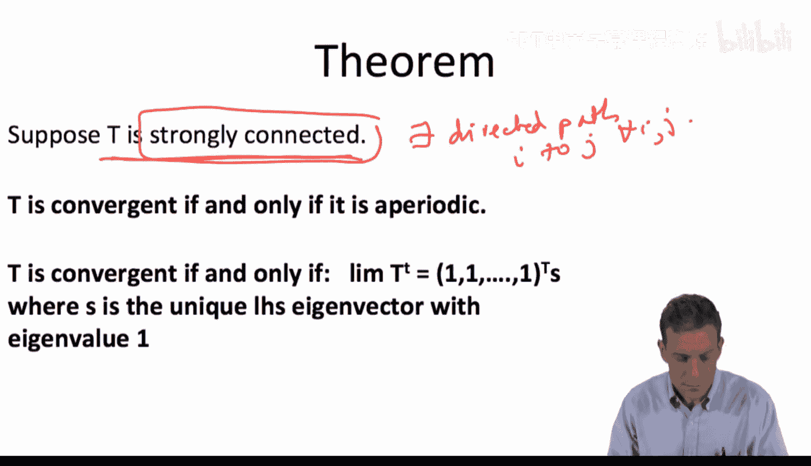

现在，我们可以陈述核心定理。

**定理**：假设网络是**强连通**的（即从任何一个个体出发，都存在有向路径到达任何其他个体），那么，该德格鲁特学习过程收敛的**充分必要条件**就是矩阵 `T` 是非周期的。

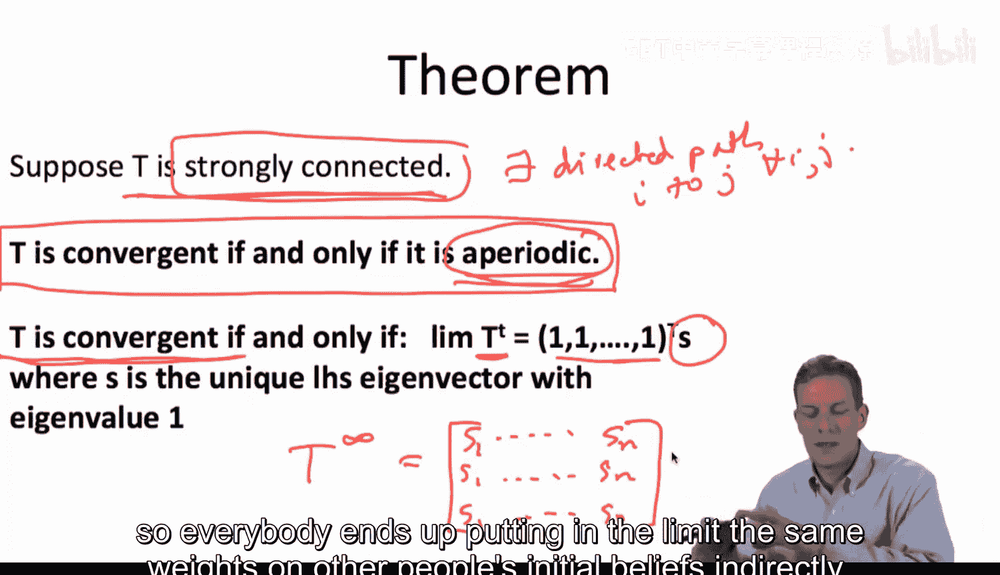

此外，如果过程收敛，那么当 `t` 趋于无穷时，矩阵 `T^t` 会收敛到一个特殊形式：它的每一行都相同，都等于一个固定的行向量 `s = [s_1, s_2, ..., s_n]`。这意味着在极限状态下，每个个体的最终信念都是所有人初始信念的同一个加权平均：

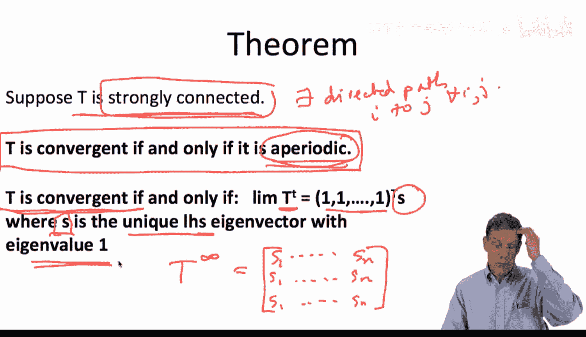

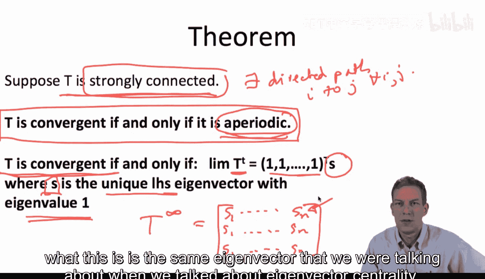

`lim_{t→∞} B_i(t) = Σ_j s_j * B_j(0)`， 对所有 `i` 成立。

这个向量 `s` 正是矩阵 `T` 的**左特征向量**，对应的特征值为1（即满足 `s * T = s`）。它也被称为系统的**影响向量**或**社会权重向量**，其分量 `s_i` 衡量了个体 `i` 的初始信念对全社会最终共识的影响力。这与我们之前讨论的**特征向量中心性**密切相关。

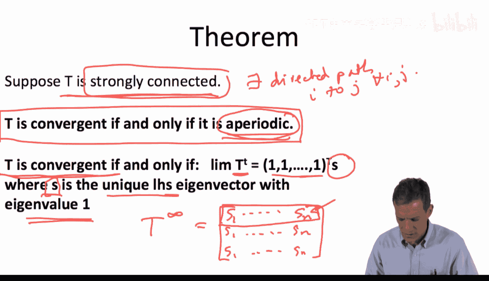

## 总结

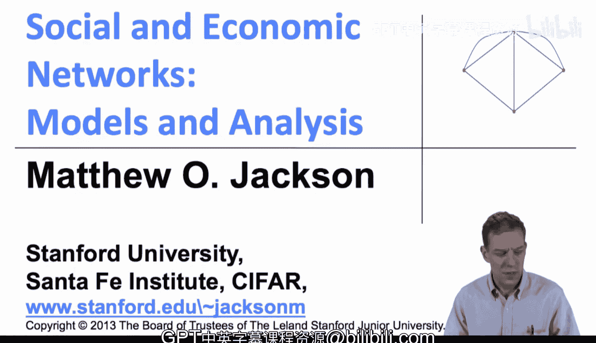

本节课中我们一起学习了德格鲁特模型的收敛性质。我们了解到，收敛性取决于网络结构中的环。在强连通网络中，**非周期性**（所有环长的最大公约数为1）是收敛的充要条件。如果收敛发生，整个社会将达到共识，且共识值是所有人初始信念的加权平均，权重由矩阵 `T` 的**左特征向量**（对应特征值1）决定，它定义了每个个体在最终共识中的相对影响力。