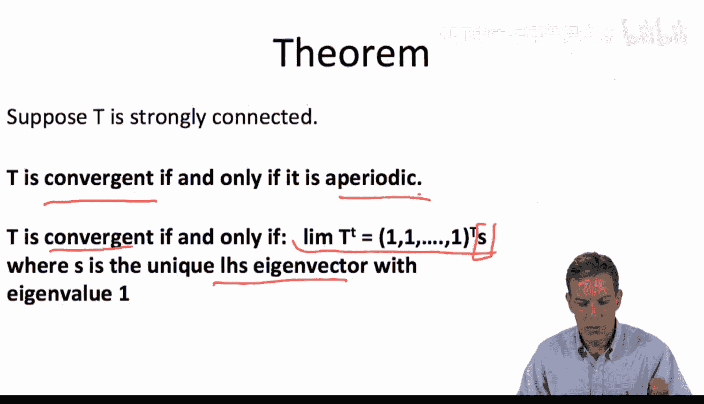
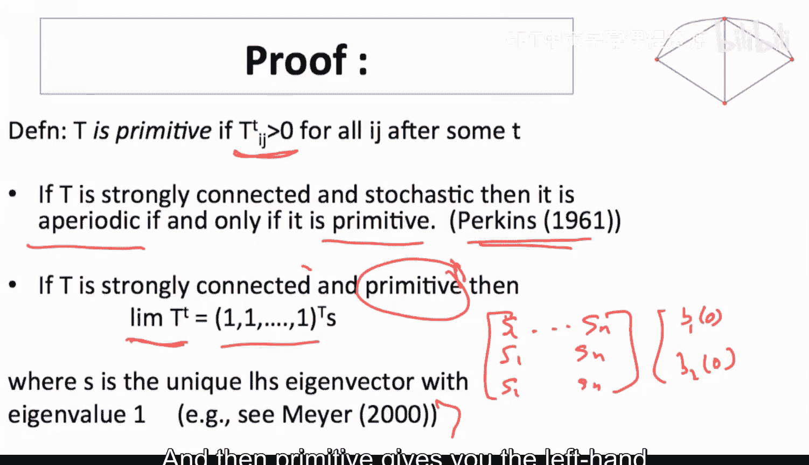
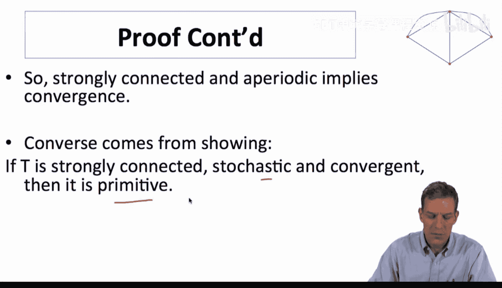
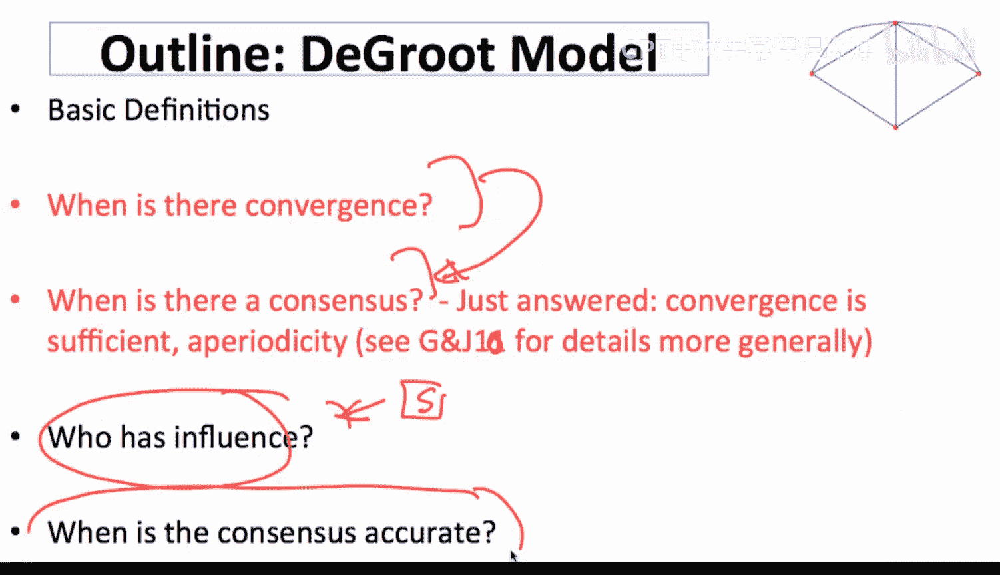

#  066：收敛定理证明（可选-进阶）

在本节中，我们将学习一个关于信念更新过程收敛性的重要定理的证明。这个定理描述了在何种条件下，网络中个体的信念会最终达成共识。我们将首先理解证明背后的核心直觉，然后进行形式化的数学推导。

上一节我们介绍了信念更新的基本模型，本节中我们来看看其收敛性的严格证明。

## 证明的直观理解

在深入数学证明之前，让我们先理解其背后的核心思想。

首先，**非周期性**是收敛的必要条件。如果网络更新存在周期性，信念可能会来回振荡，无法稳定下来。

其次，在非周期性的强连通网络中，经过足够多次的更新后，每个人都会间接地吸收到网络中所有其他人的信息。这意味着，拥有**最低初始信念**的个体，其信念会因吸收他人（尤其是更高）的信念而被逐渐拉高。同理，拥有**最高初始信念**的个体，其信念也会被逐渐拉低。

最终，所有人的信念会向中间靠拢，达成一个**共识**。这个共识值，正是信任矩阵对应于特征值1的**左特征向量**。因为当信念向量收敛后，再乘以信任矩阵 `T` 应保持不变，这满足特征向量的定义：`s * T = s`。

## 形式化证明

现在，我们进行更正式的证明。回忆定理内容：对于一个强连通的随机矩阵 `T`，信念更新过程收敛的**充要条件**是 `T` 是非周期的。并且，若收敛，则极限信念向量 `s` 是 `T` 的对应于特征值1的**左单位特征向量**。

以下是证明的关键步骤。

### 步骤一：定义与本原矩阵

首先，我们引入一个关键概念。

一个随机矩阵 `T` 被称为**本原矩阵**，如果存在一个正整数 `k`，使得 `T^k` 的所有元素都为正数。即：
`∃ k > 0, 使得 T^k > 0`（所有元素 > 0）

一个重要结论是：对于一个强连通的随机矩阵，**它是非周期的，当且仅当它是本原的**。非周期性保证了经过足够长的路径后，任意两个节点间都能以任意长度的路径连通，从而使得 `T^k` 的所有元素为正。

### 步骤二：从非周期性到收敛

假设 `T` 是强连通且非周期的（即本原的）。根据**佩龙-弗罗贝尼乌斯定理**，一个本原的非负矩阵存在唯一的、所有元素为正的**主左特征向量**，对应于其最大的特征值（对于随机矩阵，这个特征值是1）。

对于本原的随机矩阵 `T`，当 `t` 趋于无穷大时，`T^t` 会收敛到一个矩阵 `S`，其中**每一行都完全相同**，且都等于那个主左特征向量 `s`。

这意味着，无论初始信念 `b(0)` 如何，长期信念为：
`b(t) = b(0) * T^t → b(0) * S = [s·b(0), s·b(0), ..., s·b(0)]`
所有人都收敛到同一个共识值 `s·b(0)`。

### 步骤三：从收敛到非周期性（逆命题）

现在证明逆命题：如果强连通的随机矩阵 `T` 是收敛的，那么它必须是本原的（即非周期的）。

1.  假设极限存在，记为矩阵 `S = lim_{t→∞} T^t`。
2.  由于极限是稳定的，有 `S * T = S`。这意味着 `S` 的每一行都是 `T` 的对应于特征值1的**左特征向量**。
3.  因为收敛过程混合了所有个体的信息（强连通性），极限矩阵 `S` 的所有元素应为正数，即 `S > 0`。
4.  根据佩龙-弗罗贝尼乌斯定理，如果一个不可约非负矩阵存在一个全正的特征向量（此处为 `S` 的行向量），那么这个特征向量对应其**最大特征值**，并且该矩阵是**本原的**。
5.  因此，`T` 是本原的，从而也是非周期的。同时，该定理保证了主特征向量的唯一性，所以 `S` 的每一行必须完全相同，即我们之前得到的特征向量 `s`。

### 步骤四：非周期性的易满足性

非周期性条件在实践中很容易满足。只要网络中**至少有一个个体赋予自己一定的信任度**（即矩阵 `T` 的某个对角线元素 `T_{ii} > 0`），就形成了一个长度为1的循环。此时，所有循环长度的最大公约数为1，从而满足非周期性。

只有在极其特殊的情况下（没有人信任自己，且所有循环长度都是某个大于1的整数的倍数），才会出现周期性，导致信念无法收敛。

## 总结与启示

本节课中我们一起学习了德格鲁特信念更新模型收敛定理的证明。

我们证明了：在强连通网络中，**收敛性等价于信任矩阵的非周期性**。非周期性导致矩阵本原，进而保证系统收敛到一个共识，该共识值由信任矩阵的主左特征向量决定。

这个证明不仅确认了收敛的条件，也提前揭示了**社会影响力**的结构：那个决定共识的左特征向量 `s`，其分量 `s_i` 的大小恰恰衡量了个体 `i` 在最终共识中的**相对影响力**。在接下来的课程中，我们将深入探讨影响力的度量与应用。

---
**核心概念回顾**：
*   **收敛条件**：强连通 + 非周期性（通常只需 `∃ i, T_{ii} > 0`）。
*   **共识值**：`b(∞) = (s · b(0)) * 1`，其中 `s` 是满足 `sT = s` 且 `Σ_i s_i = 1` 的左特征向量。
*   **影响力**：特征向量 `s` 的第 `i` 个分量 `s_i` 代表个体 `i` 的权重或影响力。