#  067：影响力向量 📊

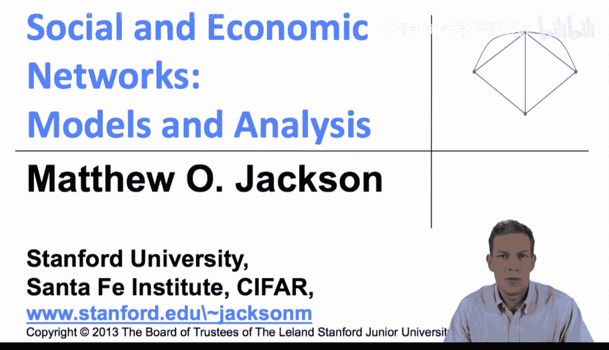

在本节课中，我们将要学习德格鲁特模型中的“影响力向量”。我们将探讨在信念更新过程的极限状态下，社会共识是如何形成的，以及如何利用这个模型来理解学习过程的极限，并量化网络中每个个体的影响力。

上一节我们介绍了信念更新的矩阵表示，本节中我们来看看这个更新过程的极限状态，即影响力向量。

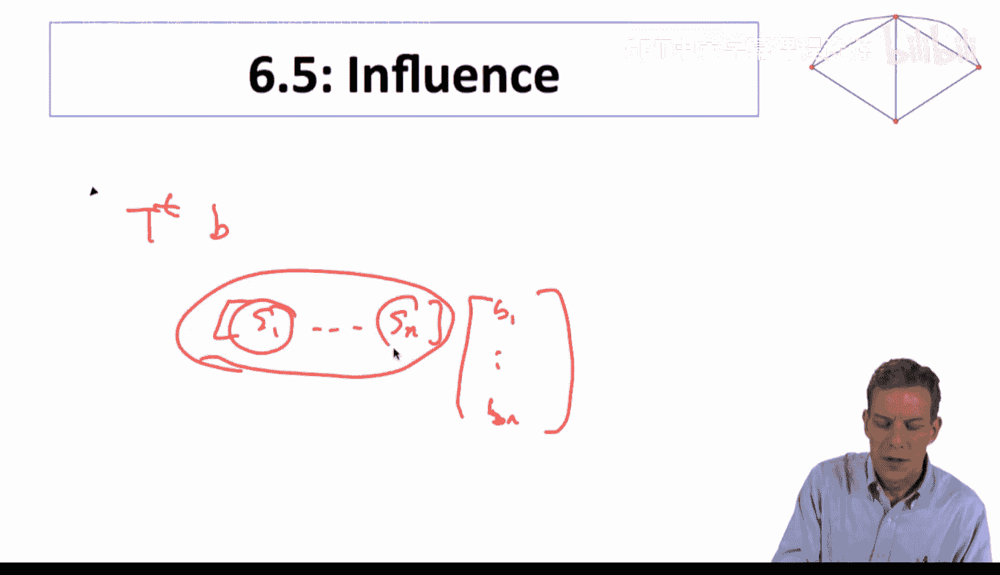

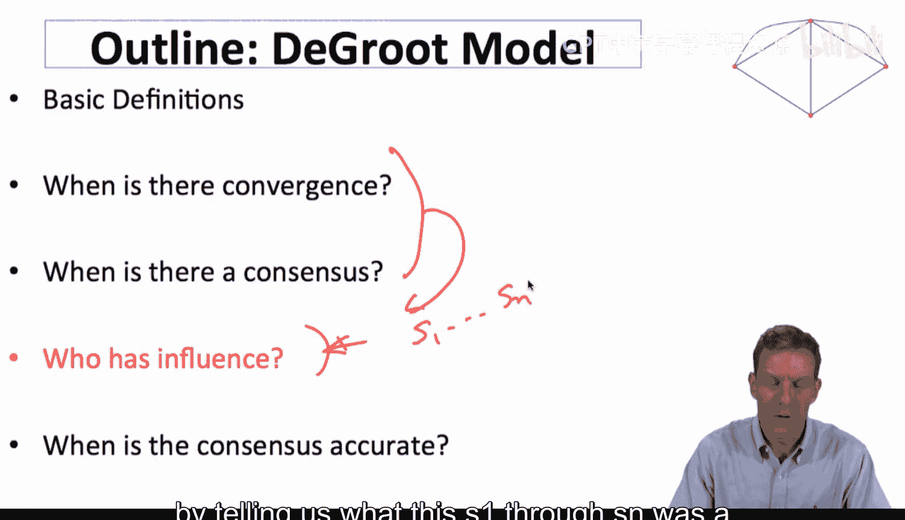

## 理解极限信念

为了理解德格鲁特过程的极限状态，即人们的信念最终会收敛到什么值，我们需要考察矩阵 **T** 的幂次极限。当时间趋于无穷时，信念向量 **b(t)** 会收敛到一个由初始信念加权平均得到的共识值。

具体来说，我们寻找一个向量 **S = (s₁, s₂, ..., sₙ)**，使得极限信念满足：
**b(∞) = S · b(0)**
其中，**b(0) = (B₁, B₂, ..., Bₙ)** 是初始信念向量。这个向量 **S** 本质上衡量了每个个体对最终共识的影响力。

## 影响力向量的计算

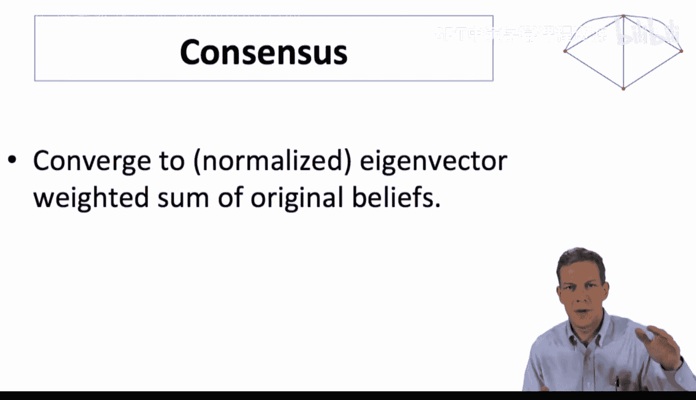

影响力向量 **S** 是随机矩阵 **T** 的**左单位特征向量**。这意味着它满足以下方程：
**S = S · T** 且 **∑ᵢ sᵢ = 1**

以下是理解这一点的关键步骤：
1.  极限状态下的信念应稳定不变，再做一次更新（乘以 **T**）也不会改变它。
2.  因此，极限信念向量必须满足 **b(∞) = b(∞) · T**。
3.  由于 **b(∞) = S · b(0)**，代入上式并利用初始信念的任意性，可推导出 **S** 必须满足 **S = S · T**。

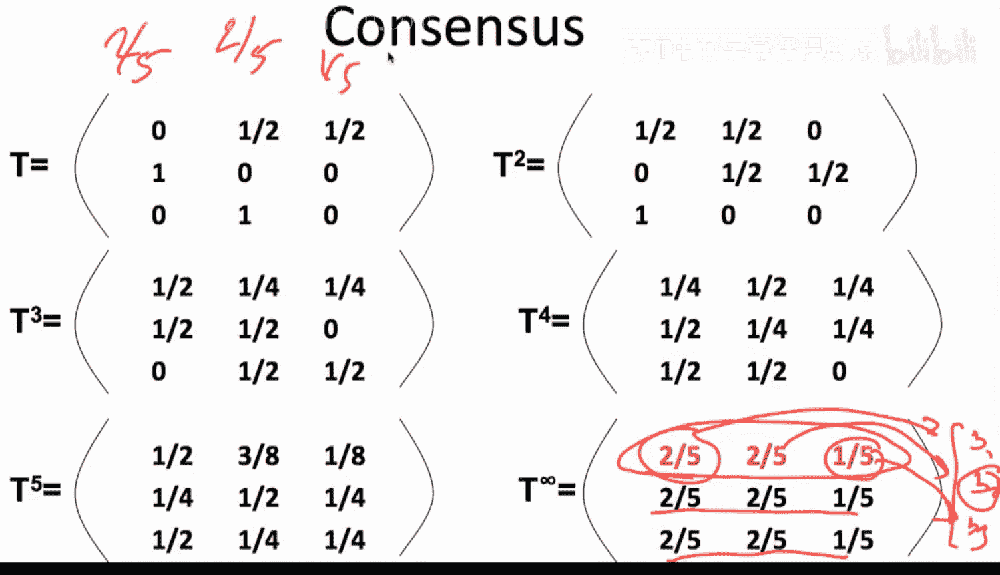

## 一个具体例子

让我们回顾之前看过的一个三人网络例子，其信任矩阵 **T** 如下：

```
T = [ 0,   1/2, 1/2 ]
    [ 1/2, 0,   1/2 ]
    [ 1/2, 1/2, 0  ]
```

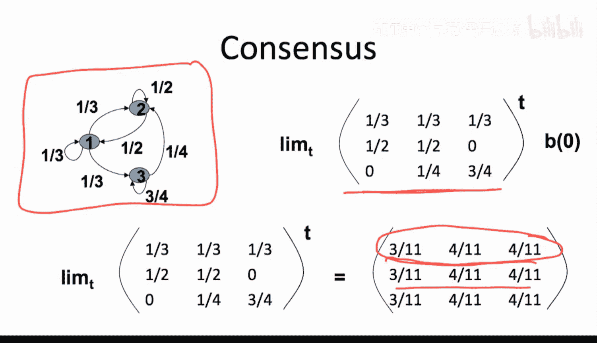

通过计算 **T** 的高次幂，我们发现其行向量最终都收敛到同一个值。对于这个矩阵，极限行向量（即影响力向量 **S**）为：
**S = (2/5, 2/5, 1/5)**

我们可以验证这是 **T** 的左单位特征向量：
```
S · T = (2/5, 2/5, 1/5) · T = (2/5, 2/5, 1/5) = S
```
并且分量之和为 1。

这意味着，最终的共识信念将是初始信念的加权平均，其中个体1和个体2的权重各为 `2/5`，个体3的权重为 `1/5`。

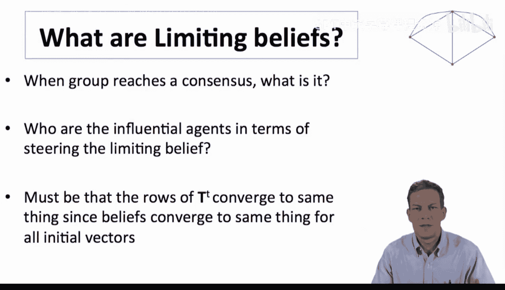

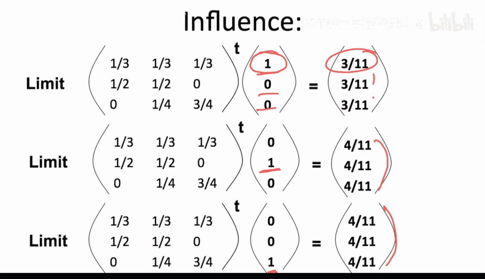

## 影响力的来源与解释

影响力向量 **S** 的公式 **S = S · T** 具有深刻的社会学含义。将其展开，对于个体 *i*，其影响力 `sᵢ` 满足：
**sᵢ = ∑ⱼ tⱼᵢ · sⱼ**

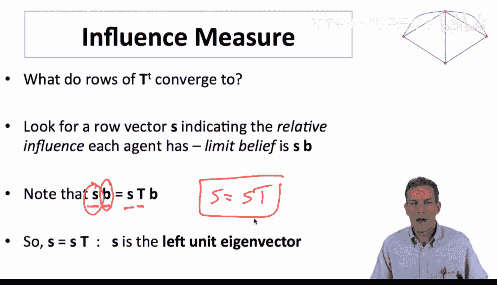

这个公式表明：
*   个体 *i* 的影响力 (`sᵢ`) 等于所有信任 *i* 的人 (`j`) 的影响力 (`sⱼ`) 的加权和，权重是他们赋予 *i* 的信任度 (`tⱼᵢ`)。
*   **影响力的核心机制是：被有影响力的人信任，你自身就会变得有影响力。** 你的信念会进入他们的信念，进而通过他们的网络传播给更多人。

这直接将我们引向了网络科学中的经典概念——**特征向量中心性**。像谷歌的PageRank算法这样的影响力度量，其数学基础正源于此。德格鲁特模型为我们为何使用特征向量来衡量权力或影响力提供了一个自然而坚实的理论基础。

## 实践与应用

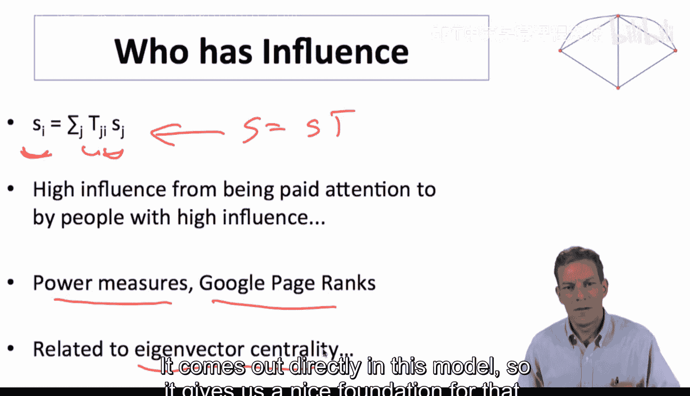

在接下来的内容中，我们将把这一理论付诸实践。我们将选取具体的网络，构造其对应的随机矩阵 **T**，然后计算其左单位特征向量（影响力向量）。通过分析这个向量，我们可以深入理解在特定的网络结构中，影响力是如何分布的，以及最终的群体共识可能会偏向何方。

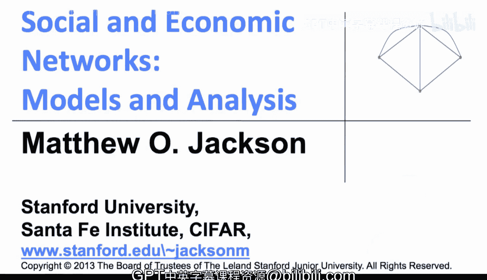

本节课中我们一起学习了德格鲁特模型中的影响力向量。我们了解到，群体信念收敛的极限可以表示为一个加权平均，其权重向量 **S** 是信任矩阵 **T** 的左单位特征向量。这个向量不仅量化了每个个体对最终共识的影响力，其定义式 **S = S · T** 也揭示了影响力来源于“被有影响力者信任”这一网络传播核心机制，从而与特征向量中心性等经典概念建立了联系。