#  068：影响力示例 📊

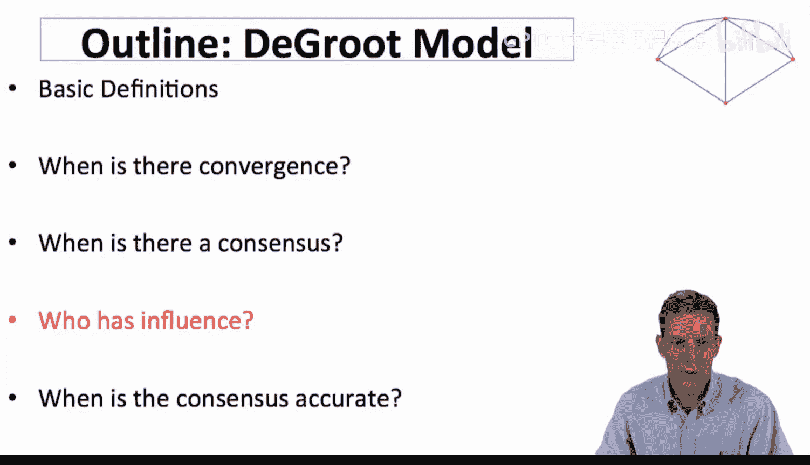

在本节课中，我们将通过具体示例，探讨网络中的度学习模型与影响力向量如何在实际中发挥作用。我们将看到个体在网络中的位置如何转化为其影响力，并通过一个公司建议网络的案例进行实际计算。

---

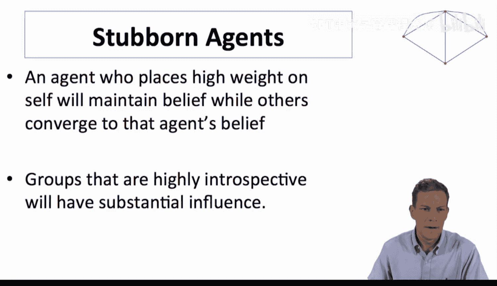

上一节我们介绍了影响力向量的概念，本节中我们来看看它在不同网络结构下的具体表现。

首先，我们可以从一些简单情况开始，观察个体在网络中的位置如何转化为其影响力。

一个有趣的现象是，那些非常看重自身意见（即赋予自身很高权重）的人，最终会保持其信念，而其他人的信念则会随时间改变。因此，高度内省且被其他群体倾听的群体，最终在整个社会中的权重也会非常高。这个模型一个或许有些奇特的地方在于，那些不太倾听外界但最终被外界大量倾听的群体，反而会拥有巨大的影响力。这不仅仅是“高度自信”，还包括“被他人信任”的组合，这种组合能让某人拥有非常高的影响力，因为他们很少更新自己的信念，并最终影响了其他人的信念。

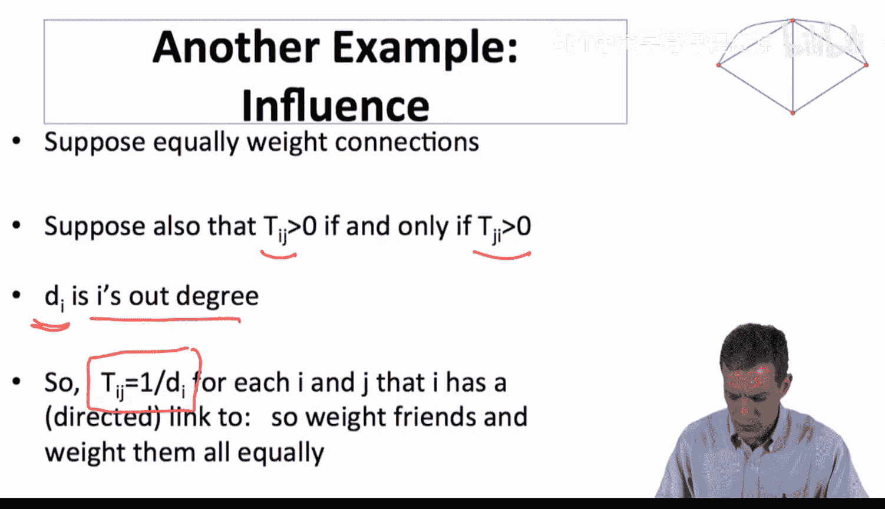

---

接下来，我们来看另一个影响力示例。假设人们的行为是平等地权衡他们所有的连接。

我们也可以将其视为友谊关系，因此连接是相互的。即，如果个体 *i* 倾听个体 *j*，那么个体 *j* 也倾听个体 *i*。每个人赋予其所有连接相等的权重。

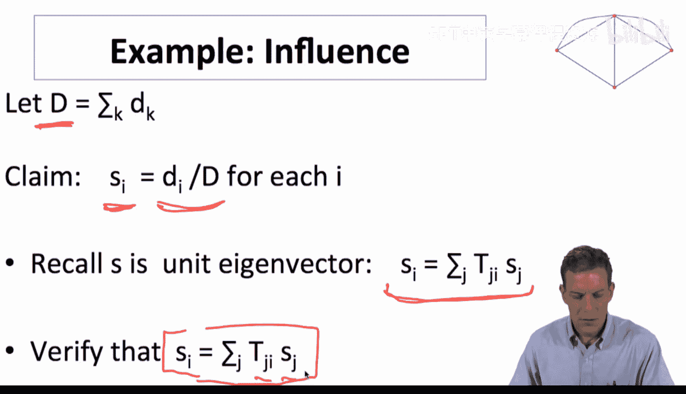

以下是该模型的一个简单版本：
*   设 *dᵢ* 为个体 *i* 的出度（即朋友数量）。
*   那么，对于每个与 *i* 连接的 *j*，转移权重 *Tᵢⱼ* = 1 / *dᵢ*。
*   这意味着，无论我有多少个朋友，我给每个朋友的权重都是 1 / (朋友总数)。例如，有10个朋友，则给每人1/10的权重。

在这个模型中，如果设 *D* 为所有个体出度的总和，那么一个主张是：个体的影响力将与其出度成正比。

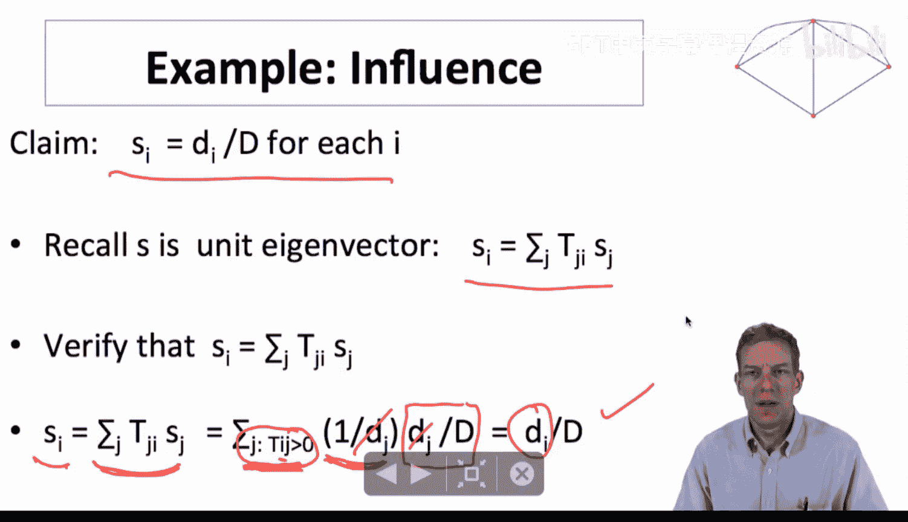

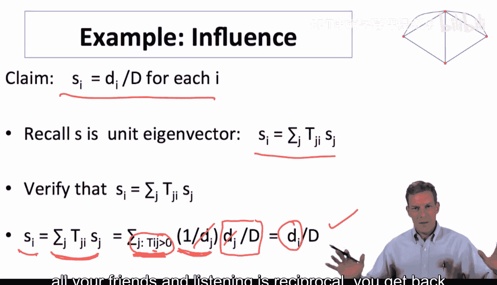

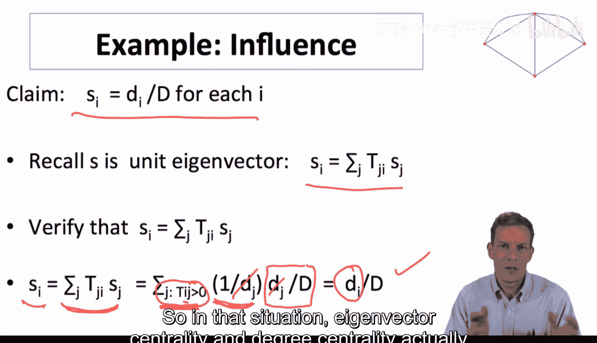

这为度中心性提供了一个理论基础：在一个人们相互交谈并平等权衡所有交谈对象的世界里，你的影响力将与你的连接数（度）成比例。

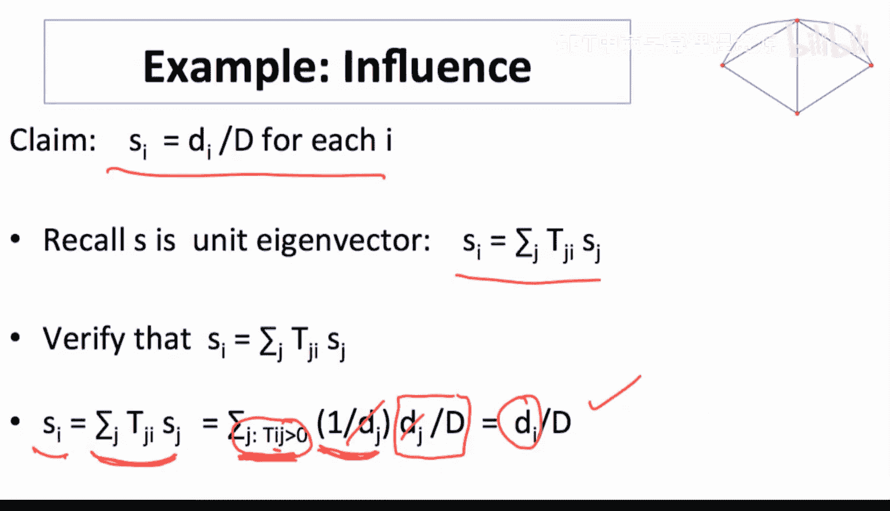

回想一下，影响力向量 **s** 是转移矩阵 **T** 的左特征向量，满足 **s** = **sT**。我们需要验证 *sᵢ* = ∑ⱼ *Tⱼᵢ* *sⱼ* 这个等式是否成立。

让我们验证这个主张是否有效。我们声称极限影响力 *sᵢ* = *dᵢ* / *D*。现在检查等式右侧：∑ⱼ *Tⱼᵢ* *sⱼ*。由于倾听是相互的，我们只需对所有倾听 *i* 的个体 *j* 求和。对于每个这样的 *j*，*Tⱼᵢ* = 1 / *dⱼ*，而 *sⱼ* = *dⱼ* / *D*。两者相乘，*dⱼ* 抵消，得到 1 / *D*。对 *i* 的所有倾听者求和，总共有 *dᵢ* 个这样的个体，因此总和为 *dᵢ* / *D*，恰好等于 *sᵢ*。验证通过。

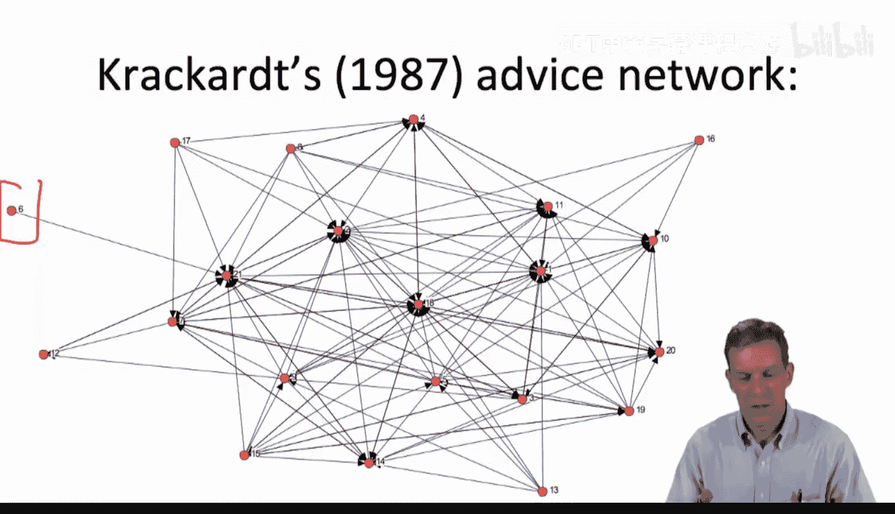

因此，在平等权衡所有朋友且倾听关系相互的情况下，特征向量中心性与度中心性实际上是一致的。

---

现在，让我们看一个实际案例。这是David Krackhardt在1987年发表的一篇论文，研究了一家公司的建议网络。

这个网络的节点数适中，且我们拥有信息来计算影响力向量 **s**。这是一个有向网络图，意味着某些人可以倾听他人，而对方不一定回听。因此，这是一个有向网络，连接不一定是双向的。图中还有一些个体完全没有被连接（即无人向他们寻求建议），在这种情况下，他们的影响力将为零。所以，这不是一个强连通网络。尽管如此，影响力向量 **s** 仍然是描述此系统长期状态的正确答案。

以下是计算出的影响力结果：
*   有些个体，例如节点6、13、16、17，最终影响力为零，因为无人向他们寻求建议。
*   影响力值从0变化到约0.2，显示出不同的影响力水平。
*   表格中的其他列代表了公司中的层级：Level 1是CEO（公司负责人），Level 2是第二高级别的管理层，Level 3是第三级别。
*   我们可以看到，就网络影响力而言，有些人的影响力甚至超过了最高层级的个体。实际上，一位Level 2的人的影响力向量值高于顶层的CEO。
*   我们还可以观察Level 3中不同个体的影响力差异。

这些影响力数值与年龄、任期或所属部门等信息是互补的，它并不必然与这些因素完全相关。这些数字告诉我们关于个体相对影响力的不同信息。

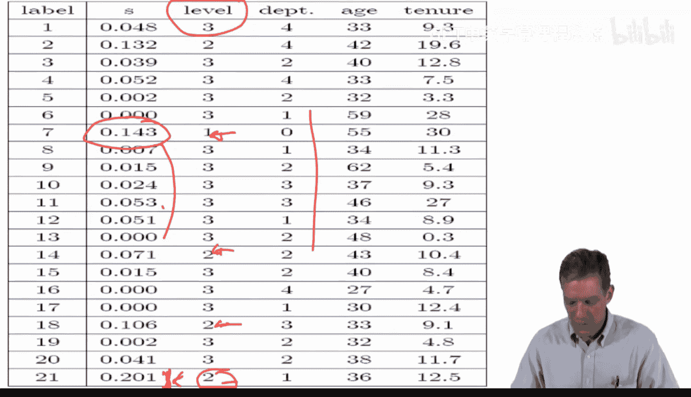

这个例子展示了如何应用群体学习模型，为将左特征向量作为影响力度量提供了基础。如果你在这个特定网络上运行群体学习过程，让人们随时间更新信念，最终收敛的信念就会由这个影响力向量决定。此处的计算基于一个假设：人们平等权衡他们提到的每个朋友。例如，个体17有5个出向连接，因此他给每个连接赋予1/5的权重。

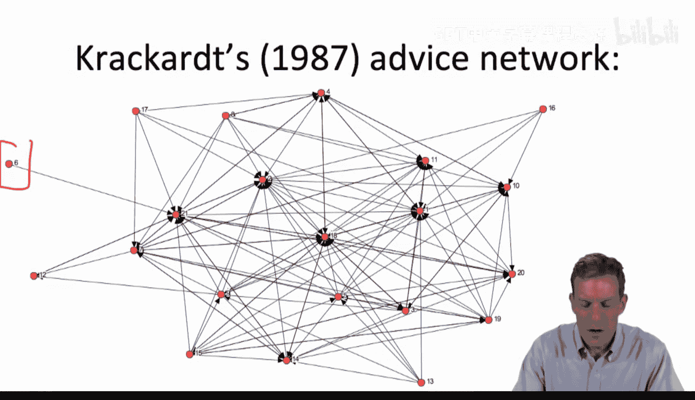

---

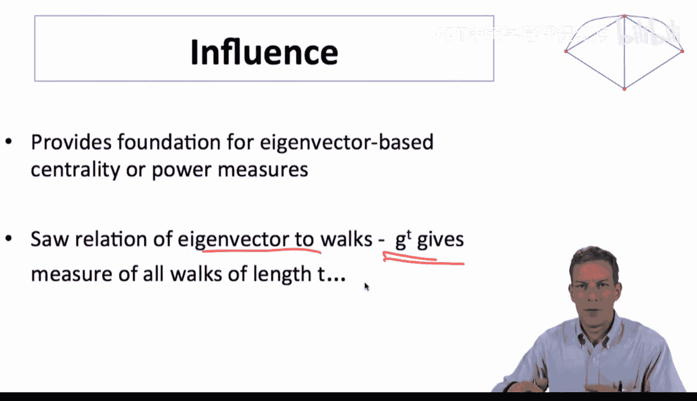

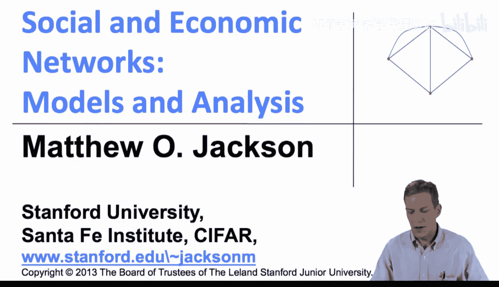

本节课中我们一起学习了影响力向量的实际应用示例。我们看到了在平等加权和相互倾听的简单网络中，影响力与度中心性等价。随后，我们通过一个真实的公司建议网络案例，计算了有向且非强连通网络中的影响力分布，发现它能够揭示超越传统组织层级的相对影响力结构。这为我们理解网络中的信念传播和个体重要性提供了量化工具。接下来，我们将结束关于学习的讨论，并开始探讨网络上的博弈。