#  069：信息聚合 📊

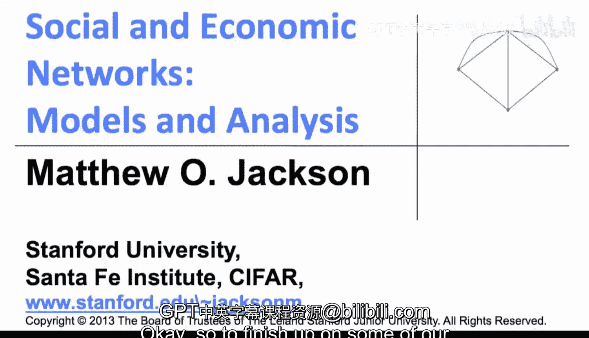

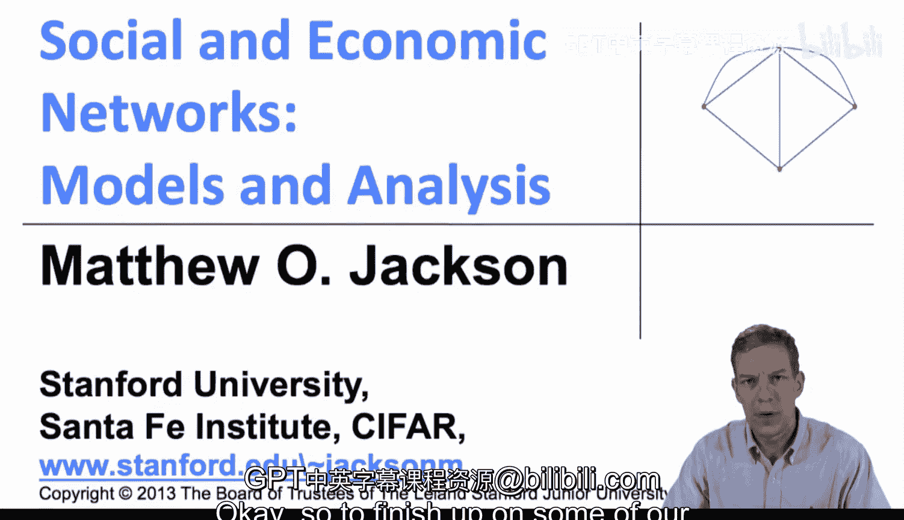

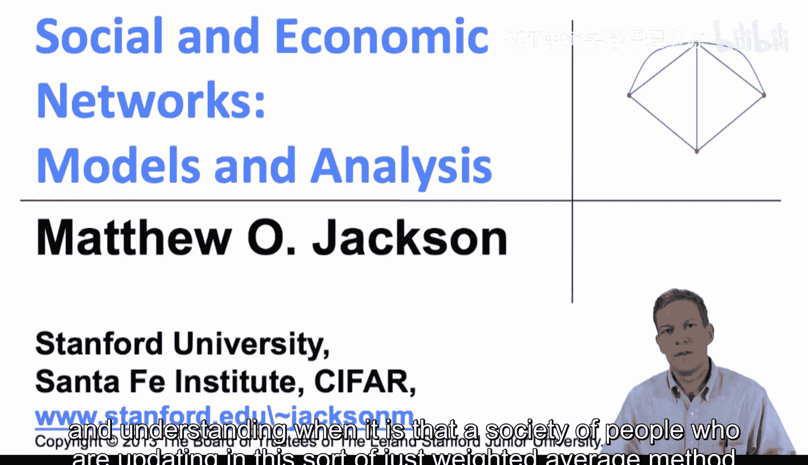

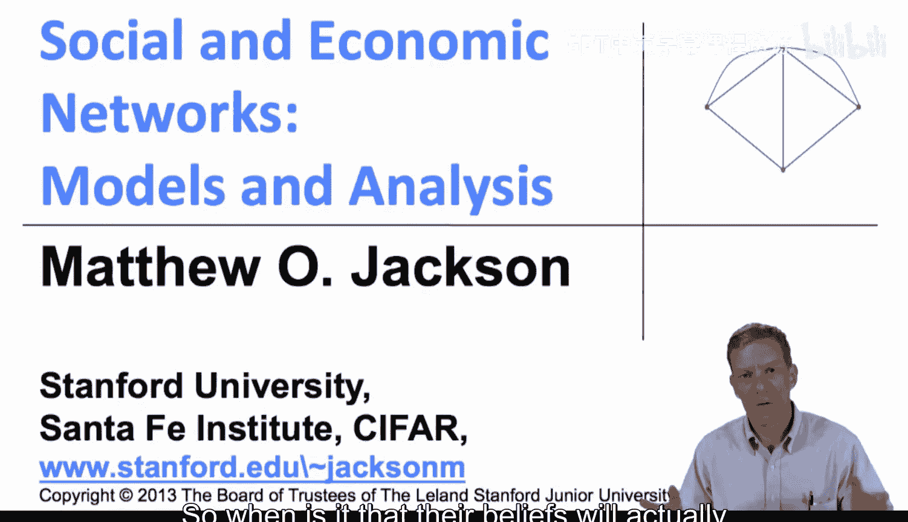

在本节中，我们将探讨德格鲁特模型中的一个核心问题：在何种条件下，一群通过加权平均方式更新信念的个体，最终能够达成一个准确的社会共识？我们将分析网络结构和影响力如何影响信息的有效聚合。

## 概述

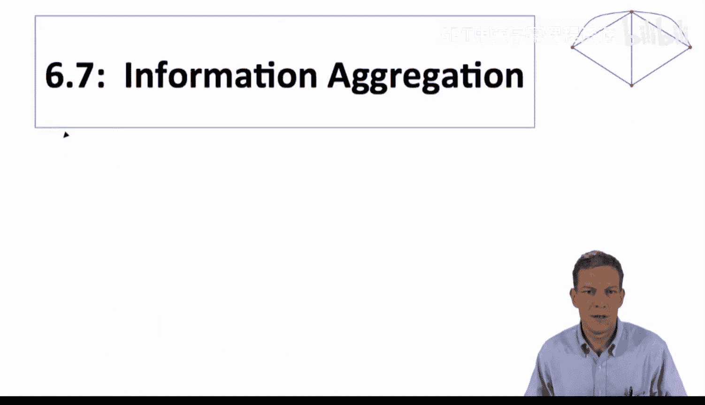

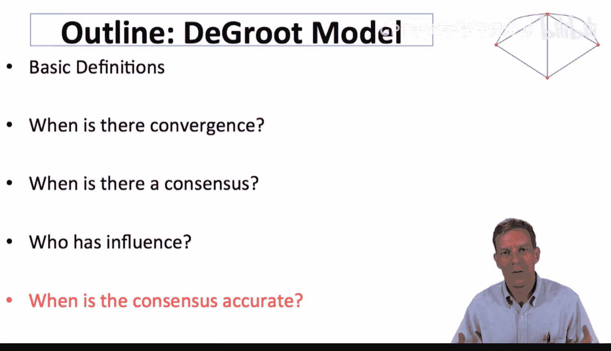

在上一节中，我们介绍了德格鲁特模型的基本原理。本节中，我们将应用该模型，探讨社会群体何时能够通过互动学习，最终形成关于某个真实状态（例如，全球变暖的真实概率）的准确共识。关键在于理解网络结构和个体影响力如何决定集体信念的准确性。

## 模型设定与问题

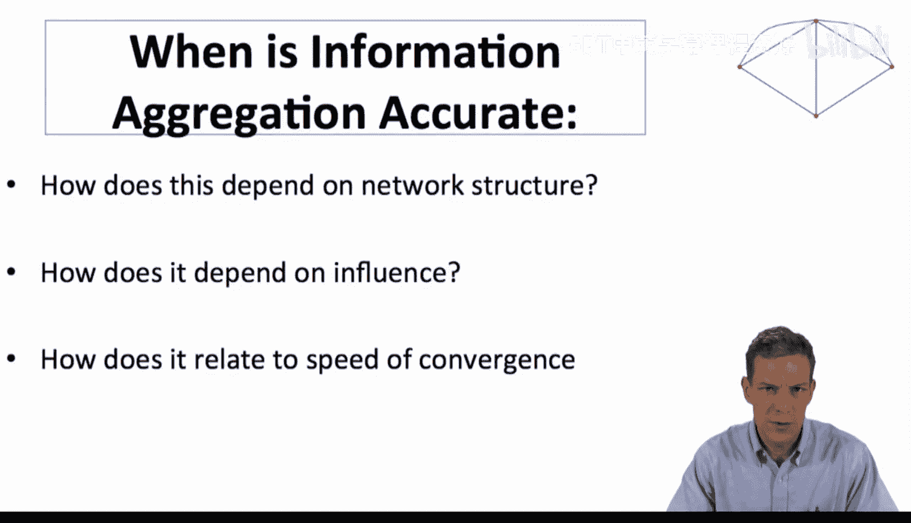

假设存在一个真实状态 μ。每个个体在初始时刻（t=0）对 μ 的信念都包含一个误差。个体 i 的初始信念为：
`p_i(0) = μ + ε_i`
其中，误差项 ε_i 满足以下条件：
*   均值为零：`E[ε_i] = 0`
*   具有有限方差：`Var[ε_i] < ∞`
*   不同个体的误差在给定 μ 的条件下是独立的。

随后，个体们按照德格鲁特模型进行信念更新。我们希望探讨，在长期互动后，整个社会的信念极限 `lim_{t→∞} p(t)` 是否能够收敛到真实值 μ。

我们关注大型社会（个体数量 N 很大）的情况。我们希望找到这样的条件：当社会规模趋于无穷大时，极限信念与真实值 μ 的偏差超过任意小量 δ 的概率趋于零。即，社会共识是“明智的”。

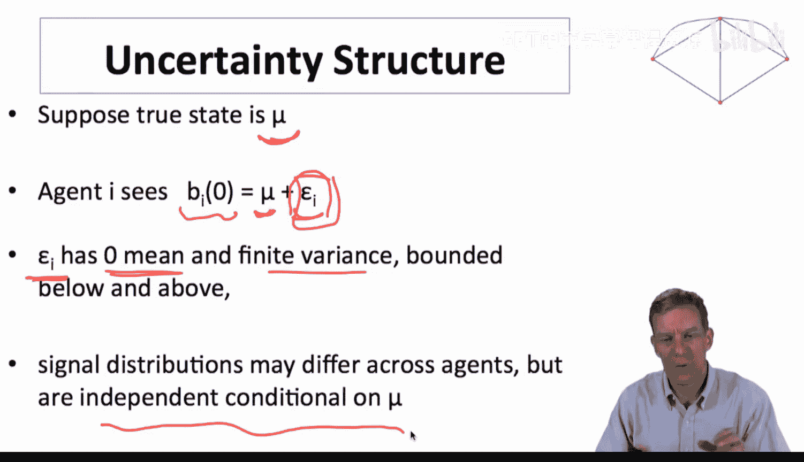

## 信息聚合的条件

为了分析这个问题，我们引入一个基于弱大数定律的结论。

考虑一个包含 N 个个体的社会，其稳态影响力向量为 `s = (s_1, s_2, ..., s_N)`。这个向量描述了每个个体初始信念对最终社会共识的长期影响权重。

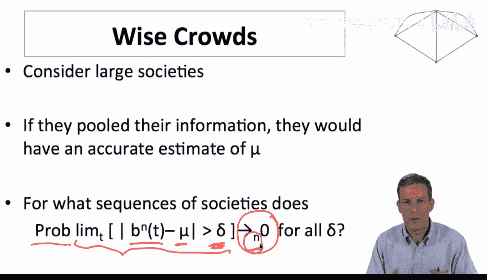

社会共识的极限值可以表示为：
`lim_{t→∞} p(t) = Σ_{i=1}^{N} s_i * p_i(0) = μ + Σ_{i=1}^{N} s_i * ε_i`

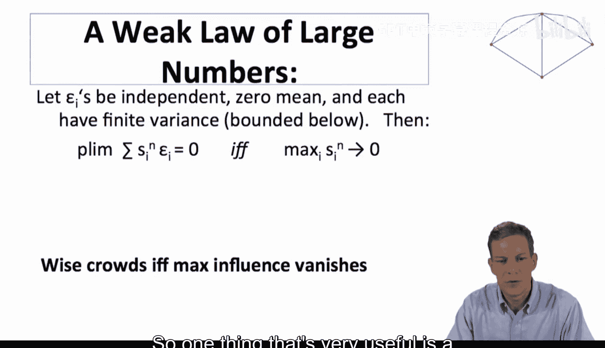

因此，社会共识的误差项是 `Σ_{i=1}^{N} s_i * ε_i`。要使共识准确（误差趋于零），就需要这个加权误差和趋于零。

以下是实现准确信息聚合的核心条件：

**定理（明智人群的条件）**：在一个大型社会中，当且仅当最大个体影响力趋于零时，社会共识才能以高概率收敛到真实值 μ。即：
`max_{i} s_i → 0` 当 `N → ∞`

**直观解释**：
*   **必要性**：如果存在某个个体 j 的影响力 `s_j` 不趋于零（即保持显著），那么他的初始误差 `ε_j` 将持续地、非微不足道地影响最终共识。即使其他所有人的误差平均为零，这个“固执”个体的误差也会使共识偏离真相。
*   **充分性**：如果每个人的影响力都变得微不足道，那么共识就是大量独立误差的加权平均。根据（弱）大数定律，只要这些误差均值为零且方差有限，它们的加权和就会收敛到零，从而使共识收敛到 μ。

## 对网络结构的启示

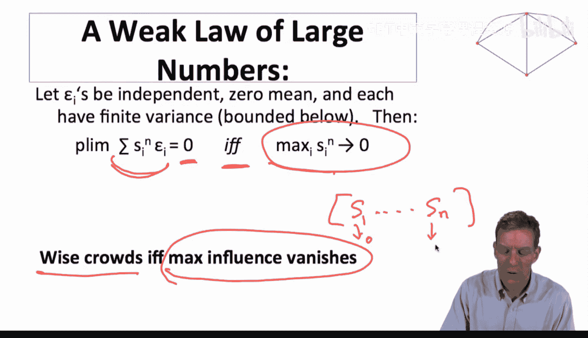

上述定理为我们理解何种网络结构有利于产生明智共识提供了指引。

**一个充分条件：相互关注**
假设信任矩阵 T 不仅是行随机的（每人给出的权重和为1），也是列随机的（每人获得的权重和也为1）。这意味着每个人受到的关注度与他给予他人的关注度总和相等。在这种情况下，稳态影响力向量是均匀的：`s_i = 1/N`。显然，当 `N→∞` 时，`max s_i = 1/N → 0`。因此，完全对称的、相互关注的网络能保证信息聚合的准确性。

**更一般的情况**
在更一般的社会网络中，人们受到的关注度（入度权重和）可能存在差异。定理告诉我们，关键是不能存在获得“过多”关注的个体或小团体。

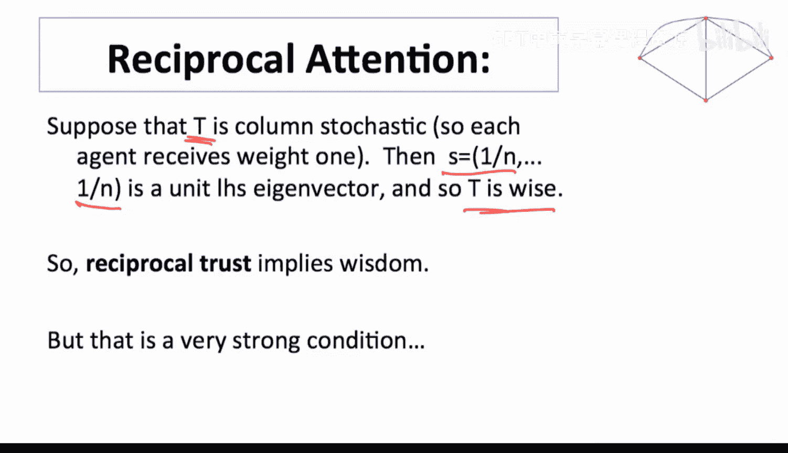

*   **避免强势意见领袖**：如果存在一个个体 i，使得社会中相当一部分人（比例不低于某个常数 a > 0）都将至少一定权重的注意力分配给他，那么他的影响力 `s_i` 将至少为 a，不会趋于零。这样的“意见领袖”会将其个人偏差强加于整个社会共识。
*   **群体的平衡**：推广开来，不能存在任何一个内部联系紧密但与外部联系相对薄弱的小群体，使得该群体从外部获得的总关注度不成比例地低（或向外部施加的影响力不成比例地高）。这样的群体可能形成“回声室”，其内部偏差无法被外部信息充分校正，从而破坏整体共识的准确性。

简而言之，为了实现准确的信息聚合，社会网络需要具备一定的“民主性”或“平衡性”，确保没有任何单个个体或小群体能够垄断影响力。影响力必须在足够多的个体之间分散。

## 总结

本节课中，我们一起学习了德格鲁特模型中信息聚合的理论。
*   我们设定了一个存在客观真实状态 μ 的场景，个体初始信念带有独立误差。
*   我们探讨了社会共识能否以及何时能收敛到真实值 μ。
*   我们得到了一个关键结论：**当且仅当随着社会规模扩大，每个个体的稳态影响力都趋于零时，人群才是“明智的”**。
*   这一结论揭示了网络结构的重要性：**过度集中的影响力（如强势意见领袖）会阻碍准确共识的形成**，而相对平衡、分散的网络结构则有利于信息的有效聚合与纠偏。

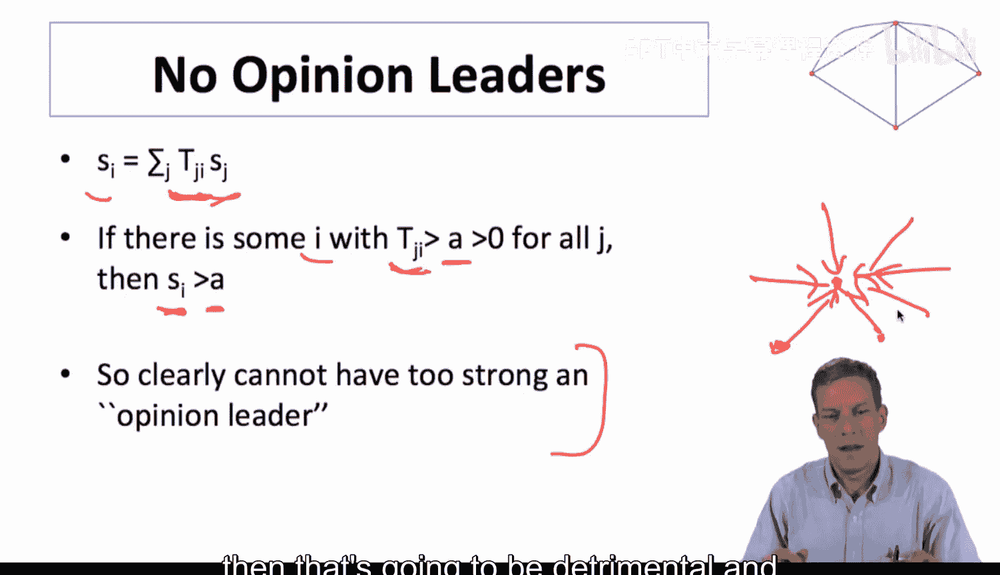

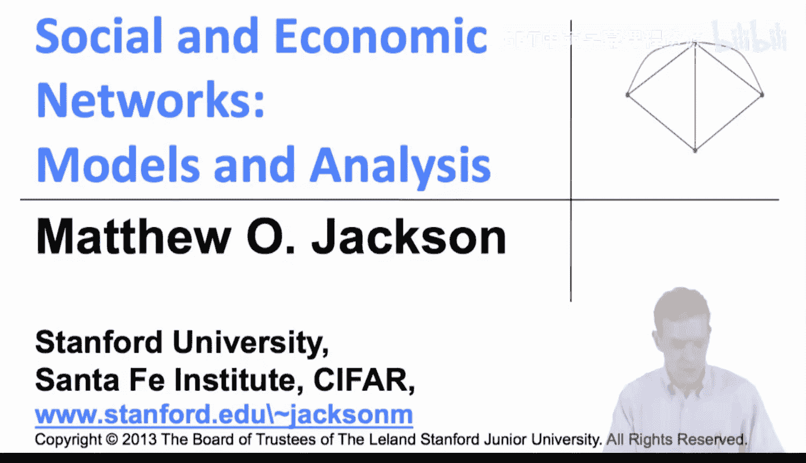

这为我们理解现实社会中舆论形成、集体决策的准确性提供了重要的理论视角。接下来，我们将结束关于网络学习模型的讨论，并开始转向网络博弈的相关内容。