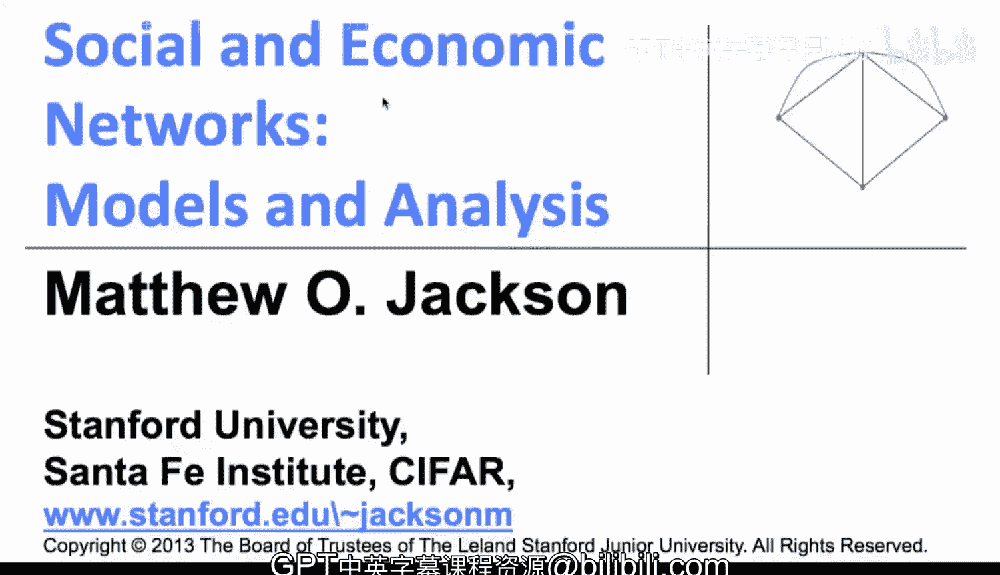
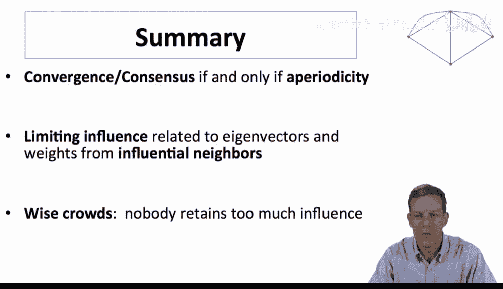
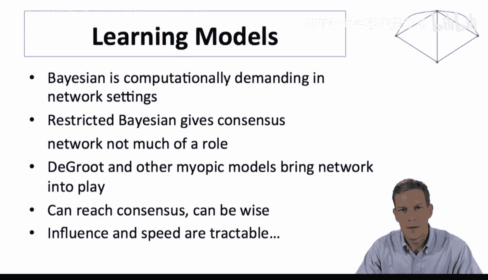
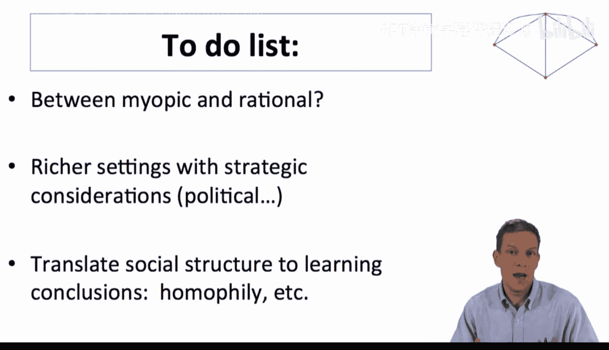

#  070：学习模型总结 🧠

在本节课中，我们将总结关于网络学习模型的讨论。我们将回顾德格鲁特模型的关键发现，比较不同学习模型的特点，并探讨该领域未来的研究方向。

## 德格鲁特模型总结 📊

上一节我们详细探讨了德格鲁特模型。现在，我们来总结其核心结论。

我们发现，当且仅当网络具有**非周期性**时，模型中的信念会收敛并达成共识。极限影响力与**特征向量**的概念相关，这为此提供了一个良好的理论基础。其直观理解是：个体的影响力大小取决于他们从邻居那里获得的权重，以及邻居从他们的邻居那里获得的间接权重，依此类推。

以下是德格鲁特模型更新规则的核心公式：
`信念(t+1) = T * 信念(t)`
其中，`T` 是行随机权重矩阵。

对于一个社会整体达成共识并获取智慧而言，关键在于**没有人保留过多的影响力**。这一点非常重要。

## 不同学习模型的比较 ⚖️

现在，让我们比较一下我们学过的几种学习模型。

我们观察到，贝叶斯模型在多种情境下计算要求很高，涉及人们可能需要进行复杂计算以及在该情境下可能发生的策略博弈，因此这些模型可能相当复杂。我们看到的受限贝叶斯版本会达成共识，但网络在其中扮演的角色不大。理解贝叶斯设定下的这些限制仍然是正在研究的课题，有许多论文正在探讨这个问题。

相比之下，德格鲁特模型是一个非常易于处理的替代模型。就人们的更新方式而言，它要天真得多。然而，它仍然可以是准确的。只要人们在获得权重的方式上大致平衡，且没有人保留过多的影响力，它仍然可以是一种非常准确的更新方式。其优点是背后的数学原理简单，具有一些直观的特性，并且在与数据结合使用时非常有用。

## 未来研究方向与待办清单 📝

尽管已有进展，但这些模型仍有许多缺失之处。以下是当前研究的一些关键方向和待探索的领域：

*   **模型的发展**：研究人员正在开发介于“短视”与“完全理性”之间的模型，以结合这些不同方法的优点。
*   **更丰富的设定**：现实世界中常常无法达成共识，而我们考察的模型非常简单。例如，我们假设时间趋于无穷，且过程具有平稳性，但现实世界可能在不断变化。此外，模型中未涉及策略行为，即人们没有强烈的偏好去影响他人的信念。
*   **战略沟通**：在诸如选举投票等情境中，人们可能有偏见，并希望说服他人相信某位政治家更优秀。这种战略性沟通与我们考察的、每个人都试图估计大致相同事物的设定非常不同。
*   **网络结构与学习速度**：德格鲁特模型非常易于处理，可用于理解学习速度如何依赖于网络的隔离和结构。例如，引入同质性后，可以研究其如何影响学习过程，从而更深入地理解速度如何依赖于网络结构及其与网络不同属性的关系。
*   **节点类型的丰富**：在网络中，我们对节点的性质一直持不可知论态度。实际上，有些节点可能是新闻媒体，有些是个人，我们以不同方式获取新闻和信息。可以通过考虑不同类型的节点来丰富模型。

总而言之，关于学习如何运作，仍有许多工作要做，许多问题有待理解。好的一面是，我们可以采取一些方法使问题变得相对易于处理，并运用模型来系统性地阐述网络结构如何影响最终信念。这是一个活跃的研究领域。

## 课程总结与下节预告 🎯

本节课中，我们一起学习了网络学习模型的总结。我们回顾了德格鲁特模型的收敛条件与影响力分配原理，比较了贝叶斯模型与德格鲁特模型在复杂度和实用性上的差异，并展望了该领域未来的研究方向，包括战略行为、网络异质性与学习速度等。

我们的学习模型讨论到此结束。接下来，我们将开始研究**博弈与网络**。我们将考察这样的情况：人们是否采取某项行动的决策，真正取决于他们认为朋友们在做什么。这将引出博弈结构，然后我们可以尝试分析在这种设定下会发生什么。