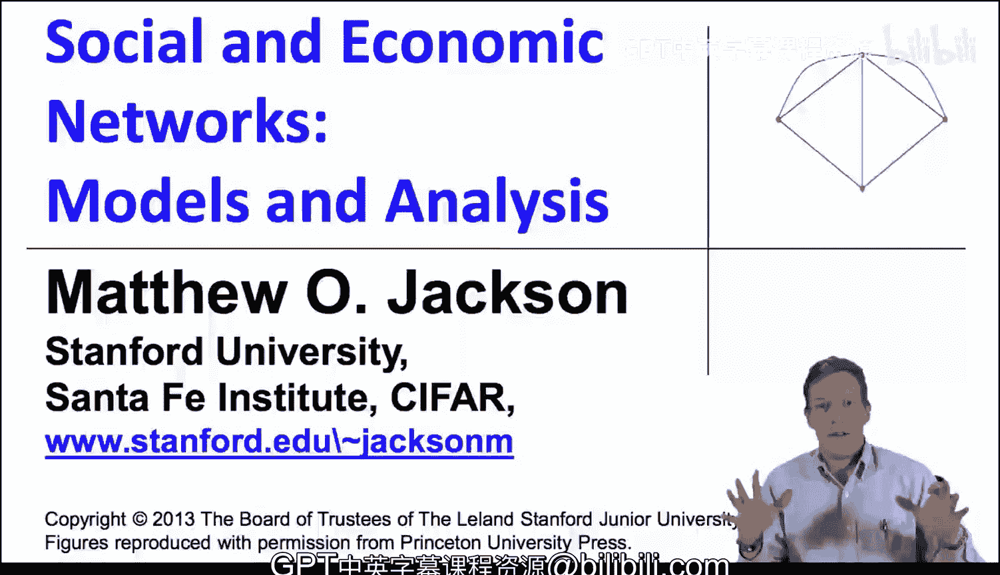
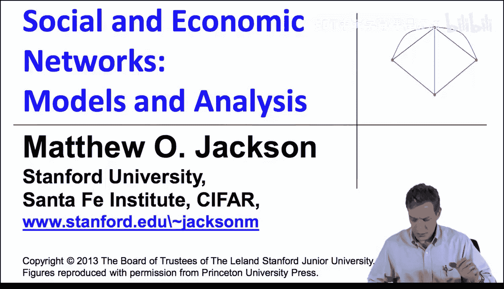
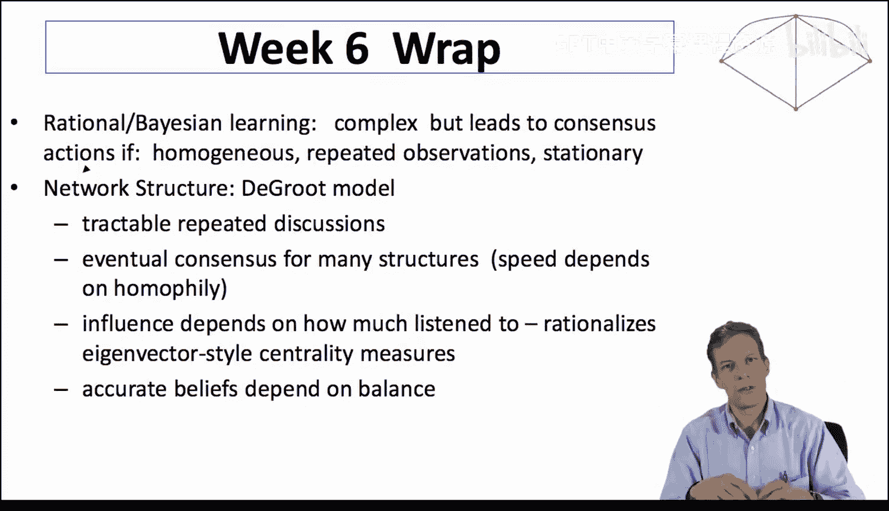
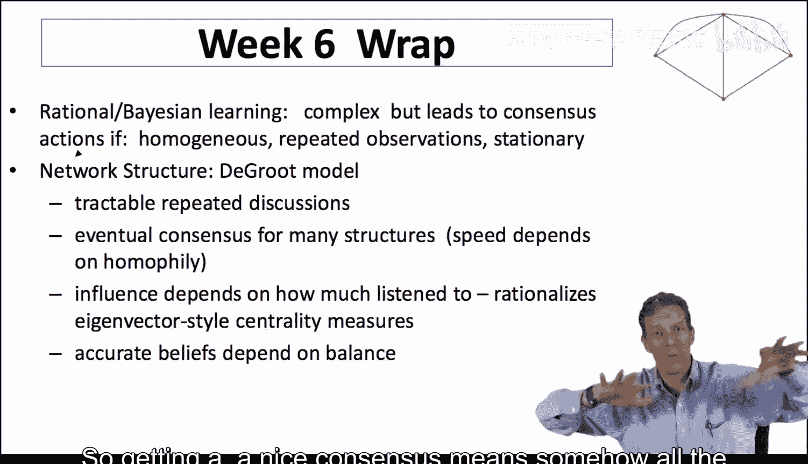
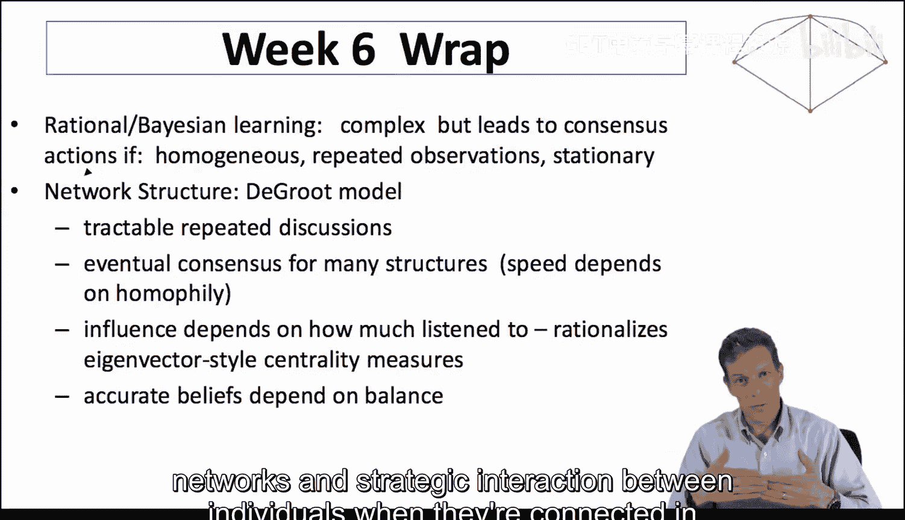

#  071：第六周总结 📚

在本节课中，我们将回顾第六周所学的核心内容，重点总结网络中的学习模型。

## 概述

第六周我们探讨了网络环境下的学习模型。我们首先分析了贝叶斯学习和理性学习，随后转向了更易于分析网络结构的模型，如德格罗特模型。最后，我们讨论了影响力、共识形成以及网络结构如何影响社会信念的准确性。

## 贝叶斯学习与理性学习

我们首先从贝叶斯学习和理性学习模型开始。需要指出的一点是，在网络环境中理解人们如何进行推断是相当复杂的。人们需要推断他人知道什么、与谁交谈等信息。尽管如此，在某些条件下仍可推导出一些简单的结论。

如果网络中存在足够的同质性，即每个人都观察相同的过程并试图做出同类决策，并且在非常平稳的系统中进行重复观察，那么这将最终导致共识的形成。当人们看到他人的行为并发现其有效时，简单的模仿就会引导人们跟随这些行为。随着时间的推移，系统将收敛到人们采取相同行为的状态。这是理性学习模型中的一个重要观点，它并不严格要求特定的网络结构。

## 德格罗特模型

为了更好地理解网络结构的作用，我们研究了一种截然不同的模型——德格罗特模型。这个模型非常易于处理，尽管有其独特之处。它是一个简单的模型，假设人们反复交谈，并对从其他个体那里听到的信息进行平均。这种反复平均的过程在许多情况下会导致共识的形成。

该模型的优点在于，它可以利用矩阵代数和马尔可夫过程的相关知识进行优雅的分析。这使得我们能够轻松理解其收敛特性。在许多情况下，只要网络具有良好的连通性和非周期性，就能达成共识。

关于这些过程的速度，我们没有深入讨论，但它在一定程度上取决于同质性以及不同群体间联系的强度。如果网络结构非常均衡，人们广泛听取他人意见，收敛速度就会很快。反之，如果群体更加隔离和内向，信念从一个网络部分传播到另一个部分的速度就会更慢。关于此点，教材和其他参考文献中有更详细的讨论。

## 影响力与中心性

在影响力方面，我们为中心性的特征向量度量方法找到了一个很好的合理化解释。其核心在于，一个节点的重要性取决于它被其他重要的、且同样被他人倾听的节点所倾听的程度。这就形成了一种递归定义。一个节点的影响力可以通过特征向量计算来很好地捕捉。

**公式**：一个节点 `i` 的影响力 `x_i` 可以表示为：
`x_i = λ * Σ_j a_ij * x_j`
其中 `a_ij` 是邻接矩阵元素，`λ` 是一个常数。

## 社会信念的准确性

最后，社会的准确性在一定程度上取决于信念的分布。以下是影响准确性的关键因素：

*   **倾听过程的分布**：如果太多人倾听同一个信息源，该信息源的影响力就会过大。如果这个源是错误的，那么整个社会就会出错。
*   **信息的聚合**：要达成良好的共识，意味着散布在社会各个部分的信息必须有机会被聚合起来。
*   **网络平衡性**：均衡的网络在聚合信念方面表现更好。

## 总结与展望

本节课中，我们一起学习了网络中的学习模型。我们从复杂的理性推断模型，过渡到更易于分析网络结构的德格罗特平均模型，并探讨了影响力中心性和社会共识形成的条件。

关于学习这个主题，还有很多内容可以探讨，你可以在教材中找到更多参考文献。本课程的目的是让你对这些概念有一个基本的感受。这些模型本身也在不断发展，例如人们正在研究理性与非理性学习的结合，或者存在策略性动机扭曲学习过程的情境（例如，为了推动特定政策而有意影响他人信念）。这或许可以解释社会中信念为何如此分化。

接下来，我们将要学习的是网络上的博弈，即个体在网络连接下的策略互动。