#  072：网络博弈 🕸️🎮

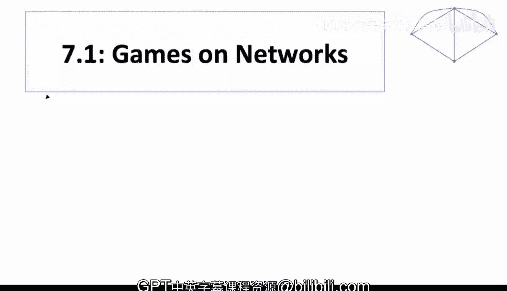

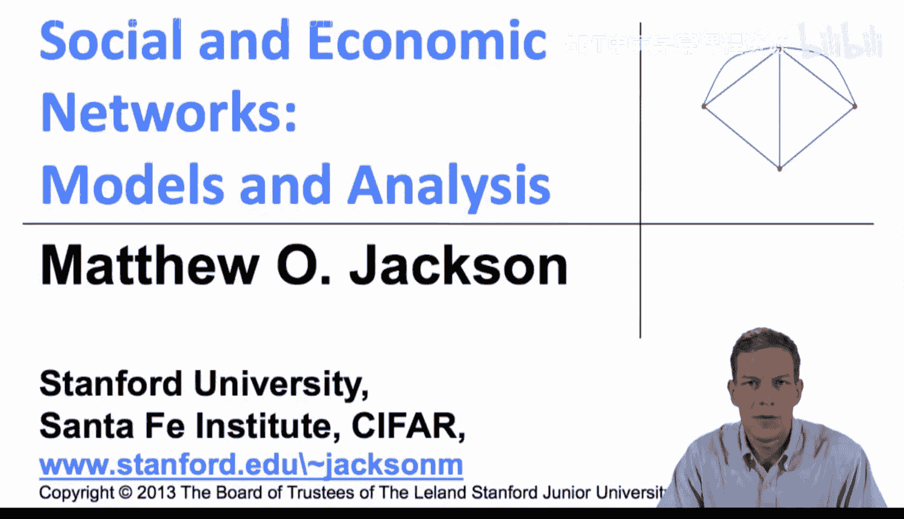

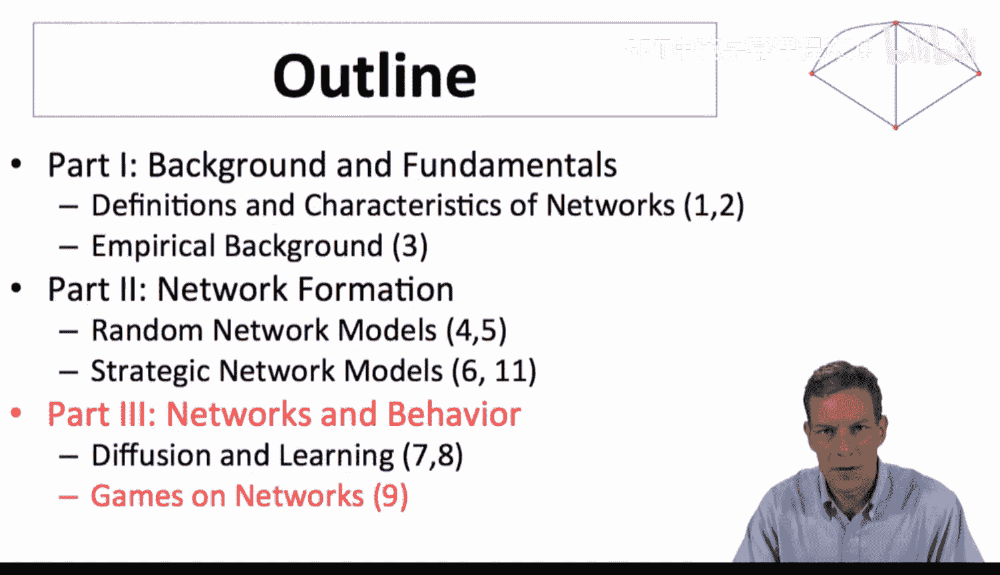

在本节课中，我们将要学习网络博弈的基本概念。我们将探讨个体如何在网络中做出相互依赖的决策，以及网络结构如何影响这些战略互动。课程将从简单的二元选择模型开始，逐步引入更复杂的分析。

---

## 概述

网络博弈研究的是个体在相互连接的网络中做出决策的情况。与简单的扩散或传染过程不同，这里个体的决策具有战略性，即一个人的选择取决于其邻居的选择。例如，一个人是否购买某个软件，可能取决于他的朋友是否也在使用该软件。我们将使用博弈论作为工具，来理解行为与网络结构之间的关系。

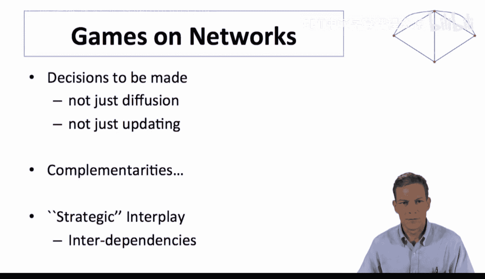

---

## 基本定义与设定

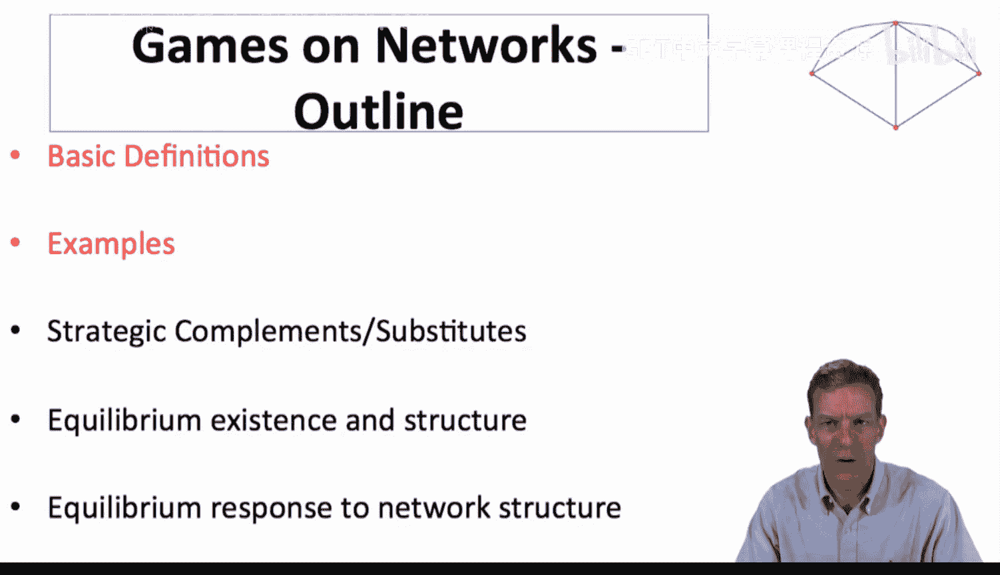

上一节我们介绍了网络博弈的核心思想，本节中我们来看看其基本定义。我们从一个简单且广泛适用的特例开始。

假设网络中有多个个体。每个人 `i` 需要做出一个二元选择，记作 `x_i`，其值可以是 **0** 或 **1**。例如，0 代表不购买某本书，1 代表购买。

个体的收益取决于三个因素：
1.  他自己的行动 `x_i`。
2.  他的邻居中选择行动 **1** 的人数。
3.  他拥有的邻居总数（即他的度数 `d_i`）。

以下是该模型的主要简化假设：
*   **二元行动**：个体只能在两个选项中选择。
*   **匿名性**：个体只关心有多少邻居选择了行动1，而不关心具体是哪些邻居。
*   **同质性**：所有人的收益函数形式相同，且平等对待所有邻居。

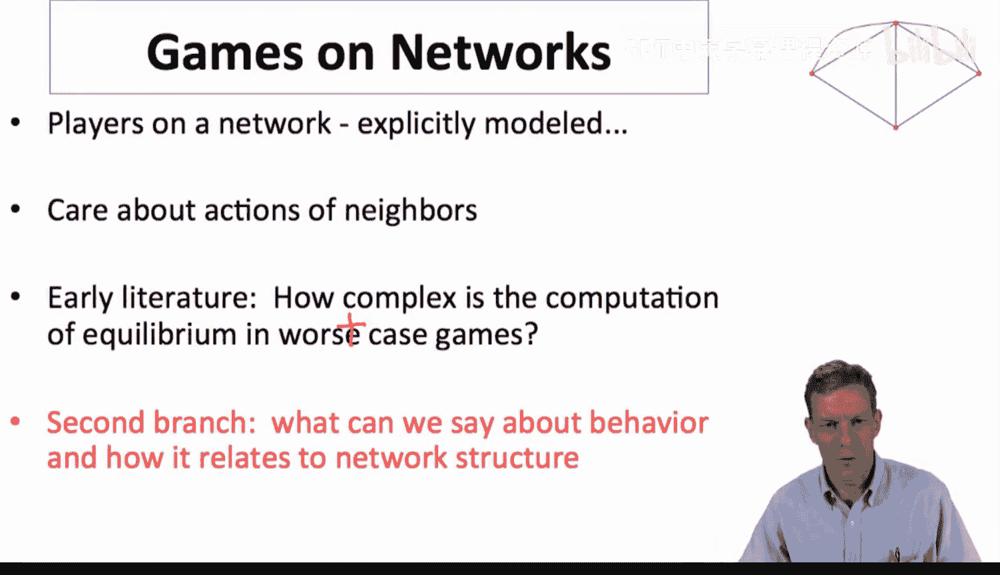

我们可以用以下公式化的方式描述个体 `i` 的收益：
`收益_i = f(x_i, 邻居中选择1的人数, 总邻居数 d_i)`

---

## 互补性博弈示例

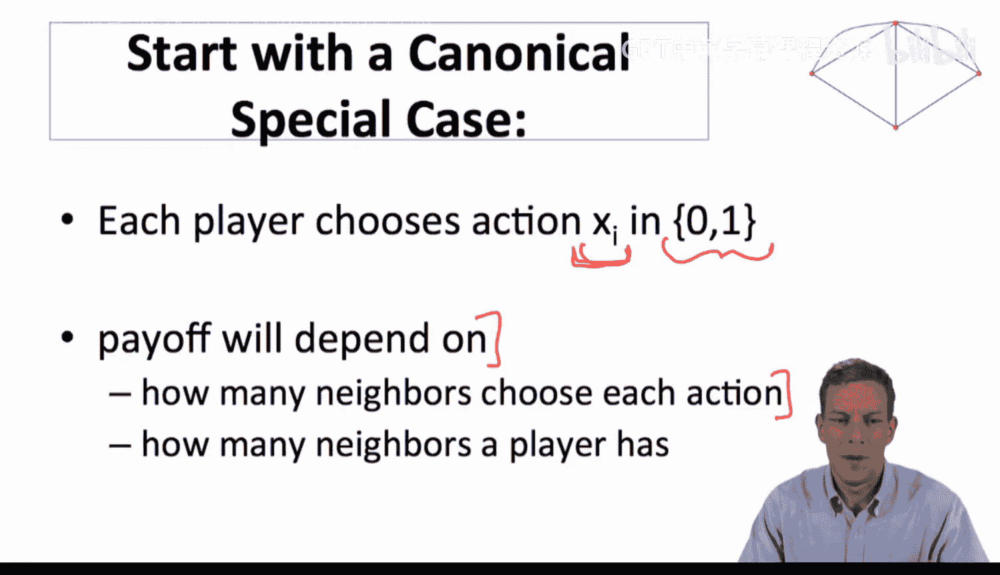

现在，让我们看一个具体的互补性博弈例子。在这种博弈中，个体更倾向于在邻居也采取相同行动时采取该行动。

考虑一个情景：一个人愿意采用一项新技术（选择行动1），当且仅当**至少有两个邻居**也采用该技术。否则，他选择不采用（行动0）。

我们可以用一个简单的收益函数来表示：
*   如果选择行动0，收益为 `0`。
*   如果选择行动1，收益为 `-T + (邻居中选择1的人数)`，其中 `T` 是阈值（本例中 `T=2`）。

这意味着，只有当至少 `T` 个邻居选择1时，选择行动1的收益才非负。

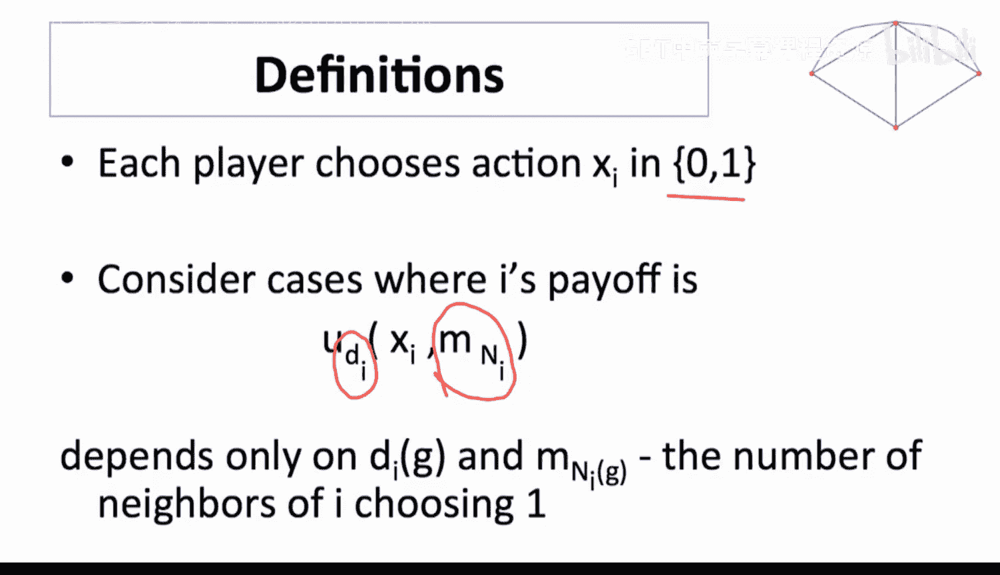

---

### 网络中的均衡分析

让我们在一个具体的网络中分析这个博弈。假设网络结构如下图所示（此处为文字描述，原图为节点与边的连接）：
*   有三个外围节点，每个都只连接到一个中心节点。
*   中心节点连接这三个外围节点。

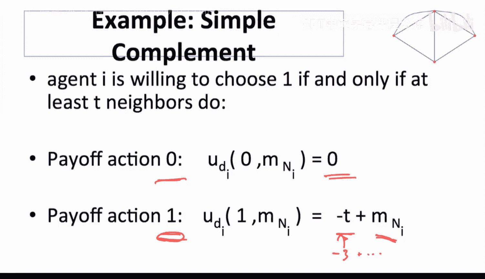

根据规则（至少需要两个邻居选择1）：
1.  所有外围节点都**不可能**选择行动1，因为他们各自只有一个邻居。
2.  中心节点的决策取决于其邻居（即三个外围节点）的选择。

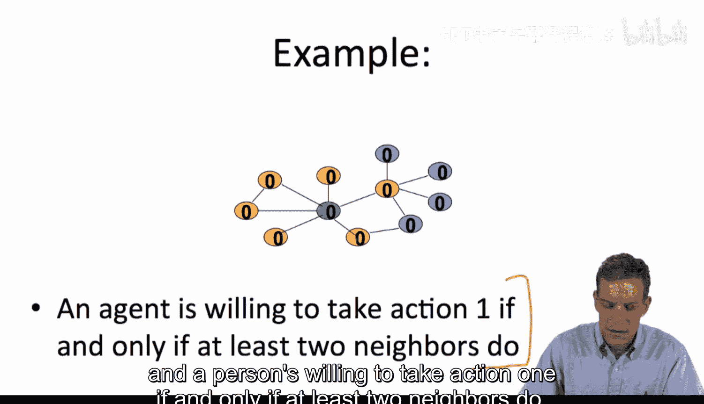

以下是可能出现的均衡情况：
*   **无人采用**：如果所有外围节点选择0，那么中心节点也没有两个邻居选择1，因此也会选择0。这是一个均衡。
*   **局部采用**：如果所有三个外围节点都选择1，那么中心节点就有三个邻居选择1，超过了阈值，因此也会选择1。此时，对于外围节点而言，他们各自只有一个邻居（中心节点）选择了1，未达到阈值，所以他们选择0是合理的。然而，这产生了一个矛盾：我们假设外围节点选择了1，但他们实际上没有动机这样做。因此，**“所有外围节点选择1”本身不是一个可持续的均衡**。
*   **更合理的均衡**：实际上，在这个特定网络中，由于外围节点永远无法满足“至少两个邻居选择1”的条件，所以唯一的纯策略纳什均衡就是**所有人都选择0**，新技术无法启动。

这个例子展示了“协调失败”的可能性：即使一项技术对群体有益，也可能因为初始采纳人数不足而无法传播开来。

---

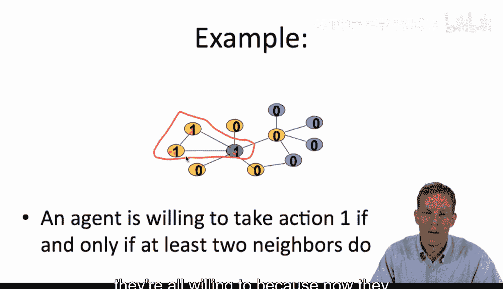

## 替代性博弈示例

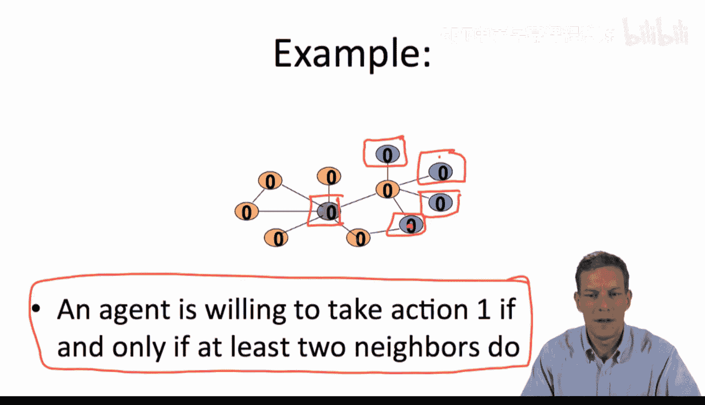

上一节我们看了互补性博弈，本节中我们来看看具有相反特征的替代性博弈。在这类博弈中，个体更倾向于在邻居不采取某行动时自己才采取。

考虑一个“买书”的例子：如果我的一位邻居买了书，我就可以借来看，那么我自己就不需要买了。只有当没有邻居买书时，我才有动力自己买。

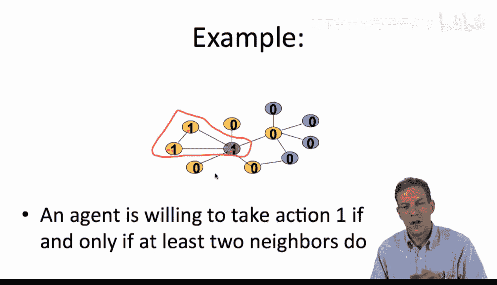

以下是收益设定：
*   如果我不买书（行动0）：
    *   只要有至少一个邻居买了书，我就能借到，收益为 `1`。
    *   如果所有邻居都没买书，我借不到，收益为 `0`。
*   如果我买书（行动1）：我需要付出成本 `c`（假设 `0 < c < 1`），但拥有了书，收益为 `1 - c`。

个体的最优策略是：**当且仅当没有邻居买书时，自己才买书**。这被称为“最佳射击”公共物品博弈。

---

### 网络中的均衡分析

在这种博弈中，一个可能的均衡是：网络中的某些特定节点选择买书（行动1），而他们的所有邻居都选择不买（行动0）。例如，如果我们选择一组互不相邻的节点（即图论中的“独立集”）让他们买书，而他们的邻居都不买，那么：
*   买书的人：因为没有邻居买书，所以自己买是合理的。
*   不买书的邻居：因为他们有邻居买了书，可以借阅，所以不买也是合理的。

因此，这种“交错”的模式可以构成一个均衡。与互补性博弈不同，这里行动1的采纳者倾向于在网络中分散开来，而不是聚集在一起。

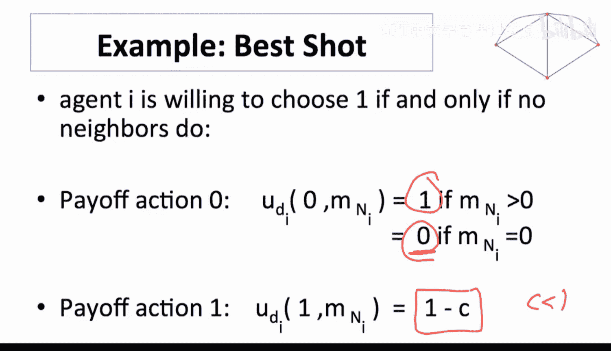

---

## 总结

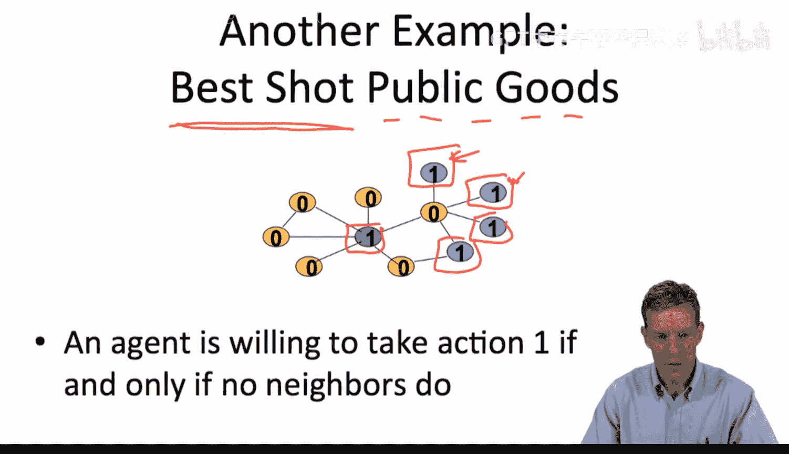

本节课中我们一起学习了网络博弈的基础。
*   我们首先定义了网络博弈的基本框架：个体在网络上进行二元选择，其收益取决于自身行动、邻居的选择以及网络度数。
*   接着，我们分析了两种典型博弈：
    1.  **互补性博弈**：个体采纳行动1的意愿随邻居采纳人数的增加而增加。这可能导致协调失败，使得有益的技术无法扩散。
    2.  **替代性博弈（最佳射击博弈）**：个体只在没有邻居采纳行动1时才会自己采纳。这会导致采纳者在网络中分散分布。
*   我们看到了网络结构如何与博弈规则共同作用，塑造了不同的均衡结果，例如无人采纳或局部采纳的模式。

在接下来的课程中，我们将为这些博弈引入更多结构，更形式化地分析均衡性质，并最终将均衡结构与网络结构紧密联系起来，从而更深入地理解网络如何影响行为。