#  073：战略互补与替代 🎯

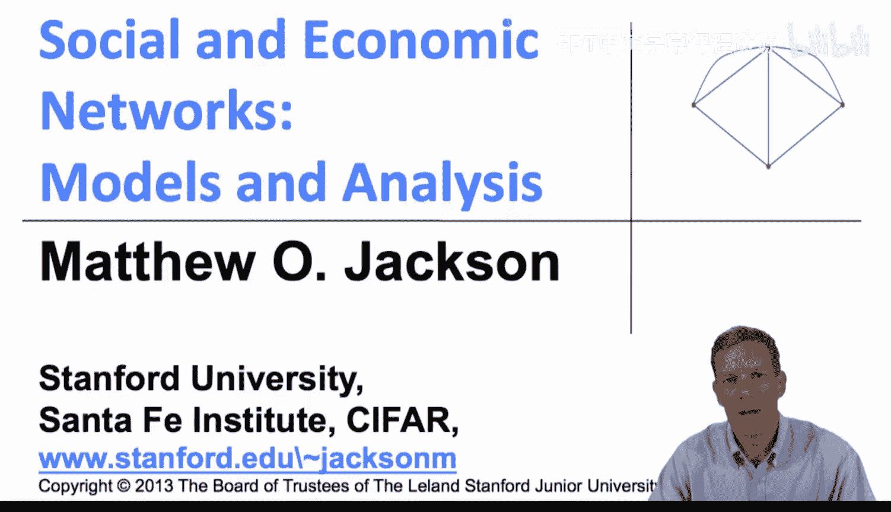

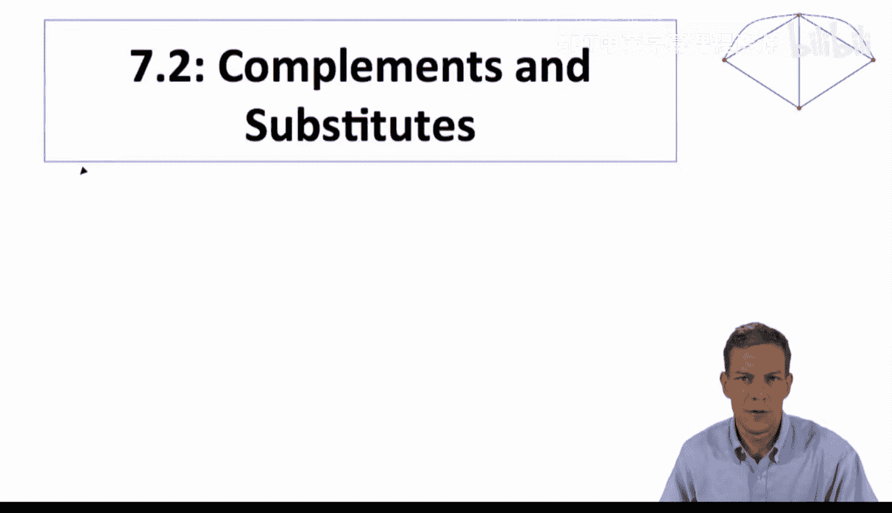

在本节课中，我们将学习网络博弈中的核心概念：战略互补与战略替代。我们将探讨这两种行为模式如何影响个体决策，以及它们与网络结构的关系。

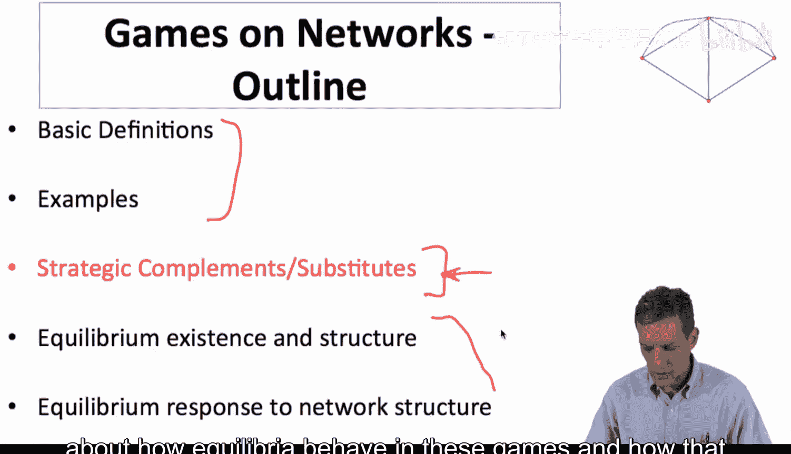

---

上一节我们介绍了网络博弈的基本定义和例子。本节中，我们将更详细地探讨战略互补与战略替代之间的区别。这将帮助我们理解这些博弈中的均衡行为，以及它们如何与网络结构相关联。

## 核心概念：互补与替代

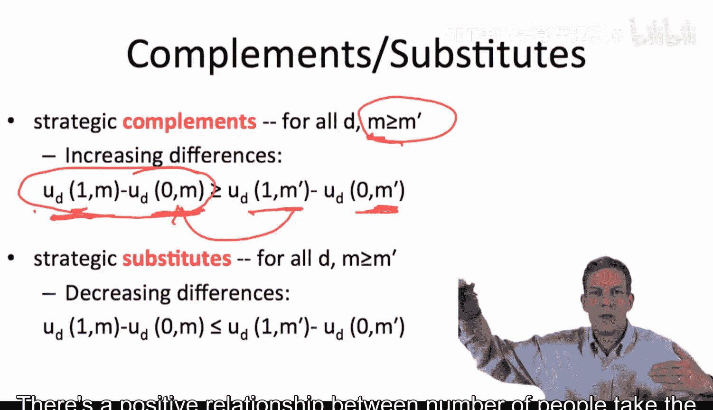

战略互补行为是指，当我的更多朋友采取某个行动时，我采取该行动的吸引力会增加。战略替代行为则相反，当更多朋友采取某个行动时，我采取该行动的吸引力会下降。

具体来说，我们观察一个度为 **D** 的个体，比较他采取行动 **1** 与行动 **0** 的收益。假设开始时，有 **M'** 个邻居采取行动，然后这个数量增加到 **M**。我们关注随着采取行动的朋友数量增加，个体采取该行动的激励如何变化。

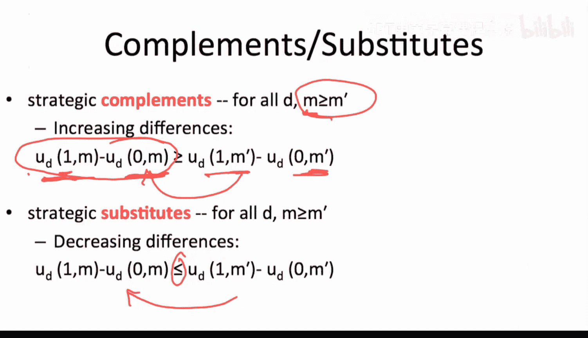

*   **战略互补**：当采取行动的朋友数量从 **M'** 增加到 **M** 时，个体采取行动 **1** 相对于行动 **0** 的收益差（或吸引力）**非递减**。这意味着，采取行动变得相对更有吸引力。
    *   公式化描述：对于 **M > M'**，有 **u(1, M) - u(0, M) ≥ u(1, M') - u(0, M')**。
*   **战略替代**：情况正好相反。当采取行动的朋友数量增加时，个体采取行动的相对吸引力**非递增**。
    *   公式化描述：对于 **M > M'**，有 **u(1, M) - u(0, M) ≤ u(1, M') - u(0, M')**。

我们可以将不等式改为严格不等，从而定义**严格战略互补**和**严格战略替代**。

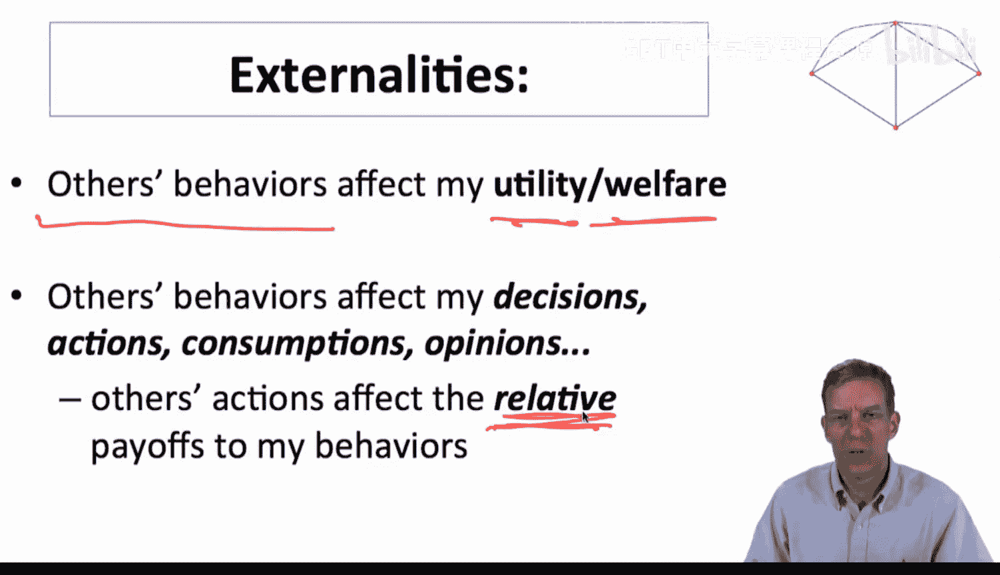

---

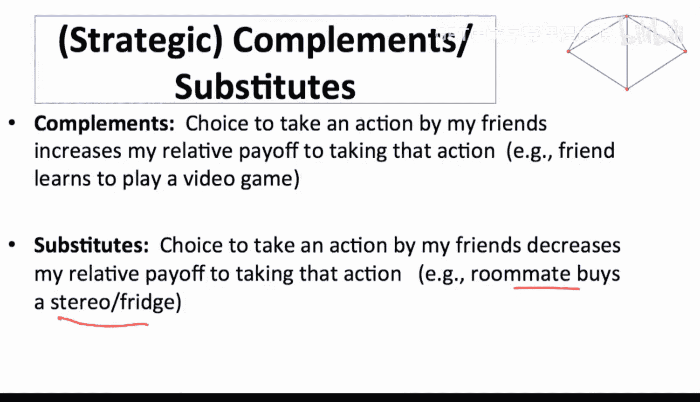

## 外部性与相对收益

显然，这是一个存在外部性的环境。他人的行为会影响我的效用或福利，从而影响我的选择。关键在于，他人的行为不仅影响我的绝对收益，更重要的是影响了我的**相对收益**（即选择不同行动带来的效用差）。只有这样，他人的行为才能真正改变我的决策。

在战略互补和替代的背景下，外部性之所以存在，正是因为它们影响了相对收益。例如，更多朋友玩某款电子游戏（互补），或更多朋友买了某本书（替代），都会改变我采取相同行动的相对吸引力。

---

## 现实世界中的例子

以下是战略互补与替代的一些常见例子，这说明了在网络博弈中理解人们决策的重要性。

**战略互补的例子：**
*   **教育决策**：你认识越多受过良好教育、社会地位高的人，你自己投资人力资本（如上大学）的吸引力就越大。
*   **青少年行为**：吸烟、不良行为等，同伴的影响会带来压力或舒适感，促使个体随大流。
*   **技术采用**：采用某项技术的吸引力，很大程度上取决于使用它的人数。
*   **学习语言**：学习某种语言的价值，随使用该语言的人数增加而增加。
*   **作弊或使用兴奋剂**：这是一个重要例子。当更多竞争对手作弊时，为了保持竞争力，你作弊的相对收益会上升。这说明了战略互补**不一定**意味着正外部性（整体福利增加），它只意味着采取该行动的**相对吸引力**在增加。

**战略替代的例子：**
*   **信息收集**：如果我的朋友学会了某项技能，他们可以帮我，我就不必自己花时间学习。
*   **地方公共品/可共享产品**：朋友买了书、CD或下载了音乐，我就可以借用或复制。
*   **市场竞争**：在寡头垄断中，如果竞争对手在某个市场行动更多，可能使我进入该市场的意愿降低。

从这些例子中，我们可以得到两个重要结论：
1.  有大量应用场景中，人们的决策依赖于朋友的行为。
2.  许多场景可归入两类：激励随采取行动的人数增加而增加（互补），或减少（替代）。这为我们的分析提供了丰富的结构。

---

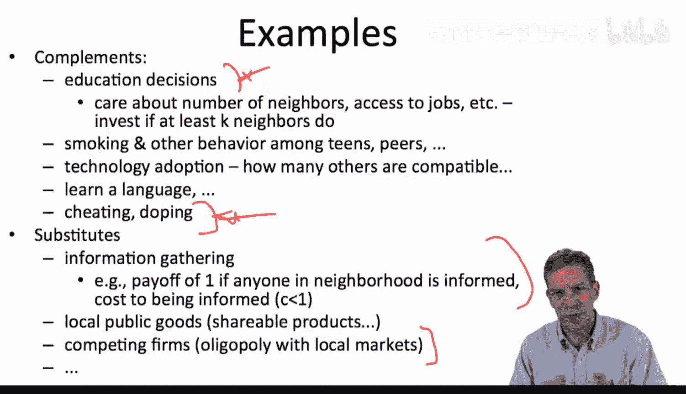

## 均衡：纳什均衡

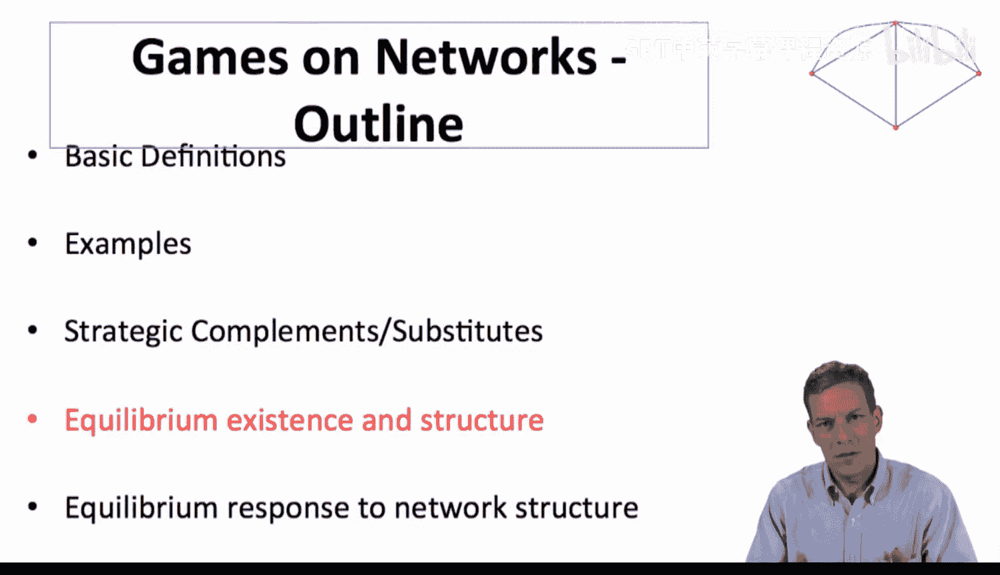

在分析行为时，我们将使用博弈论中的经典解概念——**纳什均衡**。其核心思想很简单：我们寻找一组行为策略，使得在给定其他人行为的情况下，每个人的选择都是他所能做的最佳选择。

例如，在“最佳一击”公共品博弈（买书）中：如果我的朋友买了书，我就不想买；如果我的朋友都没买，我就想买。我们将主要关注**纯策略均衡**，即每个人做出确定性的选择（买或不买），而不是随机化。

---

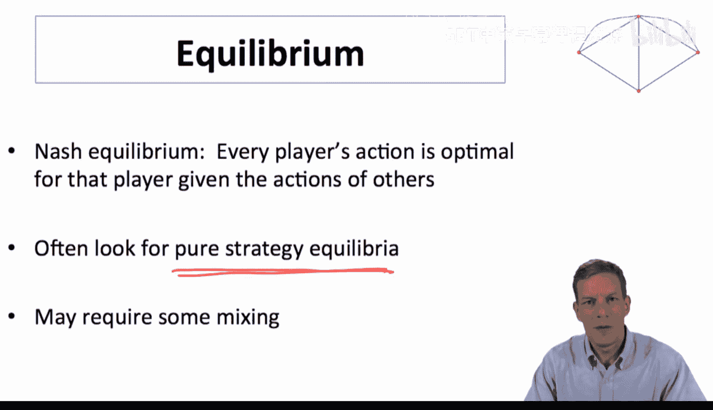

## 案例分析：“最佳一击”公共品博弈

让我们看一个“最佳一击”公共品博弈的例子。在下图网络中，存在多个纯策略纳什均衡。

*   **均衡 A**：外围五个人买书（行动1），中心人物不买（行动0）。中心人物可以“搭便车”借书，获得收益1；若他改为买书，收益为1-C（C为成本），得不偿失。每个买书者获得收益1-C；若他们改为不买，由于没有邻居买书，收益将降为0，因此也不会改变行为。
*   **均衡 B**：中心人物买书，外围五个人不买。这也是一个均衡。
*   **非均衡示例**：如果两个相连的节点都买书，那么其中一人停止购买会变得更好，因此这不是均衡。

有趣的是，这个博弈的纯策略均衡与图论中的一个概念紧密相关：**极大独立集**。

*   **独立集**：图中一个节点集合，其中任意两个节点都不相连。
*   **极大独立集**：一个独立集，且无法通过添加任何不在集合中的节点来扩大它，同时保持独立性（即新加入的节点必须与集合内节点有连接）。

在“最佳一击”博弈中，采取行动1的节点集合必须是一个极大独立集。均衡A和B对应的集合都是原图的极大独立集。不同的均衡会导致不同的社会总福利分布。例如，均衡B（1人买书）比均衡A（5人买书）耗费的总成本更低，整体福利可能更高。

---

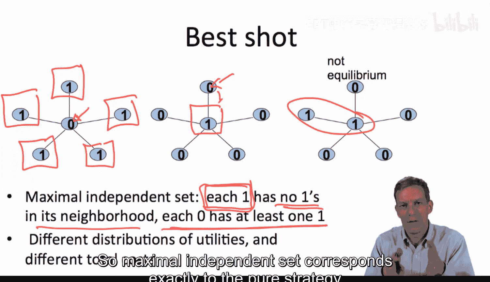

## 阈值与网络结构

在分析互补和替代博弈时，**阈值**是一个非常有用的工具。

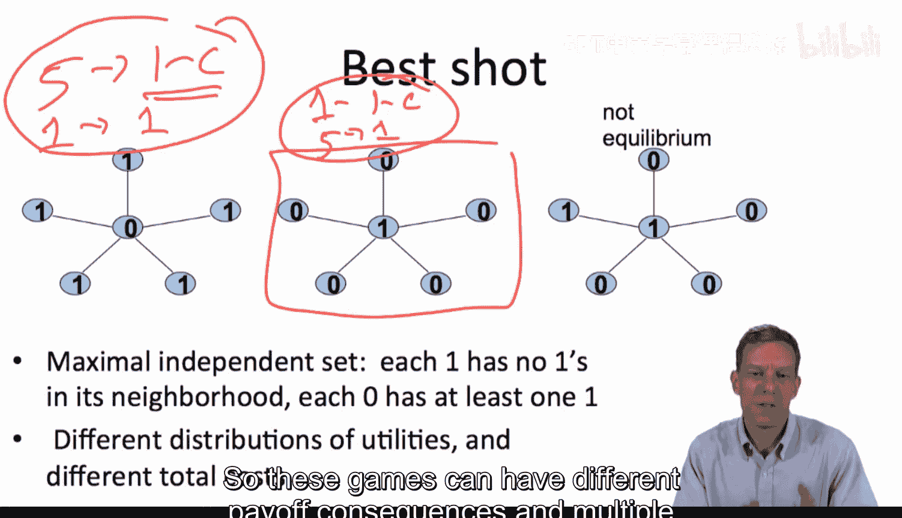

*   **战略互补博弈**：对每个个体（可能取决于其度数 **d**），存在一个阈值 **t**。如果采取行动的邻居数 **≥ t**，则他倾向于采取行动；如果 **< t**，则倾向于不采取行动。
    *   阈值可以是绝对数（如至少3个朋友），也可以是比例（如至少一半的朋友）。
*   **战略替代博弈**：逻辑相反。存在一个阈值 **t**，如果采取行动的邻居数 **≤ t**，则他倾向于采取行动；如果 **> t**，则倾向于不采取行动。

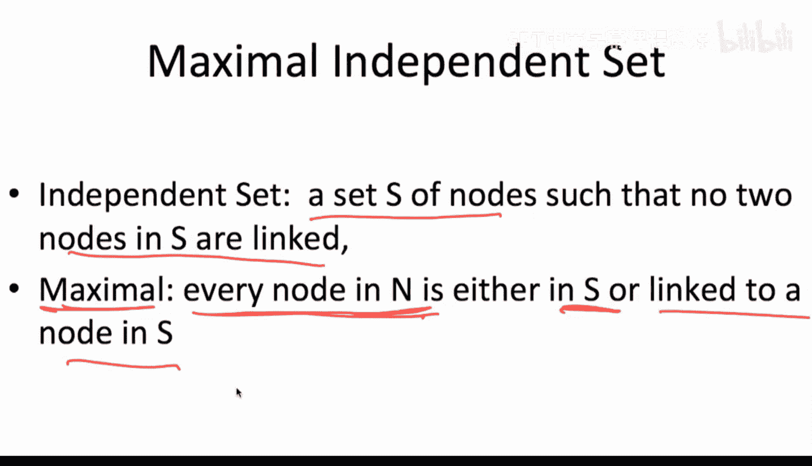

阈值具体如何设定，刻画了特定博弈的性质。而网络结构则决定了这个阈值条件在具体情境中如何实现。

---

## 战略互补博弈示例

考虑一个阈值 **t=2** 的战略互补博弈（对所有节点相同）。在下图网络中，存在多个均衡。

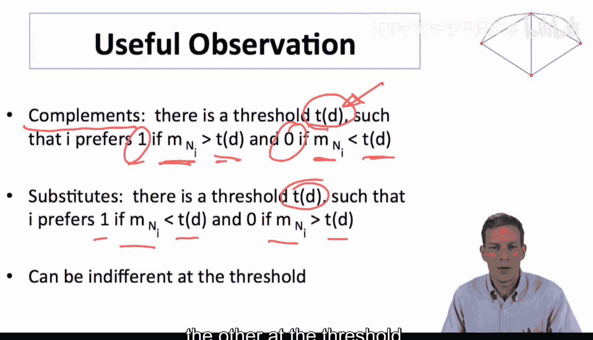

*   **均衡 1**：无人采取行动。每个节点的邻居采取行动数都为0 (<2)，因此无人愿意改变。
*   **均衡 2**：三个特定节点采取行动（如图中三角）。它们的邻居中采取行动数都≥2，因此愿意维持。其他节点邻居中采取行动数<2，因此也愿意维持不行动。
*   **均衡 3**：六个节点采取行动。这是一个均衡，请尝试找出第四个均衡。

战略互补博弈的均衡具有良好的结构性（如格结构），使得寻找均衡相对容易。

---

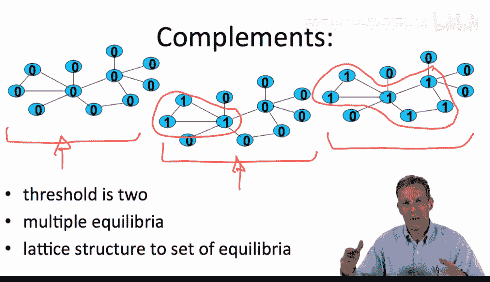

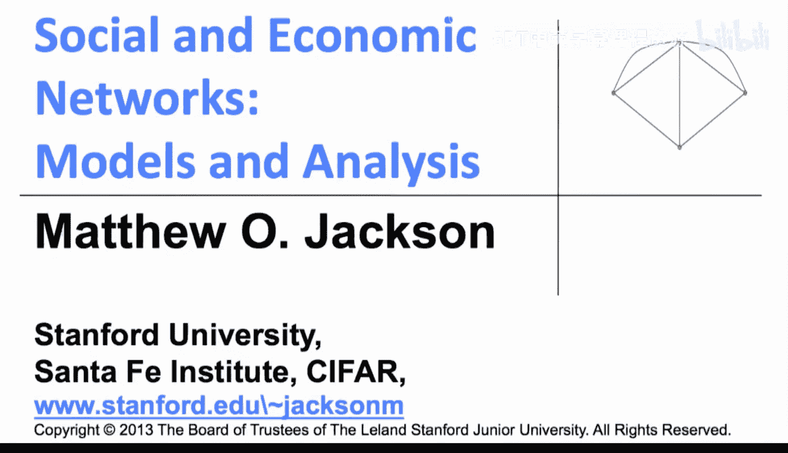

本节课中，我们一起学习了网络博弈中的两个核心概念：**战略互补**与**战略替代**。我们明确了它们的定义，理解了其背后的外部性与相对收益逻辑，并列举了丰富的现实例子。我们引入了**纳什均衡**作为分析工具，并通过“最佳一击”公共品博弈的案例，看到了均衡如何与图论中的**极大独立集**概念对应。最后，我们介绍了**阈值**的概念，它将成为我们连接博弈特性与网络结构的关键桥梁。在接下来的课程中，我们将利用这些概念，深入探讨均衡的存在性与结构。