#  074：均衡性质 🔗

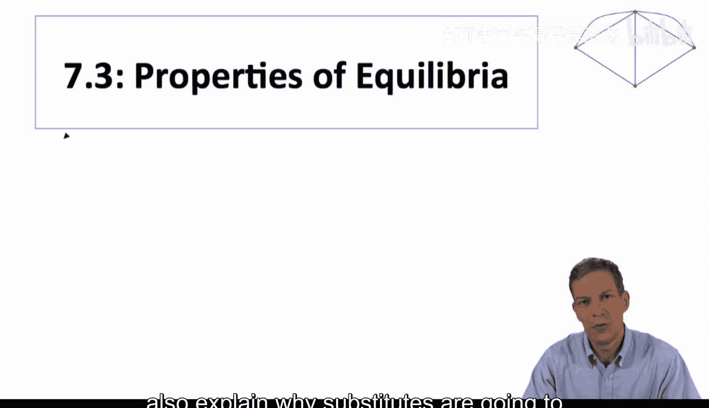

在本节课中，我们将探讨网络博弈中均衡的性质。这有助于我们更深入地理解这些博弈如何运作。我们将继续围绕**策略互补**和**策略替代**这两个核心概念展开，并重点指出互补博弈的一个优良特性，同时解释为何替代博弈的分析会复杂得多。

为了进行深入分析，我们需要引入一个数学概念：**完全格**。如果你对数学细节不感兴趣，可以跳过这部分，但我会简要介绍一下格的基本思想。

## 什么是格？📐

格是一组具有**偏序**关系的点的集合。偏序意味着我们可以用“大于等于”（≥）这样的符号来比较某些对象，但并非所有对象都能相互比较。

在我们的情境中，这些“对象”就是博弈的均衡。例如，考虑一个由6个个体组成的网络，每个个体可以选择行动0或1。我们可以将所有可能的行动组合（如全0、全1、或部分0部分1）视为一个向量空间。我们定义一个向量“大于等于”另一个向量，如果它的每一个分量都至少与另一个向量的对应分量一样大。

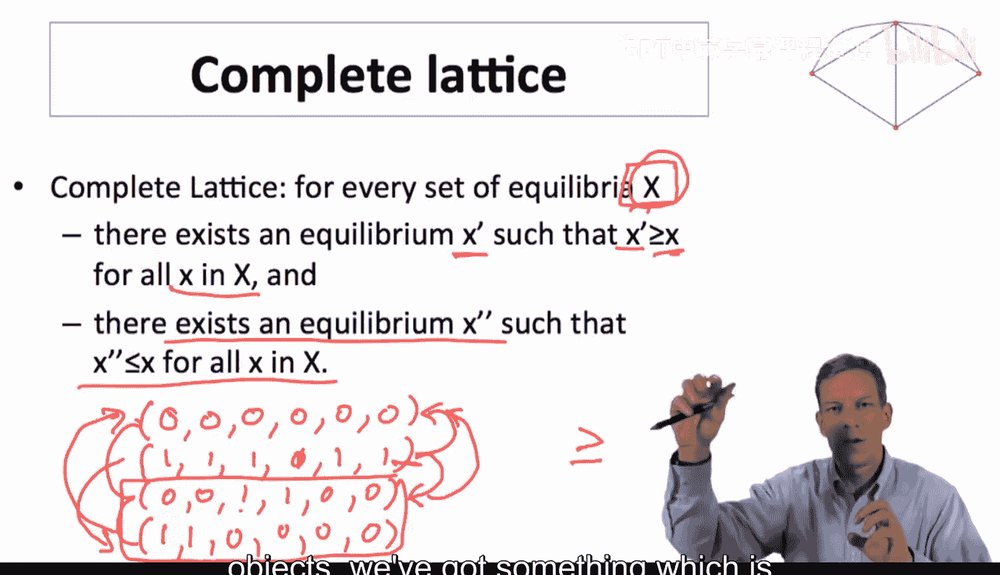

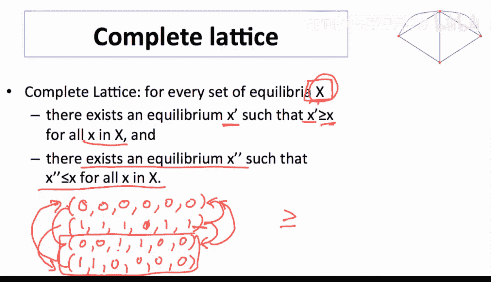

例如，向量 `(1,1,0,0,0,0)` 大于等于 `(0,1,0,0,0,0)`，因为第一个分量更大。然而，向量 `(1,0,0,0,0,0)` 和 `(0,1,0,0,0,0)` 就无法直接比较，因为它们在各自的分量上互有高低。

**完全格**的关键性质在于：对于该集合中的**任何**一个子集，都存在一个对象，它**至少和该子集中的所有对象一样大**；同时，也存在另一个对象，它**至少和该子集中的所有对象一样小**。

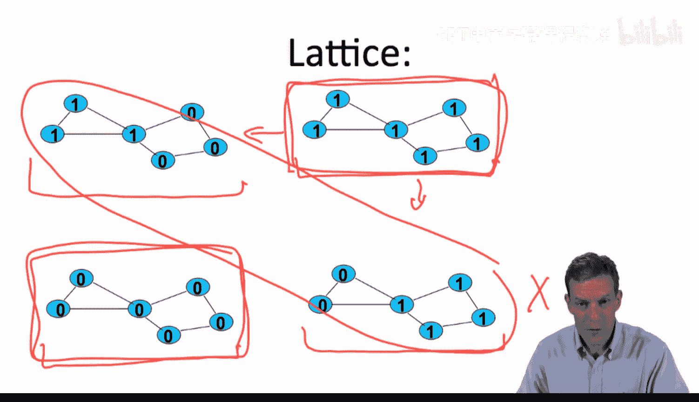

## 为什么格的概念有用？🎯

让我们思考均衡的结构。在之前“至少有两个邻居行动，自己才行动”的博弈例子中，存在多个纯策略均衡，例如全1、全0，或者某些特定个体行动1。这些均衡构成了一个格。其中存在一个**最大的均衡**（全1）和一个**最小的均衡**（全0）。对于任意一组均衡，我们总能找到一个比它们都“大”的均衡和一个比它们都“小”的均衡。

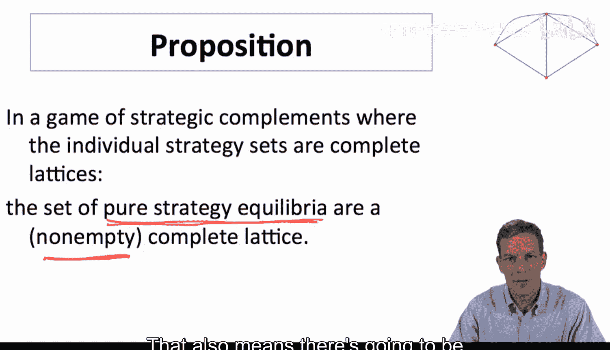

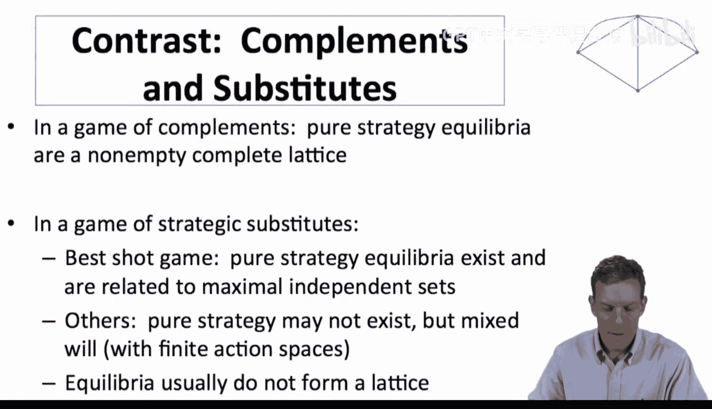

这种结构对于分析策略互补博弈非常有用。事实上，存在一个命题指出：在一个策略互补博弈中，如果每个个体的策略集都是完全格，那么所有纯策略均衡的集合构成一个**非空的完全格**。这是一个可以直接从标准博弈论中推导出的定理。

这个定理意味着：
1.  均衡具有优美的数学结构（完全格）。
2.  作为一个直接推论，策略互补博弈**总是存在纯策略均衡**，因为完全格必须是非空的。
3.  存在有效的方法来寻找这些均衡。

## 如何寻找均衡？🔍

上一节我们介绍了格的结构，本节中我们来看看如何利用它来寻找均衡。假设我们有一个策略互补博弈，个体行动为0或1。我们想找到**最大的可能均衡**。

以下是一个简单的算法：
1.  **初始化**：尝试让所有个体都采取行动1（这是可能的最大点）。
2.  **检查与调整**：
    *   如果“全1”是一个均衡，那么它就是最大均衡，算法结束。
    *   如果不是，则意味着至少有一个个体，即使在所有其他人都行动1的情况下，也不愿意行动1。由于这是策略互补博弈，如果这个个体在“全1”时都不愿行动，那么在任何情况下他都不会愿意行动。因此，我们可以**永久地将该个体的行动固定为0**。
3.  **迭代**：在固定了这些必然为0的个体后，重新检查剩余个体在“其他人全为1”的假设下是否愿意行动1。重复步骤2，不断将不愿意行动的个体固定为0。
4.  **终止**：这个过程最终会停止。要么我们到达一个状态，其中所有剩余个体都愿意行动1（即找到一个均衡），要么所有人都被固定为0（此时“全0”必然是一个均衡）。

这个算法最多需要n步（n为个体数）就能找到一个均衡。同样地，我们可以设计一个类似的算法来寻找**最小的均衡**（从“全0”开始，逐步将愿意行动的个体提升为1）。

由此可见，策略互补博弈的均衡不仅存在，结构良好，而且非常容易找到。

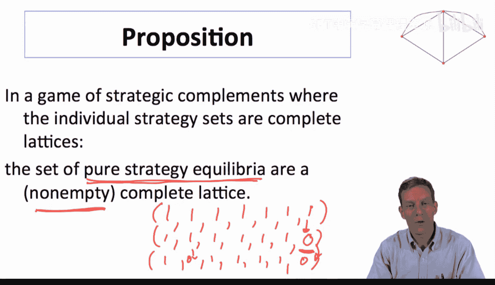

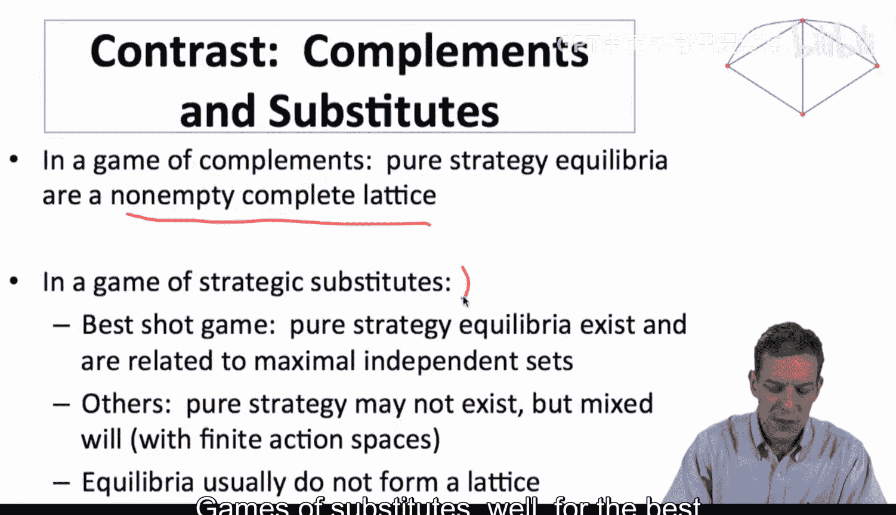

## 策略替代博弈的复杂性 ⚠️

与策略互补博弈的“美好”结构形成鲜明对比的是，策略替代博弈要复杂得多。

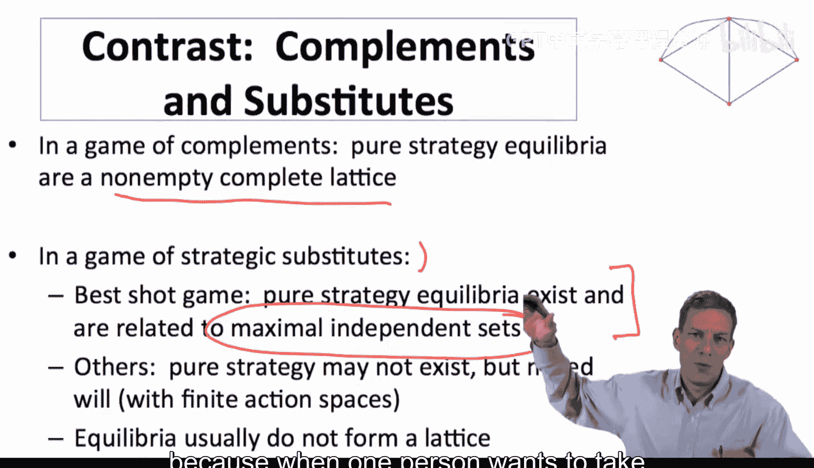

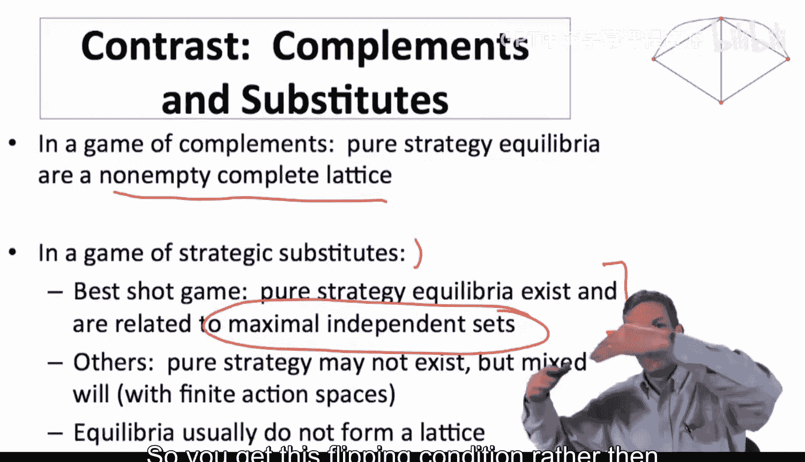

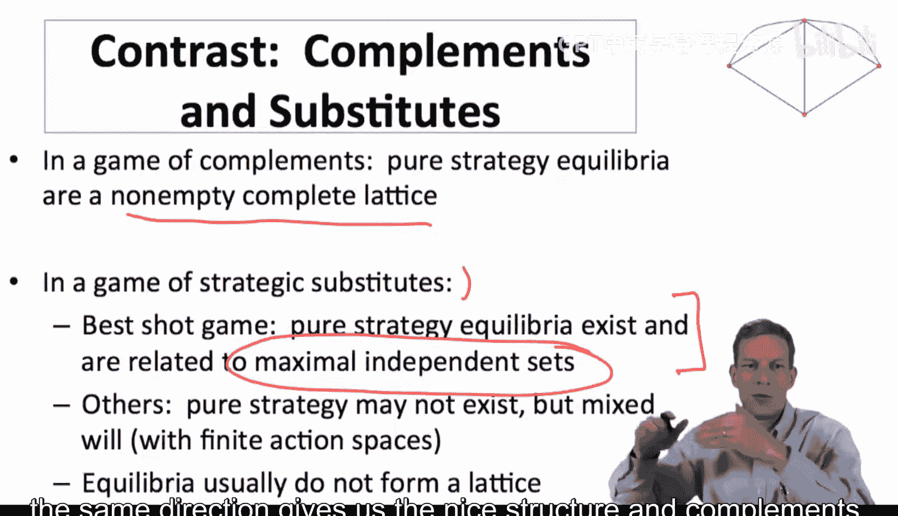

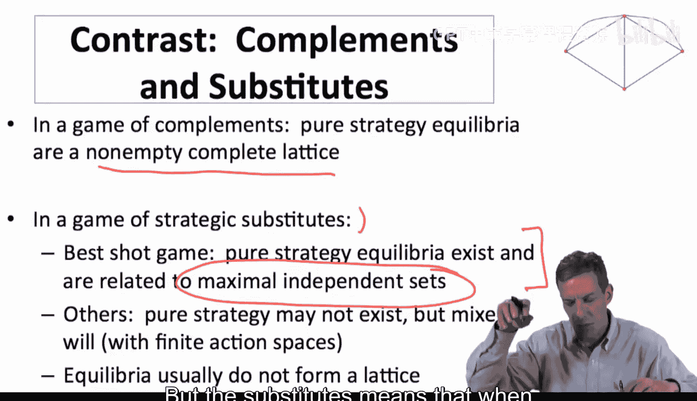

在之前讨论的“最佳射击”公共物品博弈（一个策略替代的例子）中，纯策略均衡确实存在，并且与图的**最大独立集**相关。然而：
*   在其他类型的策略替代博弈中，纯策略均衡可能根本不存在（需要引入随机化策略）。
*   均衡通常**不构成格结构**，除非是极其简单的情况。
*   分析起来很困难，因为当一个人从行动1切换到0时，可能会导致他的邻居从0翻转到1，进而引发连锁反应，形成“翻转”动态，而非所有人同步上升或下降的趋势。

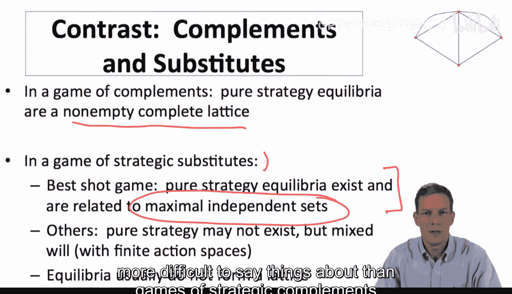

这种复杂性源于策略替代的本质：个体的偏好变动方向相反。这使得寻找和分析均衡变得更具挑战性。

例如，在“最佳射击”公共物品博弈中，找到一个最大独立集（即一个均衡）的算法相对简单：
1.  任意选择一个节点，令其行动为1。
2.  将其所有邻居的行动强制设为0（因为他们不希望在有邻居行动时自己行动）。
3.  在剩余未确定的节点中，再任意选择一个，令其行动为1，并将其邻居设为0。
4.  重复步骤3，直到所有节点状态确定。

这个算法可以找到一个均衡。但是，**找到所有的均衡**（即所有最大独立集）则是一个计算上非常困难的问题，其复杂度随着网络规模急剧增长。这与策略互补博弈中简单、高效的寻优算法形成了鲜明对比。

## 总结 📝

本节课中，我们一起学习了网络博弈均衡的核心性质：
*   **策略互补博弈**具有非常优良的均衡结构。均衡集合构成一个**完全格**，这意味着总是存在纯策略均衡，并且存在最大和最小均衡。我们可以用简单、高效的算法快速找到它们。
*   **策略替代博弈**的均衡结构则复杂得多。均衡可能不存在（纯策略），通常不构成格，并且寻找所有均衡是一个计算难题。尽管“最佳射击”等特定模型有对应的图论概念（如独立集）帮助分析，但总体上面临更多挑战。

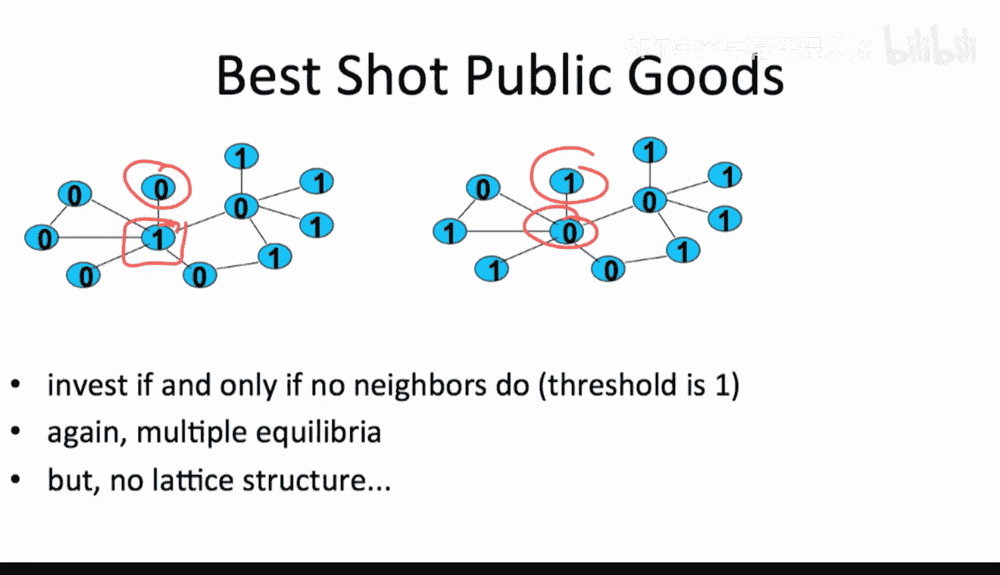

尽管策略替代博弈分析起来更困难，但这两类博弈在现实应用中都非常重要。接下来，我们将继续深入探讨如何理解不同博弈情境下的均衡结构。