#  075：多重均衡 🔄

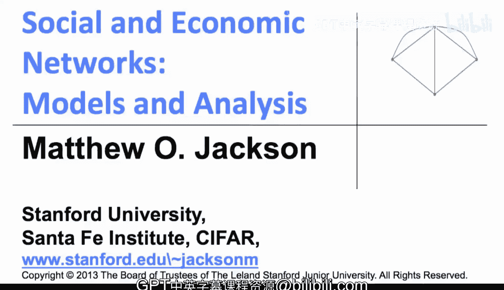

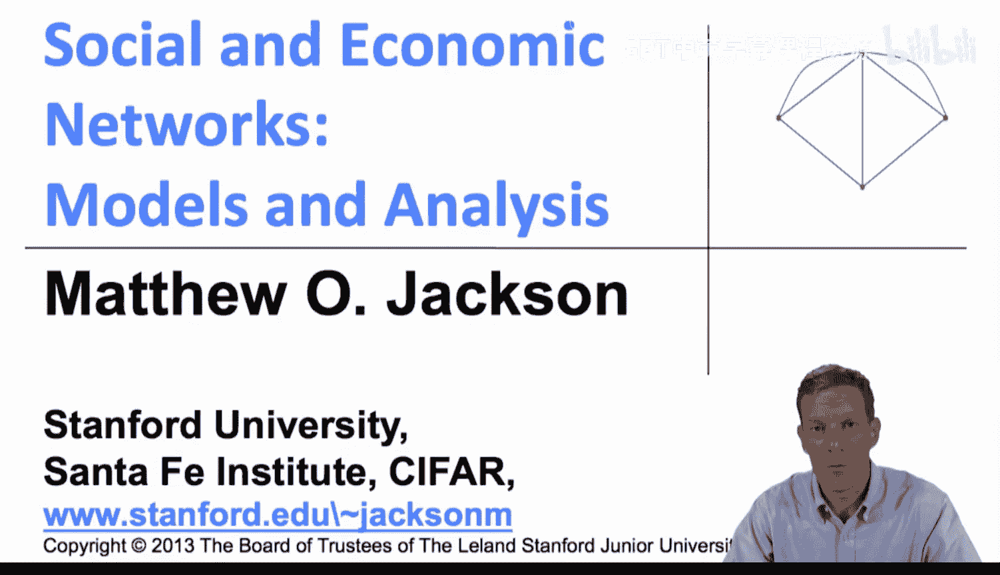

在本节课中，我们将学习网络博弈中多重均衡的概念。我们将探讨在何种网络结构下，即使社会中个体偏好相同，也可能出现不同群体采取不同行动的情况。

上一节我们介绍了网络博弈均衡的基本定义和思想，本节中我们来看看更具体的结构。

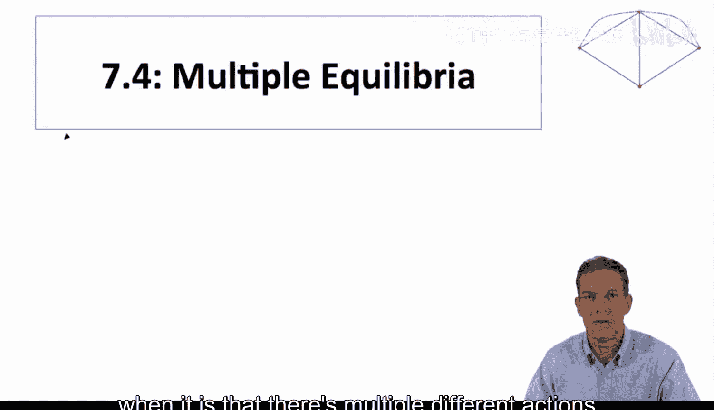

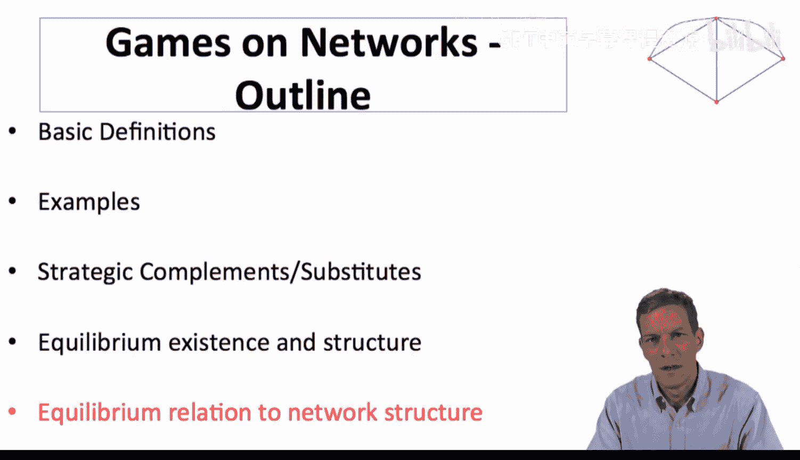

## 协调博弈与阈值模型

我们将分析斯蒂芬·莫里斯论文中的一个简单协调博弈。在这个博弈中，个体只关心其邻居中采取特定行动的比例。具体来说，个体偏好采取行动1，当且仅当其邻居中至少有比例 **Q** 的个体采取行动1。

**公式**：`个体 i 选择行动 1 ⇔ (采取行动1的邻居数 / 总邻居数) ≥ Q`

假设 **Q = 1/2**，这意味着个体希望与大多数朋友的行为保持一致。如果大多数朋友采取行动1，个体也愿意采取行动1；反之则采取行动0。这是一个策略互补的简单博弈。**Q** 也可以是其他值，例如 **2/3**，表示你需要三分之二的邻居采用某项新技术后，你才愿意采用。

这个博弈的背景与统计物理学中的“多数博弈”有关，研究粒子在晶格结构中的相互作用。在网络博弈中，节点关心其邻居的行为并希望与之匹配，**Q** 这个阈值描述了在采取行动1之前，需要多少比例的邻居也采取行动1。

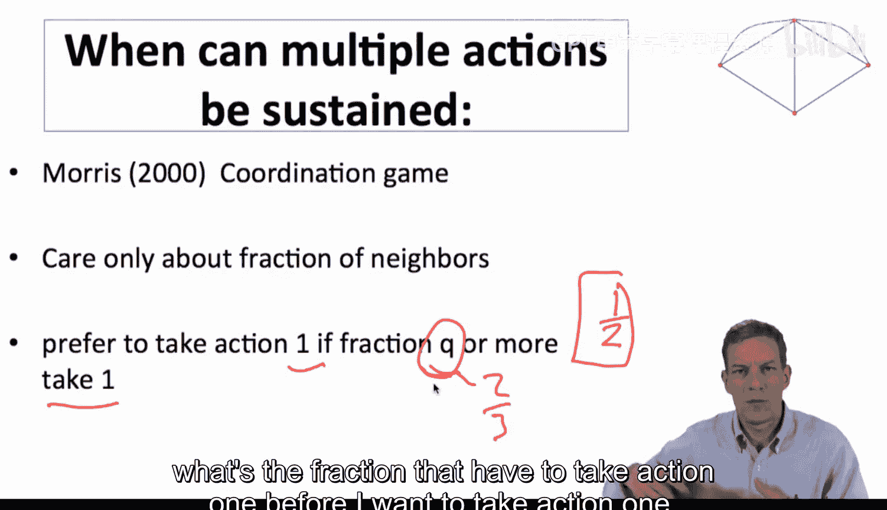

## 均衡的特征

现在，让我们思考这种博弈的均衡形态。我们关注纯策略纳什均衡。

设 **S** 为采取行动1的个体集合。在一个由 **N** 个智能体构成的网络中，**S** 要成为一个均衡，必须满足两个条件：

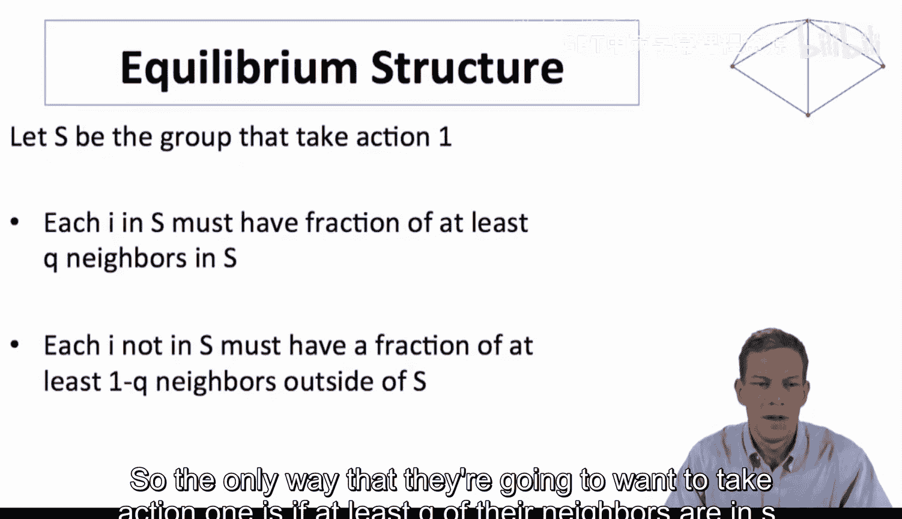

1.  **S** 中的每个个体，其邻居中至少有比例 **Q** 也在 **S** 中。
2.  不在 **S** 中的每个个体（即采取行动0的个体），其邻居中至少有比例 **(1 - Q)** 也不在 **S** 中（即其邻居中在 **S** 内的比例少于 **Q**）。

**公式**：`S 是均衡 ⇔ (∀i∈S, 邻居中在S的比例 ≥ Q) 且 (∀j∉S, 邻居中在S的比例 < Q)`

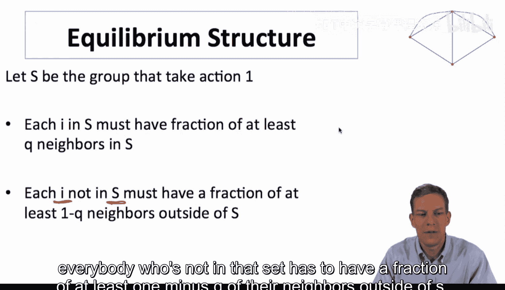

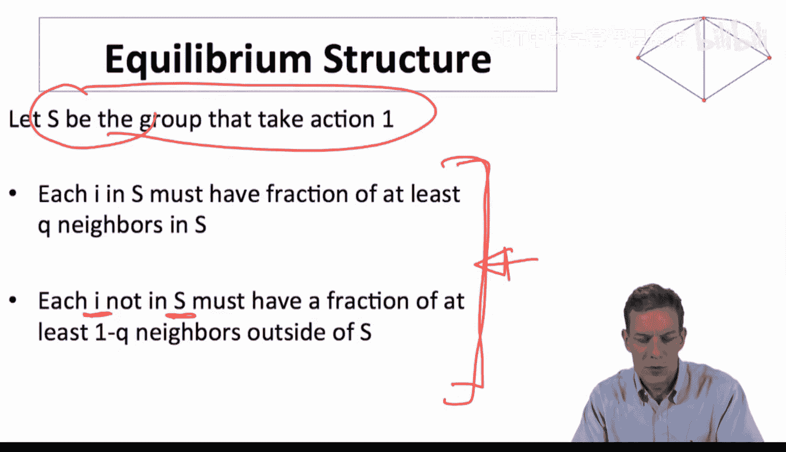

这基本上刻画了该博弈的所有均衡集合。

## 网络凝聚性与多重均衡

接下来介绍一个与网络结构相关的重要定义——**凝聚性**（Cohesiveness）。

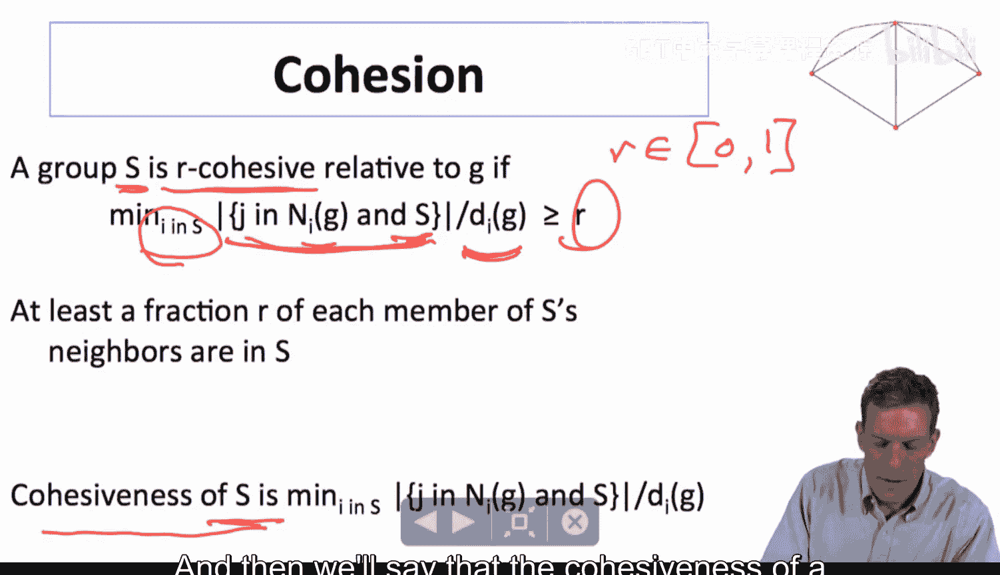

*   对于一个节点集合 **S** 和一个介于0到1之间的数 **R**，如果 **S** 中每个个体，其邻居中至少有比例 **R** 也在 **S** 内，则称集合 **S** 是 **R-凝聚** 的。
*   集合 **S** 的**凝聚度**，是 **S** 中所有个体“邻居在S内比例”的最小值。它也是能满足上述条件的最大 **R** 值。

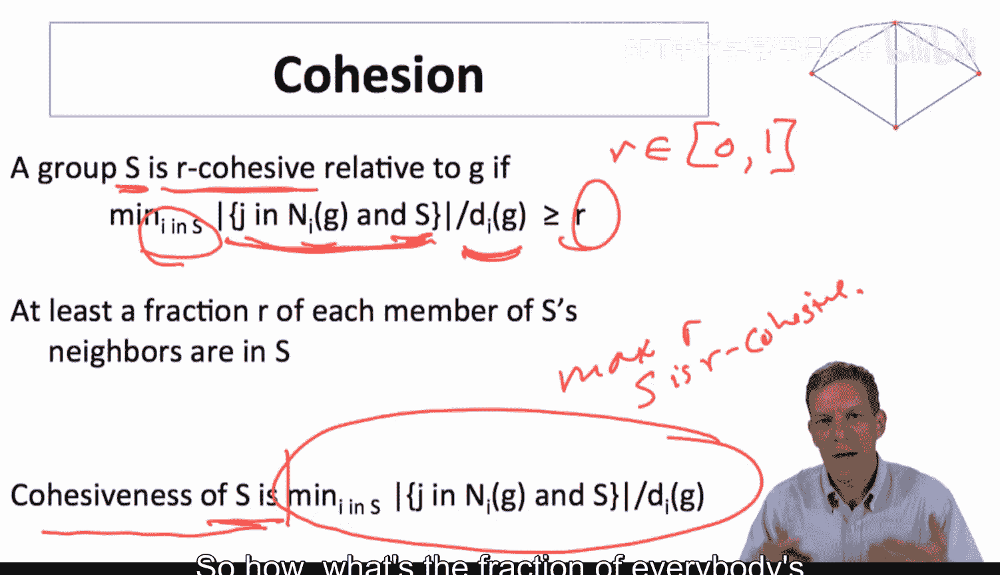

**公式**：`凝聚度(S) = min_{i∈S} (邻居中在S的比例)`

这个概念有助于我们理解多重均衡何时出现。

请看一个网络示例，其中存在两个集合 **S** 和 **S'**。这两个集合都是 **2/3-凝聚** 的。这意味着在这两个集合内部，每个成员都有至少三分之二的邻居同属该集合。如果我们玩一个 **Q=1/2** 的多数博弈，那么完全有可能出现一种均衡：**S** 中的所有成员采取行动1，而 **S'**（或整个网络的其余部分）中的所有成员采取行动0。这是因为每个群体内部都足够“抱团”，使得成员没有动机改变自己的行动。

由此，我们得到关于多重均衡存在的关键命题：

**存在一个纯策略均衡，使得行动0和行动1同时被采用，当且仅当存在一个节点集合 S，满足：**
1.  **S 是至少 Q-凝聚的。**
2.  **S 的补集是至少 (1-Q)-凝聚的。**

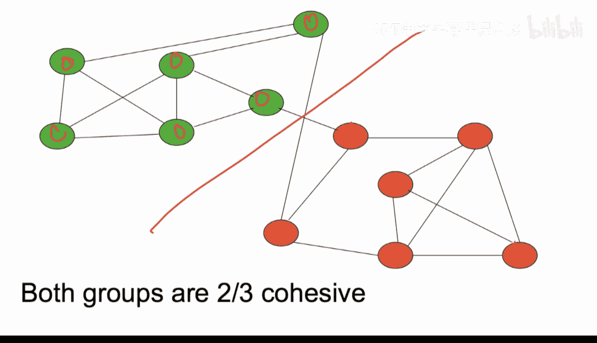

**公式**：`存在混合行动均衡 ⇔ ∃S, 凝聚度(S) ≥ Q 且 凝聚度(网络\S) ≥ 1-Q`

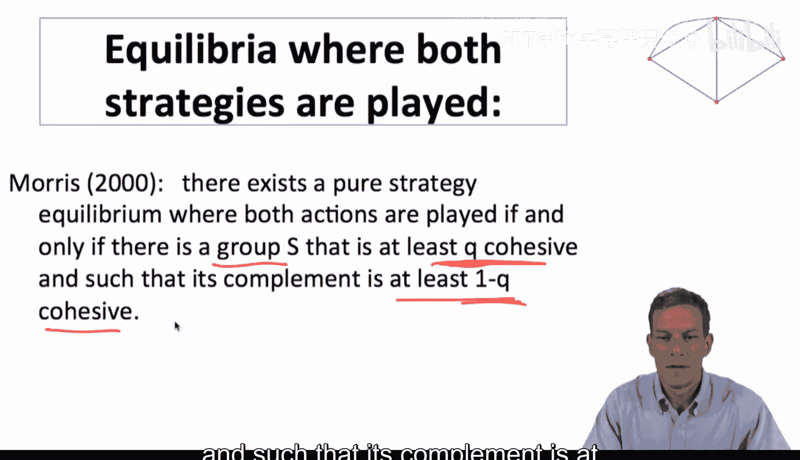

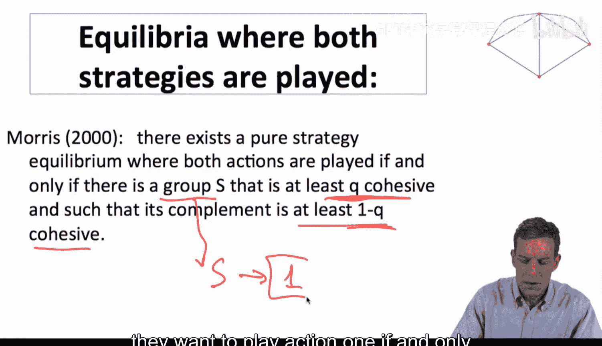

这个命题直接源于博弈的定义和均衡条件。它表明，**网络内部群体的凝聚度**是识别博弈能否维持多重均衡的关键。

## 与同质性的关联及应用

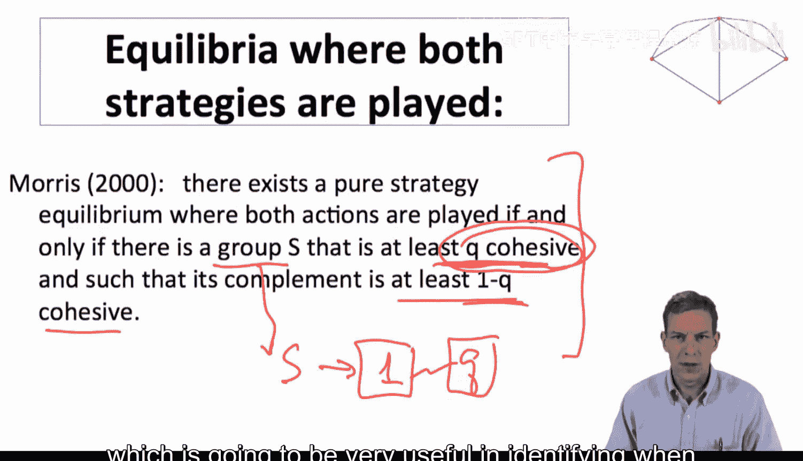

这一定理与**同质性**（Homophily）概念紧密相连。

*   当 **Q = 1/2**（多数匹配）时，只要网络中存在两个群体，它们各自的内部联系多于跨群体联系，就足以在均衡中维持两种不同的行动。
*   当 **Q** 升高时（例如，需要更高比例的邻居采用才愿意跟进），要维持多重均衡，就需要群体间有更强的分割和更高的内部凝聚度，即需要更显著的同质性。

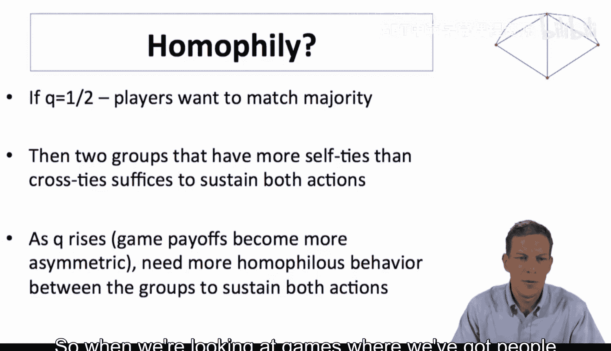

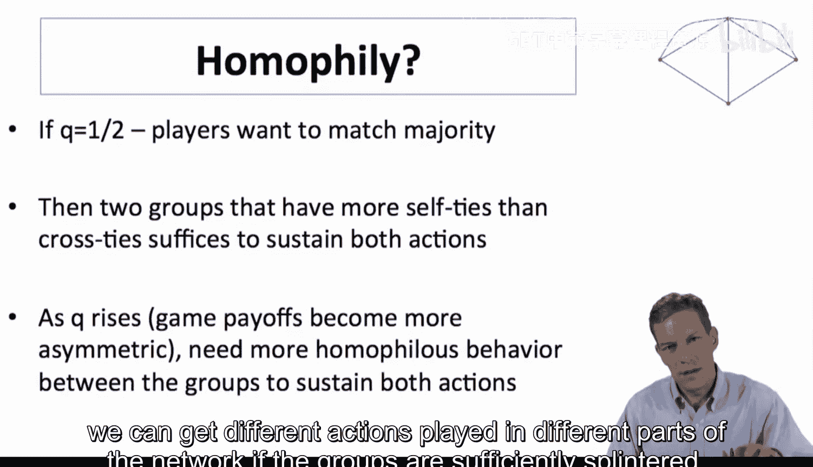

例如，回顾之前健康数据集中的网络，那里在种族维度上存在明显的群体分割。即使人们初始状态相同，但如果他们的交友模式与种族相关，并且他们希望与大多数朋友的行为保持一致，那么最终完全可能在这个单一网络中，由不同群体维持截然不同的行为模式。这正是上述定理所描述的情形。

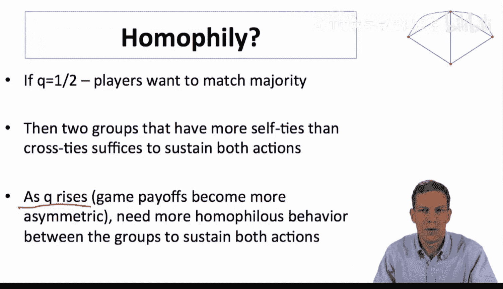

到目前为止，我们分析了策略互补博弈的均衡，发现它具有很好的结构，并且可以与网络结构、同质性等概念联系起来，帮助我们理解多重行动何时能够持续。

## 总结

本节课我们一起学习了网络博弈中多重均衡的分析方法。核心在于理解**协调博弈的阈值模型**，并引入了**网络凝聚性**这一关键概念。我们认识到，当网络中存在足够“抱团”（即内部联系紧密）的群体时，即使个体偏好相同，也可能因为网络结构的分割而同时维持多种不同的行为模式。这为理解现实社会中不同群体间行为差异的持续性提供了理论视角。

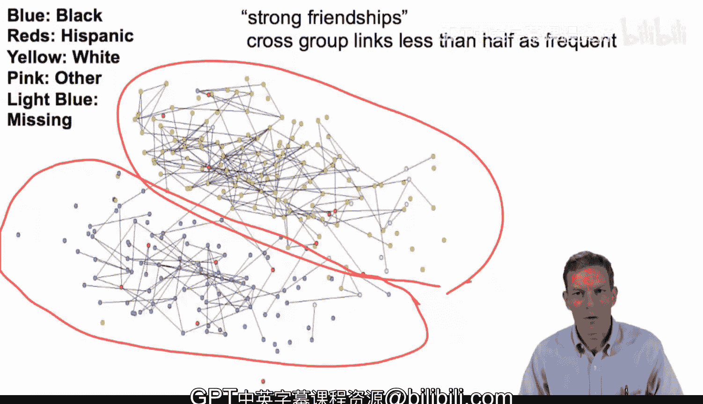

接下来，我们将简要查看一个应用案例，然后开始研究具有更丰富行动空间的博弈模型。