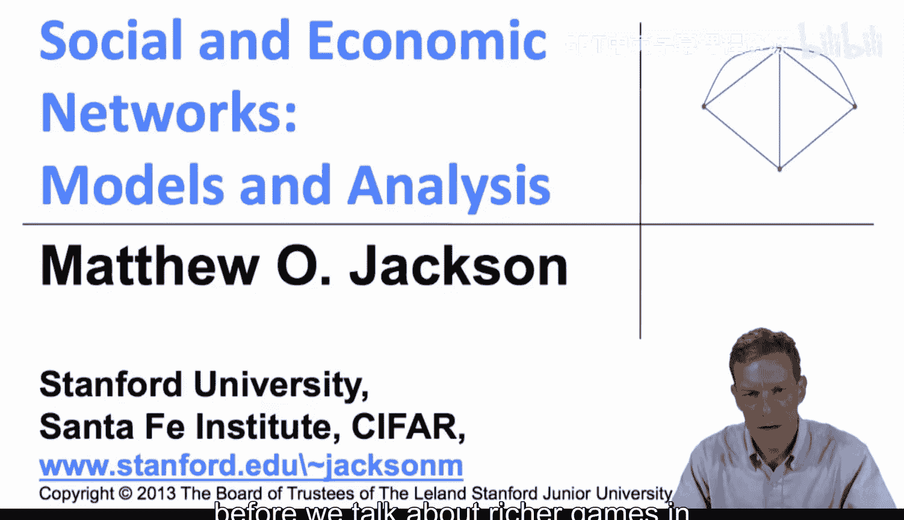
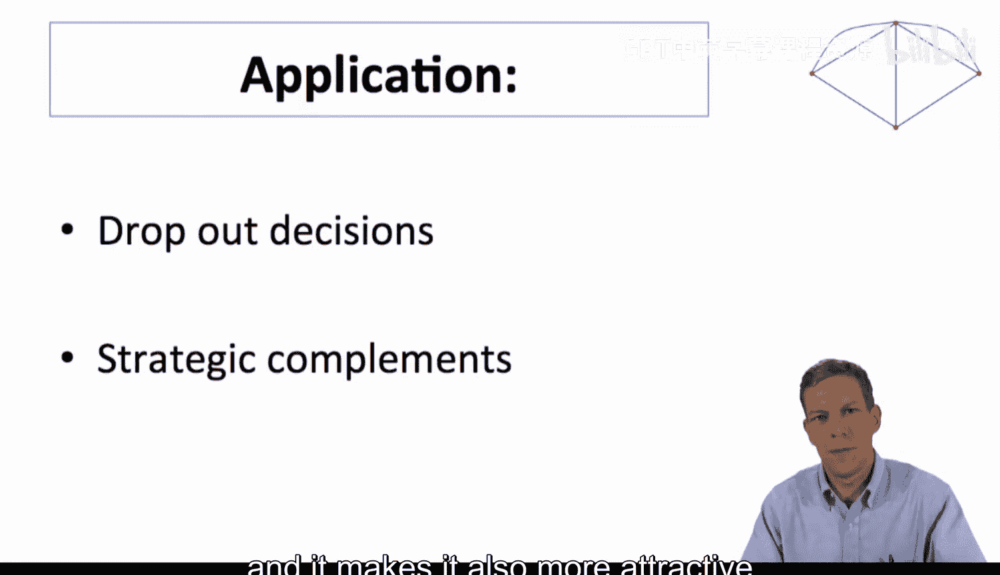
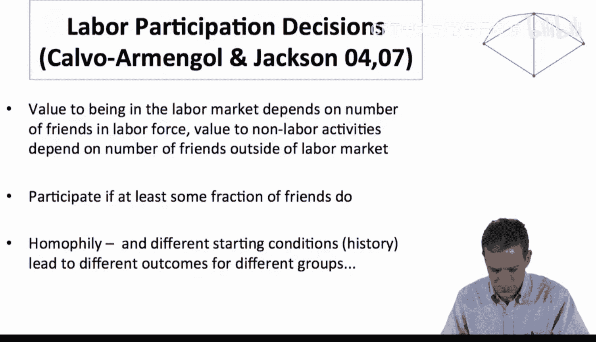
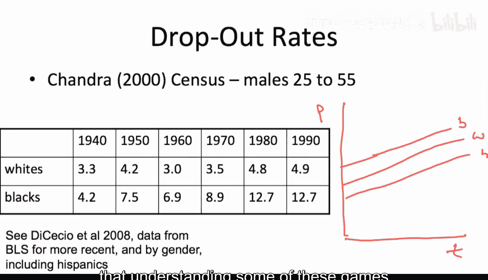
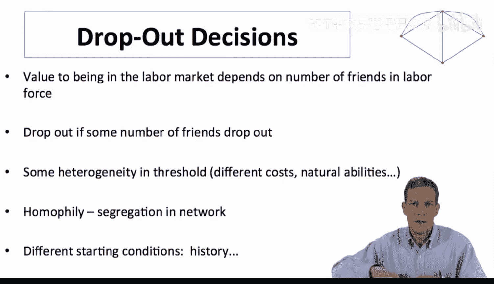
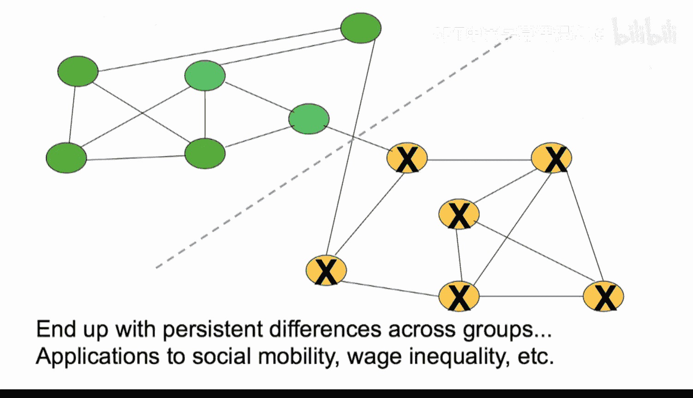
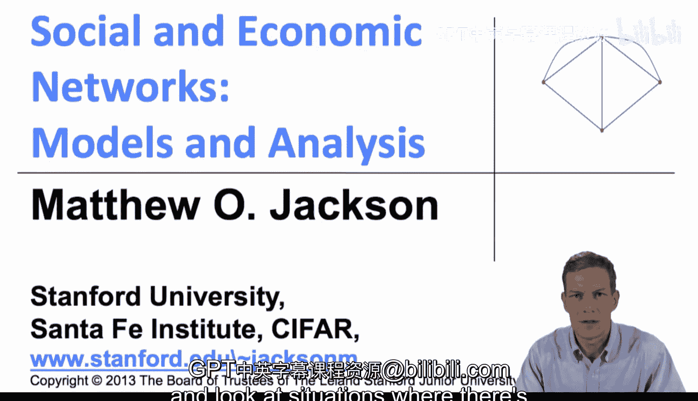
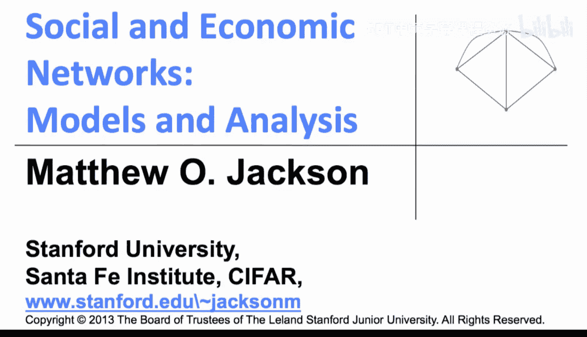

#  076：应用示例 💼

在本节课中，我们将探讨网络博弈的一个具体应用：劳动力市场中的退出决策。我们将看到，如何利用网络博弈模型来理解不同社会群体间长期存在的劳动力参与率差异。

上一节我们介绍了网络上的博弈，特别是具有策略互补性的博弈。本节中，我们来看看一个具体的应用实例。

## 退出决策的背景

退出决策，特指个体决定退出劳动力市场，即不再就业或积极寻找工作。在经济学中，这是一个受到广泛关注的领域。关键在于，这些决策通常是**策略互补**的：我身边退出劳动力市场的朋友越多，我找到工作的难度就越大，这反过来也使我退出劳动力市场变得更具吸引力。

我与托尼·卡尔瓦·阿梅纳尔合著的一些论文研究了网络内部的劳动力参与决策。基本思想是，这些决策最终表现为策略互补。进入劳动力市场的价值取决于我处于劳动力市场中的朋友数量，因为这能让我获得工作信息、更好的自我教育途径等。同时，从事非劳动活动（例如犯罪）的价值也取决于处于劳动力市场外的朋友数量。因此，我们可以将此视为一个网络博弈，其中我参与劳动力市场的意愿取决于一定比例的朋友是否参与。

## 网络同质性与数据观察

在此基础上，我们还需要考虑网络中存在大量**同质性**的事实。在我们观察到的许多网络中，存在强烈的隔离模式。当我们将策略互补性与网络同质性结合起来时，无论出于何种历史原因，只要一个群体初始的参与率高于另一个群体，我们最终就会观察到强烈的模式差异。

以下是关于退出率的一些背景数据。这是钱德拉根据2000年美国人口普查得出的旧数据，观察对象是25至55岁的男性。数据显示了从20世纪40年代到90年代，白人和黑人群体中退出劳动力市场的比例变化。退出劳动力市场意味着他们既未就业，也未积极寻找工作，且非在押或在校人员。

观察数据可以发现，两个群体的退出率都有所上升，但黑人男性的上升幅度要大得多。如果进一步观察，黑人男性的数据上升得更多。根据美国劳工统计局的数据，如果观察男性的劳动力参与率，会发现其随时间推移而下降。具体来说，黑人男性的下降速度最快，白人男性次之，而西班牙裔男性的下降幅度较小。

有趣的是，即使你试图用社会经济背景等一系列相关因素来解释，这种模式依然存在。更特别的是，如果观察女性的数据，其劳动力参与率是随时间上升的，并且模式与男性相反：西班牙裔女性较低，白人女性居中，黑人女性较高。这表明，这不仅仅是社会经济背景的问题，文化互动等其他因素在决定这一现象中也起着重要作用。

## 网络博弈模型的解释

我想强调一个简单的观点：理解这些网络博弈模型可以帮助我们弄清楚为什么不同群体之间会存在长期、持续的差异。这同样是由于**策略互补性**：当你的朋友达到一定退出水平时，你也想退出。同时，个体可能存在异质性，其决策阈值并不完全相同。

将这种异质性与网络的**同质性**和**隔离**结构，以及不同的初始条件相结合。当我们观察时，一个群体一旦开始出现更多退出者，就会倾向于产生更多的退出者。

让我们回到两个表现出同质性的群体。假设我们进行一个“多数博弈”：如果你的邻居中至少有一半退出，那么你也想退出。如果由于历史原因，一个群体的初始退出率高于另一个群体，那么情况就会开始演变。一旦这两个人退出，他们的邻居（因为超过一半的邻居退出）也会想要退出。随着这个过程继续，退出行为会在该群体内扩散。

但有趣的是，当我们回到“内聚性”的概念时，同质性和群体分割意味着，一个群体可能拥有高得多的退出率，而这种退出行为**不会**轻易传染到另一个群体。因此，我们可以开始理解为什么存在这种持续的差异。

## 总结与展望

理解这些网络博弈有助于解释为什么我们会观察到随时间持续存在的差异，以及这些差异如何与网络结构相关联。这是一个非常简单的观点，但它可以展示这些模型在推进我们对劳动力参与、福利、教育、健康决策等一系列重要决策动态的理解方面，是如何发挥作用的。技术采纳在一个群体和另一个群体中可能不同，这种情况如何发生？又如何持续？网络博弈模型在回答这类问题上将非常有用。

目前在这方面已有一些研究，但未来还有更多工作可以做。

本节课中，我们一起学习了网络博弈在解释劳动力市场退出决策差异中的应用。我们看到了**策略互补性**和网络**同质性**如何共同作用，导致群体间出现长期、稳定的不同均衡结果。

---

上一节我们完成了对只有两种可能行动的网络博弈的基本理解。接下来，我们将开始丰富这些模型，研究存在多种行动而不仅仅是二元选择的情况。