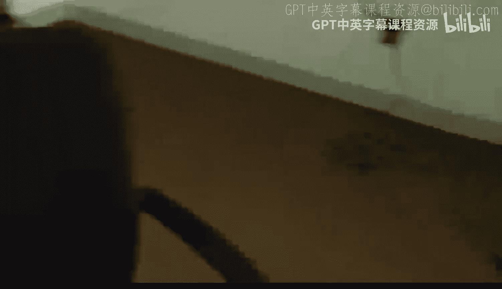
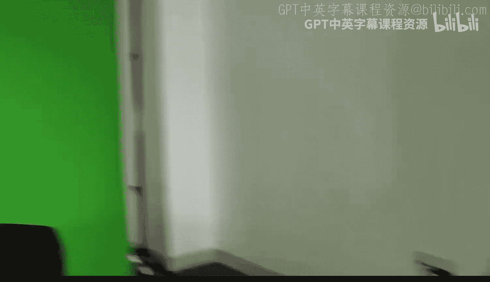
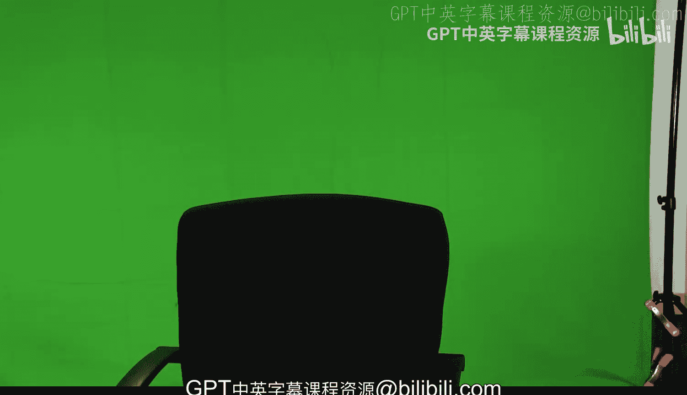

#  080：第七周课程总结 🎯

在本节课中，我们将对第七周关于“网络上的博弈”的核心内容进行总结。我们将回顾网络博弈的基本概念、不同类型博弈的结构特点、网络结构变化对行为的影响，以及一些重要的应用模型。

---

## 课程内容回顾

上一节我们介绍了网络博弈的基本思想，即个体（网络节点）的决策会与其邻居的决策相互影响。本节中，我们来看看本周讨论的几个核心主题。

### 博弈的两种基本结构

我们主要研究了两种基本博弈结构，它们取决于个体行为之间的互动关系。

以下是两种核心的博弈类型：

1.  **战略互补**
    *   **含义**：当其他人采取某个行动时，我采取该行动的意愿也会增强。
    *   **例子**：兼容的技术、共同的语言。其公式可表示为：如果邻居节点j的行动为 `a_j`，则我的收益 `u_i` 满足 `∂²u_i / (∂a_i ∂a_j) > 0`。
    *   **均衡特点**：这类博弈通常具有清晰的均衡结构，例如可能出现所有人都采取行动或少数人采取行动的情况，呈现出良好的格结构。

2.  **战略替代**
    *   **含义**：当其他人采取某个行动时，我采取该行动的意愿会减弱。
    *   **例子**：公共物品的提供。如果别人做了，我就不必做。其公式可表示为：`∂²u_i / (∂a_i ∂a_j) < 0`。
    *   **均衡特点**：均衡结构更复杂，可能出现一些人行动而另一些人不行动的交替模式，系统可能显得混沌，微小的变化可能导致难以预测的结果。

### 网络结构与比较静态分析

我们简要探讨了网络结构变化如何影响行为，这被称为比较静态分析。

以下是网络密度变化的影响：

*   **互补性情境**：增加网络连接密度（使我与更多人相连），会增强我采取互补性行动（如学习一门语言）的动机。因为我的收益可能与邻居行动的总和相关。
*   **一般性结论**：通过改变网络连接，可以预测行为将如何随之变化。

### 多重行为与网络同质性

我们分析了不同行为模式如何在网络中并存。

以下是行为分化的条件：

*   **核心条件**：网络中的同质性、内聚性和隔离模式。
*   **影响**：这些结构决定了不同的行动能否在网络的不同部分持续存在。这与不同群体内部的互动紧密程度有关。

### 连续行动博弈与线性二次模型

我们研究了一类特殊的连续行动博弈模型，它提供了简洁的分析框架。

以下是该模型的核心：

*   **模型名称**：线性二次博弈。
*   **解的形式**：该模型可以得到一个封闭解，个体的行为强度可以表示为几个参数的函数。具体地，均衡行动向量 `a*` 可以表示为：`a* = (I - βG)⁻¹ * θ`，其中 `I` 是单位矩阵，`β` 是策略互动强度，`G` 是邻接矩阵，`θ` 是个人固有偏好向量。
*   **行为预测**：个人的均衡行为与其在网络中的位置紧密相关，可以通过特征向量中心性等指标来度量。这使得模型非常易于处理，并能产生清晰、可检验的预测。
*   **应用**：这类模型正越来越多地用于理解同侪效应、行为扩散以及人们相互关注时的社会学习过程。它们可以与扩散模型、学习模型等结合，产生丰富的行为预测。

---

## 课程总结与尾声

本节课中，我们一起学习了网络博弈的核心框架。我们区分了战略互补与战略替代，探讨了网络结构如何影响均衡结果和行为扩散，并介绍了一个强大而简洁的线性二次模型。这些工具为我们分析社会和经济网络中复杂的策略互动提供了基础。

接下来，我们将对整门课程进行一个快速的总结。此外，许多观众对我们的录制环境感到好奇，下面我将简单展示一下我们录制这些视频的工作室。

（以下是工作室环境的图片描述，为保持教程焦点，此处仅作说明性保留）
*   图1：录制使用的办公桌。
*   图2：用于书写的屏幕和触控笔。
*   图3：摄像机、提词器和灯光设置。
*   图4：用于抠像的绿幕。
*   图5-8：斯坦福校园建筑地下室中这个简单而实用的录制空间全景。

这就是我们录制课程的地方。希望这个简短的幕后花絮让大家感到有趣。保重，我们下次再见！