#  081：课程总结 🎓

在本节课中，我们将对《社会与经济网络：建模与分析》这门课程进行全面的回顾与总结。我们将梳理在“博弈与网络”这一最后主题中学到的核心概念，并探讨网络分析领域的未来研究方向。

---

上一节我们探讨了网络中的博弈行为，本节中我们来看看整个课程的总结与展望。

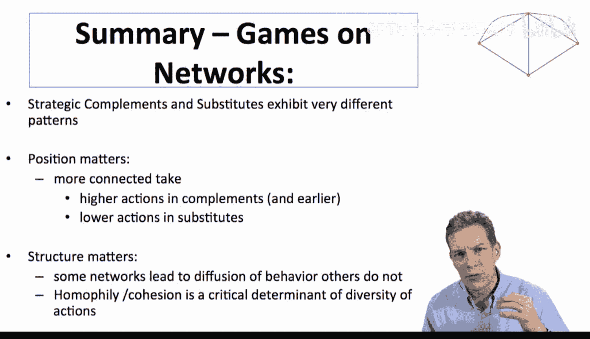

我们学到的一个有用区分在于行为中存在的同伴效应类型。理解个体对他人施加何种影响至关重要。**战略互补**与**战略替代**具有不同的属性。理解这一点对于理解网络结构对行为的影响非常重要。

**位置至关重要**。在互补性情境中，连接更紧密的个体倾向于采取更高的行动；在替代性情境中，他们则倾向于采取更低的行动。在某些设定下，我们可以具体阐述位置如何产生影响。

**网络结构至关重要**。某些网络结构比其他结构更能促进行为的扩散或更广泛地传播行为。

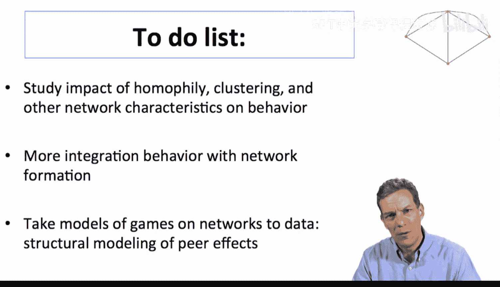

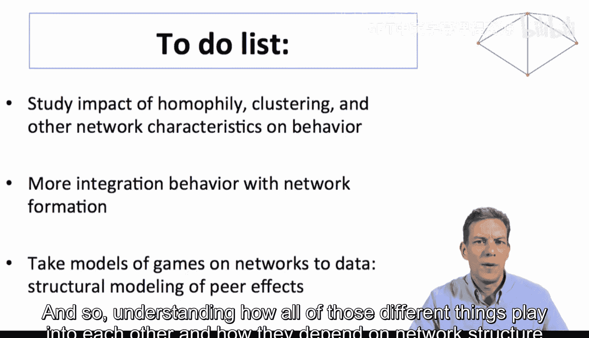

**同质性与内聚性**是网络中能否维持行动多样性的关键决定因素，它们影响着网络不同部分可能发生的行动类型。目前，关于这一主题的文献正在不断增长。

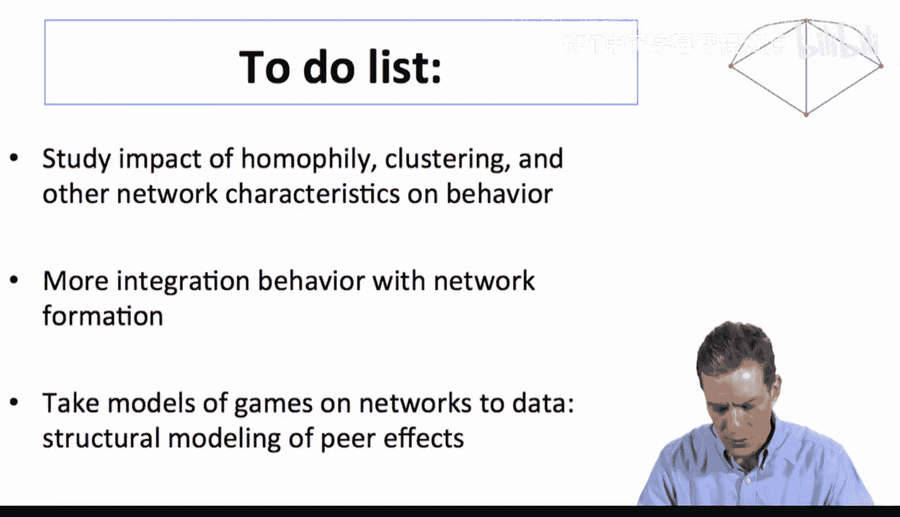

在理解**网络结构与行为如何共同演化**、它们如何相互关联以及这如何取决于存在的互动类型方面，还有很多工作要做。这是一个非常有趣的领域，具有许多应用，并且最终是我们在此可以提出的最重要的问题之一，因为网络的真正后果体现在个体的行为以及由此产生的网络福利上。

---

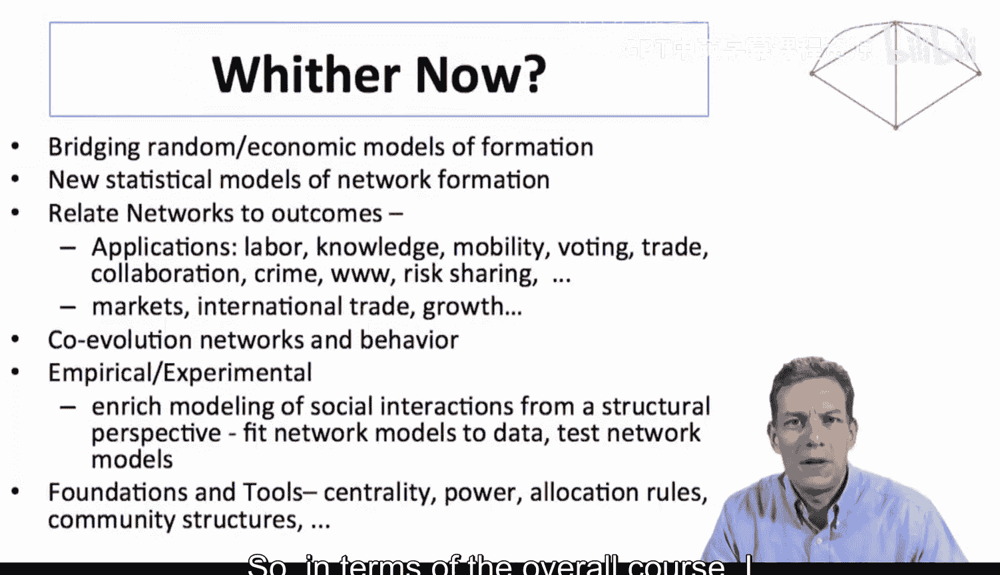

以下是关于未来研究的待办事项清单：

*   **研究同质性、聚类及其他网络特征**：探讨这些特征如何影响行为。
*   **更深入地整合行为与网络形成模型**：我们在“互惠交换”模型中瞥见了一角，但在许多其他场景中也可以开始进行此类研究，例如交易网络等。
*   **将网络博弈模型应用于数据**：以真正理解我们是否观察到了预测的结构和行为，以及网络结构对行为的影响。
*   **理解网络中多重关系的相互作用**：现实中，网络关系往往是多维度的（如同事、合著者、信息交换、互惠等）。理解这些不同类型的关系如何相互影响、如何依赖于网络结构以及如何决定网络结构，仍然是一个广阔的开放领域。

---

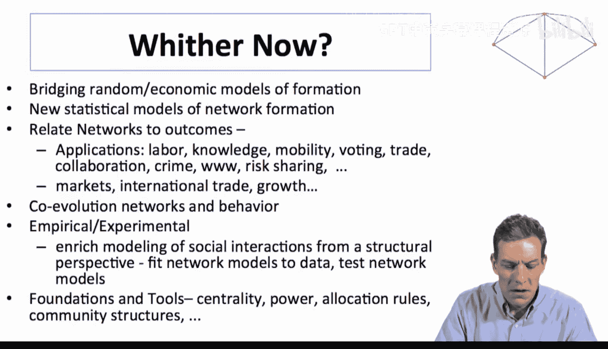

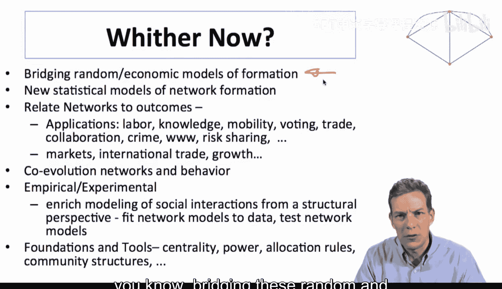

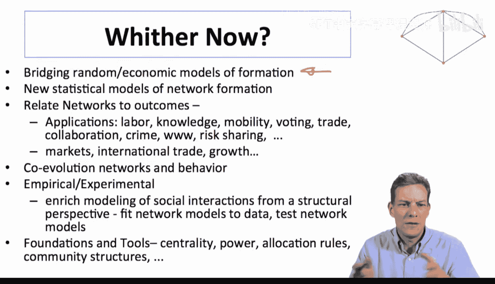

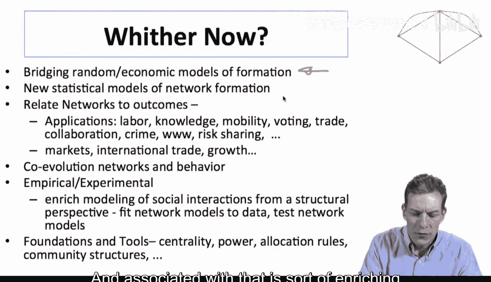

就整个课程而言，其目的是让大家接触一系列思考网络的不同方式、不同的经验事实以及不同类型的分析和模型。

我们借鉴了随机图理论、社会学、经济学的内容，考察了统计模型以及来自统计物理学的一些模型。课程的目标不是让大家成为任何特定模型的专家，而是让大家对整体情况、正在使用的模型类型有一个总体的认识。我们深入探讨了其中一些模型，这里的理念是为您提供一个工具包，让您了解现有的工具、存在的问题以及这些不同工具如何被用来回答问题。

---

网络分析如今如此令人兴奋，部分原因在于存在大量开放性问题。这是一个相当开放的领域，无论是在网络结构方面，还是在其对社会的影响方面，都还有很多需要学习。同时，由于其跨学科性质，这也是一个非常有趣的领域。相关问题不仅在一个领域涌现，而是在各处涌现，因为网络是我们生活中如此重要的一部分。我们看到许多不同的文献都在关注这一主题，这些学科之间的互动也很有趣。

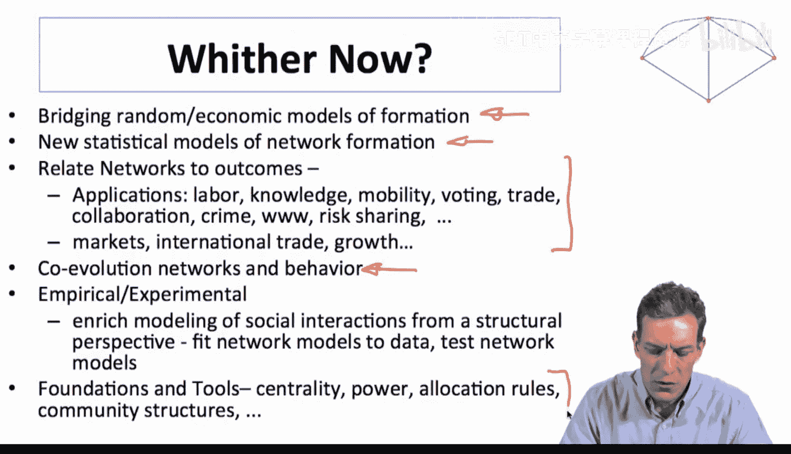

以下是未来需要推进的工作方向：

*   **桥接随机模型与更具策略性的模型**：策略性模型具有福利和行为含义，而随机模型允许您拟合数据，因此我们需要结合这两者。
*   **丰富模型库**：建立能够进行仔细统计分析并回答“这是随机发生的还是我们在特定情境下的重要发现”这类问题的模型。
*   **将网络与结果联系起来**：这方面还有很多工作要做。随着互联网数据集等数据的可用性在过去十年中爆炸式增长，可分析的数据量要大得多。其应用非常广泛且重要，例如：
    *   劳动力网络（通过谁找到工作）
    *   基本沟通与知识传播
    *   社会流动性
    *   投票行为
    *   贸易伙伴网络
    *   合作网络
    *   犯罪网络
    *   万维网的演化
    *   风险分担
    *   理解市场
    *   国际贸易
    *   发展中国家的增长
*   **理解网络形成与行为的共同演化**：这至关重要。
*   **实证与实验研究**：建立可以应用于数据的结构模型非常重要。实验室实验和实地实验也是重要的增长领域，可以在其中仔细控制网络中发生的情况，然后观察对各种行为的影响。
*   **进行更多基础性工作**：随着我们开发出越来越丰富的工具和模型，很多是为了特定应用或特定问题而开发的。我们需要更系统地说清楚：在众多中心性度量中，在何种情境下应使用哪一种？在检测社区结构时，哪种算法是正确的？我们如何理解不同方法在何种情况下应该被使用？需要更多基础工作来理解不同中心性度量的属性、它们如何响应网络变化、它们测量的是什么。

---

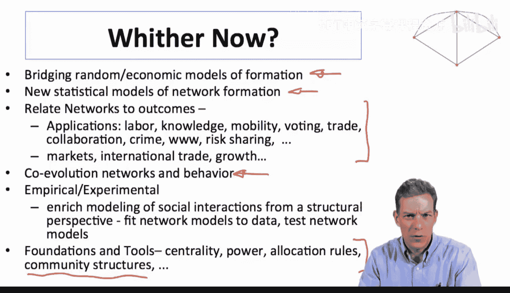

社会与经济网络分析领域存在一系列非常丰富的研究课题。本课程旨在为您提供一个介绍和概述，让您了解一些建模和技术，知晓该领域文献的工作方式以及一些已被解答的主要问题。

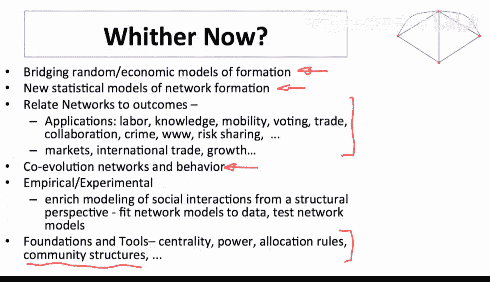

这是一个绝佳的研究领域。很高兴能与大家交流，希望大家喜欢这门课程，并祝愿大家在未来对社会与经济网络的分析中一切顺利。