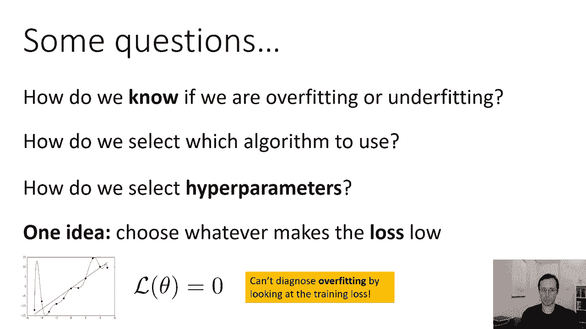
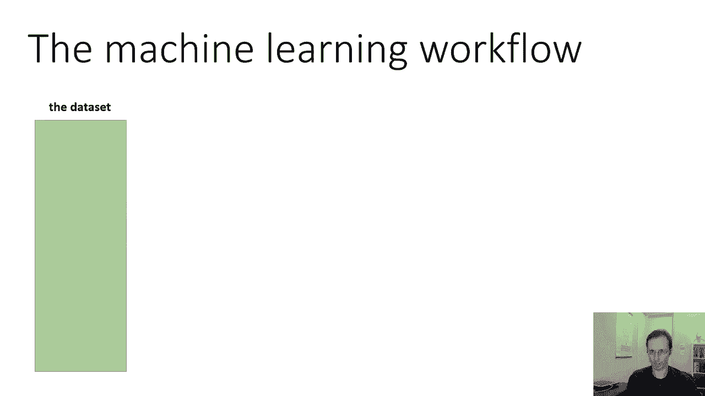
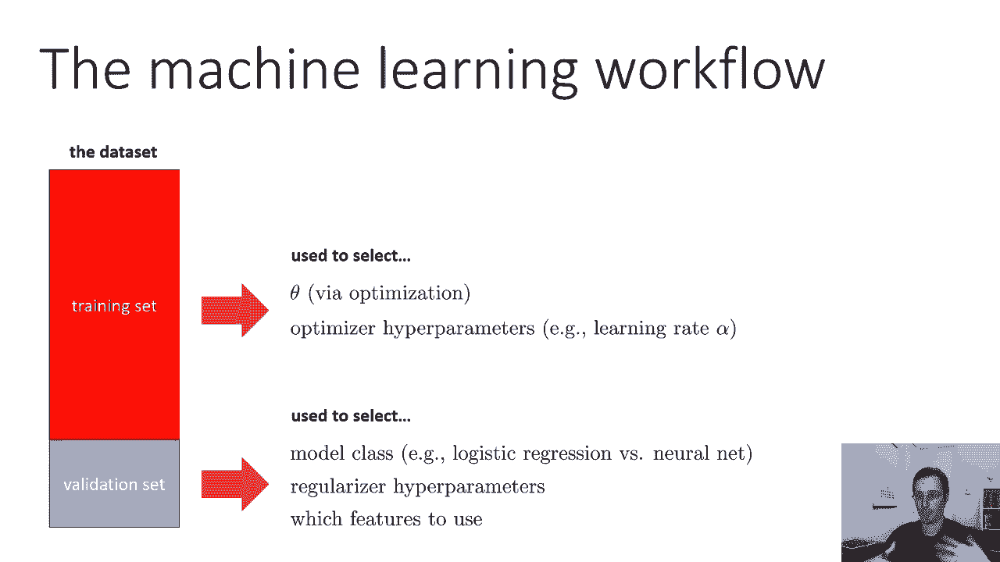
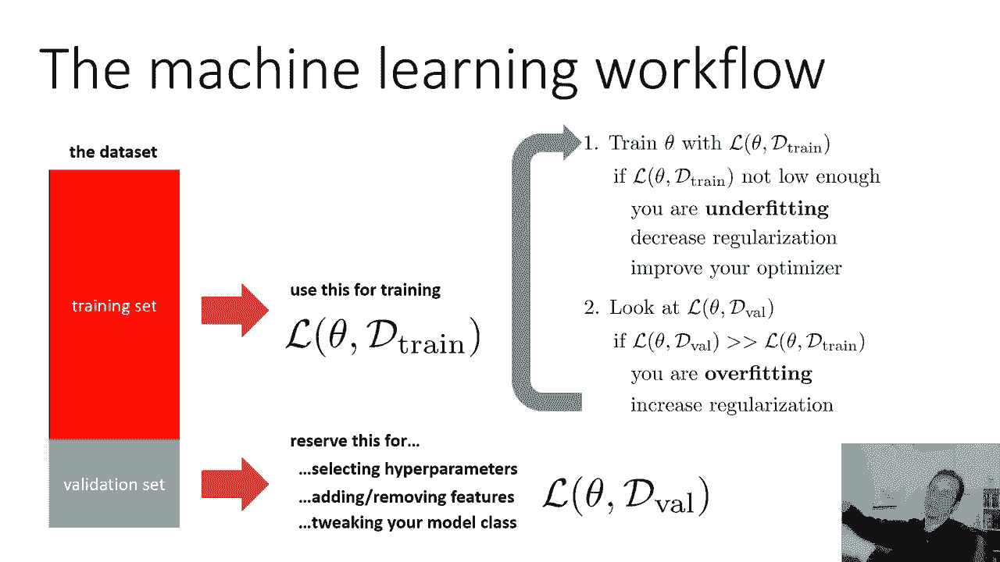
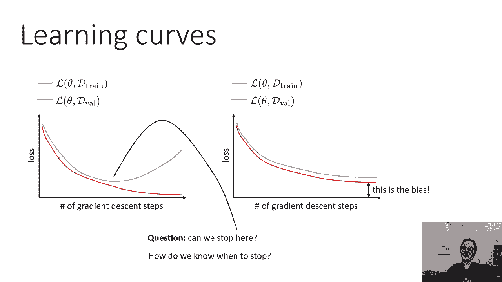
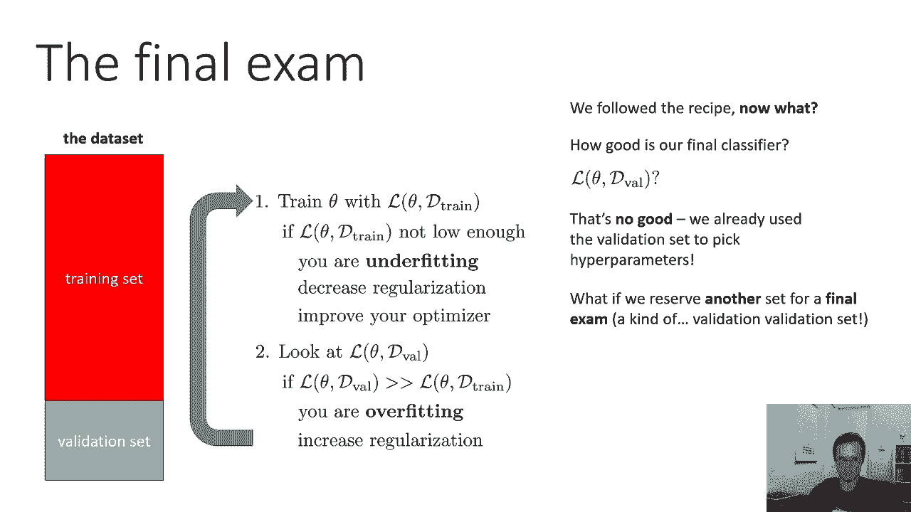
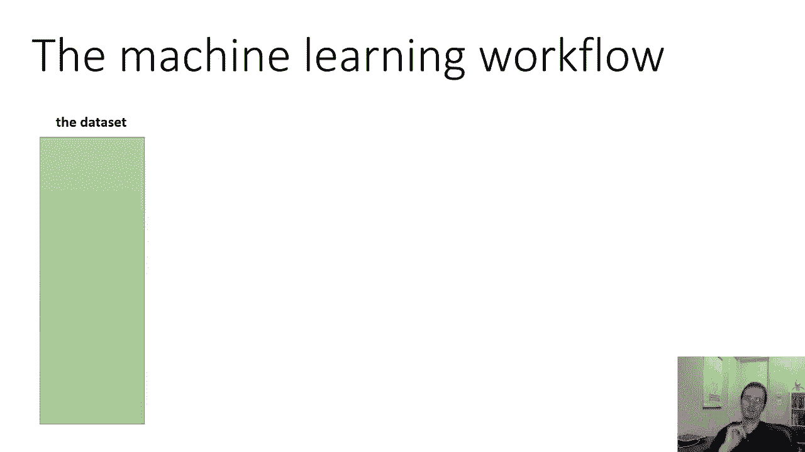
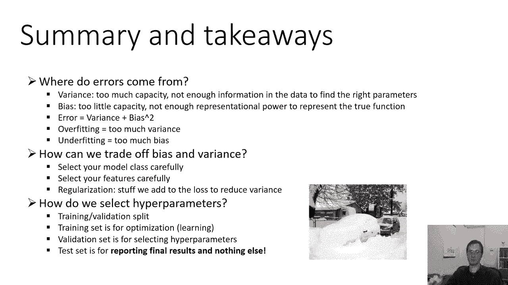

# P10：CS 182 Lecture 3- Part 3- Error Analysis - 爱可可-爱生活 - BV1PK4y1U751

所以让我们来谈谈如何选择那些超参数，我们可能会问一些问题，实际上呃，利用我们在这堂课中所学到的东西，我们如何知道我们是过合适还是过合适，我们如何选择使用哪种算法，我们如何选择超参数。

一个想法是根据损失较低的情况做出这些选择，但这不是个好主意，因为像超参数这样的东西，选择使用哪些功能，使用哪种算法的选择，所有这些选择都必须权衡偏差和方差，但光是看着训练的损失。

并没有告诉我们我们是否遭受了偏见或变异，嗯好吧，它告诉我们，我们正遭受偏见，但它并没有告诉我们太多关于方差的信息，因为我们的训练损失可能是零，但我们可能装得太重了，所以训练损失不足以计算方差是多少。

我们不能通过。

只是看着训练的损失，所以我们需要一个更好的工作流程，所以机器学习的工作流程是这样的，你拿着你的数据集，数据集可能相当大。

然而，然后你会把它分成一个训练集，我们称之为验证集，通常，训练集可能是，你知道的，80%到90%的数据集，验证集将是剩下的一点，如果您想知道为什么训练集比验证集大，再考虑一下，让我们说，完成幻灯片。

如果不清楚，也许会问一个问题，所以训练集，顾名思义，是你要用来训练的，我要用lθ逗号，d训练在这里表示训练损失，所以在我称之为Lθ之前，但现在我要明确地说，这取决于d火车。

所以我实际上会写为l theta逗号d train，和以前一样，我只是用符号让它更清楚，这取决于训练集，然后验证集是保留的，你不会用它来训练的，或者为选择超参数而保留它，添加或删除功能，调整模型类。

或者做出设计方法所需的任何其他选择，我将在验证集上调用损失，lθ逗号d val，所以Lθ逗号d val可以让我们诊断，过拟合和欠拟合，为什么好，因为过度拟合的特点是你的经验风险很低，但你真正的风险很高。

lθ逗号d训练是你的经验风险，lθ逗号d val使用未用于训练的数据，这意味着它是对真实风险的无偏估计，所以通过比较火车和火车，你可以确定你是过合适还是过合适，因此。

您通常使用的机器学习工作流将看起来像这列火车，你的参数在lθ逗号d列上，lθ逗号d列车不够低，如果，基本上如果你对训练失败不满意，你得到了，那就意味着你在试衣，所以如果你在训练你的猫对狗分类器。

在训练集上，你的错误是，比如说百分之三点五，三五是一个很糟糕的训练错误，就像你随便猜猫狗，在二进制分类问题中，你得到50%的误差，也许你想要5%到10%的误差，所以百分之三点五你不满意，你在试衣。

在拟合下改变一些东西来减少，你怎么做才能减少不合身，想想这个，你可以减少正规化，更少的正规化意味着更好的匹配，您可以改进优化器，您可以添加更多功能，添加更多参数，用一个更大更好的模型。

如果你做了所有的训练损失，你的火车足够低，你对此很满意，然后当你看Lθd val的时候，要注意的一件事是lθ，d'val比l'theta d'train大得多，所以也许你的猫狗分类器有1%的训练误差。

但是验证错误是20%，这可能意味着你穿得太合适了，如果你穿得太合适了，你可以增加正规化的数量，或者做其他以某种方式降低模型容量的事情，你也可以出去获取更多的数据，一旦你做到了，你可以重复这个过程。

现在我们在超参数之前讨论了超参数，井超参数会影响正则化，也会影响其他事情，所以训练集用于选择，用于选择，它是用来选择θ的，但那是自动完成的，也就是训练你的优化算法会为你选择θ，这就是机器学习算法的作用。

它还可以用来选择影响优化的超参数，因此它不应用于为正则化选择超参数，但它可以用来选择影响优化的超参数，比如学习速率alpha，这类参数，他们的目的是最大限度地减少你的训练损失，他们不是想减少过度装修。

他们只是想尽量减少训练损失，像学习率这样的事情，所以你可以用那些，您可以使用您的训练集选择那些，因为你只是想把训练损失降到最低，验证集可用于选择模型类，比如你用的是逻辑回归吗，或者神经网络。

它是一个十层还是二十层的神经网络，或者一百六十层，它可以用来选择哪些功能，用这些东西，所以基本上，验证集将用于选择那些影响过拟合的东西，他们将被选中，以避免现在在实践中过度好。

所以我有这个，这个工作流程让它看起来非常有舞台智慧，就像你在训练集上训练你的模特一样，你为了一堆就搞砸了，然后查看验证集。

但实际上我们并不是这样做的，我们做一些更交织的事情，我们看学习曲线，在这门课上，你会经常看到学习曲线，所以学习曲线是一个图，其中横轴是，梯度步数或一般优化器步数，我们经常使用梯度下降或它的一些变体。

但是x轴表示某种优化过程，不管你用什么优化算法，它基本上是该算法之前的迭代次数，垂直轴是损失，我们经常看到的是训练的损失，以及在同一轴上绘制的验证损失，或者可能在并排的两个独立的轴线上。

所以让我向你展示一下训练失败和验证失败可能是什么样子，在优化过程中，所以最初训练损失和验证损失都很高，为什么它们最初很高，因为你没有训练好任何东西，最初你只是有一些任意的随机θ，他们会损失惨重。

它们一开始会很快下降，通常训练损失会比验证损失低一点，验证损失较低是很不寻常的，因为你实际上是在优化训练损失，验证损失有点跟上，它有点跟着走，所以也许你会看到这样的东西，然后你看对了，好的。

这里发生了什么是不合适或过度合适，这个怎么样，所以这是两个潜在的学习曲线，你可能会得到，可能用于正则化器和超参数的两种不同设置，也许你在左边有一个很低的lambda，右边有一个很高的lambda。

所以左边的曲线是刻板的过拟合，最初，两个损失都将下降，这几乎总是会发生的，但后来，验证损失实际上开始上升，因为训练损失进一步下降，那里发生的事情是，你所学的功能越来越适合你，这些训练点。

以偏离其他地方的真实功能为代价，当你过度适应时，你会经常看到，一段时间后，验证损失实际上开始上升，在右边，我们有一个典型的拟合不足的例子，验证损失和培训损失非常相似，但它们不会像我们希望的那样低。

最后的差距是偏见，基本上，差距的大小是算法中的偏差，所以你在这里做什么的教科书答案是好的，如果你看到左边的东西，然后增加正规化，如果你看到右边的东西，然后减少正规化，但是看着这些曲线。

你们中的一些人可能也在想，我们能不能停止优化器，就在验证错误最小化的点上，忘记正规化，就像你有曲线一样，您可以看到验证，或者在验证错误较低时停止，这是个好主意吗，我们应该这么做吗，花点时间想想，告诉我。

如果你觉得这是个好主意，如果这是现场直播，你可以把它打在聊天里面，如果你在网上看，也许我在你的脑海中思考答案，这是个好主意吗，这不是个坏主意，你完全可以这么做，事实上。

我的下一个问题是你怎么知道什么时候该停下来，所以说，假设你在优化和优化，和优化，您希望在验证错误上升之前达到最佳位置，1。你怎么知道该停，嗯，其实很简单，您得到了验证错误，你有验证损失。

只需寻找验证定律何时开始上升，如果它在过去一直在上升，你知道吗，二十次迭代，往回走二十步，把你所有的东西都拿回来，然后在深度学习中，这叫早停，这实际上是一种合法的方式来减轻，我的下一个问题是。

这是否减轻了一切，这是否否定了正规化的必要性，嗯，答案是否定的，不是因为，即使你能在最佳位置停止优化器，验证错误可能永远不会变得像它可能的那样低，如果你这么早就使用了适当的正规化。

停止是对抗过度拟合的一种方法，但这并不能解决你所有的问题。

您仍然需要工具包中的其他工具，好的，我们要讨论的最后一个概念，这是一个非常重要的，是期末考试吗，我不是说，在这个班上，这个班其实没有期末考试，但是你的模特有期末考试，假设你遵循了这个食谱。

你做了我在幻灯片上描述的一切，你就完蛋了，你没有下装，你的损失都是好的，你很快乐，现在你的老板来找你说什么，嗯，这件事你已经忙了一个月了，你的模特有多好，你怎么跟他们说。

你可以告诉他们验证损失是什么这是个好主意，考虑一下，告诉我你觉得这是不是个好主意，也许你可以把它放在聊天中，这样不好，我们已经使用了验证集，我们用它来选择我们的超参数，因此。

我们不能再依赖验证损失是无偏见的了，在某种意义上，我们的训练损失不能用来选择我们的超参数，因为我们的训练损失被用来训练Theta，用同样的方式，我们的验证损失不能真正用于报告最终性能。

因为我们的验证损失在某种意义上被用来训练我们的超参数，通常这是一个手工过程，不是自动的，但还是，我们真的不能用验证损失作为代表，我们最终误差的量化，因为我们已经用它做了一些事情，它不再是无偏见的了。

它在统计上与我们的模型无关，因为它们是通过超参数耦合的，(a)使用确认损失选定的索赔，如果我们再做一次同样的事情呢，我们保留了验证集，这样我们就可以选择超参数，使用没有被训练污染的东西。

如果我们为期末考试保留另一片数据集呢，作为一个验证验证集。

我们完全可以这样做而不是把我们的数据集分成两部分。

我们把它分成三部分，一套训练设备，验证集和测试集，这里的测试集以白色显示，为什么是白色的，嗯，洁白而质朴，像新鲜的雪，它还没有被污染，您的验证集和培训集，它们就像肮脏的雪，你的优化器已经碾过了许多。

很多次，他们被污染了，他们是，他们不再纯洁，它们不再新鲜了，您的测试集需要是纯的，它需要还没有被用来做任何事情，这很重要，因为如果它被使用了，如果它在某种程度上影响了你对型号的选择，那么它就不再可用了。

作为对你的模型有多好的公正估计，我向你道歉，你们中的一些人，你知道吗，来自加利福尼亚，也许你对雪并不熟悉，但是是的，一旦你经常在雪地上开车，它变得非常讨厌，这对什么都没有好处，不适合堆雪人或打雪仗。

好的，因此，您的训练集用于通过优化选择θ，它用于选择优化我们的超参数，如您的学习速度，验证集用于选择模型类，正则化超参数，哪些特性可以使用这样的东西，基本上是减轻，过拟合，您的测试集用于。

它只用于报告你的最终表现。

希望没有别的，好的，所以呃，总结和一些要点错误来自哪里，它们来自方差，那是当你有太多的能力，数据中没有足够的信息来找到正确的参数，错误也来自偏见，容量太小，没有足够的代表性来代表真正的功能。

误差就是方差，加y的平方，过拟合意味着太多的方差过拟合意味着太多的偏差，我们怎样才能很好地权衡偏差和方差，仔细选择您的模型类，尽量使参数的数量不要太大，以至于，你在深度学习中得到了太多的方差。

我们通常不会为此费心，因为在深度学习中，我们希望使用非常大的模型，你们都可以仔细选择你们的功能，但在深度学习中，我们经常不用这个来麻烦这个，因为在深度学习中，我们从原始输入中学习。

我们经常在损失函数中添加这些东西来减少方差，尽管正如我们所知，并不总是，我们如何选择超参数，构建培训和验证，分裂，训练集用于优化，验证集用于选择超参数。

