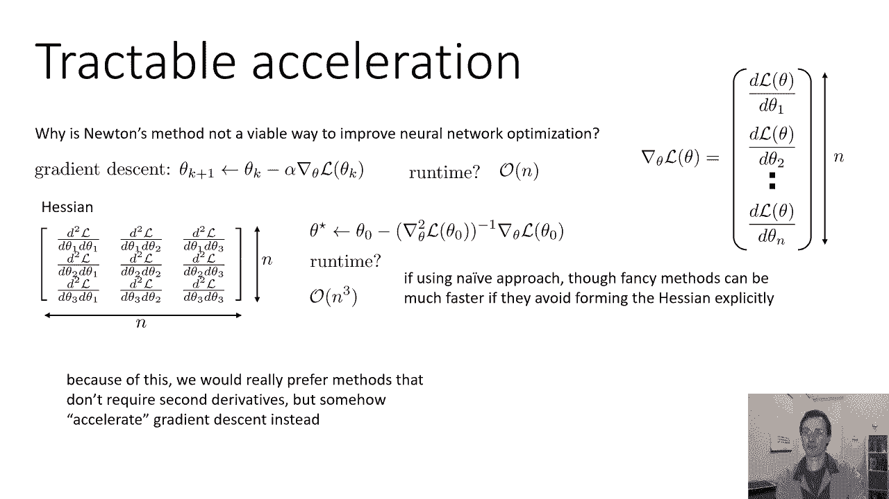
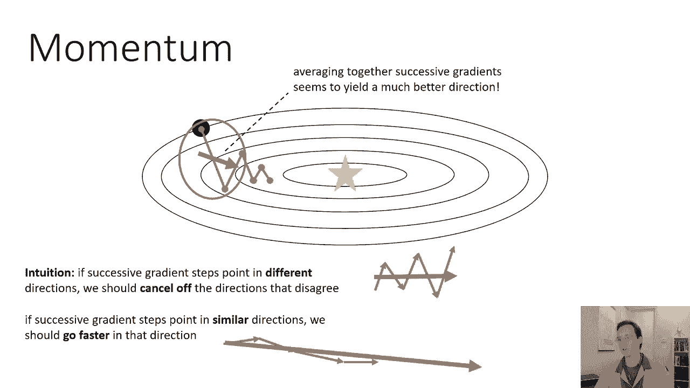
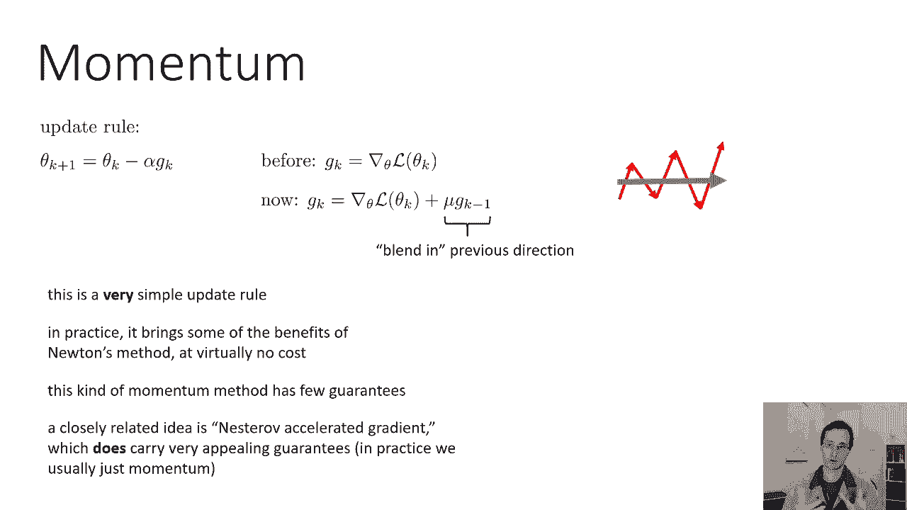
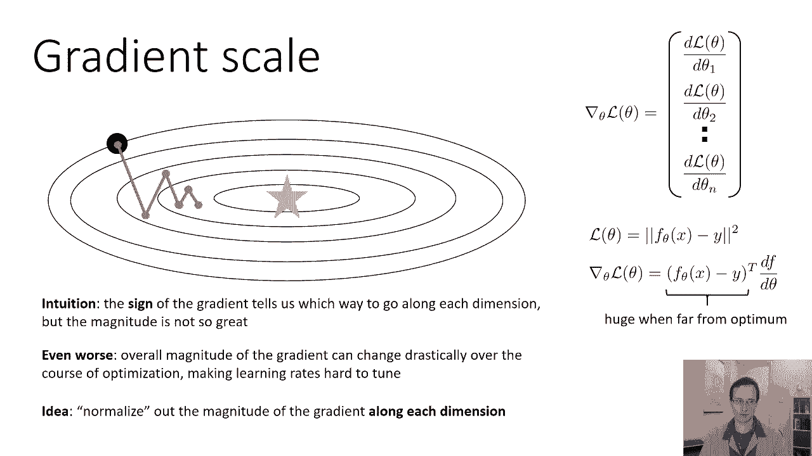
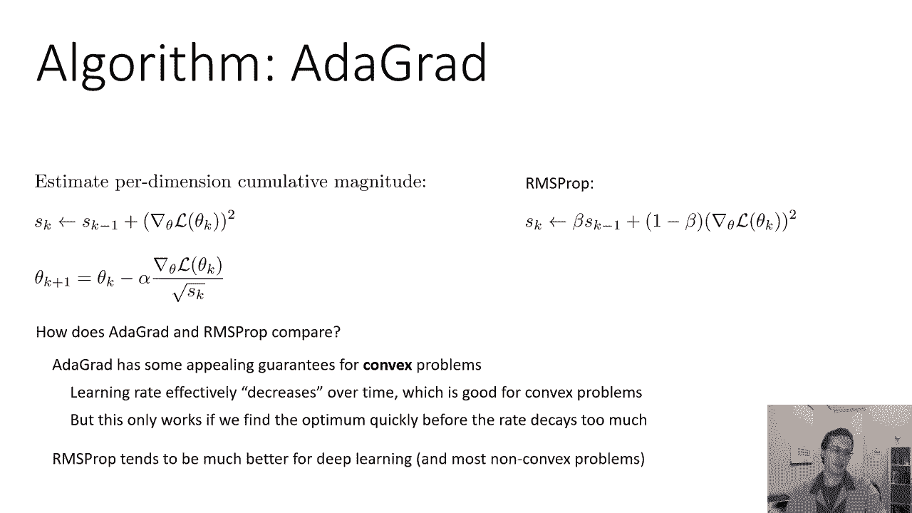

# P12：CS 182- Lecture 4- Part 2- Optimization - 爱可可-爱生活 - BV1PK4y1U751

让我们谈谈改进的方向，所以首先我们能找到一种方法来计算改进方向，至少对于这种椭圆形的函数，这实际上使我们走向最佳井，事实上，我们可以用一种叫做牛顿法的方法，牛顿法是一种更复杂的优化算法，比梯度下降。

现在我们在训练神经网络时实际上不会使用牛顿的方法，因为神经网络的牛顿方法非常，非常昂贵，但买不起，它需要太多的计算，但你可以把它看作是一种渴望的理想手段，这种方法并不能解决所有问题，它不会解决局部最优。

它不会解决鞍点，但它会给我们一个比最陡峭下降的方向更好的方向，牛顿方法背后的想法是这样的，我们可以像函数一样近似函数的方法之一，x的f是用所谓的泰勒展开式，你们中的许多人可能学过微积分中的泰勒展开式。

这个想法是你取一个点x零，在这一点上，你计算一些导数，也许你计算一阶导数和二阶导数，然后你可以近似你的函数作为它在x零的值，加上它的一阶导数乘以x减去x零，加二阶导数乘以半x减x零的平方。

然后你可以计算三阶导数是四阶导数，以此类推，但我们只做一阶和二阶导数，所以如果你有一阶和二阶导数，基本上，你用一条与你的函数具有相同斜率的抛物线来近似你的函数，在点x零和相同的二阶导数。

抛物线对真正复杂的函数不是一个很好的近似，但在局部可能是一个相当不错的近似值，在附近或你的港口后，当然，你可以在多元情况下做同样的事情，如果你有一个多变量损失函数lθ，你可以把它近似为lθ0。

加上梯度θ0乘以θ减去θ0，加二分之一θ减θ0，转置乘以黑森乘以θ减去θ零右，所以你有一个线性项和一个二次项，在这种情况下，你在用一个二次碗近似你的函数lθ，抛物线的多元推广，这些二次函数的好处是。

我们可以以封闭的形式优化它们，如果我们想求二次函数最小化的θ值，它只有一个封闭的表单表达式，我们不需要任何梯度下降，所以二次近似，泰勒展开是利用梯度和黑森形成的，记住黑森只是一个矩阵。

其中每个条目都是二阶导数，我们可以通过分析来优化它，所以如果我们想找到使这个近似最小化的θ值，我们只需将导数设为零，我们求解并得到更新，θ星等于θ0，减去黑森乘以梯度的逆，我不打算为此做数学计算。

但如果你想在家解决这个问题，只要把我写在这里的近似值，计算它的导数，将导数设为零，然后求解θ的结果值，你会得到确切的东西，我在幻灯片的左下角，然后它实际上会给你改进的方向，它将直奔最佳，就目前而言。

因为你的函数局部很好地近似为二次函数，值得一提的是，左下角的更新，看起来很像梯度下降，所以对于梯度下降，取θ0减去α乘以梯度，然后这里，我们取θ0减去黑森逆变乘以梯度，所以我们只是，呃。

用这个逆黑森矩阵变换我们的梯度。

所以如果我们能以某种方式做到这一点，那么我们就会得到一个非常好的改进方向，现在，为什么牛顿的方法不是一种可行的方法，在实践中改进神经网络优化，嗯，让我们考虑一下，这里有一个梯度下降更新。

梯度下降的一次更新的运行时间是什么，嗯，嗯，这么说吧，计算这些偏导数所需的时间是恒定的，它不是真正恒定的，但让我们想象一下，我们的θ中有n维，我们需要为每一个计算一个单独的偏导数，所以粗略地说。

我们将有N个运行时，运行时实际上是全部n，尽管在实践中我们并不单独计算每个部分Deri，我们使用一个叫做反向传播的过程，我们将在随后的讲座中讨论，最终在n个时间内计算梯度，现在是牛顿法。

我们需要黑森人黑森人有多少条，就像梯度有n维一样，黑森是n乘n，这意味着它有n个平方的总条目，我们的牛顿方法更新需要计算黑森的逆，乘以梯度，现在表示黑森本身已经需要n个平方运算中的o个。

矩阵逆需要n的立方，所以至少如果我们天真地做牛顿的方法，它将有一个随参数数三次缩放的运行时，如果你还记得第一课，一个大型现代神经网络中的参数数量可能有数十亿，所以一些运行时间是立方体的东西。

需要很长时间来计算，即使是一个永远不可行的更新，一个重要的警告是，这只是真的，如果我们简单地计算黑森逆乘以梯度，还有更奇特的方法，它们可以比n的立方快得多，因为它们避免实际构建整个哈希。

所以你可以使用的技巧，如果你真的想做，神经网络的牛顿法，是想出一个算法，计算黑森逆乘以梯度，而从来没有真正建造过整个，事实证明，有一些聪明的方法可以做到这一点，嗯，事实上，他们是如此聪明。

只要一点点近似，它们实际上可以在参数的数量上是线性的，但通常它们最终会非常复杂，它们在实践中并不经常被使用，所以因为这个，我们真的更喜欢不需要二阶导数的方法，但不知何故加速了规则的梯度下降。

同时将这个很好的o of n运行时保持在很好的简单更新表单中，所以我们将要讨论的第一个可处理的加速技术是一种叫做动量的东西，动量就是听起来的样子，所以如果我们记得以前的这张照片，梯度下降会来回振荡。

但是如果我们看看几个连续的评分更新，我们会注意到它们往往指向相反的方向，所以很容易想好，如果我们能把它们平均在一起，如果我们能把这些更新步骤的平均值，我们会得到我们想要的方向，那么我们可以修改梯度下降。

这样我们就可以通过，基本上把几个梯度平均在一起，所以在这种情况下平均，如果我们把两个连续的评分更新加起来平均，我们会得到一个更新方向，这比我们在任何一点上从最陡峭的方向看到的要好得多。

所以直觉是如果连续的梯度台阶指向不同的方向，我们应该取消不一致的方向，保留一致的方向，然后我们会朝着更好的方向前进，所以如果我们看到这种振荡业务，如果我们把这些平均一下，我们就会得到改进的方向，呃。

向着最佳，另一方面，如果连续的梯度台阶指向相似的方向，我们应该朝那个方向走得更快，所以如果我们得到这样的东西，它大致朝着同一个方向前进，把这些加在一起平均会给我们一个更长的箭头。

那么我们怎样才能把这件事做好呢，我们要用动量的更新规则很像，在梯度下降中，θk加1等于θ-α乘以gk，GK现在是我们的改进方向，之前只是渐变，但是现在它的梯度是μ乘以GK减去1，其中mu是小于1的常数。

所以我们基本上会把以前的方向乘以一些衰变因子，然后添加新的方向，所以我们会在前面的方向上混合，但我们把它乘以，比方说零点九九，常见的亩数选择是零点九或零点九。所以这意味着如果以前的方向和新的方向相反。

他们会取消，如果它们指向相似的方向，它们实际上会加在一起，在那个方向上走得更快，所以在这种情况下，我们将取消冲突的部分，这是一个在实践中非常简单的更新规则。

动量实际上以极小的代价带来了牛顿方法的一些好处，基本上没有额外的计算，那是需要的，你所要做的就是存储以前的GK，所以有一点点内存开销，现在这种动量法，呃，没有太多的理论保证。

这是对梯度下降的一种轻微的启发式改进，和以霓虹灯命名的内斯特洛夫加速梯度，确实有非常吸引人的保证，呃，事实上，对于凸问题，它被证明比梯度下降更快，但它有点复杂，所以在实践中，我们通常只使用动量。

但如果你想，如果你对优化理论感兴趣，然后你可以查看Nestrom的加速梯度，从理论上讲，这是一个非常非常优雅的算法，在凸优化中有很多有趣的分析，氖加速梯度，但由于这是一门关于深度学习的课程。

我们将更多地关注我们实际使用的方法。

也就是动量，这里有一个有动力的小演示，所以这里我有没有动量的梯度下降，当我增加动力，你可以看到的一件事是，解决方案越来越接近最优，所以它沿着谷底越走越快，但它也往往需要更长的时间才能滑到谷底。

所以对于很大的动量值，你可以看到它有锯齿形的图案，因为你可以，如果你想象这是一个球在这片土地上滚动，它会有一些动力，它就会把另一边卷起来，在它耗尽能量转身回到另一条路之前，但动量的好处是它最终。

越来越接近最优，因为它沿着谷底滑动更有效。

好了现在，下一个我要讨论的问题是梯度的尺度，就像我们之前看到的，最陡峭的下降方向不是一个好的方向，所以梯度的符号很重要，渐变点是向左还是向右是很重要的，但它走了多远，每个维度的信息都少得多，所以呃。

在黑色圆圈的起始位置，垂直方向的梯度大于梯度，水平方向，但我们实际上应该水平地比垂直地快，所以不同方向的梯度的相对大小，对我们来说并没有那么多信息，但它的标志是因为，我们绝对不想在那个时候上升。

我们绝对不想走左边，我们需要往下走，往右走，但是右多少或下多少，梯度并没有给我们非常有用的信息，所以梯度符号的直觉，告诉我们沿着每个维度走哪条路，但规模并不是真的那么有用，这就是我们的渐变，更糟糕的是。

梯度的总体大小可能会发生剧烈的变化，在优化过程中，这可能会使学习速度难以调整，所以这里有一个解释，假设我们使用误差损失的平方，如果我们在做回归，对呀，误差的平方导数是x与y的f之差。

乘以df dθ那只是通道，所以说，我们可以从这个表情中立即看到的一件事是，f和y的差越大，基本上误差越大，渐变就越大，如果最初f与1非常不同，也许我们的入会很糟糕，那么你的渐变就会很大。

当你的渐变如此之大，你几乎肯定会超过最佳值，从另一边出来，但是当你的函数f越来越接近y，坡度就会变得很小，在这一点上，你可能会迈出很小的一步，然后你可能想要更大的学习率，所以因为呃。

渐变的总长度在很大程度上取决于你的函数，调整你的学习速度可能很困难，使其可靠地工作于不同的功能或同一功能的不同点，所以说，一个可以帮助我们减轻，这是为了归一化沿着每个维度的梯度的大小，基本上。

如果可以的话，以某种方式大致计算出梯度有多大，在每个维度上的平均值除以该平均值，然后你就会去掉这些烦人的缩放因素。

所以一个近似地做到这一点的算法被称为rms prop，rms代表均方根，rms问题中的思想，是估计梯度的平均每维大小，所以对于梯度的每一维，我们要做的是，我们将跟踪它的平方的移动平均值。

所以我们要用比例向量，s k s k的条目数与梯度相同，每一步，我们取过去的值s k s k减去1，我们将它乘以某个因子，可能是0点9或者0点9，然后我们取一个负贝塔，乘以梯度中每个条目的平方。

所以我们希望每个维度的向量SK都包含，该维度梯度的平均平方值，所以它大致是那个维度的梯度有多大，平方，所以这大致是每个维度长度的平方，然后当我们更新渐变的时候，当我们更新θ的时候，我们选择一个方向。

我们沿着渐变的方向走一步，但我们把它除以s k的平方根，所以对于梯度的每一维，我们把它除以那个条目的平均平方长度的平方根，所以这意味着我们大致，将梯度中的每个条目除以其平均长度。

这意味着如果等级的某些维度往往很大，有些往往很小，经过这样的划分，它们的长度差不多，所以每个维度大致除以它的大小，现在，rms支柱，往往在修复这个缩放因子方面做得很好，但这又是一个启发式算法。

它没有很强的保证，一个密切相关的算法被称为Grad的atground，你可以把它看作是基本上，RMS道具的一个更有理论原则的版本，就像内斯特的加速梯度一样，更有原则的动量版本，所以在毕业生中。

我们还必须使每一维的大小，但我们累计估计它们，所以我们把s k设为，加上渐变中每个条目的平方，所以我们基本上摆脱了测试版的东西，然后就像我们的混乱道具一样，当我们更新θ时。

我们只需将梯度中的每个条目除以s k的平方根，所以这里是RMS道具，在均方根支柱中的比较，我们在研究生阶段就达到了平均水平，我们只要把这些平方值求和，现在，一开始你可能会说好，那似乎是个坏主意。

因为K会越来越大，那么Atgrad和RMS道具相比如何呢，Atgrad对凸问题有一些非常有吸引力的保证，你实际上可以证明，在一个研究生会有效地找到好的解决方案，但对于非凸问题。

学习率随着时间的推移而下降的事实可能是一个问题，这是一个像，为什么学习率下降得很好，因为你一直在给s k加正数，所以k不断变大，更大，越来越大，所以这意味着你被越来越大的数字除以。

这意味着你的更新越来越小，所以只有当你迅速找到最佳时，这才有效，在K变得如此之大以至于您的更新变得很小之前，这在凸问题上是有效的，因为直觉上对于凸问题，每一步都可以比前一步小，因为你总是越来越接近最佳。

因为函数是凸的，因为它是这样弯曲的，坡度必须变得越来越小，所以你要加上这些平方的斜坡，但是斜坡变小了，这意味着你在添加越来越小的数字，实际上对于凸问题，斜率下降的速度和你的学习速度下降的速度。

它们实际上平衡了，你最终达到最佳状态，但对于非凸问题，你可能会从一个非常非常陡峭的斜坡上下来，然后就达到了一个平台，然后再次撞上一个非常陡峭的部分，你的K变大了。

所以你住的地方太小了当你在高原上的时候真的会要了你的命，所以对于非凸问题，附加梯度往往不太好用，RMS道具往往工作得更好，RM道具随时间遗忘，你在倍增的事实，s k减去1而β小于1。

意味着随着时间的推移，rms道具会忘记很久以前看到的渐变，而Atgrad永远不会忘记，所以RMS道具往往更适合深度学习，总的来说。

对于非凸问题，我要讨论的最后一个算法，这是深度学习中非常常用的算法，叫做原子，基本思想是原子结合了动量和均方根，所以在原子中，我们将利用动量来加速梯度下降，使长度正常化，这是原子算法。

它实际上有相当多的步骤，但是步骤很简单，首先，我们有一个所谓的第一时刻估计，这很像动量所做的，所以我们取当前的梯度，我们把它乘以一负贝塔，我们取m的前一个值乘以beta。

所以这有点像动量动量没有一个负贝塔的东西，非常相似的想法，所以我们在前进的过程中积累了我们的梯度，然后我们有V K M代表卑鄙，V代表方差，V k是所谓的第二矩估计，所以就像第一次更新一样。

只是现在我们使用渐变的平方值，所以这很像rms道具中的s向量，他们都跑得很平均，是第一个使用测试版的，第二个使用beta 2，现在我们可以取m除以v的平方根，我们会有一个RM道具风格更新。

但是有一点问题，想象一下我们才刚刚开始，我们将m0和v0设置为0，那么m是1减去贝塔数，梯度加零，通常贝塔1和贝塔2是很大的数字，比如β1可能是零点九β2可能是零点九，九九，1将是1减，比方说零点九。

所以会有一些小的数字乘以梯度，加零点九乘以零，所以最初m会很小，它每走一步都会逐渐积累起来，V也一样，这有点烦人，因为你在早期就采取了这些微小的步骤，然后台阶越来越大，所以我们可以修复的方法之一。

我们可以把mk除以1-1除以k的次方，所以这意味着在第一步，1是1减去β，梯度的1倍，我们把它除以1-1，你只要回到梯度，那么为什么，因为一开始m和v都是零，这么早，这些值就很小。

注意到β1升到了k的次方，所以一旦你采取了许多步骤，假设你已经走了一百万步，β1的k次方几乎为零，所以一减就是一，所以M的帽子会和M很相似，我们做同样的事情，这只是在优化的早期阶段加快了一点速度。

然后我们的更新θk加1就是θk，减去我们的学习率，α乘以m帽除以v帽的平方根，就像一个RM道具，只有这个小Epsilon，这个epsilon只是为了防止被零除法，所以如果V帽变得很小。

我们只要加上这个小ε就可以避免除以零，这都是一个很好的选择Epsilon是十比负，一种力量，所以这是一个非常小的数字，如果你想在实践中使用Atom。

许多机器学习问题的良好默认设置是将alpha设置为零点，零零一，和设置呃，一号到零点九二号到零点九，九九，为什么β2比β1大，嗯，贝塔一基本上就像动量项，β2只是在估计，震级不变，往往和方向一样快。

所以这就是为什么我们可以用更大的贝塔值来表示震级，但是我们需要用一个小一点的来做动量，因为方向可以改变很多。

