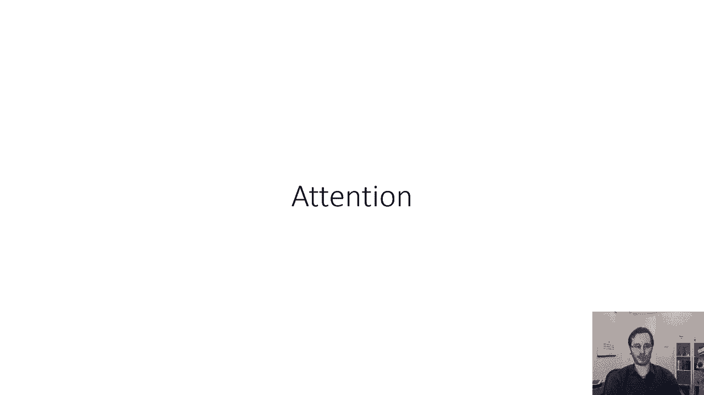
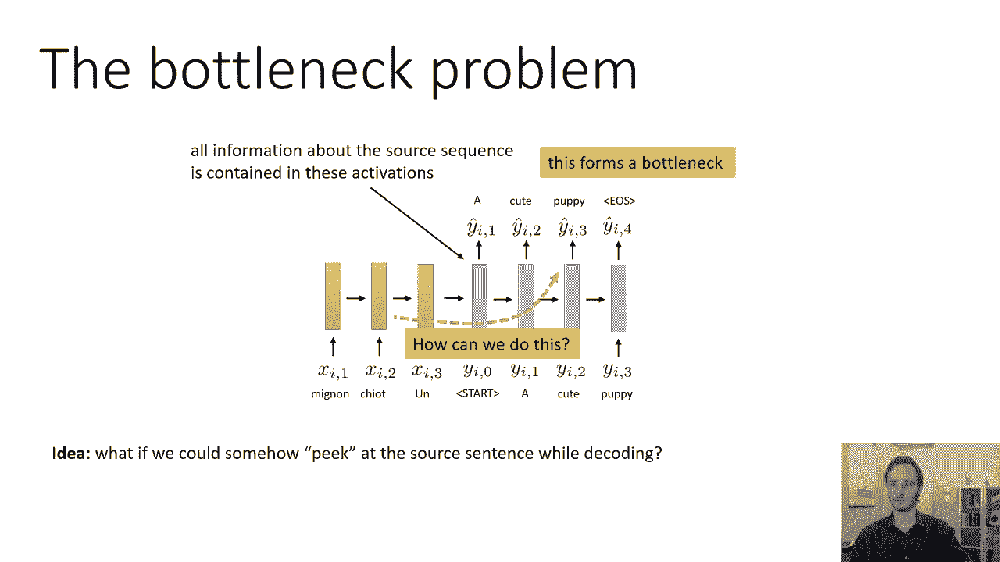
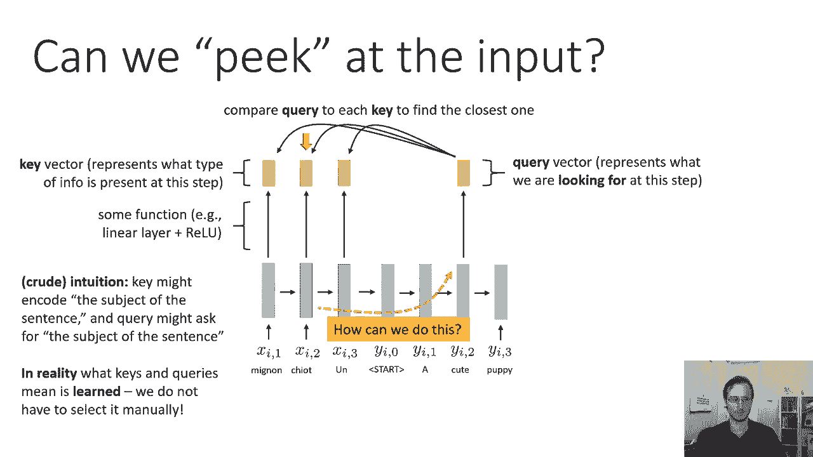
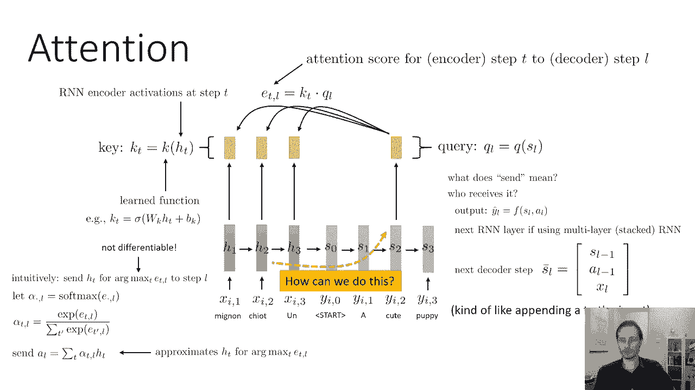
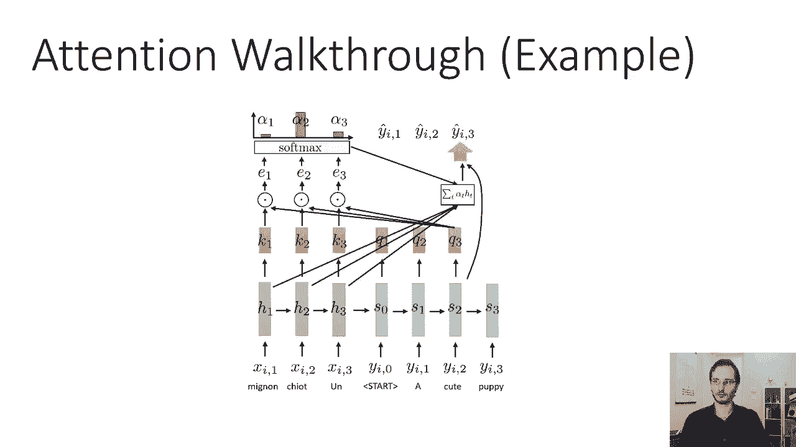
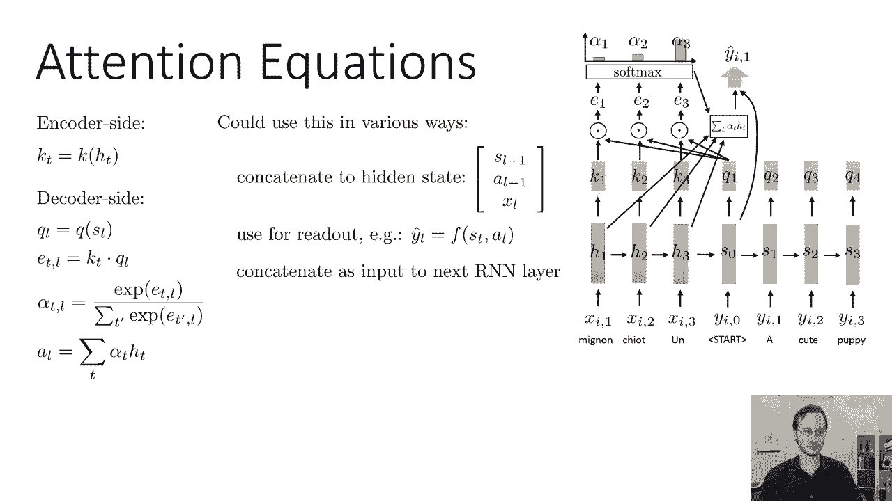
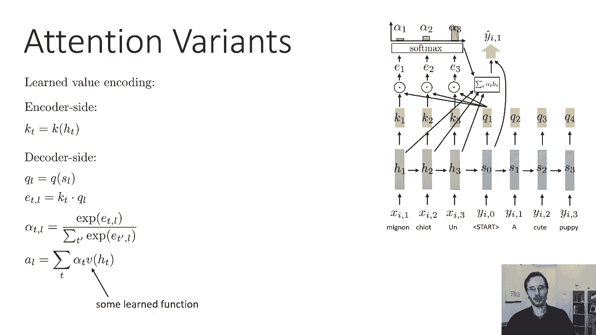
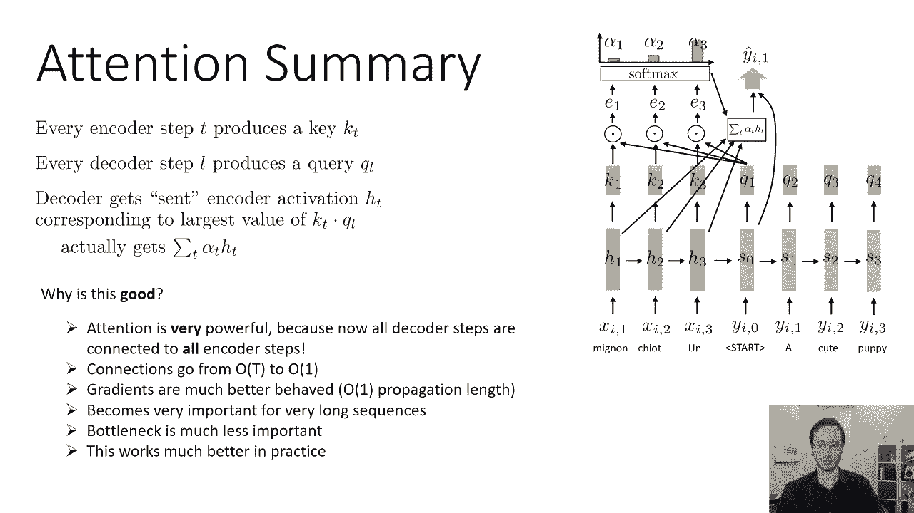

# P35：CS 182- Lecture 11- Part 3- Sequence to Sequence - 爱可可-爱生活 - BV1PK4y1U751

今天这堂课我要讨论的最后一个话题，将作为下节课的一个过渡，所以呃，下一节课，我们将更多地讨论注意力，但我只想介绍寻求模型的注意力概念。

所以序列到序列模型有一个问题，这限制了您可以处理的序列的最大长度，这就是我们可以称之为瓶颈问题，基本上所有关于源序列的信息都必须包含在激活中，在解码开始的时候，解码器对源序列一无所知。

除了编码器放入第一个隐藏状态的内容，解码器什么都不知道，当输入序列很长时，这可能是一个大问题，所以这形成了一种瓶颈，基本上编码器需要真的，非常小心地把正确的信息，进入解码器的第一个隐藏状态。

所以解码器会解码正确的东西，所以也许我们可以放松一点，如果我们以某种方式允许解码器窥视输入序列，在解码的时候再多一点，也许这样会更好，如果本质上编码器，只要把正在发生的事情的一般摘要放入隐藏状态。

和解码器，但仍然引用输入序列来拔出单个疣，显然，当您的输入长度为3时，这并不重要，但是想象一下你的输入是，呃，你知道的，整个段落的权利，也许这一段包含了某一特定年份发生的历史事件的一些事实。

编码器对段落的一般要旨进行编码，关于它的结构，但它不想存储特定的年份，当那件事发生时，所以当解码器到达那个点，它可以引用回输入序列，然后取出令牌，所以也许当我们解码的时候，我们想以某种方式有一个小捷径。

说好，当你谈到句子的主题时，如果你忘了主题是什么，你可以回头看编码句子中的主题，然后把它拉回来，把它拉到适当的时间步长，并将其包含在您的输入中，我们怎么能做到这一点，如果我们能做到这一点。

我们将大大降低瓶颈的重要性，对编码器来说就不那么重要了，处理很长的序列会容易得多，在那里很难做到这一点。

我们怎么能做到这一点，我们如何在解码时偷看输入，所以这里是基本的想法，我要概述一下这个想法，会显得有点武断，但随着我越来越多地描述它，希望，就会明白为什么它是这样设计的，在编码时。

我们将有编码器的每一步，rnn生成一小段信息，描述当时步骤中存在的内容，那条信息对我们来说没有语义上的意义，就像一个小矢量激活，孤立地并不意味着什么，但以后会很有用的，所以我们称之为钥匙，直觉上。

它表示在此步骤中存在什么类型的信息，但我们不会手动指定密钥，它实际上是作为学习过程的一部分来学习的，所以从输入隐藏状态到滑雪的映射是某种函数，一些学过的函数，就像在实践中的线性层，通常只是一个线性层。

只要一个基本上的线性变换就足够了，然后在我们解码的每一步，我们要输出一个小向量，与我们调用查询的长度相同，因此查询向量直观地表示我们想要的信息类型，在这个时候一步，然后我们将查询向量与每个键进行比较。

找到最相似的一个，这将告诉我们输入的哪个时间步骤是最相关的，对于解码过程中的这个时间步骤，然后我们会把这些信息发送到解码器，所以这里可能第二个时间步进键与查询最相似，所以我们就选那个。

我们将把它相应的隐藏状态发送到解码器，所以一些粗鲁的直觉，因为这可能会做的是关键可能会编码一些概念，我想知道句子的主语是什么，或者对不起，密钥可能会编码，像这个词是句子的主语，然后查询可能会编码。

我想要句子的主语，然后其他部分可能会说我想要句子的宾语，或者我想要一个动词，或者我想要一个形容词，对呀，或者它会编码，我想要on这个词后面的词，对那里发生了什么的一些概念，在句子和查询中编码您想要的位。

然后找到与查询最相似的键，并采取相应的时间步长，获取它的隐藏状态并将其输入解码器，所以这是对什么的高级直觉，我们将要做的，我还没有从数学上把它做得很精确，那是以后的事，但这是高层的想法，现在关键的是。

我们不必手动指定这些东西，整个网络仍然会首尾相接地训练，键和查询的实际内容将由神经网络确定，就像修道院里的过滤器，它们有某种直观的含义，但它们不是手工指定的，他们是作为这里培训过程的一部分学习的。

我也是，关键查询将作为培训过程的一部分学习，所以在现实中，键和查询的含义是学习的，我们没有选定的手册，这种直觉，我只是在这里给它，只是为了帮助你理解我们为什么要这么做。

好的，所以这就是现在的关键，让我们来谈谈这在实践中是如何工作的，我要用字母h，表示编码器的隐藏状态，这就是RNN激活，我以前用字母A来指代他们，我现在要用h，因为我要用a做别的事，注意这个词以一个。

所以这将被称为，RNN的状态现在被称为H，我会用不同的字母，s表示解码器的状态，只是为了不让我们混淆，编码器状态从解码器状态，它们都是隐藏状态，他们都是RNN激活，但我要用h作为编码器，解码器的S。

只是为了让我们更容易把它们分开，对于钥匙，我将用字母K，每一步都有一个单独的键，键是HT的某个功能键K，所以它在每一个时间步长都是相同的函数，它只是我们应用于RNN隐藏状态的一些函数。

所以您在步骤T中进行RNN编码器激活，并应用函数k，可能是，比如说，只是一个线性层，然后是一个非线性，一次又一次，在实践中经常，函数k只是一个线性变换，所以就像W乘以HT，但如果你愿意。

它也可以是非线性的，查询，同样地，我将用字母q来表示它，我将用下标l代替t，所以我将用t来索引编码器中的时间步长，和L在解码器中索引时间步长，所以Q l，比如说，应用于解码器状态的函数。

在那个时候的步骤，这是一种分数，表示一个键与，KT和QL之间的点积将给出一个查询，所以我要用e下标t，逗号l，表示时间步t键之间的点积，和时间步骤l中的查询，直觉上，我们要拉出时间步T的隐藏状态。

其中e t逗号l最大，意味着点积是最大的，所以我们可以称之为编码器步骤T的注意力得分，进入解码器步骤L，所以我的每一个解码器步骤，当然啦，不同的故意得分，因为它有不同的查询，直觉上，我们要做的是。

我们想在时间步骤l将HT发送到解码器，其中e t逗号l最大化，所以我们要求arg max相对于t{\displaystyle t}的最大值，逗号l，我们将在步骤l的时间将相应的ht发送到解码器。

现在这里的问题是arg max不是一个可微操作，所以如果我们真的用Arc Max，我们就不能训练这个东西，所以我们要用的是软麦克斯，因为软最大值是可微的，所以我们要创建一个向量。

我们称之为alpha l，这将通过对E T应用软最大值来获得，t的所有值的逗号l，所以这意味着alpha t逗号l是e t的指数，逗号l，除以T的指数的所有其他T的和，E T素逗号L，所以E越大。

这个软最大值变得越接近硬最大值，所以这是一种软化的最大值近似值，然后如果我们想发送大致对应于最大，E T逗号l，那么我们要送的，我们把这称为一个引起注意的问题，我们要把αT的和，逗号l乘以h t。

所以直觉上这些阿尔法，呃，所有时间的步数都会很小，除了E T逗号最大的那个，所以HT的加权和将由HT主导，对应于e t逗号l相对于t的arg最大值，所以这将创建一个向量a，这只是不同HTS的线性组合。

可能最接近与最大et come l的时间步长相对应的ht，然后我们会采取铝，我们会把它交给解码器使用，帮助它解码正确的单词，所以这个加权和用alpha加权近似于弧度最大值的h t，关于t的e t逗号l。

幻灯片上有一堆数学，这是相当简单的数学，但直觉是我们正试图拔出编码器，当时的RNN州，步骤t对应于键和查询之间最大的点积，我们引起这种关注的原因是，因为网络正试图关注最相关的部分，好的，现在。

发送是什么意思，向解码器发送一个L是什么意思，嗯，它实际上可能意味着许多不同的事情，解码器可以以不同的方式使用这些，所以使用它的一种方法是把它交给实际产生输出的函数。

所以在我们的RNN通过使用SL来产生输出y帽子之前，所以y hat l是sl的函数，现在我可以是sl和a的函数，如果你想知道在第二步要生产什么作品，您使用第二步时的解码器状态，也就是S 2。

和您使用的编码器状态对应的最高注意力，理想情况下是H2，但软版本是，你可以利用这种关注的另一种方式，你可以把它交给下一个RNN层，如果您使用多层或堆叠RNN，所以你可以在第一层有张力。

然后把它作为第二层的附加输入，你可以使用它的另一种方式是你可以把它交给下一个解码器步骤，所以在这里你要抬头看台阶的注意力，和你的手进入下一步，所以在下一个解码器步骤，记住在一个普通的RNN中。

我们将rnn的隐藏状态为a-l-1，我们将添加输入单元格，现在我们可以添加输入和注意力向量，所以本质上，在这种情况下，注意向量a l作为附加输入，所以你给它一个新词，你给它关注。

前一个r和激活将它们组合在一起获得下一个激活，所以这也是一个非常合理的方法，所以这些都是合理的选择。

所以让我们来看看注意力在一个具体的例子中是如何工作的，所以我们有之前关于小狗的简短句子，编码器的每一个时间步长都会产生一个密钥，我们将从解码器的第一步开始，它生成一个查询，所以我们接受这个查询。

并将其与每个键相乘，这样就为每个输入的时间步长产生一个数字，我们称这些为E，所以E，E二，E三，然后我们通过一个软最大值，所以这就确保了它们都是正的，和为一，这就产生了阿尔法一号，阿尔法2和阿尔法3。

也许第三个步骤是最大的，然后我们取这些alpha，取所有输入的隐藏状态，哈一，氢二和氢三，我们构造一个H的加权组合，所以这给了我们一个长度等于h的向量，然后我们以某种方式使用这个向量来改进解码器。

我们可以使用它的方法之一是，我们可以将其包含在生成y hat的函数中，我们可以使用它的另一种方式是，我们可以把它交给下一个解码器的时候，步骤，然后当我们进入时间第二步时，我们再次生成一个查询。

我们再次用每个键计算该查询的点积，我们再次通过一个软最大值，然后我们再次构造这个加权组合，然后我们以某种方式使用它来产生输出，或者我们把它交给解码器的下一个时间步骤，第三步同样的事情。

这基本上就是注意力的工作原理，现在让我们在编码过程中更精确地用方程来写出来，我们必须建造这些KT，每个kt是解码器上ht的某个函数k，我们生成一个查询QL，它是应用于SL的函数Q。

我们构建我们的注意力得分，E T逗号l，通过取kt和每t取一个带有ql的库存产品，你把它通过一个软最大值来得到alpha t逗号l，然后你把注意力向量A构造为隐藏状态的加权组合。

每个时间步长的ht由相应的alpha加权，然后你可以用各种方式来使用它，您可以将其连接到隐藏状态，给解码器的下一个时间步骤，你可以用它来读数，所以你有一些函数，根据st和。

或者您可以将其连接为下一个RNN层的输入，如果使用堆叠的RNN，像这样寻求有三层堆叠的例子，所以这些都是合理的选择。

现在这个注意食谱有许多变体，一些值得了解的特殊情况，一个非常简单的选择是使用k，uh和q作为恒等函数，所以在这种情况下，kt就是h，t，ql就是s，l，所以在这种情况下，当你解码你的注意力。

分数只是输入隐藏状态和，和解码器隐藏状态，所以直觉上，这就像是在说，找到最接近这个的时间步长，解码输入中的时间步长，其他一切都以同样的方式工作，那是一个相当合理的选择，很容易实现，但它的表现力可能有限。

因为那样你就不能把一些东西放进你隐藏的状态，不必参与关注，另一个非常简单的选择，这是一个非常常见的选择是使用线性乘法注意，其中kt和ql只是隐状态的线性函数，这其实很合理。

因为记住RNN隐态是通过应用非线性函数形成的，所以说，对RNN来说，塞满一些信息并不太难，进入它的隐藏状态，可以直接用作键或查询，所以这并没有真正削弱我们的代表能力，因为RNN已经是非线性的。

所以对RNN来说，很容易让它隐藏状态的一部分，对应于键或查询，然后你可以把这个权重矩阵看作是选择那些条目，这是一个非常方便的实现，因为当你计算你的注意力得分时，您必须使用QL实现KT数据。

用ql表示的kt数据就是kt转置乘以ql，如果我们在方程中替换对应于ht的kt和ql，转置w k转置乘以w q乘以sl，这意味着你可以组合矩阵w，k和w q变成一个矩阵w e，它是由W K给出的。

转置w q，所以实际上不是分开学习w k和w q，你可以只学习一个矩阵，这可能会更容易实现，更有效，然后其余的工作方式完全相同，你通过取Softmax来计算alpha。

并通过取H的加权组合来计算注意向量，最后一个，呃，我要描述的变体，实际上比最初的要复杂一点，这和我的基本注意力是一样的，呃解释到目前为止，所以它有一些关键函数和一些查询函数，只有一个区别，也就是说。

在最后，当你实际构造你的注意力向量时，你不构造HTS的加权组合，但相反，你构造了一个加权组合，HT被一些学习的函数转换，这里的v和v代表值，所以这有一种吸引人的解释。

因为现在您在编码过程中的注意力产生了键值对，所以H的K是关键，HT的V是值，然后当你解码的时候，你在k和q之间找到最大乘积的时间步长，然后取它的值，这可以增加一点灵活性。

好的，所以注意的总结，每一个编码器步骤T产生一个键kt，每个解码器步骤l产生一个查询ql，解码器被发送，与产品的最大值相对应的编码器激活HT，kt和ql，但实际上取最大值是不可微的。

所以你实际上得到了一个以alpha t加权的加权组合，它是用软最大值得到的，为什么注意力很好，注意力其实很强大，因为现在所有解码器步骤最终都连接到所有编码器步骤，所以RN本身它的连接。

在每对时间步长之间，该连接的长度为O的n，这意味着梯度需要平均传播，你知道平均n步，但与注意力的联系总是一体的，总是有一个步骤连接到每一个编码器步骤，所以连接从O到O，这意味着渐变的路径非常短。

这意味着渐变会表现得更好，你会有更容易的训练，对吧，渐变表现得更好，因为你有一个传播长度的O或者用另一种方式，繁殖在一起的雅各比的数量，沿着注意路线是一个，它仍然沿着RNN路线，但你有另一条路。

那条路会训练得很好，这对于非常长的序列变得非常重要，将梯度推过RNN主干，一路，在输入句子的开头和输出句子的结尾之间，会变得令人望而却步，基本上即使有LSTM细胞这样的东西。

消失梯度问题可能无法完全避免，但只要注意，它们不需要完全避免，因为注意力有一个联系，所以这是一个非常强大的概念，在下一节课中，我们将在这个概念的基础上做更多的阐述。

当我们谈论如何开发只使用注意力的模型时，所以在实践中，虽然，即使您只是想对序列模型进行排序。

