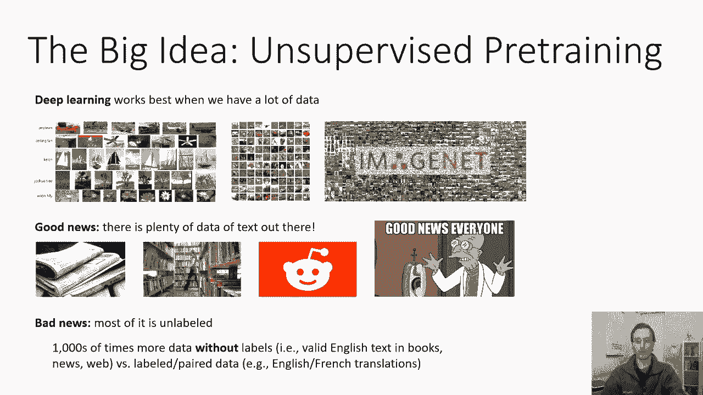
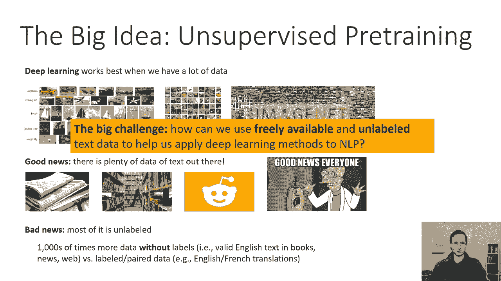
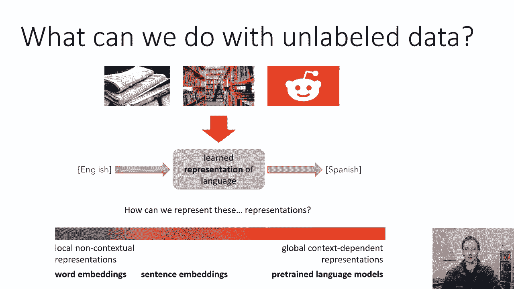
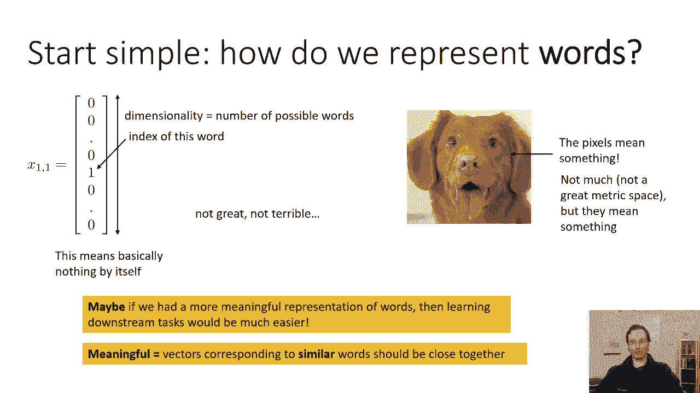
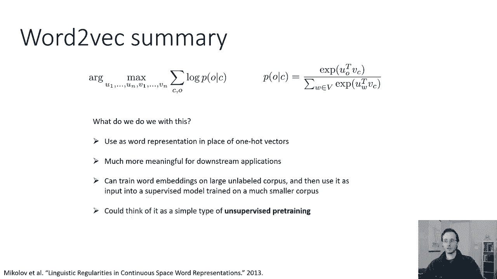

# P39：CS 182- Lecture 13- Part 1- NLP - 爱可可-爱生活 - BV1PK4y1U751

所有的权利，欢迎来到今天的第十三讲，我们将在前面关于递归神经网络的讨论的基础上再接再厉，和变形金刚，并讨论如何将这些思想应用于自然语言处理，当然啦，因为这是一个单一的讲座，我不能给出一个完整的概述。

所有与深度学习有关的主题，nlp，nlp是深度学习方法的一个巨大应用领域，有大量的工作应用于各种不同的，深度学习模型，到nlp，各种不同方式的问题，所以在设计这个讲座的时候。

我基本上必须在NLP中选择一个主题来关注，我真正想深入讨论的话题是无人监督的，培训前，因为这是，我认为深度学习影响的最重要的方式之一，nlp，我想这也说明了，呃，超越自然语言处理。

深度学习算法的基本优势之一，所以今天这堂课的主要思想是，通常被称为无监督的预训练，看深度学习效果最好，当我们有很多数据的时候，如果你还记得我们在课程开始时的讨论，在很多方面，深度学习模型性能的改进与。

可用于训练这些模型的数据集规模大幅增加，所以我们经常在这堂课上谈论大型模型的重要性，有很多层等等，但重要的是要记住，伴随着模型规模的增加，数据集的规模也在增加，在许多情况下，数据集本身同样重要。

如果不是更多的话，这些方法的成功，作为架构和培训方法的创新，所以说，关于NLP的好消息，外面有大量的文本数据，所以原则上，nlp应该是深度学习方法的一个非常好的应用领域。

因为深度学习方法依靠大量数据茁壮成长，我们有很多很多的文本数据，你知道的，只是去下载所有的维基百科，下载所有项目，古腾堡刮，你知道的，把所有的报纸，所有的图书馆。

所有的社交媒体网站你会得到大量代表真实的文本，含有真正意义的人类书面句子，那太好了，这似乎表明NLP是深度学习的最佳选择，但坏消息是，这些数据大多没有标记，你没有，你知道的。

用英语和法语发表所有报道的报纸，为您提供配对翻译，你没有社交媒体网站，人们会，呃，你知道吗，写他们的评论，然后写，你知道吗，提供情感分析标签，有时候你会，有时候你可以，比如说。

刮亚马逊评论并预测明星数量，但在大多数情况下，数据没有标记，尤其是当你找不到标记数据的时候，比如说，你可以想象你可以通过下载来训练一个问答系统，让我们从AA开始提问，然后取相应的答案，在大多数情况下。

标签数据仍然会比巨大的，未标记数据集，你可以买到最先进的模型，我将在这堂课中描述的模型是在数亿人的基础上训练的，甚至数十亿句，海量数据，因为这个原因，它们工作得很好，所以有成千上万倍的数据没有标签。

比如书籍中有效的英文文本，新闻与网络。

与标记和配对的数据相比，如英语、法语翻译，所以我们面临的最大挑战，如果我们想让深度学习加上NLP非常非常好地工作，就是我们如何使用免费提供的、未标记的文本数据，帮助我们将深度学习方法应用于NLP。

这基本上就是今天讲座的主题。

那么我们可以用未标记的数据做什么，我们可以用未标记的数据做什么，你不能随便用报纸上的文章，学习如何将英语翻译成法语，那是行不通的，但你能做的是你能学会很好的英语表达，这样你就可以，然后更容易。

学习如何把那些英语句子翻译成法语句子，比如说，如果你学习一个语义相似的单词在一起的单词的表示，然后尝试基于该表示的下游任务会更容易，你可以想象在英语句子上训练这样的表象，单独训练法语句子。

然后在两者之间构建某种映射，因此，表征学习可以在没有标签的情况下进行，它可以作为下游学习的极好基础，该表示实际上可以用于一些有用的任务，它将在更少的标记数据上训练，你可以想象一种光谱，在光谱的一端。

您有本地或非上下文表示，所以说，这些是独立于这些词在句子中的使用方式的词的表示，例如，你可能会天真地把国王和总统这个词表示为词典中的两个不同条目，但是如果你如果你明白一些关于，呃，国王和总统这个词。

你可能会把它们放在一个它们现在靠得很近的空间里，这本身并不一定是一个真正伟大的代表，国王和总统确实是，你知道，有点语义上相关的，但你知道如果你说得好，这个人是我棋社的社长，总统这个词的用法，你知道和说。

你知道他是爵士之王，对呀，所以单词是相似的，但取决于它们使用的上下文，它们确实有不同的含义，所以在另一个极端，你可以想象，呃，全局上下文相关表示，这些表示将通过阅读整个句子来计算，甚至一整段文字。

然后构造句子中标记的表示，考虑到它在特定句子或特定段落中的使用方式，它是一种特定于该文本的定制表示，所以在光谱的左边，我们有单词嵌入之类的东西，在中间，我们可能会有句子嵌入之类的东西，在最右边。

我们会有Pre，训练有素的语言模型，读取整个句子并从中产生表示，在今天的课程中，我们将讨论光谱的两个极端，我们将从单词嵌入的讨论开始，然后我们会花相当多的时间讨论预先训练的语言模型。

以及这些如何为NLP提供更好、更强大的表示。

但让我们从光谱的左侧开始，让我们从简单的开始，我们如何表示单词，当我们谈到RNN和序列到序列模型时，我们看到了一个热门的代表，所以一个热表示是一个向量，它的长度，它的维数等于可能的单词数，基本上。

这个向量的维数是字典中条目的数量，所以它相当大，所有的条目都是零，除了一个条目，它的索引与字典中那个词的索引相对应，所以你基本上打开字典，找到这个词，如果你把那个数字的所有单词都编号。

它在向量中的对应条目是1，好的，这是一个非常简单的表示，保存关于这个词是什么的所有信息，但它没有很好地说明单词之间的关系和相似性，所以两个几乎是同义词的词在这个表示中看起来完全不同。

就像任何两个词一样不同，所以不是很好，但并不可怕，我是说你得到了信息，但这与图像形成鲜明对比，像这样的像素，如果图像中有像素，是啊，是啊，就像一个像素本身，没有传达很多信息，但是值相似的像素。

相似的颜色其实是相似的对吧，所以注入中的像素意味着，并进一步，我们看到一个卷积神经网络挤压，通过实际考虑局部相干性，从图像的结构中获得更多的意义，所以大陆上的过滤器查看附近的像素。

因为附近像素的含义很可能相似，所以像素中包含的信息不多，它们不是一个很好的度量空间，如果你把两个图像一起减去，你从另一个图像中减去两个图像，并采取规范，这并不能给你一个很好的图像相似性度量，但在当地。

这确实意味着什么，然而，这些热向量实际上没有任何意义，独立于它们构建的字典，所以也许如果我们有一个更有意义的词语表示，那么学习下游任务就容易多了，所以我们要在这里买一些相当谦虚的东西。

我们只想要一个比这些热向量更好的单词表示，理想情况下，在以下方面相似的单词的表示，让我们说，欧几里得距离，或者点积，在这个表示下意味着类似的东西，那么我们如何考虑构建这种单词表示呢。

我们要追求的是这样的东西，所以这些是一个叫做Word到VEC的东西的低维投影，word to vec是一种将单词嵌入到向量中的方法，所以它被称为单词到VEC，因为它把单词变成向量。

使语义上相似的词靠得很近，此外，在这个潜在的单词空间中，单词的变化实际上具有语义意义，我也是，我们很快就会看到这意味着什么，所以如果这没有意义，别担心，但希望从这些照片来看，你可以得到一些粗糙的。

对这些单词嵌入试图实现的目标的直观理解，所以如果你看左边的图片，你可以在左上角看到，你有胡椒盐混合物，放一朵花，软的好烤箱卷对，所以这些都是和烹饪有关的词，甚至更具体，不仅仅是做饭。

但它看起来特别像烘焙对，然后如果你从那里下去，你得到你的时间，凉锅，盘子盖，所以这些也是和食物有关的词，但现在它有点从烹饪漂移到，也许就像储存食物一样，就像你知道你的菜会变冷什么的，如果你往右边走。

你可以看到对应的单词，更多食品，所以一个蛋糕，牛肉，小牛肉，猪肉，肉汁，你看所有的肉都堆在上面，就在那里，所以有明确的结构在下注，类似地，在幻灯片右侧的快照中，大家可以看到，你知道在顶部。

有像宇宙飞船这样的词，穿梭机，喷气动力，就像花哨的艺术状态，航空航天物，如果你向左，从那里你看到像飞机，乘客，货物，飞行，航空公司，航空航天相关术语也是如此，但更多的是与平凡的客运飞行有关的事情。

如果你从那里下去，你得到着陆，安全飞行，战士头痛服用，然后你会得到非常咄咄逼人的东西，比如流感，保持杀戮对吧，所以也许底部的东西更多地处理，像军事航空，所以当你在空间中移动时，你知道的那种。

空间的变化对应于语义的变化，所以让我们来谈谈如何获得这些类型的嵌入，所以说，我们要借鉴的基本思想是，一个词的意思在很大程度上是，由发生在它附近的其他单词决定，这不是一个明显的说法，但如果你仔细想想。

这实际上是有道理的，就像雨这个词被用来接近像国王和王后这样的词，也许在较小的程度上，所以你可能会由此猜测雨这个词与，像国家领导人一样，然后你会把它放在离国家领导人更近的地方，而是另一种方式。

两个词的互换性越强，它们就越相似，所以雨这个词不是突然出现的，而且这两者经常是可以互换的，因此，在你的单词嵌入中，它们应该非常接近，这里有另一个例子，西雅图酒店对西雅图汽车旅馆。

旅馆和汽车旅馆是两个不同的词，但是，旅馆这个词的用法，通常与汽车旅馆的使用方式非常相似，所以您可能会期望这些单词应该紧密地躺在嵌入空间中，以及将它们紧密地放在嵌入空间中的效果。

当您将该表示形式用于下游任务时，模型会理解，而不一定以前见过，酒店这个词的一些用法可能接近，汽车旅馆一词的同义词，这里有一个单词银行的例子，这是三个包含银行这个词的句子，政府债务问题演变成银行危机。

就像2009年发生的那样，或者印度刚刚给其银行系统打了一针强心针，所以从这里你可能会推断出关于银行这个词的一些东西，以及我们将要使用的术语，出现在这个词附近的其他单词，会把这些作为上下文词，特别是。

我们会说一个上下文词，是一个出现在中心单词句子一定距离内的单词，所以这里的中心词是银行业，那是中间的词，在本例中，上下文被选择为长度，五个离银行这个词不到五个字的词，非常合理的选择。

基本原则是我们将为每个单词选择一个表示形式，这样它的邻居在这个表示下就很近了，那么我们能从一个词的嵌入值预测它的邻居吗，这就是我们将在本图中试图解决的本质问题，我有两个中心板，它位于某个位置。

T和我有上下文词，我将把它称为O，这些都是对其他人的称呼，t t素数，使得t素数减去t，它的绝对值小于等于五，所以我们将在五个窗口内进行对话，它显示两个窗口，但五号窗口更典型。

所以我们可以考虑相似之处的一种方法，就是，我们可以说好，也许我们可以写下一个预测问题，我们可以说，你能预测一个特定的词成为上下文词的可能性有多大吗，为了一些中心词，为什么我们突然变成预测，嗯。

我们马上就会看到，预测和相似性可以被看作是非常相似的事情，所以我们将使用一个我们已经熟悉的工具，从我们本学期早些时候的讨论中，在那里我们将预测上下文单词o，每个上下文。

通过逻辑回归从中心词C中提取单词o，所以如果你还记得逻辑回归，它对应于点积，然后是软最大值，现在在常规的逻辑回归中，我们是，我们在权重向量和这里的输入之间有一个点积，相反。

我们将使用O的向量表示之间的点积，表示u o和表示v c的c的向量表示，所以对于我们字典里的每一个词，我们将跟踪不同的u向量和v向量，然后我们说O是上下文词的概率，中心词。

c将由应用于o的u向量的软最大值给出，也就是u o与c的v向量转置，也就是VC，所以这只是U O VC上的软麦克斯，当然，我们在软最大值中通过对所有可能的单词的和来归一化，所以大写B，以下是词汇表，嗯。

所以我们把所有可能出现的单词和它们的指数点积相加，所以这只是所有可能的u向量上的软最大值分布，对于给定的风险投资，给定字C集的向量，现在这似乎是一个有点武断的选择。

但你马上就会明白为什么这实际上是有意义的，现在这看起来有点像Logistic回归模型，嗯，我们怎么训练好这个，我们将完全按照以前训练逻辑回归的方式训练它，除了现在我们的参数不是不同类的权重。

我们的参数是所有的u向量和v向量，与我们词典中的所有单词相对应，所以我们将对所有可能的中心词进行求和，这基本上是我们语料库中的每一个单词，这是一个巨大的单词，对于这些中心单词中的每一个。

我们将总结所有可能的上下文词，所以如果我们用五个窗口，我们有十个上下文单词对应每个中心单词，除了发生在我们短语或句子末尾的那些，然后对于这些对中的每一对，我们只要最大化它的对数概率。

就像Softmax模型给出的那样，这个优化的参数现在是u和v向量，所以每个单词都有两个向量，a u向量和a b向量，好的，现在，你们可能会立即想到的一件事，这里的向量数是哼对的，你可能有大量的单词。

对于每一个，你有两个向量，这些向量中的每一个都可能是，你知道吗，相当高的维度，它可能有数百个维度，所以有大量的优化变量，但重要的是，大多数优化变量不参与大多数可能性，所以u和v向量，呃。

对于所有可能的单词，是优化变量，我们求和所有可能的C O组合，我们最大限度地提高他们的可能性，对数似然，其中似然本身由Softmax表达式给出，好的，这是得到U和V向量的一个简单方法。

尽管在计算上相当昂贵，所以这基本上是Word to VEC背后的想法，尽管Word到VEC的实际实现有点不同，但让我看一下简化的版本，我会描述完整的版本，所以我们的优化参数只是V和U向量。

字典里的每个单词，所以如果你按字母顺序对单词进行排序，你就像土豚一样，v a是等，一直到斑马，然后你有u ardvaru a一直到u斑马，为什么你有两个向量而不是一个向量，嗯，它使优化变得更容易一点。

它实际上使优化变得更容易，如果U和V对于软最大值不必相同，但在最后，如果您想要一个单词的单个向量表示，你只要平均它的u和v向量，所以你要用这个的方法是，你只要把某个词的u和v平均一下就可以了。

这就是你对这个词的新表示，它可以取代某些下游应用程序中的一个热表示形式，像序列到序列建模，所以这给了我们一个我们实际上可以使用的单词的表示，但我们还没有完全完成，因为在实践中，如果你有很大的词汇量。

很难用这种方式训练模型，因为分母，对呀，所以分子是可以的，但分母需要你词汇表中所有的单词，这绝对是可能的，只是很贵，所以另一个更复杂的想法，但事实证明摆脱了这个问题，把它设置成一个二进制分类问题。

所以不要问这个词是C的上下文词的可能性有多大，而不是任何其他词，你可以问这个词正确或错误的概率有多大，这基本上是一个二进制分类问题，如果这是一个好词假，如果不是，如果不是上下文词。

所以这两个问题的区别是，上面必须为字典中的每个单词分配一个概率，那个词是C的上下文词，而这个二进制分类问题只需要两个词，a o和a c，它只输出真或假，真假的概率，如果那个O和那个C一起。

所以你可以把它看作p，p of o是正确的词，给定c现在o是正确的单词是一个二元问题，所以你只需要一个二进制分类器，创建这个二进制分类器的方法是使用乙状结肠，所以如果你还记得。

如果你一直想回到逻辑回归的讲座，我们讨论过每个类需要一个向量，二进制除外，因为在二进制情况下，我们可以做一个简化，因为我们知道，如果你得到某件事是真的概率，它是假的概率是1减去，所以你只需要一个矢量。

那样的话，Softmax函数实际上简化为乙状结肠的函数，所以西格玛ID只是有这样的形状，这现在其实很合理，因为现在我们只是说带你，O和VC计算他们的点积，如果他们的点积很大。

那么点积的sigma将接近1，如果它们的点积是一个非常负的数，那么它的sigma将接近于零，如果他们的点积是某种媒介，西格玛将介于两者之间，这是西格玛的表达式，对于乙状结肠函数，好的，最棒的是。

这个概率现在只取决于u，O和VC，并且不依赖于u向量，对于词汇表中的任何其他单词，这意味着你不再需要对所有其他可能的单词进行求和，但这本身还不够好，所以如果我把这个p of o是正确的词，我把它换掉。

我用这个东西代替了原来目标中给C的O的P，可能发生的坏事是什么，想象一下，如果所有的u向量和v向量都完全相同，巨大无比，使得对于任意u向量和任意v向量，它们的点积是一个非常大的正数。

现在所有的p of o都是给定c的正确单词，概率都会非常大，这实际上会最大化主观，但这当然很疯狂，你不只是想让所有的词看起来相似，所以只使用这个术语的问题是它会把相似的词推得很近。

但它不会把不同的词分开，本质上这就像一个分类问题，你所有的标签都是一样的，标签总是真实的，就像，为了让这个工作，你还需要添加一些O的例子，不是c的正确词，所以我们能做的就是。

我们也可以定义p o是给定c的错误词，我们可以用多种方法来定义它，但一个很简单的方法是用点积的负数，现在我们要做的是对每个中心词C，对于每一个上下文单词o，我们将在给定c的情况下加上o是正确的对数概率。

然后我们将随机抽取一些其他单词，只是字典里的随机单词，显然和O不一样，我们将添加那些标记为错误的，所以我们取真正的O和C元组，我们会给它贴上正确的标签，我们会随机选择一些单词，并给它们贴上错误的标签。

所以现在我们有了真假的例子，现在如果我们真的训练这些二进制分类问题，我们实际上会得到一些明智的东西，它和原来的SoftMax是不一样的，但它仍然工作得很好，所以这里的底片是随机选择的，错误的。

我们称之为否定的错误单词现在是随机选择的，作为一个小警告，你可能会无意中取样一张实际上没有错的底片，就像你知道的，也许上下文词是总统，中心词是规则，然后你不小心把W这样的样本作为国王。

King实际上是一个合理的上下文中的规则词，但在这里会被视为错误，这没关系的原因是因为大多数时候，就不会发生这种事，所以基本上你会看到单词rule和king作为一个有效的上下文中心对，更多的时候。

你会意外地看到它是错误的一对，所以这意味着一般来说选择工作，即使你有时可能会意外地得到一个不正确的底片，所以单词的总结，Tobec是我们会有这个正确的概率，和错误的可能性。

所以正的点积通过乙状结肠的概率是正确的，负点积是每个中心字出错的概率，你把正确的上下文放在O上，然后把它们标记为正确的，然后你随机抽取一些单词，给它们贴上错误的标签，然后你训练这整件事。

关于每个单词的u向量和v向量，当然，在现实中，我们会用随机梯度下降来做到这一点，这意味着我们会随机抽取一批句子，或者对不起，我们宁愿有一批词，呃，在句子中，对于这些话中的每一个，我们随机抽样一个上下文。

我们随机抽取一些底片，你知道我们会有一批大小的，让我们假设每一个梯度步都有三个二，这意味着每一个梯度步骤都会影响，呃，你知道的，在三个二向量的数量级上的某个地方，你知道三二三，我猜，当然还有。

这个对的p和错的p就是乙状结肠，所以我们可以等价地这样写，所以说，它背后的直觉是，这个目标将把风投推向你，并且远离其他向量，u，w，好的，现在，如果我们把这种词训练成VEC嵌入，它会做一些好事。

它当然会把相似的词放在一起，但在实践中，它有时也会给我们有趣的代数关系，因为单词现在嵌入了欧几里得空间，你可以，比如说，做一些像，用这个词来表示女人这个词，并减去人这个词的表示。

这就给了你一个男人对女人的向量，它是空间中的一个向量，直觉上是你把男人变成女人的方向，然后你可以把这个小矢量，你可以把它添加到，呃，有些，像叔叔这样的男性词汇，得到一些看起来像阿姨这个词的嵌入，对呀。

所以这是一种类比，现在这在现实中的实际工作程度有点争议，所以有时会发生这种情况，有时它不会，所以你知道，在理想化的情况下，你可能会得到这些代数关系，在现实中你可能不会。

因为没有什么可以保证反向嵌入这个词，呃，有这样的线性关系对吧，所以它有欧几里得的接近性，接近度和线性度不一样，所以有时候你会得到这些，有时候你不，所以说，这有点理想化，大多数关系都没有那么好。

但我认为它确实如此，指出空间的几何学中有语义意义，你从这里得到的，下面是一些类似的例子，从60亿字的新闻文章语料库中使用Word到VEC计算，所以这些的方法是，他们把第二列的单词作为单词对。

一个人减去了第一列中的单词，所以对于首都，你取希腊，减去雅典，然后你把它加到奥斯陆，你把它当成最近的邻居，它最近的邻居是挪威，好的，所以希腊减去雅典就像是矢量之都，所以你把它加到奥斯陆，这就像说好。

什么也是…的首都，你得到了一些矢量，矢量本身并不意味着什么，但你在字典里找到向量最近的词，那将是挪威，在这种情况下，同样地，你可以你知道一些其他的关系，如现在分词，这么想，减去思考，把它添加到阅读中。

你就得到了阅读，或者你得到一个最近的邻居在读数的向量，相似原则，嗯，所以他们在关系栏的右边，把左边，所以巴黎减去法国，把它加到意大利，你得到罗马等等，所以这里有一些合理的结构，所以对VEC的单词总结。

我们该怎么处理这一切，你可以用这个向量来表示你的单词，而不是一个热向量，对于您想要训练的任何下游模型，喜欢寻找我们变压器的模型，对于下游应用比一个热矢量更有意义，因为欧几里得的接近实际上意味着。

您可以在大型无标记数据集上训练单词嵌入，然后用作监督模型的输入，它是在更少的数据量上训练的。

