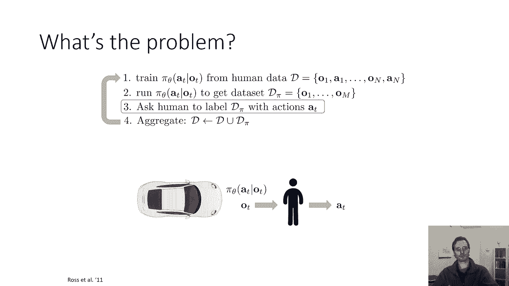
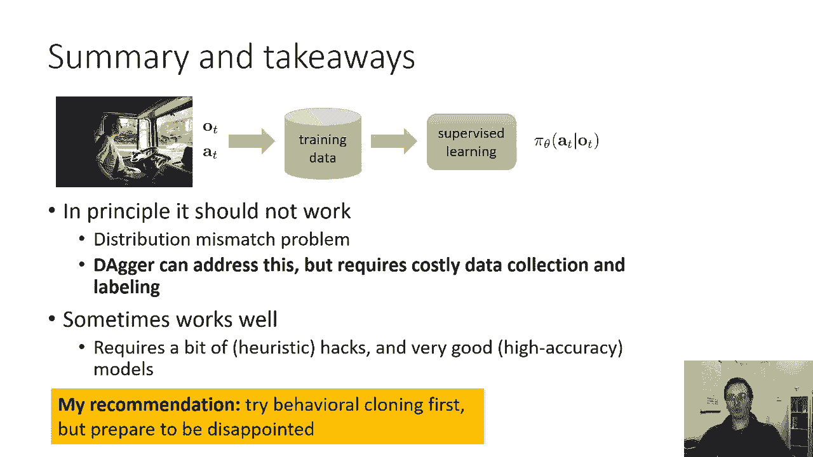
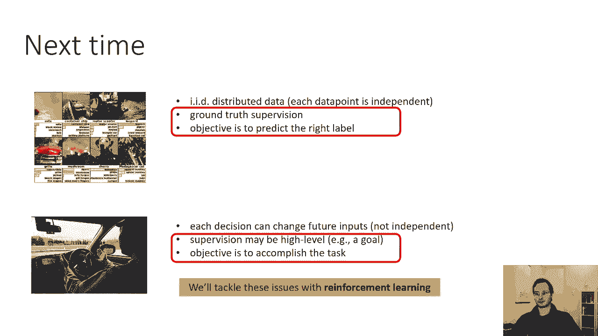

# P44：CS 182- Lecture 14- Part 3- Imitation Learning - 爱可可-爱生活 - BV1PK4y1U751

所以我们来讨论一下，呃，解决这个分布转移问题的更好方法是什么，所以我们之前讨论过，行为克隆的问题是由于当你采取行动时，你可能会犯错误，它会让你看到不熟悉的观察，与你在训练中看到的任何观察都不同的观察。

然后你可能会犯更大的错误，这些错误会加剧，所以从根本上说，问题归结为这样一个事实，即OT的P数据，生成训练集的观察值分布，与OT的p piθ不同，它是观察的分布，当你实际运行你的策略时，你会看到。

所以我们能让t的p数据等于t的pπθ吗，我们之前讨论过如果你的政策是完美的，那他们就平等了，但总的来说，这很难，那么我们能有一个保证以某种方式做到这一点的算法吗。

即使你的政策不完美从表面上看这似乎是不可能的，就像如果你的政策总是有错误，你怎么可能得到一个与真实观察相匹配的观察分布，关键的想法是，如果你不能修复政策，修复数据，所以我们要让t的p数据等于。

通过提高圆周率而不是太多，但是通过改进P数据，所以我们要聪明地收集数据，你不能总是这样，你并不总是可以选择如何收集数据，也许你的老板刚刚过来说，你知道的，我有开车的数据，这就是你要用的。

你得不到更多的数据，你只需要使用这些驾驶数据，我没事，那你就倒霉了，但有时你确实对收集数据的方式有一点影响，事实证明，如果你在这方面很聪明，你实际上可以解决这个问题，所以这是一种叫做匕首的方法。

它代表数据集聚合，dagger本质上是一种模仿的迭代算法，学习，以一种非常特殊的方式收集它，以避免这种分布转移问题，在某些情况下，匕首可以非常非常好地工作，但在其他情况下你不能使用它。

因为你不能用这种方式收集更多的数据，所以这里的想法是，匕首的目标是从P收集训练数据，πθOT代替OT的p数据，但问题是您仍然希望有监督的数据，你还想要人类行为的数据，对于每一个观察，你需要人类的地面。

真理，行动，所以你可以从p piθo t得到观测结果的方法，只是通过运行您的策略，πθa t给定ot，但是给它贴标签有点棘手，所以这是匕首的步骤第一步，获取人类给你的数据集，它由人的观察和行动组成。

并用它来训练您的初始策略，现在这项政策将容易受到分配转移的影响，因为训练集来自OT的P数据，所以我们要运行我们的政策，就像我们会用学到的政策来控制汽车一样，这将产生一些观察，意见，呃，那就会。

我们就叫他们d pi，其中一些观察可能相当糟糕，就像我展示的第一个视频，汽车撞上交通锥的地方，就像我们真的会这么做一样，我们会记录下它现在看到的很明显就像，在现实中，就像一个安全司机会按下红色的大按钮。

如果发生了非常非常糟糕的事情，但如果你小心，你有安全司机，你可以这样做，然后我们要做的是，我们要请一个人坐下来，给每一个观察结果贴上标签，我们实际上会让汽车行驶，它会击中那些圆锥。

然后我们会有一个人坐在前面，就像一个小玩具方向盘看到屏幕上的图像，我们会要求他们，基本上提供了在这种情况下他们会接受的转向命令，我们将把这些视为地面真相行动，然后我们在第四步中做的是聚合。

我们有这个标记为d pi的，我们把它连接到d，这给了我们一个新的数据集，现在更接近我们新政策的观察分布，然后我们重复这个过程，我们继续前进，我们现在可能会继续前进很多次，你可能会说在这一点上，等一下。

这似乎不应该起作用，因为你说过你希望p pi p数据与p piθ匹配，但你们结合得很好，为什么这最终会起作用的直觉，如果你把它们结合得足够多，最终数据集将由来自p piθ的数据主导。

所以最终这些分布在实践中会变得任意接近，你甚至不需要等那么久，在实践中，你实际上在那之前很久就有了很好的表现，对于为什么这是真的，实际上有一个更微妙的理论解释，如果你想要短的，快速而肮脏的直觉。

这是因为如果你收集了足够的数据，最终，p piθ样本占了原始样本的主导地位，所以这将修复分布转移，这实际上会老实说，修复问题，如果你能做到这一点，效果非常好，这是原匕首纸的视频。

它展示了匕首算法训练无人机绕着一些树飞行，现在这实际上是你知道的，来自2011年的稍微古老的单词，所以他们实际上不使用深度学习，尽管该系统的最新版本在这里确实使用了深度学习，他们实际上只是用了本质上。

呃，类似于逻辑回归风格的东西，这就是匕首算法，现在，匕首到目前为止有什么问题，我刚刚告诉了你一些好的方面，它解决了分配转移的问题，匕首的问题通常是第三步有时是第二步，所以第二步可能会有问题。

如果运行系统真的不安全，或者如果这实际上是不可能的，第三步可能会有问题，因为人类有时不太擅长做决定，当系统对它们没有反应时，所以这是一种非常不自然的收集数据的方式，你喜欢开车的地方。

但车实际上对你没有反应，因此，人类有时不能给出很好的标签，所以这有时会很困难，现在有各种各样的方法来缓解这种情况，就像你可以，比如说，在某些情况下，人类实际上接管了并实际上提供了正确的驾驶命令。

在某些情况下，这也可以起作用，但总的来说，这种匕首式算法的主要缺陷，他们的数据收集协议有点繁重，所以很吸引人，只要取一个数据集，运行行为，在上面克隆，并立即得到一个，得到保单，重新部署该政策不太吸引人。

你知道的，在现实世界中，收集更多数据，得到更多的人力监督等等。

所以原则上总结和总结这次讨论的要点，行为克隆不应该起作用，因为分布在原则上很大，匕首可以解决这个问题，但它需要昂贵的数据收集和标签，但这是对所说问题的原则性解决方案，有时行为克隆无论如何都很有效。

它需要一点启发式的技巧和非常好的高精度模型，所以我的推荐，如果你想解决一个模仿学习问题，首先尝试行为调用，但准备失望吧，所以试着听康妮尽你最大的努力，但如果它不起作用，可能就是这样。

然后你需要更聪明的东西，比如匕首或强化学习方法，我们下周将讨论。

所以下次我们要做的是，我们实际上要讨论第二和第三个要点，所以在今天的讨论中，我们主要讨论了非iid数据的问题，但我们仍然承担地面真相监督，我们仍然假设人类实际上给了我们地面真理行动。

下周你应该做一个给定的观察，我们将讨论完全强化学习设置，而不是地面真相行动监督，你会以奖励函数的形式得到一些高水平的目标，我们将讨论算法，可以学习成功实现这些目标的政策。

