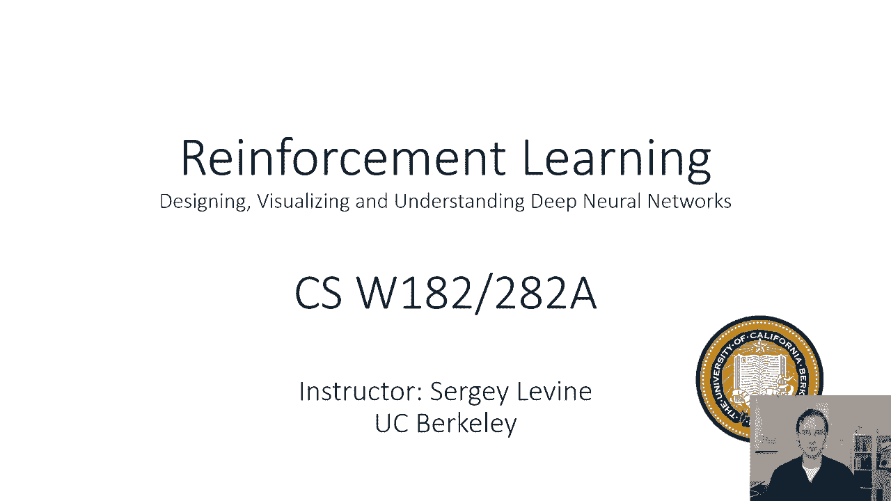
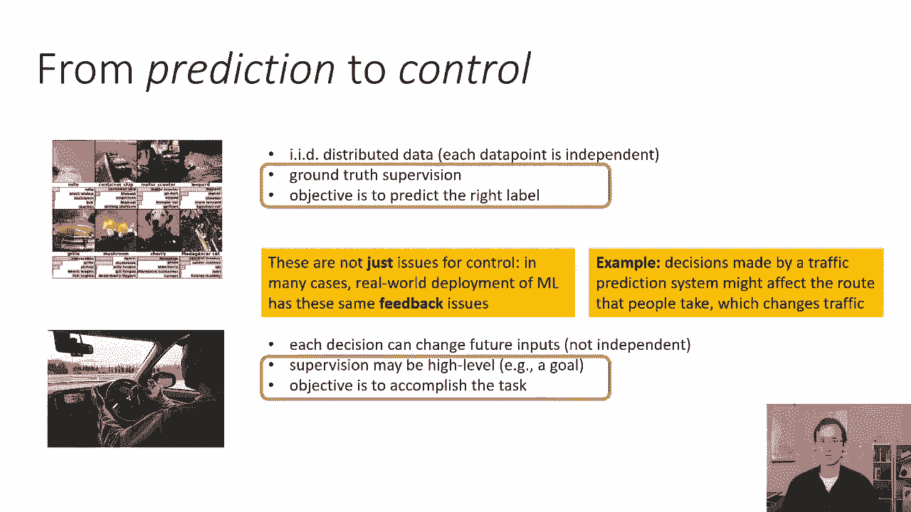
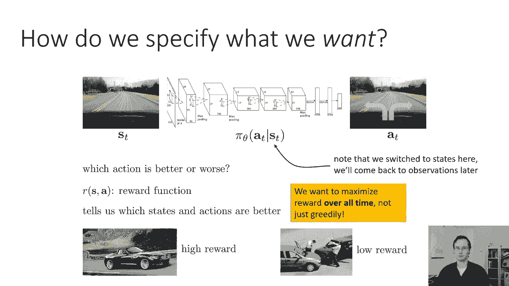
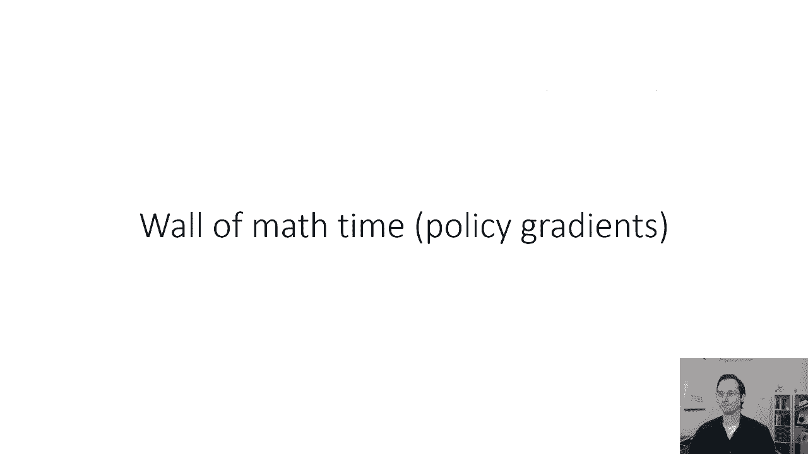

# P45：CS 182- Lecture 15- Part 1- Policy Gradients - 爱可可-爱生活 - BV1PK4y1U751

欢迎来到今天的第十五讲，我们将继续讨论上周开始的基于学习的控制，和覆盖强化学习，我们将有两次强化学习讲座，今天我们将介绍基本概念和一些基本的强化学习算法，周三的讲座，我们将更深入地研究其中的一些想法。

所以简单回顾一下周三的一些讨论，这部分课程的目标是讨论我们如何，从预测到控制，所以预测问题是像识别图像中的物体这样的问题，从文本中识别情感，将给定输入映射到地面的问题等等，IDID设置中的真值输出。

相反，控制问题是像控制自动驾驶汽车这样的问题，例如，需要顺序决策的任务，使预测问题具有独立分布的IID数据，这意味着您对特定图像的预测输出，不会影响你下一个看到的图像。

或者至少这是你在构建学习算法时的假设，虽然那往往不是真的，在实践中，在控制中，每个决策都可以改变未来的输入，所以你不再有这个假设，比如说，如果你以特定的方式转动汽车的方向盘。

这会影响汽车摄像头接下来看到的东西，预测，你也假设你有地面真相监督，而在控制中，你的监督可能是一个很高的目标，在预测中，目标是预测正确的标签，而在控制中是完成给定的任务。

所以上周周三我们讨论了一个简化的设置，我们确实有地面真相监督，在今天的讲座中，以一个人的地面真理行动的形式，我们不会有这个假设，记住，当然，正如我上周提到的，这些不仅仅是控制的问题，在许多情况下。

机器学习系统的现实部署，即使是预测系统也有同样的反馈问题，所以即使您假设数据是IID，当你训练你的对象分类器时，如果你在现实世界中部署它，基于这些预测的决定实际上可能会影响哪些数据，你的模型得到了例子。

我上周有一个交通预测系统，在那里你有一个模型来预测交通堵塞的可能性有多大，然后你知道把这个模型的结果给用户，也许通过谷歌地图之类的东西，然后用户根据这些预测来决定在哪里开车。

我们做出的那些预测实际上并没有实现，所以这些反馈问题甚至会困扰常规的预测系统，当它们部署在现实世界中时，顺序反馈回路，所以在今天的讨论中，我们将主要关注更经典的决策领域，像这种自动驾驶设置这样的域。

但请记住，这些相同的想法可以更广泛地应用，上周我们讨论了如何在地面真相监督下做出决定，也就是模仿学习，在今天的讲座中，我们将解决高水平目标的问题，我们将真正定义全面强化学习的问题设置。

你不再有地面真相监督，讨论一些最初的算法来解决这个问题。

那么我们如何指定我们想要的，在我们指定我们想要的东西之前，使用由人类专家提供的一组状态操作元组，然后我们可以模仿人类专家，数据隐含地编码了人类希望机器做的事情，但如果我们没有呢，作为旁白。

我们将坚持各州，而不是我们今天讲座讨论的观察，这有一个技术上的原因，在讲座快结束的时候会变得很明显，就目前而言，只是别担心，但是我们现在做的技术假设，你输入到你的网络中的任何东西都足以完全推断状态。

这意味着它服从马尔可夫性质，这意味着如果你得到当前的观察，来自相机的当前图像，以前的图像不会帮助你知道该怎么做，总的来说，这实际上不是真的，但在强化学习中，这是一个非常方便的假设，所以说。

如果你没有人类专家提供的这些基本真相状态动作元组，你怎么知道哪些动作是好的还是坏的，嗯，我们可以做的一件事是我们可以定义所谓的奖励函数，奖励函数是关于状态和行为的标量函数。

它基本上给每个州或每个在行动的州打分，很多时候，奖励功能实际上只依赖于状态，但总的来说，它们可能取决于状态和行动，直觉上，分数告诉你这是多么令人向往，如果你想开车，你可能会说嗯。

汽车朝着正确的方向行驶的状态，在路上有很高的报酬，汽车碰撞的状态有一个较低的，但重要的是要注意，你的目标不仅仅是贪婪地采取行动，会给你最高的奖励，实际上是为了最大化回报，在连续决策过程的持续时间内。

所以如果你要开车，三个小时吧，你希望这三个小时的总奖励最大化，所以在任何给定的瞬间，例如，你可能会发现，贪婪的策略只会把车引向想要的方向，即使有什么东西挡住了去路，因为它不会立刻发生碰撞。

所以我们会因为走在正确的方向上而得到很高的奖励，但如果后来这个决定导致了碰撞，它就会得到很低的奖励，所以说，贪婪的决定，制造系统总是选择现在给出更高回报的东西，即使以后会导致灾难，一个好的。

强化学习系统应该避免，它可能会做出现在回报较低的决定，为了以后更有收获，这实际上是强化学习的关键组成部分，这种长期推理的概念，你可能会选择做一些现在不太好的事情，以后收获更大的回报。

所以我们想在所有时间里最大化回报，不仅仅是贪婪，如果我们想贪婪地最大化它，我们可以用上周的方法，对呀，因为上周，我们认为我们本质上有算法，会贪婪地试图预测正确的行动，你可以做到这一点，如果你的监督很强。

如果它直接告诉你采取哪种行动，但如果你的监督更弱，那么你需要对你的行为对未来奖励的后果进行推理。

所以让我们来看看一些定义，所以我们首先要定义的是，为了完全指定一个强化学习问题，叫做马尔可夫决策过程，马尔可夫决策过程与马尔可夫链密切相关，它是以安德烈·马尔科夫的名字命名的。

他是20世纪20年代初的数学家，十九世纪末二十世纪初，马尔可夫决策过程实际上并不是安德烈·马尔可夫发明的，它是，呃，实际上并不完全清楚它是由谁发明的，但它显然是由理查德·贝尔曼在20世纪50年代推广的。

这是一种将马尔可夫链扩展到，你可以选择的行动和你想要最大化的奖励，所以你可以用四件事指定一个马尔可夫决策过程，实际上是五件事，有时是六件事，但我们现在就说四个吧，我告诉你吧，其他的就在一秒钟内。

但你绝对需要的四件事是状态，行动，过渡，概率和奖励，所以S是一组状态，这是一套，该集合中的每个状态都可以是离散的，也可以是连续的，由你来定义你的状态，就像你定义神经网络的输入以进行监督分类一样。

您为马尔可夫决策过程定义您的状态，那些州可能是呃，低维，就像，比如说，你的车在路上的位置，它们甚至可能是高维度的，你可以定义你的状态，例如直接，汽车摄像机观察到的图像，有一个重要的警告。

他们确实需要马尔可夫，这意味着当前的图像必须足以推断未来发生的一切，过去的图像不应该对此有所帮助，它不需要足以推断一个确定性的，比如，系统中仍然可能存在随机性，但你不能有一个情况。

你可以从过去的图像中找出一些东西，你无法从水流中弄清楚，这在技术上对自动驾驶来说是不正确的，但对于其他设置也可能是真的，就像你在下棋，一张棋盘的图片实际上告诉了你你需要知道的一切，游戏的状态。

你的另一套是一个，也就是动作空间，动作空间是一组动作，一次又一次，动作可以是离散变量或连续变量，一起，状态和动作定义了受控马尔可夫过程，它基本上是一个带有动作的马尔可夫链，所以在一个规则的马尔可夫链中。

你只会有状态，在马尔可夫决策过程中，你会有转移概率，或者受控马尔可夫过程，你有状态和动作，和下一个状态的概率，s t加1的p取决于s t和a t，转移算子T基本上定义了这些概率。

所以mdp定义中的t指的是这个概率分布，它有时被称为跃迁算子或跃迁概率或动力学，那些都是同一件事的同义词，基本上，给定当前状态，下一个状态的概率，它通常被称为大写T，然后你有R，也就是奖励功能。

奖励功能，映射状态操作，标量值奖励的元组，因此，从a到，所以说，我们可以这样定义马尔可夫决策过程，我们可以定义的对象，这在强化学习中也很有用，我们将在本课程中详细讨论，但重要的是你要知道。

如果你稍后看到它，是部分观察到的马尔可夫决策过程，部分观测到的马尔可夫决策过程将观测引入混合，所以在部分观察到的马尔可夫决策过程中，你有像以前一样的状态和动作，但现在你也有了一个观察空间。

你也有一个发射概率，所以状态和动作的工作方式和以前一样，观察空间也是一套，这是一组观察，所以你可能有，比如说，状态是汽车的位置，观察是图像，这些对象之间的关系由这个贝叶斯网给出，这是我们上周看到的。

您有一个像以前一样的转换运算符，但现在你也有一个发射概率，给定st的OT的p和一个奖励函数，它又定义在状态和动作上，现在我们不打算讨论部分观察到的马尔可夫决策过程，我们只有两节关于RL M的课。

它们不在这门课的范围之内，但如果你看到他们，你知道以后，请记住，这只是常规马尔可夫决策过程的一个小扩展，这引入了潜在的非马尔可夫观测，我们将要讨论的一些算法可以部分地处理，很容易观察到马尔可夫决策过程。

而其他一些确实需要一个完全观察到的规则马尔可夫决策过程，所有的权利，那么强化学习的目的是什么呢，我们可以将强化学习问题形式化如下，我们有我们的政策，就像以前一样，一次又一次。

我们稍后会回到部分观察的情况，非常简短，策略有参数，我们称之为θ，这些是网络中每一层的权重，状态作为对该策略的输入，动作作为输出产生，然后世界根据这些未知的跃迁概率产生下一个状态。

下一个状态仅取决于当前状态和策略选择的操作，然后这就成为政策的新状态，好的，所以这只是顺序决策过程，和，顺序决策过程导致在状态和动作序列上的分布，所以你可以说看到状态1的概率，那么动作一，然后状态二。

然后动作二，等等，等等，等等，一直到S首都T，大写T可以作为三种术语的乘积给出，初始状态概率分布，这只是由世界时报决定的，在给定s t乘以s t的p的所有时间上的乘积，加一给定s d a t。

这个公式是从概率链式法则得到的，然后将独立性应用于马尔可夫决策过程贝叶斯网，所以有一定的依赖性，比如说，上一个状态独立于下一个状态，给定当前的，因为这些依赖关系，当你写出概率链式法则时。

它实际上是这样简化的，所以这给了我们一个状态和动作序列的分布，我们可以根据这个分布来定义强化学习的目标，所以为了速记，我将把状态和行动的顺序称为tau，所以如果你看到我写tau的p。

这真的意味着p of s 1 a 1 s 2 a 2，这里的天赋代表轨迹，你可以写下强化学习的目标作为期望值，关于Tau的p theta，所以最优参数θ是期望最大化的参数，在tau的pθ下，总数的。

在行动中的状态评估的奖励的所有时间步骤，在那个时候的步骤，所以稍微解开这个语句，由MDP定义的初始状态分布和跃迁概率，以及由参数定义的策略，θ在整个状态和作用序列上诱导联合分布，It’一个一个两个。

两个等等等等，和，强化学习的目的是最大化总奖励的期望值，在此分配下，这只是另一种说法，选择导致最大奖励的策略参数，除了那个，当然啦，任何给定的策略参数都将导致在状态和操作上的分布。

所以你真的想要最大的回报，理解目标的真正含义是非常重要的，所以如果你有点不清楚，你知道的，考虑添加一个评论或来课堂讨论这个，如果是，你也可以试着看刚才的几分钟，因为理解这个目标真的很重要。

为了让接下来的一切对你来说都有意义，现在，你可能会注意到的一件事是，π和p在一起，实际上在，这是一个小细节，我们不打算谈太多这个，其实有一秒钟，状态和作用上的更高层次马尔可夫链。

由策略的乘积和转移概率定义的，这可以用来导出RL的无限视界目标。

