# P50：CS 182- Lecture 16- Part 3- Actor-Critic & Q-Learning - 爱可可-爱生活 - BV1PK4y1U751

在今天讲座的最后一部分，我们将导出一个完整的深度Q学习算法。

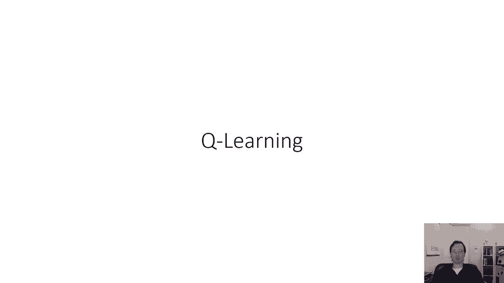

这是我们以前看到的全拟合Q迭代法，我们可以把这个推广开来，就像我们将批处理模式演员批评推广到在线算法一样，获取在线队列学习方法，所以在线Q学习方法会采取一个单一的动作，并观察一个转变s a s素数r。

它会在单个跃迁r加上gamma乘以max上计算一个目标值，在Q phi的质数上，然后呢，它需要一个梯度步骤来最小化估计的Q值之间的误差，q phi s a和目标值y。

所以这就像在线版的演员评论家只针对Q值，它在环境中走了一步，观察一个转变，计算一个目标值，然后进行SGD的一个梯度步，这有时被称为沃特金斯Q学习，这是Q学习的一个非常经典的算法。

本质上构成了现代深度Q学习方法的基础，但要让它在实践中很好地工作，我们需要在几个方面进行修改，解决这种方法与深度神经网络结合时的一些主要缺点，所以我们必须做出的一个选择是我们如何选择行动。

现在这个算法是关闭策略的，这意味着您不必选择使用Argmax策略的操作，为了让它工作得很好。

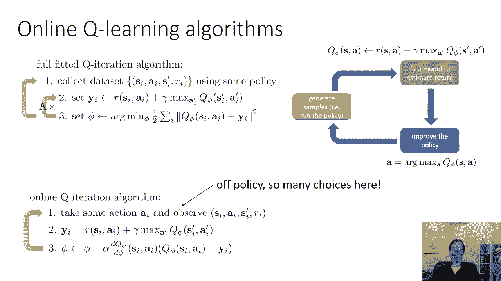

所以你有很多选择，本质上，你想做的是你想选择执行有效探索的行动，那是什么意思，您可以根据ARG MAX策略选择操作，但这实际上不是一个很好的主意，花点时间想想为什么这可能不是个好主意。

如果您总是使用Arc Max策略选择您的操作，可能会出什么问题，嗯，问题是，如果您使用Arc Max策略选择您的操作，你的初始Q函数很糟糕，它可能会错误地给一些非常糟糕的行为分配一个很高的概率。

把你引向死胡同，如果你总是选择那个动作，你可能永远看不到环境的其他部分，你可能总是做同样的坏事，永远不会发现还有更好的东西可以给你，所以说，在第一步中，你想做的是确保其他不是，你目前认为最好的动作。

有一定的非零概率被选中，一个非常常见的策略是，所谓的Epsilon贪婪探索策略，在Epsilon贪婪探索策略中，你选择一个叫做Epsilon的小数字，这是你探索的概率，然后在概率为1减去ε的情况下。

你选择弧最大作用，然后用概率epsilon，我们在其他可能的动作中随机选择，这意味着概率ε，做一些概率为1-Epsilon的随机事情，做你认为最好的事，这有点像，如果你在决定去哪家餐馆。

你去你最喜欢的餐馆，通常你想这么做是因为你想去你喜欢的地方，但有一些小概率，你随便挑一家餐馆看看是否更好，另一种更复杂更常见的策略，更先进的算法是使用所谓的玻尔兹曼探索。

这里的想法是Epsilon贪婪有点天真，因为它并没有真正区分除了arg max之外的不同动作，可能会有一些你确信的行动，那个动作真的真的很糟糕，也许你只是不想接受，玻尔兹曼勘探设定不同行动的概率。

与它们Q值的指数成正比，这意味着非常好但同样好的行动，被选中的概率相等怎么样，而你知道非常糟糕的行为被选择的概率很低，所以策略可能太普遍了，我想推荐的是，如果你刚刚开始，你想要一些策略来让你开始。

使用Epsilon贪婪，因为它非常简单，很容易调整参数，基本的Q学习算法还能出什么问题，一个大问题是，在第三步中，我们要采取梯度下降步骤，随机梯度下降步长，我们可能会认为这会收敛，不幸的是。

Q学习不是梯度下降，记住目标值y本身取决于q函数，但是当我们计算梯度第三步时，我们忽略了这一点，我们把你当作一个常数，所以出于这个原因，Q学习不是很有规律的梯度下降。

这意味着要让它很好地工作并不那么容易，另一个大问题是，如果您正在运行联机队列，学习下一次看到的状态，步骤将与您在前一个时间步骤中看到的状态相似，所以，即使第三步看起来像是在做随机梯度下降。

这实际上不是正确的随机梯度下降，正确随机梯度下降，要求您从缓冲区中对数据点ID进行采样，您在这里得到的下一个状态元组的状态操作绝不是iid。

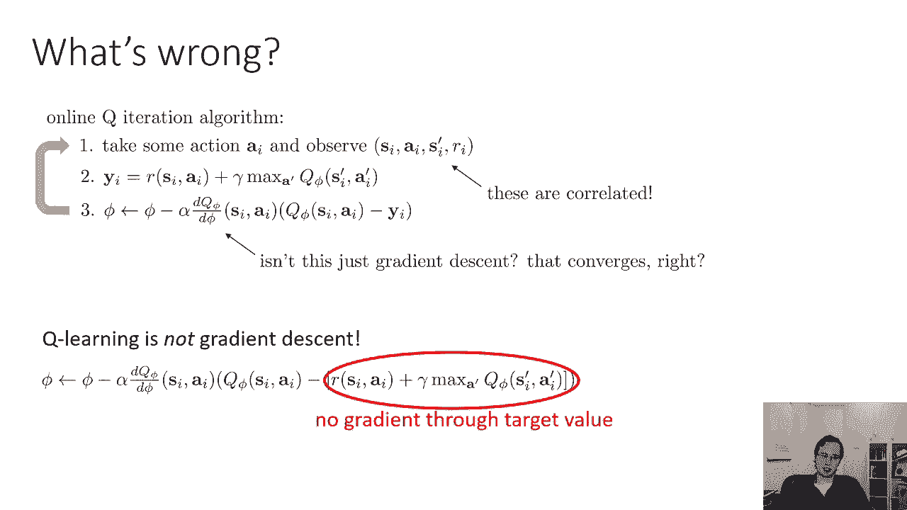

它们之间有很强的相关性，这可能会给随机梯度下降带来很大的问题，顺序状态密切相关，目标值总是在变化，所以这会给你带来很多麻烦，假设这是你的轨迹，你正在沿着这个轨迹前进，最初。

您将在早期的步骤上更新您的Q函数，然后你会更新这些点，然后这些点，然后这些点，可能会发生的是，你可能会反复过度适应这些局部相关的样本，从来没有真正学会真正的功能，所以你就。

你只会在不同的过度适应制度之间滑行到不同的地方地区，而不捕捉全局结构，因为你没有取样，IID减轻损失的一种方法，这是使用所谓的重播缓冲区，这个想法实际上是做一些更类似于完全拟合队列迭代的事情。

但仍然保留了在线方法的味道，所以记住在完全拟合的Q迭代中，我们将使用一些策略收集数据集，然后对该数据集进行多次训练，在某种意义上，在线Q学习是这种全拟合Q迭代算法的一个特例，其中k等于1。

我们基本上不在目标和回归之间交替，第三步只有一个渐变步，这给了我们在线Q Q迭代算法，现在请记住，任何政策都将发挥作用，只要这种广泛支持，所以我们可以做的是。

我们可以在Q持续时间的完全适合时修改以从缓冲区加载数据，所以我们基本上可以边走边存储数据，到了更新的时候，我们不更新最新的过渡。

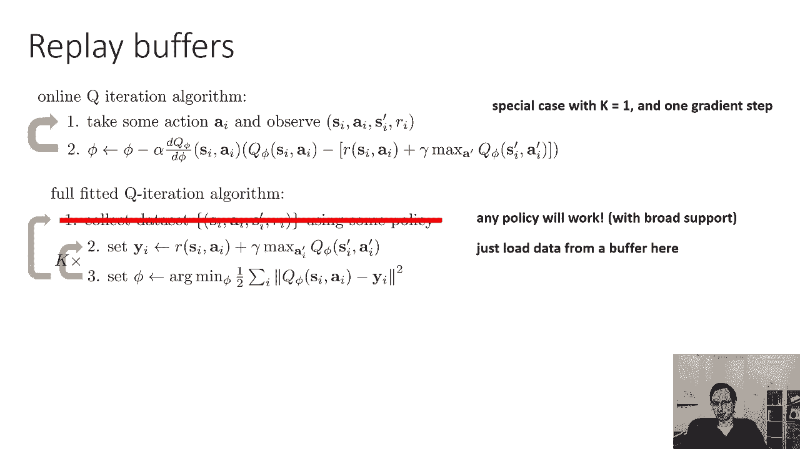

我们实际上加载了一批转换，从我们到目前为止看到的所有转变，所以你可以把它看作是有一桶过渡，你边走边往桶里加。

在背景中，甚至可能在一个单独的线程中，您正在更新那个桶，所以现在使用重播缓冲区的Q学习将看起来像第一步示例，从缓冲区的一批转换，其中包含到目前为止看到的所有转换，第二步在小批处理上更新你的Q功能。

现在这看起来更像是迷你批量渐变下降，你的样本不再相关，你在一批中有多个样品，所以你不是，您不是在做这些单一示例SGD更新，但是数据是从哪里来的呢，因此，您需要定期向重播缓冲区提供。

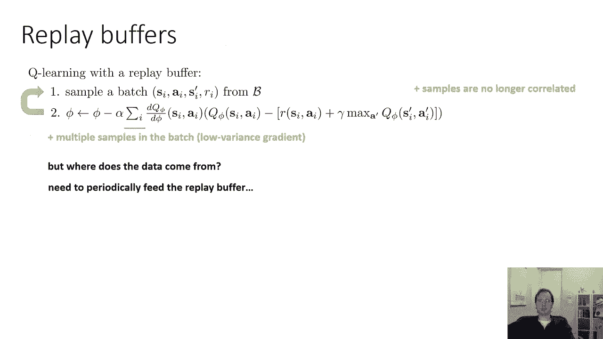

所以你要做的是当你收集数据的时候，你不断地把它添加到缓冲区中，如果你的缓冲区太大，然后抛出最古老的数据，这是一个非常好的策略，所以对于使用重播缓冲区的Q学习，如果你想把一切都放在一起，看起来是这样的。

使用一些策略收集一些数据，并将其添加到缓冲区中，就是这部分，第二步从缓冲区中取样一批，第三步使用小批处理梯度下降对该批处理进行更新，然后回到第二步，不重复这些步骤使k等于1是很常见的。

所以基本上从缓冲区更新中收集数据到缓冲区样本，并收集更多的数据，但您也可以重新采样并采取多个步骤，这可以更有效率，如果你想非常小心地保存样本的数量。

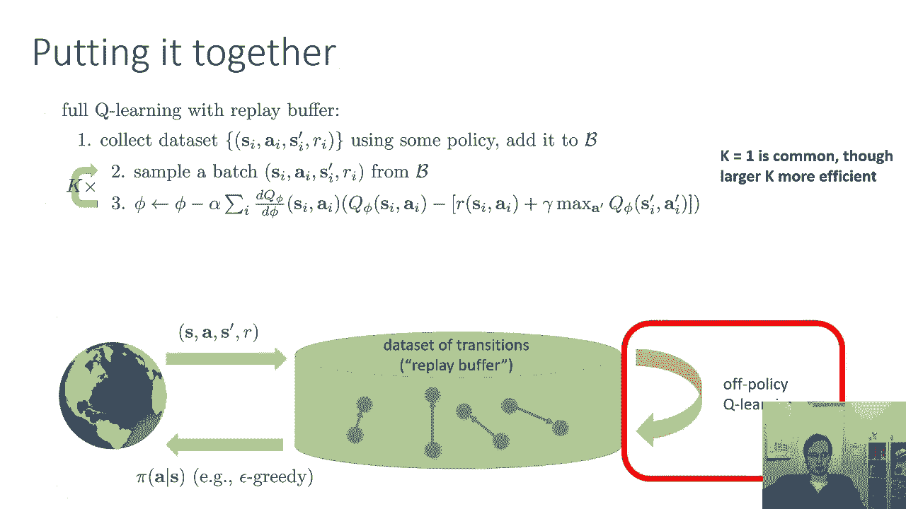

好了现在，还有一个问题仍然存在学习不是分级下降，目标值取决于我们当前的Q函数，会给我们带来很多麻烦，它可能会导致Q函数追逐自己的尾巴，从某种意义上说，因为目标总是在变化，它试图击中一个移动的目标。

所以您可以使用重播缓冲区来解决相关性问题。

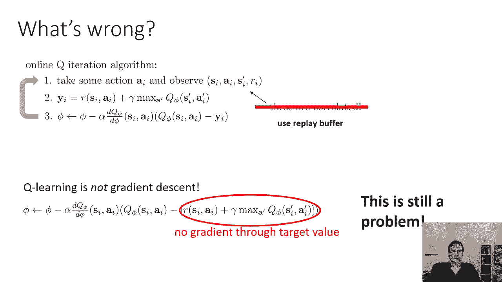

但这个移动的目标仍然是个问题，Q学习看起来很像监督回归，但它不是完全拟合的Q迭代算法确实有第三步，它是监督回归，它在相同的目标上采取多个步骤，那部分是稳定的，所以我们能做的就是。

我们可以让我们的在线算法看起来更像完全拟合的Q迭代，我们能做到这一点的方法基本上是减缓我们的目标，对呀，所以在拟合Q迭代中，因为我们选择了我们的目标值。

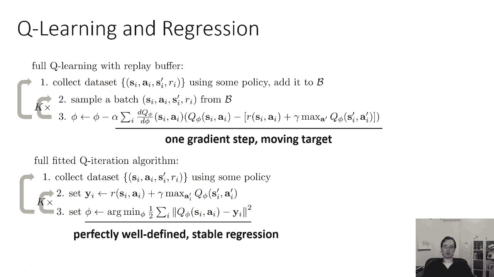

然后我们从许多步骤倒退到它们，这是一个稳定的回归问题，下面是我们如何降低目标值，我们用一种叫做目标网络的东西来做，所以我们使用一些策略收集数据集，添加到我们的缓冲区中，我们从缓冲器中取样一批。

然后当我们在长凳上进行梯度下降时，我们不使用相同的q phi来计算我们的目标值，我们用一个不同的Q phi素数，参数phi素数是通过复制这五个参数得到的。

所以你可以把Q phi Prime看作是一个旧的副本，Q phi的一个非常古老的副本，这意味着目标在内部联赛中不会真正改变，它们变化很少，这意味着第二步中发生的一切，三个，四是监督回归。

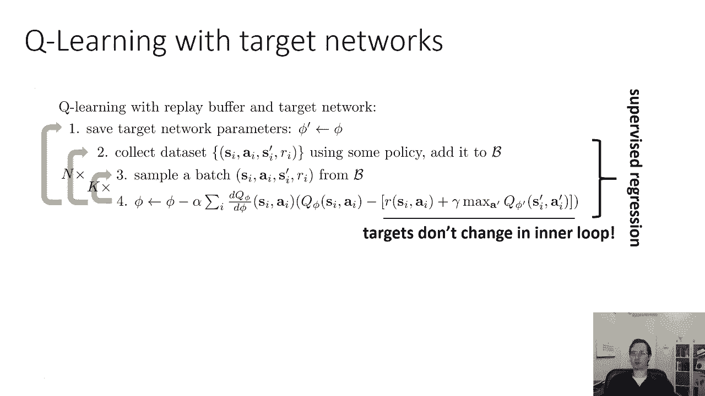

然后第一步基本上改变你的回归目标，这给了我们一种经典的深度Q学习算法，有时也称为DQN，经典的深度Q学习算法采取了一些行动，观察过渡，将其添加到缓冲区中，从缓冲器中取样一小批，计算目标值，使用目标网络。

Q五个主要更新，采取一个迷你批量梯度下降步骤，然后每n步，n可能是一万，用最新的罚款代替五个Prime，但是，请记住，这个算法只是更一般的，物理迭代配方，这是一个非常古老的食谱，但是这个特殊的实例化是。

你知道的，特别简单通俗，它们基本上是k等于1的特例，呃，n等于1或者对不起。

n等于一万。

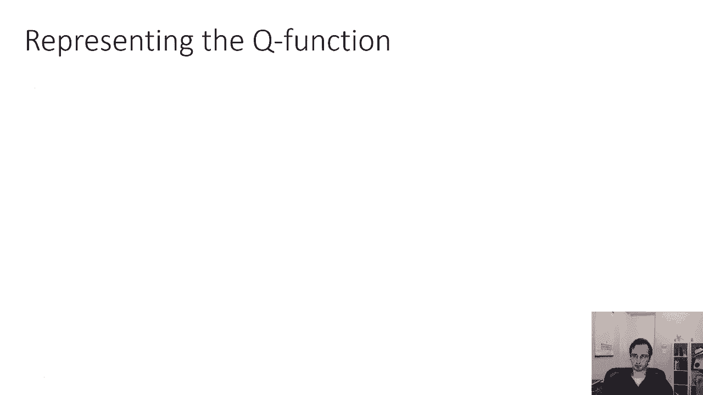

好的，所以这是算法，呃，比如说。

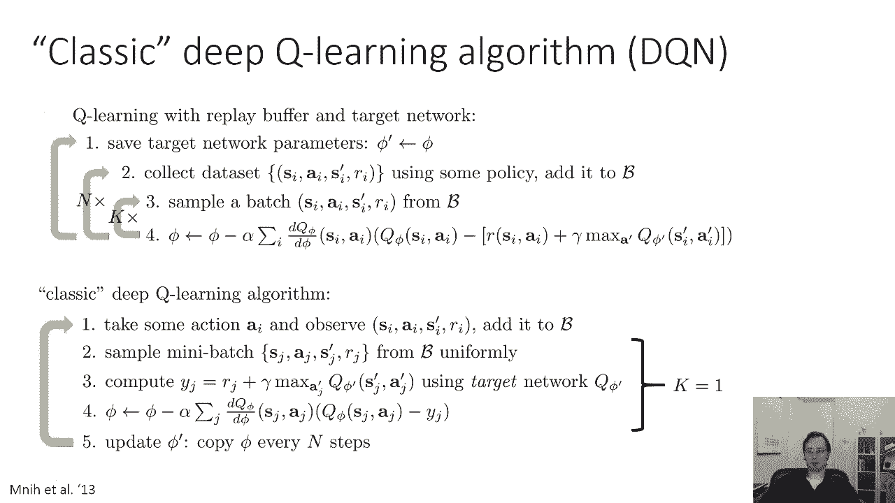

您可能会在家庭作业中实现，到目前为止，我们讨论了算法，我们没有真正谈论网络或表征，所以在我们得到一个完整的，呃，深度Q学习法，我们必须讨论如何实际表示Q函数，有几个选择。

一个非常经典的选择被表示为一个神经网络，它采取一个动作的状态，作为输入和输出，输出标量值Q值，这在连续动作中更常见，另一个选择是有一个网络，它输入一个状态，并为每个可能的操作输出单独的数字。

对于离散的动作，这可能非常方便，因为这样很方便在Q学习中获得最大值，你一直在服用这个最大值，所以如果你的神经网络用一次向前传递输出所有的值，很容易得到那个最大值。

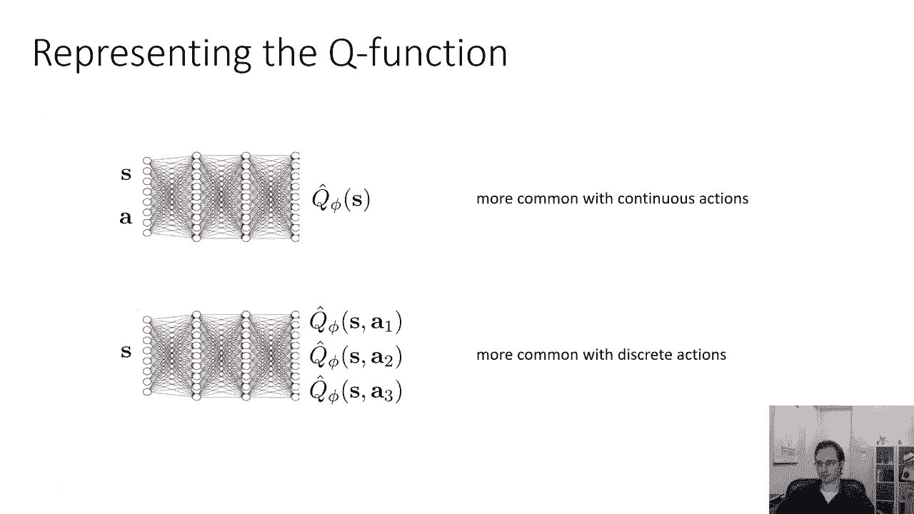

现在作为一个旁白，让我简单地回到演员评论家，我到目前为止描述的在线Q迭代算法，包括添加重播缓冲区和目标网络的版本，与连续动作和离散动作一起使用可能非常不方便，这很棒，因为最大值很容易用连续的动作计算。

可能会很不方便，虽然不是不可能，主要是因为最大，因为如果你有连续的动作，Max实际上需要持续的优化，我们可以做到这一点，我会在这节课的最后展示一个例子，一个算法确实做到了这一点，但这有点棘手。

有点不方便，所以如果你有连续的动作，实际上使用演员评语要方便得多，但如果你想保留Q学习的非政策性质，仍然使用演员评论家，你实际上可以用Q函数做演员评论家，这可以非常非常好地工作。

它实际上是最广泛使用的现代演员评论算法的基础，所以不在保单上是很好的，如果您想要一个非策略演员批评算法，这是食谱，采取一些行动，观察一个过渡，将其添加到缓冲区中，从该缓冲区中对一个小批处理进行采样。

现在计算你的目标值，但不是拿最大值，使用一个演员网络PI素数θ，基本上假设圆周率质数θ离斧头足够近，然后对批评家采取渐变步，就像Q学习一样，然后使用策略梯度对参与者执行梯度步骤。

然后为Q函数更新目标网络，演员每走N步就有一个目标网络，所以这是一个演员评论家的非政策Q函数版本，它实际上工作得很好，它是非常广泛使用的算法的基础，如软演员评论家，这是持续行动的标准，但对于离散的动作。

你真的不需要演员和Q学习实际上效果很好。

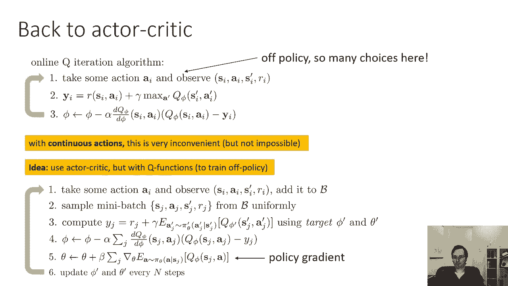

Q学习的一些实用技巧，如果你真的想在实践中使用深度Q学习，你知道，这节课的材料给了你一种理论，背景，而是在实践中实施，首先你需要一些技巧，Q学习需要很多小心才能稳定，如果你把它编码起来，正如我所描述的。

你运行它，你可能首先会看到性能会上升一点，然后它就会下降，然后就会很糟糕，然后你的算法就会这样工作，调整Q学习的超参数往往需要更多的时间，比常规监督学习更消耗，测试一些简单的是个好主意，可靠任务。

非常简单的第一次测试，比如可能负责一维状态或网格世界，以确保您的实现实际上是正确的，所以你知道，下面是学习曲线的一些实际例子，其中x轴是样本数，而垂直轴是策略的实际表现。

从2015年的报纸上看一些雅达利游戏，你可以看到一些游戏，比如乒乓球，这真的很容易，上去然后熬夜，但是其他一些游戏，比如视频，弹球与冒险，它们不停地上下摆动，因此。

在非常简单的任务上调试算法是非常重要的，在尝试更难的任务之前确保它是正确的，因为事情可能没有那么简单，大的重播缓冲区往往有助于提高Q学习的稳定性，所以不要害怕使用重播缓冲区，有多达一百万或更多的转换。

它基本上使它看起来更像是解决这些问题的拟合Q迭代，呃，相关的，样品和呃问题，一般来说，Q学习需要时间，在很长一段时间里，可能并不比随机好，然后它可能会开始上升，这是因为Q学习是一个探索挑战。

所以有规律的监督学习，如果你把你的学习曲线形象化，你可能马上就会看到事情变得很好，然后花很长时间才能达到最大的性能，所以如果早期进展迅速，你看到了不同的东西，你会看到更多的S形曲线。

在那里很长一段时间什么也没发生，在这段时间里，基本上是随机探索，试图发现好的行为，一旦它发现了一些好的行为，你通常会看到快速的改善，然后事情又稳定下来，你可以看到，在顶部的乒乓和突围地块中。

因为这个原因，从高勘探开始是有帮助的，较大的Epsilon值，所以通常你会使用一些衰变时间表，您可能会将Epsilon设置为当前迭代的函数，一开始真的很大。

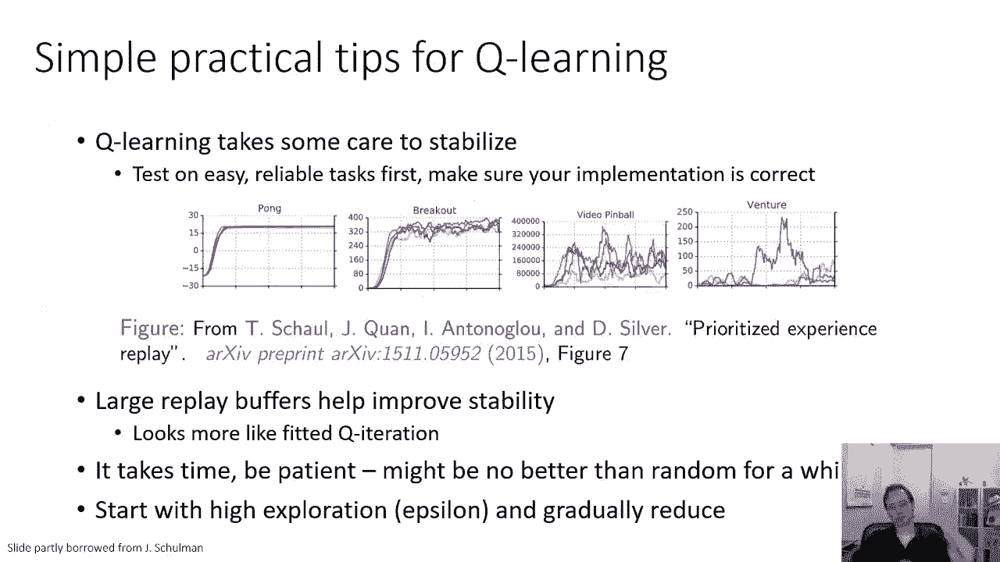