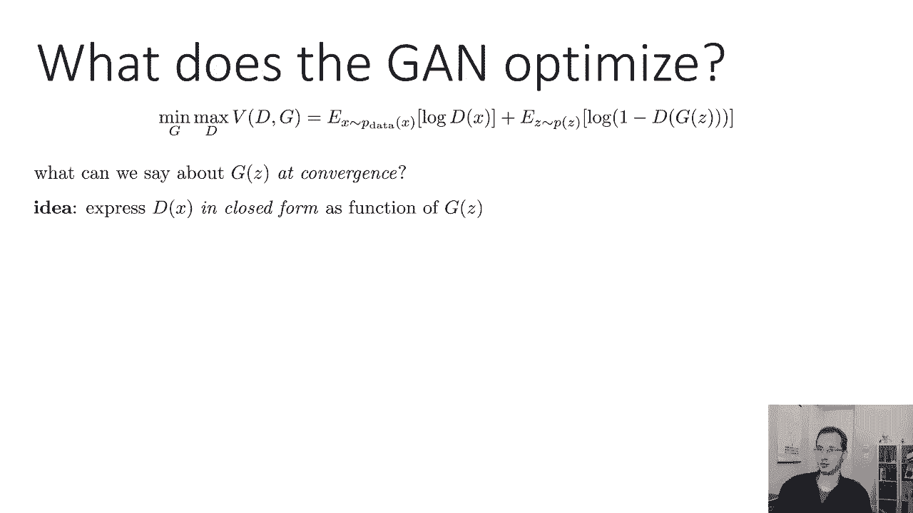
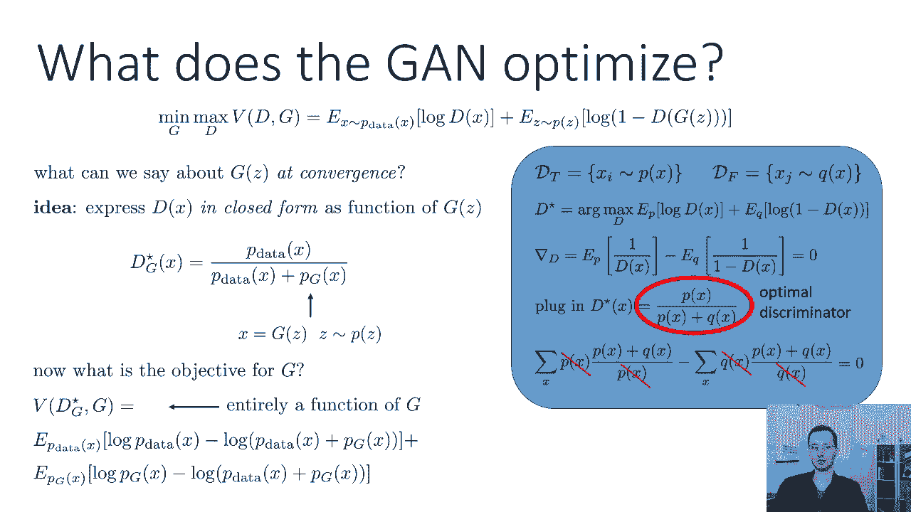
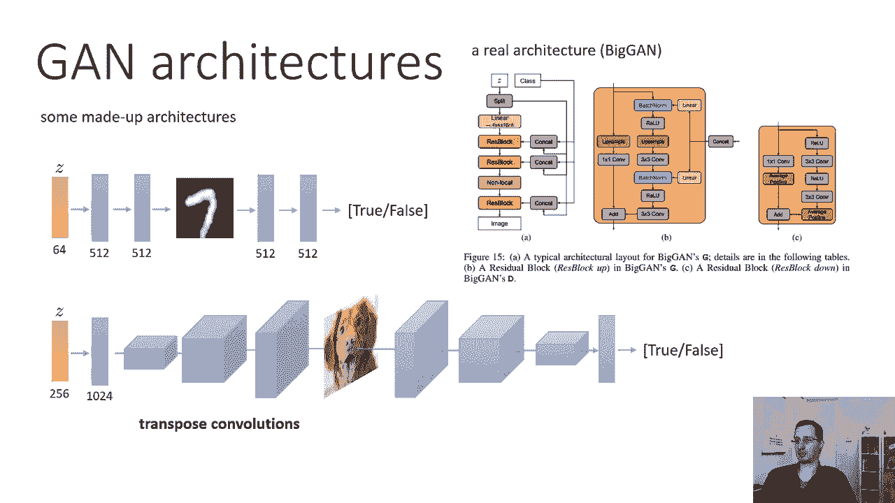
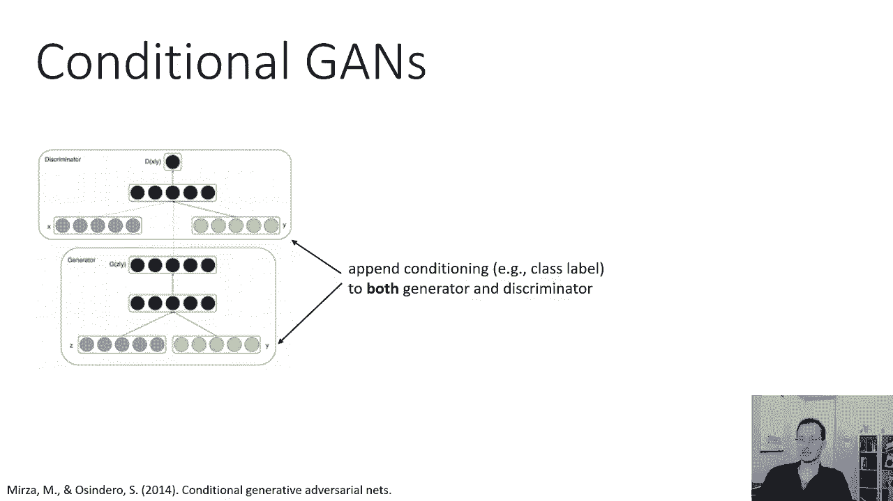
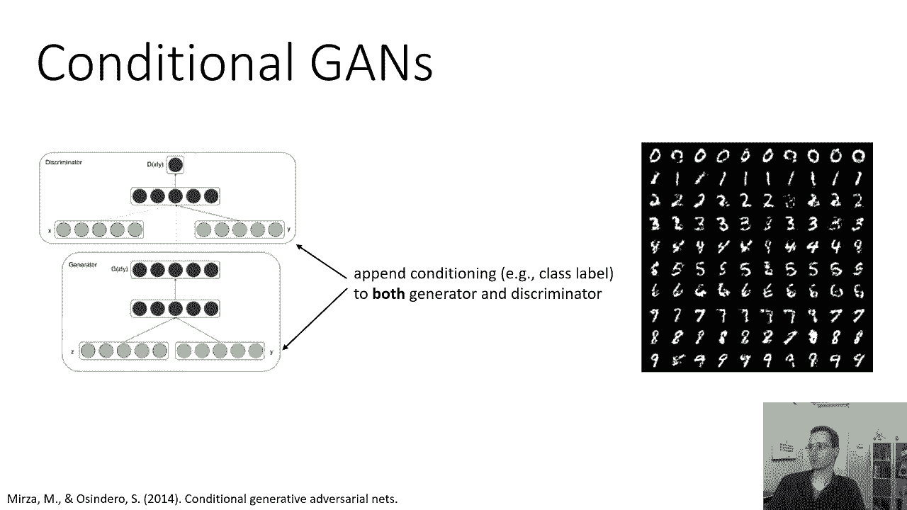
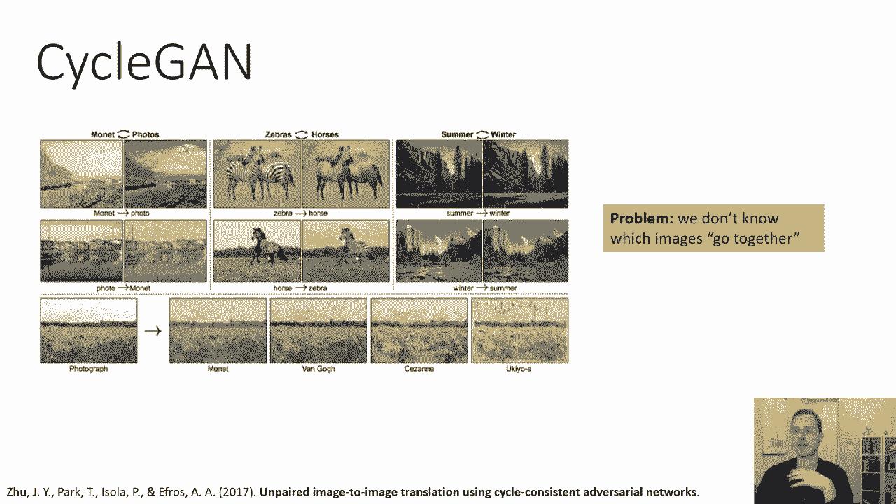
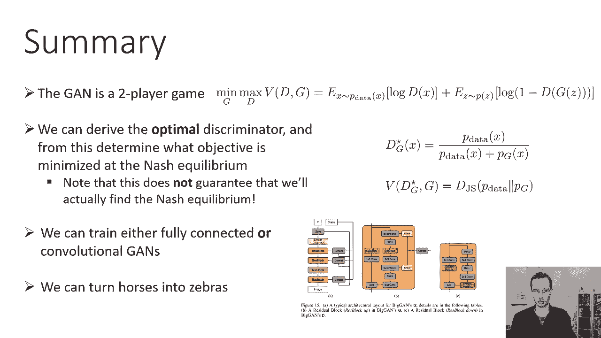

# P59：CS 182- Lecture 19- Part 2- GANs - 爱可可-爱生活 - BV1PK4y1U751

所有的权利，在讲座的这一部分，我们将讨论实际设置甘斯的技术细节，这是我们之前看到的GAN算法的轮廓，我们会再深入研究一下，所以这个过程描述的经典甘恩也可以表示为两人游戏，作为最小最大问题，你有两个球员。

g和d，发生器和鉴别器，这两个玩家分别试图最小化或最大化相同的目标，所以他们有相同的目标，但是G试图最小化它，而D试图最大化它，这很有道理，他们在相互竞争。

所以他们在同一个目标上朝着相反的方向前进是有道理的，目标基本上是判别器分类目标，所以我写在这里的这个表达式，你知道它可能看起来有点复杂，但基本上只是交叉熵损失，记住交叉熵损失只是，呃，把正片贴上标签。

最大化正标签的对数概率，然后拍摄负标签图像，然后在二进制分类问题中最大化负标签的对数概率，负标签的概率只是1减去正标签的概率，这就是为什么第二学期你有一减d，所以这只是交叉熵损失。

最大化数据上的日志日志D，然后为生成的样本最大化对数1减去d，这两个都是期望值，所以第一个期望值在训练数据之上，这只是通过平均你所有的训练点来近似，记住，在训练点上平均对数似然只是一个近似值。

基于样本的训练分布上期望值的近似值，我们在这里称之为P数据，第二个表达式就是1减去d除以x，J是生成的图像，所以它被写成z上的期望的原因，是因为你得到x j的方式是，你从z的p生成z，然后通过g运行它。

所以有两个期望，但是我们计算它们的方式，在实践中，对于第一个，我们平均超过训练集，第二个，我们生成一堆随机的Z，取他们相应的x，然后在这些上面取平均值，所以D试图最大化这个数量，它试图最大化对数可能性。

这意味着最小化交叉熵损失，G试图最小化它，它试图最小化判别器的可能性，这与判别器交叉熵损失最大化相同，他们，基本上让鉴别器很难，告诉它的图像是假的，事实上，假图像。

所以这种将gan写成min max问题的方法要简洁得多，然后上面的过程就是我们用来解决这个最小问题的算法，最大问题，所以它不再是传统的梯度下降优化，这实际上是在两人博弈中寻找纳什均衡的问题。

这里是甘游戏，我现在已经用theta和phi来写了，其中θ是g和phi的参数，d的参数，所以和以前一模一样，只是现在它是一个分以上的θ，phi上的最大值，只是为了强调我们有参数，算法基本相同。

在phi上的梯度上升步之间交替，因为phi是最大化的，在θ上有一个梯度下降步，这两个步骤只是交替进行，这基本上是整个算法，现在有两个重要的细节我们必须处理好才能成功，首先。

如何在随机梯度下降或上升的情况下工作，对呀，因为我们想用一个迷你批，其次，你实际上是如何计算梯度的，但这两个实际上都很简单，所以嗯，利用随机梯度，上升或下降，我们通过使用一小批训练点来近似梯度。

对于第一个期望，然后对于第二个期望，我们对相同数量的Z进行采样，并将它们通过发生器运行，这基本上给了我们一个迷你批量梯度，分别用于细θ的上升或小批量梯度下降版本，所以这很简单，再一次。

判别器的损失只是交叉熵损失，从技术上讲，它是交叉熵损失的负值，因为我们在爬升，或者你可以在交叉熵损失上下降，完全一样，然后用同样的小批量Z来估计发电机的损失，只要把它们通过发电机。

问辨别者什么概率给他们带来了什么，然后用它作为发电机的损失，实际上，计算这些梯度通常非常简单，所以鉴别器的梯度，它只是交叉熵损失，以前所有的背道具都适用，生成器的梯度可能会更详细一点。

因为计算生成器的损失函数需要生成图像，然后把它们传给鉴别器，所以我们计算生成器梯度的方法，我们通过鉴别器反向传播到生成器，这是这个表达式，这是生成器的损失函数，我们要通过歧视来反向传播。

关于其投入的意见，这将给我们DL DX，然后我们可以通过发生器反向传播，根据链式法则，它将给出x-d-θ乘以dl-dx，这就是我们想要的，所以在实践中，你所要做的就是在你的自动区分软件中构造一个图。

它由g和d的级联组成，然后有规律的反向传播，自动差异操作将通过该图计算所需的渐变，所以这一切都很简单，判别器的梯度非常容易，就像一个普通的分类器，发电机的梯度容易获得，只需组成生成器鉴别器。

并使用您最喜欢的自动区分，所以这基本上就是你实现一个基本的GAN所需要的一切，现在让我们来谈谈一个理论问题，好的，所以我们看到了GAN是如何构建的，我们对为什么GAN应该匹配分布有一点直觉。

但是GAN实际上优化了什么特定的目标，我们能不能把这个双人游戏，分析它，并能够正式声明在收敛时，这将最大限度地减少数据分布之间的某些差异，以及我们游戏产生的图像的分发，所以我们可以这样做。

关于z的g在收敛时我们能说什么，嗯，做这个有点难，因为纳什均衡很难处理，不如我们来简化一下这个双人游戏，只是为了理论分析，通过将x的最优d以闭形式表示为g的函数，我们有一个外最小化和内最大化。

所以也许D上的内部最大化的外映射，也许它的解可以用封闭的形式表示为，我们显然不能实现这一点，在代码中，我们需要训练一个神经网络来做到这一点，但也许至少在理论上，我们可以把max d的解表征为g的函数。

所以一个非常有用的。

呃，属性是一个可用于描述贝叶斯最优分类器的恒等式，下面是我们如何导出这个，假设我们有一组正标记的图像，dt和一组负标记的图像，假设正标来自x的p，负标记图像来自x的q。

所以x的q是带有负标签的图像上的分布，x的p是图像上带有正标签的分布，在，x的p是p数据，x的q是从z的p中采样z获得的图像的分布，然后通过g，所以最优鉴别器，我将称之为D星。

只是对数似然的arg最大值或等价，交叉熵损失的论证，我们可以把它写成log d的p下的期望，因为p是带有正标签的图像上的分布，加上对数1减去t的q下的期望值，因为q是负标签点上的分布。

所以现在我们要做的是，我们对d求导，所以我们不对任何参数求导，我们只是对函数d求导，我们将导数设为零，求解d，所以这通常是你所做的，如果你想找到最大值或最小值，好的，对数d的导数是1/d，呃。

对数1减去d的导数是-1除以1减去d，这就是我们如何得到p下的导数期望值，d以上，1/1减去d，如果我们能解出使我们为零的d，我们将恢复最佳鉴别器至关重要，这并不意味着你的神经网络可以表示最佳鉴别器。

所以这更像是，呃，在你有一个非常，非常有表现力的功能，我们可以不用担心参数，并描述函数的特性，这将是最优解，所以我要声明的是，如果x的d星等于x的p，除以x的p加x的q，那么导数为零。

所以我要把这个表达式代入上面的导数，并表明它实际上是为零的，所以期望值只是概率时间的所有可能x的和，预期内的量，所以p下的期望值为1，就是p的所有x的和，除以x的d，所以我会插入D星表达式。

因为d星是x的p除以x的p加上x的q，1/d星是x的p加上x的q除以x的p，这都乘以x的p，求和x得到期望，x的一减d等于x的q除以x的p加上x的q，所以1/1减去d等于p，x的q除以x的q。

整个东西乘以x的q，因为这就是我们所期望的，所以现在你会注意到在这两个期望中，分母和分布，我们要把期望抵消掉，所以我们只剩下对所有x的p的和，加上x的q，减去x的p的所有x的和加上x的q，结果为零。

这意味着x的d星表达式实际上是，我们能得到的最优分类器，如果我们的正标记点来自x的p，我们的负标记点来自x的q，这被称为最佳鉴别器或贝叶斯最佳分类器，所以取p数据为p，p g为q。

我们可以导出最优分类器d星g作为g的函数，其中p，g是我们从p中采样得到的分布，取x为z的g，所以如果g是固定的，我们优化判别收敛，如果我们的神经网络非常，在极限中非常有表现力，这是我们应该得到的。

我们应该得到x的d星g等于x的p数据，除以x的p数据加上x的pg，好的，那么现在G的目标是什么，我们能做的就是，我们可以简单地把x的d星g代入最小最大值，以上优化，把它变成g的最小值，一次又一次。

我强调这纯粹是理论上的练习，这不是我们实际编码的方式，我们会把它编码起来，使用我之前展示的方法，我们经历这些的唯一原因，这是为了理解GAN的目标到底是什么，GAN实际上试图优化什么。

所以如果我们用这个代替，我们基本上只需要写出d星g逗号g的v，它完全是g的函数，现在，所以有两个期望，关于p数据的期望，我们将插入上面的d星表达式，所以它是P数据下对数P数据的期望。

减去p数据的对数加上pg，我只是通过取上面d星g表达式的对数来获得它，它是在log pg减去log p数据加上pg下的期望值，那是因为一减d等于pg除以p数据加上pg，这只是那个的日志，如果这里的代数。

呃有点太乱了，请暂停讲座，再看一遍幻灯片，以确保代数对你来说真的有意义。

所以这是我们到达它的表达，有这两个有趣的期望值表达式，它们真的有什么意义吗，让我们定义另一个分布，我们将称之为Q，q只是p数据和pg的平均值，所以我们将x的q定义为x的p数据，加pg x除以2。

只是他们中的平均水平，我们可以为生成器目标编写表达式，作为log p数据减去log q的p数据下的期望值，加上pg下的期望值log pg减去log q再减去log log 4。

我们得到4的对数的原因是因为有一个半项是正确的，因为如果你有log p数据加上pg，等于对数p数据加上pg除以2，加上分母对数二，现在我们不在乎之前的日志，因为它只是一个常数。

所以这只是为了解释Q是平均值的事实，你可能从我们之前的讨论中认识到，这些术语中的每一个都是KL分歧，所以任何时候你看到一个期望值蚂蚁或一个不同的日志分布，那只是kl散度，这是两个分布之间差异的度量。

这意味着生成器的目标是p数据之间的kl散度，这个平均分布，加上pg与均匀分布之间的kl散度，事实证明，这个表达式实际上是另一个发散度量，叫做詹森·香农分歧，如果它是以两位数学家的名字命名的。

你知道这将是严肃的事情，对不起，我应该说詹森·香农分歧，延森香农散度有一些有趣的性质，它就归零了，如果分布匹配，所以如果p数据和pg完全相等，那么这两个kl差都将归零，这意味着阿斯和香农的散度将为零。

但与羽衣甘蓝不同的是，它其实是对称的，这意味着如果你颠倒参数的顺序，你得到的是一样的，所以这只是两个分布之间相似性的另一个度量，与我们通常使用的KL散度略有不同的度量。

但仍然是两个分布之间相似性的有效度量，这意味着如果我们真的优化发电机，收敛和一切都很有表现力，我们不知道哪里适合或不适合，事实上，我们将完美地匹配这两个分布，所以这很酷，我给大家推荐的是。

以确保您可以遵循此推导，这种持续时间很重要，因为对于我们用甘斯做的许多更先进的东西来说，这种分析基本上是作为起点的，就目前而言，这意味着甘真的在努力匹配数据分布，甘斯实用的一面。

在我们到目前为止的所有推导之后，结论应该是，发电机损失是1的对数z的p下的期望值，减去dφg，这基本上相当于说，让我们最小化图像是假的概率，在实践中，我们实际上经常使用稍微不同的损失。

我们使用负对数d的p的z下的期望值，这和说，最大化图像是真实的概率，现在这两个东西非常，非常相似，它们代表了相同的概念，并说它们有相同的最优值，但它们的渐变实际上看起来有点不同，当你离最佳状态很远。

所以花点时间想想为什么我们会利用第二次损失，为什么为什么也许最大限度地提高图像是真实的概率会更好，而不是最小化图像是假的概率，当然啦，这不是唯一的方法--还有其他变体，所以选择第二种是因为它的形状。

函数log x和函数log 1减去x，所以我在这里画的是，左下角顶部是损失函数负对数x，所以这基本上是我们通常使用的损失函数的形状，在底部，我们有对数的形状，1减去x，如果你有一个非常坏的发电机。

那你就会有很大的损失价值，所以你会在这两条曲线的左边，如果你有一个非常非常好的发电机，那你就会站在正确的一边，你的损失会很低，所以对数1减去x的问题，最小化图像的概率是假的，当发电机坏的时候。

梯度往往很小，然后它在右边变得非常陡峭，一旦发电机变好了，我们真的不想那样，因为对发电机来说，学习好是最重要的，而发电机是坏的，因为如果发电机在坏的时候不能取得进展，永远不会好起来的。

而最大化图像的概率是真实的，仅仅因为log x函数的形状，当左边的发电机坏了时，梯度实际上很大，然后越大，呃，一旦发电机变得很好，梯度就会变小，这样它就可以收敛到一个很好的解，所以这就是为什么。

只是渐变现在表现得更好了一点，也就是说甘斯有相当糟糕的渐变行为，我们将在第三部分中更多地讨论这一点，GAN体系结构上的几个实用节点，你实际上是如何设置游戏的，嗯。

这里有一些您认为可以拥有一个完全连接的体系结构的虚构体系结构，所以你基本上可以把你的Z映射到，让我们说，两个完全连接的层每个层512个单位产生一个mnist数字，然后你可以有你的鉴别器。

也有两个完全连接的层，每个层512个单元，并产生一个真正的假输出，末端呈乙状结肠非线性，那是一个非常简单的古典建筑，对于完全连接的非卷积GAM，它可能适用于像MNIST数字这样的非常低分辨率的图像。

或者你可以有一个更复杂的卷积GAN，也许在精神上与我之前谈到的一些VE建筑相似，你可能会有一些转置卷积，实际上产生更高分辨率的图像，然后你可以有一个卷积鉴别器，产生你真正的虚假标签。

这是一个真正的卷积GAN的体系结构，这是这其实是大甘，这是一个非常现代的GAN，可以产生高分辨率的图像，现在这个架构要复杂得多，但它在概念上和我在底部的那个很相似，所以左边显示的生成器的主要体系结构。

你把你的Z分成四部分，所以你基本上在底部放一点Z，然后你把它的其他部分放进去，在小部分上，最初是从一种标准的完全连接的东西转变而来的，变成卷积图，四乘四乘十六声道，然后它穿过两个残块。

每个残块本身都有多层，他们还得到额外的Z通道，以及类标签，这是用于类条件生成的，这些残块中的每一个，每一个橙色块，这就是B中所示的，所以每个残块都有一点残块结构，所以它向上，把它们一个一个地取样。

然后将其添加到两个堆栈中，三乘三反对，所以这是一个复杂的建筑，显然需要相当多的尝试和错误才能以这种方式建造它，但基本原理是一样的，它将是某种转置卷积风格结构。

有条件甘斯，如果你想要一个生成，比如说一个特定类的图像，嗯，你所要做的就是连接你的类标签，这里显示为Y，到生成器的输入和鉴别器的输入，所以您将类标签表示为一个热向量，把它连接到Z。

然后对于连接到x的鉴别器，这里有一些来自经典的条件甘纸的图像，这是MSIST数字，以数字身份为条件，第二行是一个，第三排是两个，以此类推。

这就是你如何再次训练条件，非常简单，稍微先进一点的扫描架构，这是我要报道的最后一个，只是为了你的理解，是循环GAM，有很多很多不同种类的甘斯，但我想特别提到这一个，因为它有一个很好的主意。

我认为这也有助于说明甘斯是如何工作的，所以循环甘关注的是一个非常特殊的问题，不仅仅是生成任何图像，而是具体地从一个领域翻译成另一个领域，例如，如果你收集了大量斑马的照片，和一大堆马的照片。

你能把斑马的照片变成马吗，问题是你会得到这些图像，但不会给你配对，所以它不像英法翻译，在那里你得到一个英语句子和相应的法语句子，你只会得到一群马和一群不同的斑马，也许最明显的是明白为什么它很重要。

如果你考虑左边的例子，把莫奈的画翻译成照片，你可以找到很多照片你可以找到很多莫奈的画，但你找不到莫奈画的真实场景的照片，因为当时还没有彩色摄影，所以这就是GAN能帮助的。

甘能做的就是学会创作逼真的莫奈画作，它可以学会生成逼真的照片。

然后你可以试着把它们自动地放在通信中，所以这是设计，这个图看起来有点复杂，但我会带你走过，我们有两个条件生成器，一个条件生成器将x变成y，所以它以x为条件，可能是一匹马的照片。

它的工作是生成斑马的Y照片，第二个生成器f以斑马的照片为条件，它产生了一张马的照片，然后你有两个鉴别器，判别器DX只是看着一个图像X并试图猜测，它是一匹真正现实的马吗，所以这就是要监督发电机G的东西。

鉴别器看着一个图像说，是现实的斑马吗，它将监督发电机F，所以DX被训练，积极的一面是马的真实照片，实数x和负数是从g和d的世代训练出来的，积极的一面是斑马的真实照片，真y和负数是f的样本，但当然。

为了让f生成一个样本，需要给它一些x，所以f会生成一匹斑马给定一匹马，所以现在我们可以想象我们可以训练这些，这两个生成器和两个鉴别器，现在我们将有一个发电机，把力变成斑马，和另一个把斑马变成马的发电机。

但我们还没结束，因为这并没有说明你应该产生哪种力量或哪匹斑马，所以问题是，为什么翻译出来的斑马看起来像原来的马，所以如果我们给这张马的照片，我们想要一只斑马，哇看起来像那匹马，那很好，这就是我们想要的。

但发电机可以产生一些任意的其他斑马，因为它想做的只是，拜托是歧视，歧视者不在乎，这匹新斑马和原来的马很相似，它只需要是一只现实的斑马，这就是循环一致性损失的另一部分，这就是底部显示的。

周期一致性损失基本上是说如果我把这匹马变成斑马，然后把斑马变回马，我应该得到同样的马，这是用距离来衡量的，就像字面上的，就绝对值差而言，图像中的像素应该靠得很近，这就是中间和右边的图片所说明的。

所以在中间你取一个X，你把它穿过g得到y，你应该愚弄你，但如果你拿着那个Y，你把它传回F，得到另一个X，那个新的x x帽子应该和你放进去的原来的x相似，这是另一种说法，即x的g的f应该类似于x。

这就是这个循环的第一行所显示的，一致性损失，它最小化了x的g和x的f之间的差，和右边的图片相似，显示了相应的东西向相反的方向发展，所以如果你拿一个Y，如果你拿一只斑马，通过f，你得到一个X。

这应该愚弄X，当你把它传递到g时，你回去，你会得到另一顶Y Y帽子，Y帽子应该接近原来的Y，这是另一种说法，g of f of y应该接近y，这又是循环背后的想法，两个甘斯，每个域一个。

如果你从一个域映射到另一个域，就会有损失，然后再回来，你应该在你开始的地方结束，这些想法的简要总结，GAN是一个双人游戏，这是双人游戏，它的方程，我们可以从理论上推导出最优的鉴别器。

并由此确定目标是什么，在纳什均衡下最小化，这是最优鉴别器的表达式，当我们把它插入Gan双人游戏时，我们可以导出一个用g表示的目标，这只是p数据和pg之间的ens和Shannon分歧，请注意。

这并不能保证我们真的会找到纳什均衡，所以这个推导只是表明，如果我们找到纳什均衡，这个游戏的定点，它将最大限度地减少分歧，现在我们可以训练完全连接的或卷积的甘斯，我们有很多自由，在确定他们的架构方面。

对于一个特别复杂的体系结构，你可以看看我在幻灯片上引用的大甘论文，我们可以用自行车甘斯把马变成斑马。

