# P6：CS 182- Lecture 2, Part 3- Machine Learning Basics - 爱可可-爱生活 - BV1PK4y1U751

所以在今天讲座的下一部分，我们将讨论损失函数。

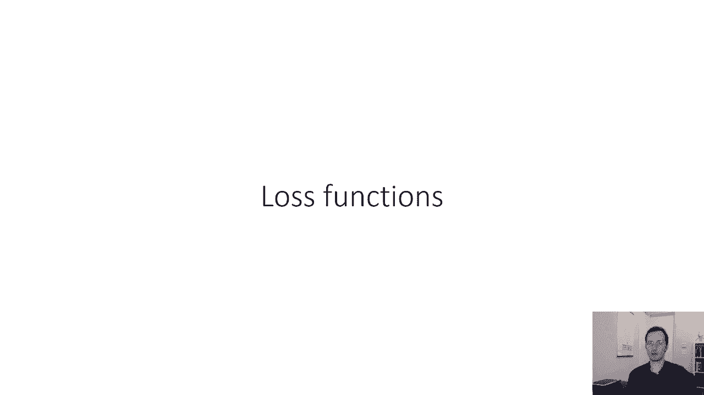

到目前为止，我们有一个计算机程序的图片，它将我们的输入映射到我们的输出，我们决定我们的输出应该是概率，我们将使用SoftMax来产生这些概率，所以我们的函数已经学习了参数，如果我们把猫和狗分类。

我们有一只西塔狗和一只西塔猫，一般来说，我们不在乎这些参数是什么，它只是一些大参数向量θ，所以我们要回答的下一个问题是我们如何选择θ。

后退一步，我们正在经历的这个过程实际上是一种非常常见的方法，我们用来制定机器学习算法称为机器学习方法，解决机器学习中可能遇到的任何问题的方法，这是一个三步程序，其实是四步，但其中只有三个需要你的投入。

电脑为你做的第四个，所以第一步是定义您的模型类，本质上，你将如何表示你的程序，我们在上一节中主要是这样做的，现在有很多其他的模型类，我们可能会选择许多其他类型的程序，我们做了一个特别的选择，嗯。

所以我们已经完成了这一步，但我们会在后面的课上讨论其他选择，顺便说一句，当我说模特班的时候，这里的模型类是指可以用设计表示的一组可能的程序，以及参数的可能设置。

因为不同的参数设置确实会导致不同的输入关系，因此不同的程序，所以你可以表示的所有可能的东西的集合是你的模型类，第二步是定义你的损失函数，损失函数衡量模型类中的特定模型有多好。

从而允许您确定一个模型是否比另一个模型更好，然后你可以根据这个损失函数选择最好的模型，所以损失函数衡量的是这个东西在解决问题方面有多好，第三步是选择一个优化器，选择一个算法，它实际上会搜索您的模型类。

寻找损失函数最小化的模型，我们会在今天的课结束时讨论这个问题，然后有一个，还有第四步，就像把整件事继续下去，可能在一个大的GPU什么的上，然后你就答对了，所以电脑为你做的第四步，但是第一步。

第二步和第三步，你得自己做。

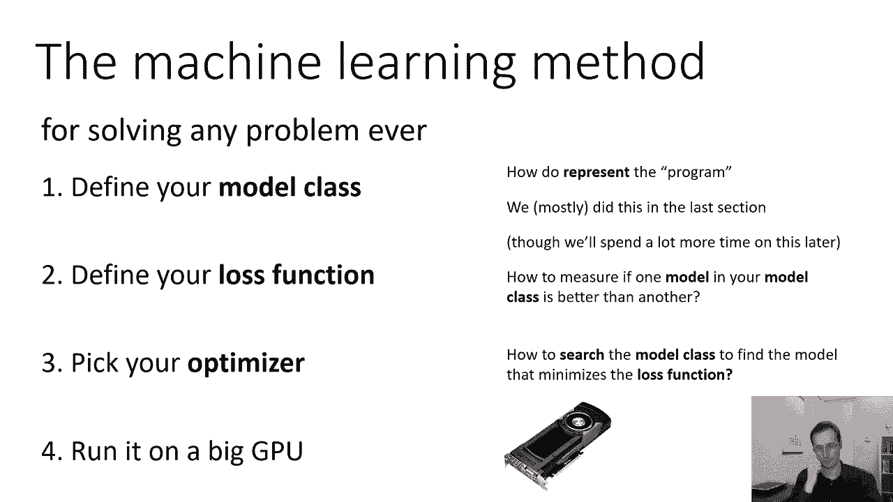

作为旁白，这种分解的方式，学习问题与火星的分析水平密切相关，所以马尔斯是一位非常著名的神经科学家，他提出了一种思考认知的特殊方法，这当然是非常有影响力的神经科学，但在机器学习中尤其有影响力。

因为它也给了我们一种方法来构建我们对机器学习方法的思考，所以火星最初的分析水平，你可以把它们想象成一个金字塔，金字塔的顶部是计算的，中间是算法，基础是实现，金字塔的计算水平是一个为什么的问题。

这是目标的问题，算法试图优化的是什么，算法试图实现什么，算法级别是什么，我们到底喜欢什么，我们正在学习的函数的实际表示是什么，什么是，要回答的结构，这就是为什么，马克所说的实现是一个如何实现的问题。

这个结构实际上是如何构建的，以便优化预期的目标，基本上你是如何选择，回答什么，的，为什么，在我们的术语中，从上一张幻灯片，计算级别将是损失函数，算法级别将是模型，实现实际上是优化算法。

所以有一点术语混乱，因为这里的实现不是指，你是怎么编码的，你是用Python还是Java编写的，或者它实际上指的是算法，算法级别实际上指的是模型，你也注意到这里的顺序和我的顺序有点不同。

我实际上把模型放在第一位，损失函数放在第二位，但这种思考方式也很有用，我们喜欢画这些区别的原因是，因为当我们有这些不同级别的分析时，它可以帮助我们划分我们的思维，它可以帮助我们构建抽象。

这样我们就可以孤立地解决问题，如果您认识到优化算法是一个单独的问题，从损失函数的选择，然后你可以设计通用的优化算法，可与任何损失函数一起使用，和，你不用担心损失函数，当你设计优化算法时，你不用担心模型。

当你设计损失函数时，把这些问题分开，现在就解决每一个问题，当然啦，在现实中，事情确实会变得有点耦合，但是，记住这种分离可以帮助你在处理非常复杂的事情时构建你的思维，机器学习系统。

现在在这个基本思想上有许多变体，许多不同的方法来分离分析的级别，你可以，比如说，添加另一个基本单元，就像你运行在哪种GPU上一样，它们与机器学习研究人员有关。

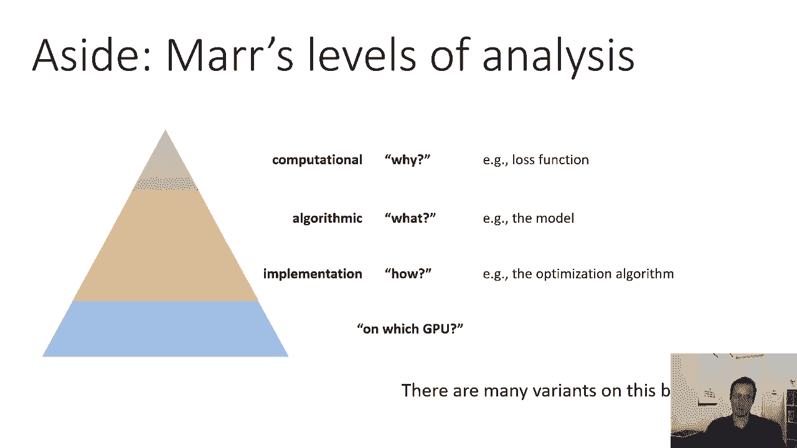

也许与神经科学家不太相关，所以这是我们的机器学习方法，接下来我们将讨论如何定义损失函数。

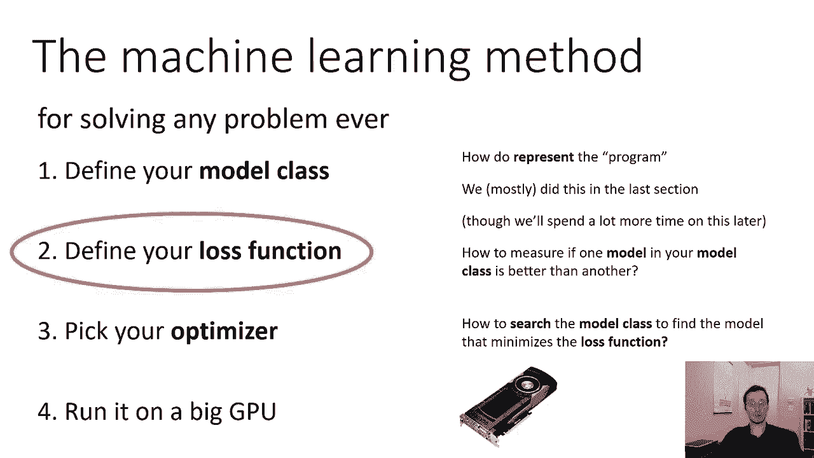

所以开始考虑定义我们的损失函数，让我们从一个更基本的问题开始，我们的数据集是如何生成的，产生我们数据集的过程是什么，现在，如果我们的数据集由相应标签的图片组成，产生这些图片的实际过程可能相当复杂。

包括光子和人们决定拍摄什么和所有这些东西，你知道，显然这是无可救药的复杂，呃，当涉及到，呃，实际上试图对它进行建模，但我们可以想出一个非常粗糙的模型，我们的数据集是如何形成的，我们可以说人们去。

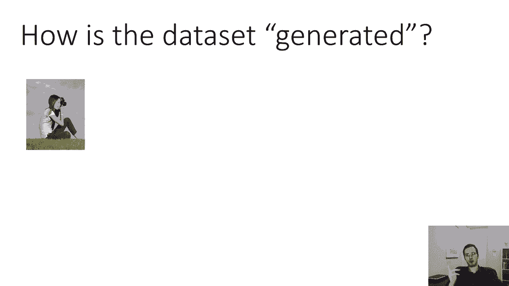

你知道，创建小狗的照片，在这种情况下，我们将代表，因为我们会想到这一点，只是一个随机的过程，所以在照片上有一些分布，一些x中的p和人类从x中的p中随机取样，当他们拍照的时候。

这实际上不是人们决定拍什么照片的方式，又不是说，你拿出相机，你拍了一张照片，你会随机得到，小狗猫河马，否，世界不是这样运作的，但这也许是一个有用的模型，一个有用而非常简单的模型。

帮助我们构建设计损失函数的思维，所以假设每次有人拿出相机拍照，他们从可能发生的照片中随机获得一张照片，标签狗是从标签上的一些分布中取样的，但这种分布不是完全随机的，这实际上取决于照片对吧。

一张照片是否被贴上狗或猫的标签，取决于照片是什么，现在在这里至关重要，给定x的y的p还不是我们现在学习的模型，其中给定x的y的p是代表现实世界的真实分布。

你可以把它看作是一个人在给照片贴标签时做出的决定，所以根据概率链式法则，我们可以组合这两个并生成样本x，逗号y来自x逗号y的联合分布p，它正好等于x的p乘以y的p给定x。

所以我们可以假设我们的数据集是从这个分布中采样的。

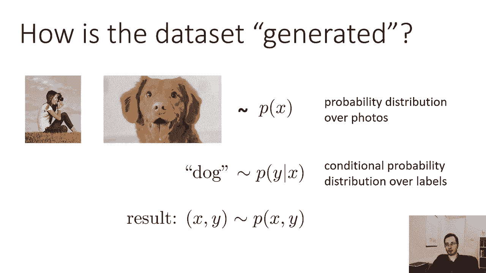

我们的训练集由许多元组x和y组成，x一y一，x2，你们两个，x和y n，我们将假设这些元组是根据分布生成的，x逗号y的p，所以为了让这个更正式一点，看到特定训练集的概率是多少，我们需要在这里做一个假设。

关于不同数据点如何相互关联的一个非常重要的假设，我们要做的假设是，我们的数据是所谓的独立的，并相同地分布，好的，这是什么意思独立，意味着每个x y元组都独立于其他x y元组。

意思是如果你观察到一只猫是x 1，它不会改变，你看到猫狗的可能性有多大，现在独立假设合理吗，有时有时不是，我是说，这可能是不合理的，如果你考虑一个人拿着相机走来走去，如果我去参加猫咪大会什么的。

我拍了一张猫的照片，就像我的第二张照片更有可能是一只猫，对呀，因为我在参加一个猫咪大会，如果我真的从Flickr或其他地方随机取样照片，也许他们会接近独立，因为你知道，在现实世界中。

我不受物理空间界限的限制，如果你能考虑到有人四处走动，实际上是在拍照，他们现在拍的照片可能与摄影技术很差，因为它们在相同的物理位置，但我们假设事实并非如此，我们假设他们都是独立的，所以这就是独立的意思。

这意味着x，i，y，i是完全相依的，那就不用猜x j是什么了，反之亦然，同分布意味着每个x i y i来自相同的分布，如此同分布意味着对于每一个i，x i y i来自x逗号y的相同p。

所以它不像你有一个分布x 1，和x2的不同分布，他们每个人的分布都是一样的，他们都是独立的，所以如果你有这个假设，然后你知道你可以把d的p写成乘积，在所有p的i上，因为它本质上是独立的定义。

独立的意思是d的联合p是作为边线的乘积形成的，就像抛两次硬币，第二次翻转看到人头的概率，并不取决于第一次翻转时看到人头的概率，所以如果你想知道连续两次得到人头的概率，你只要把第一次尝试时人头的概率乘以。

第二次尝试时人头的概率，因为它是相同分布的，这和只取正面的概率并将其平方是一样的，所以我们有一个与我们的数据集相关的概率，现在我们不是在学习x的p，我们学习给定x的，所以我们可以用链式法则分解它。

现在我们有一个与我们的数据集相关的概率，在我们所有的数据点上表示为乘积，我们所学到的是y给定x，我在这里叫它Pθ，只是为了强调一下。

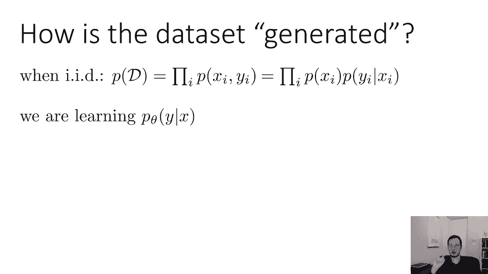

这是学习的函数，取决于我们的参数，所以我们学习的是给定x的y的pθ，是给定x的y的真p的模型，所以它是，当然啦，不是标签与图像相关联的真正过程，它是那个过程的模型，我们会试着让这个模型尽可能准确。

所以一个好的模型应该让数据看起来很可能，这是我们将要遵循的基本原则，那么是什么让一个θ比另一个θ更好呢，如果给定x，y的相应pθ更好，如果增加d的p，则整个数据集看起来更有可能，所以我们要选择θ。

使d的p，等于产品，选择使数据集看起来最有可能的模型，这有什么问题，如果我们真的试着用幻灯片上写的这个概率，我们会有麻烦的，想想这里的问题可能是什么，如果你在课堂上看这个，你也可以把它输入到聊天中。

如果你在网上看这个，你也可以打一个关于问题的评论，有什么问题吗。

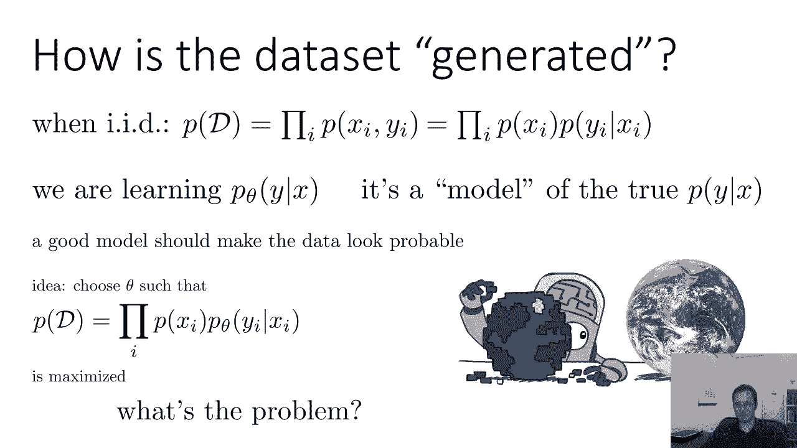

所以这里的问题是我们把这个概率p，d是独立产生的一系列其他概率的产物，问题是，仅仅在一个非常基本的算术水平上，我们在一起繁殖，小于或等于1的一堆数字，概率小于或等于1，它们在零到一之间。

所以如果你取一堆小于或等于1的数字，假设您的数据集有一百万张图像，你把它们相乘在一起，你会得到非常非常接近于零的东西，基本上，这一目标在数量上具有挑战性，它在概念上没有错，在代数上没有错，但从数字上看。

呃，很难合作，因为你会得到零，所以我们可以做的是，我们可以取T的p的对数，当你取乘积的对数时，你得到一个对数和，所以说，d的p的对数，加上对数pθ，现在我们可以看到的是，第一个术语。

x的p实际上并不依赖于θ，所以我们可以把它当作一个常数，因为我们改变了θ，这根本不会影响那个术语，这样我们就可以，等价地说，我们的目标是对数p的所有数据点的和，加上一些其他的东西，它不依赖于θ。

这样其他的东西就可以更多，那么，我们可以制定学习θ的问题，就像选择θ为d的log p的argmax一样，它是log p的所有数据点之和的arg max，这被称为最大似然估计，为什么最大似然估计很好。

因为这个对数概率是，我们选择θ是为了最大化可能性，是导致最大似然的θ值，通常，我们实际上会看到这被写成一个最小化，这可能一开始看起来有点傻，因为你只需要放一个负号然后把最大值改为最小值，完全一样。

但是我们经常谈论最小化的原因是因为，在优化文献中，规范地，优化问题被表述为最小化问题，这只是个惯例，所以因为那个公约，我们有一个有点奇怪的概念，负对数似然，或者NL，所以如果有人说我在优化负对数可能性。

他们不是想在里面放双重否定，他们只是利用惯例，优化算法倾向于最小化目标，所以目标是我们最小化的东西，如果你想最大化对数概率，这意味着您希望最小化负对数概率，所以这是我们的损失函数。

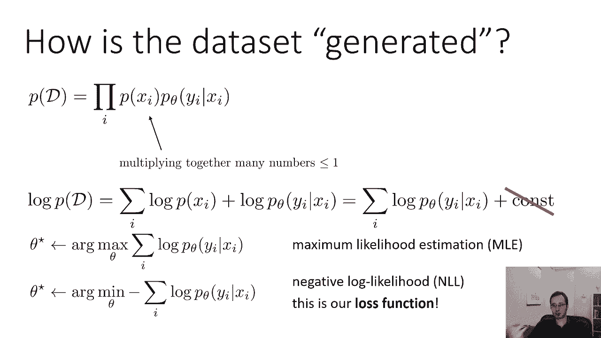

我们的损失函数将是负对数似然，所以损失函数一般，损失函数量化了θ有多糟糕，我们想要最不坏的θ，最不坏的事也是最好的事，所以说，比如说，我们可以有以前的负对数似然，你能想到的损失函数的其他例子是什么。

有什么方法可以量化θ有多糟糕，考虑一下，考虑把它写下来或放在聊天中，量化θ有多糟糕的潜在方法是什么，除了负对数似然，让我给你举几个例子，所以首先负对数似然，负对数似然也称为交叉熵。

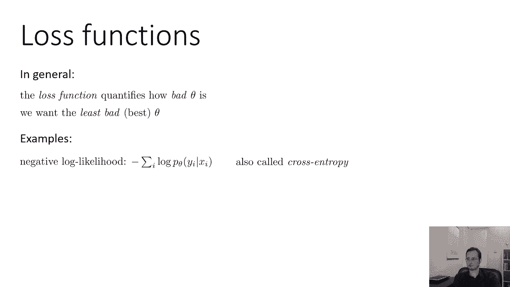

为什么叫交叉熵，作为旁白，交叉熵是对两个分布有多相似的度量，交叉熵是这样定义的，取随机变量的所有可能值，在这种情况下，你可以承担，你把所有这些随机变量加起来，你乘以随机变量y在第一个分布时间下的概率。

将对数概率转换为第二个，这是一个有趣的公式，但是呃，这叫做交叉熵公式，它与像KL散度这样的事情密切相关，它被广泛研究为量化两个分布有多相似的一种方法，而现在，如果你假设Y在你的训练中。

数据是从给定x的y中的p中取样的，这才是真正的分布，那么交叉熵近似于该标签的负对数概率，因为原始交叉熵是给定x的y的p下的期望值，你可以用一个样本来近似一个期望值，这就产生了负对数似然。

如果你对此有点迷茫，别担心，只是个名字，所以负对数似然有时被称为交叉熵，好的，另一损失函数，你本可以，你可以有一个零，一次损失，这是一种，这是一个非常明显的损失函数，它只是说，嗯。

如果你得到了错误的答案，你得到了零的损失，如果你有一个正确的答案，我在这张幻灯片上写的实际上有点不同，它实际上是一个消极的，零损失，所以是负1的损失，如果你得到了正确的答案，没有其他的，那也很好。

我向你道歉，这个滑梯有点紧，所以如果是零一损失，它实际上不会有负号，会有x的Δf不等于，这可能看起来像是一个愚蠢的损失函数，只是说如果错了，如果正确，为零，或阴性，一个如果是对的，错误为零。

但这是一个非常明智的选择，在某些方面反映了我们真正想要的，如果你在做一个连续回归问题，您可能会有均方误差损失，所以如果可以的话，如果你不是在预测一个标签，你实际上是在预测一个连续的数字值。

你可能想尽可能接近这个数字，比如说，您可能希望最小化预测之间的平方差，那个那个数字，这叫做均方误差，回归很受欢迎，原来，均方误差实际上只是负对数似然的另一个例子，因为它等于一个常数。

多元正态分布的负对数似然，如果你想看看这个。

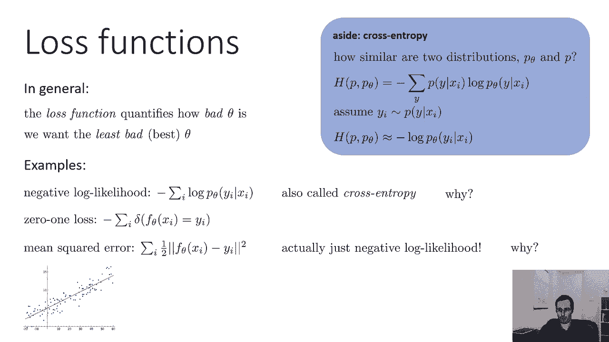