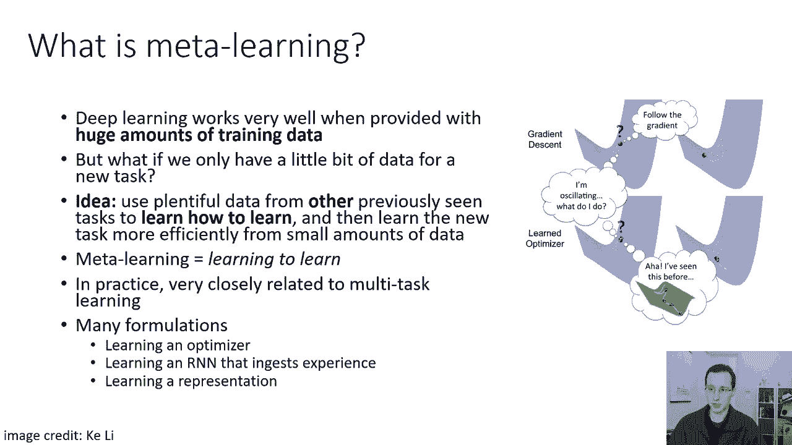
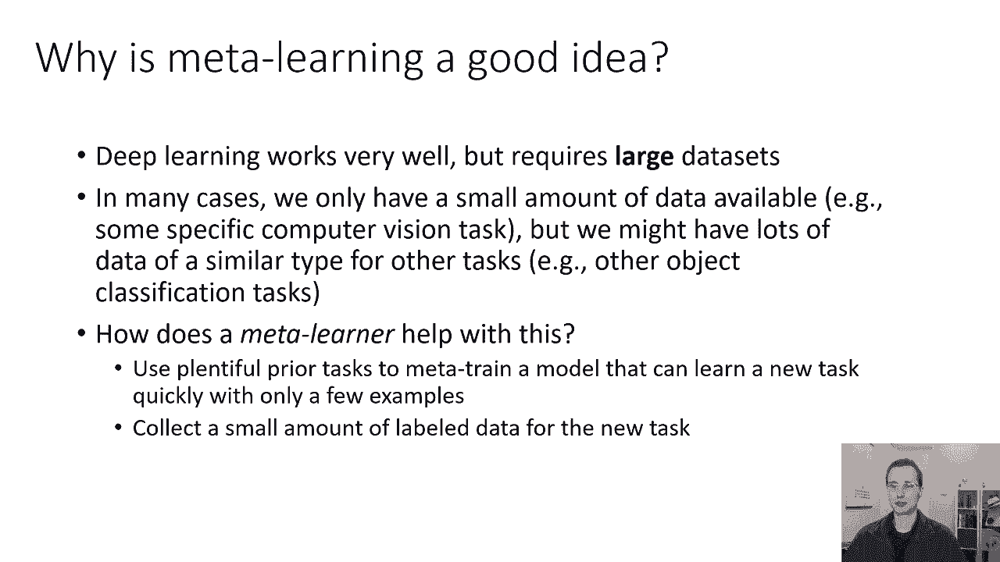
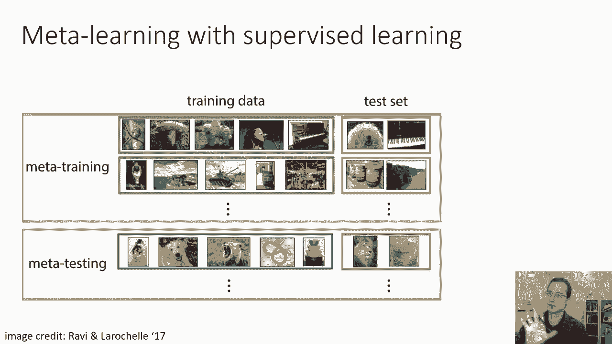
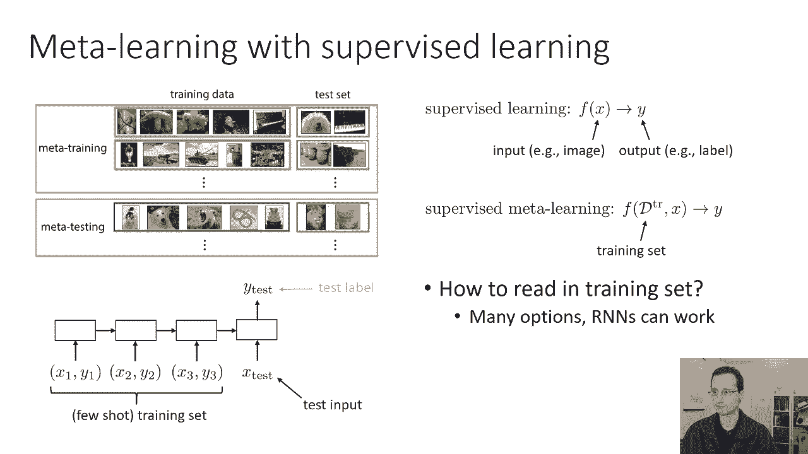
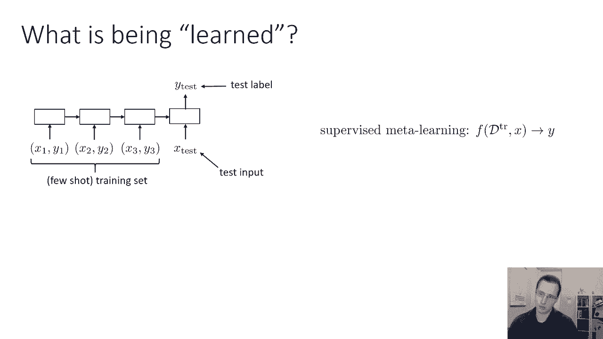
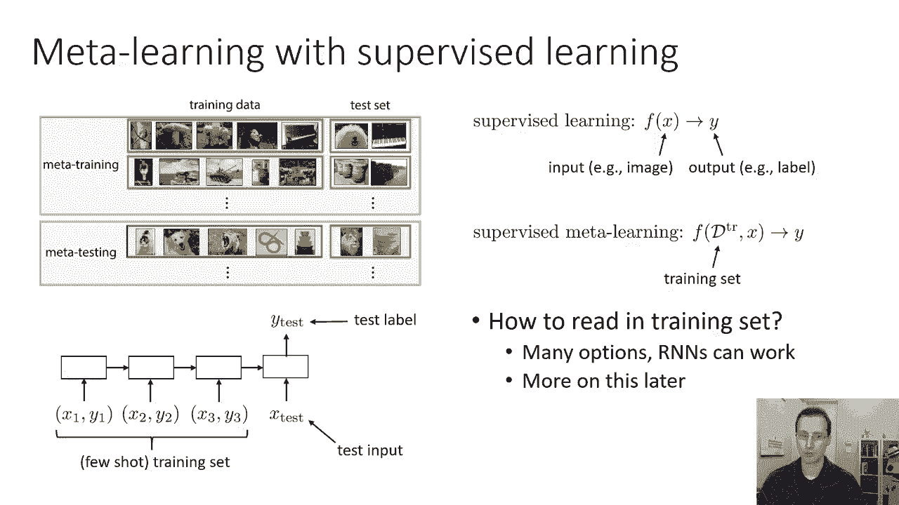
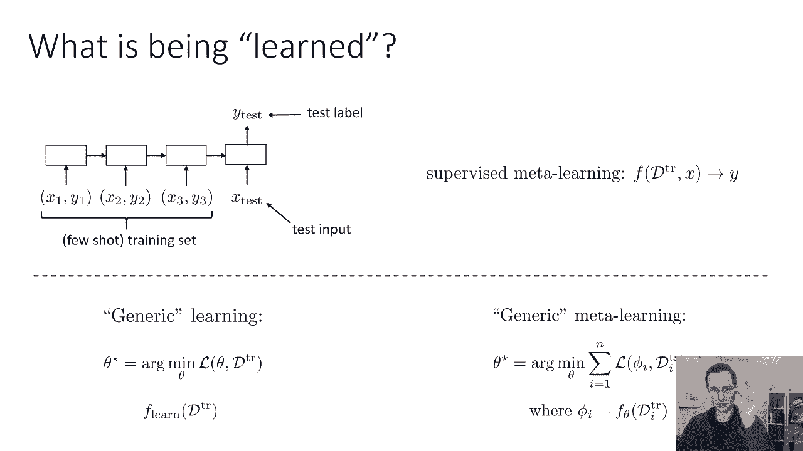
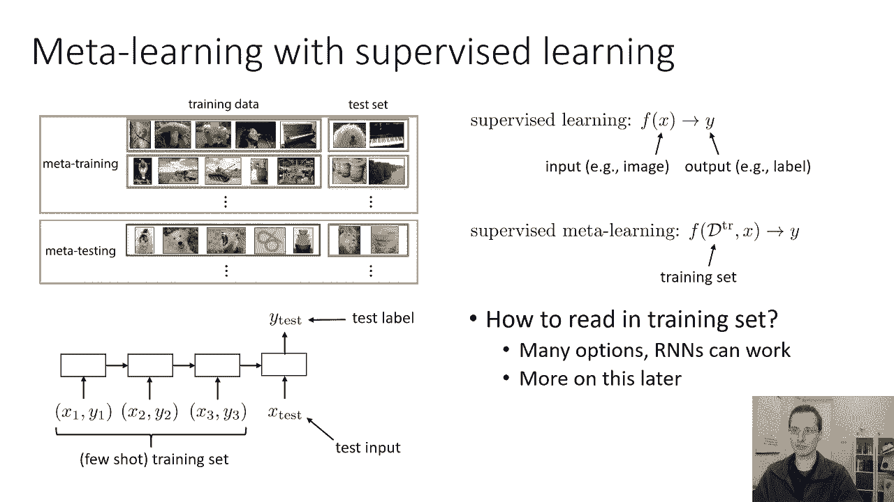

# P64：CS 182- Lecture 21- Part 1- Meta-Learning - 爱可可-爱生活 - BV1PK4y1U751

欢迎收看第二节课，今天我们要讲一个新的话题，叫做元学习，金属学习，是一种方法，我们可以用它来使深度学习技术与非常，非常小的数据集，这就是金属学习背后的想法，当你有非常大量的数据时，深度学习非常有效。

从这门课的第一节课开始，我们就学会了这一点，当你有很多数据的时候，超大型模型，你可以用深度学习技术做得很好，但是如果您只有一个新任务的一点点数据呢，现在应用传统的深度学习方法实际上并不那么简单。

那么我们能做好什么呢，一个想法是，如果我们有来自其他国家的大量数据，以前看到的与当前任务相似的任务，也许我们可以用它们来学习新的任务，而是学习如何学习，然后利用对如何有效学习的理解，即使从少量的数据中。

我们也可以更有效地学习新任务，所以如果这些先前的任务带来挑战，在结构上与新任务提出的挑战相似，也许它们都是图像识别任务或类似的东西，那么也许我们可以利用这些先前的任务来了解学习过程本身。

这可以让我们在这项新任务中更有效率，即使只有少量数据可用，所以金属学习基本上是指学习如何学习的过程，我从Curly那里借来的这张照片很好地说明了这一点，他在那里显示标准的梯度下降，呃，它说像嗯。

我要沿着渐变，但是遵循梯度会导致一些不好的事情发生，所以也许你学会了元，博学的优化器可能会说，嗯，我以前见过这种糟糕的优化情况，我知道如何从我已经解决的问题中恢复过来，但当然。

这不是你能从先前的数据中学到的唯一东西，你可以，当然，您可以学习一些关于优化过程的知识，但你也可以学到一些关于先验知识的东西，对解决任务有用的，比如说，您可以了解一些有用的视觉特征。

你可以学习一些关于物体的东西，和其他视觉概念，这些概念可能对学习如何识别图像很有帮助，所以所有这些都属于学习如何学习的范围，并在实践中，元学习与多任务学习密切相关，所以我们在这节课中要讨论的设置。

是一种您有大量先前任务的情况，也许这些先前的任务本身都有少量的数据，但是任务量很大，然后你有一些结构上相关的新任务，稍后我们将定义结构相关的含义，有很多方法来制定元学习，您可以将其表述为学习优化器。

在读取先前数据的RNN中学习，先前经验学习表征，等等，我们将主要关注金属学习问题的一个子集，称为少镜头学习问题，少镜头学习是指学习一项新任务的问题，使用少量称为shot的例子，几个镜头意味着几个例子。

好的，那么为什么金属学习是一个好主意，深度学习效果很好，但它需要非常大的数据集，在许多情况下，我们可能只有少量的数据可用，例如，对于某些特定的医学成像诊断任务，我们可能只有一点点数据。

但是我们可能有很多类似类型的数据用于其他任务，就像其他类型的图像识别任务一样，那么元元学习对此有什么帮助呢，嗯，元学习使用大量的先验任务进行元训练，只需几个例子就能快速学习新任务的模型。

这意味着您只需要为新任务收集少量的标签数据，然后用你的金属学习模型快速适应这个任务然后解决它。

所以这可能一开始看起来有点抽象和神秘，但有一个非常，非常，可以让我们掌握元学习的强大技术是，简单地将金属学习问题重新定义为另一个层次的监督学习问题，这就是这个插图试图展示的，让我告诉你这个插图的意思。

这个插图展示了我们如何将几个镜头图像识别任务制定为一个元，学习问题，所以几个镜头的图像识别意味着你可以得到每个类的少量例子，然后你需要很快地使用少量的例子来学习，识别该类的新对象。

这个特殊的插图实际上是在说明一个镜头案例，在这种情况下，我们只能得到每个类的一个示例，例如，非常，非常小的训练集，你的任务是区分鸟类，蘑菇，狗，我不知道为什么有人要区分这些东西，但假设你知道。

你们是一家制造图像分类器的公司，你的顾客会跟你说我想要的是鸟和蘑菇，狗对人对钢琴，我只有一个例子，你能给我一个分类器吗，所以框架金属学习或少数镜头学习的想法，因为另一个监督学习任务是把事情提升一个层次。

我们要说的是，我们有一个元训练集，它本身由许多不同的数据集组成，在这种情况下，每一个都是一次分类任务，好的，所以在元训练集中，你有很多，很多任务，也许成千上万的任务，每一个任务都是由一个小训练集决定的。

在这种情况下是一个一次性训练集所以只有五张照片，和一个小测试集，里面有一些属于这些类的图像，狗对人对钢琴，相应的测试集有几个对应于这些类的图像，你知道的，在实践中，也许这些任务会更连贯一点。

这些都是随机的，但是是的，希望这能让你明白，我们通过创建这个数据集所做的，就是，我们已经解决了少镜头分类的问题，进入阅读的问题，呃，五像，一次拍摄训练集并对新的测试图像进行预测。

如果我们能训练一个模型来处理这个，然后和元测试时间将呈现一组新的五个图像，一套新的单杆训练器，里面有我们从未见过的课程，所以也许在元测试时间，这是客户真正想要将其适应新任务的时候。

他们展示了一个冰淇淋的图像，一张狗的照片，线的一个图像，一个虫子的图像和一个碗的图像，也许这些课程中的一些以前见过，但通常你会假设这些是以前从未见过的新类。

所以模型学会了快速计算出如何将不同的五人组分类，现在它展示了一个新的五人小组，他们的班级是以前从未见过的，但是任务的结构是相似的，它们都是图像，我们需要这个想法有意义的正式假设。

我们需要元训练集从一些任务分布中取样，所以这不仅仅是图像的分布，它实际上是对任务的分配，元测试任务需要来自相同的分布，所以这就像采取监督学习的假设，在一个层次上移动，如果这看起来有点抽象，别担心。

我要检查做这件事的特定模型。

然后它可能会变得更明显一点，所以在监督学习中，非常高水平，我们学习一些从输入x映射到输出y的函数f，所以您的输入可能是，比如说，图像，输出y可能是一个标签，在元学习中，我们学习一个从训练集映射的函数。

我将称之为D火车，测试图像y和测试图像x，对不起，两个是相应的标签Y，好的，所以在我们学习从x到y的映射之前，现在我们正在从训练集中学习映射，d火车和x到y，对于不同的任务。

我们现在给这个f函数一个不同的d列，这是一种有趣的学习方式，只是说学习一个新的任务只是一个函数，您将该函数应用于训练集和测试图像，它现在应该产生测试图像的标签，当然，在现实中，我们可能想要分解这个函数。

我想分手，不知何故，这样我们首先阅读并产生一些足够的统计数据或参数，然后我们可以用它来分类许多不同的x，但就实际而言，这只是一种方便，在实际定义问题方面，我们可以很好地定义它，就像这样。

如果我们说的是普通的，学习我们在本节课中已经讨论过的算法，像梯度下降，那么f就是一个带d列运行的函数，梯度下降，收敛于它取得到的参数，然后用它们来分类x，但在元学习中，它有助于用许多其他方式表示F。

我也是，所以花点时间想想如何表示f，如果你，如果我告诉你，你只需要学习一些函数，训练x并输出标签y，如何表示这个函数，暂时忘记这与金属学习有什么关系，我只是告诉你。

你知道你现在的新学习问题是d train，逗号x到y，d训练是一组图像和它们的标签，你怎么能代表F，有没有我们在本课程中已经学过的模型，这可以让你代表，如果你看到，D训练为图像和标签序列。

如果您将其视为序列，有没有我们已经讨论过的可以用来表示F的技术，所以D训练是一个训练集，这是一组图像和它们的标签，为了设置f，我们需要回答几个问题，第一个问题是我们如何在训练集中阅读。

F实际上是如何摄入的，f在所有d训练中实际上是如何读取的，这样做有很多选择，rnns可以很好地工作，变压器可以很好地工作，但也有其他选择，但只是为了让事情变得简单，假设我们要使用rnn。

就像一个lstm，好的，这样我们就可以把我们的训练集，或者D训练只是一个序列，x一y一x二y二x三y三，我们会创建一个序列，我们可以在这些点上任意选择一些顺序，我们可以创建一个序列，呃出了训练集。

我们可以按照那个顺序阅读，一次一个x y元组，然后我们可以在最后有一个小头部来读取测试图像，并对测试图像进行预测，所以这是建立元学习方法的一个非常合理的方法，然后你可以训练这个小RNN或LSTM。

元训练集中的每个任务，所以对于这个例子，在图像中，因为所有的训练集都有五个图像，这是一次五向分类任务，你会有长度序列，五个，然后呢，你会有一个单独的小网络来接收RNN的最后一个隐藏状态，和测试输入。

测试图像，就像顶部图片中用红色圈出的图像一样。

所以我们稍后会讨论这些架构的更多选择，但首先让我们使用一个简单的rnn示例，让我们问这个问题，嗯，当你向它展示一项新任务时，你实际上学到了什么，元学习过程训练整个LSTM的参数，这是一种外部过程。

当你给它一个新任务时会发生什么，考试后的新训练集。

这里的图像将由五张图片和它们的标签组成。

嗯，以下是我们如何理解这种通用学习，能成为你的标准学习吗，非元学习可以看作是采取一些损失函数和一些训练集的过程，D训练和恢复最佳模型参数θ星，我们可以称之为函数，我们就叫它F学习D火车。

所以f学习吸收d列，它产生θ星，有哪些我们学习得很好的F学习的例子，梯度下降，带动量的亚当SGD，这些都是F学习的例子一般金属学习可以被看作是，承担多项任务，在这种情况下，n项任务，和用于。

并最小化测试集上损失函数的n个任务的和，d测试i，关于某个参数向量phi，其中phi是由学习函数给出的。

如果θ{\displaystyle\theta}适用于d{\displaystyle d}训练i{\displaystyle i}好，所以这有点，呃，对我们来说有点棘手，我再说一遍，对于每一项任务。

你有一套训练和一套测试，你有d训练i和d测试i，你有N个这样的，所以你有N个不同的训练集，每一个都有相应的测试集。

所以图中的行对应于D训练D测试对，有绿色轮廓的东西是d火车。

有红色轮廓的东西是D测试，你的学习函数fθ读入d训练i，它产生了某种参数，一些我们称之为phi的数的向量，它不必对应于神经网络的权重，它只是一些数的向量，PHI可以用来分类。

从D测试I中拍摄的同一任务的其他图像，所以我们从d测试i取一个x，我们带着菲，我们从将fθ应用于d训练中得到的，我会的，这将预测相应的y，并将损失最小化，所以它在说，最小化测试集上的损失。

在使用训练集获得phi和梯度之后，当然是回到Fθ，好的，这就是元学习如何工作的抽象模型，我要告诉你，幻灯片顶部的这个RNN，非常适合这个抽象模型，为了弄清楚如何适应这个抽象模型，你得回答几个问题。

你得好好回答，什么是fθ，什么是phi，好的，所以让我们稍微研究一下，所以fθ是在训练集中读取的位，所以对于我们简单的RNN元学习者来说，fθ基本上是rnn，所以θ表示RNN的参数。

它在D训练中很好地阅读后产生了什么，它会产生一些RNN隐藏状态，好的，所以这只是最后一个LSTM状态，在你读完整个训练集后，最后一个RNN隐藏状态被这个小分类器网络使用，对考点进行分类。

所以我们称它为给定x的，井phi由rnn隐态组成，以及最后这个小分类器的参数，对，因为那个接收H的小网络，i和x产生y，它也有一些参数，这些参数是元的，fθd列i产生φi，产生它的心智模型是，它是。

你知道的，关于呃的大部分知识，D火车就在最后一个RNN隐藏状态下，还有分类器的参数，这些参数不是由RNN产生的，他们只是修好了，他们和其他东西一样受过元训练，从观察这种心理模型你可以很好地想象。

你可以用很多其他的方法来制定，你可以设计许多其他的架构，您可以定义许多其他类型的PHI，所以当我在这节课剩下的时间里谈论不同的元学习算法时，你知道的，思考一下它们是如何映射到这个模板上的。

想想什么是fθ，D列车中读的位是什么，什么是phi，什么是，参数和数的向量，这足以对新的考点进行分类，对于我将讨论的每种方法，它将有不同的答案，所以为了避免任何混乱。

我在这里描述的一切都是以不同的方式看待RNN，实际的方法是非常，非常简单，实际的方法基本上是处理每一个D列，逗号x y元组作为训练点，将d train和x作为rnn的输入，并教它产生相应的Y。

所以就RN而言，这只是一个监督学习问题，而是这样看，我们也可以把它看作是一个元学习问题，所以如果这对你来说有点困惑，只要记住在最后，你实际上这样做的机械方式是，您只需设置一个常规序列来标记训练问题。

其中序列由D列组成，然后测试点x，所需的输出只是与x一起的标签，因此x y元组来自测试集，序列是训练集，那么有哪些实际的金属学习方法我们可以在实践中很好地使用，我们可以把它们分为三类。

第一类我称之为黑匣子金属学习算法，这些基本上是类似于我之前描述的RNN技术的方法，它们基本上是使用某种神经网络的方法，通常是要在整个训练集和测试点中读取的序列模型，然后输出测试点标签。

他们只是接受监督学习的训练，它基本上是重铸元学习问题，作为监督学习问题，以及试图做到这一点的不同方法，它们通常在使用的特定体系结构上有所不同，对于在此训练集中读取的模型，因为在实践中的训练集可能相当大。

你知道如果你有十道十镜头分类，你需要读取一百个不同的XY元组，所以你需要一个相当复杂的序列模型，所以人们使用RN和LSTM内存模型，所以这些是一种花哨的LDMS，有外部内存，与注意力非常相似。

以及变压器风格的模型，所以人们尝试了很多不同的建筑，但他们基本上都有同样的想法，它是某种序列模型，训练集中的X，然后读取测试点，然后输出测试点的标签，他们只是接受监督学习的训练。

所以我们不会再讨论这些黑匣子金属学习方法了，它们主要在体系结构选择上有所不同，你可以读到这些架构选择，在论文底部的参考文献中作为起点，但训练它们的实际算法正是我到目前为止讨论的。

所以大多数元学习的聪明之处实际上是在数据处理中，第二类元学习方法，我们将详细讨论，在第二部分是非参数的，元学习方法不要让名字欺骗你，实际的金属学习是参数化的，但适应不是参数化的。

所以你可以把这些方法看作是学习如何做，最近的邻居，所以他们解决新任务的方式，使用某种新的最近邻查询，但他们将在元学习阶段学习表征，这将使那些最近邻查询工作得很好，所以这些包括匹配网络和原型网络。

我们将在第二部分讨论这两个问题，第三类元学习方法是基于分级的元学习算法，这些一开始看起来和其他的很不一样，但在许多方面，它们实际上有很多相似之处，所以基于梯度的金属学习方法的原理是，你适应新任务的方式。

它只是通过梯度下降的微调，所以说，你实际上会通过在这项任务上运行梯度下降来适应新的任务，但是在元训练中，你实际上会训练你的模型，所以梯度下降适应效果很好，起初，这似乎是一个完全不同的原则。

