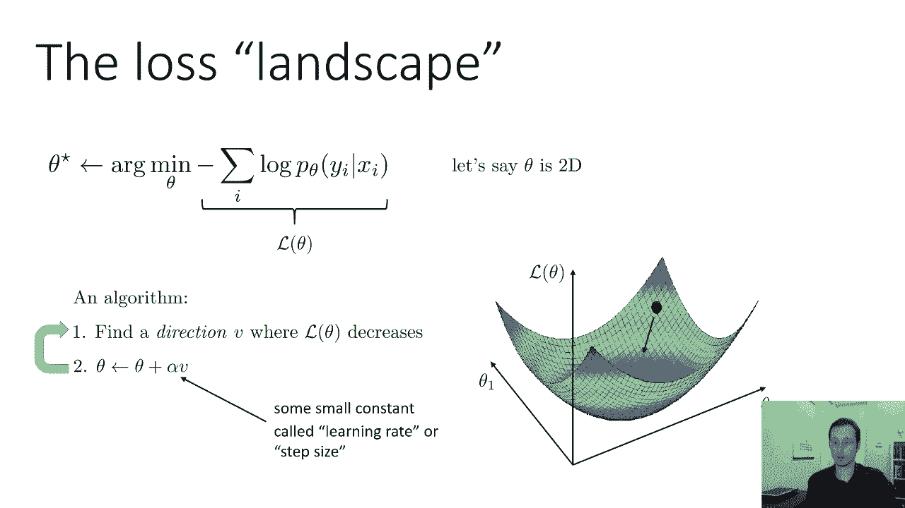
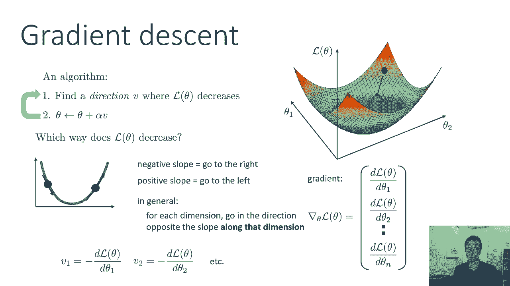
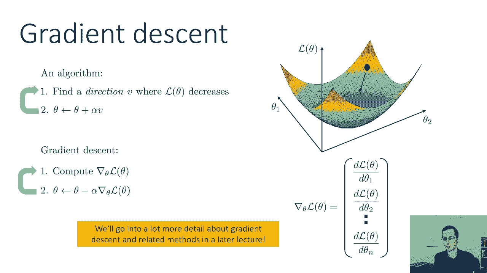
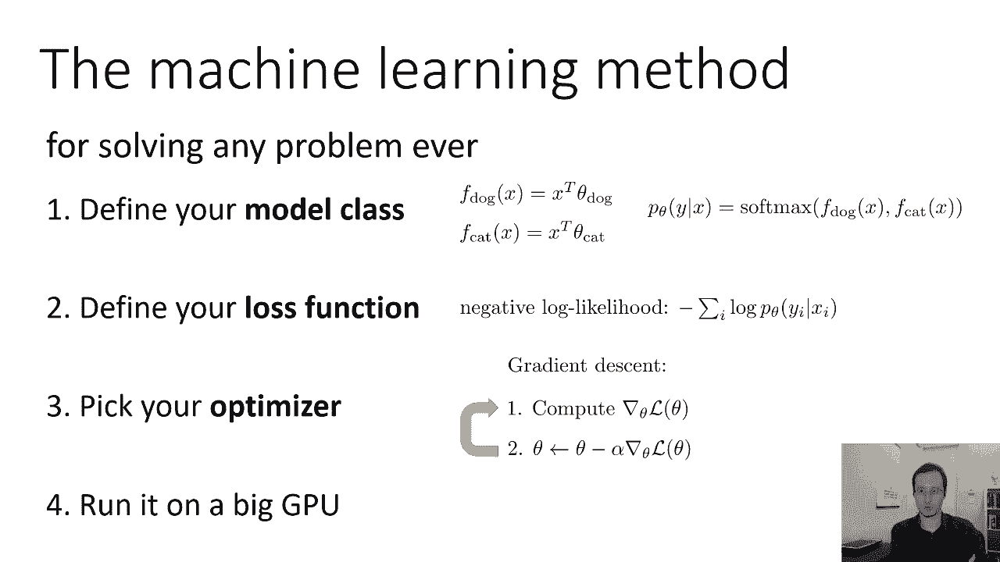
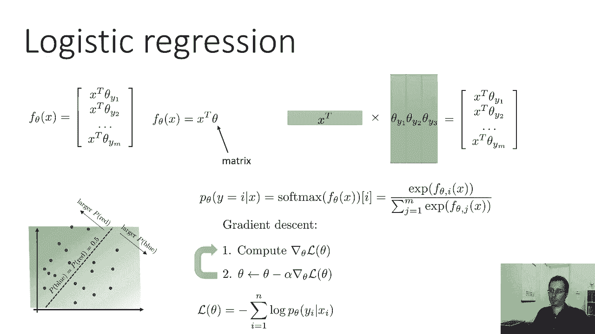
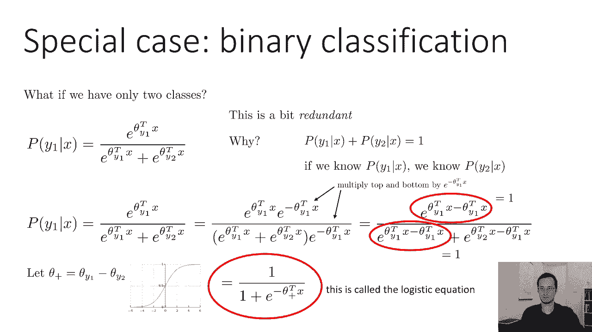
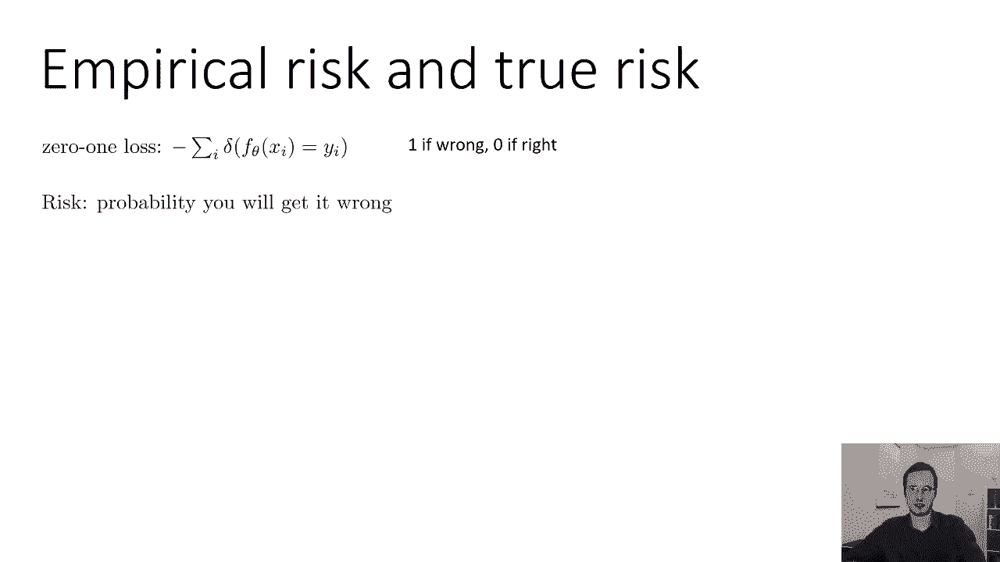
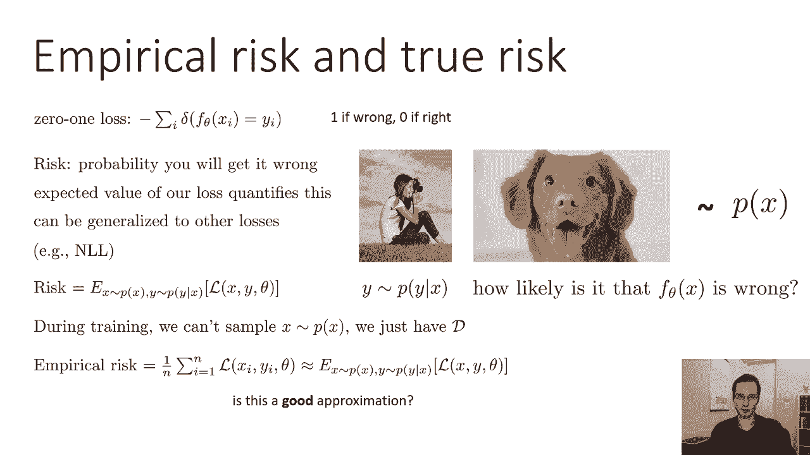
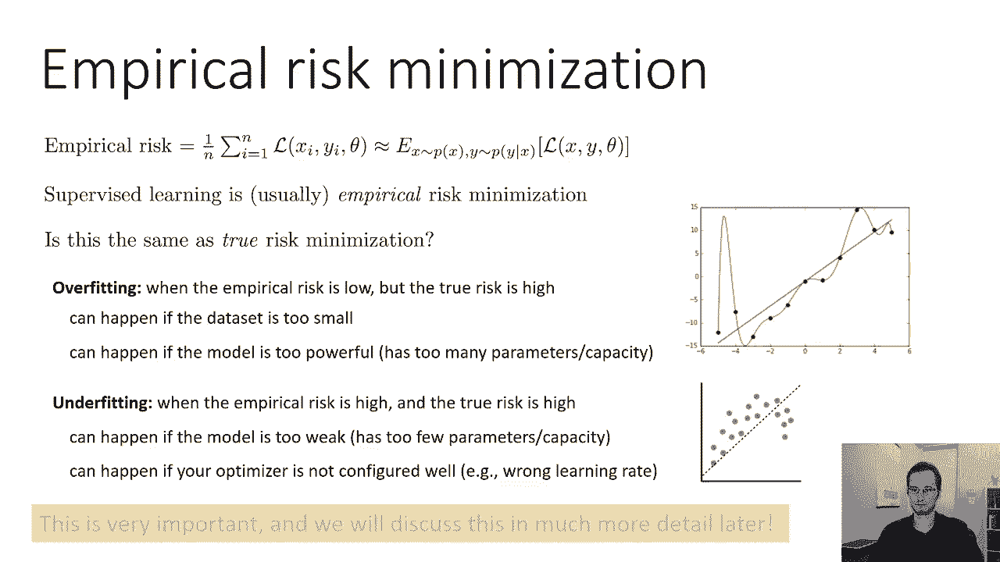
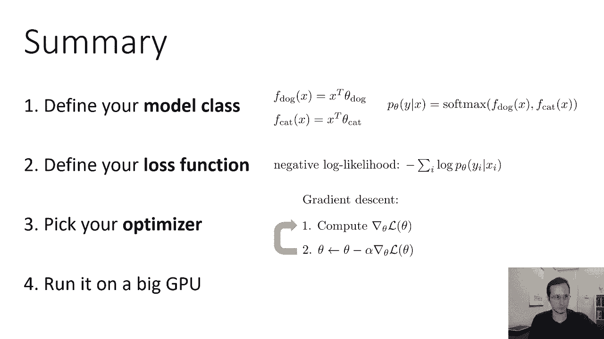

# P7：CS 182- Lecture 2, Part 4- Machine Learning Basics - 爱可可-爱生活 - BV1PK4y1U751

所有权利，在今天讲座的最后一部分，我们将讨论优化。

所以我们定义了我们的模型类，我们定义了损失函数，现在我们要做的是弄清楚如何找到θ的设置。

使我们的损失函数最小化，我们的负对数似然，思考一件事是有帮助的，当想象优化算法是所谓的损失景观时，你可以把失去的景观想象成损失函数的一个情节，所以我要用θ的l来表示损失函数，假设θ是二维的。

所以它只是由两个数字组成，你可以想象一个情节，水平轴是θ1和θ2，θ的二维，垂直轴表示θ的函数l，假设我们是，嗯，你知道我们有一个功能，看起来像这样，所以它是一个，它是一个单峰凸函数，只是看了一眼。

你知道最好的西塔在哪里，就在碗底，但是假设我们没有最好的θ设置，假设我们在这个黑圈，直觉上，为了找到最好的θ，我们要做的是修改它，使它朝着最陡峭的下降方向移动，我们想基本上找到损失函数减小的方向。

向那个方向移动我们的θ，所以一个非常一般的算法草图是找到方向v，使得l fθ在那个方向上减小，然后向那个方向移动θ，所以选择新的θ作为旧的θ，加上一些呃速率α乘以zα是一些小常数，也称为学习速率或步长。

就像如果你想在物理世界中使用物理类比，天然的，你知道的，自然物理物体会向最陡峭的下降方向坠落或滚动，如果你拿一块大理石把它放在这片风景中，它会向最小值下降，最终你会找到最小值，它会在那里稳定下来。

这就是算法背后的直觉，我们要开发，我们只想找到θ的l减少的方向，然后现在往那个方向走，有趣的是，最陡峭的下降方向实际上并不总是最好的选择，我们将更多地讨论其他类型的优化算法，在后来的讲座中。

所有这些方法的共同点是什么，它们都会朝着θ的l减小的方向运动，至少是本地的，所有的权利，然后我们只是重复这个过程，所以如果我们重复这个过程足够多次，也许我们最终会安定下来。

所以让我们试着从数学上实例化一个这样的方法，所以如果我们有θ的函数l，作为一个快速测验，θ的l首先向哪个方向减少，什么是方向，我们如何表示一个方向，右θ是一个向量，在这种情况下。

它是一个有两个条目的向量，方向也是矢量，也有两个条目，所以我们需要取θ的l，我将生成一个二维向量，它指向，其中θ的l将减少，也许在一个维度上考虑这一点是最容易的，所以在一维，如果我在这里。

这个函数的斜率会告诉我，它向哪个方向减少，只有两个方向，左右，所以如果斜率是负的，这意味着函数向右减小，如果斜率为正，这意味着函数向左减小，所以从斜坡上看，我可以告诉你该走哪条路来减少功能。

同样的直觉也适用于更高的维度，所以总的来说，你可以想象拿一个高维函数，单独考虑每个维度，弄清楚，如果斜率为正或负，如果是阳性，呃，然后你沿着那个维度向左移动，否定方向的意义，如果是负数。

你沿着那个维度向右移动，积极方向的意义，所以对于每一个维度，沿着斜率相反的方向沿着那个维度，什么是斜坡，嗯，斜率只是导数，所以我们要做的就是为每个维度设定方向，为我们函数l的偏导数的负数。

关于θ的那个维度，所以v 1是d l dθ1的负数，v 2是d l dθ2的负数，这保证会给你一个θ的l减少的方向，好的，呃，一些突击测验问题，这是l fθ减小的唯一方向吗，嗯，答案不一定是对的。

事实上，有整整一半的向量空间，呃，哪里的方向，嗯，θ减少，这些偏导数给出了最速下降的方向，但如果你稍微向左或向右，你现在还是会减少，如果你往相反的方向走，然后你增加x，事实上，只要你有一个V的正点积。

你会沿着θ的l减小的方向前进，所以这不是一个独特的解决方案，这不是一个独特的减少结构，这是最陡峭的一个，但并不一定意味着它是最好的，但这是我们要做的选择，一个非常有用的概念是渐变。

这里用渐变符号写的渐变只是一个向量，其中该向量的每一维都是函数的偏导数，相对于theta的相应维数，这里v是梯度的负值，对呀，所以说。

梯度是通过取偏导数并将它们堆叠成向量来形成的，我们将讨论更多关于梯度中心相关方法的细节，在后来的讲座中，但现在这里是算法的草图，第一步计算梯度，第二步把θ设为θ减去α乘以梯度，所以梯度是负的，v这里。

这和上面的算法完全一样，我们只是实例化它来使用渐变，上面的算法比较通用，它可以使用任何减少的方向，梯度给了我们一个这样的方向，所以这是梯度下降算法。

所以在这一点上，我们实际上已经选择了我们的优化器，我们的优化器作为梯度下降，所以我们准备在一个大的GPU上运行我们的算法。

算法叫什么，我们刚刚设计好了什么，我们刚刚设计了一种叫做Logistic回归的方法，逻辑回归不是，但是我们将要讨论的深度学习中的许多概念，实际上从逻辑回归中获得灵感，总结一下逻辑回归，你有一个函数fθ。

该函数输出n维，一个n维向量，其中标签y可以具有m个不同的值，所以对于每一个可能的标签Y，有一个相应的Theta y，这个向量的每个维都由x之间的内积给出，和相应的他们，你可以把这个写成一个，呃。

你知道的，在矩阵表示法中，通过说x的fθ等于x转置乘以矩阵θ，其中x是列向量，所以x转置是行向量，它乘以一个矩阵，其中每一列都是对应于不同标签的θ，所以第一列是第一个标签的θ向量。

第二列是第二个标签的θ向量，等等，现在如果你想象一下这个矩阵乘法是什么样子的，当你做矩阵乘法的时候，你把右边矩阵的每一列，然后用左边矩阵的每一行点缀它，但是只有一排，这意味着你最终得到了一个列向量。

其中列向量中的每个条目都只是x之间的点积，我们矩阵的每一列，所以我们可以把f写成，呃，你知道的，在矩阵表示法中以一种非常简单的方式，只是x转置θ，然后Y带有特定标签的概率。

i只是由应用于x的fθ输出的softmax函数给出的，所以记住x的fθ输出一个向量，有m个项的向量，Softmax函数接收该向量，Softmax函数的第i个输出是i的指数。

向量中的第1个条目除以所有条目的指数之和，这确保了我们的概率都是正的，它们加起来都是一个，这就给了我们这个Logistic回归算法，的，参数θ定义这些分隔类的行。

给定类的概率在远离该类的情况下增加或减少，我们找到最好的θ的方法，我们学习θ的方法是用梯度下降，现在我们需要一点微积分来实际计算这些导数，但原则上我们需要，我们有我们需要的一切对吧，因为我们有功能。

所以我们可以用，呃，微积分课程中的微分规则来计算这些导数，在后面的讲座中，我们实际上会讨论自动微分，以及我们如何使计算这些导数的过程自动化，这样我们就不用手工了，我们的损失是负对数似然。

这基本上就是我们需要知道的一切，为了实现Logistic回归。

嗯，作为一个小锻炼，让我来介绍一下逻辑回归的一个特殊情况，当您有二进制标签时，当你只有两节课的时候，就像猫和狗，在这种情况下，有一个很好的小简化发生，虽然这种简化并不重要，我想有些代数是，你知道的。

它在其他一些地方有一点信息和有用，所以我只想详细说明一下，给你们举一个例子，我们只有两节课，我们有你一个和你两个，逻辑回归，呃，概率可以由这个方程给出，这里我把f换成了softmax。

所以y 1的p是θ的e，y 1点缀着x，除以归一化子，这里的问题是，同时拥有他们一个和他们两个有点多余，因为如果你正好有两节课，那么给x的y 1的p加上给x的y 2的p等于1，所以如果你知道y中的p。

给定x，在给定x的情况下，你可以得到y 2的p，所以我们在这里所做的是我们对这个函数进行了过度的参数化，这意味着我们使用的参数比实际需要的要多，这里有一点代数，这可以说明为什么我们不需要这么多参数。

让我们把这个方程，让我们把顶部和底部都乘以e，得到负的θy，x的一个点，如果你把分子和分母相乘，同样的事情不会改变等式，现在请注意，当你有两个指数的乘积时，你可以把它写成指数，它们的指数之和。

所以你可以等价地把e写成θy 1转置x，减去θy 1转置x，在分母中，我们有e到θy 1转置x，减去θy 1转置x，加e到呃，到θy 2转置x，减去θy 1转置x，所以说，当然啦。

y 1减去y 1位就会抵消，它就会变成零，零的指数是1，同样的事情也发生在分母上，所以我们实际上要大大简化这个函数，让θ星形或者抱歉θ+等于θy1减去θy2，在这种情况下，上面的方程简化为一比一。

加e到负θ加上点x，这是一个更简单的方程，但请注意，现在我们有，我们有一半的参数，我们实际上不需要一个单独的他们一个和他们两个，我们只需要θ+，一般来说，你总是可以去掉其中一个θ向量。

但人们通常不会费心这么做，当有大量的班级时，如果你有一千门课，去掉其中一个向量并不能真正为你节省任何东西，但是如果你有两节课，去掉其中一个参数的数量减少了两倍，所以这是一个重要的特例。

这个函数有时被称为Logistic方程，这实际上就是Logistic回归得名的地方，使用SoftMax的Logistic回归的多类版本实际上是后来的创新，原始的Logistic回归是二元的。

这叫做逻辑回归，因为它使用Logistic方程来得到其中一类的概率，这就是逻辑方程的样子，很像我之前给你看的照片，它在左边饱和到零，在右边饱和到一。

它有时也被称为乙状结肠，我想简要介绍的最后一个概念，是一个特殊的术语，你有时会听到人们在做，监督，了解到他们所做的是经验性的，风险最小化，让我向你解释这些话是什么意思，让我们回想一下零一损失SS。

零一损失，呃是零，如果你得到一个，嗯，对了，如果你弄错了，就一个，我在这张幻灯片上有个小错别字，这实际上是负一零损失，零一损失不会有负号，它将是f的delta函数，x不等于y，但是别担心。

它只是一种数学上非常复杂的方式来陈述一件非常简单的事情，如果你弄错了，你的损失就是一个，如果你得到一个正确的零，那是零一看起来如果错了怎么办，零，你可以把风险看作是你出错的概率。

对呀，回想我们的生成过程，有人拍照，这是一张随机抽样的图片，从图片的分发，它有一个从标签的真实分布中取样的标签，鉴于那张照片，你答对或答错的可能性有多大？嗯，你出错的概率只是零一损失的期望值。

那么x的fθ是错的可能性有多大，这只是零一损失的期望值，对呀，所以你可以称之为风险，你得到错误答案的风险，现在这就是这一切都是零一个损失，但你可以把这个概念推广到其他损失上，你可以这么说。

如果为了零一损失，风险是零一损失的期望值，你可以说，对于其他一些损失，只是该损失的期望值，它不再有这种美好的解释，你弄错的概率，但这仍然是一个你可以这样做的数字，如果我们用负对数似然。

我们可以说风险是x上真实分布下的期望值，Y上的真实分布，我们将得到的损失的x和y和我们所学的θ，所以风险是你实际上想最小化的，问题是你实际上无法计算出真正的风险，因为你不能随意地从x的p中取样。

你不能就这样得到无限的样本，相反，你会得到一个数据集，你只有D，所以你可以计算出所谓的经验风险，经验风险只是对真实风险的基于样本的估计，你通过将你的损失与你所有的样本平均来得到，所以说。

经验风险是我们实际上最小化的，当我们进行监督学习时，但经验风险有望接近真实风险，好的，我们可以问，在这一点上，经验风险实际上是真实风险的一个很好的近似值吗，什么时候好，为什么好。

为什么会不好呢，让我们稍微讨论一下，所以监督学习通常是经验风险最小化，这和真正的风险最小化是一样的吗，嗯，有两个设置，虽然这可能会给你带来麻烦，在其中的第一个，实际情况就是这样。

真实风险和经验风险不一样，这是过拟合的设置，当经验风险较低时，就会发生过拟合，但真正的风险很高，这意味着你在训练中的平均损失很低，但是你损失的真正期望值并不低，这可能看起来有点奇怪，因为，当然啦。

你的经验风险是对真实风险的无偏样本估计，但请记住，您实际上是在使用这些数据点来学习θ，所以θ与你的训练点耦合，你的估计器不再是无偏的，如果这让你有点困惑，有一个更直观的解释，我们适合它。

假设我正在努力适应这条线，这些点与我的训练数据相对应，所以这些点基本上是对齐的，但有一点噪音腐蚀了他们，如果我对这些点拟合一个非常高的多项式，我会得到一个类似这样的疯狂函数。

这个疯狂的函数具有非常低的经验风险，因为它直接穿过点，但它的真正风险将是相当高的，所以如果数据集太小，就会发生这种情况，或者如果模型太强大就会发生，这意味着您的模型有太多的参数，容量过大，在这种情况下。

它正在发生，因为我拟合了一个高次多项式，有更多的变量来拟合这些数据点，所以这就是经验风险与真实风险不同的时候，另一个会让你陷入困境的情况，经验风险与真实风险相匹配的地方，但你得到了所谓的。

拟合下拟合是当经验风险很高时，真正的风险很高，所以这里，比如说，真正的函数可能是一种曲线，但我们选择在上面放一条线，这条线和那条曲线不太匹配，所以如果模型太弱，就会发生这种情况。

它在深度学习方面的参数太少或者容量太小，如果你的模型很好，这也可能发生，但是您的优化器配置得不好，也许你用了一个非常糟糕的学习率，或者你选择了一个非常糟糕的优化算法，这也可能导致不适合。

过拟合和欠拟合是非常非常重要的概念，如果你现在还不完全清楚，别太担心，因为我们会在后面的课上更多地讨论它，但是这个材料很重要，我们会再回来的。

总结一下我们在这节课中所涉及的内容，我们讨论了如何导出我们的第一个监督学习算法，也就是逻辑回归，我们讨论了如何定义一个算法，我们基本上需要做三个选择，然后我们需要做第四件事，但电脑为你做了这件事。

所以选择是定义您的模型类，定义您的损失函数，并选择优化器，然后电脑为你做的第四件事是，实际上运行在一个大的GPU上，我们选择的模型类是logistic模型，其中我们有一个函数f。

在我们的输入和参数中是线性的，然后我们对它应用软最大值来得到概率，我们选择负对数似然作为损失函数，然后我们用梯度下降来优化它，在未来，我们将讨论其他优化器，其他模型类，我们甚至会讨论其他损失函数。

但就目前而言，希望这能让你了解我们如何建立这些机器学习算法。

