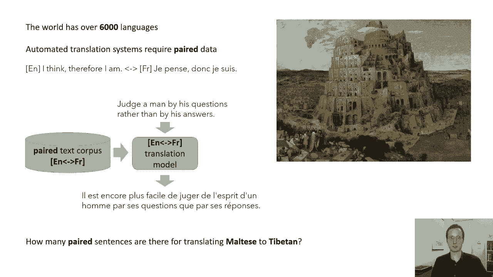
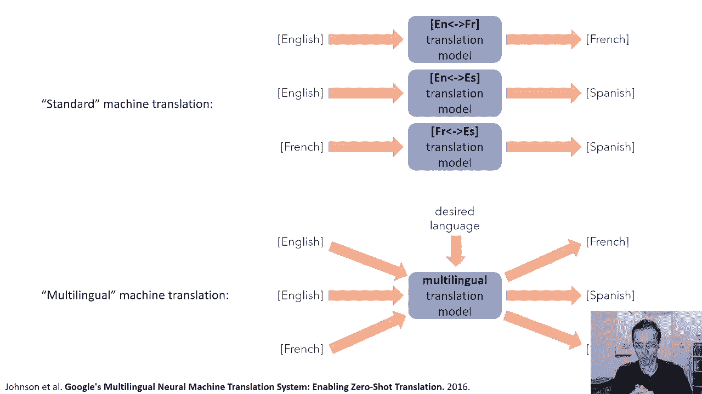
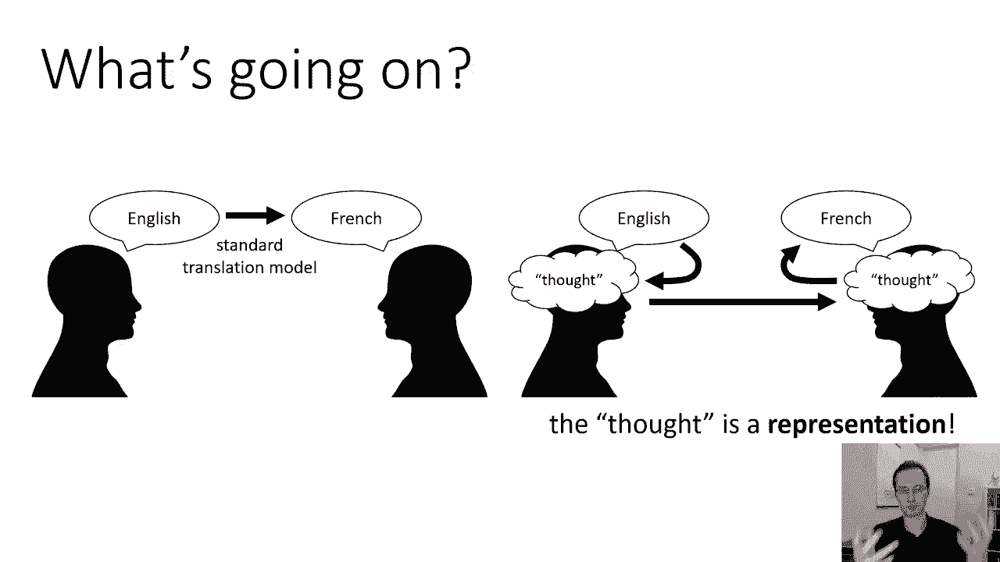
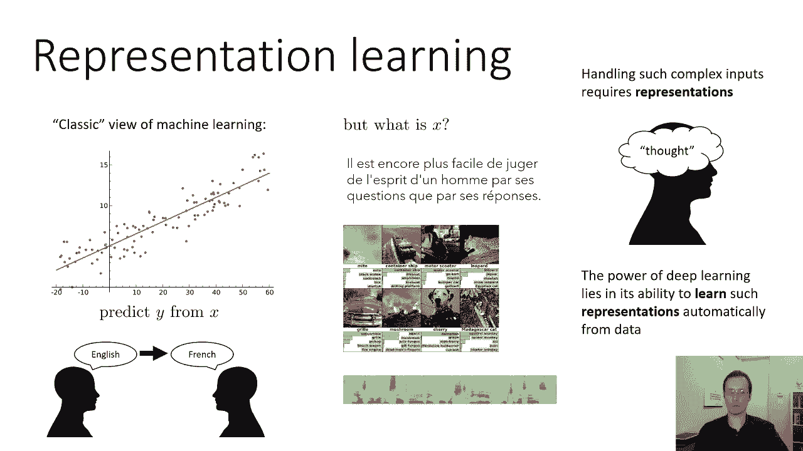

# 1：CS 182 第一讲，第一部分 - 引言 🎯

在本节课中，我们将要学习深度学习中的一个核心概念：**表示学习**。我们将从一个关于多语言机器翻译的生动例子开始，探讨模型如何通过构建一种“语言无关”的内部表示，来解决传统方法中数据稀缺的难题。这个故事将帮助我们理解，为什么自动学习有效的表示是深度学习如此强大的关键。

---

## 多语言机器翻译的挑战 🌐

世界上有六千多种不同的语言。然而，如果我们想训练一个模型从一种语言翻译成另一种语言（例如用于机器翻译系统），我们通常需要**配对数据**。这意味着我们需要一种语言的句子示例和其在另一种语言中对应的翻译。

例如，英语句子“I think, therefore I am”对应于法语句子“Je pense, donc je suis”。训练机器翻译系统的标准方法是：收集一个大型的配对语料库，其中包含源语言句子及其对应的目标语言翻译，然后在此基础上训练一个翻译模型。一旦模型训练完成，它就可以接收源语言句子并生成目标语言的译文。

但是，考虑到语言种类的繁多，这种方法可能相当麻烦，尤其是对于使用人数较少或数据稀缺的**低资源语言**。例如，现有数据集中可能很少有将马耳他语翻译成藏语的配对句子。当谷歌的研究人员面临这个问题时，他们想出了一个更具创意的解决方案，这个方案也阐明了深度学习的一个重要原则。

---

## 从单一模型到多语言模型 🔄

上一节我们介绍了传统机器翻译对配对数据的依赖。本节中我们来看看一种创新的解决方案：**多语言机器翻译模型**。

一个标准的机器翻译系统会为每一对语言训练单独的模型。例如，英语到法语一个模型，英语到西班牙语另一个模型。

而研究人员提出的方法是：建立一个**单一的多语言模型**。这个模型可以读取任何语言的句子，并在接收到指定目标语言的附加输入后，将其翻译成任何其他语言。

以下是这种模型的工作方式：
*   你将句子输入模型，无论它是什么语言。
*   你同时告诉模型：“把它变成西班牙语”。
*   模型会输出相应的西班牙语句子。

至关重要的是，这种模型可以在与标准模型集合完全相同的数据上进行训练。你只需要将所有配对数据（如英语-法语句子）标记上目标语言“法语”，将所有法语-西班牙语配对数据标记上目标语言“西班牙语”，以此类推。训练这样的模型不需要任何新数据，只是以不同的方式利用已有数据。

---

## 为什么多语言模型有效？ 💡

上一节我们介绍了多语言模型的架构。本节中我们来探讨它为何有效。

许多语言之间存在共性。例如，会说西班牙语的人，虽然不会说意大利语，但经常能对意大利语单词的含义做出有根据的猜测，因为两种语言有相似的词根和规则。

这种多语言模型，即使在某种语言的配对数据较少时，也能利用从其他语言中学到的知识，做出有根据的翻译猜测。

这样的模型能做的另一件事是，在**没有见过特定语言对**的情况下执行翻译。例如，如果模型学习过“英语到西班牙语”和“日语到中文”，但从未见过“英语到中文”，它可能已经建立了英语句子的某种通用内部表示。当它读入一个英语句子时，可以将其转换为这种通用表示，然后再解码成任何目标语言（包括中文）。

---

## 实验发现与洞察 🧪

上一节我们讨论了多语言模型的潜力。本节中我们来看看研究人员通过实验发现了什么。

他们发现：
1.  **提升效率**：这种方法尤其在翻译低资源语言时比单一模型更有效。加入更多通用语言（如西班牙语、法语）的数据，也能提高翻译成相关低资源语言的质量。
2.  **零样本翻译**：模型可以实现**零样本机器翻译**。这意味着模型可以翻译它从未见过配对数据的语言对（例如，只学过“英语到法语”和“英语到西班牙语”，但能完成“法语到西班牙语”的翻译）。这证明了模型内部确实形成了某种语言无关的表示。
3.  **有趣的插值实验**：研究人员让模型生成两种目标语言的“混合”翻译（例如，40%西班牙语风格 + 60%法语风格）。通过观察输出如何随混合比例平滑变化，可以洞察模型对语言的理解。

以下是一个具体实验示例：
*   **任务**：将英语翻译成西班牙语和葡萄牙语的混合。
*   **观察**：随着葡萄牙语权重的增加，输出句子中的单词被逐渐替换，从纯西班牙语平滑过渡到纯葡萄牙语。
*   **另一个例子**：在英语到俄语/白俄罗斯语的翻译插值中，在中间比例（如44%俄语，56%白俄罗斯语）时，模型竟然生成了**乌克兰语**的句子。这很有道理，因为白俄罗斯语数据稀缺，模型利用了从乌克兰语（一种相关语言）中学到的知识来填补空白。

---

## 核心启示：表示学习的力量 🧠

上一节我们看到了多语言模型的有趣行为。本节中我们来提炼其背后的核心思想。

这个多语言翻译的故事说明了深度学习的**一个重要观点**：关键在于学习合适的**表示**。

传统的翻译观是字面地将一种语言的句子变成另一种语言的句子。而另一种思路是：
1.  源语言句子是说话者某个**思想**（或语义内容）的体现。
2.  这种思想在本质上是**语言无关的**。
3.  如果我们能找出表达这个思想的语言无关的**表示**，再想象一个目标语言使用者会如何用他们的语言表达同样的思想，就能实现翻译。

这样，我们就不再需要所有语言对的配对数据，只需要知道每种语言如何与这个通用的“思想表示”相互转换。这使得机器翻译问题变得简单得多。

当然，模型并非真正理解“思想”，但它确实学习到了一种比原始单词更接近语义、对语言变化更鲁棒的**内部表示**。自动学习这种强大的表示，正是深度学习的关键能力。

---

## 从机器学习到表示学习 📈

上一节我们通过翻译案例引入了“表示”的概念。本节中我们正式将其与经典机器学习对比。

机器学习问题的经典观点是：从输入 `X` 预测输出 `Y` 的问题。我们通常拟合一个模型（如线性模型 `Y = wX + b`）来建立 `X` 到 `Y` 的映射。

但在实践中，`X`（如图像、声音、句子）通常非常复杂，内部包含丰富结构。像深度学习这样的技术之所以强大，主要在于它能够自动从这些复杂输入中学习到适合做预测的**有效表示**。

深度学习方法的力量，就在于能够**从数据中自动学习这样的表示**，从而处理极其复杂的输入和任务。

---

## 总结 📝

本节课中我们一起学习了：
1.  **多语言机器翻译模型**如何通过单一模型处理多种语言翻译，缓解了低资源语言的数据稀缺问题。
2.  模型有效的关键在于它学习了**语言无关的内部表示**，使得零样本翻译成为可能。
3.  实验表明，模型可以通过表示在不同语言间进行平滑插值，并利用语言间的共性。
4.  这个故事的核心启示是：深度学习的强大之处在于**自动学习有意义的表示**。将原始、复杂的数据（如文本、图像）转化为更适合解决任务（如翻译、分类）的表示形式，是许多深度学习成功应用的基础。

这种表示学习的思想，将贯穿我们后续的整个课程。