# 2：CS 182 - 深度学习导论（第1讲，第2部分） 🧠

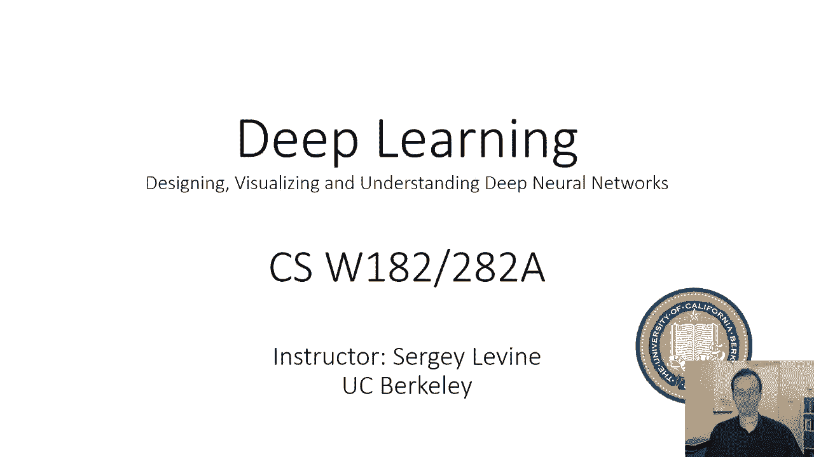

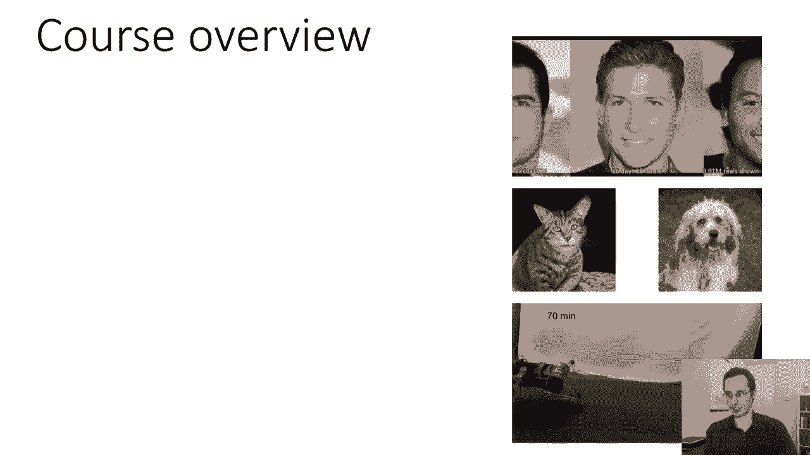

在本节课中，我们将学习深度学习的基本概念、课程概述以及核心的机器学习思想。我们将从课程内容介绍开始，逐步深入到机器学习和深度学习的定义与区别。

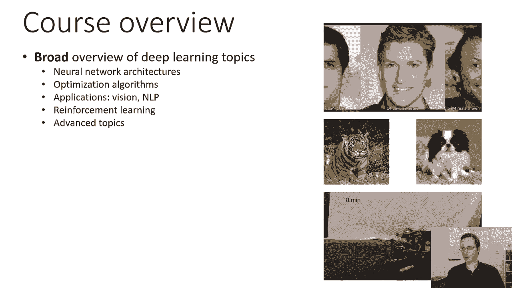

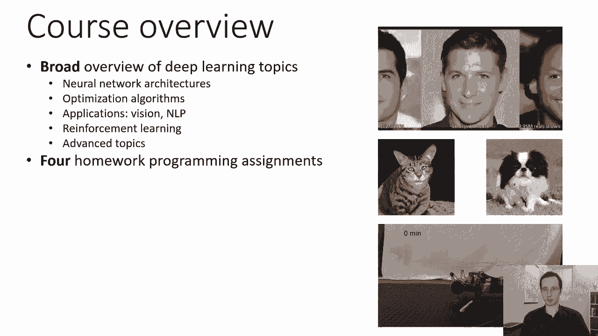

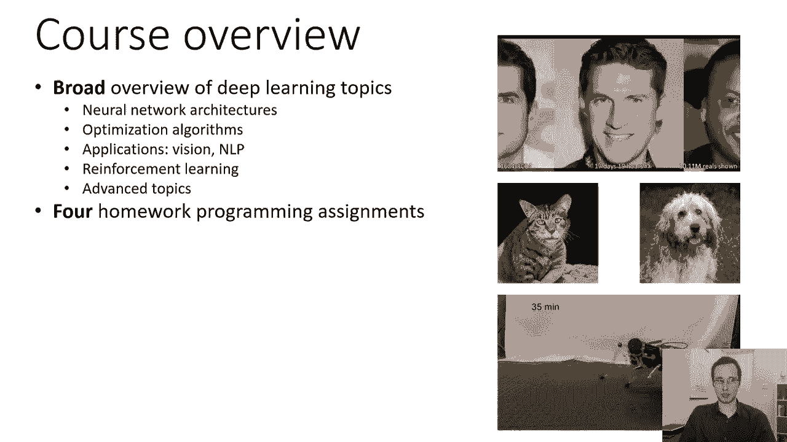

---

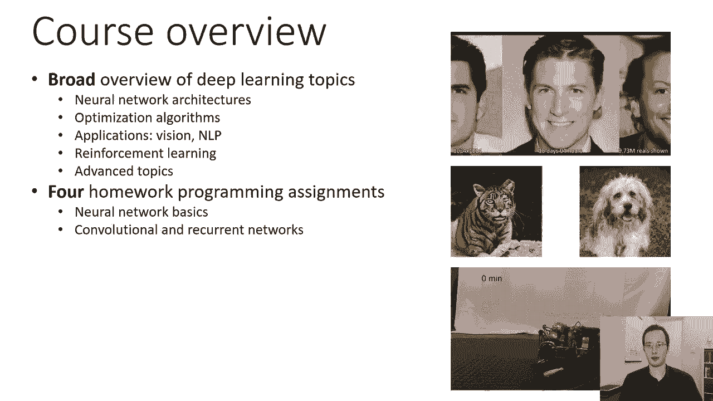

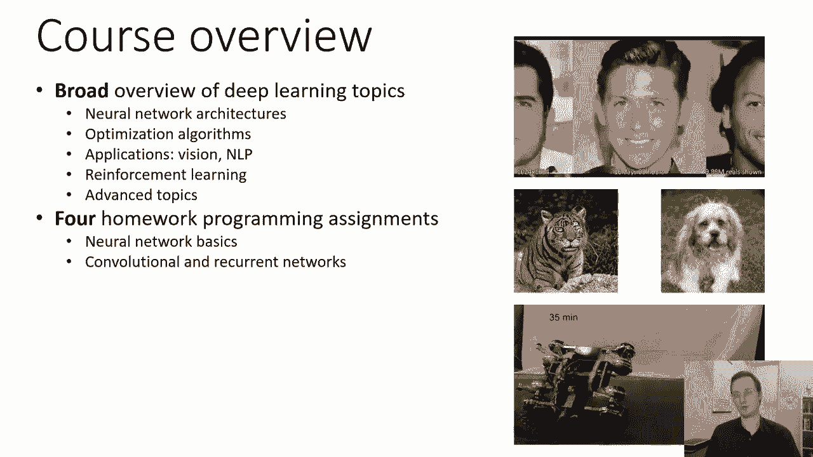

## 📚 课程概述与政策

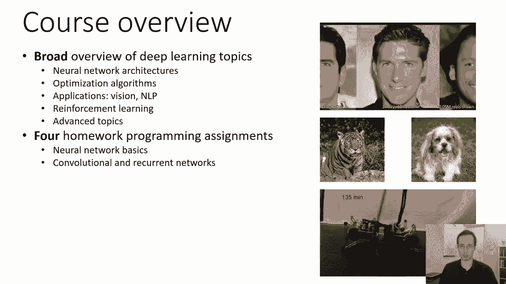

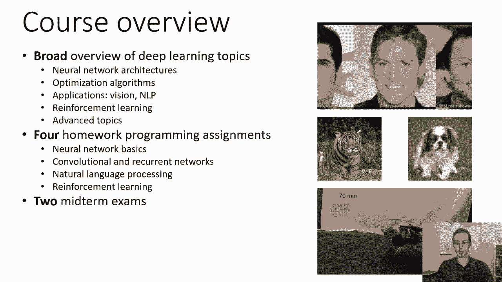

上一部分我们介绍了课程的基本信息，本节中我们将详细说明课程内容、作业安排以及相关政策。

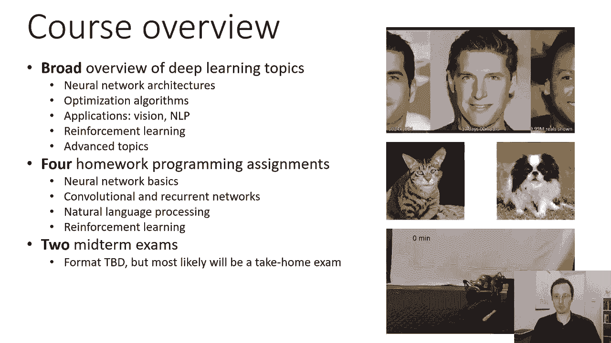

### 课程内容简介

本课程旨在介绍深度学习领域的现状。我们将涵盖以下主题：

*   神经网络架构
*   优化算法
*   自然语言处理与计算机视觉中的应用
*   强化学习
*   高级主题，如迁移学习或元学习

### 作业与考核

以下是本课程的主要考核组成部分：

*   **四次编程作业**：需要编写并运行代码，实现神经网络基础、卷积网络、循环神经网络、自然语言处理及强化学习相关任务。
*   **两次期中考试**：具体形式待定，可能为线上考试。
*   **一个期末项目**：这是课程的重要组成部分，占总成绩比重较大。本科生需从指定主题中选择，研究生项目则更具开放性。

### 评分政策

课程成绩构成如下：

*   期中考试：30%（每次占15%）
*   编程作业：40%（每次占10%）
*   期末项目：30%

### 课程先决条件

为了顺利完成本课程，你需要具备以下知识：

*   **数学基础**：扎实的微积分和线性代数知识，特别是多元导数和矩阵运算。
*   **概率论**：熟悉连续随机变量、高斯分布等概念。推荐学习过CS 189或具备同等统计学背景。
*   **编程能力**：能够熟练使用Python进行编程。

如果你对先决条件不确定，可以在课程初期通过尝试作业来进行自我评估。

---

## 🤖 什么是机器学习与深度学习？

在了解了课程安排后，我们现在进入核心概念部分。本节我们将探讨机器学习和深度学习的基本思想。

### 机器学习的基本问题

考虑一个基础问题：编写一个程序，输入一张图片，输出其中是否包含小狗。直接编写规则（如“有两只耳朵、两只眼睛”）非常困难，因为“耳朵”、“眼睛”在像素层面难以定义，且规则充满例外。

因此，关键思想是：**当输入到输出的映射规则复杂且充满特殊情况时，提供数据示例比手动编写规则更容易**。机器学习正是适用于此类情况的方法。

### 机器学习的数学表示

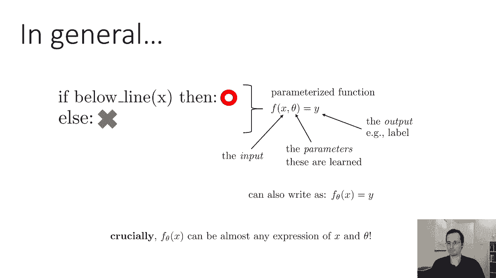

以一个更简单的二维点分类问题（标记为X或O）为例。我们可以用一个带参数的函数来表示这个“程序”：

**公式**：`f_θ(x) = sign(θ_1 * x_1 + θ_2 * x_2 + θ_3)`

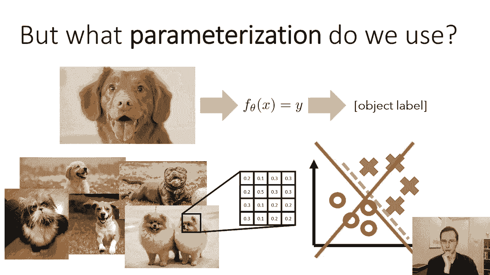

其中，`x` 是输入（点的坐标），`θ` 是参数，`f_θ(x)` 输出分类结果。**学习的过程就是找到正确的参数 `θ`**，使得函数对训练数据给出正确答案。

一般情况下，我们有一个参数化函数：`y = f(x; θ)` 或写作 `f_θ(x) = y`。`θ` 是学习的参数，`f` 可以是任意复杂的表达式。

### 从浅层学习到深度学习

对于像识别小狗这样复杂的问题，简单的线性函数（如上述公式）无法胜任。传统方法（可称为“浅层学习”或基于特征的学习）分两步：

1.  使用手工设计的固定函数从原始输入 `x` 中提取特征 `φ(x)`（例如，计算机视觉中的边缘特征）。
2.  在这些特征上使用学习到的简单模型（如线性分类器）进行预测。

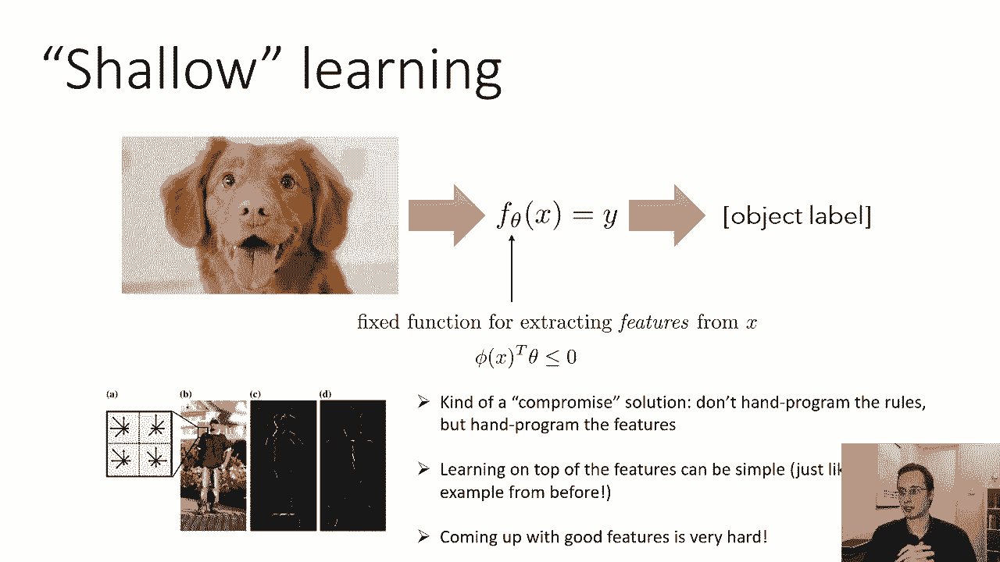

这种方法的问题是，设计好的特征非常困难。

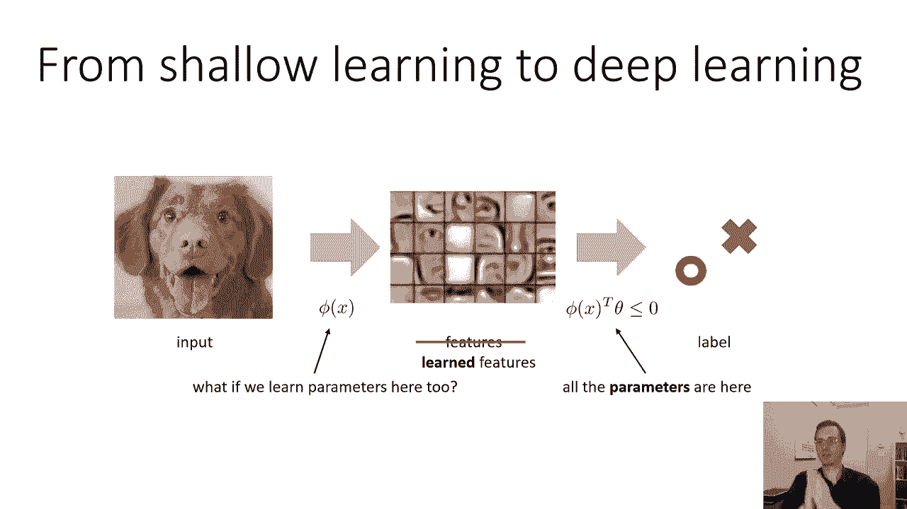

深度学习的核心思想是：**让特征 `φ(x)` 本身也包含可学习的参数**。并且，我们可以堆叠多层这样的学习转换。

**深度学习是具有多层学习表示的机器学习**。每一层都将前一层的输出转换为更高级、更抽象的表示。例如，在图像识别中，底层可能学习到边缘，中层学习到部件（如眼睛、耳朵），高层学习到整个物体（如小狗）。这些高级表示对无关变量（如光照、背景）更不敏感，从而使最终预测更容易、更鲁棒。

通常，这个多层参数化函数就是一个深度神经网络。当所有层的参数都为了最终任务目标（如准确分类）而共同学习时，这被称为**端到端学习**。

---

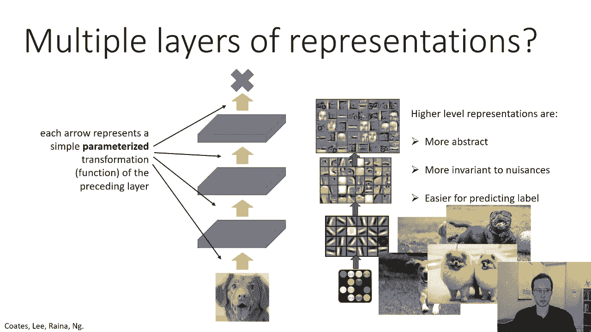

## 🎯 总结

本节课中，我们一起学习了以下内容：

1.  **课程概述**：了解了CS 182/282课程将涵盖的核心主题、作业与考核方式以及相关的课程政策。
2.  **机器学习动机**：理解了当规则复杂且充满例外时，从数据中学习比手动编程更有效。
3.  **基本框架**：认识了参数化函数 `f_θ(x)` 的概念，其中 `θ` 是学习的关键。
4.  **深度学习核心**：掌握了深度学习通过堆叠多层可学习的转换，自动从数据中学习层次化、抽象的特征表示，从而实现端到端学习。

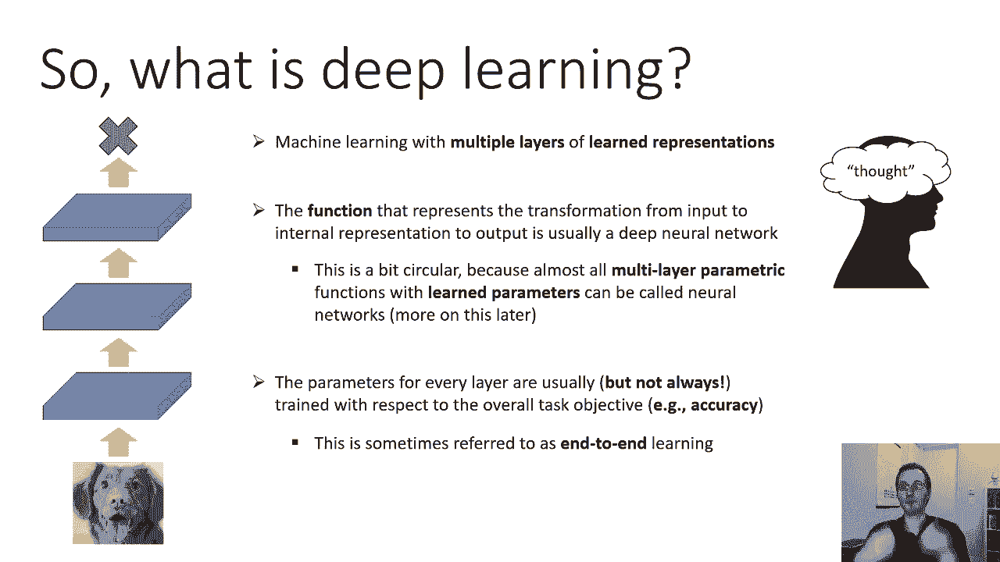

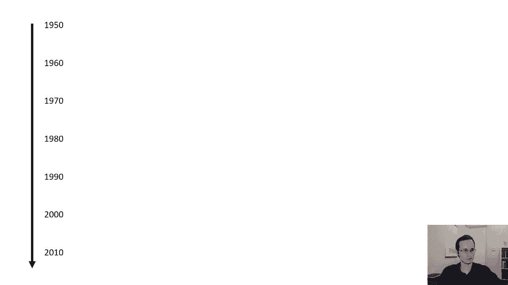

通过本讲，你应该对深度学习课程的全貌以及其试图解决的根本问题有了初步的认识。在接下来的课程中，我们将深入这些概念的技术细节。