# 3：CS 182 深度学习导论 - 第1讲第3部分 🧠

在本节课中，我们将要学习深度学习的历史发展脉络、使其成功的关键因素，以及它与生物神经系统的联系。我们将探讨为何深度学习在近年来取得突破性进展，并理解其背后的核心概念。

---

## 深度学习的历史脉络 📜

上一节我们介绍了深度学习的基本概念，本节中我们来看看它的发展历程。深度学习并非一蹴而就，其发展经历了多个关键阶段。

二十世纪五十年代，艾伦·图灵在其开创性论文中首次描述了机器学习的可能性。他提出的某些方法，在今天看来已初具人工神经网络的雏形。

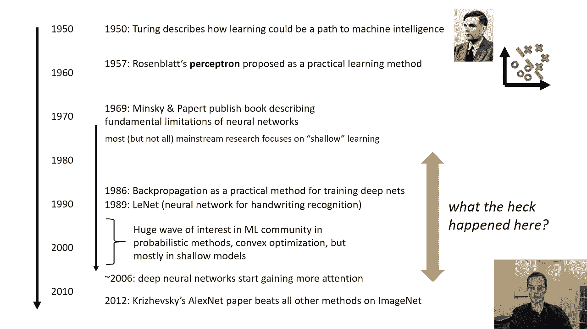

1957年，罗森布拉特提出了感知器及其学习算法。感知器本质上是一个进行**两类线性分离**的模型。其数学形式可表示为：

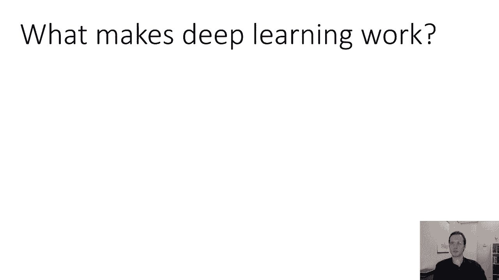

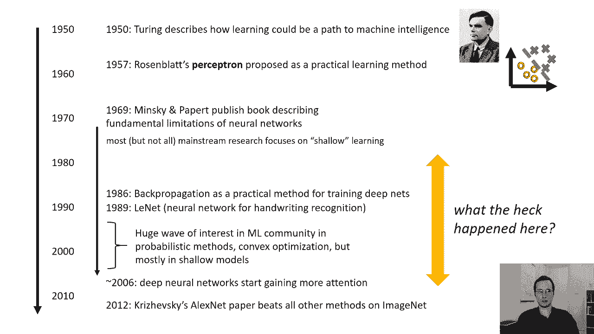

**公式：** `y = sign(w·x + b)`

其中 `w` 是权重向量，`x` 是输入向量，`b` 是偏置项，`sign` 是符号函数。

当时，感知器让人们感到兴奋，因为它提供了一个实际可行的学习算法。然而，在1969年，明斯基和佩珀特出版了一本书，指出了神经网络的一些基本局限性。例如，为给定问题找到全局最优的神经网络非常困难。这些认识在当时引起了广泛关注。

尽管如此，神经网络的研究仍在继续。1986年，反向传播算法的提出为训练深度神经网络提供了实用方法。1989年，出现了用于手写数字识别的神经网络，在识别邮政编码等任务上取得了良好效果。

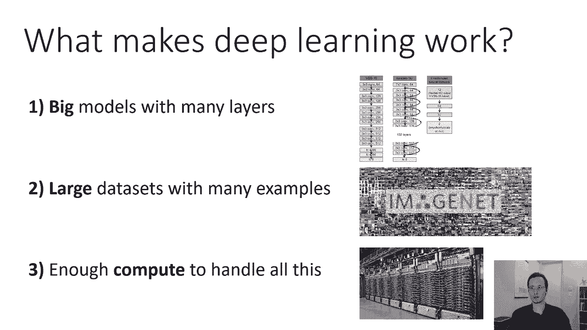

从20世纪90年代到21世纪初，机器学习社区的兴趣主要集中在概率方法、凸优化和相对简单的浅层模型上。这些模型的理论分析更为透彻。


转折点出现在2006年左右，深度神经网络开始获得更多关注。2012年，AlexNet论文的发表是一个里程碑事件。该模型在ImageNet图像识别挑战赛上击败了所有其他方法，标志着深度学习时代的到来。

---

## 深度学习成功的关键因素 🔑

那么，是什么因素促成了深度学习的成功呢？理解这些因素，能使我们对上述历史时间线有更清晰的认识。

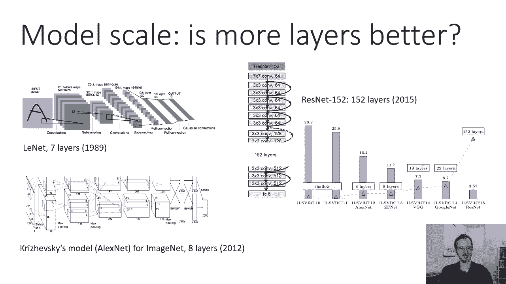

以下是使深度学习发挥作用的三个关键因素：

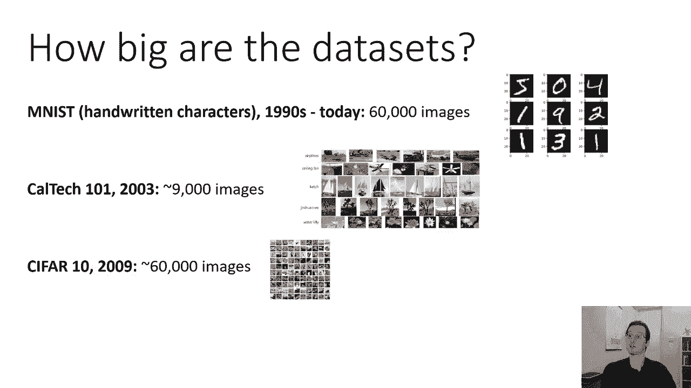

1.  **大模型（多层网络）**：深度学习有效性的一个重要原因是其学习**高级表征**的能力。高级表征是抽象的、能捕捉有意义的语义概念。要获得这种高级概念，需要许多层的简单处理叠加起来。层数越多，模型的表示能力通常越强。
2.  **大型数据集**：当模型具有很多层时，参数数量会非常庞大。训练这些参数需要大量的数据。此外，深度学习要学习的任务（如视觉识别）本身非常复杂，类比人类需要大量视觉经验才能发展出强大的视觉系统，因此机器学习系统需要大数据集并不奇怪。
3.  **强大的计算能力**：在大型数据集上训练具有海量参数的深度模型，需要强大的计算资源。只有这样，训练过程才能在合理的时间内完成，使模型具有实用价值。

这三者相辅相成，共同构成了深度学习爆发的基础。

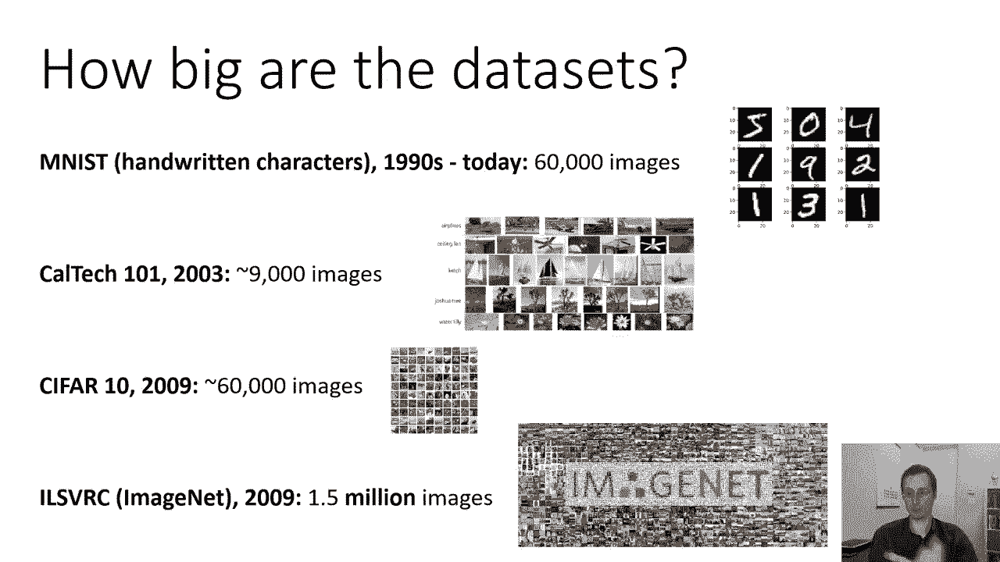

---

## 模型规模、数据与计算的演进 📈

上一节我们提到了三个关键因素，本节中我们来看看它们的具体演进过程。

### 模型层数与规模

模型的深度（层数）和宽度（每层的单元数）显著增长。例如：
*   1989年的LeNet手写数字识别网络有7层。
*   2012年的AlexNet有8层，但每层的单元数远多于LeNet。
*   近年来的先进模型（如ResNet-152）有152层，甚至存在超过1000层的模型。

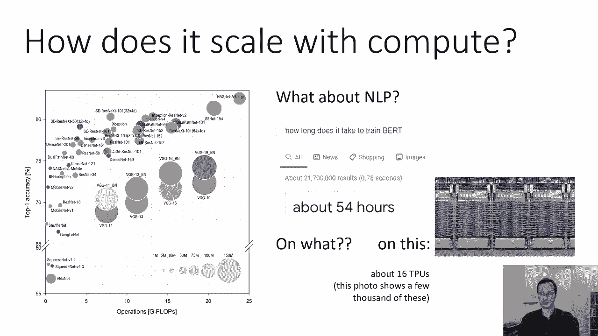

研究表明，在ImageNet挑战赛上，随着层数增加，模型的错误率持续下降（例如从AlexNet的16.4%降至ResNet-152的3.57%），证明了更多层级的有效性。

### 数据集大小

数据集规模也经历了巨大增长：
*   **MNIST**（20世纪90年代）：包含6万张训练图像的手写数字数据集。
*   **ImageNet**（2009年）：包含约150万张标注图像的庞大数据集，是深度学习复兴的关键推动力。
*   **工业级数据集**：像Facebook、Google这样的大公司使用的数据集往往比ImageNet还要大一到两个数量级。

更大的数据集为训练复杂模型提供了必要的“燃料”。

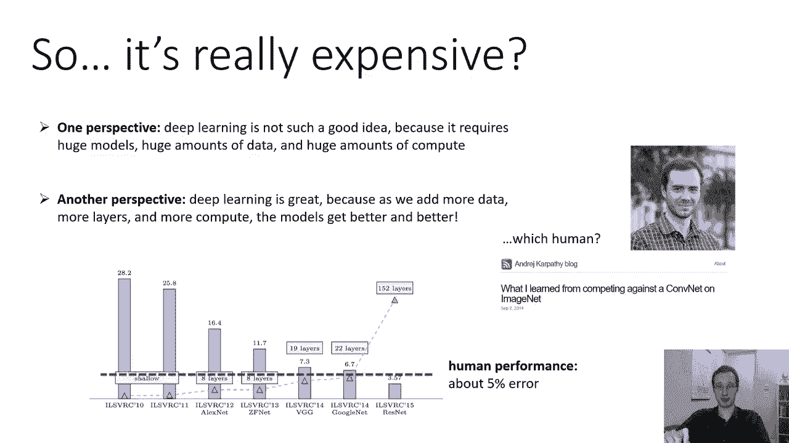

### 计算成本

训练和运行深度模型需要巨大的计算量。衡量标准之一是执行网络所需的**浮点运算次数（FLOPs）**。
*   AlexNet需要约**0.7 GFLOPs**进行单次推断。
*   现代的先进模型可能需要**数十甚至数百倍的GFLOPs**。

训练成本则更为惊人。例如，训练著名的BERT语言模型在16个专用TPU上需要约**54小时**。这凸显了深度学习对强大计算能力的依赖。

这些因素共同表明：**随着我们增加模型规模、数据量和计算资源，深度学习的性能可以持续提升**。虽然获取这些资源成本高昂，但这恰恰说明了深度学习的可扩展性和强大潜力。

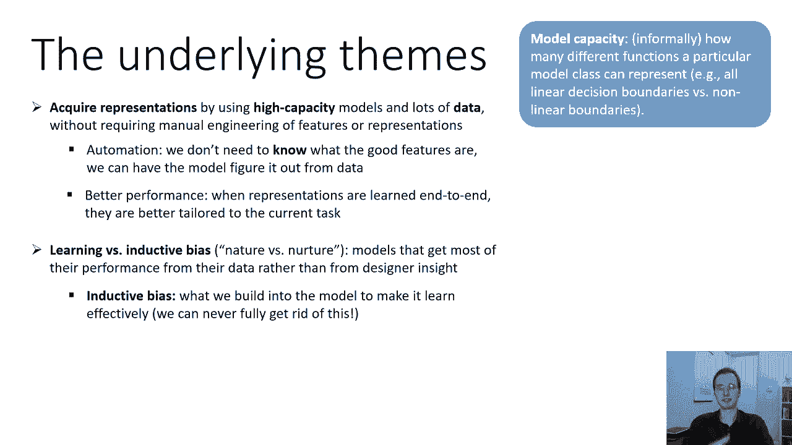

---

## 深度学习的核心主题 🎯

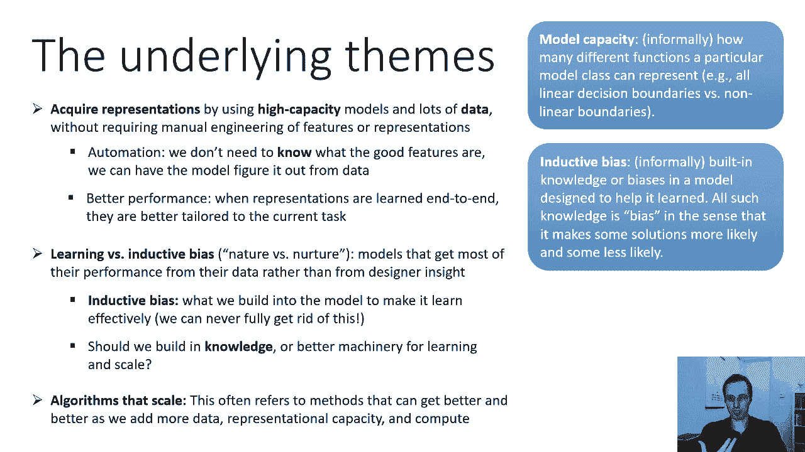

在课程中，我们将反复遇到几个核心主题。

**模型容量与自动化**
模型容量指的是模型能够表示的不同函数的范围。深度学习使用高容量模型，这带来了高度自动化——我们无需预先精心设计特征，模型可以从数据中自动学习。更大的容量意味着模型可能包含更优的解。

**归纳偏差**
归纳偏差是内置在模型中的、帮助其有效学习的假设或偏好。它是机器学习的“先天”部分。深度学习的艺术在于设计**通用、广泛适用**的归纳偏差，使其不限制模型从数据中学习的能力，同时在“内置知识”和“从数据学习”之间找到平衡。

**可扩展性**
可扩展性是指算法性能随着数据、模型容量和计算资源的增加而持续提升的能力。深度学习的许多成功都源于其良好的可扩展性。

---

## 为何称为“神经网络”？ 🧬

早期神经网络是受生物神经元启发而提出的简化模型。

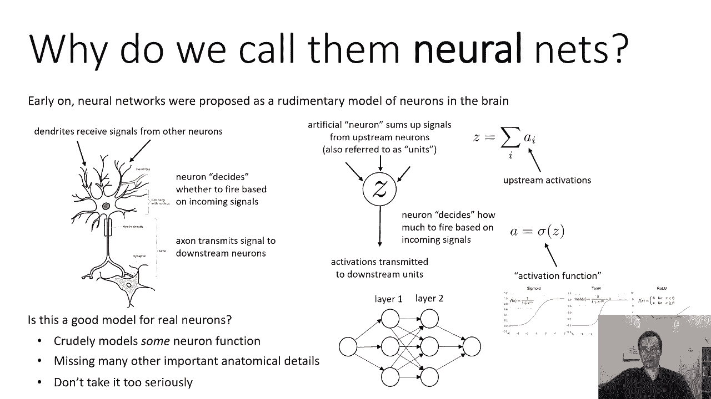

一个生物神经元通过**树突**接收来自其他神经元的信号，在**细胞体**中进行整合，如果达到阈值，则通过**轴突**发送信号到下游神经元。

人工神经元是对这一过程的粗略模拟：
1.  它接收来自上游神经元（单元）的输入信号 `x_i`。
2.  对这些信号进行加权求和：`z = Σ (w_i * x_i) + b`。
3.  对求和结果 `z` 应用一个**非线性激活函数** `f`，如ReLU：`a = f(z) = max(0, z)`。
4.  将输出 `a` 传递到下游神经元。

**代码示例（单个神经元的前向传播）：**
```python
def artificial_neuron(inputs, weights, bias):
    z = sum(w * x for w, x in zip(weights, inputs)) + bias
    a = max(0, z)  # 使用ReLU激活函数
    return a
```

需要明确的是，现代深度学习与大脑建模关联不大，其核心是解决机器学习问题。人工神经元是一个高度简化的抽象，忽略了许多生物细节。然而，有趣的是，深度神经网络学习到的特征（如对特定方向的边缘敏感）与哺乳动物初级视觉皮层中观察到的特征具有统计相似性。这或许表明，对于某些复杂问题（如视觉处理），足够强大的学习机制会收敛到相似的解决方案上，就像飞机和鸟都有翅膀一样，因为它们都是应对“飞行”这一问题的有效设计。

---

## 总结 ✨

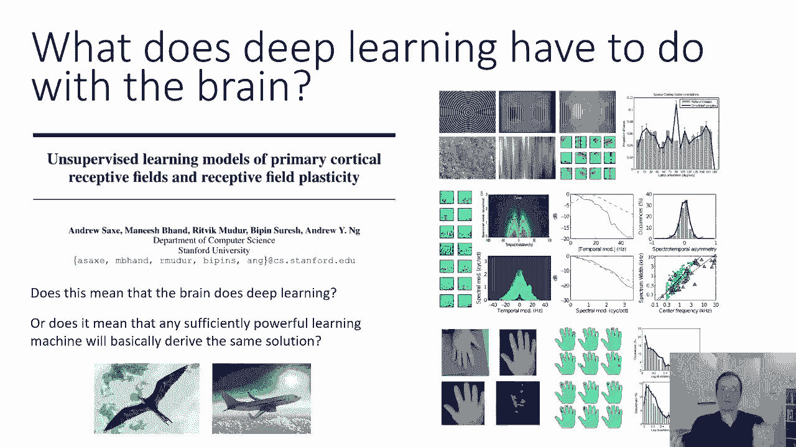


本节课中我们一起学习了深度学习的发展简史，了解了促使其成功的三个关键支柱：**大模型（深度）**、**大数据集**和**强计算力**。我们探讨了深度学习的核心主题，包括模型容量、归纳偏差和可扩展性。最后，我们了解了“神经网络”这一名称的生物学起源，以及深度学习与生物视觉系统之间有趣但需谨慎看待的联系。这些基础知识为我们后续深入探索深度学习的具体算法和模型奠定了坚实的框架。