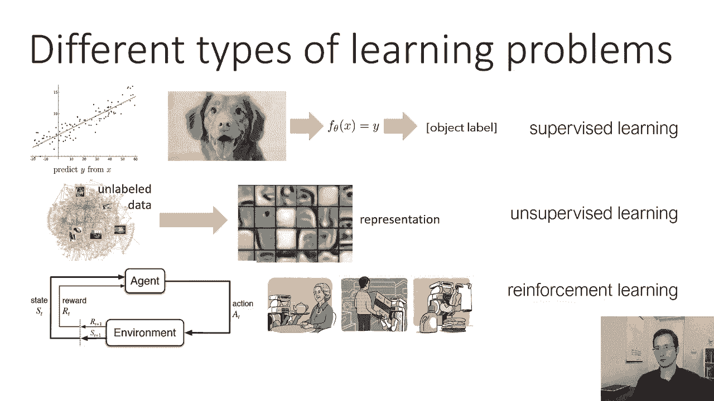
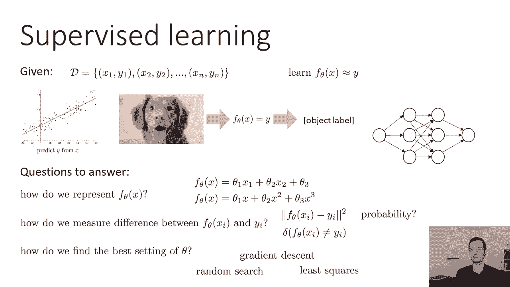
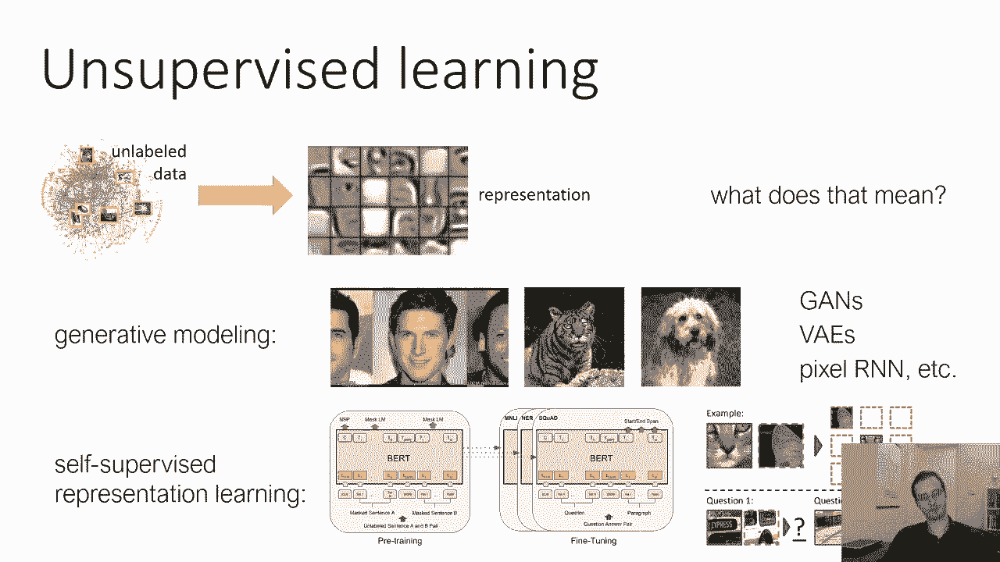
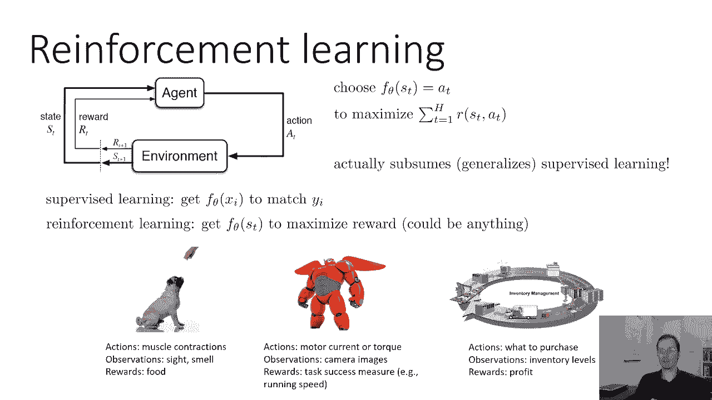
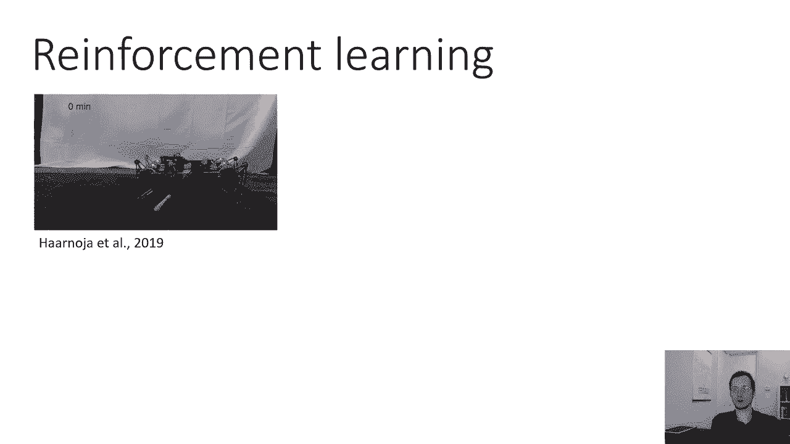
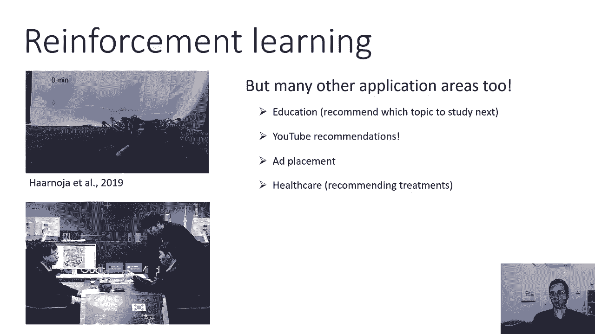
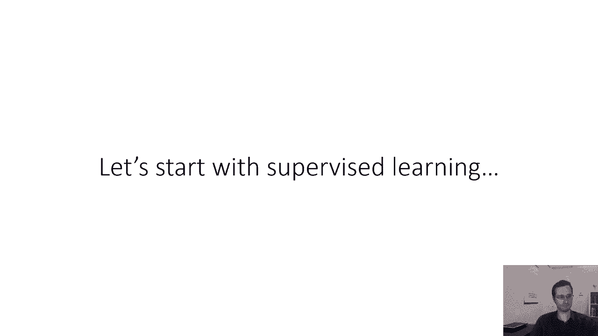

# 4：CS 182 - 第 2 讲，第 1 部分：机器学习基础 🧠

在本节课中，我们将学习机器学习的基本概念。这些概念是后续深度学习课程的基础。我们将从定义学习问题开始，并介绍三种主要的机器学习范式：监督学习、无监督学习和强化学习。

## 如何制定学习问题

机器学习可以解决许多不同的问题。接下来我们将讨论一种规范的分类方法，尽管也存在其他分类方式。

最常研究的机器学习问题是预测问题：给定一些输入 `x`，预测一些输出 `y`。例如，在经典的线性回归问题中，`x` 对应水平轴的位置，`y` 对应垂直轴的位置。同样的问题表述也适用于更复杂、更高维的输入，如上节课讨论的图像分类示例，其目标是预测图像中存在的物体标签。

## 监督学习 📊

上一节我们介绍了预测问题的基本概念，本节中我们来看看监督学习的具体定义。

监督学习问题之所以被称为“监督”，是因为在训练期间，模型会受到真实标签的“监督”。在监督学习中，我们假设在训练过程中获得一个数据集 `D`（也称为训练集）。该数据集由 `(x, y)` 元组组成，其中 `y` 是对应于 `x` 的真实标签。

例如，要解决图像分类问题，我们会收集狗、猫、长颈鹿和河马的照片，然后由人类仔细检查并为每张照片贴上真实标签，这就构成了我们的训练数据。我们将用它来学习如何对新图片进行分类。

监督学习的目标是学习一个关于 `x` 的函数 `f_θ`（这里的 `θ` 表示参数），使得 `f_θ(x)` 尽可能近似于真实标签 `y`。这可以是线性回归设置，也可以是确定照片中物体类别等更复杂的任务。

要实例化一种监督学习方法，我们必须回答几个问题：

以下是必须回答的几个关键问题：
1.  **如何表示函数 `f_θ`？** 我们必须选择程序的形态以及参数 `θ` 如何进入程序。它可能像线性方程一样简单（例如 `y = θ_0 + θ_1 * x`），也可能是多项式回归函数或神经网络。
2.  **如何衡量 `f_θ(x)` 与 `y` 之间的差异？** 我们需要一个衡量“接近程度”的概念。在连续值设置中，这可能是 `(f_θ(x) - y)^2`（平方差）。在分类设置中，可能是“0-1损失”（如果 `f_θ(x) = y` 则为 1，否则为 0）。也可能是涉及概率的更复杂度量。
3.  **如何找到最佳的参数 `θ`？** 我们需要设计一种算法来修改 `θ`，使得对于训练集中的 `(x, y)` 元组，`f_θ(x)` 尽可能接近 `y`。这被称为优化算法，例如随机搜索、梯度下降或最小二乘法。

## 无监督学习 🧩

上一节我们讨论了有明确目标（标签 `y`）的监督学习，本节中我们来看看没有标签时如何进行学习，即无监督学习。

无监督学习从**未标记的数据**开始。这意味着我们没有 `(x, y)` 元组，只有 `x`。例如，我们可能只有网上的照片，我们希望以某种方式分析这些输入，对数据进行分类或聚类，从而理解 `x` 本身的结构，这可能对下游的预测任务有用。

无监督学习一开始可能显得抽象。我们可以将其制定为**生成建模**问题。你可能见过生成模型的例子，例如生成对抗网络（GAN）可以生成非常逼真但不存在的人脸图像。这些神经网络是在未标记数据上训练的，因为它们只需要学习如何构造类似于训练数据的图像，而不需要类别标签。

更正式地说，提供给模型的图像来自某个潜在的分布（例如所有人脸的连续空间）。模型的目标是学习这个分布，甚至可能生成它从未见过但依然逼真的新样本。生成模型需要获取数据的内部表示（例如编码鼻子、眼睛、发色等特征），这些表示可用于各种下游应用。生成模型的例子包括 GANs、VAEs 和自回归模型。

无监督学习的另一个重要领域是**自监督表示学习**。其目的不是直接生成数据，而是在没有直接监督的情况下获取有用的数据表示。这方面的一个重要例子是语言建模，例如 BERT 模型。BERT 解决的任务是：给定一个句子，遮盖其中一些词，然后预测这些词是什么。这个任务本身并不直接有用，但它迫使模型学习语言的有意义表示，这些表示随后可用于机器翻译、情感分析等下游任务。

同样的原理也应用于计算机视觉。例如，从一张图片中裁剪出两个图像块（如猫的耳朵和鼻子），然后要求模型预测这两个图像块的相对位置。做出正确预测需要模型理解图像的结构（如猫长什么样），从而学习到有用的图像表示。

## 强化学习 🎮

前面两节我们介绍了从静态数据中学习的范式，本节中我们来看看智能体如何通过与动态环境交互来学习，即强化学习。

强化学习涉及一个更复杂的公式，因为它不是从图像预测标签，而是关于智能体在时间序列中采取行动，并观察这些行动的长期后果。在强化学习中，智能体的目标不是采取当前“最好”的行动，而是采取从长远来看能带来最佳结果的行动序列。

在每一个时间点 `t`，智能体处于某种**状态** `s_t`（类似于输入 `x`，但带有时间下标）。智能体根据状态输出一个**动作** `a_t`。强化学习的目标是选择一系列动作，以最大化能获得的**总奖励**。

例如，一个下国际象棋的智能体有很多可能的走法，但奖励（赢或输）只在整盘棋结束时才到来。有趣的是，强化学习实际上包含或推广了常规的监督学习。你可以将监督学习制定为强化学习的一个特例：如果预测正确则获得大奖励，预测错误则获得小奖励，且只有一个时间步。然而，用强化学习方法解决监督学习问题通常更困难，因为你需要通过试错来找出正确答案。

在强化学习中，我们学习函数 `f_θ(s_t)` 来输出动作，以最大化奖励。奖励可以是任何东西，例如赢得棋局、机器人跑得更快或公司获得更高利润。强化学习的应用非常广泛。

以下是强化学习的一些应用示例：
*   **机器人控制**：例如，一个机器人学习如何行走。它的动作是发送给电机的命令，观察是传感器数据（如相机图像），奖励是任务成功的度量（如移动速度）。
*   **游戏 AI**：例如 AlphaGo，它通过与自己进行大量对弈来学习下围棋。
*   **商业决策**：例如，为电商公司选择仓库库存水平。动作是采购决策，观察是库存水平，奖励是公司利润。
*   **其他领域**：教育（推荐学生下一步学习内容）、推荐系统（如 YouTube 视频推荐）、医疗（为患者推荐治疗方案）等任何可以表述为顺序决策的问题。

## 总结

本节课中我们一起学习了机器学习的三种基本范式。

我们首先探讨了如何制定学习问题，并引入了预测的核心概念。接着，我们详细介绍了**监督学习**，其目标是从带有标签的数据中学习一个映射函数 `f_θ(x) ≈ y`。然后，我们讨论了**无监督学习**，它从无标签数据中学习数据的内部结构或表示，例如通过生成建模或自监督学习。最后，我们了解了**强化学习**，智能体通过与环境交互并获得奖励信号，来学习一系列能最大化长期回报的动作。

理解这些基础范式是深入学习后续复杂模型（如神经网络）的关键。在接下来的课程中，我们将更深入地探讨这些领域的具体算法和应用。