# 5：CS 182 第二讲第二部分：监督学习 🧠

在本节课中，我们将要学习**监督学习**的基本概念。监督学习是机器学习中最常用、最核心的形式之一，尤其在工业界的实际应用中占据主导地位。我们将从基本公式出发，理解如何从数据中学习一个预测模型，并探讨如何输出概率而非单一标签，这为后续更复杂的模型学习奠定了基础。

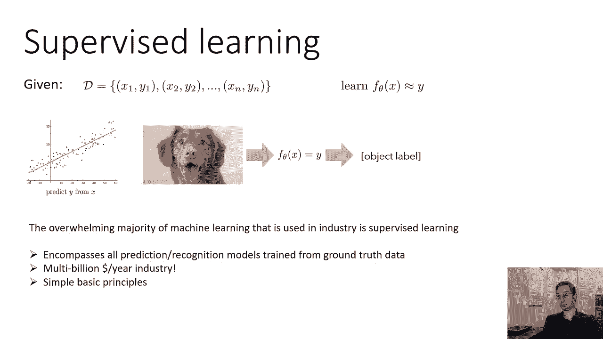

---

## 什么是监督学习？🎯

上一节我们介绍了机器学习的基本框架，本节中我们来看看**监督学习**的具体定义。监督学习是最常用的机器学习形式之一，尤其是在工业界的实际应用中。绝大多数工业界部署的机器学习系统都属于监督学习。

其核心公式是：给定一组训练数据，它由输入 `x` 和对应的真实输出 `y` 的元组 `(x, y)` 组成。我们的目标是学习一个带参数 `θ` 的函数 `f_θ(x)`，使其预测值尽可能接近真实的 `y`。这个问题可以表述为从简单的线性回归到复杂的图像分类等各种任务。

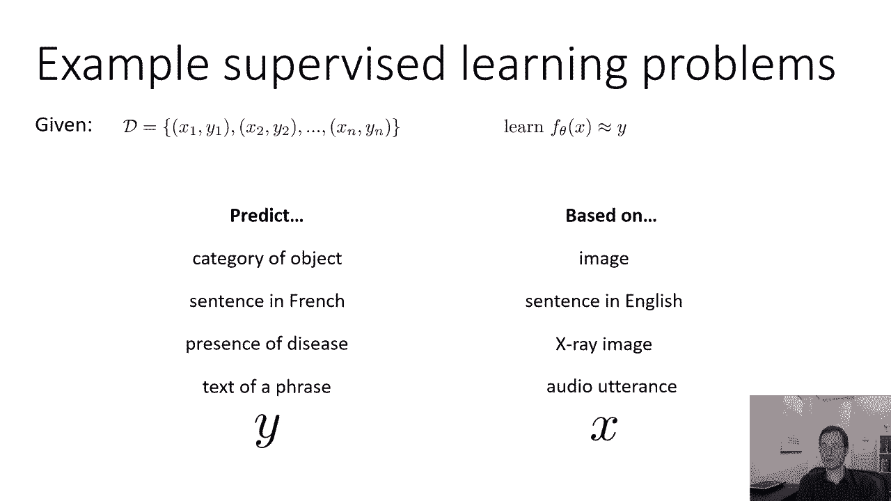

监督学习涵盖了所有从带有真实标签（ground truth）的数据中进行训练和预测的模型。这是一个价值数十亿美元的产业，其基本原理虽然简单，但要构建有效工作的系统，则需要处理许多细节，这些内容将在后续课程中逐步展开。

---

## 监督学习问题示例 📋

以下是监督学习问题的一些典型例子。为了定义一个监督学习问题，你必须明确要预测什么（`y`），以及根据什么进行预测（`x`）。

以下是几个例子：

*   **图像分类**：根据图像预测其中物体的类别（例如，猫或狗）。
*   **机器翻译**：根据一个英语句子预测其对应的法语句子。
*   **医疗诊断**：根据X光图像预测疾病是否存在。
*   **语音识别**：根据一段音频话语预测其对应的文本。

总的来说，只要你能将问题表述为“根据输入 `x` 预测输出 `y`”，并且能获得带有真实标签 `y` 的训练数据，就可以将其构建为一个监督学习问题。从自然语言处理到语音识别再到医疗领域，许多看似不同的问题都可以纳入这个框架。

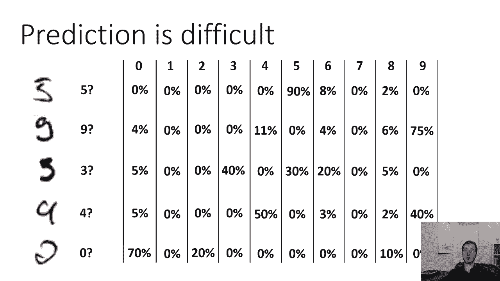

---

## 预测概率 vs. 预测离散标签 🎲

在上一节中，我们讨论了预测的具体形式。本节中我们来看看为什么预测概率通常比预测单一的离散标签更有意义，也更容易学习。

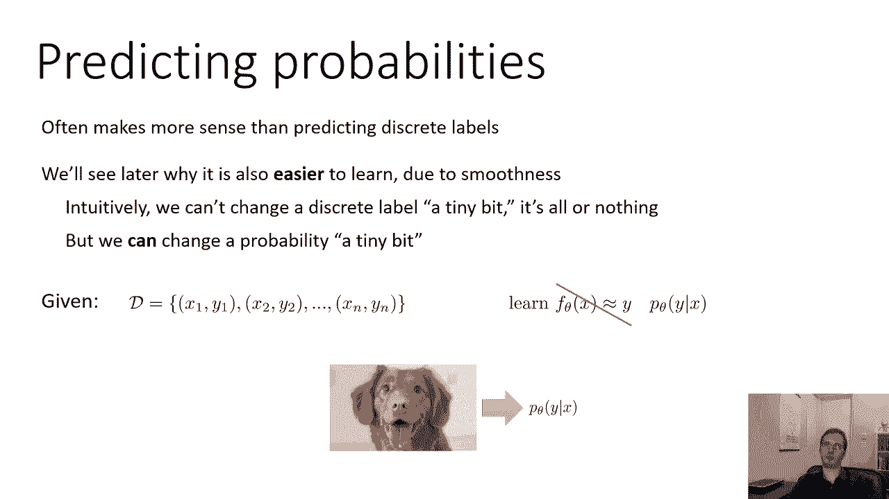

考虑一个手写数字识别的例子。面对一个书写潦草的数字，人类可能也无法立刻确定它是“4”还是“9”。如果模型被迫输出一个单一标签（如“4”），它就无法表达这种不确定性。

如果我们允许模型输出概率，情况就不同了。例如，对于同一个模糊的数字，模型可以输出：`P(y=4 | x) = 0.6`, `P(y=9 | x) = 0.35`, 其他类别概率很小。这能更准确地反映模型（以及人类）认知中的不确定性。

输出概率分布 `P_θ(y | x)` 比输出单一标签 `y` 更具灵活性，并能更好地为后续决策提供信息。从优化角度看，预测概率（一个连续值）也比预测离散标签（一个跳跃值）更平滑，使得通过微调参数 `θ` 来改进模型变得更容易。

---

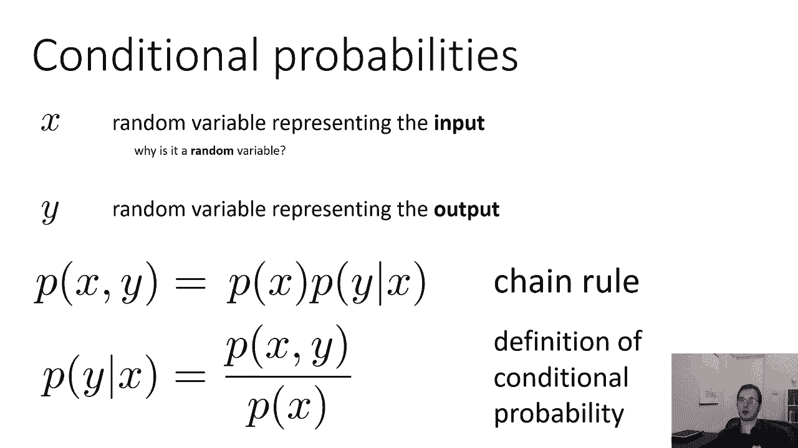

## 条件概率与模型类型 📊

我们定义了要学习一个将输入 `x` 映射到输出 `y` 的概率分布的函数，即条件概率 `P_θ(y | x)`。这引出了机器学习中两种重要的方法类型。

根据概率的链式法则，联合概率 `P(x, y)` 可以分解为：
`P(x, y) = P(x) * P(y | x)`

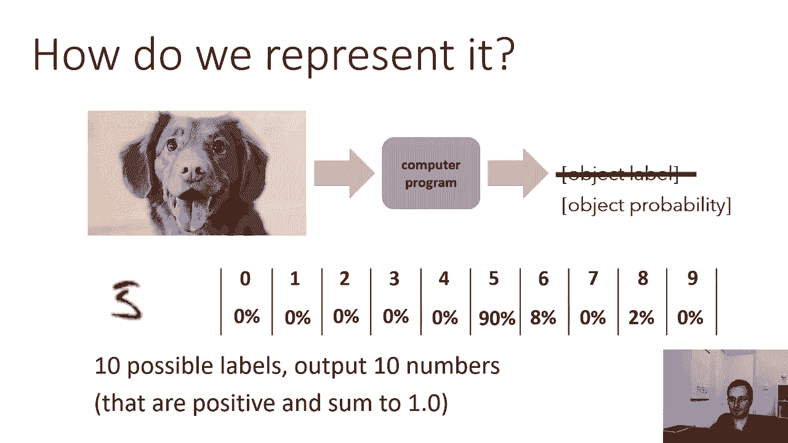

由此可以推导出条件概率的定义：
`P(y | x) = P(x, y) / P(x)`

*   **判别式方法**：直接学习条件概率 `P(y | x)`。这类方法专注于区分不同的 `y`。
*   **生成式方法**：学习联合概率 `P(x, y)`。因为掌握了 `x` 和 `y` 的联合分布，这类方法原则上可以生成新的数据 `x`，并且可以通过公式 `P(y | x) = P(x, y) / P(x)` 间接得到条件概率。

在本课程中，我们将主要聚焦于**判别式方法**，即直接学习 `P_θ(y | x)`。

---

## 如何表示概率分布？🔢

现在我们知道要输出一个概率分布 `P_θ(y | x)`。接下来的问题是，如何在计算机程序中表示它？我们的程序需要输出一组数字，每个数字代表一个类别的概率。

对于一个有 `N` 个类别的问题（例如，10个手写数字），程序需要输出 `N` 个数字。这些数字必须满足两个约束：
1.  每个数字都是**正数**（概率非负）。
2.  所有数字之和为 **1**（概率总和为1）。

我们不能随意设计一个输出 `N` 个数字的程序，必须确保其输出满足这些概率公理。例如，一个简单的想法是让 `P(y=狗 | x) = x^T * θ_狗`，`P(y=猫 | x) = x^T * θ_猫`。但这通常无法保证两个输出值之和为1。

因此，我们需要一个更结构化的方法：程序内部先计算一些中间值（例如 `f_狗(x)`, `f_猫(x)`），然后通过一个特殊的函数（如 **Softmax**）将这些中间值转换为合法的概率分布。这个函数负责完成“使值为正”和“归一化（和为1）”这两项工作。

---

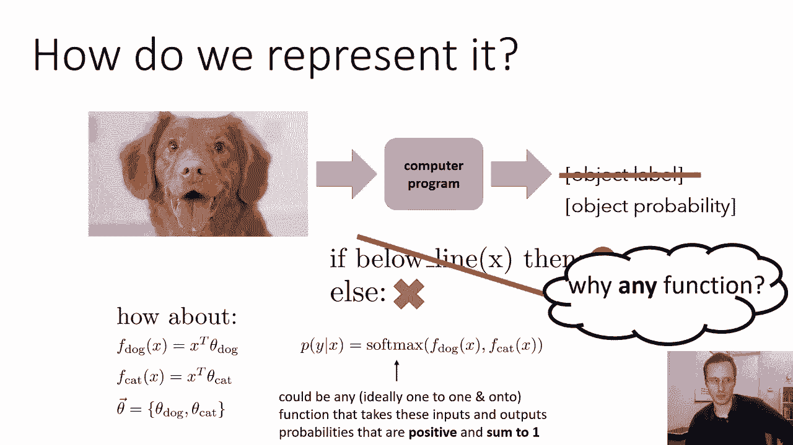

## Softmax 函数：从分数到概率 🍦

上一节我们提到需要一个函数将任意实数转换为合法的概率分布。本节中我们来看看一个特别常用且有效的选择：**Softmax 函数**。

首先，如何将一个实数 `z` 变为正数？有多种函数可以实现：
*   `z^2`（平方）
*   `|z|`（绝对值）
*   `max(0, z)`（ReLU函数）
*   `exp(z)`（指数函数）

其中，**指数函数 `exp(z)`** 因其良好的数学性质（一对一且满射）而特别方便。它可以将整个实数域映射到正实数域，不会“浪费”表示能力。

其次，如何让一组正数 `{z_i}` 之和为1？答案是**归一化**：将每个数除以所有数的总和。即，第 `i` 个输出为 `z_i / (∑_j z_j)`。

结合这两点，**Softmax 函数**的定义如下：对于一个包含 `N` 个分数的向量 `z = [z_1, z_2, ..., z_N]`，Softmax 输出的第 `i` 个元素为：
`softmax(z)_i = exp(z_i) / (∑_{j=1}^{N} exp(z_j))`

**代码描述**：
```python
import numpy as np

def softmax(z):
    exp_z = np.exp(z - np.max(z)) # 减去最大值防止数值溢出
    return exp_z / np.sum(exp_z)
```

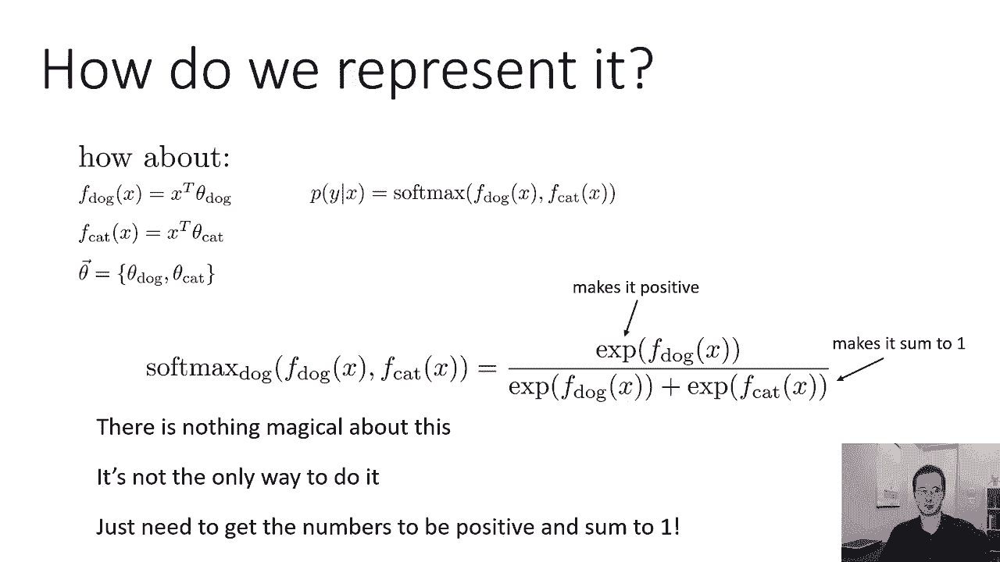

对于二分类问题（猫和狗），Softmax 输出为：
`P(y=狗 | x) = exp(f_狗(x)) / (exp(f_狗(x)) + exp(f_猫(x)))`
`P(y=猫 | x) = exp(f_猫(x)) / (exp(f_狗(x)) + exp(f_猫(x)))`

Softmax 函数完成了将模型原始输出（“分数”或“logits”）转换为概率分布的关键步骤。

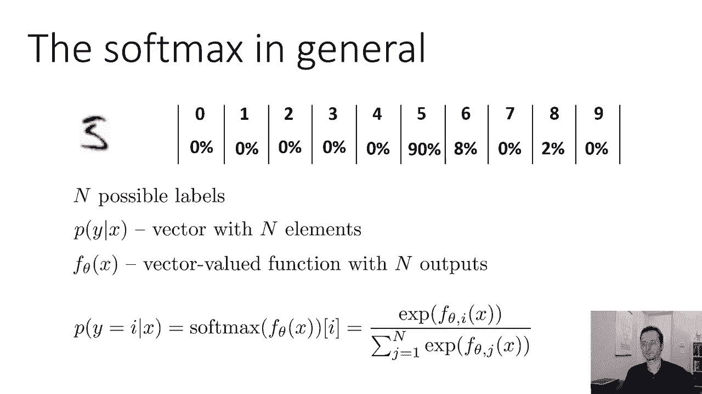

---

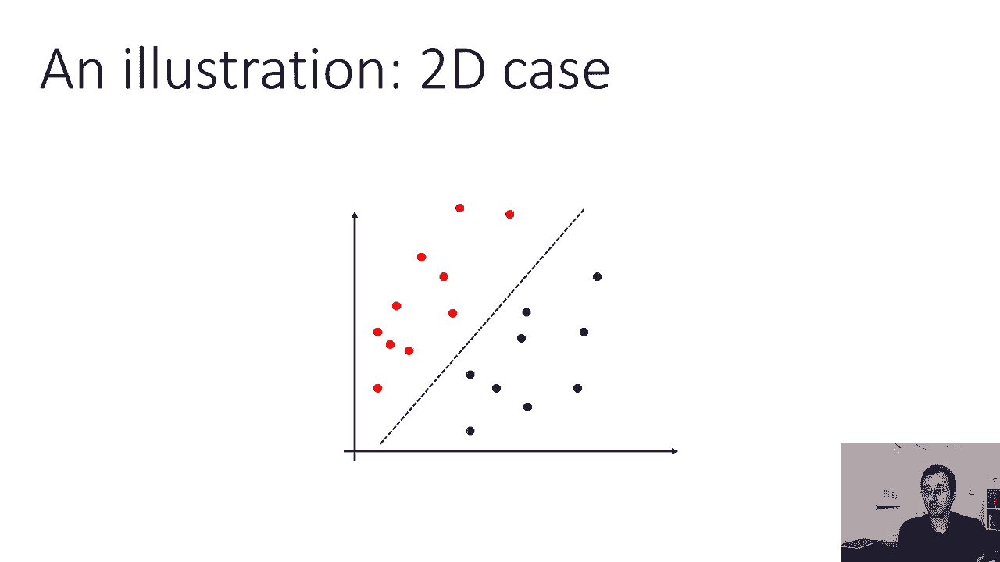

## Softmax 的直观理解与名称由来 📈

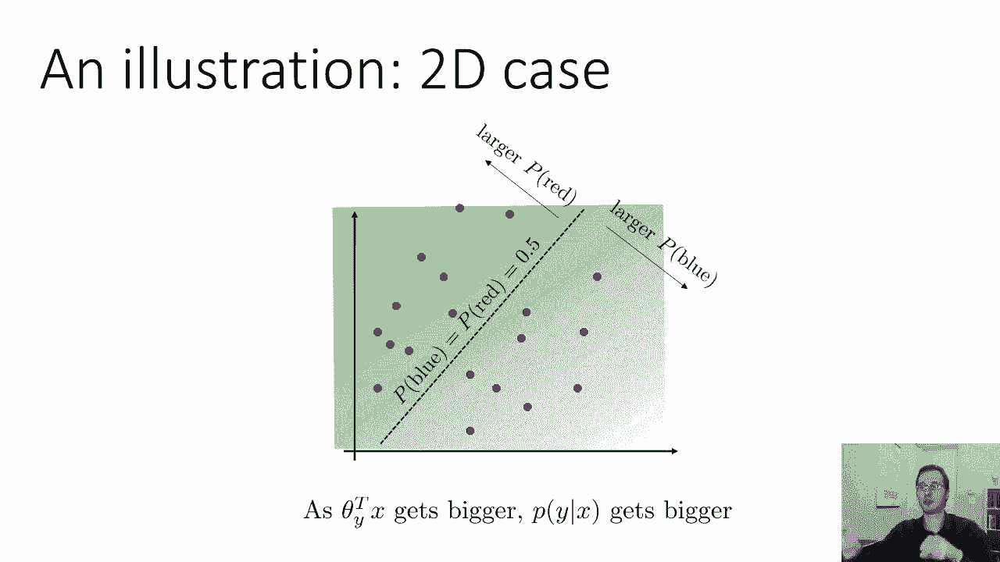

让我们更直观地理解 Softmax 的行为。假设一个二分类问题（红色和蓝色），模型学习到的参数在特征空间定义了一条**决策边界**。

*   在决策边界的一侧，模型更倾向于预测为红色；在另一侧，更倾向于蓝色。
*   决策边界本身是模型认为两个类别概率相等（各为50%）的点。
*   随着输入点远离决策边界，预测概率会迅速趋近于 1 或 0。

**为什么叫“Softmax”？**
如果我们将模型的分数 `z_i` 乘以一个非常大的数 `C`，再送入 Softmax，会发生什么？
`softmax(C * z)_i ≈ 1` 当 `z_i` 是 `{z}` 中最大的值时。
`softmax(C * z)_i ≈ 0` 当 `z_i` 不是最大值时。
当 `C` 很大时，Softmax 的输出会无限接近一个“**硬**”的 max 操作：将全部概率赋给分数最高的类别。而当 `C` 较小或分数差异不大时，它的输出是“**软**”的，会给所有类别分配非零的概率。因此，它被称为 **Soft（软的）max（最大值）**。

---

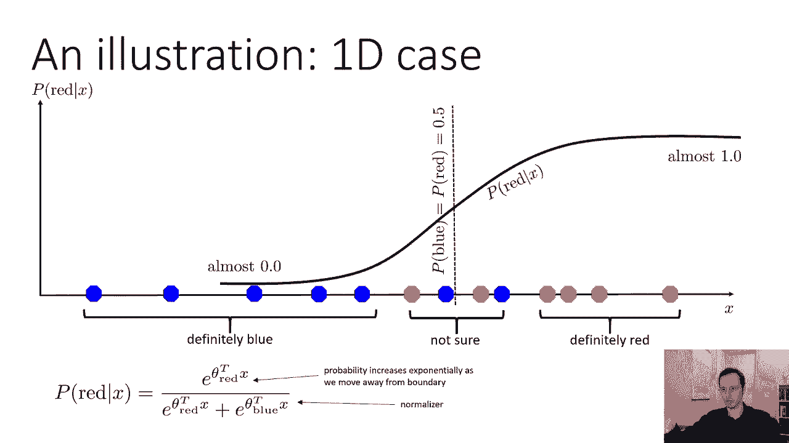

## 总结 🎉

本节课中我们一起学习了监督学习的基础知识：

1.  **监督学习定义**：从带有标签 `(x, y)` 的数据中学习一个映射函数 `f_θ(x) -> y`。
2.  **概率化预测**：输出概率分布 `P_θ(y | x)` 比输出单一标签更具表达力和优化优势。
3.  **模型类型**：区分了直接建模 `P(y | x)` 的判别式方法和建模 `P(x, y)` 的生成式方法。
4.  **概率表示**：模型输出必须满足概率的正则性和归一化约束。
5.  **Softmax 函数**：作为将模型原始分数转换为有效概率分布的核心工具，我们详细探讨了其公式、代码实现和直观含义。

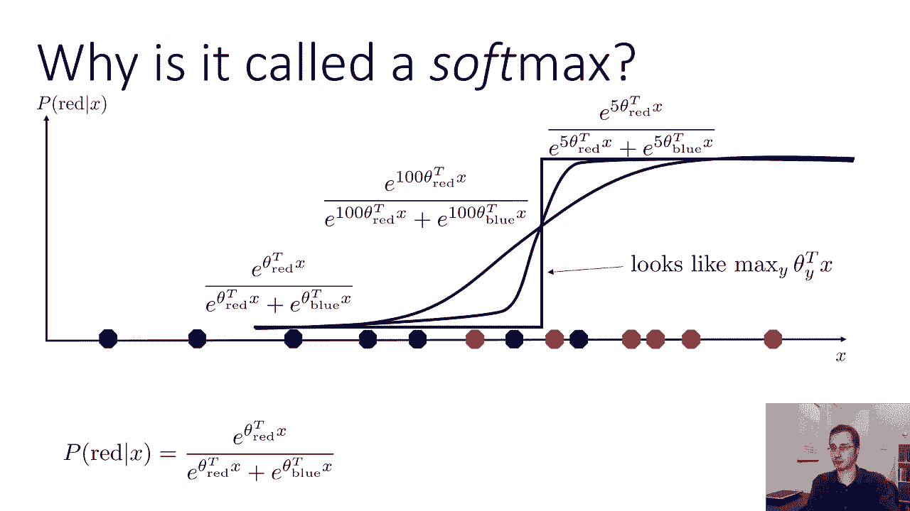

理解这些基础概念是构建更复杂机器学习模型的基石。在接下来的课程中，我们将探讨如何定义“好”模型（损失函数），以及如何找到最优的参数 `θ`（优化算法）。