# 6：损失函数 🎯

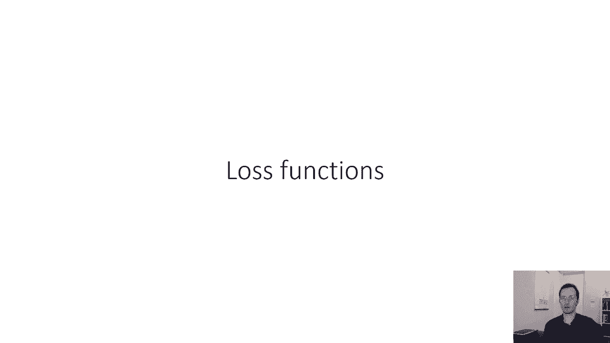

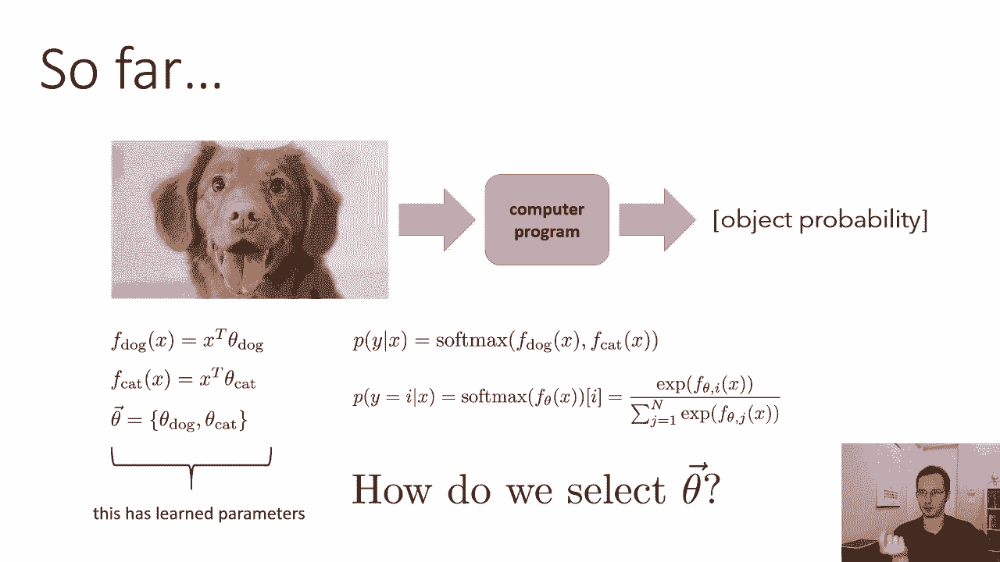

在本节课中，我们将学习如何为机器学习模型定义损失函数。损失函数用于衡量模型预测的好坏，是选择最佳模型参数的关键。

---

## 模型选择的三步法

上一节我们介绍了模型类（例如使用SoftMax输出概率的分类器）。本节中，我们来看看如何选择模型参数θ。

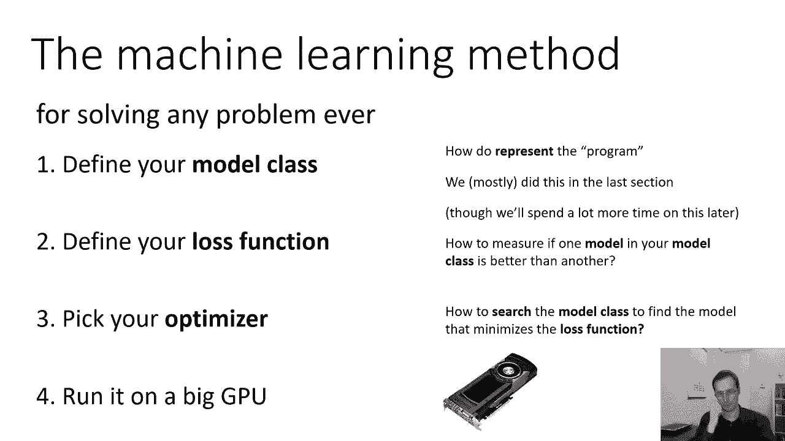

以下是选择模型参数的标准三步法（加上一个由计算机执行的步骤）：

1.  **定义模型类**：确定程序的表示形式及参数设置。这定义了所有可能模型的集合。
2.  **定义损失函数**：量化模型类中特定模型的好坏，以便比较不同模型。
3.  **选择优化器**：选择一个算法，在模型类中搜索能使损失函数最小化的模型。
4.  **执行优化**：由计算机（如GPU）执行优化算法。

> **旁注**：这种分解方式与神经科学家David Marr提出的认知分析层次密切相关。计算层次对应“为什么”（目标/损失函数），算法层次对应“什么”（模型表示），实现层次对应“如何”（优化算法）。这种分离有助于我们模块化地思考和设计复杂的机器学习系统。

---

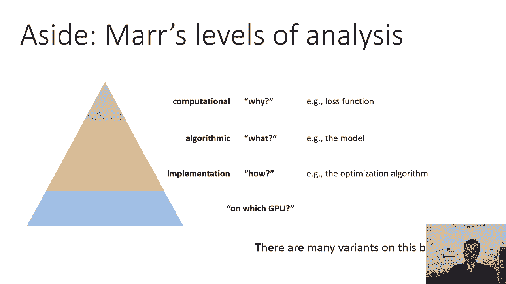

## 数据生成的基本假设

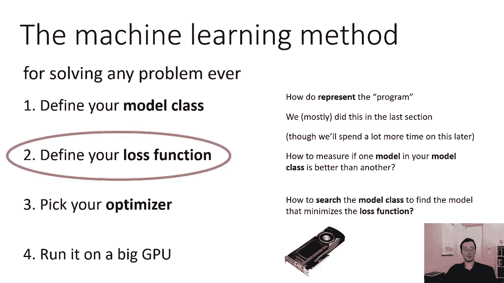

在定义损失函数前，我们需要一个关于数据如何生成的基本模型。虽然现实世界生成图片和标签的过程极其复杂，但我们可以建立一个简化的概率模型来指导思考。

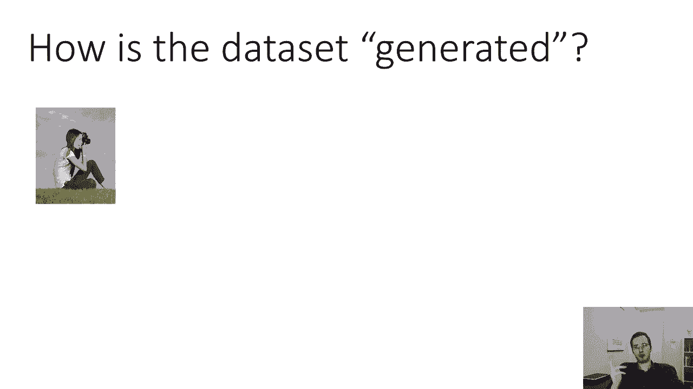

我们假设每张图片`x`是从某个分布`p(x)`中随机采样得到的。同时，其标签`y`是从一个依赖于图片的条件分布`p(y|x)`中采样得到的。根据概率链式法则，数据点`(x, y)`的联合分布为：
`p(x, y) = p(x) * p(y|x)`

我们进一步假设整个训练集`D = {(x1, y1), (x2, y2), ..., (xn, yn)}`中的样本是**独立同分布**的：
*   **独立**：每个`(xi, yi)`元组的出现与其他元组无关。
*   **同分布**：每个元组都来自相同的联合分布`p(x, y)`。

基于此，整个数据集出现的概率可以写为各样本概率的乘积：
`p(D) = ∏ p(xi, yi) = ∏ [ p(xi) * p(yi|xi) ]`

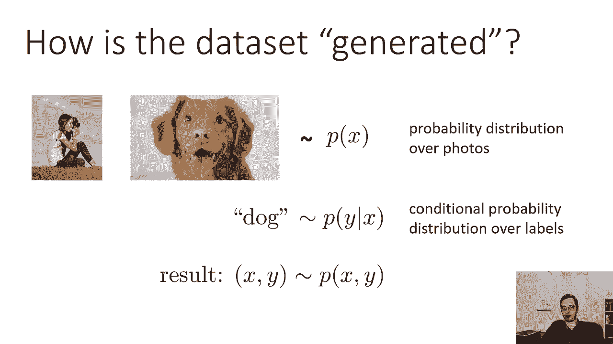

---

## 最大似然估计

我们模型的目标是学习一个条件分布`p_θ(y|x)`，使其尽可能接近真实的`p(y|x)`。一个好的模型应该让观测到的数据看起来更可能发生。

因此，我们选择参数θ的原则是：**最大化训练数据集`D`出现的概率**，即最大化`p(D)`。这被称为**最大似然估计**。

然而，直接最大化概率乘积在数值计算上会遇到问题，因为许多小于1的概率相乘会得到一个极其接近0的数。为了解决这个问题，我们取概率的对数。对数函数是单调的，最大化对数概率等价于最大化原始概率。

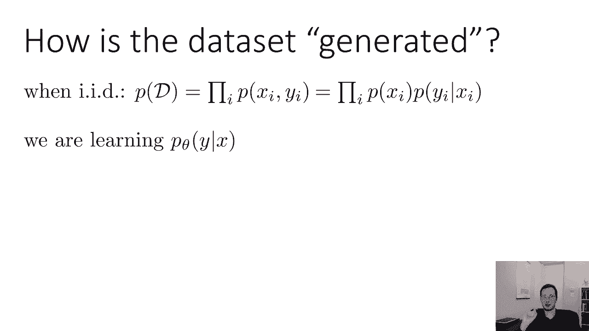

`log p(D) = Σ log p(xi) + Σ log p_θ(yi|xi)`

由于第一项`Σ log p(xi)`与参数θ无关，在优化时可以视为常数。因此，我们只需最大化第二项：
`θ* = argmax_θ Σ log p_θ(yi|xi)`

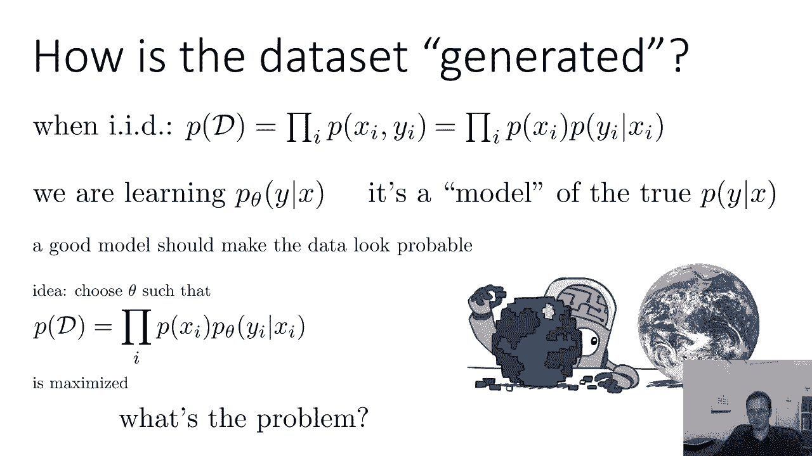

在优化领域，习惯上我们将问题表述为**最小化**。因此，我们定义**负对数似然**作为损失函数：
`L(θ) = - Σ log p_θ(yi|xi)`

我们的目标变为寻找最小化该损失的θ。

---

## 常见的损失函数

负对数似然是一种通用且强大的损失函数。以下是其他一些常见的损失函数示例：

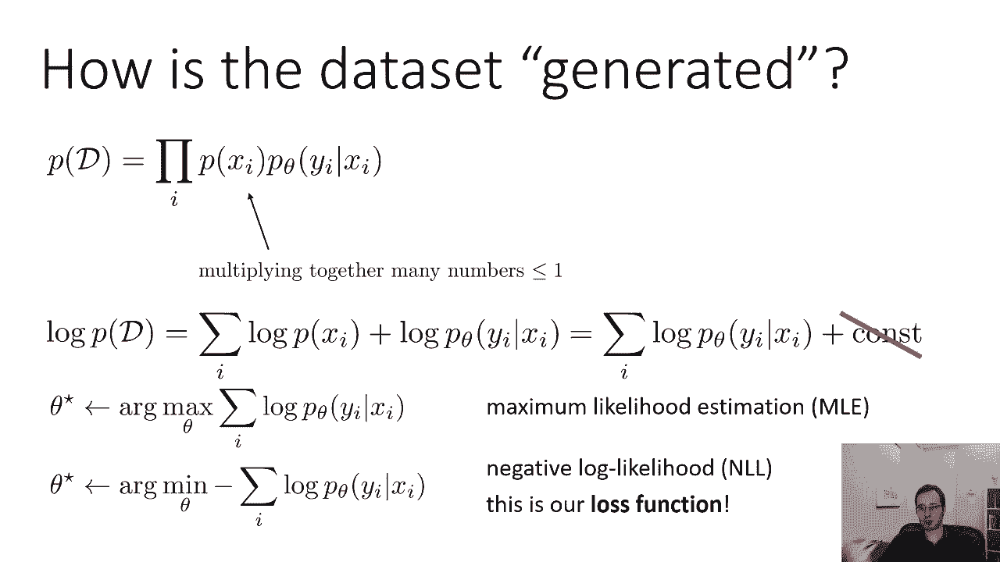

*   **负对数似然 / 交叉熵**：如上所述，常用于分类问题。交叉熵是衡量两个分布差异的度量，在特定条件下，用单个样本近似期望值就得到了负对数似然。
    `L(θ) = - Σ log p_θ(yi|xi)`

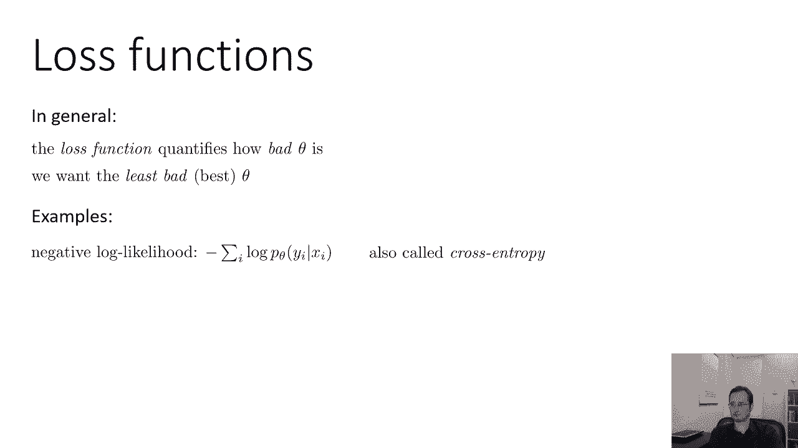

*   **0-1损失**：用于分类问题，非常直观。如果预测错误，损失为1；如果预测正确，损失为0。它直接反映了分类准确率，但因其不连续、不可导，通常不直接用于基于梯度的优化。
    `L(θ) = Σ 1{ f_θ(xi) != yi }`

*   **均方误差**：常用于回归问题（预测连续值）。它最小化预测值与真实值之间的平方差。有趣的是，均方误差等价于在高斯噪声假设下的负对数似然。
    `L(θ) = Σ ( f_θ(xi) - yi )^2`

---

## 总结

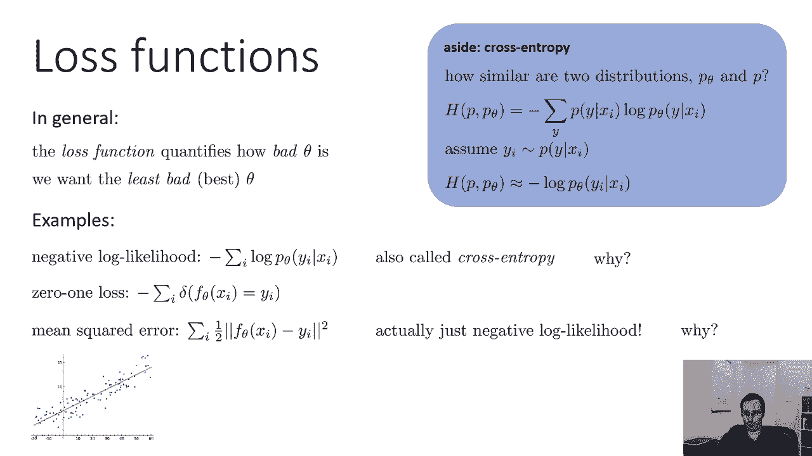

本节课中，我们一起学习了机器学习中损失函数的核心概念。我们首先介绍了模型选择的三步法框架。然后，基于数据独立同分布的假设，推导出了**最大似然估计**的原理，并由此引出了最常用的**负对数似然（交叉熵）损失函数**。最后，我们简要了解了其他类型的损失函数，如0-1损失和均方误差。理解损失函数是设计有效机器学习模型的关键一步。