# 7：逻辑回归与优化 🧠

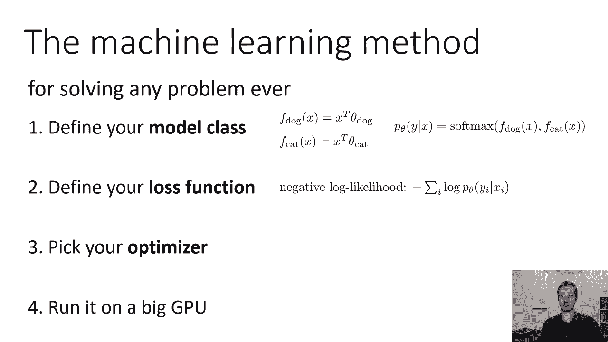

在本节课中，我们将学习如何构建一个完整的监督学习算法——逻辑回归。我们将涵盖模型定义、损失函数选择以及如何通过优化算法找到最佳参数。

---

## 模型、损失与优化 📊

我们定义了模型类别，定义了损失函数，现在需要找出如何设置参数θ，使我们的损失函数（负对数似然）最小化。

想象优化算法的一种方式是所谓的“损失景观”。你可以将损失景观视为损失函数的一个图。假设θ是二维的，水平轴代表θ的两个维度，垂直轴代表损失函数L(θ)的值。假设我们有一个单峰凸函数，看起来像一个碗。最好的θ就在碗底。

如果我们没有最好的θ设置，例如我们位于图中的某个黑点，直觉上，为了找到最好的θ，我们需要修改它，使其朝着损失函数下降最陡峭的方向移动。我们想找到损失函数减小的方向，然后朝那个方向移动θ。

一个非常通用的算法草图是：找到方向v，使得L(θ)在该方向上减小，然后朝该方向移动θ。选择新的θ为旧的θ加上一个速率α乘以v。α是一个小常数，也称为学习率或步长。

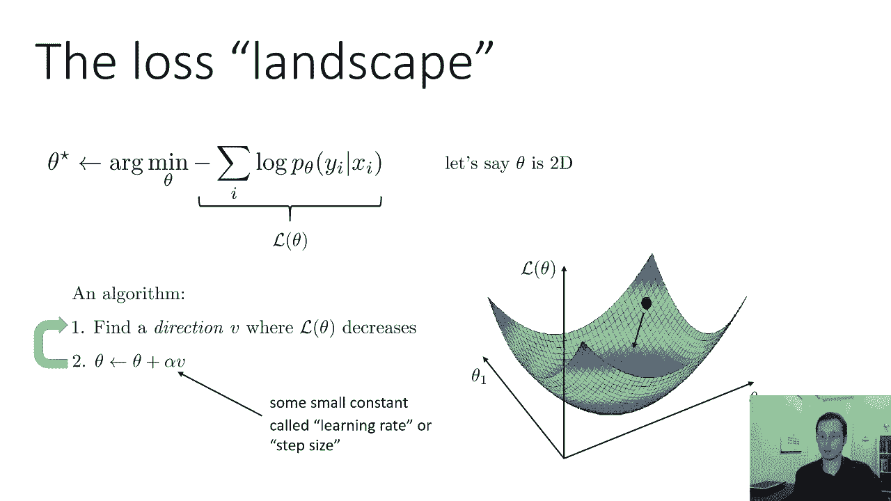

物理类比是，如果你将一颗弹珠放在这个景观中，它会向最陡峭的下降方向滚动，最终稳定在最小值处。这就是算法背后的直觉。我们想找到L(θ)减小的方向，然后朝那个方向移动。

有趣的是，最陡峭的下降方向并不总是最好的选择。我们将在后续讲座中更多地讨论其他类型的优化算法。所有这些方法的共同点是，它们都会朝着L(θ)减小的方向移动，至少是局部地。然后我们重复这个过程。如果重复足够多次，最终可能会稳定下来。

---

## 梯度下降算法 📉

让我们尝试从数学上实例化这样一个方法。如果我们有关于θ的函数L(θ)，L(θ)首先向哪个方向减小？方向是什么？我们如何表示一个方向？θ是一个向量，方向也是一个向量。

在一维情况下，函数的斜率会告诉我它向哪个方向减小。如果斜率为负，函数向右减小；如果斜率为正，函数向左减小。所以从斜率可以看出该朝哪个方向移动以减少函数。

同样的直觉适用于更高维度。总的来说，你可以想象取一个高维函数，单独考虑每个维度，弄清楚斜率是正还是负。如果是正，则沿该维度向负方向移动；如果是负，则沿该维度向正方向移动。对于每个维度，沿着与斜率相反的方向移动。

斜率就是导数。所以我们要做的就是为每个维度设定方向，为我们函数L关于该维度θ的偏导数的负数。即 v₁ = -∂L/∂θ₁, v₂ = -∂L/∂θ₂。这保证会给出一个L(θ)减小的方向。

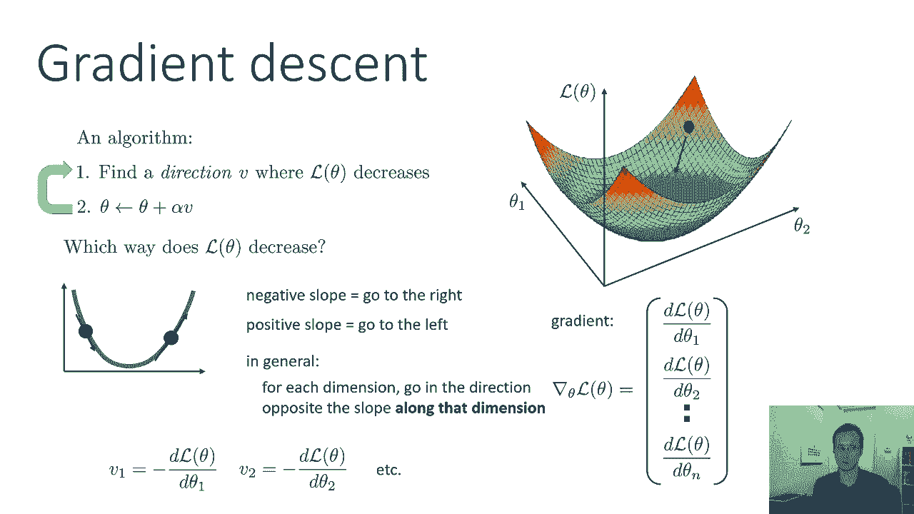

一个突击测验问题：这是L(θ)减小的唯一方向吗？答案是不一定。事实上，有整整一半的向量空间，其中的方向都会使L(θ)减小。这些偏导数给出了最速下降的方向，但如果你稍微向左或向右，仍然会减小。如果你朝相反方向走，则会增加。实际上，只要v与梯度有正点积，你就会沿着L(θ)减小的方向前进。所以这不是一个唯一的解，也不是唯一的减小方向。这是最陡峭的一个，但不一定意味着它是最好的。但这是我们要做的选择。

一个非常有用的概念是**梯度**。梯度是一个向量，其中该向量的每一维都是函数相对于θ相应维度的偏导数。这里v是梯度的负值。所以说，梯度是通过取偏导数并将它们堆叠成向量来形成的。我们将在后续讲座中讨论更多关于梯度相关方法的细节。

现在，这里是算法的草图：
1.  计算梯度。
2.  将θ设为 θ - α × 梯度。

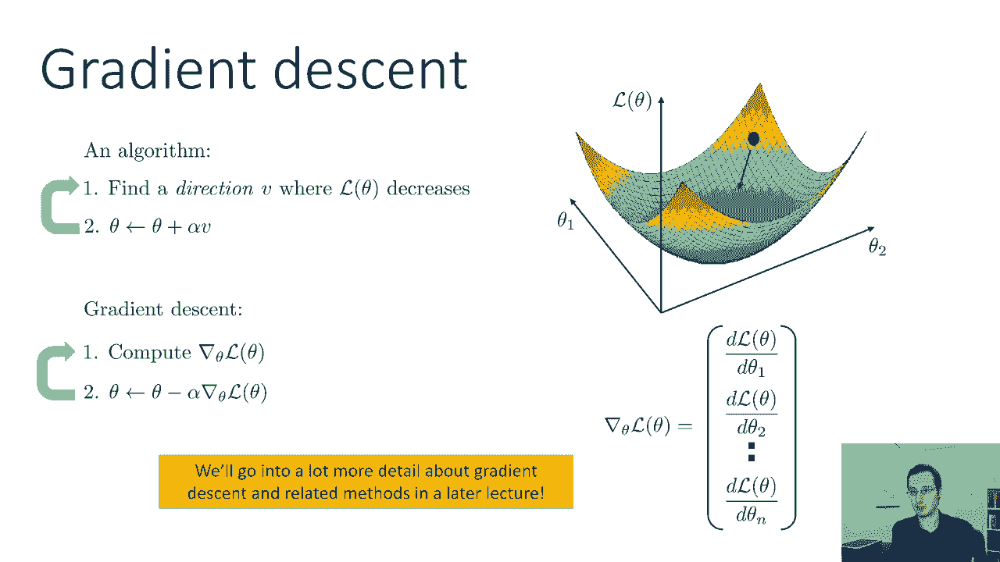

梯度是负的v。这和上面的算法完全一样，我们只是实例化它来使用梯度。上面的算法比较通用，它可以使用任何减小的方向。梯度给了我们一个这样的方向。这就是**梯度下降**算法。

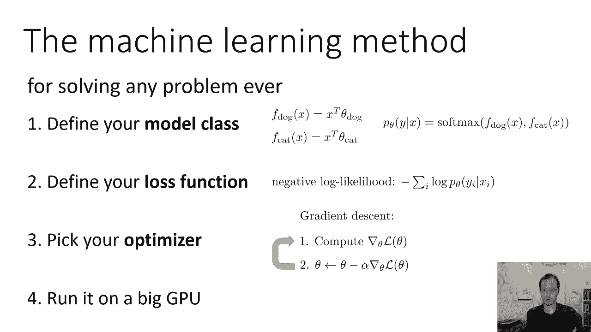

---

## 逻辑回归算法 🤖

在这一点上，我们实际上已经选择了我们的优化器——梯度下降。所以我们准备在一个大的GPU上运行我们的算法。

我们刚刚设计的方法叫做**逻辑回归**。逻辑回归不是深度学习，但我们将要讨论的深度学习中的许多概念实际上从逻辑回归中获得灵感。

总结一下逻辑回归：
*   你有一个函数 f_θ。
*   该函数输出一个n维向量，其中标签y可以有m个不同的值。
*   对于每一个可能的标签y，有一个相应的参数向量 θ_y。
*   这个向量的每个维度都由x和相应的θ_y之间的内积给出。
*   在矩阵表示法中，可以写成 f_θ(x) = xᵀΘ，其中x是列向量，xᵀ是行向量，它乘以一个矩阵Θ，其中每一列都是对应于不同标签的θ向量。
*   现在，具有特定标签y_i的概率由应用于f_θ(x)输出的softmax函数给出。
*   Softmax函数的第i个输出是向量中第i个条目的指数，除以所有条目的指数之和。这确保了我们的概率都是正的，并且加起来等于1。

这就给出了逻辑回归算法。参数θ定义了分隔这些类别的线。给定类别的概率在远离该类时增加或减少。

我们找到最佳θ（学习θ）的方法是使用梯度下降。现在我们需要一点微积分来实际计算这些导数，但原则上我们拥有所需的一切，因为我们有函数，所以我们可以使用微分规则来计算这些导数。在后面的讲座中，我们将讨论自动微分，以及如何使计算这些导数的过程自动化，这样我们就不用手工计算了。

我们的损失是负对数似然。这基本上就是我们需要知道的一切，以实现逻辑回归。

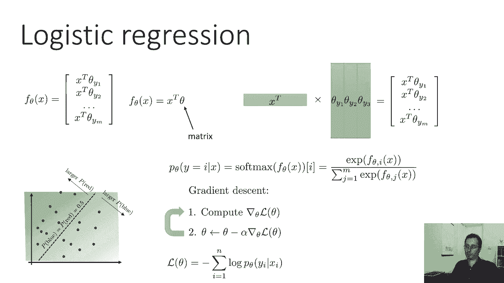

---

## 二元逻辑回归的特例 ⚖️

作为一个小练习，让我介绍逻辑回归的一个特殊情况：当只有二元标签时，例如只有两类（猫和狗）。在这种情况下，会发生一个很好的简化。虽然这种简化并不总是关键，但它在其他一些地方有一定信息量和用处。

当我们只有两类（y₁和y₂）时，逻辑回归的概率可以由这个方程给出。这里我把f换成了softmax。所以 p(y₁|x) = e^(θ_y₁ᵀx) / (e^(θ_y₁ᵀx) + e^(θ_y₂ᵀx))。

同时拥有θ_y₁和θ_y₂有点冗余，因为如果你正好有两类，那么 p(y₁|x) + p(y₂|x) = 1。所以如果你知道 p(y₁|x)，就可以得到 p(y₂|x)。因此，我们在这里过度参数化了这个函数，意味着我们使用的参数比实际需要的要多。

通过一些代数运算，可以说明为什么我们不需要这么多参数。让我们把这个方程的分子和分母都乘以 e^(-θ_y₁ᵀx)。这不会改变等式。现在请注意，当你有两个指数的乘积时，你可以把它写成它们指数之和的指数。

所以你可以等价地写成：p(y₁|x) = 1 / (1 + e^(-(θ_y₁ - θ_y₂)ᵀx))。

令 θ_+ = θ_y₁ - θ_y₂。在这种情况下，上面的方程简化为 1 / (1 + e^(-θ_+ᵀx))。这是一个更简单的方程。现在我们的参数减少了一半。我们实际上不需要单独的θ_y₁和θ_y₂，只需要θ_+。

一般来说，你总是可以去掉其中一个θ向量。但当有大量类别时，人们通常不会费心这么做。如果你有一千个类别，去掉其中一个向量并不能真正节省什么。但是如果你有两类，去掉其中一个参数，数量就减少了两倍。所以这是一个重要的特例。

这个函数有时被称为**逻辑方程**。逻辑回归实际上就得名于此。使用Softmax的多类逻辑回归实际上是后来的创新。原始的逻辑回归是二元的，它使用逻辑方程来得到其中一类的概率。逻辑方程的形状像一条S形曲线，在左边饱和到0，在右边饱和到1。它有时也被称为**Sigmoid**函数。

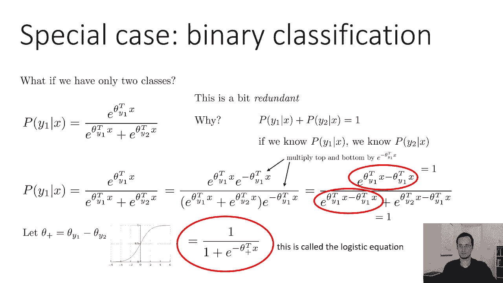

---

## 经验风险最小化 ⚠️

我想简要介绍的最后一个概念是一个特殊术语：**经验风险最小化**。你有时会听到人们在监督学习中这样做。

让我们回想一下0-1损失。0-1损失是：如果你预测错误，损失为1；如果正确，损失为0。你可以把**风险**看作是你出错的概率。回想我们的生成过程：有人拍照，这是一张从图像分布中随机抽样的图片，它有一个从标签的真实分布中采样的标签。给定那张图片，你答对或答错的可能性有多大？你出错的概率就是0-1损失的期望值。那么 f_θ(x) 出错的可能性有多大？这只是0-1损失的期望值。所以你可以称之为风险——你得到错误答案的风险。

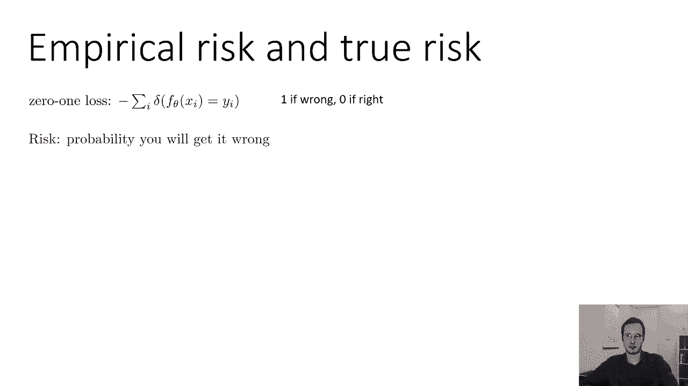

这一切都是针对0-1损失的。但你可以把这个概念推广到其他损失上。你可以说，对于其他一些损失，风险就是该损失的期望值。它不再有“你弄错的概率”这种美好的解释，但这仍然是一个数字。

如果我们用负对数似然，我们可以说风险是在真实分布 p(x, y) 下，我们所学θ的损失的期望值。所以风险是你实际上想最小化的东西。

问题是你实际上无法计算出真正的风险，因为你不能随意地从 p(x) 中取样。你不能就这样得到无限的样本。相反，你会得到一个数据集D。所以你可以计算出所谓的**经验风险**。经验风险只是对真实风险的基于样本的估计，你通过将你的损失在所有样本上平均来得到。所以说，经验风险是我们实际上在监督学习时最小化的东西。但经验风险有望接近真实风险。

我们可以问：在这一点上，经验风险实际上是真实风险的一个很好的近似值吗？什么时候好？为什么好？为什么会不好？

---

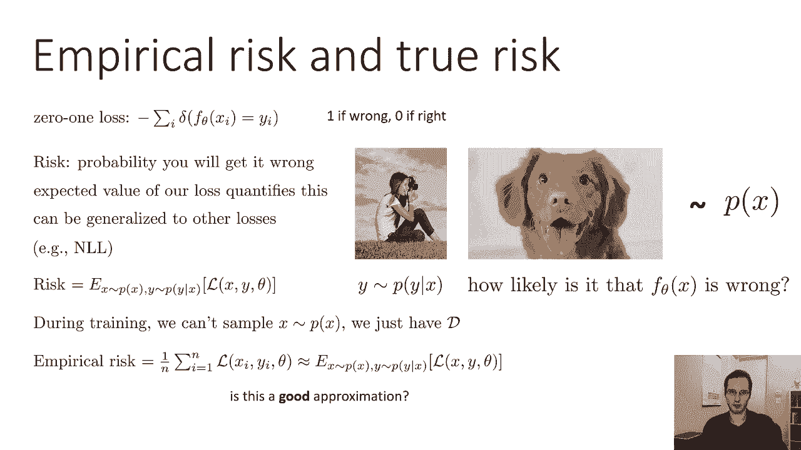

## 过拟合与欠拟合 🔄

监督学习通常是经验风险最小化。这和真正的风险最小化是一样的吗？有两个设置可能会给你带来麻烦。

第一种情况是，真实风险和经验风险不一样。这是**过拟合**的设置。当经验风险较低，但真正的风险很高时，就会发生过拟合。这意味着你在训练集上的平均损失很低，但是你损失的真正期望值并不低。

这可能看起来有点奇怪，因为你的经验风险是对真实风险的无偏样本估计。但请记住，你实际上是在使用这些数据点来学习θ，所以θ与你的训练点耦合，你的估计器不再是无偏的。

有一个更直观的解释。假设我正在努力拟合一条线。这些点与我的训练数据相对应，所以这些点基本上是对齐的，但有一点噪声。如果我对这些点拟合一个非常高的多项式，我会得到一个类似这样的疯狂函数。这个疯狂的函数具有非常低的经验风险，因为它直接穿过点，但它的真正风险将会相当高。

如果数据集太小，或者模型太强大（意味着你的模型有太多的参数，容量过大），就会发生这种情况。它正在发生，因为我拟合了一个高次多项式，有更多的变量来拟合这些数据点。所以这就是经验风险与真实风险不同的时候。

另一个会让你陷入困境的情况是，经验风险与真实风险相匹配，但你得到了所谓的**欠拟合**。欠拟合是当经验风险很高，真正的风险也很高时。

例如，真正的函数可能是一种曲线，但我们选择在上面放一条线。这条线和那条曲线不太匹配。所以如果模型太弱（参数太少或者容量太小），就会发生这种情况。如果你的模型很好，但优化器配置得不好（例如用了非常糟糕的学习率或优化算法），也可能导致欠拟合。

过拟合和欠拟合是非常非常重要的概念。如果你现在还不完全清楚，别太担心，因为我们会在后面的课上更多地讨论它。但是这个材料很重要，我们会再回来的。

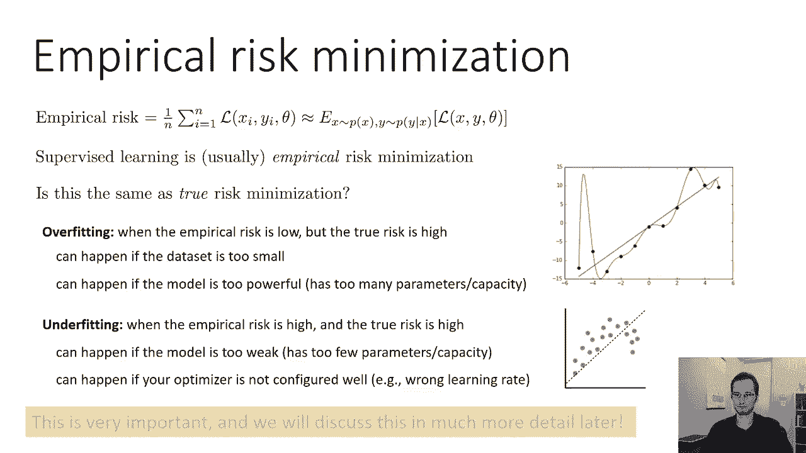

---

## 总结 🎯

本节课中我们一起学习了如何推导出我们的第一个监督学习算法——逻辑回归。我们讨论了如何定义一个算法，基本上需要做三个选择（电脑为我们做第四件事）：
1.  **定义模型类**：我们选择了逻辑模型，其中函数f在输入和参数中是线性的，然后对其应用softmax得到概率。
2.  **定义损失函数**：我们选择了负对数似然。
3.  **选择优化器**：我们使用梯度下降来优化。
4.  **电脑执行**：实际上在一个大的GPU上运行。

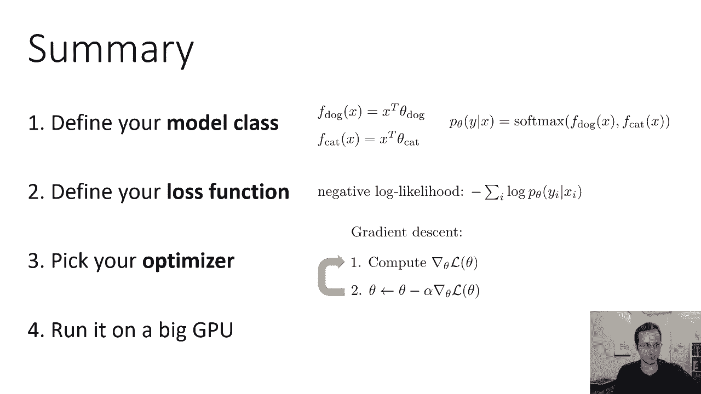

在未来，我们将讨论其他优化器、其他模型类，甚至其他损失函数。但就目前而言，希望这能让你了解我们如何建立这些机器学习算法。