# 8：CS 182 第三讲 - 第一部分 - 误差分析 📊

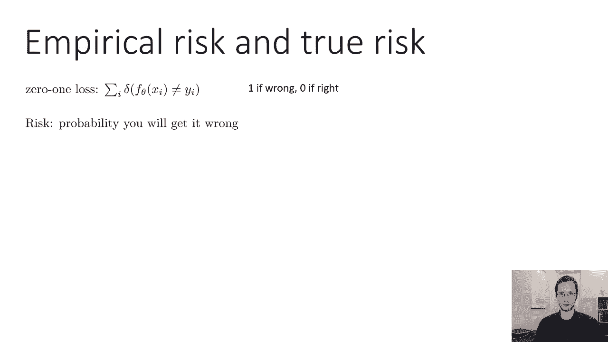

在本节课中，我们将学习如何分析机器学习模型的误差。我们将探讨模型为何会犯错，并引入偏差和方差这两个核心概念来理解过拟合与欠拟合现象。通过数学分析，我们将看到总误差如何分解为偏差和方差两部分，并讨论如何在这两者之间进行权衡。

## 回顾：经验风险与真实风险 🔄

上一节我们介绍了如何通过梯度下降训练分类模型。本节中，我们来看看如何判断模型是否表现良好。

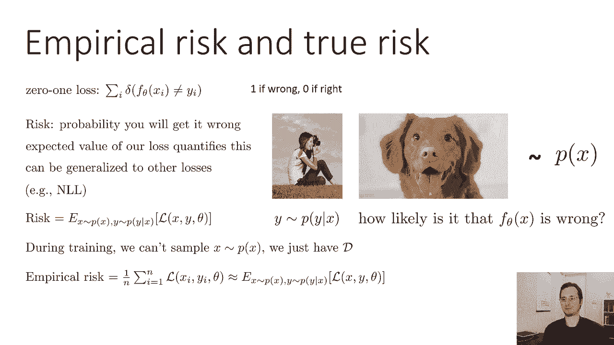

为了理解这一点，让我们重新审视经验风险和真实风险。我们使用0-1损失函数，其定义如下：

**公式：** `L(fθ(x), y) = 1 if fθ(x) ≠ y else 0`

这个损失函数指示预测是否正确。如果我们假设数据由一个生成过程产生，那么我们可以询问模型 `fθ(x)` 出错的概率。0-1损失的期望值量化了这个概率：

**公式：** `R(fθ) = E[L(fθ(x), y)]`

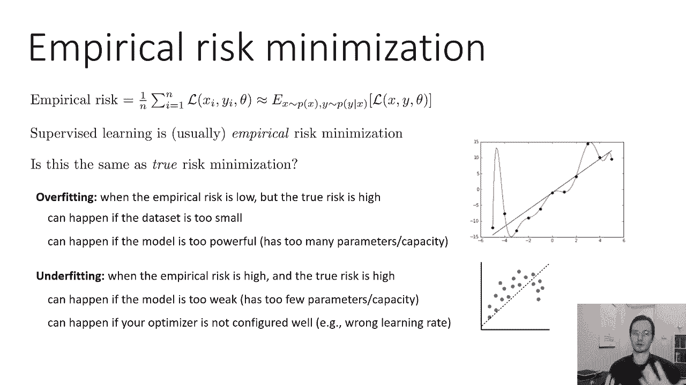

这个期望值就是**真实风险**，它衡量了模型在整个数据分布上的预期损失。然而，在实际训练中，我们无法计算整个分布，只能使用数据集 `D`。我们在数据集上计算的平均损失称为**经验风险**：

**公式：** `R_emp(fθ) = (1/N) * Σ L(fθ(x_i), y_i)`

经验风险是真实风险的一个无偏估计。但问题在于，我们通常选择参数 `θ` 来最小化经验风险，这并不等同于最小化真实风险。这两者之间的差异是本节课讨论的核心。

## 过拟合与欠拟合 🎯

经验风险并不总是真实风险的良好近似。在监督学习中，我们进行经验风险最小化，但这与真实风险最小化并不完全相同。

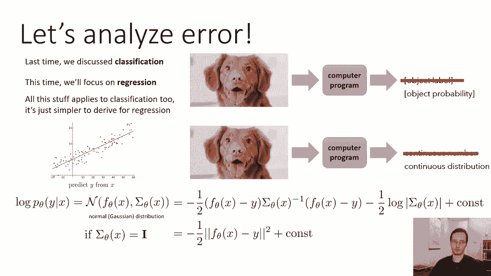

以下是两种常见的问题：

*   **过拟合**：指经验风险很低，但真实风险很高的情况。这意味着模型在训练集上表现很好，但在未见过的数据上表现很差。
*   **欠拟合**：指经验风险和真实风险都很高的情况。这意味着模型即使在训练集上也表现不佳。

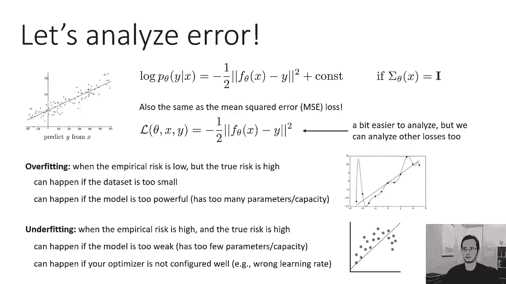

过拟合可能发生在数据集太小，或者模型相对于数据来说过于复杂（参数太多、容量太大）时。欠拟合则可能发生在模型太简单（参数太少、容量太小），或者优化器配置不当（如学习率不佳）导致无法有效最小化损失时。

## 回归设定与均方误差 📉

上一节我们讨论了分类问题。本节中，我们转向回归问题，因为其数学推导更简洁。回归的目标是预测连续变量。

为了采用概率方法，我们为输出 `y` 选择一个概率分布。一个常见且简单的选择是正态分布（高斯分布）。如果我们将其方差固定为单位矩阵，那么该分布的对数概率就对应于预测值 `fθ(x)` 与真实值 `y` 之差的平方。

**公式：** `log p(y | x) ∝ -1/2 * (fθ(x) - y)^2`

忽略常数项，这正好对应于**均方误差损失**。因此，最小化均方误差损失等价于在方差固定的假设下最大化高斯分布的对数似然。

## 偏差-方差分解 🧩

现在，让我们更正式地理解过拟合和欠拟合。我们关心的是，算法在不同训练集上的平均表现如何。

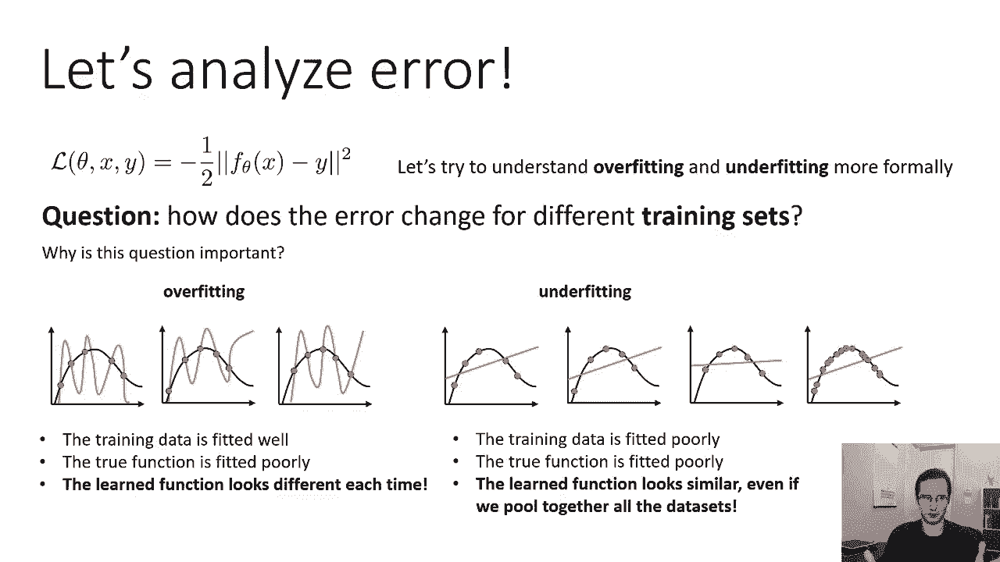

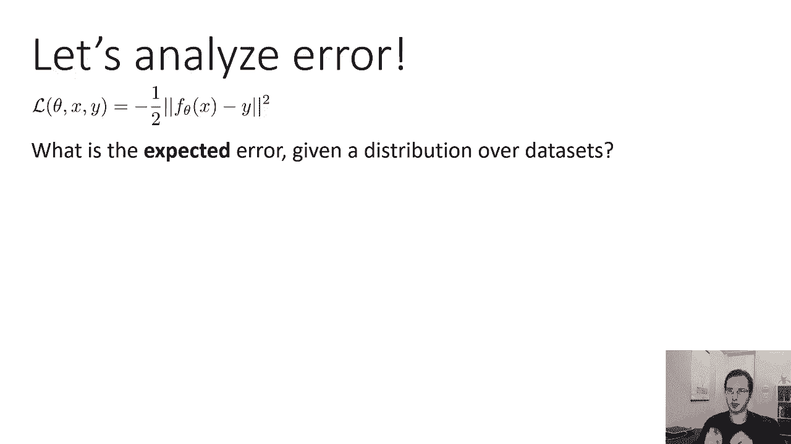

我们定义 `f_D(x)` 为在数据集 `D` 上训练得到的模型。我们想要计算该模型预测的期望误差，这个期望是对所有可能的数据集 `D` 取的：

**公式：** `E_D[ (f_D(x) - f(x))^2 ]`

其中 `f(x)` 是真实的函数。通过引入模型在所有数据集上的平均预测 `f̄(x) = E_D[f_D(x)]`，并进行代数运算，我们可以将期望误差分解为两个部分：

**公式：** `E_D[ (f_D(x) - f(x))^2 ] = E_D[ (f_D(x) - f̄(x))^2 ] + (f̄(x) - f(x))^2`

*   **方差**：`E_D[ (f_D(x) - f̄(x))^2 ]`。这衡量了模型预测随着训练集的不同而产生的变化程度。**高方差对应过拟合**。
*   **偏差平方**：`(f̄(x) - f(x))^2`。这衡量了模型平均预测与真实函数之间的差距。**高偏差对应欠拟合**。

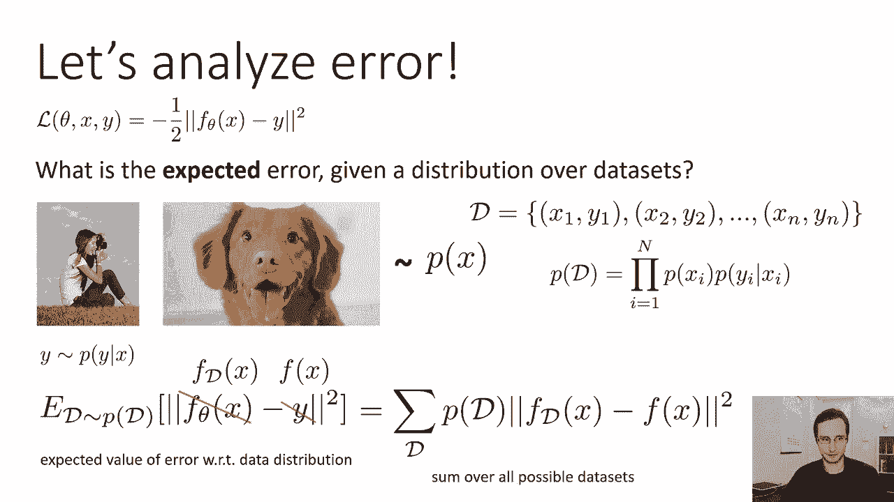

总误差就是方差与偏差平方之和。这个分解清晰地表明：
*   过拟合时，方差主导误差。
*   欠拟合时，偏差主导误差。

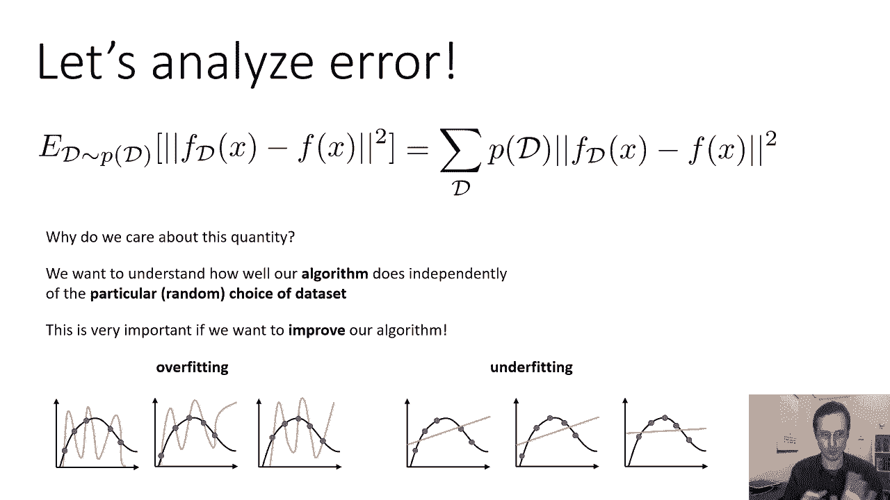

## 偏差-方差权衡 ⚖️

认识到误差由方差和偏差组成后，我们就可以理解，要得到一个性能良好的算法，需要在偏差和方差之间进行权衡。

以下是调节权衡的思路：

*   如果方差太大（过拟合），可以尝试增加一点偏差来减少方差（例如，使用更简单的模型、正则化、获取更多数据）。
*   如果偏差太大（欠拟合），可以尝试减少一点偏差，但这可能会增加方差（例如，使用更复杂的模型、更好的特征）。

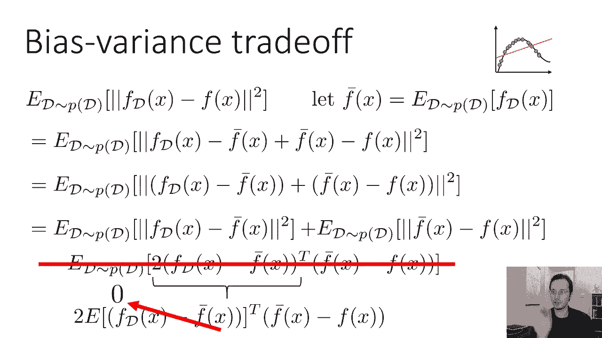

了解当前问题是高方差还是高偏差至关重要，因为针对它们的解决方法通常是相反的。用错了方法可能会使问题恶化。

## 总结 📝

本节课中，我们一起学习了机器学习中的误差分析。

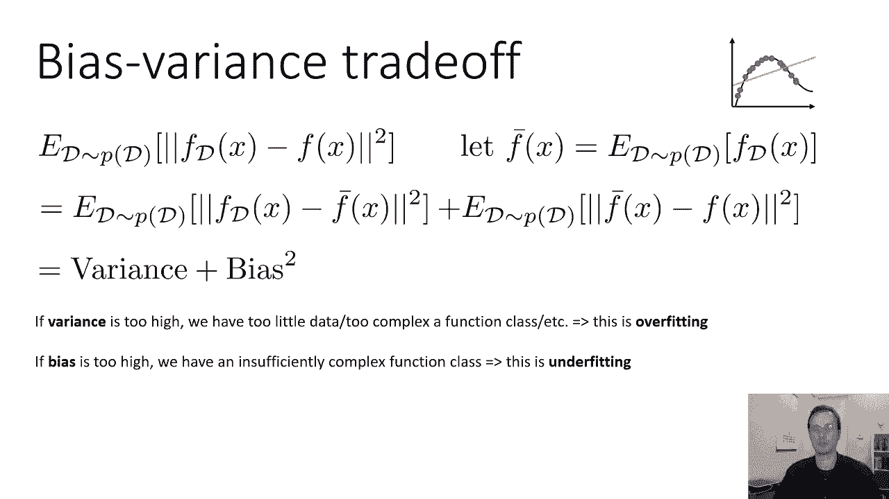

1.  我们区分了**经验风险**和**真实风险**，并指出经验风险最小化可能导致与真实风险最小化的目标不一致。
2.  我们定义了**过拟合**（低经验风险，高真实风险）和**欠拟合**（高经验风险，高真实风险）现象。
3.  在回归设定下，我们使用**均方误差损失**进行分析，并将其与高斯分布的对数概率联系起来。
4.  通过数学推导，我们将模型的期望误差分解为**方差**和**偏差平方**之和。方差衡量模型对训练集的敏感性，偏差衡量模型平均预测的准确性。
5.  最后，我们讨论了**偏差-方差权衡**，指出改进模型需要根据当前主导误差的类型（高方差或高偏差）来采取相应的策略。

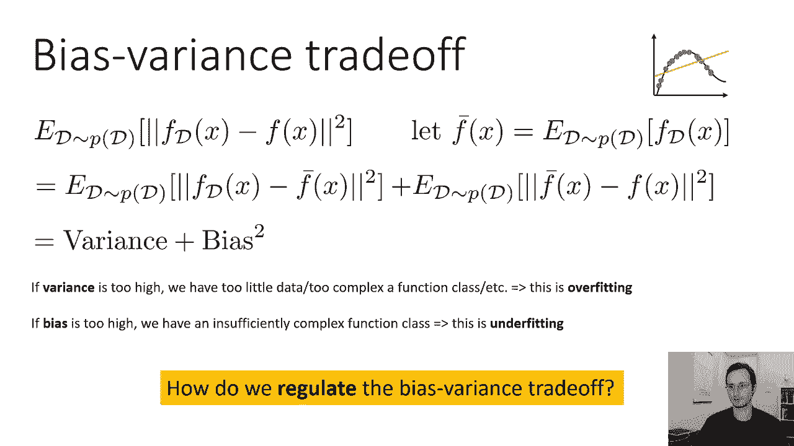

理解偏差和方差是诊断和改善机器学习模型性能的基础。在接下来的课程中，我们将学习具体的技术（如正则化）来管理这种权衡。