# 9：CS 182 第三讲 - 第二部分 - 误差分析 📊

在本节课中，我们将要学习如何通过误差分析来权衡和调节模型的偏差与方差。我们将重点探讨一种核心方法——正则化，并理解其背后的贝叶斯视角、常见形式以及它在不同模型中的应用。

## 权衡偏差与方差 ⚖️

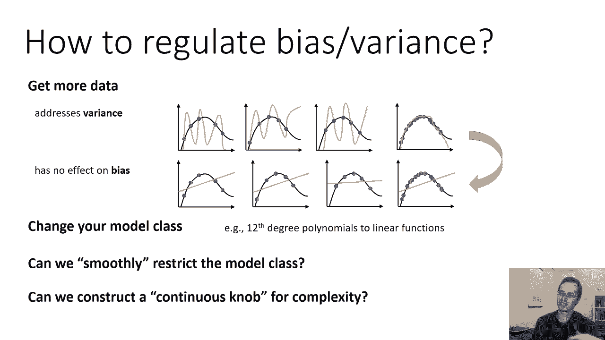

上一节我们介绍了偏差与方差的概念。本节中我们来看看如何调节它们。

一种方法是获取更多数据。获取更多数据主要解决方差问题。数据越多，过拟合的可能性就越低，方差的影响就越小。例如，如果我们只有五个数据点，并拟合一个八次多项式，很可能导致过拟合。但如果我们有五百万个数据点，拟合同样的八次多项式，结果可能会好得多。因此，拥有大量数据时，复杂的函数类可能很好地拟合真实函数。

然而，获取更多数据通常不会改善偏差。例如，一条直线无法拟合真实的曲线，无论我们提供多少数据点。

另一种方法是更改模型类。这意味着改变你的模型程序，例如使用更多参数或更复杂的结构。你可以将十二次多项式改为线性函数，这可能会减少方差，但增加偏差。但这是一个非常离散的选择。

我们能否更平滑地限制模型形式？例如，我们可能确实想要十二次多项式，但不希望它过于“疯狂”、锯齿状或尖锐。我们能否为模型复杂性构造一种连续的调节旋钮？

## 正则化：连续的调节旋钮 🎛️

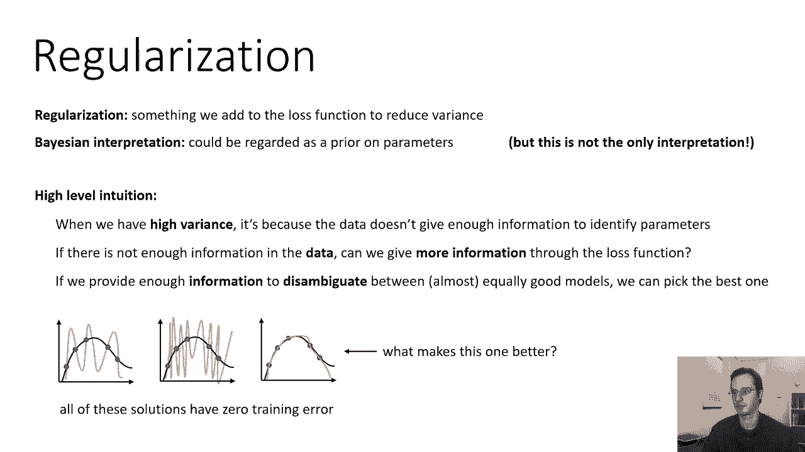

这被称为**正则化**。非正式地说，正则化是我们添加到损失函数中的一项，通常是为了减少方差（尽管并非总是如此）。理解正则化的一个更简单方法是通过贝叶斯视角，它认为正则化反映了我们关于参数的先验信念。这不是唯一的解释，但有助于建立直觉。

### 贝叶斯视角的高级直觉 🧠

当方差很高时，通常是因为数据没有提供足够的信息来唯一确定参数。例如，如果我们只有五个数据点和一个十二次多项式，问题在于函数未被充分确定。有许多不同的十二次多项式都能很好地拟合这五个点。就经验风险而言，它们看起来都一样好。数据中的噪声甚至意味着我们可能不想要那个“最拟合”的函数。

核心问题是：数据中没有足够的信息在众多可能函数中做出选择。因此，我们需要通过损失函数向算法提供额外知识。如果我们能提供足够的信息来消除歧义，算法或许就能在众多看似同样好的模型中选择正确的那个。

假设我们有一个数据集，并画出了多个都能完美穿过数据点的函数曲线。即使你不知道真实数据是什么，仅凭观察这些曲线，你可能会觉得某些曲线（例如更平滑的）看起来更“合理”，更可能是正确的函数。这种“看起来更合理”的直觉，就对应了**先验信念**。

### 贝叶斯形式化 📐

我们可以将整个学习问题用概率形式写出：给定数据集 `D`，最可能的参数向量 `θ` 是什么？

根据条件概率定义和链式法则：
`P(θ | D) ∝ P(D | θ) * P(θ)`

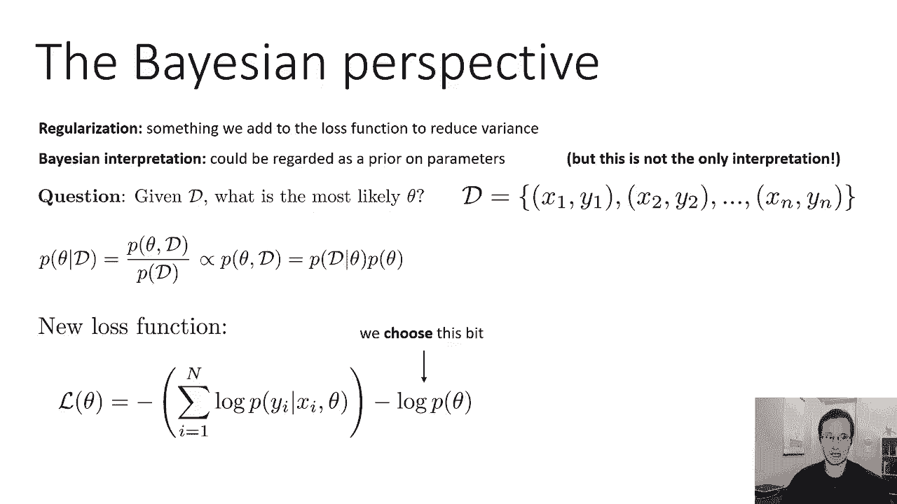

*   **`P(D | θ)`**：这是在给定参数 `θ` 下，观察到数据 `D` 的概率。这正是我们之前讨论的**最大似然估计**的目标。在独立同分布假设下，它可以分解为所有数据点概率的乘积。
*   **`P(θ)`**：这是**先验概率**，表示在看到任何数据之前，我们认为 `θ` 的可能性有多大。它编码了我们对模型的先验信念。

因此，我们得到了一个新的损失函数（负对数形式）：
`-log P(θ | D) = -log P(D | θ) - log P(θ) + 常数`

第一项 `-log P(D | θ)` 就是我们熟悉的负对数似然损失。第二项 `-log P(θ)` 就是我们的**正则化项**。

### 选择先验：为何偏好小参数？ 🔍

我们如何构建一个偏好“平滑”函数（对应小参数）的先验 `P(θ)` 呢？

考虑具有多项式特征的线性回归模型：
`f_θ(x) = θ_0 + θ_1*x + θ_2*x^2 + θ_3*x^3 + ...`

那些表现出“尖刺”和剧烈波动的复杂多项式，往往具有较大的系数。如果我们限制系数只能取较小的值，得到的多项式就会平滑得多。

因此，如果我们想要小系数，可以问：什么样的概率分布会给小数值分配更高的概率？一个简单而常见的选择是**均值为零的正态分布（高斯分布）**。

均值为零的正态分布像一个钟形曲线，它将大部分概率质量集中在接近零的小数字周围。其方差决定了“接近零”的程度。方差越小，先验对具有大系数（大尖峰）的函数的惩罚就越强。

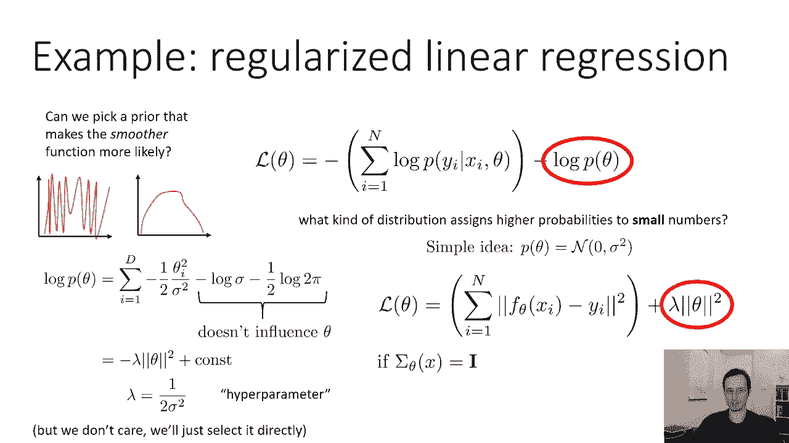

均值为零的正态分布的对数概率为（忽略常数项）：
`log P(θ) ∝ - (1/(2σ^2)) * Σ_i θ_i^2`

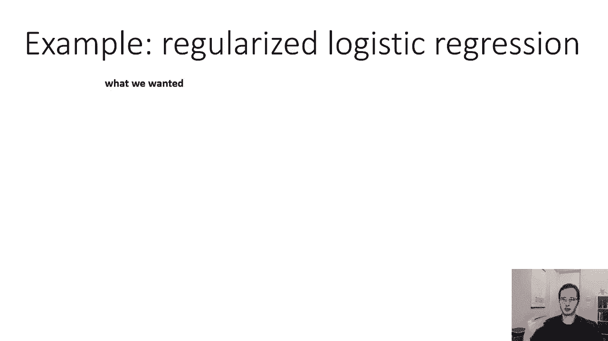

令 `λ = 1/(2σ^2)`，我们可以将先验项等价地写为 `-λ * ||θ||^2`。这里 `||θ||^2` 是参数向量 `θ` 的L2范数平方（即各分量平方和）。`λ` 是一个超参数，由我们选择，用于控制正则化的强度。

### 正则化损失函数 📉

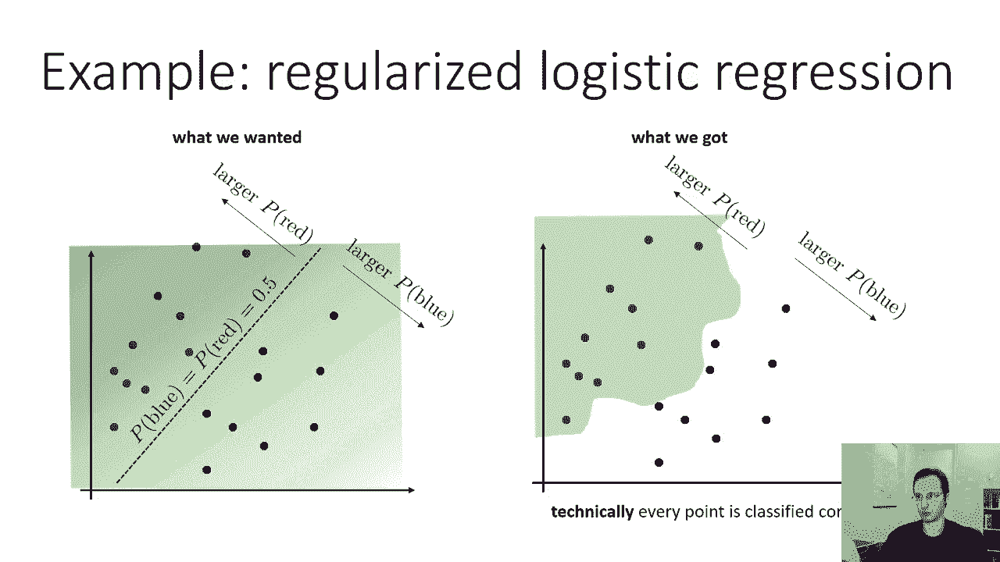

综合以上推导，对于线性回归，我们最终的损失函数变为：
`损失 = 均方误差(MSE) + λ * ||θ||^2`

这与我们之前的目标函数（负对数似然）一致，只是增加了一个 `λ||θ||^2` 项。这个简单的添加对应于贝叶斯方法中采用均值为零的正态先验。

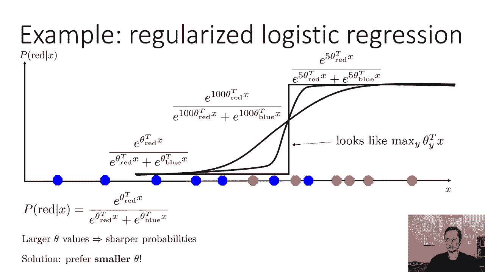

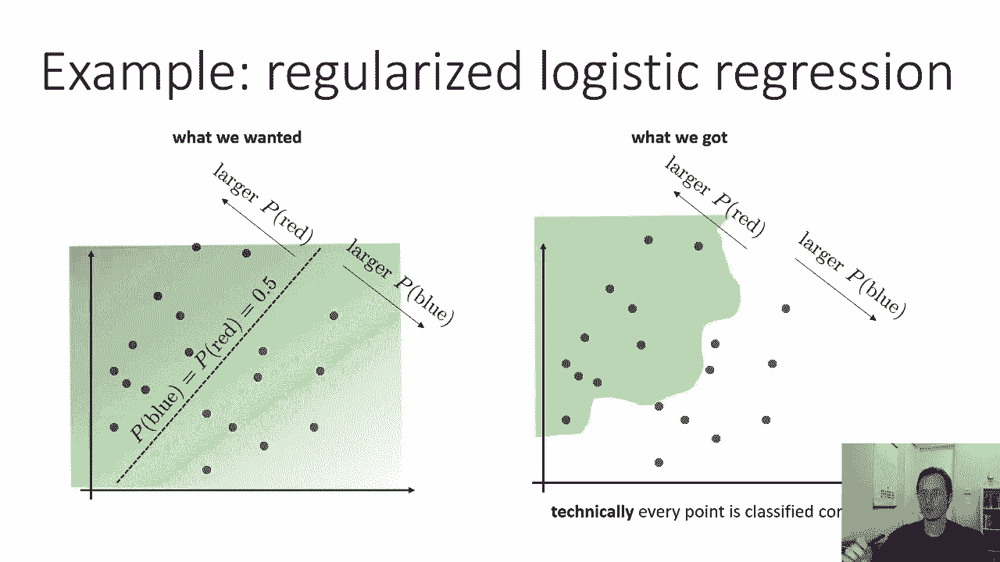

## 逻辑回归中的正则化 🧮

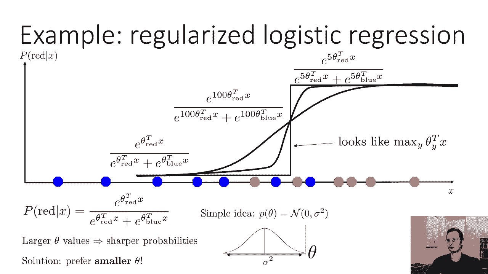

上一节我们介绍了逻辑回归。它也可能过拟合，产生虽然训练精度完美但决策边界不合理（高方差）的模型。

在逻辑回归中，参数 `θ` 的大小会影响概率预测的“尖锐”程度：
*   大的 `θ` 值 => 尖锐的概率跳变（类似硬边界）。
*   小的 `θ` 值 => 平滑的概率变化（更合理的决策边界）。

如果我们希望得到平滑的概率输出（即更合理的决策边界），一个自然的想法是偏好较小的 `θ` 值。因此，我们可以采用同样的先验：均值为零的正态分布。

对于逻辑回归（分类问题），添加正则化项后的损失函数为：
`损失 = 负对数似然 + λ * ||θ||^2`

这通常被称为**权重衰减**，因为在最小化过程中，它促使权重（参数）向零衰减、变小。

## 其他常见的正则化方法 📚

除了L2正则化（权重衰减），还有其他重要的正则化方法。

以下是几种常见的正则化器：

*   **L1正则化**：使用参数的绝对值之和作为正则化项，即 `λ * Σ_i |θ_i|`。它对应于拉普拉斯先验。与L2正则化不同，L1正则化倾向于产生**稀疏解**，即它鼓励参数向量 `θ` 中的许多分量直接变为零。这在特征选择等场景中很有用。
*   **Dropout**：一种专门用于神经网络的正则化技术。它在训练过程中随机“丢弃”（暂时忽略）网络中的一部分神经元，以防止神经元之间过度的协同适应（co-adaptation）。
*   **特定模型的正则化**：例如，在生成对抗网络（GANs）中，常使用**梯度惩罚**等专门设计的正则化器来稳定训练。

在深度学习中，权重衰减（L2）是最常见的正则化器。L1正则化也广泛使用。Dropout在特定网络架构中很流行。而GANs等模型则有自己特殊的正则化需求。

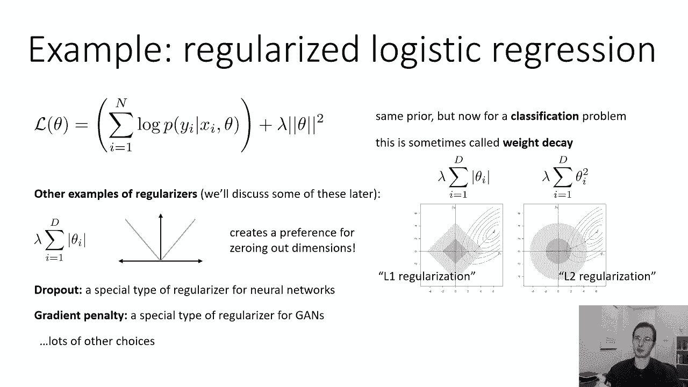

## 正则化的其他视角与超参数选择 🧐

正则化不仅可以从贝叶斯视角理解，还有其他重要视角：

*   **数值稳定性视角**：在问题欠定时（例如特征数多于数据点），L2正则化可以通过向需要求逆的矩阵对角线添加一个常数项，使其变得非奇异，从而解决数值计算问题。
*   **优化视角**：在某些情况下，精心选择的正则化项可以改变损失函数的景观，使其更容易优化，从而可能帮助减少**欠拟合**（如果欠拟合是由于优化困难造成的）。这在深度学习的一些模型（如GANs）中尤为明显。

关于正则化器，一个共同点是它们引入了**超参数**（如 `λ`）。这些超参数不能通过最小化训练损失来选择（因为训练损失可能已经很低，例如在过拟合时）。我们必须通过其他方式选择它们，例如使用**验证集**。

## 总结 📝

本节课中我们一起学习了：
1.  **调节偏差与方差**：可以通过获取更多数据（主要降低方差）或更改模型复杂度（同时影响偏差和方差）来实现。
2.  **正则化的核心思想**：通过向损失函数添加一个不依赖于数据的项，来引入我们对模型的先验偏好或约束，从而控制模型复杂度，主要用以降低方差。
3.  **贝叶斯解释**：正则化项对应于模型参数的**先验分布**。例如，L2正则化对应于**均值为零的正态先验**，它表达了我们对“小参数”或“平滑函数”的偏好。
4.  **常见形式**：
    *   **L2正则化/权重衰减**：`λ * ||θ||^2`，最常见，促使参数变小。
    *   **L1正则化**：`λ * Σ_i |θ_i|`，促使参数稀疏化（很多为零）。
    *   **Dropout**：神经网络特有的随机正则化方法。
5.  **多面性**：正则化不仅用于防止过拟合，有时也从数值稳定或优化难易度的角度被理解和应用。
6.  **超参数**：正则化强度（如 `λ`）是一个关键的超参数，需要通过验证集等技术进行选择。

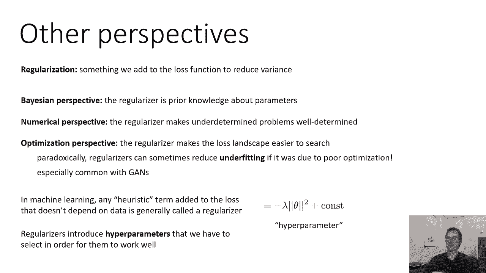

正则化是机器学习中平衡模型复杂性与泛化能力、将先验知识融入学习过程的核心工具之一。