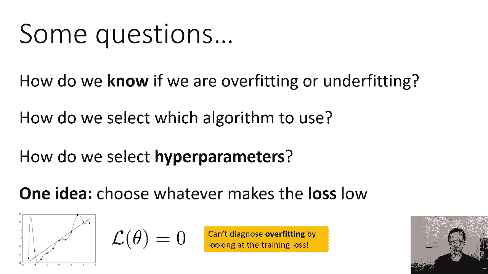
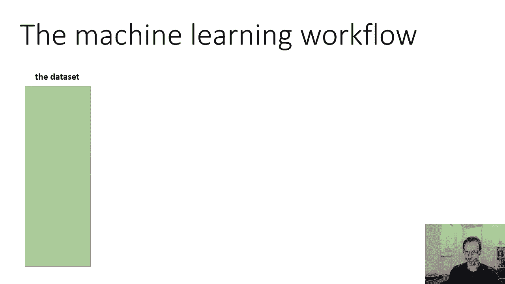
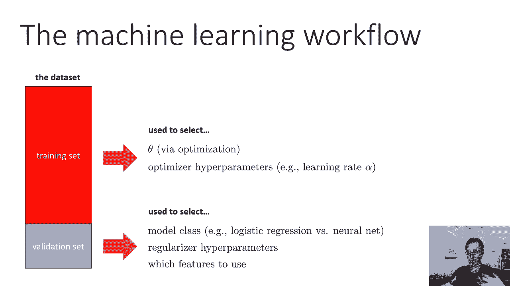
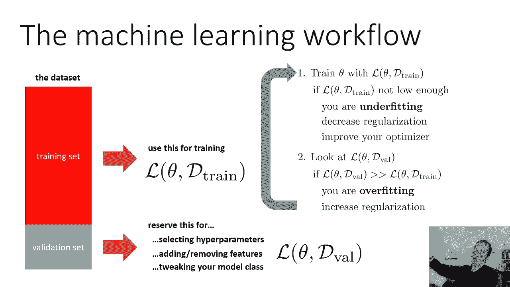
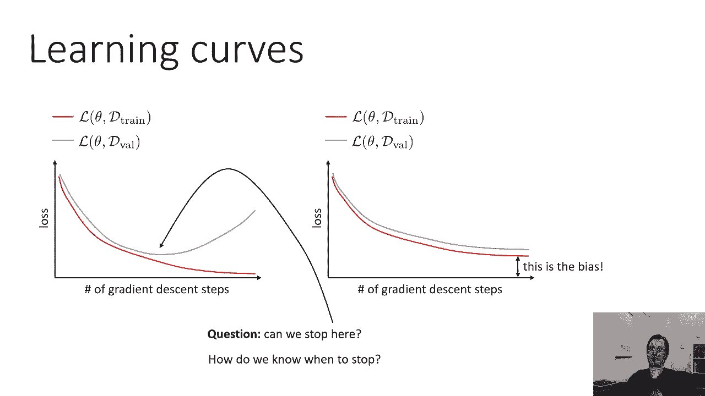
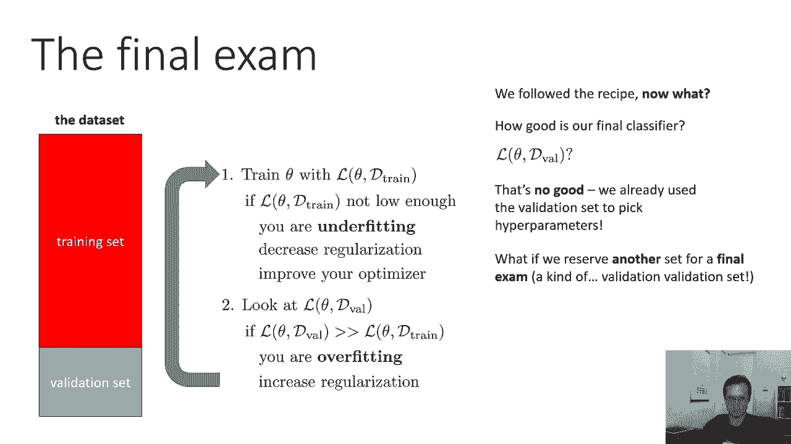
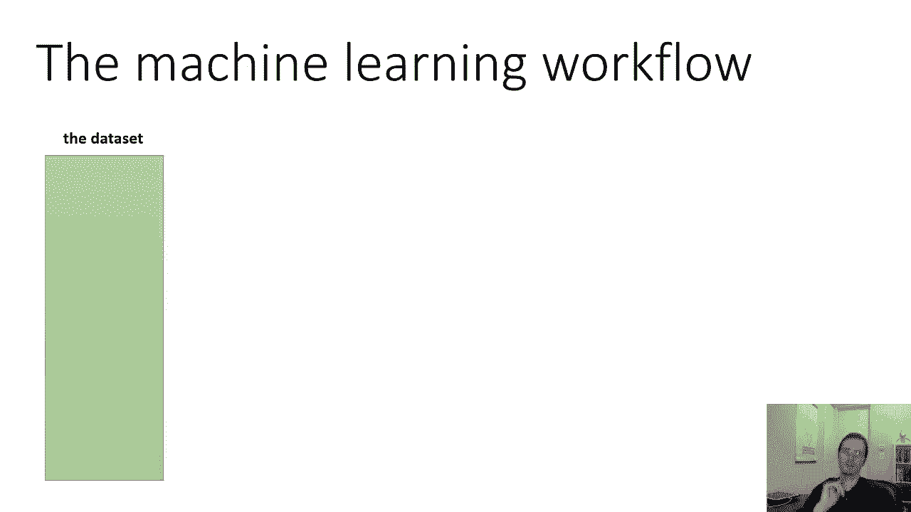
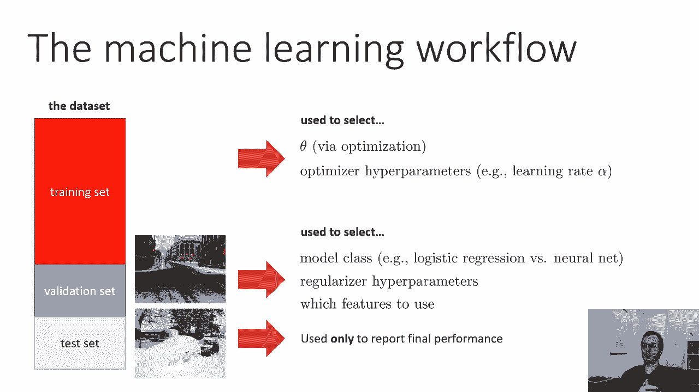
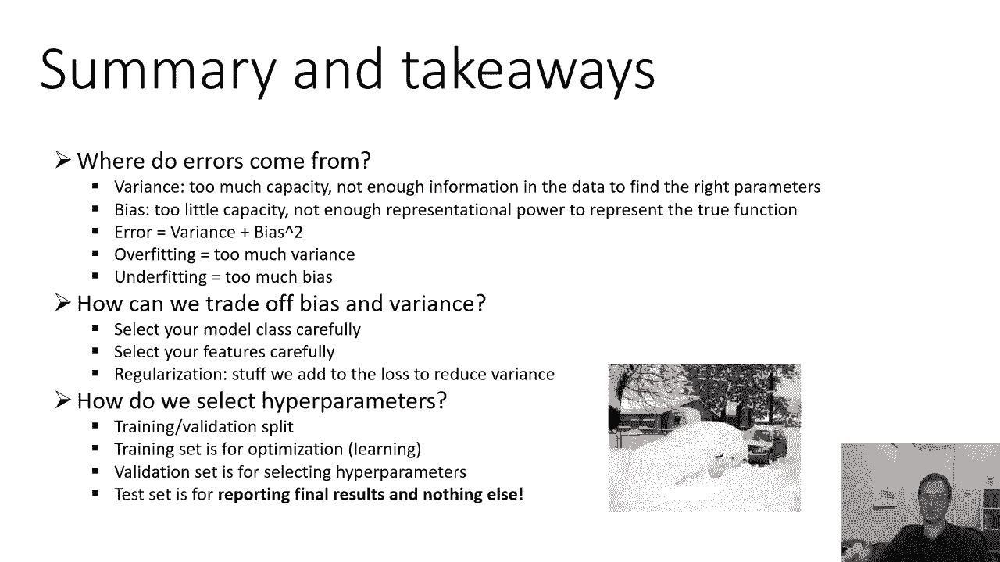

# 10：误差分析 📊

在本节课中，我们将学习如何诊断机器学习模型的问题，并系统地选择超参数。我们将探讨过拟合与欠拟合的识别方法，以及如何通过划分数据集来指导模型开发与评估。

---

## 🎯 概述：机器学习工作流程

一个核心问题是：我们如何知道模型是过拟合还是欠拟合？如何选择算法和超参数？仅凭训练损失低来做决定并不明智，因为这无法揭示偏差与方差的权衡。训练损失低可能意味着欠拟合（高偏差），但即使训练损失为零，模型也可能因过拟合（高方差）而在新数据上表现糟糕。因此，我们需要一个更系统的工作流程。

---

## 📂 数据集划分

标准的机器学习工作流程始于数据集的划分。通常，我们将数据集分为两部分：**训练集** 和 **验证集**。训练集约占数据的80%至90%，用于训练模型参数；验证集则占剩余部分，用于模型选择和超参数调优。

训练损失记为 **L(θ, D_train)**，即模型在训练数据上的经验风险。验证损失记为 **L(θ, D_val)**，它使用未参与训练的数据，是对模型真实风险的无偏估计。通过比较两者，我们可以诊断过拟合与欠拟合。

---

## 🔍 诊断与调整策略

以下是基于训练损失和验证损失的诊断与调整步骤：

1.  **检查训练损失**：如果训练损失过高（例如，在猫狗分类任务中错误率高达35%），则模型可能**欠拟合**。
2.  **应对欠拟合**：可以尝试减少正则化强度、改进优化算法、添加更多特征或使用更复杂的模型（增加参数），以提升模型对训练数据的拟合能力。
3.  **检查验证损失**：如果训练损失很低（例如1%），但验证损失显著更高（例如20%），则模型可能**过拟合**。
4.  **应对过拟合**：可以增加正则化强度、简化模型（降低模型容量）或收集更多训练数据。

这个过程可以迭代进行，直至获得满意的结果。

---

## ⚙️ 超参数的选择

超参数的选择需要根据其目的，分配到不同的数据集上：

*   **训练集**：用于选择直接影响**优化过程**的超参数，例如学习率 **α**。因为这些参数的目标是最小化训练损失。
*   **验证集**：用于选择影响**模型容量和过拟合**的超参数与设计，例如：
    *   模型类别（逻辑回归 vs. 神经网络）
    *   网络层数
    *   特征选择
    *   正则化系数 **λ**

验证集帮助我们做出那些需要在偏差与方差间取得平衡的决策。

---

## 📈 学习曲线分析

在实践中，我们并非孤立地查看最终损失，而是观察**学习曲线**。学习曲线以优化步数（如梯度下降迭代次数）为横轴，以损失值为纵轴，通常同时绘制训练损失和验证损失。

以下是两种典型的学习曲线形态：

*   **过拟合曲线**：训练损失持续下降，但验证损失在下降到某一点后开始**上升**。这表明模型开始“记忆”训练数据，损害了泛化能力。
*   **欠拟合曲线**：训练损失和验证损失在下降后都维持在较高的水平，且两者**差距很小**。这表明模型能力不足，无法捕捉数据中的基本模式。

通过观察学习曲线，我们可以更直观地判断模型状态。例如，若出现验证损失上升的过拟合迹象，应增加正则化；若出现欠拟合，则应减少正则化或增加模型复杂度。

---

## ⏹️ 早停法

一个自然的想法是：既然我们能在学习曲线上看到验证损失的最低点，能否在优化过程中，当验证损失即将上升时提前停止训练？这种方法被称为**早停**。

早停是一种有效防止过拟合的正则化技术。然而，它并不能完全替代其他正则化方法。即使通过早停在最佳点停止，模型的最终性能可能仍不如结合了适当权重衰减（L2正则化）等方法的模型。早停是工具箱中有用的工具，但非万能。

---

## 🧪 测试集：最终评估

遵循上述流程并得到满意模型后，如何向他人报告模型的最终性能？**不能使用验证损失**，因为验证集已被用于选择超参数，其评估结果会偏向于这些选择，不再是模型泛化能力的无偏估计。

为了解决这个问题，我们需要将数据集进一步划分为三部分：

1.  **训练集**：用于训练模型参数 **θ** 和选择优化类超参数。
2.  **验证集**：用于选择模型结构、正则化强度等。
3.  **测试集**：在模型完全确定后，**仅用于一次性的最终性能评估**。测试集在整个开发过程中必须保持“纯净”，绝不用于任何形式的训练或选择，以确保评估结果的公正性。

---

## 📝 总结

本节课我们一起学习了机器学习中的误差分析与模型选择流程：

*   **误差来源**：**偏差**（模型能力不足）和**方差**（模型对训练数据过于敏感）。误差可近似表示为 **误差 ≈ 偏差² + 方差**。
*   **过拟合与欠拟合**：过拟合对应高方差，欠拟合对应高偏差。
*   **权衡方法**：通过仔细选择模型复杂度、特征和正则化来平衡偏差与方差。
*   **工作流程核心**：划分**训练集**、**验证集**和**测试集**。
    *   训练集用于优化参数。
    *   验证集用于选择超参数和模型设计。
    *   测试集用于最终性能报告。
*   **分析工具**：**学习曲线**是诊断模型状态的重要工具，**早停法**是一种实用的正则化技术。

通过这套系统的方法，我们可以更科学地开发、调试和评估机器学习模型。