# 11：CS 182 第4讲 第1部分 - 优化 🧠

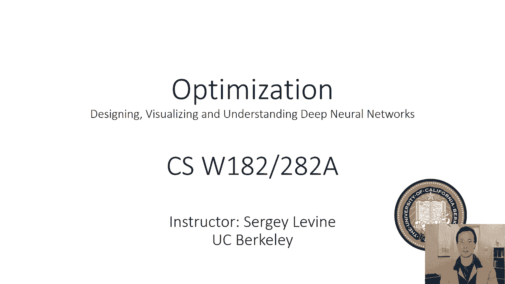

在本节课中，我们将深入探讨优化算法，特别是梯度下降法。我们将回顾其基本原理，分析其在复杂损失函数（如神经网络）中面临的挑战，并讨论如何改进优化方向。

---

## 回顾梯度下降法

在第二讲中，我们首次讨论了逻辑回归的梯度下降。首先，让我们从梯度下降的回顾开始。

我们有一个损失函数。在第二讲中，我们了解到一个很好的损失函数是负对数似然，这里用 `l(θ)` 表示。但通常，你可以使用任何你想要的损失函数。

假设参数 `θ` 是二维的，我们可以将损失函数可视化。两个水平轴代表 `θ` 的两个维度，垂直轴代表损失值。这张图代表了损失函数的“地形”，显示了 `θ` 如何影响 `l(θ)`。

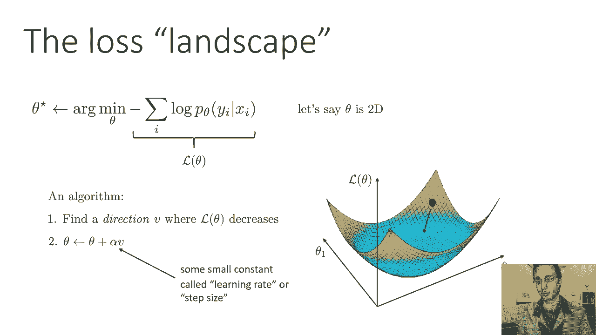

如果我们从某个点（由黑色圆圈表示）开始，找到使 `l(θ)` 最小化的最佳 `θ` 值的方法之一，就是找出一个可以前进的方向（用箭头表示），该方向能减少 `l(θ)`。我们朝着那个方向移动，希望最终收敛到尽可能好的值。

向特定方向移动意味着：找到使 `l(θ)` 减小的方向 `v`，然后将 `θ` 更新为 `θ + α * v`。其中，`α` 是一个被称为学习率或步长的小常数。直觉上，它表示你向 `v` 方向移动的速度。

你不想移动得太快，因为如果 `α` 非常大，你可能会越过最低点，从另一边出来，最终落在一个比起点损失值更高的地方。因此，你需要使用一个较小的常数。

---

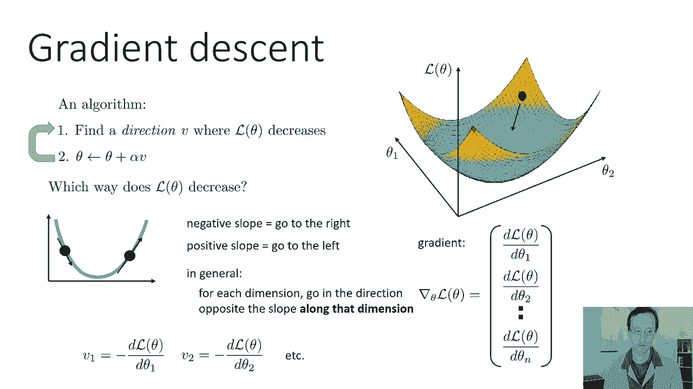

## 如何选择前进方向

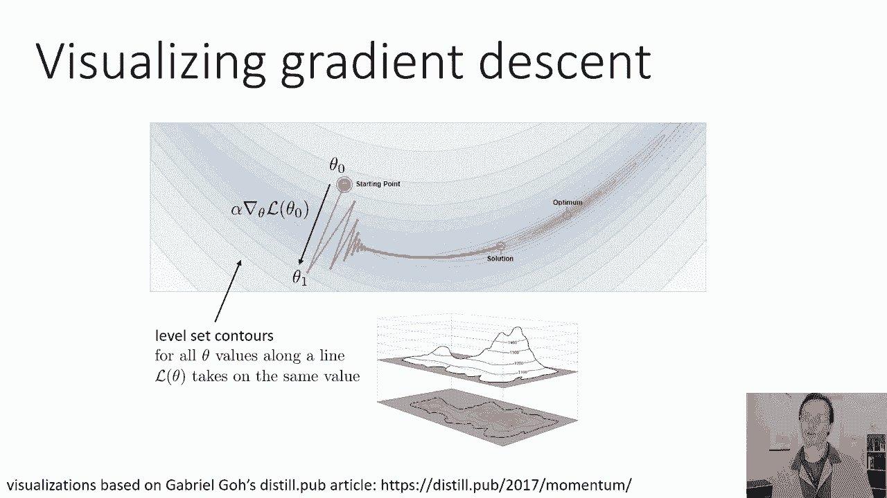

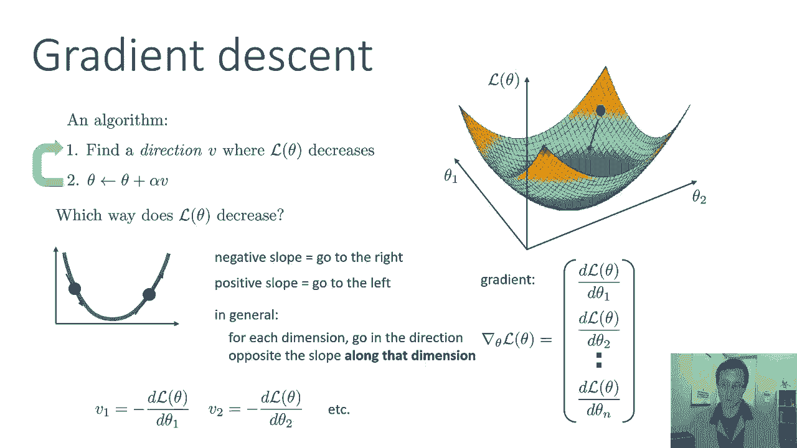

在一维情况下最容易获得直觉。假设 `θ` 是一维的，这是我们的函数图。如果我们位于某个特定点，可以计算该点的斜率。如果斜率为负，我们向右移动；如果斜率为正，我们向左移动。这将使我们更接近最小值。

一般情况下，对于多元函数，我们对每个维度单独应用这个过程。我们如何知道斜率？通过计算导数。在更高维度上，对于每个维度，我们沿着该维度斜率相反的方向移动。斜率由该维度的偏导数给出。

因此，`v1` 被设置为 `-∂l/∂θ1`，`v2` 被设置为 `-∂l/∂θ2`。通常，我们可以将所有偏导数堆叠成一个向量。这个向量称为**梯度**。梯度是一个向量，其每个分量都是 `l(θ)` 关于 `θ` 相应维度的偏导数。这个向量的维数与 `θ` 的维数相同。

简单来说，你只需将方向 `v` 设为梯度的负值。

在今天的讲座中，我们将详细讨论梯度下降有效的情况、效果不佳的情况以及如何改进它。我们会看到许多梯度下降的可视化图。

一种常见的可视化是**等高线图**。在这种图中，线条对应于损失函数的等高线。沿着同一条等高线的所有 `θ` 值，其 `l(θ)` 具有相同的值。这很像地图上的高程图。

在这些图中，我们将用直线可视化梯度下降的优化路径。每个线段的端点代表一次梯度下降迭代后的 `θ` 值。点之间的线段表示步骤，该步骤是梯度方向乘以学习率 `α`。

---

## 梯度下降演示与挑战

让我们看一个梯度下降的演示。在这张图中，我们正在优化一个有两个参数的函数。橙色大圆圈代表起点，较小的圆圈代表终点。

这个函数并不容易优化，它有一个狭窄的山谷（类似于峡谷）。当我移动起点时，你可以立即看到梯度下降的步骤。步骤沿着山谷向下移动，然后逐渐沿着山谷前进。

当我增加步长时，步骤会沿着山谷走得更远。但随着步长变大，当你到达谷底时，你实际上会冲上另一边的斜坡，最终向右摆动。你越过了最低点，又从另一端回来，如此往复。

从这个可视化中，我们看到梯度下降面临许多挑战：
1.  **振荡问题**：我们从一边冲上去，又从另一边回来。
2.  **无法达到精确最优**：当我们沿着山谷前进时，速度变得越来越慢，实际上并没有达到确切的最低点。

---

## 梯度下降方向的局限性

梯度下降并不总是朝着最优方向移动。它总是采取**最陡下降**的方向，但这并不总是直接指向最优解的方向。

在这张图中，从起点迈出的第一步实际上正在远离最优解。它正沿着山谷向下移动，但向下移动使它离最佳状态更远。梯度下降选择最陡峭的方向，而不是最好的方向。

想象一个椭圆形的坑，最优解在中间。最陡下降的方向总是垂直于等高线的切线。如果我们朝那个方向走，最终会进入山谷，也许从另一边出去一点。在下一个点，最陡的方向又会改变，以此类推。这正是我们在演示中看到的。

给定无限的梯度步长，最终这将达到最优，但可能需要很长时间。最陡峭的方向并不总是最好的。

现在我们想知道：有没有一种方法可以更好地计算出方向？有没有办法计算出一个直接走向最优的方向，而不仅仅是最陡下降的方向？我们稍后会讨论这个问题。实际上有一些方法可以计算更好的方向，但首先让我们更好地理解梯度下降带来的挑战。

---

## 损失函数的性质：凸性

之前讨论逻辑回归时，我们画的损失曲面非常好。“好”意味着梯度下降能很好地处理这个损失面。为什么？这个损失面有很多优点，其中之一是没有狭窄陡峭的山谷。从任何一点出发，最陡下降方向都会指向最优解。

但我们在做机器学习时，损失函数真的都很好吗？逻辑回归是一种分类方法，其中类别的概率由输入的线性函数的 softmax 给出。参数 `θ` 出现在指数中。我们取概率的对数，就得到了负对数似然损失。

逻辑回归的负对数似然损失保证是所谓的**凸函数**。凸函数通常很好。

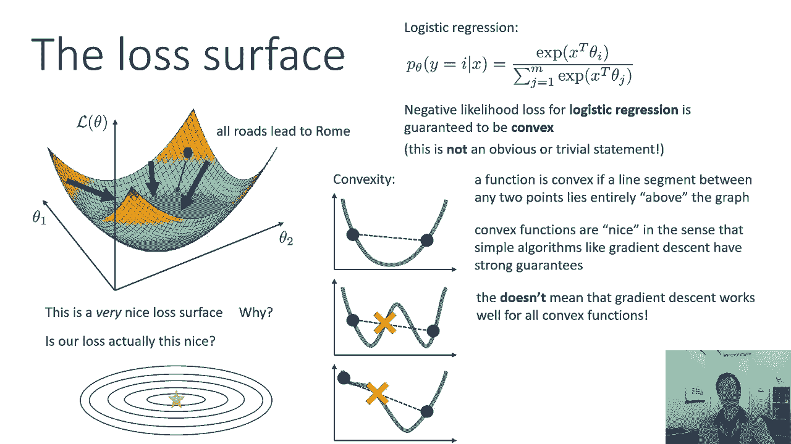

凸函数是什么意思？为什么凸函数往往优化得很好？这里有一个一维函数的例子。一个函数是凸的，如果该函数上任意两点之间的线段完全位于函数图像的上方。也就是说，取任意两点，在它们之间画一条线，这条线将完全在图像上方，不会与图像相交。

相比之下，非凸函数则不是这样。如果我在两点之间画一条线，它可能会与图像相交。非凸函数可能有两个甚至多个局部最优值。但即使函数只有一个最优值，它也可以是非凸的（例如存在平台区域）。

凸函数意味着它只有一个最优值（全局最优）。但非凸函数并不意味着一定有多个最优值。

凸函数的好处在于，像梯度下降这样的简单算法对凸函数有很强的理论保证。可以证明，在凸函数上，梯度下降会在多项式次数的迭代内找到全局最优解。

但这并不意味着梯度下降对所有凸函数都有效。例如，之前幻灯片左下角的函数也是凸的，但梯度下降需要走非常曲折的路径才能达到最优。不过，凸函数通常是我们能期望的更好的情况之一。

---

## 神经网络的损失曲面

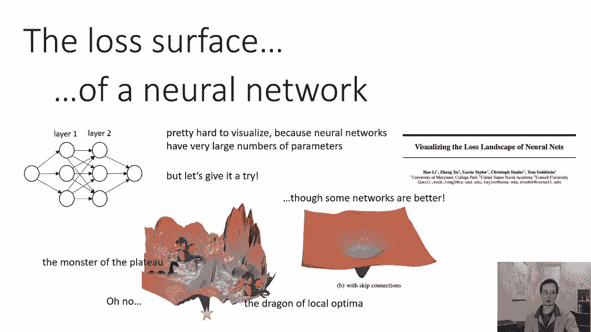

逻辑回归是一个相对简单的算法。神经网络则是一个更复杂的函数，具有许多参数和多层表示，后接更复杂的数学操作（如 softmax）。这些操作的精确定义将在后面的讲座中介绍。

很难想象神经网络的损失曲面，因为神经网络有非常多的参数，因此无法用两个参数来绘制有意义的图像。但我们可以尝试。

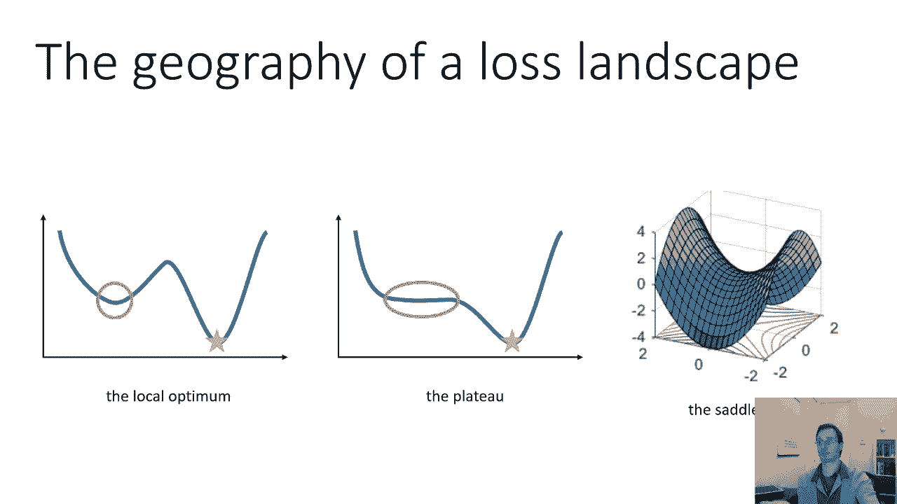

李等人的论文《Visualizing the Loss Landscape of Neural Networks》使用了一些巧妙的降维技巧，试图大致可视化神经网络的损失景观。虽然无法精确可视化，但通过降维，我们可以得到一些看起来有点现实的图像，至少能给我们一些直觉。

例如，一个在 ImageNet 上训练的、没有跳跃连接（skip connections）的 ResNet 模型的损失景观图。将这张图与之前逻辑回归美丽的损失景观进行比较，这东西看起来更糟。这里有局部最优、平坦的高原，非常不凸，有很多复杂的特征。

有些网络结构更好。例如，一个带有跳跃连接的 ResNet 模型（我们稍后会讨论什么是跳跃连接）的损失景观看起来更好一些。虽然仍然有很多平坦区域，但至少没有那么多的峭壁和缝隙。神经网络的损失景观肯定不是凸的。

---

## 损失景观中的关键特征

在损失景观中，我们应该关注三个重要的地理特征：
1.  **局部最优**
2.  **高原**
3.  **鞍点**

有趣的是，按知名度排序，局部最优最出名，鞍点最不出名。但按问题的严重性排序，局部最优实际上是最不糟糕的问题之一，而鞍点是最糟糕的问题之一。

以下是这些特征的详细说明：

### 1. 局部最优
这是非凸损失景观最明显的问题之一。你可能有多个点处的导数都为零（梯度为零）。在这些局部最优点中的任何一个，都没有改进的方向；任何移动都只会增加损失值。

全局最小值也是一个局部最小值。在全局最小值处，任何步骤都会增加损失值，但这没关系，因为你已经是最好的了。但图中的其他局部最优点也有这个性质。

这是人们过去担心神经网络的一个重要原因。众所周知，神经网络具有非凸损失景观，因此它们必须具有局部最优。原则上，局部最优可能非常可怕，因为梯度下降可能收敛到一个比全局最优任意差的解。当导数都为零时，你无法知道这是全局最优还是某个很差的局部最优。

有点意外的是，对于非常大的神经网络，局部最优实际上变得不那么重要了。这在经验和理论上都有研究。具有大量参数的神经网络在其损失景观中肯定有局部最优，但似乎没有太多的局部最优比全局最优差很多。这不是一件明显的事情，实际上有点令人惊讶。

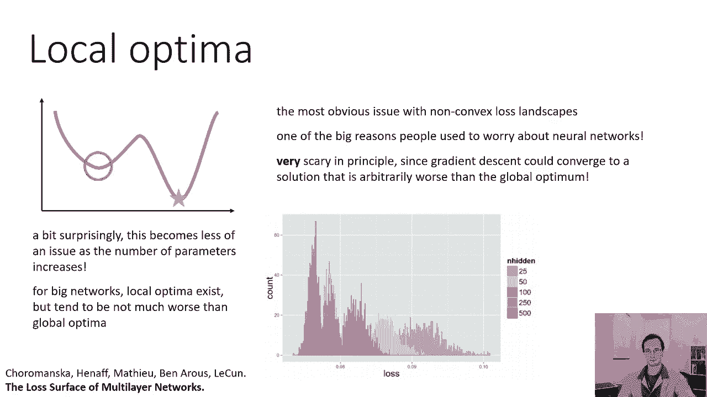

一张来自论文《Loss Surfaces in Multilayer Networks》的图说明了这一点。横轴显示梯度下降发现的解的损失值（负对数似然），纵轴表示达到该损失的频率。不同颜色代表不同大小的网络（参数更多）。

对于最小的网络（黄色），不同的损失值分布较广。随着网络变大（红色），实现的损失值分布变得更加紧密。这意味着，虽然仍然存在局部最优，但这些局部最优的损失值都非常相似，都很好。没有非常糟糕的局部最优，或者即使有，也非常罕见。这是一个经验观察，也有相当多的理论分析支持。有强有力的证据表明，大型神经网络的局部最优并没有那么糟糕。

### 2. 高原
高原不那么明显。我们可以想象一个损失景观，其中有一个很大的区域，损失的梯度非常小。我们在之前的峡谷底部演示中看到了这样的东西。峡谷两侧有非常陡峭的坡度，但到了底部，梯度很小，让你沿着峡谷缓慢移动。

高原在神经网络损失景观中非常常见。你不能仅仅选择微小的学习率来防止在谷底的振荡，因为如果你选择很小的学习率，你要花很长时间才能穿过高原。这实际上是一个很大的问题。稍后我们将学习**动量**，这对解决这种问题很有帮助。

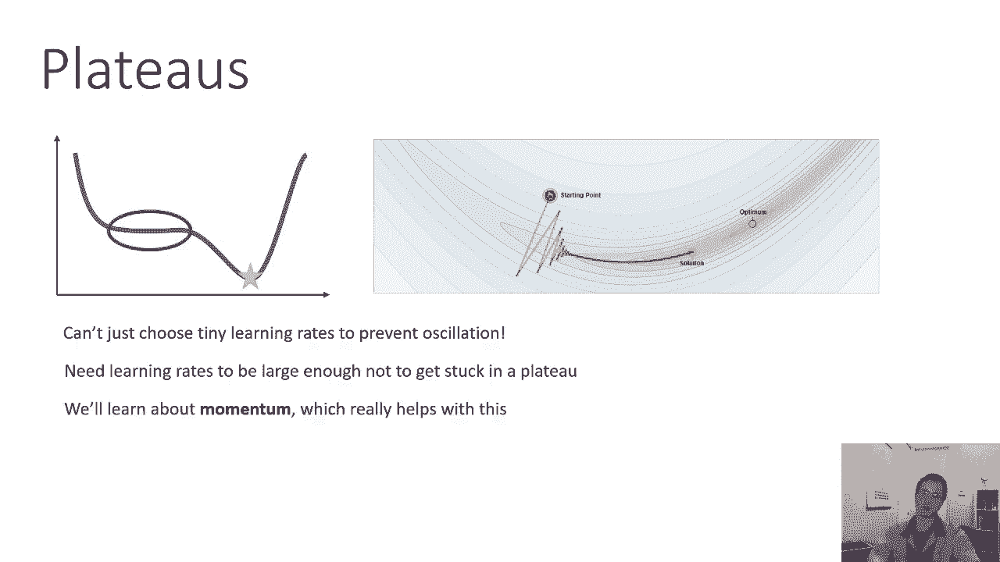

### 3. 鞍点
鞍点在一维函数中不存在，但对于更高维的函数，鞍点实际上相当常见。鞍点可以看作是某些维度上的局部最小值，同时是其他维度上的局部最大值。在鞍点处，关于函数各维度的偏导数为零，但函数在某些维度上增加，在其他维度上减少。

一个二维鞍点的可视化显示在左图中间。我显示了一个表示梯度向量的抖动图。当你远离鞍点时，梯度箭头指向正确的方向（函数减少的方向）。但当你靠近鞍点时，梯度消失，变得非常非常小。这意味着即使你最终会离开鞍点，当你接近它时，你只能迈出非常微小的步伐，就像一个非常糟糕的高原。

右图上的绿线显示了梯度流，即梯度下降遵循的轨迹。当它越来越接近鞍点时，梯度下降开始变得非常缓慢。

你可能会认为这是一个深奥的问题：有多大几率恰好落在梯度在某些方向减少、在其他方向增加的点上？在低维度中，这似乎不太可能。但事实上，神经网络损失景观中最关键的点就是鞍点。这是因为在高维空间中，事情的工作方式与低维空间不同。

---

## 高维空间中的临界点

让我们先多谈谈这个概念。什么是临界点？临界点是梯度为零的任何点，即 `l(θ)` 关于 `θ` 每一维的所有偏导数都为零。

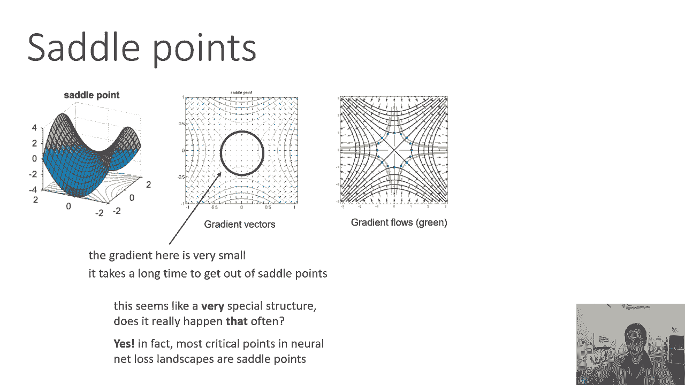

临界点有不同的类型（局部最小值、局部最大值、鞍点）。判断方法是通过看二阶导数。

在一维中，如果你处于临界点：
*   二阶导数为正：图形向上弯曲，你是局部最小值。
*   二阶导数为负：图形向下弯曲，你是局部最大值。

在更高维度中，你可以有一些二阶导数为正，一些为负。通常，我们构造一个称为**海森矩阵**的矩阵。海森矩阵基本上是梯度的二阶导数等价物。梯度是一个向量，每个分量都是关于 `θ` 相应维度的一阶偏导数。海森矩阵是一个矩阵，其中每个项都是关于 `θ` 中两个分量的二阶偏导数。

在鞍点处的海森矩阵，其对角线项对于某些维度是正的，对于其他维度是负的。例如，对于一个二维函数，海森矩阵可能是 `[[1, 0], [0, -1]]`。这意味着沿一个维度的二阶导数为正，沿另一个维度的二阶导数为负。

对于一个局部最小值或最大值，所有的对角线条目都是同号的（或更一般地，矩阵是正定或负定的）。

现在想象一下在更高维度会发生什么。在更高维度中，海森矩阵有许多条目（例如 1000x1000）。所有对角线条目都具有相同符号的情况有多频繁？对于一个二维函数，两者都是正或都是负似乎很有可能。但在更高维度中，似乎不太可能每一个对角线条目都是正的或每一个都是负的。

因此，在高维空间中，大多数临界点实际上是**鞍点**。这实际上有点令人惊讶，如果你只考虑二维函数的直觉。但在高维中，只是不太可能所有的条目都有相同的符号。这就是为什么在高维中，大多数梯度为零的点实际上是鞍点。

---

## 我们应该朝哪个方向优化？

在我们谈论最陡下降（梯度下降的作用）之前，我们需要考虑在这些复杂的神经网络损失景观中，我们如何找到改进的方向，带领我们绕过所有的“龙和怪物”（局部最优、高原、鞍点），最终达到最优解。

记住，我们并不总是朝着最优的方向前进。如果我们选择最陡下降方向，由于振荡、高原和鞍点，我们会遇到各种各样的问题。我们想要的是不要来回摆动，而是找到一个更好的方向，一个更直接地走向最优解的方向。

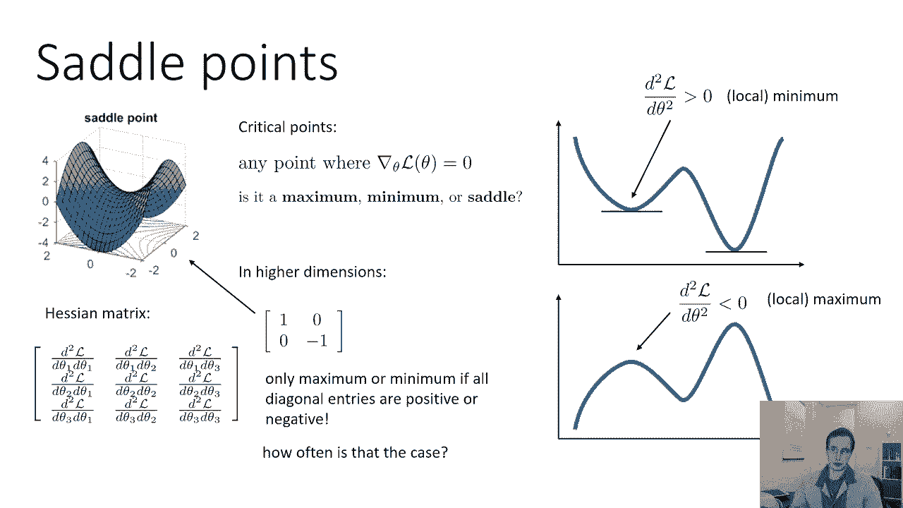

---

## 总结

在本节课中，我们一起学习了：
1.  **梯度下降法的基本原理**：通过计算损失函数的梯度（偏导数向量），并沿其反方向以一定学习率更新参数，以最小化损失。
2.  **梯度下降的局限性**：最陡下降方向不总是最优方向，可能导致振荡、收敛缓慢，尤其是在狭窄山谷中。
3.  **损失函数的性质**：凸函数具有良好的优化特性（单一全局最优），逻辑回归的损失是凸的，但神经网络的损失景观通常是非凸的。
4.  **神经网络损失景观的关键挑战**：
    *   **局部最优**：对于大型神经网络，局部最优的损失值往往与全局最优相近，问题相对不严重。
    *   **高原**：梯度很小的平坦区域，会显著减慢优化速度。
    *   **鞍点**：在高维损失空间中，大多数梯度为零的点是鞍点（某些维度上最小，其他维度上最大），梯度在鞍点附近消失，导致优化停滞，这是非常严重的问题。
5.  **高维空间的特点**：在高维空间中，鞍点远比局部最小值或最大值普遍。

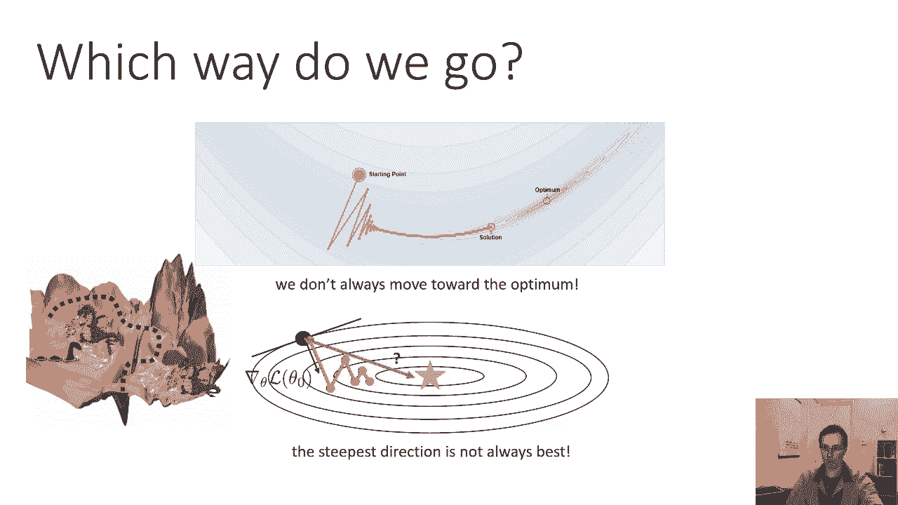

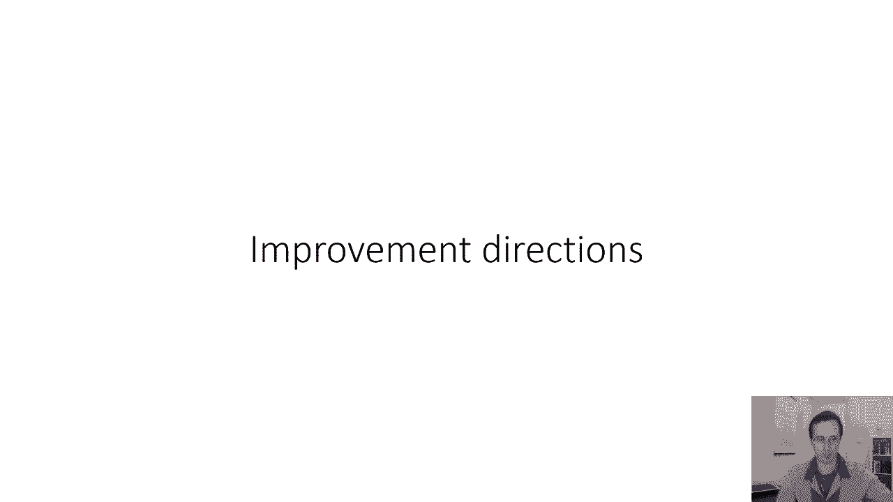

在接下来的部分，我们将探讨如何改进基础的梯度下降法，例如引入动量等技巧，以更好地应对这些挑战。