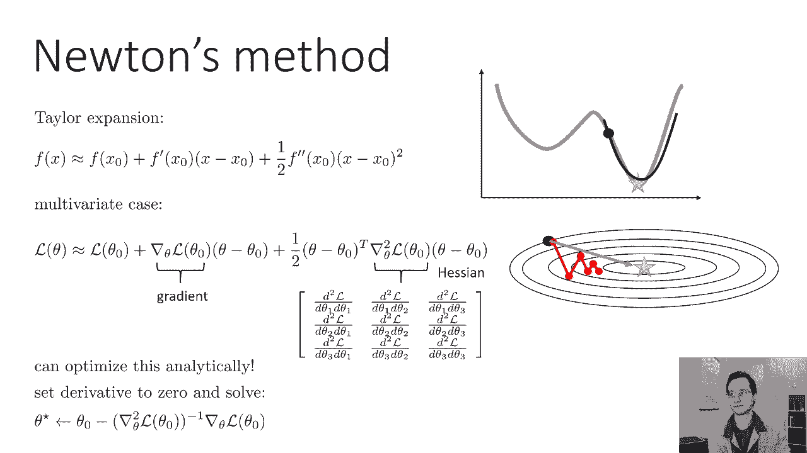
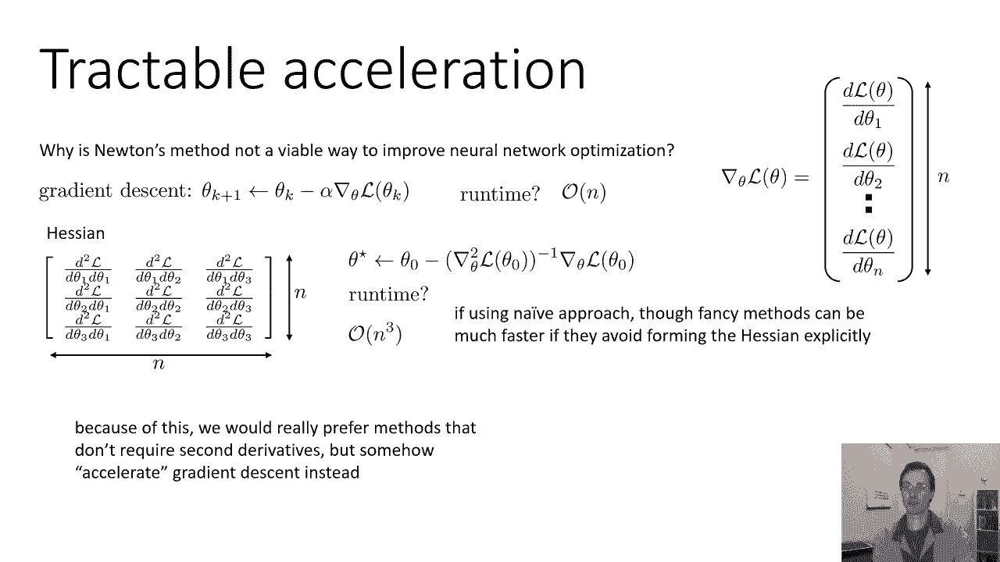
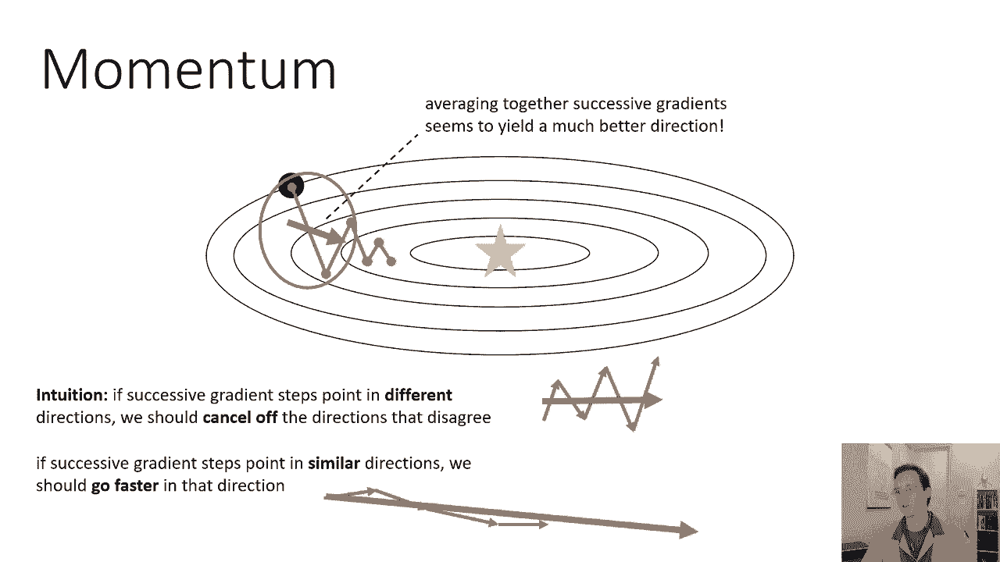
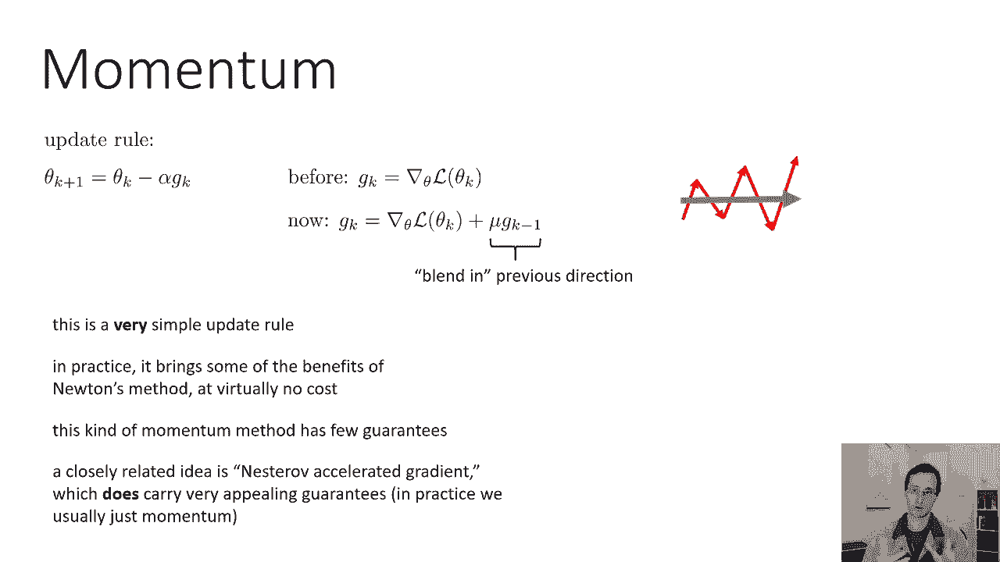
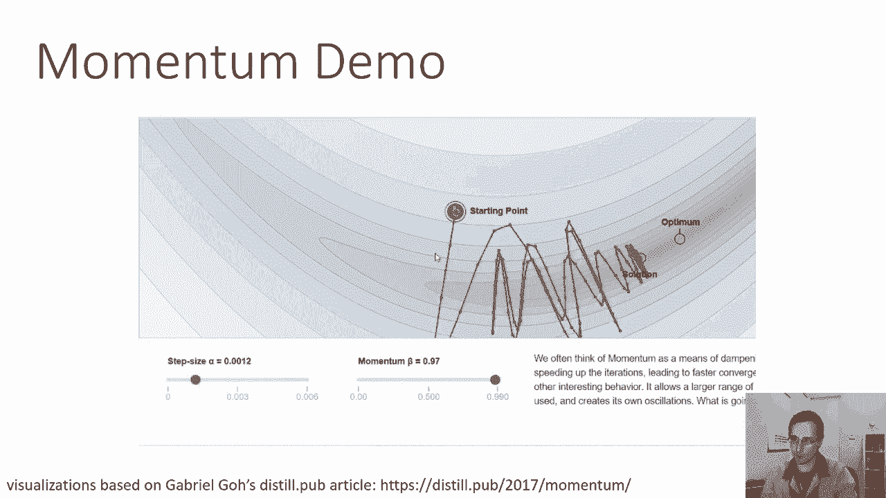
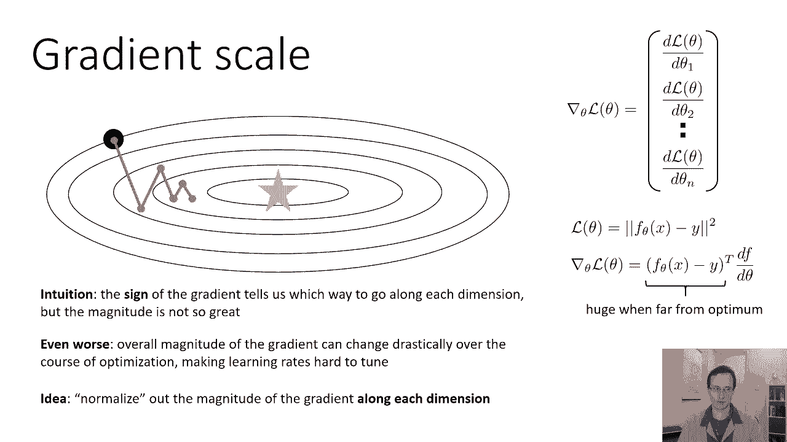
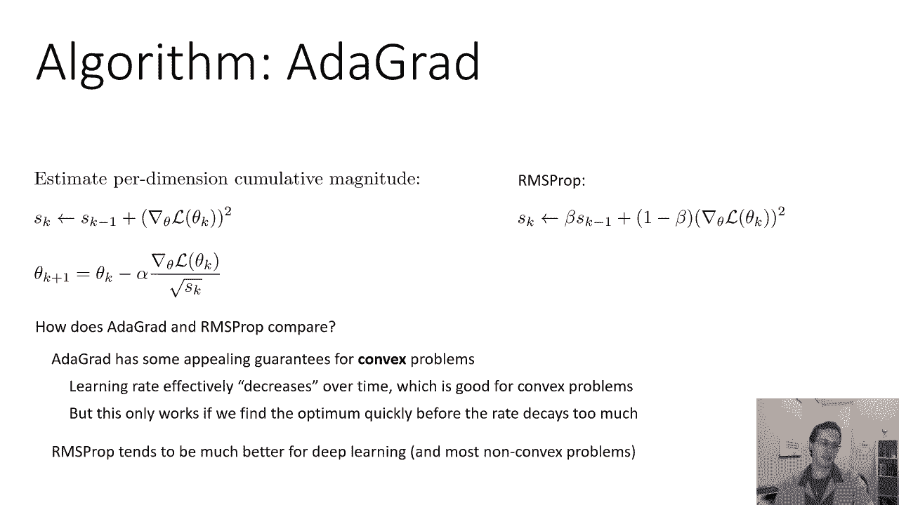
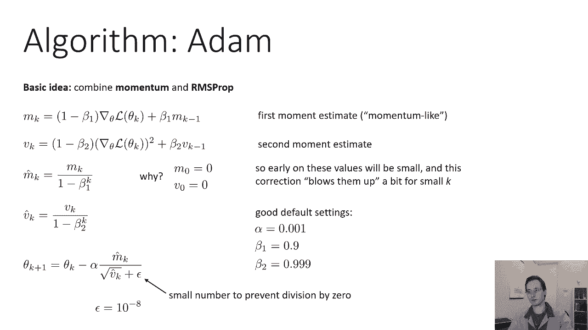

# 12：CS 182 - 第四讲 - 第二部分 - 优化 🚀

在本节课中，我们将要学习几种改进梯度下降的优化算法。我们将从牛顿法这一理想但计算昂贵的算法开始，然后探讨几种在实际深度学习中被广泛使用的、更高效的算法，包括动量、RMSprop 和 Adam。这些方法旨在加速收敛并更稳定地找到损失函数的最小值。

## 牛顿法：一个理想但昂贵的方向 🔍

上一节我们介绍了梯度下降及其局限性。本节中我们来看看一种理论上更优的改进方向计算方法——牛顿法。

牛顿法是一种比梯度下降更复杂的优化算法。它对于近似椭圆形的函数，能直接指向最优解。然而，在训练神经网络时，我们通常不会使用牛顿法，因为它需要计算海森矩阵（Hessian matrix，二阶导数矩阵）及其逆矩阵，计算量非常巨大，对于参数数量庞大的神经网络来说是不可行的。

牛顿法的核心思想是利用函数的泰勒展开式进行局部近似。对于一个函数 \( f(x) \)，在点 \( x_0 \) 处，我们可以用其二阶泰勒展开来近似：
\[
f(x) \approx f(x_0) + f'(x_0)(x - x_0) + \frac{1}{2} f''(x_0)(x - x_0)^2
\]
这相当于用一条抛物线来局部近似原函数。

对于多变量损失函数 \( L(\theta) \)，其近似形式为：
\[
L(\theta) \approx L(\theta_0) + \nabla L(\theta_0)^T (\theta - \theta_0) + \frac{1}{2} (\theta - \theta_0)^T H (\theta - \theta_0)
\]
其中，\( \nabla L(\theta_0) \) 是梯度，\( H \) 是海森矩阵。这个二次函数的最小值可以通过求导并令其为零来解析求解，得到牛顿法的更新规则：
\[
\theta^* = \theta_0 - H^{-1} \nabla L(\theta_0)
\]
这个更新规则看起来很像梯度下降（\( \theta_{new} = \theta - \alpha \nabla L(\theta) \)），只是用逆海森矩阵 \( H^{-1} \) 对梯度进行了变换。

牛顿法的主要问题在于计算成本。对于一个有 \( n \) 个参数的模型，梯度计算复杂度约为 \( O(n) \)，而海森矩阵是 \( n \times n \) 的，计算其逆矩阵的复杂度高达 \( O(n^3) \)。对于现代大型神经网络（参数可达数十亿），这是不可行的。虽然存在一些技巧可以避免显式构建整个海森矩阵，但这些方法通常非常复杂，在实践中并不常用。

## 动量：平滑更新方向 ⚡

由于牛顿法不实用，我们需要寻找其他能在保持 \( O(n) \) 计算复杂度的同时加速梯度下降的方法。首先介绍的方法是动量。

动量的直觉来源于物理：如果一个球在碗中滚动，它具有惯性，会平滑掉路径上的振荡。在优化中，如果连续的梯度更新方向不一致（例如在狭窄山谷中振荡），将它们平均起来可以得到一个更指向谷底的方向。如果方向一致，则动量会加速朝该方向前进。

动量法的更新规则如下：
\[
\begin{aligned}
g_k &= \nabla L(\theta_k) \\
m_k &= \mu m_{k-1} + g_k \quad \text{(其中 } \mu \text{ 是动量系数，如 0.9)} \\
\theta_{k+1} &= \theta_k - \alpha m_k
\end{aligned}
\]
这里，\( m_k \) 是“动量”项，它累积了过去的梯度信息，\( \mu \) 决定了保留多少历史信息。这个规则计算简单，只需额外存储一个动量向量 \( m \)，几乎不增加计算开销。

动量法是一种启发式改进，没有很强的理论保证。一个更有理论依据的变体是 Nesterov 加速梯度，它在凸优化问题上有更好的收敛保证。但由于本课程聚焦深度学习实践，我们主要使用标准的动量法。

## 自适应学习率与梯度缩放 📏

梯度下降的另一个问题是不同维度上梯度的尺度可能差异很大。梯度的符号（正负）告诉我们每个维度应该朝哪个方向移动，但其大小（绝对值）提供的信息较少，且在整个优化过程中可能剧烈变化，使得学习率 \( \alpha \) 难以调整。

例如，在使用平方误差损失时，梯度包含 \( (f(x) - y) \) 项。当预测误差很大时，梯度也很大，容易越过最优点；当接近最优时，梯度又变得很小，进展缓慢。

为了解决这个问题，我们希望归一化每个维度上的梯度步长，使其大致处于同一量级。以下是两种常用的方法。

### RMSprop

RMSprop（均方根传播）算法估计每个维度上梯度大小的移动平均值，并用它来缩放当前梯度。

以下是 RMSprop 的更新步骤：
1.  计算当前梯度 \( g_k = \nabla L(\theta_k) \)。
2.  更新梯度平方的移动平均 \( s_k \)：
    \[
    s_k = \beta s_{k-1} + (1 - \beta) g_k^2
    \]
    （这里 \( g_k^2 \) 表示逐元素平方，\( \beta \) 是衰减率，如 0.9）。
3.  更新参数：
    \[
    \theta_{k+1} = \theta_k - \frac{\alpha}{\sqrt{s_k + \epsilon}} \cdot g_k
    \]
    （\( \epsilon \) 是一个很小的数，如 \( 10^{-8} \)，防止除以零）。

这样，每个维度的更新步长都被其历史平均幅度所归一化。

### Adagrad

Adagrad 是另一个自适应学习率算法，它与 RMSprop 类似，但累积的是梯度平方的**总和**，而非移动平均。

以下是 Adagrad 的更新步骤：
1.  计算当前梯度 \( g_k = \nabla L(\theta_k) \)。
2.  累积梯度平方和 \( s_k \)：
    \[
    s_k = s_{k-1} + g_k^2
    \]
3.  更新参数：
    \[
    \theta_{k+1} = \theta_k - \frac{\alpha}{\sqrt{s_k + \epsilon}} \cdot g_k
    \]

Adagrad 对凸优化问题有很好的理论保证。然而，对于非凸问题（如神经网络训练），由于 \( s_k \) 随时间单调递增，导致有效学习率持续下降，可能在到达平坦区域后变得过小，从而停止进展。相比之下，RMSprop 因为使用移动平均（会遗忘久远的历史），在非凸问题上通常表现更好。

## Adam：结合动量与自适应学习率 🤖

最后，我们介绍 Adam（自适应矩估计）算法，它结合了动量（一阶矩估计）和 RMSprop（二阶矩估计）的思想，是当前深度学习中最流行的优化器之一。

以下是 Adam 算法的完整步骤：
1.  计算当前梯度：\( g_k = \nabla L(\theta_k) \)。
2.  更新有偏一阶矩估计（动量）：
    \[
    m_k = \beta_1 m_{k-1} + (1 - \beta_1) g_k
    \]
3.  更新有偏二阶矩估计（梯度平方的移动平均）：
    \[
    v_k = \beta_2 v_{k-1} + (1 - \beta_2) g_k^2
    \]
4.  计算偏差校正（为了缓解初始估计值为零带来的冷启动问题）：
    \[
    \begin{aligned}
    \hat{m}_k &= \frac{m_k}{1 - \beta_1^k} \\
    \hat{v}_k &= \frac{v_k}{1 - \beta_2^k}
    \end{aligned}
    \]
5.  更新参数：
    \[
    \theta_{k+1} = \theta_k - \frac{\alpha}{\sqrt{\hat{v}_k} + \epsilon} \cdot \hat{m}_k
    \]

在实践中，Adam 的常用超参数设置为：学习率 \( \alpha = 0.001 \)，\( \beta_1 = 0.9 \)，\( \beta_2 = 0.999 \)，\( \epsilon = 10^{-8} \)。\( \beta_2 \) 通常比 \( \beta_1 \) 更接近 1，因为梯度大小的估计需要比梯度方向（动量）更稳定的历史信息。

---

本节课中我们一起学习了从牛顿法到 Adam 的一系列优化算法。我们了解到，虽然牛顿法提供了理想的方向，但其计算成本过高。因此，实践中我们使用动量来平滑更新方向，并使用如 RMSprop 和 Adam 等算法来自适应地调整每个维度的学习率，从而更高效、更稳定地训练深度神经网络。Adam 因其出色的性能，已成为许多深度学习任务的首选优化器。