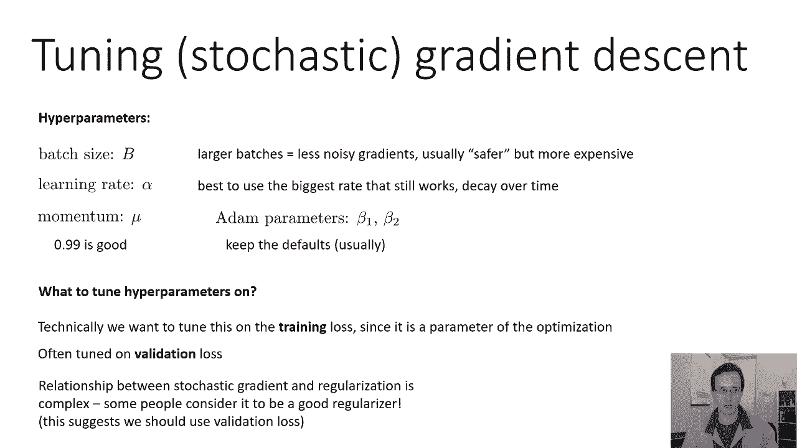

# 13：CS 182 - 第4讲 - 第3部分 - 优化 🚀

在本节课中，我们将要学习随机优化方法，特别是**随机梯度下降**及其变体。我们将了解为什么传统的梯度下降方法在处理大规模数据集（如深度学习中的常见情况）时效率低下，并学习如何通过使用数据子集（小批量）来加速优化过程。我们还将讨论如何调整学习率等超参数以获得最佳性能。

---

## 从批量梯度下降到随机梯度下降

上一节我们介绍了利用动量和自适应方法（如RMSprop）来加速梯度下降。然而，所有这些版本的梯度下降在实际的深度学习中仍面临挑战。

假设我们使用负对数似然损失函数。计算损失函数通常需要对训练集中的所有数据点求和。在深度学习中，数据集往往非常庞大，例如ImageNet训练集有约150万张图像。如果每次参数更新都需要对所有图像求和，计算将极其耗时，而有效优化神经网络可能需要数百万次梯度更新，这令人望而却步。

我们可以认识到，损失函数实际上是**对期望值的基于样本的估计**。具体来说，损失总和 `L(θ) = Σ L_i(θ)` 是对数据分布下期望损失 `E[L(θ)]` 的一个无偏估计。基于样本的期望估计对于任何数量的样本都是无偏的。使用更少的样本会得到一个噪声更大的估计，但它仍然是**无偏的**，这意味着如果多次重复此过程并取平均，我们会得到正确的答案。

因此，为了让梯度下降在计算上更快，我们可以简单地每次更新只使用训练集的一个子集。我们选择一个大小为 `B` 的样本子集（其中 `B` 远小于总样本数 `M`），计算这些样本上的平均梯度。当然，如果我们只固定使用这一个子集，就会浪费大部分数据。所以，我们可以在**每个梯度步骤**都选择一个新的、随机的子集。这样，我们用少量样本估计的梯度会围绕真实梯度波动，并带有一些噪声，但其期望值是正确的。

---

## 小批量随机梯度下降的工作原理

以下是**小批量随机梯度下降**的基本步骤：

1.  **采样小批量**：从整个训练集 `D` 中随机采样一个大小为 `B` 的子集 `B`。通常，`B` 可能是32、64或256，远小于总数据量（例如150万）。
2.  **计算近似梯度**：使用这个小批量数据估计损失函数的梯度。公式如下：
    `g ≈ (1/B) * Σ ∇L_i(θ)`，其中求和是在小批量 `B` 中的所有样本 `i` 上进行的。
3.  **执行参数更新**：使用这个近似的梯度 `g` 进行梯度下降更新：`θ = θ - η * g`，其中 `η` 是学习率。

你可以将上一节中介绍的所有技巧（如动量、Adam等）应用到这里，只需用这个近似的梯度 `g` 替换掉完整的梯度即可。

---

## 实践中的高效实现：数据洗牌

理论上，随机梯度下降要求每一步都从数据集中**独立随机采样**一个新的小批量。然而，在实践中，由于随机内存访问速度较慢，这会破坏缓存一致性，影响效率。

更高效的做法是：**预先将整个数据集随机打乱一次**。然后，按顺序从这个打乱后的数据集中抽取小批量。例如，第一次取前 `B` 个样本，第二次取接下来的 `B` 个样本，依此类推。当遍历完整个数据集后，再从头开始循环。

从技术上讲，这与“每一步都独立随机采样”不完全相同，因为你会在多个周期（Epoch）中以相同的顺序看到数据点。但由于初始顺序是随机的，在实践中效果同样好，且计算效率更高。这就是我们在实际编程项目和深度学习中普遍使用的方法。

---

## 学习率的选择与调整

现在我们有了完整的优化方法（如带动量的小批量SGD或Adam），接下来讨论如何调整这些算法的**学习率**。

在下图中，纵轴代表训练损失，横轴代表**周期数**。一个周期（Epoch）是指算法完整遍历整个数据集一次。对于随机梯度下降，由于每一步只使用部分数据，完成一个周期需要很多个梯度步骤（总数据量 / 小批量大小）。

*   **红色曲线**：展示了学习率设置恰当时，训练损失随周期下降的理想情况。
*   **绿色曲线**：损失下降得非常缓慢。这表明学习率**设置得过低**。在深度学习中，过低的学习率不仅导致优化慢，还可能使模型陷入较差的局部最优或高原，无法达到好的效果。
*   **黄色曲线**：初期下降很快，但随后停滞在一个较高的损失值上。这表明学习率**设置得过高**。过高的学习率会导致参数更新步长过大，在最优解附近反复震荡甚至发散，无法收敛到精细的最优解。

一个自然的想法是：**能否在开始时使用较高的学习率快速下降，后期切换到较低的学习率进行精细调整？** 答案是肯定的，这种策略被称为**学习率衰减**。

下图展示了在ImageNet上训练AlexNet时，采用学习率衰减策略的效果（纵轴是准确率，越高越好）。他们定期（例如每训练一段时间）将学习率除以10。可以看到，每次学习率下降后，模型性能（准确率）都能突破之前的平台期，得到进一步提升。

因此，为了获得最佳性能，为带动量的SGD设置一个**学习率衰减计划**是非常常见的策略。对于Adam等自适应优化器，通常不需要学习率衰减也能工作得很好，但尝试使用也可能带来提升。

---

## 超参数调优指南

随机梯度下降及其变体引入了更多需要调优的超参数。以下是调优要点：

以下是需要调整的主要超参数及其一般准则：

*   **批量大小 `B`**：较大的批量能提供噪声更小的梯度估计，通常更稳定，可能得到更好的解，但计算成本更高（需要更多内存）。有时受限于硬件（如显存），只能使用较小的批量。一些研究发现在特定任务（如GANs）中，非常大的批量可能带来益处。通常，批量大小的选择是计算效率与梯度估计质量之间的权衡。
*   **学习率 `η`**：这是最关键的超参数之一。对于SGD（无动量或带动量），你需要仔细调整。**原则是：使用你能使用的最大学习率，只要它不导致训练不稳定（震荡或发散）**。对于深度学习，较大的有效学习率通常优于过小的学习率。同时，配合学习率衰减计划往往能取得更好效果。对于Adam，通常可以使用默认学习率（如0.001）作为起点。
*   **动量参数 `β`**：对于带动量的SGD，动量系数通常设置为0.9或0.99附近。需要根据具体问题稍作调整。
*   **Adam的参数 `β1`, `β2`**：通常保持其默认值（如0.9和0.999）即可，调整它们带来的收益通常不大。

---

## 根据什么指标进行调优？

从原理上讲，优化算法的超参数（如学习率、批量大小）主要影响**训练损失**的优化过程，它们本身不是正则化器。因此，传统上应根据**训练损失**的下降情况来调整这些参数。

然而，优化和泛化之间存在复杂的关系。最近的研究表明，**随机梯度下降本身具有一定的正则化效果**。直觉是：当模型开始过拟合时，不同小批量数据计算出的梯度方向会差异很大。这种噪声实际上可能阻止模型过度拟合训练数据，从而提升泛化能力。

因此，在实践中，许多人也会根据**验证集损失**来调整优化器的超参数。这样做很方便，并且可能间接地帮助找到既利于优化又利于泛化的超参数设置。

---

## 算法选择建议

*   **如果你刚入门或想快速实现**：使用 **Adam** 优化器。它通常对学习率不那么敏感，更容易调优，是一个不错的默认选择。
*   **如果你追求最佳性能并愿意精细调优**：考虑使用 **带动量的SGD**，并为其设计一个**学习率衰减计划**。许多从业者认为，经过良好调优的带动量SGD能够达到甚至超过Adam的最终性能。

---

本节课中我们一起学习了随机优化的核心思想。我们了解了为什么需要从小批量数据中估计梯度，掌握了小批量随机梯度下降的算法步骤及其高效实现方式（数据洗牌）。我们深入探讨了学习率的重要性，学习了如何通过观察损失曲线判断学习率设置是否合适，并介绍了学习率衰减策略。最后，我们总结了关键超参数的调优指南，并对不同优化算法的适用场景给出了建议。掌握这些知识将帮助你更有效地训练深度学习模型。